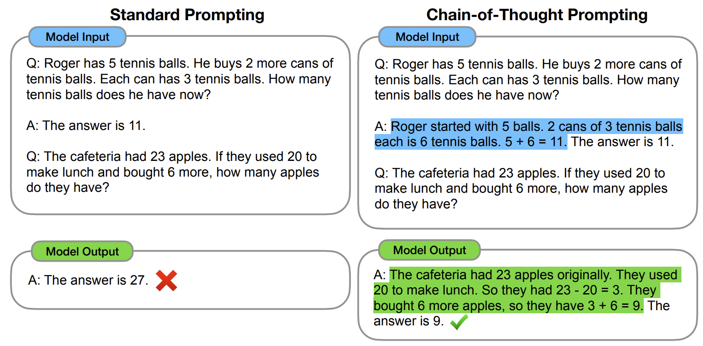
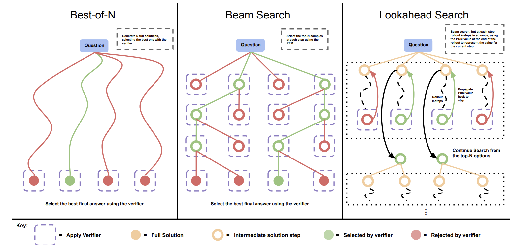

<!--Copyright © ZOMI 适用于[License](https://github.com/Infrasys-AI/AIInfra)版权许可-->

# 03. Inference Time Scaling

> Author by：侯宇博

推理端的 scaling law 更关注 推理延迟、显存、计算复杂度随模型规模和上下文长度变化的规律。其中 Inference/test time scaling，其核心思想是在模型推理（Inference）阶段，通过投入更多计算资源以生成更多的输出 token，进而增强模型的逻辑推理（Reasoning）能力。

该方法的基本原理在于，生成单个 token 的过程（即一次模型前向传播）所包含的计算量是固定的。对于需要多步逻辑推演的复杂问题，模型无法在单次计算中完成求解。因此，必须通过生成一系列包含中间步骤的文本（即更多的 token），来逐步展开其“思考”过程，从而解决问题。

那么有哪些方法可以帮助模型产生中间推理步骤呢？

## 1 优化推理输入：思维链提示

思维链提示（Chain-of-Thought Prompting）通过在少样本示例中展示一系列中间推理步骤，而不仅仅是最终答案，来引导大型语言模型在解决问题时，也自主地生成类似的“思考过程”，从而释放其内在的复杂推理潜力。

然而，思维链提示需要为特定任务精心设计推理示例，这限制了其通用性与易用性。一个自然而然的问题是：能否让模型在没有任何范例的情况下，仅根据问题本身就自动生成思维链？

## 2 通过后训练优化推理能力

为了让模型能自主生成更高质量的推理过程，研究者们首先尝试在包含推理轨迹的数据集上进行监督微调（SFT），以引导模型产生中间推理步骤。
进一步地，为提升每个推理步骤的准确性，研究者们引入了过程监督奖励模型（Process-supervised Reward Model, PRM）。PRM 负责对推理链中的每一步进行打分，从而精细地评估其质量，并据此指导模型生成更优的推理路径。这种指导作用主要体现在两个方面：数据筛选与推理时优化。

### 2.1 数据筛选与模型迭代
通过对模型生成的推理路径进行评分，可以筛选出高质量的推理数据，用于下一阶段的模型训练，从而实现性能的持续迭代优化。

### 2.2 推理时决策优化
在推理阶段，可以让模型针对同一问题生成多个候选答案（即推理路径），并利用 PRM 从中选择评分最高的一条作为最终输出。这个过程通常依赖于特定的搜索算法来高效地探索可能的推理空间。下面介绍三种常用的搜索方案。

#### 2.2.1 最优解采样（Best-of-N）
该方法首先针对一个给定的问题，独立采样生成 N 个完整的解答（推理路径）。随后，PRM 对这 N 个解答的每一步进行评估并计算累积得分。最终，选择总分最高的那个解答作为最终输出。

#### 2.2.2 集束搜索（Beam Search）
这个方法在推理的每一步都维持一个包含 M 个候选路径（即“集束”）的集合。具体来说，从问题开始，模型首先生成 N 个可能的“第一步”推理。PRM 对这 N 个第一步进行评分，并保留得分最高的 M 个。在下一步中，从这 M 个路径出发，各自再生成 N 个后续步骤，并再次进行评分和筛选，始终保持集束大小为 M。这个过程不断迭代，直到生成完整的解答。

#### 2.2.3 前瞻搜索（Lookahead Search）
前瞻搜索的核心思想是通过“预演”未来的推理步骤来评估当前步骤的优劣。在选择“第一步”时，算法会先生成 N 个候选步骤。对于每个候选，它会继续向前探索生成 K 个后续步骤（形成一条短路径）。然后，PRM 仅评估这条短路径的最终状态（最后一个step）。得分最高的 M 个最终状态所对应的“第一步”被认为是最佳选择并被保留下来。算法从这些被选中的步骤出发，重复此过程，直到构建出完整的解答。

### 2.3 强化学习指导的推理

以上介绍的方法对模型推理能力的提升有限。PRM依赖对中间步骤的细粒度奖励，但标注成本高且易受奖励劫持（Reward Hacking）影响。
而搜索算法在复杂任务中面临搜索空间爆炸问题，难以规模化。

OpenAI 的 o1 系列模型通过增加思维链推理过程的长度来提升推理能力，但并没有公开训练方法。以上的方法中还没有一种能够达到与 OpenAI 的 o1 系列模型相当的一般推理性能。

[Inference-Time Scaling for Generalist Reward Modeling](https://arxiv.org/abs/2504.02495)

## 3 Agent中的Inference Time Scaling

[Deep researcher with test-time diffusion](https://research.google/blog/deep-researcher-with-test-time-diffusion/)

## 参考资料

- [Chain-of-Thought Prompting Elicits Reasoning in Large Language Models](https://arxiv.org/abs/2201.11903)
- [Let's Verify Step by Step](https://arxiv.org/abs/2305.20050)
- [Scaling LLM Test-Time Compute Optimally can be More Effective than Scaling Model Parameters](https://arxiv.org/abs/2408.03314)
- [Learning to reason with llms](https://openai.com/index/learning-to-reason-with-llms/)
- [DeepSeek-R1: Incentivizing Reasoning Capability in LLMs via Reinforcement Learning](https://arxiv.org/abs/2501.12948)
- [Inference-Time Scaling for Generalist Reward Modeling](https://arxiv.org/abs/2504.02495)
- [Deep researcher with test-time diffusion](https://research.google/blog/deep-researcher-with-test-time-diffusion/)
