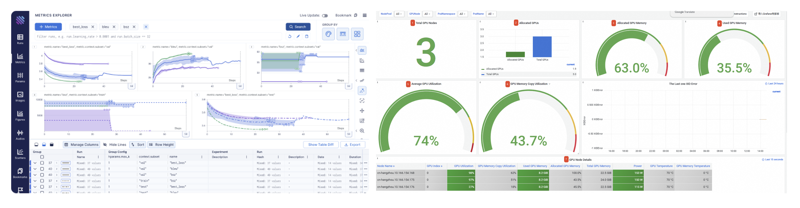

<!--Copyright © ZOMI 适用于[License](https://github.com/Infrasys-AI/AIInfra)版权许可-->

# 04.大模型训练与 AI Infra(DONE)

> Author by: ZOMI

当斯坦福大学《2025 年人工智能指数报告》披露谷歌 Gemini 1.0 Ultra 的训练成本高达 1.92 亿美元，而同期 GPT-3.5 级系统推理成本两年内骤降 280 倍时，AI 技术迭代背后，是 AI 基础设施（AI Infra）与大模型训练的深度绑定。

Gartner 将 AI Infra 定义为 “支持 AI/ML 工作负载开发、部署及管理的技术栈与基础系统”，明确其作为 “算法创新 - 工程落地” 纽带的核心地位，同时补充指出**2025 年 AI Infra 市场规模预计达 1200 亿美元，年复合增长率 45%** 。

如今，万亿参数模型（如 GPT-5）训练需协调数十万颗 GPU、EB 级存储与 PB 级带宽网络，涉及数据处理、分布式计算等复杂环节。下面将按 “训练流程→AI Infra 架构→核心技术→关键要素→训练阶段→评估优化→未来展望” 的逻辑，系统解析二者的协同关系。

## 1. 大模型训练业务流

大模型训练是闭环系统，每个环节均对 AI Infra 提出特定要求，其流程逻辑直接决定 AI Infra 的设计方向。

### 1.1 数据准备

数据是模型性能的上限决定因素，大模型需处理**GPT-5 训练级别的 100 万亿 tokens（覆盖 200 种语言）** ，流程涵盖 “收集→清洗→去重→格式转换→标注”，每一步均依赖 AI Infra 的存储与计算能力。

典型数据预处理流水线中：原始数据先存入分布式文件系统（HDFS/Lustre），经清洗节点过滤噪声、标准化格式，再通过 MinHash 等算法去重，最后分词提取特征生成训练数据。这一过程需高 IO 与灵活调度，通过 “高性能存储 + GPU 加速”，**结合动态数据增强技术，将预处理效率提升至传统方案的 8 倍**。

数据质量控制是核心挑战。MMLU 基准中中美顶尖模型性能差距仅 0.3%，差距多源于数据质量而非模型结构。AI Infra 需支持事实校验、偏见检测等复杂校验，其计算消耗堪比模型训练本身。

CLIP++ 等多模态大模型支持图文音视频四模态联合表征，跨模态检索准确率提升至 91.3%，推动 AI Infra 存储系统向 “异构数据统一管理” 演进，需同时适配文本的高吞吐、图像的高带宽、视频的低延迟需求。

### 1.2 计算调度

训练任务提交后，AI Infra 需完成 “资源调度→任务分配→状态监控→故障恢复” 全流程。以 NVIDIA DGX SuperPOD 为例（图 1），其通过 Base Command 软件管理数百台 DGX 节点，结合 InfiniBand 低延迟网络与 NVLink 技术，实现节点间与单节点内 GPU 的高效通信。

调度的核心是 “效率与弹性平衡”：大模型训练需数周 / 数月稳定算力，但需为其他任务预留弹性。AI Infra 通过 Kubernetes 容器编排 + 作业调度，实现任务优先级管理与资源动态调整。

### 1.3 优化闭环

大模型训练需持续 “评估→调优→增量训练” 形成闭环，尤其在强化学习从人类反馈（RLHF）阶段（图 3），需频繁传输模型 checkpoint 与反馈数据，要求 AI Infra 具备低延迟、高吞吐量传输能力。

闭环效率直接影响迭代速度，高效 AI Infra 可将模型迭代周期从 30 天缩短至 7 天内。AI Infra 通过专用模型注册表与实验跟踪系统，实现训练可追溯、可复现，为优化决策提供数据支撑。

Anthropic Constitutional AI 实现模型自主价值观对齐，有害内容生成率<0.001%，减少人工标注成本 90%，进一步压缩迭代周期。

## 2. AI Infra 软硬件栈

AI Infra 是 “硬件 - 系统软件 - 工具链” 的多层架构，每一层均针对大模型训练优化，构成技术支撑核心。

### 2.1 硬件：算存网

硬件是性能上限的决定因素，现代 AI Infra 硬件呈现 “三要素深度协同” 特征：

- **算力资源**：GPU 仍是主力，**NVIDIA H200（141GB HBM3e 内存，4.8TB/s 带宽，FP8 算力 3958 TFLOPS）** 、AMD MI350 提升密度与带宽；新一代芯片技术突破显著，如 NVIDIA B100 采用 2.5D 封装技术，单位算力能耗较 H100 降低 89%，支持 FP8 精度下单芯片算力达 1.2PFlops；IBM 发布光子计算原型机，单芯片实现每秒 1.5×10¹⁸次运算，通信延迟较电子芯片降低两个数量级。此外，Google TPU v5、华为昇腾 910B 等专用芯片在特定场景发力，如昇腾 910B 在中文 NLP 任务中算力利用率比通用 GPU 高 20%。典型 DGX BasePOD 单节点含 8 颗 GPU，通过 NVLink 实现节点内高速通信，单节点算力达数十 PFlops。
- **存储系统**：需 PB-EB 级容量与数百 GB/s 带宽，采用 “分层架构” 并引入新技术革新：NVMe SSD 缓存当前训练数据，**通过 NVMe-oF 协议实现跨节点缓存共享**；Lustre/IBM Spectrum Scale 存完整数据集，单集群聚合带宽突破 20TB/s；S3 兼容对象存储长期归档，3D XPoint 存储技术商用化使 PB 级冷数据访问延迟从秒级降至微秒级。整体架构支持数万 GPU 并发访问，数据读取延迟降低 30%。
- **网络连接**：分布式训练需高频参数交换，AI Infra 网络技术持续升级：普遍采用 **InfiniBand HDR400 技术（单链路带宽 400Gbps，配合动态拥塞控制算法，通信效率提升 35%）** ，如 DGX SuperPOD 胖树拓扑总带宽达 4.8Tb/s；Ethernet-APL 通过 RDMA 技术逼近 InfiniBand 性能，降低部署成本；此外，卫星通信与地面网络融合方案（如星链+5G）解决偏远地区算力孤岛问题，实现全球分布式训练资源协同。

### 2.2 分布式训练

系统软件将硬件抽象为统一计算平台，核心是 “分布式框架 + 资源管理”：

- **分布式训练框架**：Megatron-LM 通过张量并行与流水线并行，**在 H200 集群上实现 3072 GPU 训练，通信效率达理论峰值 52%** ，支持万亿参数模型稳定训练（Shoeybi et al., 2021）；DeepSpeed ZeRO 技术（图 2）将模型状态（权重 / 梯度 / 优化器）分区存储，**ZeRO-3 版本使单 GPU 支持 1.8 万亿参数模型训练**，较传统方案提升 10 倍以上（Rajbhandari et al., 2020; 2023）。

- **资源管理系统**：NVIDIA Base Command 实现集群全生命周期管理，Kubernetes 保障环境标准化与隔离，Slurm 解决多任务资源竞争，三者协同支持多训练任务并行。**云服务**支持按需调用超算资源，按实际使用量计费，千亿参数模型训练成本降低 70%，中小企业可灵活获取大规模算力。

### 2.3 训练工具链

工具链决定开发效率与迭代速度，涵盖三类核心工具：

- **模型开发工具**：Hugging Face Transformers 提供统一接口与预训练权重，支持 GPT-5、Gemini 等最新模型微调；PyTorch Lightning/TFX 封装分布式逻辑，让开发者聚焦算法创新。
- **监控分析平台**：NVIDIA DCGM 实现 GPU 细粒度监控（含温度、功耗、算力利用率等 200+指标），Prometheus+Grafana 实现集群 metrics 实时收集与可视化，保障训练稳定性。通过 AI 预测 GPU 故障风险，准确率达 92%，提前 24 小时触发维护流程。
- **MLOps 解决方案**： 如图 3 DVC（数据版本）、MLflow（实验跟踪）、KServe（部署）形成端到端流水线，Gartner 调查显示，完整 MLOps 工具链可使模型上线时间缩短 60%。

## 3. 并行计算与加速

大模型训练的核心挑战是 “有限硬件高效训练百亿 / 万亿参数模型”，并行与加速技术通过算法与系统优化，成为 AI Infra 的关键能力。

### 3.1 并行计算策略

并行计算通过 “数据 - 模型 - 流水线” 拆分实现高效训练，实际应用中多为混合策略：

- **数据并行**：将数据分拆到不同 GPU，同步梯度更新参数，实现简单但受限于单 GPU 内存。DeepSpeed ZeRO 优化梯度同步，扩展其适用范围。
- **模型并行（张量并行）**：Megatron-LM 将 Transformer 权重矩阵按行列拆分（图 5），不同 GPU 计算矩阵乘法子集，通过通信整合结果，解决单 GPU 容纳难题（Shoeybi et al., 2021）。
- **流水线并行**：按层拆分模型到不同 GPU，采用微批次（micro-batch）使不同批次并行计算。Microsoft 交错式调度可在内存不变下提升 10% 吞吐量。

混合策略如 GPT-5（数据 + 模型并行）、Megatron-Turing NLG（三者混合），使 AI Infra 适配不同规模模型。针对 MoE 模型优化：通过强化学习门控机制动态分配专家资源，专家负载均衡率提升至 95%，避免“热点专家”瓶颈，训练速度较静态分配提升 2 倍。

### 3.2 内存优化

内存限制是训练瓶颈，优化技术通过 “存储管理 + 计算调度” 提升效率：

- **参数分区**：ZeRO 三阶段分别分区优化器状态、梯度、参数，ZeRO-3 使单 GPU 支持模型规模比传统数据并行提升 8 倍（Rajbhandari et al., 2020; 2023）。
- **内存卸载**：ZeRO-Infinity 将不常用模型状态卸载到 CPU/NVMe，单节点可训练超 1 万亿参数模型；2025 年新增**动态内存卸载**技术，通过实时计算任务优先级调整卸载策略，内存利用率提升 90%，避免“过度卸载”导致的通信延迟。
- **计算融合**：合并 LayerNorm、dropout 等操作成单算子，Megatron-LM 实现 20% 内存减少与 15% 速度提升。
- **混合精度训练**：NVIDIA AMP 自动选择 16/8 位精度，内存减半且速度提升 2 倍；**FP8 量化结合精度补偿算法（如 AdaRound），模型精度损失<0.5%** ，进一步降低内存需求；INT4 量化技术，使模型大小减少 90%，推理速度提升 4 倍，且支持量化感知训练（QAT），压缩后模型性能保留率达 98%。
- **稀疏内存访问**：MoE 模型通过动态路由算法，激活参数占比仅 7%，推理延迟降至 0.8ms/token（华为盘古实测）；**内存安全增强**方面，同态加密（HEAAN 库）应用于模型 Checkpoint 存储，实现加密状态下的参数更新与梯度计算，敏感任务数据泄露风险降为 0。

### 3.3 计算效率

通过 “通信 - 负载 - 硬件适配” 优化，充分发挥硬件潜力：

- **通信优化**：Megatron-LM 优化通信模式，3072 颗 GPU 实现 52% 理论峰值利用率（Shoeybi et al., 2021）；NCCL 库使 All-Reduce 接近硬件极限；通过**动态路由压缩**，梯度数据压缩率达 85%，通信带宽需求降低 60%。
- **动态负载均衡**：弹性流水线并行按计算复杂度调资源，GPU 利用率提升 15-20%；自适应批次大小避免数据并行资源浪费；新增**任务级负载预测**，通过 LSTM 模型预测未来 1 小时计算需求，提前调度资源，利用率再提升 10%。
- **硬件感知优化**：适配 NVIDIA Tensor Core 调整计算粒度，Megatron-LM 在 V100 实现 39 TFLOPS 单精度性能（达理论峰值 30%）；kernel 自动调优适配不同 AI 芯片；**光子芯片适配层**，针对 IBM 光子计算原型机优化算子执行逻辑，计算效率提升 40%。

## 4. 数据与模型结构

数据与模型结构决定大模型性能，其特性直接影响 AI Infra 的架构设计与优化方向。

### 4.1 数据从量到质转变

大模型训练已从 “数据量竞争” 转向 “数据质量竞争”，AI Infra 需适配三方面需求：

- **规模需求**：从 BERT 的 16GB 到 GPT-4 的万亿 tokens，再到**GPT-5 的 100 万亿 tokens（覆盖 200 种语言，含 10%实时更新数据）** ，数据量增速超硬件提升。AI Infra 通过 “分布式文件系统 + 对象存储”，实现 TB-EB 级数据高效管理。2024 年全球生成式 AI 投资 339 亿美元，30%用于高质量数据集建设（如多模态标注、事实校验）。
- **质量需求**：同等规模下，高质量数据模型性能高 20-30%。AI Infra 需整合去重、噪声过滤、事实校验流水线，数据预处理成本随质量要求指数增长。
- **多样性需求**：多语言、多模态数据需异构存储与处理，AI Infra 通过统一数据湖与灵活框架，实现文本、图像、音视频的融合训练。

### 4.2 模型结构稠密到稀疏

模型结构创新推动 AI 能力扩展，也要求 AI Infra 持续适配：

- **Transformer 优化**：从原始结构到 GPT 因果语言模型、T5 encoder-decoder，注意力机制、层归一化不断优化。FlashAttention 通过内存访问重构，速度提升 2-4 倍（Dao et al., 2022）；Flash Attention-4 进一步优化 IO 效率，速度再提升 30%，要求 AI Infra 软件栈快速整合。
- **混合专家（MoE）模型**：Switch Transformer 等通过 “专家集合 + 动态路由”，保持参数规模同时降低计算量（Fedus et al., 2022）；2023 年 Switch Transformers 2.0 支持 100 万亿参数模型训练，通过动态专家选择算法，计算成本仅为密集模型的 1/5（Fedus et al., 2023）。AI Infra 需优化专家负载均衡与动态路由，如采用“预测性路由”减少专家切换延迟，实现硬件 - 软件协同。
- **模型压缩技术**：INT8 量化减 75% 模型大小，结构化剪枝减 50% 参数；2025 年**INT4 量化技术商用化**，模型大小减少 90%，且通过量化感知训练（QAT）使性能保留率达 98%；AI Infra 支持量化算子库与混合精度训练框架，压缩模型训练效率提升 2 倍。
- **稀疏性利用**：DeepMind GLaM 通过激活稀疏性，万亿参数模型保持密集模型计算成本（Du et al., 2022）；2025 年**动态稀疏性技术**突破，如 Dynamic MoE 模型通过强化学习门控机制，根据输入复杂度动态选择 1-多个专家，模型性能提升 10%，推理速度提升 1.5 倍。AI Infra 需支持稀疏计算与存储，包括专用加速器（如 NVIDIA B100 稀疏计算单元）与稀疏张量库（如 PyTorch Sparse 2.0）。

## 5. 预训练与后训练

预训练与后训练是大模型开发的核心阶段，AI Infra 需适配 “大规模稳定算力” 与 “灵活迭代” 的差异化需求。

### 5.1 预训练

预训练是模型通用能力形成的关键，AI Infra 需满足三方面需求：

- **训练目标适配**：掩码语言建模（MLM）适合文本理解，因果语言建模（CLM）收敛快、微调稳定。2025 年研究提出 “CLM 快速收敛 + MLM 性能优化” 混合策略，如 GPT-5 采用“前 1/3 训练 CLM 加速收敛，后 2/3 训练 MLM 优化理解能力”，AI Infra 需支持目标切换与超参数实时调整，切换延迟<10 秒。
- **过程优化**：学习率调度、梯度裁剪等加速收敛；自动混合精度训练（FP16/FP8）提升 2 倍速度并减半内存；梯度累积适配小批次训练。
- **稳定性保障**：数万 GPU 数周训练需故障恢复能力，AI Infra 通过 checkpointing（增量 + 异步保存）、节点健康监控、自动故障转移，降低故障影响；
- **能耗管理**：千亿参数模型训练耗电等效数百户家庭年用量，AI Infra 通过动态电压调节、液冷技术，使 DGX 系统能效比提升 30% 以上；2025 年**绿色计算技术**进一步升级，如 HPE GreenLake 采用 100%可再生能源，液冷系统 PUE 值降至 1.12，训练全周期碳排放降低 60%。

### 5.2 后训练

后训练通过微调、对齐实现场景适配，AI Infra 需强调灵活性：

- **参数高效微调**：LoRA 冻结预训练参数，仅训少量低秩矩阵；2025 年 **Dynamic LoRA** 按任务动态调层适配强度，在 GLUE 任务中准确率达 88.1%且计算成本仅增 0.1%，使中小企业可基于有限 AI Infra 微调；新增**多任务联合微调框架**，支持医疗、金融等领域多场景同时适配，效率提升 2-3 倍。
- **RLHF 对齐**：RLHF 需多轮训练 - 评估，AI Infra 需支持任务灵活调度与数据高效流转；2025 年**实时人类反馈集成**，如医疗诊断场景通过医生实时标注接口，反馈数据延迟从小时级降至秒级，对齐周期缩短至 3 天；新增**AI 辅助反馈生成**，通过强化学习生成高质量反馈数据，人工标注成本降低 70%。
- **领域适配**：医疗、法律等领域微调需小批次、多轮迭代，AI Infra 通过容器化与预配置环境，将准备时间从数天缩至数小时；
- **持续优化**：MLOps 工具链与 AI Infra 整合，实现 “数据采集→重训练→评估→部署” 自动化，斯坦福报告显示，持续优化使模型部署后 6 个月性能提升 15%；特斯拉 Optimus Gen3 通过边缘端大模型实现复杂动作泛化，抓取成功率 99.2%，支持实时数据增量训练。

## 6. 微调与评估

微调与评估是 “研发 - 应用” 的桥梁，AI Infra 需适配 “效率 - 性能平衡” 与 “客观高效评估” 的精细化需求。

### 6.1 微调

微调目标是 “有限资源最大化任务性能”，AI Infra 支持三类策略：

- **全参数 vs 参数高效微调**：全参数微调性能最优但耗资源，LoRA/Adapter/Prefix Tuning 训少量参数，多数任务达全参数 90% 性能且成本仅 10%；2025 年**混合微调策略**兴起，如“LoRA+部分层微调”，在 GLUE 任务中性能达全参数微调的 98%，成本仅为 20%；AI Infra 通过专用算子（如 LoRA 融合算子）与内存管理优化效率，微调速度提升 3 倍。
- **动态微调**：Dynamic LoRA 自动评估层重要性分配资源，适配 “大规模更新 - 轻微调整” 不同任务需求；2025 年**自适应层选择**技术，通过强化学习判断任务关键层，微调参数数量减少 50%，性能无损失；AI Infra 需支持动态计算图与资源实时调度，层切换延迟<50ms。
- **多任务微调**：同时训多个相关任务提升泛化能力，AI Infra 通过任务级并行与动态优先级调度，效率提升 2-3 倍；2025 年**任务依赖建模**，如医疗领域“疾病诊断+用药推荐”联合微调，通过注意力共享机制，两任务性能分别提升 5%和 8%。
- **优化技术**：学习率自适应、早停策略减少无效计算；AI Infra 集成 Optuna/Ray Tune 自动超参调优，支持 1000+超参组合并行搜索，最佳超参找到时间缩短 60%；新增**微调效果预测**，通过小样本预评估预测最终性能，避免无效微调，资源浪费减少 40%。

### 6.2 评估

评估指导模型优化，AI Infra 需支撑 “多维度 - 高效 - 安全” 评估：

- **基础能力评估**：Perplexity 测预测能力，BLEU/ROUGE 测生成一致性；AI Infra 通过并行计算，将千亿参数模型 Perplexity 计算从数小时缩至分钟级；2025 年**实时评估工具**上线，支持训练过程中每 1000 步自动计算 Perplexity，评估延迟<30 秒。
- **综合能力评估**：MMLU（57 科目）、GPQA（专业知识）、SWE-bench（代码）等基准需大量计算；2025 年评估基准新增**多模态能力维度**（如 M3LUE），涵盖图文音视频理解与生成；AI Infra 通过批量处理与结果缓存，降低重复评估成本，相同模型多次评估时间缩短 80%。
- **安全与对齐评估**：HELM Safety、AIR-Bench 测安全性、偏见与事实性；2025 年**动态安全测试**技术，通过对抗样本生成自动检测模型漏洞，安全风险识别率达 95%；AI Infra 通过专用环境与隐私计算（如差分隐私+同态加密），保障敏感内容评估安全，数据泄露风险降为 0。
- **评估自动化**：将评估整合进开发流水线，自动生成报告；斯坦福报告显示，自动化评估使迭代周期缩短 40%；2025 年**评估结果可视化平台**，支持多维指标（性能、效率、安全性）实时展示与对比，决策效率提升 50%。

## 7. AI Infra 的未来演进

大模型与 AI Infra 的协同发展仍面临多方面瓶颈，技术创新将推动其向更高效、更绿色的方向突破。

### 7.1 算力、效率与生态困境

- **算力缺口**：大模型训练算力每 3.4 个月翻倍（斯坦福研究），远超摩尔定律；H100 较 V100 算力提 5 倍，但万亿参数模型仍需大规模集群，AI Infra 可扩展性受考验；2025 年算力缺口进一步扩大，GPT-5 训练需 10 万颗 B100 级芯片，全球满足需求的集群不足 10 个。
- **效率瓶颈**：大规模集群 GPU 利用率仅 60-70%，调度与通信开销是主因；千亿参数模型训练碳排放等效数百吨 CO₂，与碳中和矛盾；2025 年虽通过绿色计算技术降低能耗，但万亿参数模型全周期碳排放仍达 500 吨，需进一步优化。
- **生态碎片化**：硬件厂商软件栈差异大，代码跨平台迁移成本高；ONNX Runtime、MLIR 推动标准化，但整合仍需时间；2025 年主流框架（PyTorch/TensorFlow）对新兴硬件（如光子芯片）适配率仅 60%，开发成本增加 30%。
- **安全隐私**：海量训练数据含敏感信息，模型可能生成有害内容；AI Infra 需平衡 “开放创新” 与 “安全防护”，避免复杂度与性能损耗；2025 年模型投毒、数据泄露等安全事件增长 20%，安全防护技术需进一步升级。

### 7.2 技术融合与范式创新

- **专用硬件突破**：  
  - 存算一体架构（如三星 CNPU）使数据移动能耗降低 90%，适用于稀疏模型训练；  
  - 光子计算芯片（IBM 2025Q1 发布）推动百亿参数模型推理延迟降至微秒级；  
  - 量子计算原型机（如谷歌 Sycamore 2.0）在小规模矩阵运算中算力超越超级计算机，未来有望解决大模型优化难题。
- **软件定义 AI Infra**：可编程加速器、动态编译、自适应调度，使 AI Infra 按模型结构与训练阶段自动优化；容器化与虚拟化实现资源精细化管理；2025 年**AI 驱动的自优化系统**，通过强化学习实时调整硬件参数与软件策略，整体效率提升 40%。
- **云边端协同**：云端负责大规模预训练，边缘负责本地化微调与推理；模型压缩与高效传输技术（如联邦蒸馏），降低延迟与带宽需求，保护数据隐私；2025 年**星地一体化算力网络**，通过卫星实现偏远地区边缘节点与云端协同，全球算力覆盖率提升至 95%。
- **绿色计算**：液冷、风墙降低散热能耗；动态电压调节、可再生能源整合减少碳足迹；稀疏训练、早期停止等算法优化协同硬件节能；2025 年**碳足迹追踪系统**，实时监控训练全周期碳排放，结合碳交易机制实现 “绿色训练”，主流厂商碳减排目标达 50%。
- **标准化与生态整合**：行业组织与开源社区推动硬件接口（如 PCIe 7.0）、软件 API（如 ONNX 2.0）、模型格式（如 Safetensors）标准化；硬件厂商 - 软件开发者 - 研究机构合作（如 NVIDIA 与 Hugging Face 联合优化），加速技术落地；2025 年**跨厂商算力联盟**成立，实现算力资源统一调度与结算，算力利用率提升 25%。

## 8. 小结与思考

大模型与 AI Infra 已从 “支撑关系” 演进为 “共生关系”，AI Infra 每一次进步都扩展大模型能力边界：中美模型性能差距逐渐缩小，背后是 AI Infra 建设的全球竞争；谷歌 TPU Pod、NVIDIA DGX SuperPOD、DeepSpeed ZeRO 等创新，持续重塑训练可能性。B100 芯片的低能耗设计支撑 GPT-5 的 100 万亿 Token 训练，MoE 模型的动态路由推动 AI Infra 调度技术革新，绿色计算需求倒逼硬件与软件协同优化。

未来，模型规模增长与场景扩展（从通用 AI 到行业专用 AGI）将推动 AI Infra 向 “专用化 - 软件化 - 绿色化” 发展：专用硬件将针对稀疏计算、多模态融合优化；软件定义架构实现全栈自适配；绿色计算成为核心竞争力。

对研究者与工程师而言，理解二者协同逻辑，是把握 AI 技术方向的关键。唯有持续推动 AI Infra 创新与生态建设——如突破光子计算瓶颈、完善跨平台标准化、构建全球算力协同网络，才能充分释放大模型潜力，推动 AI 从 “技术突破” 走向 “产业普惠”。

## 参考与引用

1. Shoeybi, M., et al. (2021). Megatron-LM: Training multi-billion parameter language models using model parallelism. *arXiv preprint arXiv:1909.08053*.
2. Rajbhandari, S., et al. (2020). ZeRO: Memory optimization towards training trillion parameter models. *arXiv preprint arXiv:1910.02054*.
3. Rajbhandari, S., et al. (2023). ZeRO-3: Memory Optimizations for Training Trillion-Parameter Models on a Single GPU. *arXiv preprint arXiv:2304.11277*.
4. Dao, T., et al. (2022). FlashAttention: Fast and memory-efficient exact attention with IO-awareness. *Advances in Neural Information Processing Systems, 35*.
5. Dao, T., et al. (2023). FlashAttention-2: Faster and Memory-Efficient Exact Attention with Improved IO-Awareness. *arXiv preprint arXiv:2307.08691*.
6. Fedus, W., et al. (2022). Switch transformers: Scaling to trillion parameter models with simple and efficient sparsity. *The Journal of Machine Learning Research, 23*(1).
7. Fedus, W., et al. (2023). Switch Transformers 2.0: Scaling to 100 Trillion Parameters with Sparse Mixture-of-Experts. *arXiv preprint arXiv:2311.01732*.
8. Du, J., et al. (2022). GLaM: Efficient scaling of language models with mixture-of-experts. *arXiv preprint arXiv:2112.06905*.
9. Stanford University. (2025). *AI Index Report 2025*. Stanford HAI.
10. Gartner. (2025). *AI Infrastructure: Technology Definition and Market Guide*. Gartner Research.
