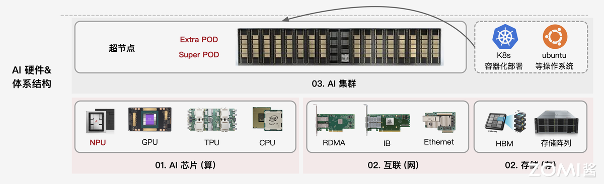
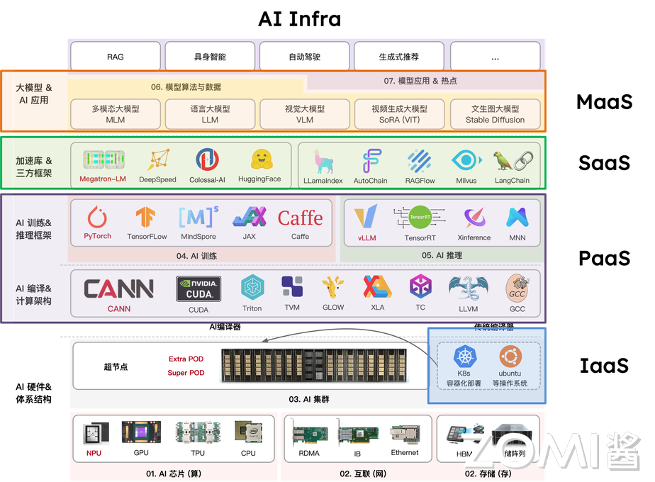
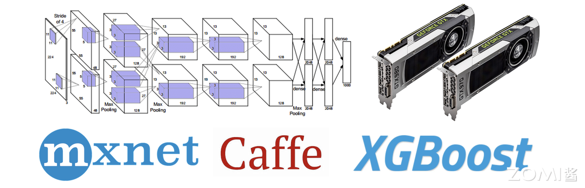
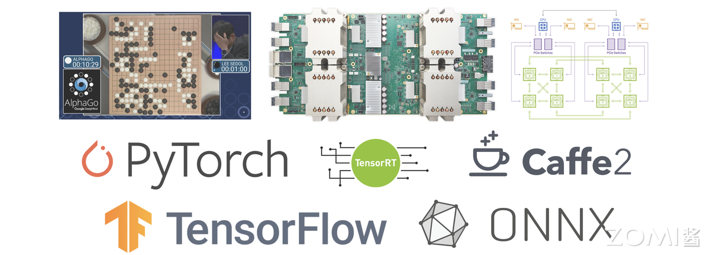
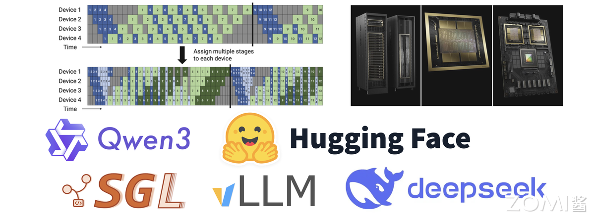
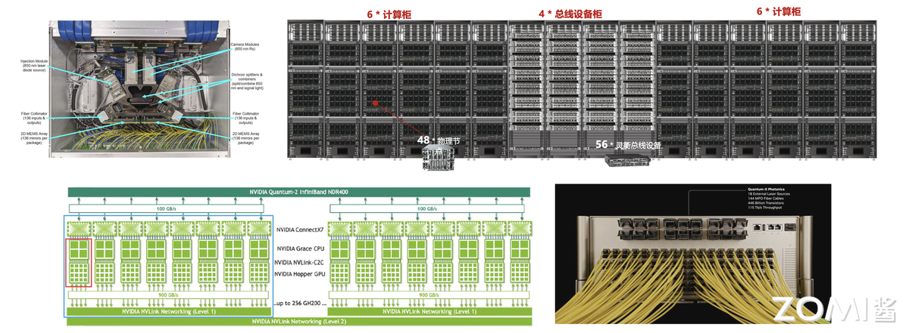
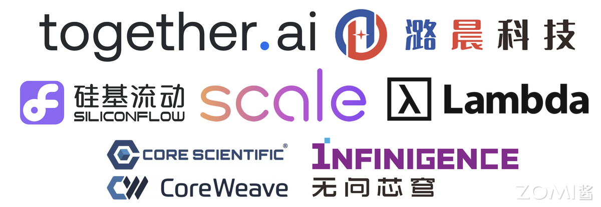
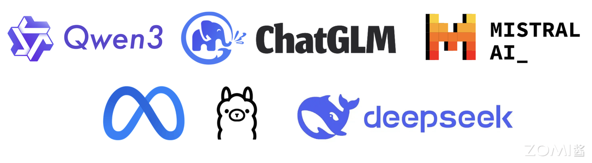

<!--Copyright © ZOMI 适用于[License](https://github.com/Infrasys-AI/AIInfra)版权许可-->

# 06.AI Infra 核心逻辑与行业趋势(DONE)

> Author by: ZOMI

AI Infra 绝非单一硬件的简单堆砌，而是支撑 AI 训练与推理全流程的核心算力底座，涵盖 GPU/TPU/NPU 等算力芯片、高速存储系统、低延迟网络架构及智能调度软件，构成软硬深度协同的完整技术体系。

从早期零散的算力供给模式，到如今演进为 “算力 + 算法 + 数据” 一体化架构，其核心价值在于破解大模型 “算力饥渴” 痛点，当前更朝着 “算力 + 算法 + 数据 + 环境” 协同的方向迈进，以适配 AI 场景落地需求与 Agentic AI 的发展趋势。

## 1.AI Infra 软硬件定义

AI Infra 并非单一技术模块，而是通过硬件与软件的深度协同，构建起支撑 AI 大模型任务全流程的技术底座，其核心特征在于“垂直整合”，从物理硬件到上层工具，各环节形成闭环，确保 AI 计算高效、稳定落地。

### 1.1 硬件层

硬件层是 AI Infra 的“骨架”，以 AI 芯片为绝对核心，其中 GPU 因具备强大的并行计算能力，成为当前训练大模型、处理海量数据的主流选择，此外 FPGA、ASIC 等专用芯片也在特定场景中逐步应用。

除计算芯片外，硬件层还需配套高性能网卡、交换机及服务器集群：网卡与交换机负责解决跨节点数据传输的带宽与延迟问题，避免因通信瓶颈拖累计算效率；而服务器集群则通过标准化硬件组装，为大规模 AI 任务提供可扩展的物理载体。

而存储硬件包括分布式存储服务器、高性能存储介质。分布式存储服务器通过多节点集群提供可扩展的存储容量，满足大模型训练动辄 TB 级甚至 PB 级的数据集存储需求；NVMe SSD 等高速介质则保障数据读取速度，避免因存储 IO 延迟拖累算力发挥。

三者共同构成 “计算 - 通信 - 存储” 一体化硬件体系，直接决定 AI Infra 的综合能力上限。

### 1.2 软件层

软件层是 AI Infra 的 “神经中枢”，借鉴云计算三层架构，不仅实现硬件资源管控，更重点解决存储资源的高效管理与数据调用问题。

- IaaS 层聚焦“资源落地”：通过服务器组装、集群组网及运维管理，将分散的裸硬件整合成可统一调度的基础设施，同时配套分布式存储系统，满足 AI 任务对海量数据的存储与快速读取需求，核心解决“计算、通信、存储”三大底层需求。

- PaaS 层核心是 AI 模型开发的 “技术基座”。重点包含 AI 编译器负责将上层框架代码编译为硬件可执行指令；底层算子加速库，如 CuDNN、MKL 通过优化矩阵运算、卷积等 AI 核心算子，最大化调用硬件算力，减少算力浪费；AI 训练框架，如 PyTorch 封装底层算子与硬件接口，为算法工程师提供模型搭建、训练的基础工具，本质是 “衔接硬件能力与模型开发”，降低底层技术门槛。

- SaaS 层聚焦 AI 任务的 “高效执行”，而非通用应用。核心包含推理服务，如 Triton Inference Server，实现模型部署后的低延迟、高并发响应，支持动态批处理、模型动态加载；分布式并行框架，如 DeepSpeed、Megatron-LM、VeRL 通过数据并行、张量并行等技术，拆分大规模训练任务，适配多卡 / 多节点集群，解决单设备算力不足问题，直接支撑 AI 任务的落地执行。

- MaaS 层（模型即服务）：AI 领域特有的中间层，衔接 SaaS 层与终端用户。核心提供模型托管（存储、管理预训练模型、微调后模型）、模型版本、轻量化微调与 API 调用服务，让用户无需关注底层框架与硬件，直接通过接口调用模型能力，是大模型能力普惠化的关键环节，填补了 “模型开发” 与 “业务应用” 间的空白。

## 2.AI Infra 发展历程

AI Infra 的发展始终围绕 “算力需求与技术供给” 的动态平衡展开。从实验室工具到支撑万亿参数模型的 AI 超算体系，其演进可清晰划分为四个阶段，每个阶段都对应着深度学习工业化进程中的核心矛盾与突破方向。

### 2.1 萌芽期（2010-2015）

当深度学习在图像识别等领域初显锋芒时，行业面临的最大挑战是“无专用工具可用”。以贾扬清、李沐、陈天奇为代表的技术先驱，构建了第一代机器学习基础设施，奠定了 AI Infra 的雏形，当时也称为 AISystem。这一时期的核心目标是解决“能用”问题，支撑单机或小规模分布式场景（通常 ≤10 张 GPU）。  

2013 年贾扬清开发的 Caffe 首次实现神经网络的模块化封装，通过 CUDA 加速将 AlexNet 训练速度提升 10 倍，成为计算机视觉领域的标配工具。李沐主导的 MXNet 首次引入参数服务器架构，支持 5-10 张 GPU 的分布式训练，为推荐系统等大数据场景提供了可能。陈天奇的 XGBoost 则通过二阶导数优化和特征并行技术，将梯度提升树的训练效率提升 10-100 倍，其块结构设计实现特征预排序的复用，使分裂点查找从 O(n log n)降至 O(1)复杂度。  

AISystem 时期技术特征呈现三大局限：硬件上，GPU 仅作为辅助加速工具，CPU 仍是主流计算载体；功能上，聚焦模型训练环节，推理优化几乎空白；生态上，框架间兼容性极差，Caffe 的模型无法直接迁移至 MXNet。但正是这些“不完美”的工具，让深度学习从学术论文走向工程实践，为后续规模化奠定基础。  

### 2.2 成长期（2016-2020）

2016 年 AlphaGo 的胜利成为转折点，深度学习进入工业化爆发期。模型参数从千万级跃升至百亿级，训练数据突破 PB 级，小规模集群彻底失效。这一阶段的核心矛盾是“模型规模激增与集群能力不足”，推动 AISystem 向着 AI Infra，从零散工具升级为体系化解决方案。

2016 年百度提出的 Ring AllReduce 架构，通过环形拓扑将千卡集群的通信延迟降低 60%，替代 Parameter Server 成为主流方案。同年英伟达 NCCL 2.0 引入 GPU 直连技术，使 8 张 V100 的训练速度达到单卡的 7.5 倍，接近理想线性加速比。2020 年微软 DeepSpeed 的 ZeRO 技术将模型显存占用降低 8 倍，首次实现单节点训练 175B 参数模型的可能，为 GPT-3 训练提供了技术支撑。  

推理引擎开始专业化分工。英伟达 TensorRT 3.0（2017 年）通过 INT8 量化实现 8 倍吞吐提升，Triton Inference Server（2019 年）的动态批处理方案将 GPU 利用率从 30%提升至 80%。硬件层面，英伟达 Volta 架构（2017 年）集成 Tensor Core，FP16 算力达 120 TFLOPS；谷歌 TPU v2（2016 年）在图像任务上的能效比是 GPU 的 3 倍，验证了专用 AI 芯片的价值。  

2020 年 GPT-3 的训练成为技术试金石，175B 参数模型在 1024 张 V100 集群上完成训练，既验证了成长期技术的价值，也暴露了千卡级集群的调度效率瓶颈，为下一阶段发展指明方向。  

### 2.3 成熟期（2021-2025）

千亿参数模型成为主流后，AISystem 真正转向 AI Infra，进入“极致优化”阶段。核心矛盾转向“超大规模集群的效率与稳定性”，推动混合并行技术、推理引擎革命和万卡级集群的工程化突破。  

**混合并行技术**实现算力倍增。Megatron-LM 提出的“张量并行+流水线并行+数据并行”混合策略，通过交错式流水线调度减少 10%的通信气泡，使万亿参数模型训练成为可能。DeepSpeed 的 ZeRO-3 技术进一步将显存效率提升 3 倍，支撑了 MoE 模型的大规模训练。推理领域，vLLM（2023 年）的 PagedAttention 技术通过内存分页管理，将 KV Cache 利用率从 50%提升至 90%，在 70B 模型上实现 3 倍吞吐提升。  

硬件与软件的深度协同成为标志。英伟达 H100（2022 年）的 Transformer 引擎支持 FP8 精度，在千亿模型训练中实现 2 倍速度提升；其 NVLink Switch 系统提供 1.8TB/s 跨节点带宽，使 10 万卡集群的 GPT-4 级模型训练周期从 30 天缩短至 12 天。集群管理方面，基于 Kubernetes 的弹性调度平台普及，阿里云 PAI 团队实现训练任务自动扩缩卡，资源利用率提升 40%。  

这一阶段的技术特征是 “软件定义硬件能力”：H100 的性能在未优化框架中仅能发挥 60%，而经 Megatron-LM 优化后可达 92%；DeepSeek 团队则通过自研的 FP8 计算，将 FP8 模式下的 H100 算力利用率从原生支持的 70% 提升至 90% 以上，尤其在 MoE 模型的专家通信环节，通过 FP8 的低带宽特性减少 30% 的跨节点数据传输量，使十万卡集群的整体训练效率再提升 15%。工具链的成熟使头部企业能够稳定运营十万卡级集群，支撑每日数十亿次的推理请求。

### 2.4 下一代（2025 年后）

随着模型参数规模突破万亿级，AI Infra 的技术边界被彻底打破，HPC 的底层逻辑与技术体系全面渗透，催生出“AI 超算”新范式。这一阶段的核心突破体现在硬件架构的重构、集群拓扑的革新与软件生态的跨域融合，三者协同支撑起千万亿次算力的高效调度。  

**硬件创新聚焦极致能效与算力密度**。英伟达 Blackwell 架构 GPU 成为新一代核心硬件，采用 8-chiplet 设计，2080 亿晶体管通过 10TB/s 的 Chiplet 互联总线形成统一计算体；其第二代 Transformer 引擎首次实现 FP4/INT4 混合精度计算的实用化，在保持模型精度损失<2%的前提下，将单卡 FP8 算力密度提升至 4PetaFLOPS，支持万亿参数模型的单节点分片部署。单机柜功耗密度突破 50kW，散热技术同步突破，为十万卡级集群提供稳定运行的物理基础。  

**集群架构全面对标 HPC 标准**。光互联技术成为集群通信的核心载体：基于氮化硅材料的光子集成电路（PIC）光交换机（OCS）实现 200Tbps 的机架级带宽，端到端延迟降至 500ns，较传统以太网提升 10 倍；英伟达推出的光电共封（CPO）技术将光模块与交换机芯片集成，进一步降低通信功耗 30%。华为 UB 总线等自研互联技术则通过全域内存池设计，将跨节点数据访问延迟压缩至微秒级。 

在通信协议层，借鉴 HPC 的 SHARPv3 协议实现“网络内计算”，将 All Reduce 等集合通信操作的延迟降低 40%。异构集群调度技术成熟，如美国 Summit 超算和德国 JURECA 集群探索 AI-HPC 混合集群通过 Slurm 与 Kubernetes 的协同调度框架，AI 训练任务与科学计算任务的动态资源切换。

**软件栈重构支撑跨域协同**。AI 框架与 HPC 生态深度融合：PyTorch 与 MPI 接口的无缝对接，探索支持自动张量并行与 HPC 集群的算力调度，使算法研究者无需修改代码即可调用超算资源；容器技术突破 HPC 场景限制，Singularity 4.0 支持 MPI-OpenMPI 5.0 协议的原生集成，容器内多节点通信效率损失控制在 5%以内。安全与合规技术同步升级，Blackwell 架构的机密计算单元通过硬件级内存加密，在性能损失<3%的前提下实现模型权重与训练数据的全生命周期保护。

从工具化雏形到超算级体系，AI Infra 的演进始终遵循“算力需求驱动技术融合”的逻辑。2025 年后的技术突破并非对过往路径的颠覆，而是通过 HPC 与 AI 的深度耦合，在算力密度、通信效率与资源利用率三个维度实现质变。

## 3.AI Infra 核心价值

在大模型从技术探索走向商业落地的过程中，AI Infra 已彻底摆脱传统基础设施的辅助属性，成为决定企业 AI 竞争力的核心变量。

### 3.1 决定大模型上限

大模型的竞争本质是“算力效率”与“成本控制”的竞争，而 AI Infra 既决定给定资源下模型能达到的效果高度，也左右着企业投入的成本边界，且这种影响可通过具体数据量化，具备极强的商业确定性。

从**效果层面**看，AI Infra 的效率直接转化为模型的“数据学习量”，进而决定效果优劣。大模型的性能提升依赖“海量数据+充分训练”，但训练周期与算力资源往往是固定约束。AI Infra 的优化空间就等同于模型的“额外学习空间”：通过算子优化、调度策略升级等方式，将 Infra 整体效率提升 20%，则在相同时间与算力下，模型可多处理 20%的训练数据，这种效果差异足以让大模型在商业场景中形成竞争力壁垒。

从**成本层面**看，AI Infra 的优化是“投入确定性极高”的降本路径，且回报可直接量化。大模型训练的核心成本是 GPU 算力租赁与维护，按行业通用标准，1 万张主流 GPU 月租金约 1 亿元，配套的存储、通信设备与运维人力成本还需额外增加 10%-15%。若通过 AI Infra 优化提升 10%的 GPU 利用率，每月即可节省 1000 万元租金成本，实现这一优化的团队通常仅需 3-5 名资深工程师，月度人力成本不足 100 万元，投入产出比高达 10:1。这种“优化收益明确、成本可覆盖”的特性，让 AI Infra 成为企业 AI 投入中“最确定的回报项”，远优于算法调优这类“效果不确定、投入无上限”的尝试。

衡量这种“效果-成本平衡”的核心指标从**MFU（Model FLOPs Utilization，模型算力利用率）** ，开始转向**实际计算吞吐**。训练场景中，高 MFU 意味着算力浪费少，可加速训练进程；推理场景中，若追求低延迟，可能需适当降低 MFU 以减少批处理等待时间。脱离“优化目标”谈 MFU 优劣，会陷入“唯指标论”的误区。

### 3.2 与传统 Infra 关系

AI Infra 与传统 IT Infra 的支撑电商大促、企业办公的基础设施并非“替代关系”，二者共享基础设施的核心目标，却因核心硬件差异，走上了完全不同的技术路径，最终形成“通用适配”与“极致定制”的本质区别。

**共性**源于基础设施的核心使命：无论 AI 场景还是传统 IT 场景，基础设施的终极目标都是“解决大规模任务的可靠、高效运行”，且均需整合“计算、通信、存储”三大核心资源。例如，传统 Infra 支撑双 11 电商大促时，需协调百万级服务器的计算资源、保障亿级用户的请求通信、存储 PB 级交易数据；AI Infra 支撑大模型训练时，需调度数千张 GPU 的计算能力、实现跨节点的低延迟数据传输、存储 PB 级训练数据集。

二者**差异**更为关键，且根源在于核心硬件不同：传统 Infra 以 CPU 为核心，AI Infra 以 GPU 为核心，这种差异直接导致了通信、存储、软件适配的全链路不同。

从硬件逻辑看，CPU 擅长串行计算，适合处理复杂但低并发的任务；GPU 擅长并行计算，适合处理简单但高并发的任务。

AI Infra 对通信与存储的要求远超传统 Infra：通信层面，GPU 集群需高带宽、低延迟的网络，否则会因数据传输慢拖慢并行计算；传统 Infra 用 10G/100G 以太网即可满足需求。

存储层面，AI Infra 需高 IOPS 的 NVMe SSD 存储，以支撑每秒数十 GB 的训练数据读取；传统 Infra 用 HDD 机械硬盘即可应对文档、交易数据的存储需求。

### 3.3 从算法主导到协同重构

大模型的成功从来不是单一技术的突破，而是“算法、AI Infra（算力适配）、数据”三者深度协同的结果。在行业早期，分工以算法为绝对核心，但随着 Meta 收购 Scale AI 等事件的信号释放，行业逐渐意识到：

**当大模型进入深水区，传统分工边界正发生根本性重构，AI Infra 的角色从“支撑”转向“主导性协同者”。**

在大模型成长期，算法主导的分工逻辑确有合理性——彼时模型训练范式尚未成熟，算法团队需包揽“训练范式创新（如优化器设计、学习率调整）”“网络结构选型（ViT、DiT 或 Transformer 变种）”“效果排名”三大核心职责，国内多数厂商至今仍延续这一模式。

但随着 AI Infra 进入成熟期，这一分工的弊端愈发明显：一方面，模型结构逐渐透明化，主流大模型均以“Transformer decoder-only”为基础框架，算法团队的结构创新空间大幅收缩，仅剩参数调整工作，而这类调整对大模型最终效果的影响已微乎其微；

另一方面，真正的结构创新需要深度理解加速芯片的硬件特性（如算子支持、并行计算逻辑），若仅由算法团队设计，极易出现冗余算子，造成算力浪费；同时，效果排名依赖的 benchmark 成绩，本质由数据质量与规模决定，算法团队兼顾数据优化时，往往因精力分散导致数据处理流于表面（如仅关注数据连贯性，忽视噪声清洗），最终陷入“结构不适配硬件、效果依赖试错”的困境。

进入大模型与 AI Infra 协同演进的新阶段，更合理的分工逻辑需明确三方权责，且核心在于“专业背景适配”：

- **AI Infra 团队（优先算法转型背景）**：主导“模型结构设计”。这类团队既懂算法逻辑，又熟悉硬件特性（区别于仅聚焦底层调度的 HPC 转型团队），能设计出“成本最优、算力适配”的结构——例如规避 GPU 不擅长的复杂算子、减少计算冗余，让模型在相同算力下训练效率提升 30%以上，真正实现“硬件与模型的深度适配”；  
- **数据团队（优先算法转型背景）**：负责“效果排名与数据飞轮构建”。区别于传统 Infra 转型的数据团队，算法背景的数据团队更懂模型对数据的需求，可通过“小模型筛选+大模型生成”的组合方式（如用小模型清洗噪声数据，用大模型扩充高质量样本）激活数据飞轮，直接推动 benchmark 成绩提升；  
- **核心算法团队（大模型创新人才）**：聚焦“训练范式创新”。摆脱硬件适配与数据优化的束缚，专注探索前沿方向——如快推理与慢推理的协同、强化学习（Reinforcement Learning）与多智能体（Multi-Agent）的范式演进，真正突破算法的未来边界。

这种分工在小公司中易落地：团队规模小、沟通成本低，AI Infra、算法、数据团队可快速对齐目标；但在大厂中，因组织架构惯性（AI Infra 多被归为“技术支持部门”，缺乏模型设计话语权），难以打破分工壁垒，最终拖累研发效率与成本控制。这也是 DeepSeek 能异军突起的关键——其早期便确立“算法转 AI Infra 团队主导结构设计”的逻辑，让模型与算力适配度远超同行，快速在大模型竞争中占据优势。

可见，AI Infra 在大模型时代的价值已远超“基础设施”的传统定义：它不仅是硬件与模型的“适配者”，更是效果与成本的“掌控者”。企业对 AI Infra 分工权责的认知深度，直接决定了其在大模型竞争中的起跑线位置。

## 4. 行业现状与挑战

AI Infra 正处于“硬件厂商”与“模型企业”的中间地带，既需应对上游硬件迭代的技术冲击，又要适配下游模型场景的多样化需求，行业整体面临“定位模糊、内外差距、生态待建”的三重挑战。

### 4.1 三方 Infra 公司生存

第三方 AI Infra 公司是行业中最易陷入困境的群体，若仅提供不绑定上下游的通用优化服务，如仅仅是买算力，极易因缺乏技术壁垒陷入价格战，利润空间被持续压缩。其核心生存路径在于**垂直整合**，通过绑定硬件或模型建立差异化优势，同时需认清商业模式的局限性。深度求索 DeepSeek 和 潞晨科技 ColossalAI 就是个鲜明的对比。

从垂直整合方向看，有两类可行路径：一是“与硬件深度绑定”，类似游戏主机领域“PS5 靠独占游戏吸引用户”的逻辑，第三方 Infra 公司可与硬件厂商达成合作，以“独家技术支持”换取低价算力资源，再将硬件特性融入 Infra 优化方案。帮助硬件厂商打开市场，也让自身方案具备“硬件+软件”的复合壁垒，避免与其他通用工具同质化竞争。

二是“与模型协同设计”，主动参与下游模型的结构设计，推动模型向适配自身 Infra 方案的方向迭代，例如 DeepSeek 早期因 Infra 团队对 GPU 并行能力的深刻理解，提前布局 MoE 架构，在相同算力下实现更大参数量训练，这种“模型结构+Infra 优化”的协同，让 DeepSeek 的模型与 Infra 方案形成绑定，其他 Infra 工具难以替代。

但三方 Infra 的商业模式存在天然局限：训练端 Infra 服务因直接关系企业大模型的核心竞争力，头部模型厂商更倾向于自建团队；相对而言，推理端需求更标准化，且不涉及模型核心技术，成为第三方公司的主要发力方向。像国内典型案例如无问芯穹，自成立起便聚焦推理端 Infra 优化，提供从模型压缩到部署的全流程工具；潞晨科技早期尝试训练端服务，但受到大厂自建需求挤压。

### 4.2 国内外差距

当前 AI Infra 的国内外差距并非单一技术指标的落后，而是“规模实践不足”与“上下游整合薄弱”共同形成的系统性鸿沟。

首先是规模差距，AI Infra 技术成熟度高度依赖大规模实践，10 万张 GPU 集群与 1 万张 GPU 集群面临的问题完全不同。前者需解决跨区域节点通信延迟、海量设备容错、电力能耗控制等复杂问题，而后者仅需满足基础调度需求。

国外 Google、OpenAI 等早已具备 10 万卡级集群的运营经验，实现了跨数据中心的算力协同；而国内除少数大厂如字节、阿里外，多数企业的集群规模仍停留在 1 万卡以内，腾讯因为组织架构分裂的原因也在万卡的规模，缺乏大规模场景的技术积累，导致在超大规模模型训练的 Infra 优化上，跟国外仍然有差距。

更核心的是上下游整合差距。国外头部公司已形成“模型-芯片-Infra”的协同闭环，OpenAI 虽依赖英伟达 GPU，但通过与英伟达深度合作，提前获取 GPU 硬件参数，针对性优化 Infra 的调度策略，让 GPT 系列模型的训练效率提升 2 倍以上。反观国内，仅阿里、华为等少数大厂同时具备自研 AI 芯片（如含光 800、昇腾 910），因组织架构芯片团队、模型团队、Infra 团队分属不同部门的壁垒，难以实现技术协同。所以这也是大模型创新企业，如 OpenAI、DeepSeek、Anthropic 等公司能异军突起的原因之一。

这种整合差距进一步加剧了“国产芯片困境”：当前国内主流大模型（如 DeepSeek、Qwen）均基于英伟达 GPU 设计优化，例如大量使用英伟达专属的 Tensor Core 算子；国产 AI 芯片虽能运行这些模型，但因缺乏适配优化，算力利用率仅为英伟达卡的 50%-60%，性价比劣势明显。

要打破这一困境，核心需推动“为国产卡定制 SOTA 模型”，针对国产芯片的硬件特性，设计全新的模型架构，而非简单移植英伟达适配的模型或者兼容 CUDA 的 API 生态，只有让国产卡能高效运行顶尖模型，才能真正推动 AI Infra 的国产替代。

### 4.3 开源模型双面性

开源模型是 AI Infra 发展的“双刃剑”，既推动了技术普及，也可能成为创新的桎梏，行业需在“技术复用”与“风险规避”间找到平衡。

积极面在于倒逼 AI Infra 技术进步。热门开源模型的普及，让行业产生了如何在不同硬件上高效运行的共性需求，进而推动 Infra 技术的标准化与优化。

LLaMA 系列模型开源后，大量企业与研究者开始探索如何在消费级 GPU 上运行 70B 参数模型，催生出模型量化、模型分片等 Infra 优化方案；同时，开源模型的透明性也让 Infra 优化效果可被量化验证，加速 AI Infra 技术迭代，让 AI Infra 从闭门研发走向开放竞争，整体技术水平快速提升。

消极面同样不容忽视。过度投入某一开源模型的优化，可能导致技术路径依赖，错过新模型方向的创新机会。开源模型的架构往往具有局限性，例如 LLaMA 采用传统的 Transformer decoder 架构，而后续 DeepSeek、Qwen 等模型则引入了动态路由、稀疏注意力等全新结构。

某公司此前将 90%资源投入 LLaMA 推理优化，当新架构模型出现时，这些优化经验几乎完全失效，需重新投入资源适配，不仅造成成本浪费，还可能因技术滞后错失市场机会。路径锁定风险在中小型 Infra 公司中尤为明显，因其资源有限，难以同时跟进多个模型方向的优化。

## 5. 未来方向与畅想

AI Infra 正处于快速迭代与价值深化的关键阶段，其技术演进有明确节奏可循，而从业者需紧扣核心逻辑构建竞争力，才能在行业变革中立足。

### 5.1. AI Infra 技术趋势

AI Infra 的技术演进并非无序探索，而是呈现“两年一核心范式革新”的规律，且多模态已成为当前最关键的突破方向，同时带动技术与场景的双重升级。

从**范式节奏**看，核心迭代节点清晰可追溯：2022 年 GPT-3.5 与 InstructGPT 的出现，推动 AI Infra 向“对话式大模型训练”适配，重点优化长文本处理与指令跟随的算力调度；2024 年 OpenAI o1 模型凭借 TTS 技术，让 Infra 转向动态算力分配。按照节奏，下一次核心范式革新或在 2026 年，大概率围绕更复杂的多任务 Multi-Agent 与强化学习深度协同展开。

**多模态**是当前最具潜力的突破口，当前多模态模型仍处于“单一能力拆分”阶段，类似 2020 年纯 LLM 发展水平，文本理解模块、生成任务模块，能力分散且效率低。未来的关键是实现理解与生成统一：一个多模态模型需在图像、文本、视频等领域，同时具备超越专用模型的理解与生成能力，就像当年 GPT-3.5 凭借通用对话能力取代众多专用翻译、问答模型一样。

成本层面，当前多模态的理解任务算力成本较低，但视频生成因数据量与计算复杂度高，成本居高不下，不过行业乐观预计，一年内通过 Infra 优化，视频生成成本将降至现有水平的 10/1。

此外，技术演进还伴随三大方向：智能体 AI Agent 崛起推动 Infra 向“多任务协同调度”升级，多模态深度融合要求 Infra 打破数据类型壁垒，轻量化与高效架构则让 Infra 适配边缘设备；应用场景也将从当前的生成式内容，向工业质检、医疗影像分析、个性化教育等传统 CV 领域逐步渗透，倒逼 AI Infra 进一步下沉场景需求。

### 5.2. 从业者碎碎念

AI Infra 行业的竞争本质是“垂直整合能力”与“认知深度”的竞争。

**核心原则是靠近模型、靠近硬件**：AI Infra 的价值不在于孤立的中间层优化，而在于与上下游的垂直整合。要么主动参与模型设计，将 Infra 优化逻辑融入模型结构；要么深度协同硬件厂商，把硬件特性转化为 Infra 的技术壁垒。

**充分利用算力的，长远是赢家**：AI Infra 的本质是“延续摩尔定律”，在硬件性能增速放缓的背景下，通过软硬件协同优化将硬件潜力发挥到极致。例如英伟达 GPU 正是凭借 Infra 层面的并行计算优化，实现每两年算力翻一倍，持续抢占 CPU 在 AI 领域的市场份额。

## 6. 总结与思考

AI Infra 已实现从支持工具到大模型时代 “核心竞争力”，成为研发优秀大模型的前提,缺乏高效的 AI Infra，难以平衡大模型的训练效率、成本与效果，更无法支撑超大规模任务落地。

其价值关键在于垂直整合：作为硬件与模型的中间衔接层，若仅做孤立的中间层优化易陷入内卷，唯有向硬件端协同适配、向模型端参与设计，才能建立壁垒。

未来两年，AI Infra 将会迎来新一轮的 AI 范式革新，核心仍围绕“提升计算利用效率” 与 “延续摩尔定律” 展开，通过软件优化最大化硬件潜力，为大模型的低成本、高效率落地提供核心支撑。

## 参考与引用

- [1] NVIDIA, "NVIDIA Blackwell Platform Unveiled," NVIDIA Blog, 2024-03-18. [Online]. Available: https://blogs.nvidia.com/blog/blackwell-platform/
- [2] NVIDIA, "Liquid-Cooled Data Centers for AI Supercomputing," Technical Brief, 2024.
- [3] Ayar Labs, "TeraPHY Optical I/O Chiplet Product Brief," 2024.
- [4] NVIDIA & TSMC, "Co-Packaged Optics for AI Clusters," ISSCC, 2024.
- [5] NVIDIA Mellanox, "SHARP v3 In-Network Computing," Whitepaper, 2023.
- [6] Oak Ridge Leadership Computing Facility, "Running AI Workloads on Summit with Slurm & Kubernetes," User Guide, 2023.
- [7] Jülich Supercomputing Centre, "JURECA DC AI Partition," 2024.
- [8] PyTorch, "PyTorch 2.3 with MPI Backend," PyTorch Blog, 2024-04.
- [9] SingularityCE, "v4.0 Release Notes—Native MPI Support," 2024.
- [10] NVIDIA, "Confidential Computing on Blackwell," Security Whitepaper, 2024.
- [11] Y. Jia et al., "Caffe: Convolutional Architecture for Fast Feature Embedding," Proc. ACM Multimedia, 2014.
- [12] M. Li et al., "Scaling Distributed Machine Learning with the Parameter Server," OSDI, 2014.
- [13] T. Chen & C. Guestrin, "XGBoost: A Scalable Tree Boosting System," KDD, 2016.
- [14] A. Gibiansky, "Bringing HPC Techniques to Deep Learning," NVIDIA DevBlog, 2017.
- [15] NVIDIA, "NCCL 2.0 Release Notes," 2017.
- [16] S. Rajbhandari et al., "ZeRO-Offload: Democratizing Billion-Scale Model Training," arXiv:2101.06840, 2021.
- [17] W. Kwon et al., "Efficient Memory Management for Large Language Model Serving with PagedAttention," OSDI, 2023.
- [18] NVIDIA, "H100 GPU Architecture Whitepaper," 2022.
- [19] OpenAI, "GPT-4 Training Infrastructure," OpenAI Blog, 2023.
- [20] DeepSeek, "FP8 Training for MoE Models," Technical Report, 2024.
- [21] 潞晨科技, "ColossalAI Enterprise Solutions," 官网白皮书, 2024.
- [22] 无问芯穹, "Inference-Optimized AI Infrastructure," 白皮书, 2024.
- [23] 中信证券, "AI 芯片国产化率跟踪," 研究报告, 2024-Q2.
- [24] Runway Research, "Towards 10× Cheaper Video Generation," Blog, 2024.
