<!--Copyright © ZOMI 适用于[License](https://github.com/Infrasys-AI/AIInfra)版权许可-->

# 03.HPC 基础软件发展趋势(DONE)

> Author by: 陈悦孜

HPC 基础软件是连接硬件与应用的核心桥梁，其发展始终围绕资源高效调度、数据高速流动、计算极致优化三大目标，主要涵盖调度、存储、通信、编译、计算库及基础算法六大维度。

## 1. 编译器与运行时

在 AI 集群基础软件领域，编译器与运行时系统是支撑高效计算、资源管理与性能优化的核心组件。编译器负责将 Python/PyTorch/TensorFlow 等高级代码，转换为 GPU/TPU/ASIC 等底层硬件可执行的高效代码，并完成深度优化；运行时系统则管理程序执行中的动态行为，确保计算任务高效利用集群资源。

### 1.1 传统编译器（1980s-2000s）

- Fortran 主导：向量化提效

Fortran 诞生于 20 世纪 50 年代，由约翰·巴科斯（John W. Backus）团队提出，初衷是替代汇编语言——让用户通过高级编程语言开发，同时实现接近手工汇编的性能，大幅简化编程工作量。

后续众多企业基于 Fortran 推出编译器产品。其中，Intel Fortran 编译器支持 Windows 与 Linux 系统：Windows 版本源自英特尔收购惠普相关权利后开发，依托微软 Visual Studio 外壳实现 Visual IDE 功能（CVF 即 Compact Visual Fortran，是紧凑型可视化编程工具及接口技术）；Linux 版本则是 Intel Math Kernel Library 的一部分，专为 Intel 处理器优化，在大规模数值计算中表现突出，能生成高效机器代码并提供高性能编译调试工具。

PGI 编译器由 Portland Group（简称 PGI，并行运算软件领域领先供应商）推出，针对 Intel、AMD 64 位 x86 CPU 深度优化，还支持 NVIDIA GPU Accelerator。其独有的 PGI Unified Binary 技术，能让编译后的应用在 Intel 或 AMD CPU 系统上高效运行，且可动态检测并调用 NVIDIA GPU Accelerator；同时支持多种 Fortran 标准，提供自动向量化、高级循环优化等特性，专为 HPC 场景设计。

- OpenMP 初现：共享内存并行

随着数据处理需求激增，并行计算倒逼编译器升级。1997 年 10 月，OpenMP for Fortran 1.0 发布，这是首个跨平台共享内存多线程并发编程模型，标志着 OpenMP 正式诞生。

OpenMP 由 OpenMP Architecture Review Board 牵头制定，是共享内存并行系统的多线程程序设计标准，核心是一套编译器指令、库及环境变量，支持 C、C++、Fortran 语言，可在 Solaris、AIX、GNU/Linux、Mac OS X、Microsoft Windows 等多数处理器体系与操作系统上运行。它采用可移植、可扩展模型，为程序员提供从桌面电脑到超级计算机的并行应用开发接口——比如混合并行编程模型下，应用可同时使用 OpenMP 与 MPI，或在非共享内存集群上通过 OpenMP 扩展实现透明运行。

通俗来讲，OpenMP 能实现跨平台多线程：主线程（顺序执行指令）生成多个子线程，将任务分配给它们并行运行，由运行时环境将线程分配到不同处理器。

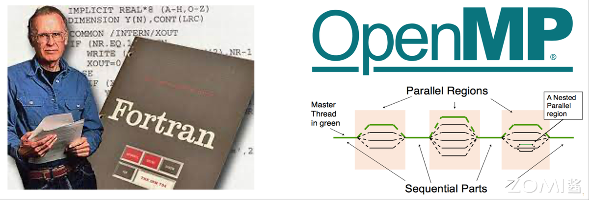

### 1.2 异构编译时代（2010s-至今）

2010 年后，AI 推动并行计算性能需求大幅提升，CPU 难以满足低延迟、高计算需求，GPU 与异构计算开始在并行计算中发挥关键作用，异构编译时代由此开启并延续至今。

- CUDA 与 OpenCL：GPU 异构支撑

GPU 已成为 HPC 程序的重要组成部分，而 GPGPU（通用 GPU）技术正是利用 GPU 进行通用计算——通过在不同处理器间划分进程或单个进程加速任务完成，这就需要并行计算框架实现 GPU 加速，让 CPU 与 GPU 协同处理大规模数据。GPGPU 借助 OpenCL、CUDA 等软件，依托 GPU 数百个片上处理器核实现高效并行计算，支持多核处理器通信协作以解决复杂问题。

CUDA 与 OpenCL 是异构计算核心框架，用于编写和管理 CPU+GPU/FPGA 等异构系统的并行计算任务。其中，CUDA（Compute Unified Device Architecture，统一计算设备架构）是 NVIDIA 2007 年发布的并行编程范例，采用类 C 语言，适用于开发 GPU 软件及高并行性的 GPU 通用应用，属于专有 API，仅支持 Tesla 架构的 NVIDIA GPU，依赖 NVIDIA 提供的运行时编译器 NVCC 实现设备代码编译。

NVCC（NVIDIA CUDA Compiler）的编译流程分为主机（Host）代码与设备（Device）代码两部分：首先分离.cu 文件中的 C/C++主机代码与 GPU 核函数设备代码；主机代码由 GCC、MSVC 等主机编译器编译为 x86、ARM 等目标平台的 CPU 汇编，最终链接为可执行文件；设备代码由 NVCC 转换为 PTX 虚拟 GPU 指令，或通过 JIT 编译器生成 Ampere/Turing 等架构的 SASS 指令；执行时，主机代码调用 GPU 核函数，PTX 或 SASS 指令由 GPU 驱动动态加载到显卡运行。

OpenCL（Open Computing Language，开放计算语言）由苹果与 Khronos 集团推出，旨在突破 NVIDIA GPU 限制，为异构计算提供统一基准。它为 GPU 编程提供可移植语言，支持 CPU、GPU、数字信号处理器等硬件，能让程序在不同架构上运行的同时，适配硬件特性提升性能。OpenCL 依赖 clBuildProgram 在运行时编译内核代码（动态生成设备二进制），但开发者仍需手动管理异构逻辑。

- SYCL 与 oneAPI：多架构兼容

oneAPI 是英特尔推出的编程模型与工具集合，旨在简化跨处理器架构的软件开发——它是统一、开放、标准化的编程环境，支持 CPU、GPU、FPGA 等硬件，开发者可通过同一代码库针对不同硬件优化，兼顾性能与可移植性。其核心优势在于开放性，支持多架构与多硬件厂商，让开发者无需绑定专有硬件即可选择最优加速设备，提升开发效率并匹配硬件性能。

英特尔 oneAPI 工具的组成与应用：oneAPI 支持两种编程模型，一是直接编程（Direct Programming），采用基于 C++标准的统一编程语言 SYCL；二是基于库的编程（API-Based Programming）。而 Level 0 作为与硬件加速设备交互的底层接口，只要硬件厂商实现该接口，其设备就能被 oneAPI 上层框架调用。

SYCL（异构编程标准）是行业标准化工作的核心，支持 C++数据并行编程，被称为“面向 OpenCL 的 C++单源异构编程”。它是基于 OpenCL 的跨平台抽象层，允许开发者用 C++“单源”风格编写异构处理器代码，让编译器能分析优化整个程序（无论代码运行于何种设备）；同时集成模板与 lambda 函数，便于高级应用编码，相比 OpenCL 提供更高抽象层级与更简洁的编程接口。

英特尔的 Data Parallel C++（DPC++）是 oneAPI 对 SYCL 编译器的实现，结合现代 C++的易用性与 SYCL 标准，实现数据并行性与异构编程，还能通过简化编码、减少冗余提升开发效率与性能。目前支持 SYCL 的编译器包括 Codeplay、华为、英特尔、海德堡大学等厂商的实现，这些编译器支持 C++/SYCL 代码，并可针对 CPU 及 AMD、Intel、NVIDIA GPU 等后端优化。

- 国产突破：华为毕昇编译器

聚焦国内，华为毕昇编译器是自主研发的高性能编译器工具链，首版于 2020 年 9 月 30 日发布，专为鲲鹏 920 处理器架构深度优化。该编译器基于开源 LLVM 框架开发，支持 C、C++、Fortran 语言，通过内存优化增强、自动矢量化等先进算法提升代码效率，还结合鲲鹏 Neon/Sve/Sme 内嵌指令技术，优化指令流水线与调度逻辑，充分发挥鲲鹏架构性能。下图为毕昇编译器的组成与支持范围。

截至 2024 年 5 月（注：基于知识截止日期调整），毕昇编译器已迭代至 4.2.0.1 补丁版本，兼容 openEuler、CentOS、Ubuntu 等主流操作系统，在气象、安防等 HPC 领域，性能显著优于 GCC 编译器。

2022 年，华为还推出毕昇 C++语言，支持多样算力编程，实现鲲鹏与昇腾 AI 算力的协同优化。该语言以 C++为基础，兼容多样性计算的异构编程标准，开发者用一种语言即可对鲲鹏、昇腾 AI 等主流算力编程，大幅降低多样性计算系统的编程复杂度与学习成本；同时支持通用语言规范，还提供统一矩阵编程、内存数据移动、向量化编程接口等扩展。

毕昇融合编译器则实现鲲鹏、昇腾 AI 等多算力的融合统一编译优化，通过编译算法优化与处理器架构深度协同，强化自动向量化、循环优化、多面体优化等能力，标准 Benchmark 峰值性能提升 30%。目前，毕昇 C++结合毕昇编译器，已与 10 多所高校及研究机构合作，在飞机噪声仿真、湍流仿真、地震模拟等领域开展多样算力应用开发——比如基于鲲鹏+昇腾 AI 多样性计算架构实现飞机噪声仿真，开发效率翻倍，混合精度求解性能提升 10 倍以上。此外，在 CANN 异构计算架构下，毕昇编译器还提供异构编程编译能力。

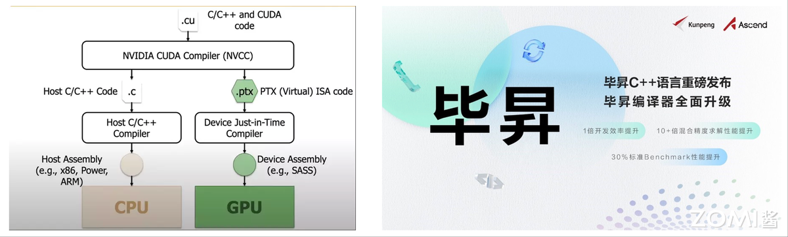

### 1.3 未来趋势

AI 编译器未来发展将聚焦三个方向：AI 驱动的自动调优通过机器学习生成最优计算方法，提升计算效率；多级中间层表示设计实现跨架构代码转换，降低编译器开发成本，让多硬件平台兼容更高效；而新兴的 Triton 编程方式则进一步降低开发者开发 GPU 程序的学习成本。

- AI 驱动自动调优：TVM、Ansor

为在多硬件平台高效部署算子，业界引入多种编译器技术——用户用高层声明性语言以数学表达式形式定义计算，编译器根据定义生成优化张量程序。但从高层定义自动生成高性能张量程序难度极大：不同目标平台架构下，编译器需在包含分块、向量化、并行化等优化组合的复杂空间中搜索，不同组合的性能差异显著，因此需要高效搜索策略覆盖空间并探索最优解，这一过程即自动调优。

自动调优指编译过程中，编译器或工具自动调整代码执行参数，优化算法、内存访问模式、并行度等，减少人工干预以适配不同硬件与运行条件。在 AI 领域，这一技术尤为关键——AI 模型计算复杂度高，且 CPU、GPU、FPGA 等硬件对优化需求差异大。其核心流程包括性能分析（识别瓶颈与优化机会）、参数搜索（探索编译选项与参数）、性能评估（测试不同配置效果）、反馈学习（根据结果调整搜索策略）。

TVM 是 AI 编译器自动调优领域的代表，其自动调优系统已历经三代。第一代 AutoTVM 基于模板：开发者需用 TVM DSL 为待调优算子（如 resnet18 的 conv2d）编写调优参数（如循环展开因子、重排序顺序），指定任务后 TVM 根据模板生成调度搜索空间；再选择调优器（如随机调优器、遗传算法调优器、XGBTuner）探索空间，其中 XGBTuner 会先通过模型预测调度候选项性能，筛选后再实测以减少调优时间。

但 AutoTVM 的性能上限依赖模板设计，对开发者要求较高。第二代 Ansor（Auto Scheduler）取消模板机制，实现全自动优化：无需手动指定优化方式，编译器自动应用调度原语，先构建覆盖计算定义的大搜索空间，再高效探索（空间规模比模板覆盖范围大数个数量级）；同时在优化多子图 DNN 时，优先调优对端到端性能关键的子图，合理分配资源。

第三代 Meta Schedule 则提供统一 API，支持手动调优、AutoTVM 风格与 AutoScheduler 风格；扩展所有调度原语（如张量化、循环分块），新增原语无需额外开发；且各组件（如调度空间生成器、ProgramRunner）可在 Python 或 C++中自定义。其调优流程为：先生成设计空间（底层系统记录调度原语与随机决策“Trace”，形成可探索空间）；再探索空间（用随机搜索、成本模型指导等策略高效搜索）；最后将度量记录（工作负载、硬件目标、输入参数、运行时间等）序列化存储到数据库，且成本模型、数据库等组件均支持定制。

- 多级中间表示：MLIR

为解决多硬件架构与复杂软件开发的矛盾，以及传统编译器中间表示在多领域、多平台的局限性，谷歌研究人员于 2017 年提出 MLIR（Multi-Level Intermediate Representation），2018 年正式开源。其设计理念是打造通用可扩展的中间表示，统一编程语言与硬件架构差异，简化编译器开发与优化。

从整体架构看，MLIR 主要包含四部分：一是中间表示层（IR），作为核心定义操作、类型、属性及关系，层次化结构可灵活表示从高级函数调用到低级硬件指令的不同层级计算逻辑；二是方言和操作注册层，管理用户定义或系统提供的方言（一组相关操作与类型），方便扩展表示能力（如深度学习框架可注册专属方言）；三是优化和转换层，提供常量折叠、死代码消除、算子融合等优化 pass，开发者可组合 pass 形成优化管道，逐步提升代码效率；四是代码生成层，将优化后 IR 转换为特定硬件目标代码，需针对不同硬件实现代码生成模块，映射 IR 到硬件指令集，生成可执行机器码或 PTX、LLVM IR 等中间表示。

MLIR 的核心优势在于层次化 IR、跨平台兼容性与高可扩展性：IR 从接近编程语言的高层表示到接近硬件指令的低层表示，支持多层级转换优化；统一 IR 能将不同 AI 框架模型转为统一形式，再针对性生成硬件代码，解决硬件多样性问题；同时允许用户定义方言与操作，模块化设计让开发者只需优化硬件相关部分，提升编译器开发效率。此外，其丰富的类型系统（标量、张量、内存类型等）能准确描述 AI 模型的张量维度、数据类型、存储格式，为优化与代码生成奠定基础。

- 新编程方式：Triton

Triton 是开源 GPU 编程语言与编译器，旨在平衡 AI 模型训练中 GPU 编程的易用性与效率——开发者无需掌握底层 CUDA 知识，通过 Python 即可编写自定义 GPU 内核，性能可媲美专家级 CUDA 代码。例如，用不足 25 行 Triton 代码就能实现与 cuBLAS（NVIDIA 高度优化库）性能相当的 FP16 矩阵乘法内核；据 OpenAI 报告，基于 Triton 开发的特定深度学习内核，比 PyTorch 实现性能最高提升 200%，在 AI 计算加速领域潜力显著。

相比传统 CUDA C++编程，Triton 的优势在于自动化底层优化：CUDA 开发需手动管理 GPU 内存层次（片外 DRAM、片上 SRAM）、实现内存访问合并、配置共享内存缓存、协调数千并行线程，即使资深开发者也面临挑战；而 Triton 自动处理这些环节，开发者仅需决策最高层任务分区（SM 间工作分配），专注高层算法逻辑，实现类 NumPy 风格的 GPU 编程，同时保持近最优性能。

现代 GPU 的每个流多处理器（SM）配备片外 DRAM 与片上 SRAM 缓存，Triton 编译器通过自动优化内存访问模式与 SM 内部并行计算，减轻开发者的内存管理与线程协调负担。更重要的是，Triton 深度集成 Python 生态，可直接从 Python（含 PyTorch 代码）调用内核，无需编写 C++或 CUDA 代码，特别适合研究实验与自定义层优化，有效弥合高级框架与底层 CUDA 的技术鸿沟。

Triton 的整体架构围绕“分块（tile）”概念构建，包含 Triton-C（基于 C 的语言，用参数化分块变量表达张量程序）与 Triton-IR（基于 LLVM 的中间表示）；通过分块级优化将程序编译为高效 GPU 代码，其中 Triton-C 为转编译器与 GPU 开发者提供稳定接口，Triton-IR 支持分块级数据流与控制流分析；最后由 Triton-JIT 编译器通过机器无关与机器相关优化，结合自动调谐引擎，生成目标硬件的高效机器码。

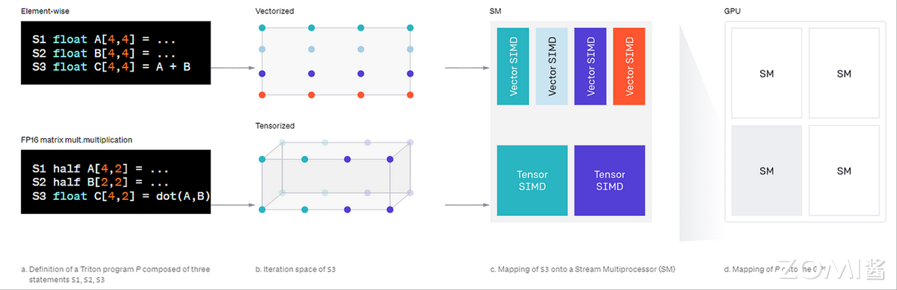

## 2. 计算库

在 AI 集群基础软件领域，计算库是连接上层 AI 框架与底层硬件的关键组件，通过高度优化的基础算子实现高效计算，直接决定 AI 训练与推理的性能。

### 2.1 经典数学库（1970s-2000s）

- BLAS/LAPACK：线性代数基石

LAPACK（Linear Algebra PACKage）是用 Fortran 开发的线性代数库，提供解多元线性方程组、线性系统最小二乘解、计算特征向量、Householder 变换（用于 QR 分解）、奇异值分解等工具函数，是数值计算的核心支撑。

BLAS（Basic Linear Algebra Subprograms，基础线性代数程序集）则是 API 标准，1979 年首次发布，规范基础线性代数操作（如向量-向量、矩阵-向量、矩阵-矩阵运算），是构建 LAPACK 等大型数值库的基础，在 HPC 领域应用广泛——例如 LINPACK 运算成绩很大程度上依赖 BLAS 中子程序 DGEMM 的表现。

为提升性能，软硬件厂商会针对产品优化 BLAS 接口实现。比如英特尔 MKL 与开源的 OpenBLAS(http://www.openblas.net) 均为线性代数库，专注矩阵计算优化，SciPy、NumPy 等开源 Python 库多基于两者实现。

- FFTW：超大规模 FFT 核心

FFTW（The Fastest Fourier Transform in the West）是麻省理工学院超级计算技术组开发的离散傅里叶变换（DFT）计算库，以开源、高效、标准 C 语言编写为特点，应用广泛——英特尔数学库、SciLab（类 MATLAB 科学计算软件）均采用 FFTW 处理 FFT 计算。在天文信号处理、气候模拟、医学 MRI 成像、量子计算模拟等超大规模数据场景中，FFTW 可支持 10M~100M 点的千万级数据计算。

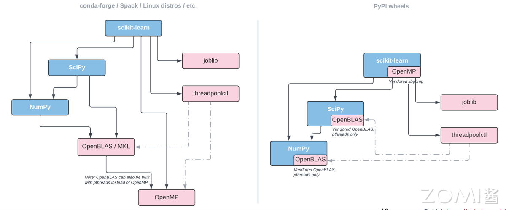

### 2.2 领域专用库（2010s-至今）

- 稀疏矩阵库：非结构化网格求解

稀疏矩阵计算领域有多款代表性库：SuiteSparse 由 Tim Davis 开发，含 SuiteSparse:GraphBLAS、CHOLMOD 等 GPU 加速组件，支持稀疏矩阵计算，虽 GPU 优化力度不及 cuSPARSE，但提供图算法、稀疏直接求解器等更丰富算法；PETSc 是面向 CPU 的大规模科学计算库，支持 MPI 分布式计算，可通过外部模块调用 CUDA，核心优势在 CPU 端的迭代求解器与预处理器；cuSPARSE 是 NVIDIA 推出的 GPU 加速稀疏线性代数库，专为 A100/H100/L40S 等 CUDA GPU 优化，提供 SpMV（稀疏矩阵向量乘法）、SpMM（稀疏矩阵乘法）、三角求解器等高度优化操作，借助 GPU 并行性，在大规模问题上性能常优于 CPU 库。实际选型中，可根据 GPU 或 CPU 场景选择专用加速库。

- AI 加速库：NVIDIA 与 Intel 适配

AI 加速领域，NVIDIA 的 cuDNN（CUDA Deep Neural Network Library）是专为 NVIDIA GPU（如 A100、H100）优化的库，基于 CUDA 与 Tensor Core，聚焦深度学习框架与应用加速；英特尔的 OneDNN（oneAPI Deep Neural Network Library）则针对 Intel CPU（如 Xeon、AMX 指令集）与 GPU（如 Intel Arc、Xe 架构）优化。两者均为闭源库，专为神经网络计算设计，覆盖训练与推理场景，支持常见神经网络算子与低精度计算加速，且均集成到主流深度学习框架，实现 AI 计算的极致性能。下图展示英特尔 OneDNN 的相关架构。

- 国产库突破：华为 CANN

聚焦国内，华为 CANN（Compute Architecture for Neural Networks，神经网络计算架构）是面向 AI 计算的全栈软件平台，旨在高效发挥昇腾（Ascend）AI 处理器 NPU（如昇腾 910/310）的异构计算能力。其核心组件 AI 算子库（Operator Library）为深度学习训练与推理提供高度优化的计算算子，是昇腾生态的关键基础设施。下图展示华为 CANN 的架构组成。

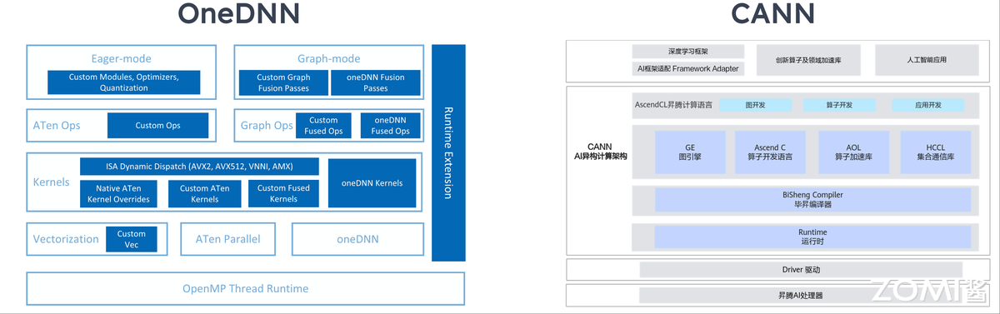

### 2.3 NVIDIA CUDA 计算库

以下从四个类别介绍 NVIDIA CUDA 生态中的核心计算库：

- AI 与机器学习库

| 英文缩写 | 英文全称 | 中文名称 | 功能描述 |
|----------|----------|----------|----------|
| cuDNN | CUDA Deep Neural Network Library | CUDA 深度神经网络库 | 加速深度学习核心操作（卷积、池化、LSTM 等），专为神经网络优化。 |
| cuML | CUDA Machine Learning | CUDA 机器学习库 | 提供 GPU 加速的机器学习算法（如分类、回归、聚类），类似 Scikit-learn 的 GPU 版。 |
| cuGraph | CUDA Graph Analytics | CUDA 图分析库 | 高性能图算法（如 PageRank、最短路径），用于社交网络、推荐系统等。 |
| cuOpt | CUDA Optimization | CUDA 优化库 | 求解组合优化问题（如路径规划、资源调度），适用于物流、交通等领域。 |

- 数学与科学计算库

| 英文缩写 | 英文全称 | 中文名称 | 功能描述 |
|----------|----------|----------|----------|
| cuBLAS | CUDA Basic Linear Algebra Subprograms | CUDA 基础线性代数子程序库 | 加速矩阵运算（如矩阵乘法、向量操作），GPU 版的 BLAS。 |
| cuFFT | CUDA Fast Fourier Transform | CUDA 快速傅里叶变换库 | 高效计算 FFT（傅里叶变换），用于信号处理、图像频域分析。 |
| cuSPARSE | CUDA Sparse Matrix Library | CUDA 稀疏矩阵库 | 优化稀疏矩阵运算（如 SpMV 稀疏矩阵向量乘法），适用于科学计算和推荐系统。 |
| cuSolver | CUDA Solver Library | CUDA 求解器库 | 提供线性方程组求解、矩阵分解（如 LU、QR）的高性能实现。 |
| cuRAND | CUDA Random Number Generation | CUDA 随机数生成库 | 生成高质量随机数，用于蒙特卡洛模拟、深度学习初始化等。 |
| cuTENSOR | CUDA Tensor Primitives Library | CUDA 张量计算库 | 加速张量收缩、转置等操作，专为量子计算、物理模拟优化。 |

- 数据处理与分析库

| 英文缩写 | 英文全称 | 中文名称 | 功能描述 |
|----------|----------|----------|----------|
| cuDF | CUDA DataFrames | CUDA 数据帧库 | GPU 加速的数据处理（类似 Pandas），支持大规模数据清洗、聚合操作。 |
| Thrust | - | CUDA 并行算法库 | 提供 STL 风格的并行算法（如排序、归约），简化 GPU 编程。 |

- 图像与多媒体处理库

| 英文缩写 | 英文全称 | 中文名称 | 功能描述 |
|----------|----------|----------|----------|
| NPP | NVIDIA Performance Primitives | NVIDIA 高性能原语库 | 加速图像/视频处理（如滤波、色彩转换），适用于计算机视觉和多媒体应用。 |

下图展示 CUDA 计算库的整体生态。

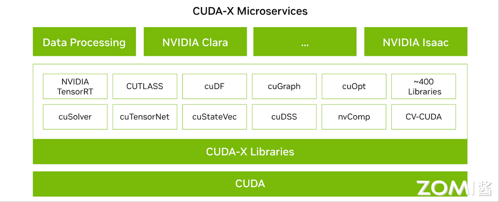

### 2.4 未来趋势

- 自动微分库：JAX 与 Enzyme

当前将物理模拟、游戏引擎、气候模型等新领域融入机器学习时，常面临梯度计算难题——需通过源码重写或操作符重载，将外部代码融入 Adept、Autograd 等自动微分（AD）工具，或 TensorFlow、PyTorch 等深度学习框架，增加了机器学习工作流的复杂度。自动微分库正是为解决这一问题而生，专注高效梯度计算。

JAX 基于 Python 函数式编程，通过 grad、jit、vmap、pmap 等装饰器实现自动微分、即时编译（JIT）、向量化与并行化，支持高阶微分（如 Hessian 矩阵）与复杂控制流（如 lax.scan）；同时提供 jax.numpy 接口，可无缝替换 NumPy 代码并支持 GPU/TPU 加速，兼顾 Python 生态的灵活性与硬件加速能力，适合快速实现机器学习模型或科学计算原型。

Enzyme 是 MIT 提出的基于 LLVM IR 的自动微分编译器插件，能为 C/C++/Fortran 等语言生成静态可分析程序的梯度，兼容现有 HPC 代码。它在编译期生成梯度代码，避免运行时解释开销；支持指针、内存别名、循环等低级语言特性，适合优化遗留代码；且与机器学习框架解耦，不依赖 Python 生态，可直接嵌入 HPC 应用，适合需编译器级性能或与 LLVM 工具链集成的场景。

- 量子算法库：Qiskit Aer

量子计算借助量子叠加（量子比特可同时处于多状态）、纠缠与干涉效应，在特定任务上展现出超越传统计算机的能力，而量子算法库是量子计算落地的关键支撑。Qiskit 是 IBM 开发的开源量子计算框架，支持量子电路与算法实验，可在模拟器或真实量子硬件上运行，核心组件包括 Qiskit Terra（构建与运行量子电路）、Qiskit Aer（高性能量子模拟）、Qiskit Aqua（量子算法与模型库）。

其中 Qiskit Aer 为 Qiskit 生态提供高性能模拟器框架，含优化的 C++模拟器后端，支持 Qiskit Terra 编译的电路执行；还提供可配置噪声模型工具，能模拟真实设备的执行错误，在量子线路优化与量子化学模拟中发挥关键作用——例如通过优化量子线路降低噪声影响，加速量子化学领域的分子能量计算、反应路径模拟等任务。

- DSL：Julia SciML

领域特定语言（DSL）是针对特定问题领域设计的语言，相比 Python、C++等通用语言，通过高度抽象与语义化语法简化领域任务表达，具有专一性（仅解决某类问题）、高生产力（简洁代码描述复杂逻辑）、嵌入性（常嵌入通用语言）等特点，典型如 SQL（数据库查询）、LaTeX（排版）。

在微分方程领域，Julia 语言的 SciML（Scientific Machine Learning）生态是 DSL 应用的代表，核心是通过 DSL 实现微分方程求解自动化。SciML 的通用接口覆盖线性系统、非线性系统、积分、离散方程、常微分方程、优化、偏微分方程等场景，同时支持数据驱动建模，能显著减少“代码翻译”成本——让气候模拟、AI 驱动材料设计等领域的研究者，无需关注底层实现细节，聚焦问题本身，提升科学模型的迭代效率。下图展示 SciML 支持的领域与对应接口。

## 3. 存储系统

AI 时代的到来，对存储系统产生了显著影响：存储架构从本地存储向分布式系统演进，数据读写总量需求大幅提升，同时读写速度也实现量级突破。

### 3.1 本地存储（1980s-2000s）

NFS（Network File System，网络文件系统）是基于 Unix 表示层的协议，允许远程客户端像访问本地文件一样操作共享文件与目录，通过 RPC 协议实现跨网络访问，提供文件系统级远程访问能力。

NAS（Network Area Storage，网络附加存储）是专用数据存储设备，通过网络连接服务器或客户端，内置硬盘驱动器、专用操作系统与网卡，除提供存储空间外，还支持文件管理、备份恢复、数据保护等功能。它采用 NFS、SMB/CIFS 等文件级协议通信，适用于多用户并发访问的场景（如企业数据中心、视频监控），具有易部署管理、可扩展性好、兼容性强的优势，但成本较高，性能受网络带宽与延迟限制。

SAN（Storage Area Network，存储区域网络）通过光纤交换机连接存储阵列与服务器，构建专用存储私网，实现计算与存储分离——节点无独立文件系统，文件系统部署在服务器端，通过 FC 交换机建立存储专用网络。

NAS 与 SAN 均支持集中存储与多主机共享，但 NAS 基于以太网，SAN 可采用以太网或光纤通道；SAN 侧重高性能与低延迟，NAS 侧重易用性、可管理性与低总拥有成本（TCO）；且 SAN 无独立文件系统，NAS 的存储控制器会分区存储并拥有文件系统所有权。不过两者均仅能解决局部共享问题，带宽瓶颈明显，I/O 带宽均低于 1GB/s。

下图对比 NAS 与 SAN 的架构差异。

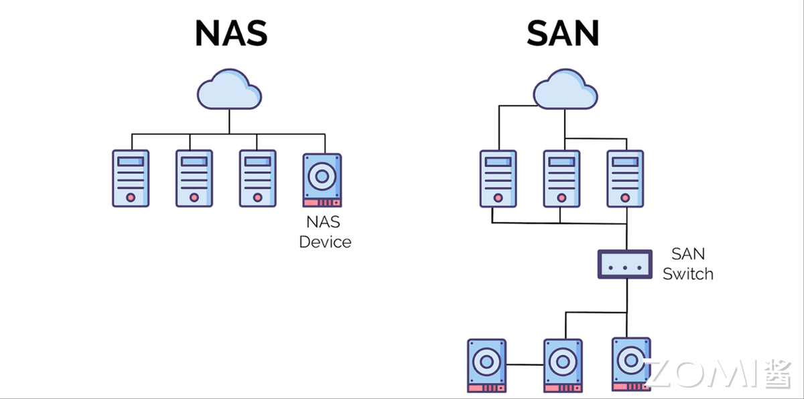

### 3.2 并行文件系统（2010s-至今）

并行文件系统是对象存储服务优化的高性能文件语义系统，为对象存储作为统一数据湖的大数据场景提供解决方案，具备毫秒级访问时延、TB/s 级带宽、百万级 IOPS，以及高兼容性、可扩展性与可靠性。分布式系统的核心挑战之一是实现“线性扩展”——关键性能随服务器数量增长接近正比例提升，同时需避免并行任务单点阻塞，还要通过多副本冗余确保数据不丢失且内容一致。

- Lustre：超算存储主流

Lustre 是由 Intel 主导的开源高性能面向对象并行文件系统，广泛应用于超级计算平台，由元数据服务器（MDS）、对象存储服务器（OSS）与客户端组成。通过 MDS，Lustre 将所有 OSS 的存储设备整合为统一存储空间，提供给客户端挂载，完全兼容 POSIX 语义。它具有强可扩展性，可轻松管理数十 PB 存储，聚合带宽可达每秒数十甚至上百 GB，是当前计算中心的主流磁盘文件系统——全球 Top 100 超算中 70%使用 Lustre。不过 Lustre 受限于 MDS，在海量小文件管理上优势不足，且不支持纠删码、副本等功能，主要用于海量实验数据存储。下图展示 Lustre 的架构。

- Ceph & Gluster：EB 级管理

Ceph 与 Gluster 是 Red Hat 旗下的成熟开源存储产品。Ceph 基于 RADOS 对象存储系统，通过系列 API 以块、文件、对象形式提供数据服务，拓扑围绕副本与信息分布设计，保障数据完整性。Gluster 由 Brick Server（存储节点）、Client（客户端）、NAS 网关组成，三者可部署于同一物理服务器；卷（Block）通过 Client 或 NAS 网关的卷管理器提供服务，卷管理器管理集群中多个 Brick Server；存储节点对外提供的服务目录称为 Brick，对应本地文件系统，Gluster 以 Brick 为单位管理存储。下图展示 Ceph 的系统架构。

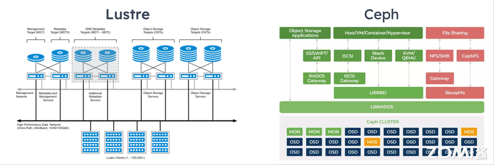

- 国产突破：DeepSeek 3FS

当前开源并行文件系统在性能、高可用与一致性上仍有提升空间，DeepSeek 研发的 3FS（Fire-Flyer File System，萤火虫文件系统）基于软硬件协同理念，采用 RDMA 网络与 SSD 存储盘构建高性能并行文件系统。得益于 RDMA 可绕过远端 CPU 中断处理，直接读取远端 SSD/内存数据，且 RDMA 与 SSD 可通过 NVMe 协议协同，3FS 在 180 个存储节点集群上实现 6.6TiB/s 吞吐性能；在 25 节点集群的 GraySort 基准测试中，吞吐量达 3.66TiB/s，客户端节点 KV Cache 查找峰值吞吐量超 40GiB/s，有效降低 MoE（混合专家模型）的训练与推理成本。

### 3.3 未来趋势

- 存储计算融合：CXL 资源池化

CXL（Compute Express Link）是 2020 年由英特尔、戴尔、惠普等公司联合设计的高速串行协议，旨在解决 HPC 的内存容量、带宽与 I/O 延迟瓶颈，支持内存扩展、共享及与 GPU、FPGA 等计算加速器的高速通信。在 CXL 3.0 协议推动下，存储级内存（SCM）将实现跨 CPU/GPU/FPGA 的内存资源池化，打破传统“内存墙”限制——不同处理器可动态共享 SCM 资源，显著提升异构计算效率，同时降低延迟与系统复杂度。

- 智能数据预取：ML 预测 I/O

智能数据预取（Intelligent Data Prefetching）利用机器学习预测即将到来的 I/O 访问模式，提前将数据加载至缓存，从而减少读写延迟。例如字节跳动存储团队与清华大学联合发布的 CDSBen 模型，覆盖 HDD、SSD、NVMe SSD 等主流存储设备，可预测数据库存储系统性能，满足不同场景基准测试需求；此外，结合机器学习与大数据技术分析用户行为（如抖音内容热度），也能提前预取高热度数据，优化访问体验。

- 冷热数据分级：混合存储平衡

冷热数据分级通过混合部署 NVMe SSD、SATA SSD、HDD 等存储介质，根据数据访问频率与性能需求动态分配资源：高频访问的热数据存于 NVMe SSD，利用其低延迟、高 IOPS 特性满足实时需求；中频温数据存于 SATA SSD 或高效 HDD，平衡性能与成本；低频冷数据存于大容量 HDD 或磁带库，降低长期存储成本。

例如天翼云开发的数据自动迁移引擎，基于访问日志与生命周期策略实现数据跨介质自动迁移——新写入业务数据先存于 NVMe SSD，随访问频率下降逐步迁移至 SATA SSD 或 HDD；同时为 IO 密集型业务的临时数据（如数据库临时表、实时计算中间结果）提供专属高性能存储分区，避免资源竞争。通过这种精细化管理，系统在混合负荷场景下整体 IO 性能提升超 50%，同时成本降低 30%。

## 4. 通信中间件

通信中间件在 HPC 领域发挥着至关重要的作用，从卡间互联到节点互联，各层级通信技术均历经多代发展。

### 4.1 MPI 统治（1990s-2010s）

- MPI：HPC 通信标准

MPI（Message Passing Interface）是跨语言通信协议与标准，定义多进程通信的原语集合，支持点对点（P2P）与集合通信，可基于 TCP/IP、RDMA 等实现点对点、组播、多播模式，其通信机制以点对点为基础，同时在端到端通信上通过原语支持集合通信。

点对点通信（P2P）发生在两个进程间，用于控制同步或数据传输，分为同步（阻塞）与异步（非阻塞）：同步阻塞模式下，MPI_Send 返回表示发送进程缓冲可重用，但不代表接收方已收数据；MPI_Recv 返回表示数据已写入接收进程缓冲，可直接使用。异步非阻塞模式下，进程完成 send/receive 后立即返回继续计算，需通过 MPI_Wait 等测试接口阻塞等待操作确认完成——虽编程复杂度高，但能实现计算与通信并行，降低同步开销。

集合通信中，MPI 原语在进程启动与数据收发中起核心作用。Broadcast 是分发数据的原语：MPI 进程启动后各分配唯一序号 Rank，集合通信需指定协调者（如 Rank 0 进程，称 ROOT），由其将数据发送给所有进程；所有进程均调用 MPI_BCAST，仅根进程负责广播，其他进程接收。

Gather 是采集数据的原语，MPI_Gather 让所有进程将数据发送给根进程；Barrier 是同步进程的原语，当多个进程需协调进入下一阶段时，所有进程调用 MPI_Barrier 后会阻塞，直至所有进程均执行该接口，确保前序工作完成后再同步进入下一阶段。

Intel MPI 与 Open MPI 是主流 MPI 实现，均支持多操作系统，但优化重点不同。Intel MPI 由英特尔开发，在 Intel 处理器与架构集群上性能突出，提供高级优化与调试功能，在 Windows、Linux、Mac OS 上均有良好表现，尤其在 Intel 处理器系统上有额外优化。Open MPI 是开源高性能库，支持多硬件架构，在共享内存 Linux 系统上表现优异，支持单副本优化；针对 Mellanox InfiniBand 的 Linux 系统，其在支持 MPI-3 或 MPI_THREAD_MULTIPLE 的发行版上性能良好，开源特性与跨平台支持是其核心优势。

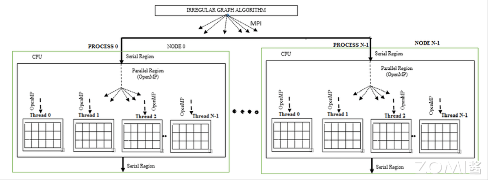

- 性能优化：RDMA 微秒级延迟

远程直接数据存取（RDMA）技术允许一台计算机的应用程序直接访问另一台计算机的内存，无需 CPU 与操作系统中介——概念源自 DMA（外部设备绕过 CPU 访问本地内存），RDMA 则进一步支持访问远程主机的用户态内存。其核心优势包括低延迟（绕过操作系统与 CPU 减少传输延迟）、高吞吐量（实现更高数据传输速率）、低 CPU 负载（释放 CPU 资源用于计算）。

目前 RDMA 有三种硬件实现，均支持统一 API，但物理层与链路层不同：一是 InfiniBand（IB），需专用 IB 网卡与交换机，性能最优但成本高，能将数据传输延迟降至 1μs 级；二是 RoCE（RDMA over Ethernet），由 IBTA 提出，支持标准以太网基础设施，但需交换机支持无损以太网，且网卡需支持 RoCE；三是 iWARP（Internet Wide Area RDMA Protocol），由 IETF 定义，基于 TCP/IP 协议，支持标准以太网且无需交换机无损传输，但受 TCP 影响性能稍差。需注意三种协议均需专用网卡支持。下图展示 RDMA 的核心概念。

### 4.2 多协议协同（2020s-至今）

- UCX：多模型统一接口

Unified Communication X（UCX）是高性能开源通信库，旨在为并行计算应用提供统一通信接口，支持 MPI、OpenSHMEM、PGAS（Partitioned Global Address Space，分区全局地址空间）等多编程模型。它提供 RDMA 通信高级 API，在隐藏底层细节的同时融入优化实践，兼顾性能与开发效率；除 RDMA（IB、RoCE）外，还支持 TCP、GPU、共享内存等传输层，开源仓库可通过 https://github.com/openucx/ucx 访问。

UCX 分为两层：底层 UCT（Unified Communication Transport）适配多种通信设备，从单机共享内存、TCP Socket，到数据中心 RDMA、新兴 GPU 通信均有支持；上层 UCP（Unified Communication Programming）在 UCT 基础上封装抽象通信接口，包括 Active Message（底层 RPC 语义接口，触发接收端操作）、RMA/Atomic（RDMA 抽象，需额外内存注册）、Tag Matching（MPI 常用，消息带 64 位 tag，接收方可指定 tag 接收）、Stream（TCP 字节流抽象）。通常与底层设备模型匹配的接口性能最优，其他接口需软件转换；且同一 UCP 接口传输不同大小消息，可能采用不同 UCT 方法（如 RDMA 中小消息用 eager 协议降延迟，大消息用 Rendezvous 协议提吞吐），策略默认由 UCX 自动选择，用户也可通过环境变量调整。

UCX 针对 RDMA 的优化包括：自动选择最优传输层与设备（在多网卡、多协议场景下动态切换）；根据消息大小适配协议（小消息 eager 协议、大消息 Rendezvous 协议）；内存注册缓存（首次注册后存入缓存，复用避免重复注册开销）；端口聚合（Multi-rail、RoCE LAG，多设备聚合实现负载均衡或冗余）。

其中 OpenSHMEM 是单程序多数据（SPMD）编程模型，强调单边通信与数据移动-同步解耦，是高性能可扩展通信与同步程序的库；其程序由松散同步的处理单元（PE）组成，所有 PE 同时启动执行相同程序，在子域操作并周期性通信。PGAS 是数据并行模型，地址空间全局统一，并行工作聚焦数据集操作——数据集常组织为数组、数立方等结构，任务操作不同分区；共享内存架构下任务通过全局内存存取数据，分布式架构下全局数据物理或逻辑分割，代表实现包括 Coarray Fortran（Fortran 95 扩展，编译器相关）、Unified Parallel C（UPC，C 语言扩展，编译器相关）。

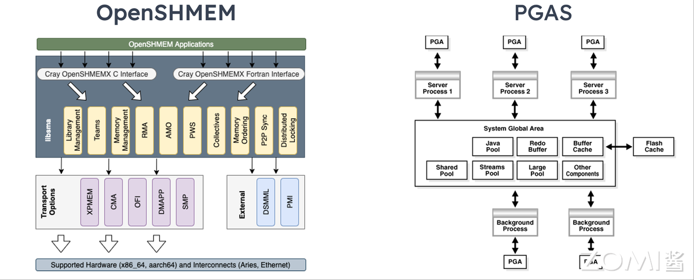

- 云原生通信：gRPC+RDMA

RDMA 作为硬件实现的网络传输技术，能让网卡绕过 CPU 实现服务器间内存数据交换，相比 TCP 大幅提升传输效率，为分布式存储、数据库等 IO 密集业务降低时延、提升吞吐。在 RPC（Remote Procedure Call，远程过程调用）场景中，RDMA 的价值尤为突出——RPC 允许开发者像调用本地函数一样调用远程函数，框架自动处理套接字、序列化、网络传输等底层细节，核心是“屏蔽复杂性”。

在 RPC over RDMA 场景下，服务器与客户端内存可直接传输 RPC 数据。gRPC 是现代高性能开源通用 RPC 框架，为让其适配 RDMA，可通过修改内核与网络栈，使 gRPC 透明运行于 RoCE 网络；或业务侧将原有 gRPC 调用改为 ORPC 调用——这种方式下业务与传输模块独立，通过 SDK 调用，改造代码量少，仅需修改 RPC 调用接口。

### 4.3 未来趋势

- 光网络抽象层：硅光零拷贝

随着计算、存储、网络资源间电气连接性能逼近瓶颈，服务器互联开始向光 I/O 领域探索，以应对数据中心带宽需求激增。硅光子技术通过硅基工艺集成光子器件与电子元件，利用光信号替代铜导线传输数据，核心技术包括混合硅激光器、光波导通路、光电共封装（CPO），可实现传输速率提升 100 倍以上、功耗降低 50%。

英特尔基于内部硅光子技术开发的 4Tbps 双向全集成 OCI 小芯片，专为满足 AI 基础设施带宽需求与扩展性设计。该小芯片含集成激光器的硅光子集成电路（PIC）、电气 IC（EIC）及可拆卸光连接器集成路径，可与下一代 CPU、GPU、IPU 等高带宽需求片上系统（SOC）共封装。其首版实现为多太比特光连接奠定基础，端口密度比 PCIe Gen6 高 4 倍以上，能效低于 3pJ/bit，延迟低于 10ns（含飞行时间），覆盖范围超 100 米，未来有望成为光网络抽象层的核心支撑，推动零拷贝通信协议（如 Intel 光子学 API）落地。

- 自适应路由：拓扑动态路径

将拓扑状态感知的动态路径算法应用于作业调度，是 HPC 通信技术的重要趋势。SLURM（Simple Linux Utility for Resource Management）是开源集群管理与作业调度系统，被全球众多超算与计算集群采用，最初作为资源管理器开发，后通过调度插件演进为强大调度器，在作业数量超资源时发挥关键作用，支持网络拓扑优化、公平共享、高级预留、抢占、帮派调度（Gang Scheduling）等功能。

SLURM 支持时间片帮派调度：将多个作业分配至同一分区相同资源，通过交替挂起让作业在设定时间片内轮流独占资源；同时结合抢占式调度，当高优先级分区或抢占 QOS 作业需资源时，可挂起低优先级作业，帮派调度器负责在适当时机恢复被挂起作业，显著提升系统响应速度与资源利用率。这种基于拓扑感知的动态路径选择，未来将进一步优化跨节点通信效率。

## 5. 调度系统

在 HPC（高性能计算）领域，调度器扮演着至关重要的角色。它们负责合理分配和管理计算资源，确保任务高效完成。HPC 调度系统从静态分配逐步演进至智能动态管理，持续提升作业运行效率。

### 5.1 早期阶段（1990s-2000s）

- 单机调度工具

单机常用的任务调度工具有 cron 和 at 指令，核心作用是通过定时任务在特定时间自动执行脚本或命令，提升系统自动化程度。Unix 系统的 cron 是守护进程，可根据用户配置的时间表定期执行任务，支持周期性任务；at 命令则指定未来某个时间执行一次性任务，仅运行一次。

- 集群调度系统

在 HPC 场景下，调度系统需在集群或超算平台上统一管理软硬件资源。当前集群主流调度器主要有 LSF/SGE/Slurm/PBS 四大流派，支持多节点资源分配。不同行业因使用习惯与应用适配性，偏好存在差异：例如高校与超算中心常用 Slurm，半导体公司多采用 LSF 和 SGE，工业制造业倾向于 PBS。

1. Slurm：可扩展集群管理与调度系统，适用于大型多用户集群，支持交互式、批处理、并行等多种作业类型，提供作业优先级、约束、资源预留等功能，在高校与超算领域应用广泛。
2. LSF（Load Sharing Facility）：基于负载共享的调度器，可根据节点负载将任务分配至轻负载节点实现均衡，衍生版本包括 Spectrum LSF、Platform LSF、OpenLava，源自多伦多大学 Utopia 系统。
3. SGE（Sun Grid Engine）：Sun Microsystems 开发的开源调度系统，支持公平调度、抢占式调度，提供作业优先级、依赖、资源预留等功能，适用于科学计算、工程模拟等场景。
4. PBS（Portable Batch System）：可移植批处理调度系统，支持多操作系统与硬件平台，具备作业优先级、依赖、资源预留等功能，因稳定性与可移植性在工业制造业广泛应用。

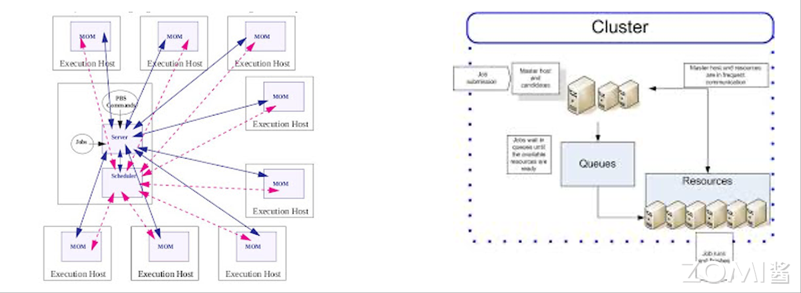

### 5.2 现代调度系统（2010s-至今）

- Slurm：超算主流调度

Slurm 是面向 Linux 及类 Unix 内核的开源作业调度程序，被全球众多超算与集群采用，核心提供三大功能：一是资源分配，在指定时段为用户分配节点独占/非独占访问权限，支持抢占式调度；二是作业管理，提供框架在分配节点上启动、执行、监视并行作业（如 MPI），支持千万级核心调度；三是队列仲裁，通过管理待处理作业队列协调资源争用。

Slurm 在 TOP500 超算中占比约 60%（含天河二号），采用希尔伯特曲线调度或胖树网络拓扑的最佳拟合算法，优化任务分配局部性，实现资源细粒度分配。

- 云原生调度：Kubernetes 扩展

近年大数据与 AI 技术推动下，Kubernetes 作为云原生领域事实标准，通过插件扩展支持 HPC 混合负载，实现容器化任务弹性伸缩。其中 Kubernetes Device Plugin 是标准化资源扩展机制，可将 GPU、FPGA 等特殊硬件纳入资源管理框架——以 NVIDIA GPU 为例，该插件作为调度器与硬件的桥梁，负责 GPU 资源发现、注册与管理，使工作负载无缝利用 GPU 算力。

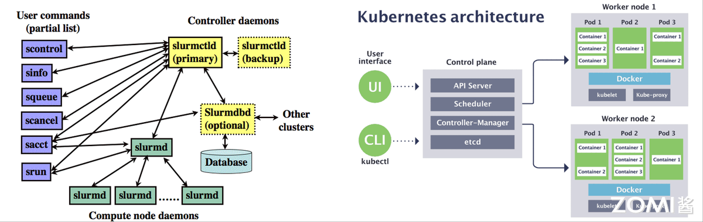

### 5.3 未来趋势

- AI 驱动预测调度

基于强化学习（RL）的调度算法，可动态优化任务优先级：传统运维中资源按固定配置使用，高峰时易出现性能瓶颈；智能化运维下，AI 实时监控 CPU 使用率、内存、磁盘 I/O 等数据，通过 RL 算法训练历史数据，发现负载规律并预测性能瓶颈，动态调整资源配置以应对高并发。

- 异构资源协同
AI 与 HPC 领域对 GPU、NPU、RDMA 等异构资源调度需求激增，需实现 CPU/GPU/NPU 混合调度：例如智能手机 SoC 通过 CPU、GPU、NPU 协同处理多任务与 AI 优化；数据中心组合三类硬件构建计算链条；阿里云等厂商的 K8S 云原生套件已具备异构资源调度能力。

- 绿色节能调度

结合硬件功耗监控与能耗感知策略，可降低 PUE（电源使用效率）10%-20%：通过 LSTM 等算法预测工作负载波峰波谷，低负载时整合任务至少量服务器，其余节点休眠减少空闲功耗；若配备光伏等新能源，优先在绿电充沛时段安排计算任务，最大化消纳绿电。

## 6. 未来挑战

HPC 基础软件将向智能化、一体化、开放生态演进，当前需应对三大核心挑战：

### 6.1 硬件碎片化

计算领域（尤其 AI 与 HPC）硬件架构多样（CPU、GPU、AI 加速器、FPGA 等），为每种硬件单独优化代码工作量巨大，且易导致厂商生态锁定（如 NVIDIA CUDA）。解决方案为“开放标准+统一中间表示”：

- 开放标准：oneAPI（英特尔发起）提供统一工具与库（如 DPC++、oneDNN），支持多硬件开发；UXL Foundation（Linux 基金会托管）联合谷歌、ARM 等厂商扩展 oneAPI 生态。
- 统一中间表示：MLIR（谷歌发起，LLVM 生态）通过“多层 IR”实现代码从高层抽象到硬件指令的逐步转换，支持自定义方言，适配不同硬件生成机器码（如 NVPTX、SPIR-V）。

### 6.2 存储与计算失衡

“存储与计算失衡”（又称“内存墙”）源于数据移动速度滞后于计算速度：CPU/GPU 算力强大，但内存/硬盘访问缓慢，数据搬运耗时耗能远超计算本身，导致性能瓶颈、能效低下、成本高昂。解决方案包括：

- 存算一体架构（如 Near-Data Processing）：将计算单元嵌入存储设备，数据原位处理，仅返回结果，减少无效数据移动，降低延迟与能耗。
- CXL 内存池化：基于 CXL 协议整合多服务器内存为共享资源池，支持动态分配，打破内存与计算固绑，提升资源利用率，降低成本。

### 6.3 能源效率优化

AI 算力能耗巨大，需软硬件多栈协同优化每 FLOP（浮点运算）能耗：

1. 运行时动态调频：CPU/GPU 根据负载自动调整频率与电压，高负载高效运行，空闲时降频节能；
2. 功耗感知调度：集群管理器结合任务特性、节点能效数据，将作业分配至能效最高节点，或整合负载使冗余节点休眠；
3. 算法-硬件协同：为 AI 推理等场景设计专用硬件（如 TPU），或基于硬件特性优化算法，减少数据移动，从源头降低能耗。

## 7. 总结与思考

本文从编译器与运行时、计算库、存储系统、通信中间件和调度系统五个方面，梳理 HPC 基础软件的发展历程与趋势：HPC 基础软件正朝着智能化（如 AI 驱动调度、自动调优）、一体化（如存算融合、多协议协同）、开放生态（如 oneAPI、MLIR）方向演进，未来需持续突破硬件碎片化、存储计算失衡、能源效率等挑战，为高性能计算与 AI 应用提供更坚实的软件支撑。

## 8. 本节视频

<html>
<iframe src="https://player.bilibili.com/player.html?isOutside=true&aid=114786238992560&bvid=BV1Sr3YzXEQa&cid=30819877532&p=1&danmaku=0&t=30&autoplay=0" width="100%" height="500" scrolling="no" border="0" frameborder="no" framespacing="0" allowfullscreen="true"> </iframe>
</html>

## 9.引用与参考

- [Fortran](https://zh.wikipedia.org/wiki/Fortran#FORTRAN)
- [OpenMP](https://zh.wikipedia.org/wiki/OpenMP)
- [Cuda 和 OpenCL](https://www.incredibuild.cn/blog/cuda-vs-opencl-gpu-bianchenggaiyongshenme)
- [oneAPI 的体系架构和 SYCL](https://zhuanlan.zhihu.com/p/697611565)
- [oneAPI 英特尔主页](https://www.intel.com/content/www/us/en/developer/tools/oneapi/overview.html)
- [CANN](https://www.hiascend.com/software/cann)
- [Autotuning 原理](https://developer.aliyun.com/article/1644057)
- [编译器革命：MLIR 的 AI 硬件统一中间表示](https://cloud.tencent.com/developer/article/2540075)
- [Triton：用于分块神经网络计算的中间语言和编译器](https://zhuanlan.zhihu.com/p/12890124532)
- [NFS 与 SAN](https://blog.csdn.net/weixin_54015549/article/details/130704776)
- [CXL（Compute Express Link）技术](https://blog.csdn.net/Long_xu/article/details/131317471)
- [UCX](https://zhuanlan.zhihu.com/p/710878933)
- [并行编程模型](https://blog.csdn.net/weixin_43728590/article/details/107211981)
- [RDMA](https://blog.csdn.net/bandaoyu/article/details/112859853)
- [RDMA 在典型场景下的技术应用分析与探索](https://blog.csdn.net/zhengxianghdu/article/details/132226610)
- [智能化运维：AI 驱动的服务器性能预测与优化策略](https://blog.csdn.net/Clownseven/article/details/149598820)
- [GPU 资源调度：k8s-device-plugin 知多少 ？](https://cloud.tencent.com/developer/article/2474846)
- [【云原生】深入浅出 K8s 设备插件技术（Device Plugin）](https://blog.csdn.net/qq871325148/article/details/145849748)
- [HPC 中的调度器介绍](https://developer.baidu.com/article/details/3220980)
- [Linux 定时任务详解全面掌握 cron 和 at 命令](https://blog.csdn.net/shy_1762538422/article/details/140234590)
