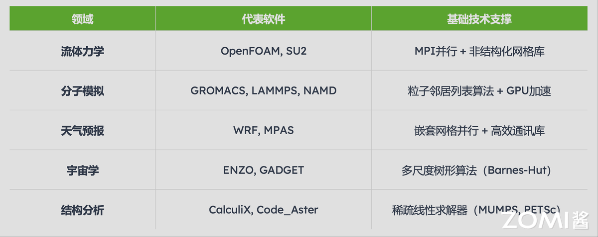
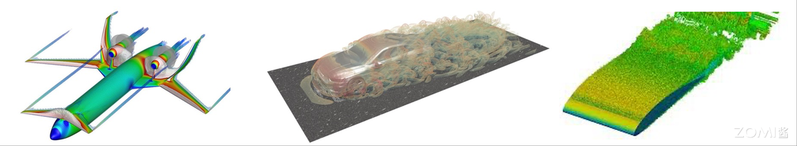
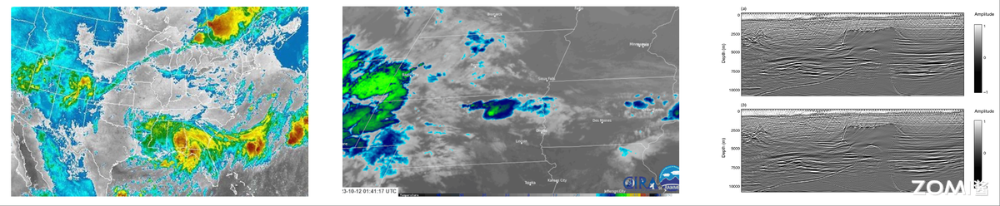

<!--Copyright © ZOMI 适用于[License](https://github.com/Infrasys-AI/AIInfra)版权许可-->

# 03.HPC 应用软件发展趋势(DONE)

> Author by：陈悦孜

## 1. 应用发展历程

### 2.1 专用代码（1990s-2000s）

在专用代码时代，各领域自研封闭式代码，对于底层硬件有很强的依赖性。

LASNEX 是美国劳伦斯利弗莫尔国家实验室开发的一款极其复杂和精密的多维辐射流体动力学模拟程序。它是用于设计和分析核武器性能以及惯性约束聚变实验的核心工具。LASNEX 包含了大量与核武器设计相关的敏感物理模型和数据，其代码和详细文档受到严格的出口管制，仅限极少数经过安全审查的美国公民在特定国家实验室的保密网络上使用。它是核爆模拟领域能力最强、最成熟的模拟工具，是其他同类软件对比的基准。

WRF 和 MM5 都是开源的、广泛使用的中尺度数值天气预报模型。它们用于模拟和预测从几公里到几千公里范围内的天气现象。MM5 是由宾夕法尼亚州立大学和美国国家大气研究中心联合开发的第五代中尺度模型，在 2000 年代初期是研究和业务预报领域的主力模型。目前大部分用户和业务单位已迁移到 WRF。WRF 是由多个美国机构（NCAR, NOAA, NCEP 等）联合开发的下一代中尺度天气预报和数据同化系统，它提供了更先进的数值方法、物理过程方案和更好的并行计算能力。但是它们对硬件要求非常高，都属于计算密集型应用，对硬件，尤其是 CPU、内存和网络有极高的需求。网络必须高速互联才能在业务场景下使用，比如 InfiniBand，同时需要巨大的存储空间，模拟结果轻松达到 GB 以及 TB 级别，特别是在长时间、高分辨率的模拟情况下。

在专用代码时代，各种高性能计算软件并行扩展性差，维护成本很高并且移植困难。当时 MPI 实现粗糙，Fortran/C 主导的代码动辄百万行，维护难；从向量机到集群等场景移植难度大。

### 1.2 社区软件崛起（2000s-2010s）

到 2000 年后，可复用开源框架出现，行业专家和高性能计算开发者协同优化出行业软件。

在 2000 至 2010 年期间，随着社区软件包的崛起，多个科学与工程领域逐步实现了标准化，涌现出一批可复用的开源框架。在流体力学领域，以 OpenFOAM 和 SU2 为代表的软件基于 MPI 并行计算和非结构化网格库实现高效模拟；分子模拟方面，GROMACS、LAMMPS 和 NAMD 等工具依赖粒子邻居列表算法和 GPU 加速技术；天气预报软件如 WRF 和 MPAS 采用嵌套网格并行与高效通信库；宇宙学模拟软件 ENZO 和 GADGET 则运用多尺度树形算法（如 Barnes-Hut 方法）；结构分析工具 CalculiX 和 Code_Aster 则依托稀疏线性求解器（如 MUMPS 和 PETSc）处理大规模计算问题。这一阶段的软件发展显著提升了各领域仿真的精度与效率。

### 1.3 多学科融合（2020s-至今）

在 2020 年后 AI 发展火热，AI 赋能多学科发展，多学科与 AI 融合的新需求驱动 AI 发展引发技术革命。

在多学科发展下，对高性能计算的精度要求提升。比如在飞机制造中亿级网络的 CFD 仿真对计算有高精度要求。在量化交易毫秒级响应场景下，对计算的实时性要求也很高。在生物医学领域的基因测序应用下 PB 级数据处理产生的数据量很大，对计算数据处理量也有高要求。

由这些需求带来技术革命。人工智能和机器学习计算融入高性能计算，传统模拟结合深度学习模型，比如在天气预测中用到的扩散模型，学习海量的历史气象数据，然后像“画家”一样，从一片随机噪声开始，一步步“描绘”出未来最可能出现的天气图景。高性能计算和 AI 工作流混合需要云原生架构来管理任务和资源，Kubernates 作为容器编排平台可以在一个大规模的集群上管理混合 HPC+AI 工作流。

## 2. 行业应用

### 2.1 基础科学领域

1. 核爆模拟​​

当前核爆模拟正朝着多物理场强耦合的方向发展，这要求同时高精度求解辐射流体力学、材料响应及相变等一系列复杂相互作用的过程。为应对这一挑战，先进的计算技术被采用，主要包括自适应网格加密（AMR） 以在关键区域动态提升分辨率，并结合异步通信策略来减少频繁的全局同步开销，从而显著提升大规模并行计算的效率。这一技术路线的成功实践体现于美国 LA-UR 系列代码在 Frontier 超算上的卓越表现，该应用成功实现了百亿亿次（exascale）计算扩展，标志着核爆模拟进入了一个前所未有的超精细、超大规模计算时代。

2. 高能物理

在高能物理领域，尤其是大型强子对撞机（LHC）等大型实验中，数据处理正面临前所未有的规模挑战，核心趋势是采用边缘计算预处理策略，即在实验装置现场的计算节点上对原始数据进行实时筛选，高效滤除高达 99.99%的无用或背景数据，仅将极少数有价值的事例传输到远端数据中心。为支撑这一苛刻的实时处理任务，当前的技术方案依赖于高性能流式处理框架（如 Apache Kafka） 实现数据的可靠高速流水线分发，并结合 GPU 加速分析对复杂触发算法进行并行化计算，从而在毫秒时间内完成事例重建与选择，极大减轻了后端存储与计算系统的负担，使科学家能够更聚焦于物理发现。
​

### 2.2 工程制造领域

1. 飞机制造

飞机制造领域的一大重要趋势是构建高保真的数字孪生系统，通过实时集成飞行中的传感器数据对虚拟模型进行动态校准，以实现精准的性能预测与健康管理。支撑这一趋势的关键技术包括采用基于 GPU 加速的非结构化网格求解器（如 SU2），显著提升气动与流体仿真效率；同时结合多目标优化库（例如 DAKOTA）与机器学习代理模型，在庞大的设计空间中快速寻优，从而大幅缩短研发周期并提升设计精度。

2. 汽车碰撞测试

汽车碰撞测试正经历以混合精度计算为核心的范式变革，即在保持高精度（FP64）进行关键物理验证的同时，利用半精度（FP16）高效训练融合物理规律的安全 AI 模型，以实现极速的虚拟安全测试。这一变革依托于现代化的工具链集成：传统显式有限元分析标杆 LS-DYNA 负责高保真碰撞物理仿真，而基于 NVIDIA Modulus 等物理 AI 框架构建的神经网络则学习并内化物理规律，最终形成能够替代部分仿真的高效代理模型，成千上万次地加速安全测试与优化迭代

### 2.3 地球科学领域

1. 天气预报

天气预报领域正朝着实现公里级分辨率全球模拟的重大趋势迈进，这对数值模式与数据同化能力提出了极高要求。相应的软件架构持续演进：从传统的 WRF 中尺度模式，转向采用非结构化网格的 MPAS 以灵活适应不同区域分辨率，并结合有限体积法（FVM） 提升离散精度和守恒性；同时，通过持续优化四维变分同化（4D-Var）算法，更高效地融合多来源、高频次的观测数据，显著提升初始场质量与预报准确性。

2. 油气勘探

油气勘探行业广泛采用全波形反演（FWI） 这一高精度地下成像技术以获取更准确的速度模型。为克服其巨大的计算与通信开销，性能瓶颈正通过两大创新得以突破：一方面引入通信避免算法（CA-FWI），极大降低大规模并行计算中的同步与数据交换代价；另一方面充分利用 GPU 中的 Tensor Core 对计算密集的波场重建过程进行混合精度加速，使完成高分辨率反演所需时间从数周缩短至数天，大幅提升勘探效率。

## 3. 总结与思考

本文从编译器与运行时、计算库、存储系统、通信中间件和调度系统的五个方面来介绍高性能计算基础软件内容，梳理了 HPC 软件的发展历程与趋势：HPC 基础软件将向智能化、一体化、开放生态演进。本文也介绍了 HPC 应用软件发展历程和具体应用。HPC 应用软件覆盖领域广泛，与多学科融合，互相赋能。

## 4. 本节视频

<html>
<iframe src="https://player.bilibili.com/player.html?isOutside=true&aid=114786238992560&bvid=BV1Sr3YzXEQa&cid=30819877532&p=1&danmaku=0&t=30&autoplay=0" width="100%" height="500" scrolling="no" border="0" frameborder="no" framespacing="0" allowfullscreen="true"> </iframe>
</html>

## 5. 引用与参考

- [LASNEX](https://en.wikipedia.org/wiki/LASNEX)
- [MM5](https://en.wikipedia.org/wiki/MM5_(weather_model))
