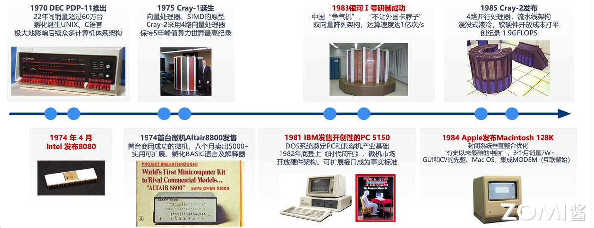
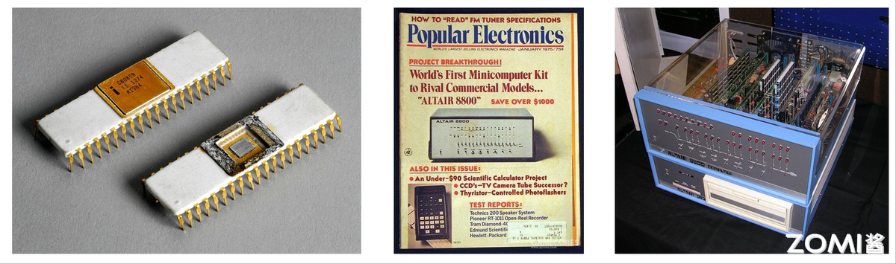
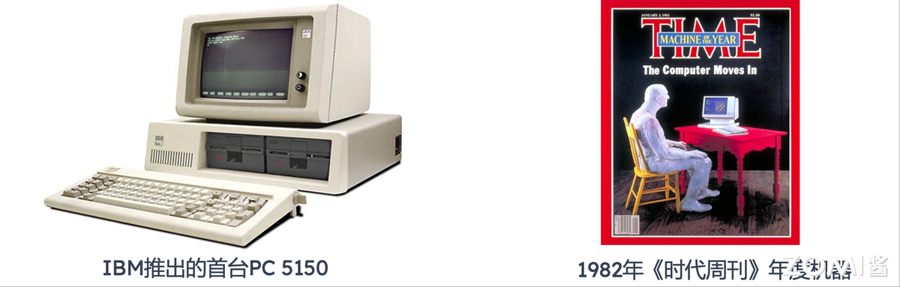
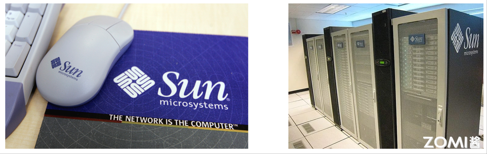
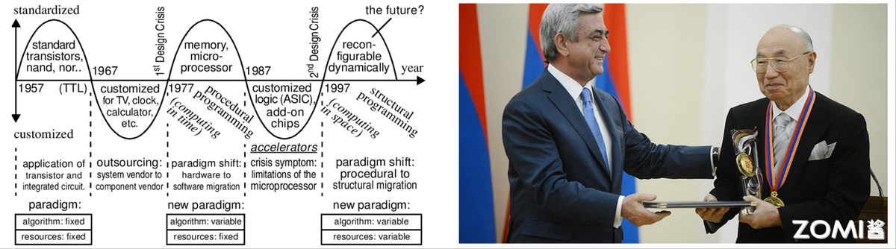

<!--Copyright © ZOMI 适用于[License](https://github.com/Infrasys-AI/AIInfra)版权许可-->

# 计算集群初期历史回顾

Author by: 陈悦孜

本章节将介绍集群计算的发展历程。总共分为 4 个时代：

1. 奠基时代 1945~1970

2. 通用架构时代 1971~1995

3. 互联网云计算时代 1995~2020

4. 未来计算时代 2020~2030

## 计算产业发展历程

计算产业由计算需求驱动，发展历程从专用计算到通用计算，再到集约泛在融合的未来计算。

计算机发展历程大致可分为如图以下几个阶段：

1. 第一代（1945 - 1970 年）：单体算力集中计算
这一时期以巨型机、大型机为代表，核心是单体算力集中计算。1946 年 ENIAC（电子数字积分计算机）诞生，标志着计算机的问世，它体型庞大却开启了计算时代。之后，技术逐渐 “下沉”，出现了 IBM S/360 等大型机，为后续计算设备发展奠定基础。

2. 第二代（1970 - 1995 年）：小、微型分散计算
此阶段朝着小、微型分散计算演进。Cray - 1 诞生，在高性能计算领域崭露头角。同时，计算机不断 “小型化”，DEC PDP - 8 等小型机出现；还开始 “分散 / 泛在部署”，IBM PC 等微型机走入更多场景，计算不再仅依赖大型集中式设备，开始向更广泛领域分散。

3. 第三代（1995 - 2020 年）：大规模并行分布式云计算
这一阶段主打大规模并行分布式云计算，数据中心与集群技术诞生，成为 “算力摸高主赛道”。IBM Z 系列大型机、IBM AS/400e 等设备，助力计算能力通过分布式、并行化的方式大幅提升，能处理更海量的数据与更复杂的任务。

4. 下一代（2021 - 2030 年）：集约化、泛在化融合计算
未来将迈向集约化、泛在化融合计算，强调 “万物互联 + 集约泛在融合计算”。像 cloudmatrix 384、NVIDIA Three Computer Solution 等，预示着计算将在更广泛的万物互联场景下，实现资源的集约化与泛在化融合，释放更强算力潜能。

## 奠基时代 1945-1970

这一时期计算机器件以电子管、晶体管为主，因体积大、耗电多、计算资源消耗大且成本高，计算资源集中成为必然选择，主要服务于国防、科研等军事或准军事领域。

奠基时代计算机发展历程如图所示。

1924 年，IBM 创立，主营机械自动制表机，替代人力计算。1929 年，“超算” 一词首登《纽约时报》，IBM 为哥伦比亚大学定制制表机。

在密码破译等军事相关领域，1938 年，图灵用炸弹机破解 ENIGMA，选明文 + 查表法破译超 3.9 万亿密码组合，为破译情报、打击德军等作出贡献。

计算机研发方面，1944 年，Harvard Mark - 1 诞生，是 IBM 为军方研制的继电器计算机，能全自动计算曼哈顿计划军事数据，对现代电脑设计影响深远。

1946 年，首台通用可编程计算机 ENIAC 诞生，算力提升显著，用于火炮火力表精准度计算，后改进为冯・诺依曼架构，采用存储程序执行方式。

到了商业与高性能计算领域，1963 年，超算鼻祖 CDC6600 诞生，突破每秒百万次浮点运算，持续 5 年保持全球最快，采用管线标量架构、RISC 精简指令集，还有 IC 硅芯片与氟利昂制冷系统。1964 年，IBM System / 360 诞生，是首台商业成功的大型机，有 50 亿美元的资源投入，远超曼哈顿计划首台氢弹的花费，还曾用于计算阿波罗 11 号返回着陆点。

第一代计算机有着鲜明特点：采用单一专有架构，以图灵机或冯・诺依曼机为核心，形成封闭生态，不同厂商、不同型号的计算机系统间，硬件架构、指令集等难以兼容互通；软硬件呈紧耦合状态，这种模式虽让运行效率得以提高，能更高效地利用硬件资源执行任务，但也限制了软件的灵活性与可移植性；软件开发极为困难，正如 “人月神话” 所体现的，软件开发工作量大、周期长，且容易出现投入人力时间与实际产出不成正比的情况，极大地制约了软件的发展与创新。

### 第一代的计算机

### ENIAC

1946 年，ENIAC 诞生。ENIAC 是数据中心发展的鼻祖，它长 30.48 米，宽 6 米，高 2.4 米，占地约 170 平方米，内部含有 17468 只电子真空管、7200 个二极管、70000 多电阻器、10000 多只电容器和 6000 只继电器，有电路 50 万焊接点，30 个操作台，重 30 吨，功耗 150KW。运算速度为每秒 5000 次加法或 400 次乘法，计算能力是继电器计算机的 1000 倍，手工计算的 20 万倍。ENIAC 首次应用即参与新墨西哥州洛斯阿拉莫斯，进行原子弹爆炸试验计算。

### EDVAC
1951 年，EDVAC 诞生。离散变量自动电子计算机（Electronic Discrete Variable Automatic Computer, EDVAC），是首台二进制的冯﹒诺伊曼架构计算机。它含有 6000 个真空管，12000 个二级管，占地 45.5 平，功耗 56KW。运算速度为每秒可执行 1150 次加法或 340 次乘法，具备 1000 个 44bit（使用延迟线存储器）。EDVAC 被应用于美军阿伯丁实验室，进行弹道研究计算。

### CDC6600

1963 年 8 月推出 CDC6600 被评为第一个成功超级计算机（超算鼻祖），每秒浮点次数达 1 百万次，超过当时最快的计算机 IBM 7030 约三倍。它专为伦斯辐射实验室设计，直到 1969 年一直保持世界最快计算机。它是超算创新技术的成果，采用超标量架构，使用 RISC 精简指令集、硅片和氟利昂冷却系统的锗晶体管，主要被用于高能核物理研究。

### S/360

1964 年，IBM 推出第一台大型机 S/360。1956 年，小汤姆 • 沃森接掌 IBM。当时，技术变革方兴未艾，晶体管取代了真空管，磁性存储器取代穿孔卡。1962 年，小沃森决定彻底调整公司产品战略，研发 S/360 大型机，1964 年推向市场，小沃森最冒险决定开创大型机时代。

S/360 这项 50 亿美元的投资，被证实是一项启动创新商业运作历史性变革。超过第二次世界大战中研制原子弹的曼哈顿项目。大型机在可靠性、可用性和可服务性霸主地位至今仍无其他产品能够撼动。

下图左边为小汤姆 • 沃森，右边为 S/360 大型机。

### PDP-8

1966 年，DEC 数字设备公司（Digital Equipment Corporation）开创小型机时代，历经 40 年从辉煌走向消亡。
当计算机世界向复杂和昂贵方向发展， 1966 年 DEC 推出 PDP-8 型计算机，可以放在办公桌，价格只有 18,000 美元，远低于 IBM 等计算机公司产品价格。PDP-8 系列产品一共卖出 30 万台，推动 DEC 上世纪六十年代中后期到七十年代中期称霸小型机市场。

20 世纪 80 年代末，DEC 的年收入达到了 130 亿美元 ，纯利润为 11 亿美元，在当时的计算机行业中，是仅次于 IBM 的第二号巨头企业，展现出强大的经济实力和市场影响力。达到发展巅峰后，DEC 的经营状况开始恶化。在微机市场领域，DEC 无法与个人计算机（PC）竞争，市场份额不断流失；在小型机市场，也面临新竞争对手的挑战，市场被逐渐蚕食 。1957 年，肯・奥尔森（Kenneth H. Olsen）等以 7 万美元创建了 DEC 公司。到了 1998 年 6 月，DEC 被康柏电脑公司（Compaq）以 96 亿美元的价格收购。然而，康柏自身也未能在激烈的市场竞争中保持优势，2001 年，惠普公司（HP）又以 250 亿美元的价格收购了康柏 。

下图左边为 PDP-8 型计算机近看外观，右边为 PDP-8 型计算机拆开外壳后内部情况。

### 贝尔定律

贝尔定律：如果保持计算机能力不变，每 18 个月微处理器的价格和体积减少一半。

贝尔定律是关于微处理器发展特点和规律经验性总结，是对摩尔定律补充。过去 30 年，这两条定律不仅适用于半导体行业，同样适用于存储容量、显卡性能和显示器性能发展。贝尔指出“Roughly every decade a new, lower priced computer class forms based on a new programming platform, network, and interface resulting in new usage and the establishment of a new industry.” 大约每十年，就会诞生一个价格更低的新型计算机门类，它以全新的编程平台、网络和接口为基石，最终开辟出新的应用领域，并奠定一个全新产业的基础。

70 年代，贝尔定律的提出者戈登贝尔任 DEC 计算机设计师。1987 年，Gordon Bell 创立戈登贝尔奖 ，国际上 HPC 应用领域最高学术奖项，被称为“超算领域的诺贝尔奖”，由 ACM 每年评选和颁发。1991 年到 1995 年，贝尔担任微软公司顾问，指导公司未来研发方向，并帮助建立第一个微软研究实验室。

下图分别为年轻的贝尔和年老的贝尔。

## 通用架构时代 1971-1995 

这一时期集成电路成熟，小微机时代爆发，这是通用架构的新时代：架构从专有走向通用的半开放状态，UNIX OS 和分层架构的出现证明软硬件按照部署和分层解耦，高级语言的出现使得软件开发更简单。

这一时期涌现了多个里程碑事件，如下图所示。

1970 年 DEC 推出的 PDP-11 在 22 年间销量超 600 台，并成为 UNIX 和 C 语言的孵化平台，深刻影响了后续体系架构。1975 年 Cray-1 诞生，成为向量处理器和 SIMO 架构的原型，其后续型号 Cray-2 采用 4 路向量处理器并保持了 5 年世界算力纪录。1983 年中国成功研制银河Ⅰ号，采用双向量阵列架构，实现亿次每秒运算，被誉为“争气机”，“不让外国卡脖子”；1985 年 Cray-2 发布，以 4 路并行处理器和流水线架构实现 1.9GFLOPs 的创纪录性能，采用了浸没式液冷技术，实现了软硬件开发成本打平。

与此同时，微计算机开始兴起：1974 年 Intel 发布 8080 处理器，同年首台商用成功的微机 Altair 8800 发售，八个月内销量超 5000+台，改机型实用性强可拓展，孵化 BASIC 语言及解释器。1981 年 IBM 发售开创性的 PC 5150，其开放架构和 DOS 系统奠定了 PC 兼容产业的基础，于 1982 年底登上《时代周刊》，微机市场开放硬件架构、可拓展接口成为事实标准。1984 年 Apple 发布 Macintosh 128K，以图形用户界面和高度集成化设计引领风潮，垂直整合优化封闭系统，将硬件、操作系统（Mac OS）与用户体验无缝结合，成为当时“有史以来最酷的电脑”，它同时也是 GUI 和 CV 的先驱，集成了 MODEM（调制解调器），为用户打开了通向广域网络的大门，这可谓现代个人电脑互联时代的肇始。

这些事件共同推动了计算机技术从专有走向通用，从大型机扩展至个人微机，奠定了现代计算生态的基石。

### 第二代的计算机

### Altair 8800

1974 年，英特尔发布了划时代的 8080 微处理器，与此同时，以它为核心的 Altair 8800 问世，共同拉开了微机普及的序幕。
作为首台取得商业成功的微型计算机，Altair 8800 不仅是一款可扩展的实用微机，其 439 美元的套装定价更是极具吸引力，推出后大受市场欢迎，在八个月内销量便超过了 5000 台。

下图左边为英特尔 8800 微处理器，中间为 Altair 8800 微型计算机，右边为 Altair 8800 微型计算机内部结构情况。

这一硬件热潮也催生了关键的软件生态：当时，比尔·盖茨和保罗·艾伦为 8080 处理器成功开发了 BASIC 语言解释器。正是在这一过程中，他们敏锐地察觉到了软件行业的巨大机遇，并由此共同创建了微软（Microsoft）公司。

### PC 5150

1981 年，IBM 公司正式发售了其开创性的 Personal Computer 5150，这台定价 1565 美元（包含主机和键盘，可选配显示器和打印机）的个人电脑上市后取得了巨大成功，至 1984 年，该系列电脑已占据整个 PC 市场三分之一的份额。其成功的核心在于 IBM 所采取的开放策略：它不仅设计了开放的硬件架构并预留了可扩展接口，更关键的是将 PC 的设计技术参考手册公之于众。

这种开放标准使得第三方厂商能够基于公开的规范，生产通用的兼容组件和扩展配件，极大地降低了 PC 制造的准入门槛。正是这一策略，为 IBM 赢得了空前绝后的硬件与软件生态支持，最终使其 PC 的开放架构成为整个个人电脑行业公认的事实标准。

### Sun 提出网络即计算机

在个人电脑（PC）走入千家万户之后，其计算模式主要是各自独立的本地运算，由于输入/输出（I/O）带来的待处理数据量很小，单台 PC 所能发挥的算力与作用相对有限。

正是在此背景下，1984 年，作为开放网络计算先导的 Sun Microsystem 公司提出了“网络就是计算机”的革命性理念。这一构想预示着，海量的小型及微型计算机将通过交换机与路由器逐步互联并集合起来，形成一个庞大的计算资源池。此后，计算网络的发展轨迹正如其所预见，从局域网扩展到城域网，并最终形成了全球范围的万维网（WWW）互联网，由此正式拉开了网络互联时代的大幕。

左图为 Sun Microsystem 公司 logo，右图为 Sun Microsystem 公司互联的计算机。
### 牧村定律

牧村定律（Makimoto's Wave）由原日立公司总工程师牧村次夫（Tsugio Makimoto）于 1987 年提出，它揭示了处理器架构领域一种“合久必分”的周期性规律，其波动周期大约为十年。

该定律的背后，是产业在性能功耗与开发效率之间寻求动态平衡的必然结果；具体到处理器架构上，则体现为专用结构与通用结构之间的持续交替与平衡。

左图展示了牧村定律内容，右图右一为牧村。

上图左边牧村定律展现了电子信息技术领域从 1957 年左右开始，大致历经以下五个阶段的发展脉络：
1. 标准化基础器件主导（约 1957 - 1967 年）
   
这一阶段以标准化的晶体管（如与非门、或非门等）以及晶体管 - 晶体管逻辑（TTL）为核心。范式是算法固定、资源固定，主要聚焦于晶体管和集成电路的应用，通过标准化的基础电子器件构建电子系统的底层，为后续技术发展奠定基础。

2. 定制化应用拓展（约 1967 - 1977 年）

随着技术发展，开始出现针对电视、时钟、计算器等特定领域的定制化应用。同时，出现了 “外包” 趋势，系统供应商向组件供应商转变。不过，这一阶段也潜藏着第一次设计危机（1st Design Crisis），因为定制化需求增多与基础器件标准化之间的矛盾开始显现。

3. 程序性计算范式（约 1977 - 1987 年）

以微处理器为代表，进入程序性计算时代，强调 “时间上的计算（computing in time）”。新范式是算法可变但资源固定，发生了硬件向软件迁移的范式转变，软件在系统功能实现中的作用愈发重要，一定程度上缓解了此前的设计危机，但也带来了新的局限。

4. 加速器与定制化逻辑（约 1987 - 1997 年）
   
专用集成电路（ASIC）和附加芯片（accelerators）成为关键，此时出现了微处理器局限性的危机征兆，即单纯依靠微处理器和程序性计算难以满足所有高性能需求，需要定制化逻辑来加速特定任务。

5. 结构化编程与未来展望（1997 年及以后）
朝着 “空间上的计算（computing in space）” 发展，新范式是算法可变且资源可变，发生了从程序性到结构性迁移的范式转变，可重构（reconfigurable dynamically）成为重要特征，展现出对未来技术发展的展望，有望解决此前微处理器等带来的诸多局限，开启新的技术发展阶段。

这一规律在进入微机时代后表现得尤为清晰：计算需求最初从大型机的专有特定高算力，转向了满足通用商业与家庭计算的通用结构；然而，正如定律所预言，在若干年后，技术的钟摆又会再次摆回到追求极致效率的专用加速方向。

## 总结与思考

本章介绍了奠基时代和通用架构时代，这里总结这两个时期的特点。

1. 奠基时代 (1945~1970)

此时期以电子管和晶体管为核心器件，计算机系统追求单体算力的高度集中。然而，这些早期计算机普遍存在体积庞大、耗电量极高的特点。

2. 通用架构时代 (1971~1995)

随着大规模集成电路的爆发式发展，计算机进入通用架构新时代。一方面，巨型机持续摸高算力极限；另一方面，小型机和微型机也得以快速普及，计算能力开始向更广阔的范围渗透。

## 本节视频

<html>
<iframe src="https://player.bilibili.com/player.html?isOutside=true&aid=114867390451909&bvid=BV1vugAzgEMK&cid=31102602285&p=1&as_wide=1&high_quality=1&danmaku=0&t=30&autoplay=0" width="100%" height="500" scrolling="no" border="0" frameborder="no" framespacing="0" allowfullscreen="true"> </iframe>
</html>

## 参考与引用

- [ENIAC](https://zh.wikipedia.org/wiki/ENIAC)
- [EDVAC](https://zh.wikipedia.org/wiki/EDVAC)
- [CDC 6600](https://zh.wikipedia.org/wiki/CDC_6600)
- [IBM 设计推出 S/360](https://www.ibm.com/history/system-360)
- [PDP-8](https://en.wikipedia.org/wiki/PDP-8)
- [贝尔定律](https://baike.baidu.com/item/%E8%B4%9D%E5%B0%94%E5%AE%9A%E5%BE%8B/6707108)
- [Altair 8800](https://en.wikipedia.org/wiki/Altair_8800)
- [IBM PC](https://zh.wikipedia.org/wiki/IBM_PC)
- [Sun Microsystem 提出网络即是计算机](https://en.wikipedia.org/wiki/The_Network_is_the_Computer)
- [牧村定律](https://www.researchgate.net/publication/3743460_Parallelization_in_co-compilation_for_configurable_accelerators-a_hostaccelerator_partitioning_compilation_method)
