<!--Copyright © ZOMI 适用于[License](https://github.com/Infrasys-AI/AIInfra)版权许可-->

# 05.计算集群当代与未来发展

Author by: 陈悦孜

## 云与大数据时代 1995-2020

1995 年后，互联网和云计算兴起，催生更多集中算力需求，传统“机房”升级为新形态“数据中心”，进入数据中心时代算力服务也变得灵活多样。

第一阶段在 20 世纪 90 年代早期，电信企业主要面向大型企业提供机房托管服务，以基础电信运营商为主体的服务商主要提供主机托管和电力、带宽、通信设备等基础设施服务；到 20 世纪 90 年代中期至 2004 年是第二阶段，在互联网高速发展的推动下，网络数量激增带来了互联网设备集中放置和维护需求的显著增长，数据中心服务从单纯的主机托管扩展至网站托管，并开始提供数据存储管理、安全管理、网络互联等增值服务，成为企业 IT 基础设施的核心组成部分；第三阶段从 2005 年至今，在数据爆炸式增长、摩尔定律失效和云计算技术发展的共同驱动下，计算能力已转变为"所见即所得"的公共服务，数据中心呈现出向集中式大电厂模式发展的趋势，在保留传统 IDC 业务的同时拓展了新型网络应用服务，具体表现为数据中心朝着大型化、虚拟化、综合化的云计算数据中心方向演进，通过规模化运营有效降低能耗，并采用高性能基础架构实现资源的按需分配和弹性服务，完成了从基础托管到智能化云服务的全面转型。

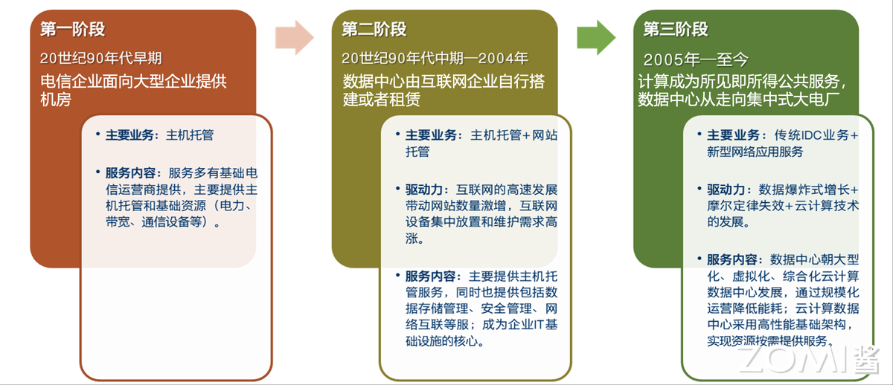

### 第三代的计算机

在第三阶段的云与大数据时代，算力发展持续突破，单台大型机演变为多服务器集群架构。单台大型机有超大内存和存储容量，全机一套操作系统，单总线互连，堆叠 CPU 来增加算力；将这些单台机作为独立计算节点互连成集群，每个节点一套操作系统，实现超高速网络大规模互联的超强算力能力和拓展能力。如下图分别为单台大型机和互连集群。

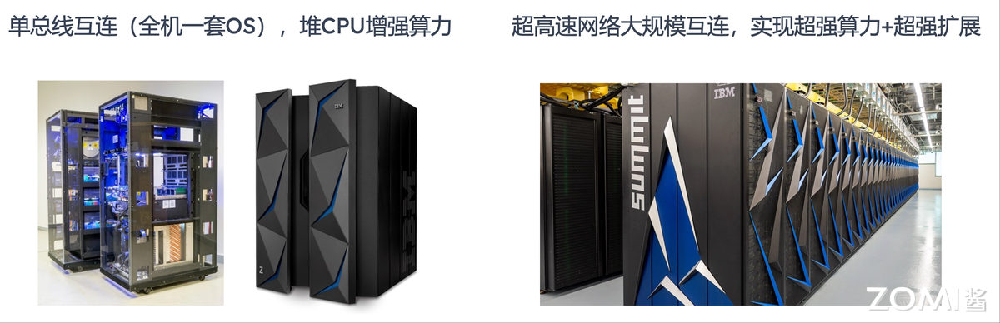

在云与大数据时代的算力服务背景下，如下图单台大型机架构展现出分层融合的技术特征：其底层基于 z/OS、GCOS、OS/400 等传统操作系统构建逻辑分区，通过事务处理器和作业控制系统支撑 COBOL、PL/I、ASM 等传统语言的运行环境，同时处理顺序/索引数据和关系型数据；中间层通过 Heriloom Computing 等工具与第三方工具实现数据迁移、应用安全、批处理和在线服务等基础设施功能；而在现代化转型层面，该架构通过 JDBC 接口兼容 PostgreSQL 等新型数据库，依托 Java 技术栈构建弹性批处理平台和弹性事务处理平台，最终通过 REST 接口与 AWS 等云平台的目录服务实现深度集成，形成支持 Windows/Linux 虚拟机的开放系统与云端协同运行的全新架构体系。

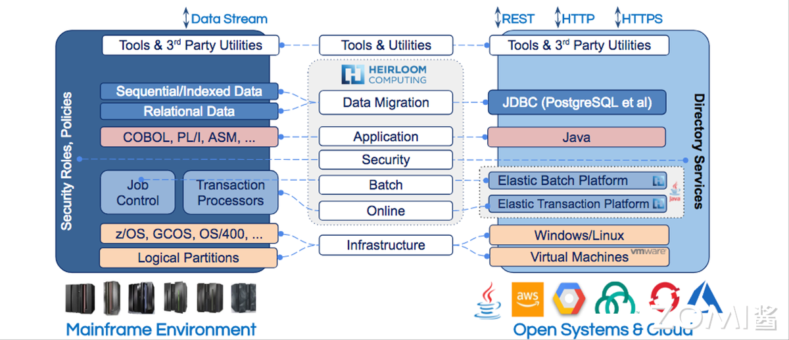

### 数据中心时代的 Iaas 基础设施即服务

90 年代随着互联网诞生和蓬勃发展，很多公司开始推行信息化。建设网站、搭建邮件、FTP、OA 办公自动化等服务器。

云服务提供商（如 AWS 、Microsoft Azure 、Google Cloud Platform 等）负责提供并维护底层的 IT 基础设施，托管运营商机房，租用运营商场地/电力/网络带宽，代为管理和维护。

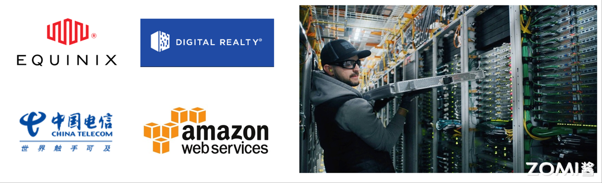

### 数据中心时代的 Paas 平台即服务

某一台服务器上，通过虚拟主机软件，虚拟出 N 个网站主机，出租给 N 个客户使用。除网站之外，还出现了数据存储空间租用等多样化的服务。

Paas 示意图如下。

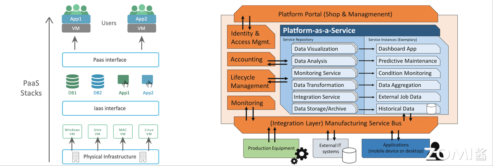

在数据中心向云服务演进的过程中，平台即服务（PaaS）作为云计算的核心服务模式逐渐成熟。PaaS（Platform as a Service，平台即服务）云计算一种服务模式，为开发者提供完整开发和部署环境，用户可以在这个平台上开发、测试、部署和管理应用程序，而无需关心底层的基础设施。其技术演进始于虚拟化技术的突破——VMWare 作为 x86 架构虚拟化领域的先驱，开创性地通过虚拟主机软件在单台服务器上虚拟出多个网站主机，使多家客户能够共享物理资源。这种模式不仅实现了网站托管服务，还催生了数据存储空间租用等多样化服务，为云计算下一阶段的诞生奠定了技术基础。2022 年 6 月，博通宣布以 610 亿美元收购 VMWare 并承担其 80 亿美元净债务，这一交易凸显了虚拟化技术的持续价值。

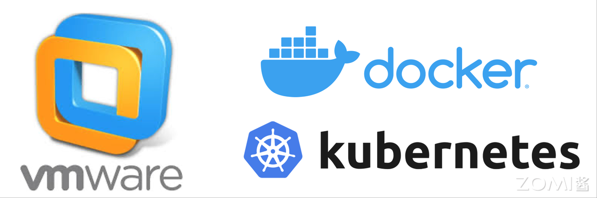

随着技术发展，PaaS 已演进为为开发者提供完整开发和部署环境的云服务模式，用户无需关心底层基础设施即可进行应用开发、测试、部署和管理。而当前 PaaS 层的技术标准已由 Docker 和 Kubernetes（K8s）共同定义——前者以容器化技术实现了跨环境一致性，后者作为容器编排平台成为管理分布式应用的业界标准，二者共同构成了现代 PaaS 平台的核心技术基石。

### 数据中心时代的 Saas 软件即服务
云计算阶段，虚拟化技术出现后，可以将同一台物理服务器虚拟成 N 个独立的虚拟机。既可以将虚拟机作为主机完整租借给客户，也可以将运行于虚拟机上的平台服务和软件服务提供给客户。

SaaS（Software as a Service，软件即服务） 是云计算的一种服务模式，它通过互联网提供完整的应用程序，用户无需安装和维护软件，只需通过浏览器或客户端访问即可使用。

这一服务架构的核心遵循亚马逊云计算确立的基础原则：所有功能接口都必须以 Web Service 的形式呈现，确保了服务的标准化、可扩展性和跨平台访问能力。

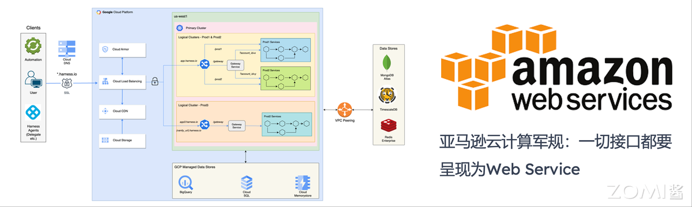

### 数据中心时代发展：Iaas，Paas，Saas

IaaS、PaaS、SaaS 是云计算发展的三个层次，分别提供基础设施、开发平台和软件服务，推动企业实现资源灵活配置、应用快速开发与高效数字化转型。

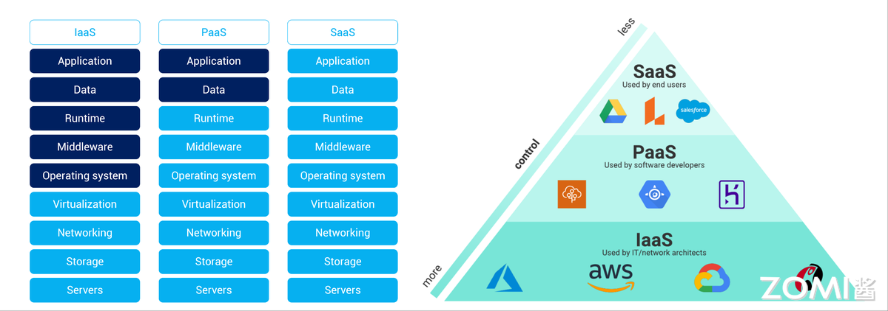

第一张图通过分层架构的形式清晰展示了云计算三种服务模式（IaaS、PaaS、SaaS）的技术栈构成与管理责任划分。从底层的基础设施到顶层的应用程序，所有服务模式共享相同的九个技术层级：服务器、存储、网络、虚拟化、操作系统、中间件、运行时环境、数据和应用。然而，关键区别在于管理责任的划分——在 IaaS 模式中，云服务商负责管理虚拟化及以下的基础设施层（包括服务器、存储和网络），用户则需管理操作系统及以上的所有层级；在 PaaS 模式中，云服务商的管理责任延伸至运行时环境，用户仅需关注应用和数据的管理；而在 SaaS 模式中，云服务商承担从基础设施到应用程序的全部九层管理责任，用户只需直接使用最终的应用服务。

第二张图则从用户视角揭示了不同服务模式的目标用户群体及其使用方式。SaaS（软件即服务） 直接面向终端用户，提供开箱即用的软件应用。用户无需关心技术实现细节，只需通过浏览器或客户端即可使用完整功能，如 AWS 中的 Amazon Workspaces 虚拟桌面服务。PaaS（平台即服务） 主要服务于软件开发人员，提供完整的开发和部署环境。开发者可以专注于应用程序代码和数据的构建，而无需管理底层基础设施，典型代表如 AWS Elastic Beanstalk 应用托管平台。IaaS（基础设施即服务） 面向 IT 架构师和网络工程师，提供虚拟化的计算资源。这些专业人员可以灵活配置和管理服务器、存储、网络等基础资源，例如通过 AWS EC2 实例构建定制化的基础设施环境。

### 数据中心发展
在大数据时代强劲驱动下，IDC 行业正迎来前所未有的发展机遇。互联网数据量以每年 50%的增速持续扩张，这意味着数据总量在不到两年的时间内即可实现翻番，其中 90%以上的全球数据都是在最近几年新产生的。然而，在 IDC 产业快速扩张的同时，行业也面临着严峻的成本与能耗挑战：数据中心的总拥有成本（TCO）包括资本支出（CAPEX）和运营支出（OPEX）正在迅速攀升，尤其以能源消耗问题最为突出。据统计，中国数据中心年总耗电量已高达约两千亿度，这既反映了 IDC 行业的发展规模，也凸显出其在绿色节能与可持续发展方面亟需优化与突破。

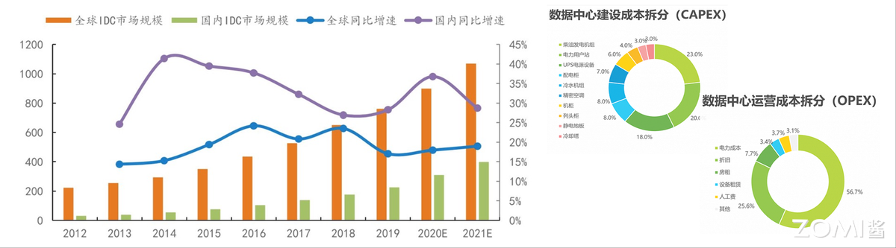

#### 谷歌

谷歌通过在全球自建 23 个超大规模数据中心，以“规模化共享经济效益”取得了巨大成功。其创新建设模式采用一体化仓储级计算机架构，结合节能联合设计理念，显著降低了总体拥有成本。更值得关注的是，谷歌在这些仓储级数据中心中开创性地引入 TPU 异构加速技术，这一关键突破不仅极大提升了计算效率，更直接推动了现代云计算与 AI 融合的新型数据中心的成熟演进。

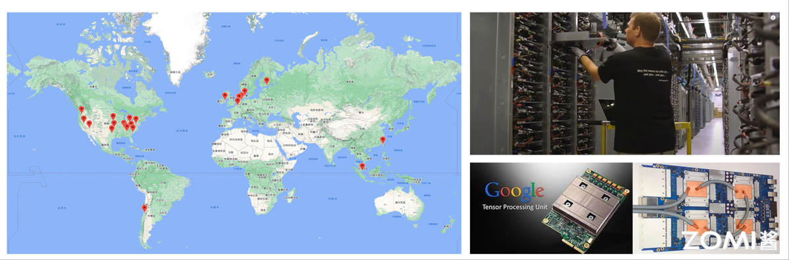

#### Facebook 

Facebook 于 2011 年发起并主导的开放计算项目（Open Compute Project，OCP），旨在通过开源开放的模式重构数据中心硬件技术体系，推动包括服务器、存储设备、网络设备和基础设施在内的下一代数据中心创新硬件发展。这一非营利组织汇聚了谷歌、微软、百度、腾讯、阿里巴巴等全球互联网巨头，以及 Intel、ARM、IBM、浪潮等产业链核心供应商，形成了跨行业协同创新的生态联盟。

目前，OCP 已在机架式和整机柜高密度服务器、新一代数据中心管理架构等领域实现数百万台规模的商业化部署，同时正积极拓展 AI 加速器、开源交换机、操作系统等新兴技术领域的标准制定与测试验证，成为当前高性能计算领域最具影响力的开放硬件技术项目，持续引领数据中心基础设施的变革与创新。

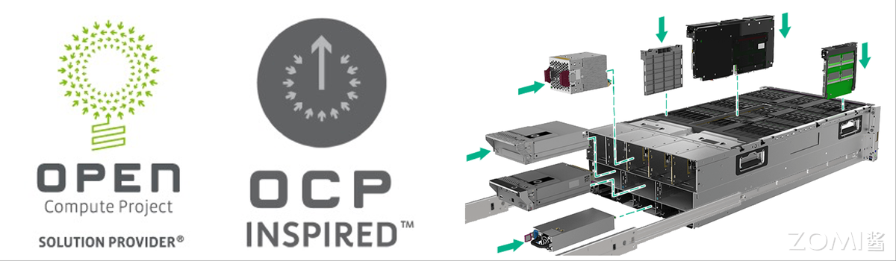

#### 阿里

阿里巴巴通过推行“去 IOE”战略，成功实现了其数据中心架构从专有、封闭的定制化体系向通用、开放的标准化体系的转变。“去 IOE” 是中国 IT 领域，特别是阿里巴巴在 2008-2013 年间提出并成功实施的一个标志性技术战略。它的核心含义是在企业的 IT 架构中，摆脱对三家美国公司（IBM、Oracle、EMC）提供的昂贵、封闭的集中式商业软硬件产品的依赖，转而采用成本更低、更开放、更易扩展的分布式开源技术和通用商用硬件。其核心举措是采用成本更低的标准化软件和硬件，例如以开源的 MySQL 数据库替代 Oracle 数据库，用普通的 PC 服务器取代 EMC 的存储设备和 IBM 的小型机。这一行动不仅打破了国外厂商在高端集中式计算系统领域的长期垄断，降低了技术依赖和成本，更构建起一个自主可控、更具弹性且成本优化的新一代数据中心技术底座，为其业务的快速扩张和云计算服务的崛起奠定了坚实基础。

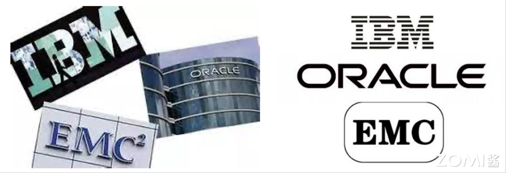

### 摩尔定律终结

在当前各厂商加速技术创新的背景下，数据中心产业正面临一个关键转折点：摩尔定律已逐渐走向终结。然而，未来计算负荷仍呈现指数级增长趋势，这意味着若无法依赖单机算力的持续提升，唯一的应对路径就是通过构建更多数据中心来满足需求。展望未来，数据中心的工作负荷将持续增加，其整体计算能力有望以每十年增长十倍的速度实现跨越式发展，如下图所示，每年的 CPU 计算能力提升迅猛。这一趋势将形成良性的技术循环：计算能力的规模化提升将直接推动软件创新的突飞猛进，而软件技术的突破又将反过来进一步释放和增强计算潜力，从而形成创新加速的飞轮效应，驱动整个数字生态向更高层次演进。

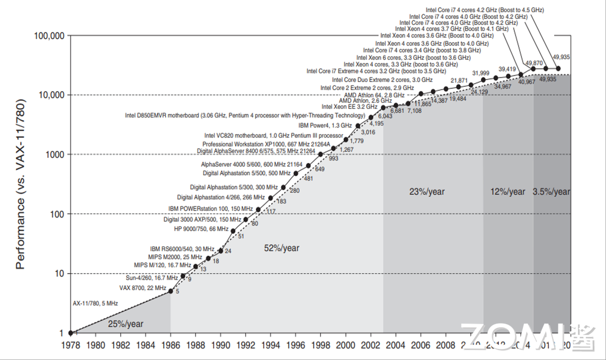

## 未来计算 2020-2030

### 5.5G、AI、元宇宙等兴起驱动多样性计算融合需求

1. 算力形态持续丰富

当前算力形态正朝着多元化方向不断拓展，不再局限于单一计算类型。从基础的整数计算，到支撑科学研究与渲染任务的 FP64 高精度计算，再到适配 AI 训练与推理场景的 FP16/FP8 低精度计算，多类型算力覆盖不同应用需求，为各行业数字化转型提供灵活支撑。

2. 多样性算力融合提速

AI 算力需求的爆发式增长，成为推动算力融合的核心动力。这一趋势促使计算系统突破传统单一架构局限，同时兼顾 “为 AI 量身打造专用系统（System for AI）” 与 “用 AI 技术优化系统本身（AI for System）”，通过双向赋能实现算力资源的高效利用。

3. 多模态超异构融合加速

元宇宙的发展催生了对通信、智能、渲染等多模态能力的复合需求，进一步加速了多样性计算的超融合进程。不同类型、不同架构的异构算力打破壁垒，在统一系统中实现深度协同，形成超异构融合算力体系，为元宇宙等复杂场景提供全方位技术支撑。

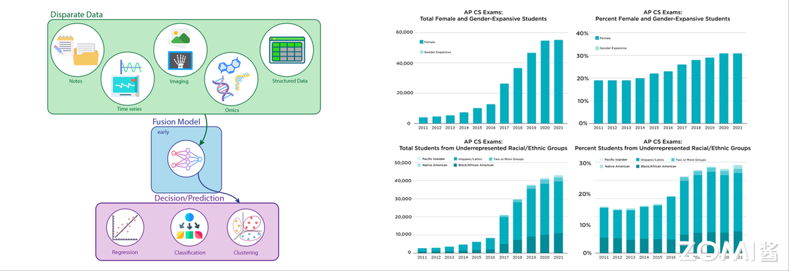

4. 各厂商面向数据中心业务拓展全栈关键技术，市场格局白热化

厂商分为x86阵营和ARM阵营。下图简单展示intel，AMD,Nvidia和Huawei四个有名的厂商的情况。

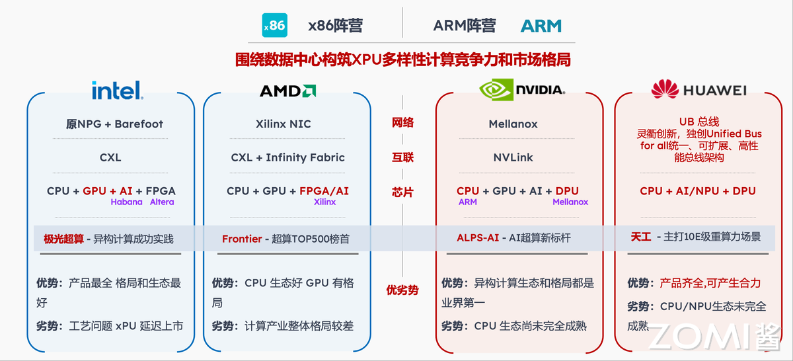

#### Intel

1. 从PC为中心转向DC为中心打造新业务格局

随着个人电脑市场渗透率已达峰值，再加上移动互联网与云计算的规模性爆发，Intel 正式开启了从 “以个人电脑为中心” 到 “以数据中心为中心” 的战略转型，彻底重塑自身的业务发展格局。这一转型的核心逻辑，是精准锚定数据增长这一时代主线，将业务重心全面向数据中心倾斜，以此捕捉数字化浪潮下的核心增长机遇。转型后的 Intel，已成功构建起覆盖软件到硬件、贯穿通讯、计算与存储全链路的完整解决方案，形成了从底层架构到终端应用的全栈技术能力。面向未来十年，Intel 进一步明确了软件、安全、互连、内存和存储、XPU 架构、制程和封装六大核心支柱，将以这六大方向为基石持续推进架构创新，成为驱动全球计算领域技术突破与产业升级的关键力量。

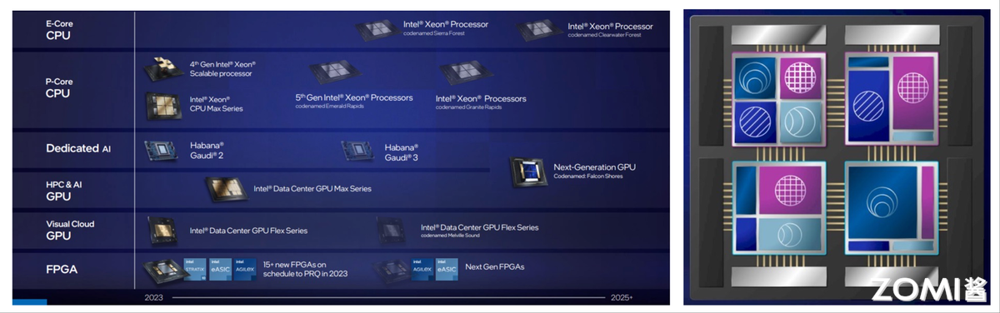

2. 面向计算、存储、网络全栈布局

从 PC 时代的群雄逐鹿到数据中心时代的诸侯争霸，Intel 在两轮关键时代浪潮中均凭借核心技术优势脱颖而出，奠定了行业领先地位。然而，在移动互联网爆发的黄金时期，其 Atom 移动处理器在与 ARM 架构的市场角逐中未能占据上风，错失了移动终端领域的重要机遇。步入算力时代后，Intel 的增长势头持续放缓，与此同时，ARM、RISC-V 等新兴架构势力迅速崛起，凭借灵活适配多元场景的优势，对 Intel 的市场主导地位构成了日益严峻的挑战。在此背景下，Intel 选择聚焦计算、存储、网络三大核心领域展开全栈布局，希望通过整合全链路技术能力、强化跨场景协同效能，在全新的算力竞争格局中重拾往日辉煌，续写行业引领者的篇章。

下图为Intel 2023年到2025年产品情况。

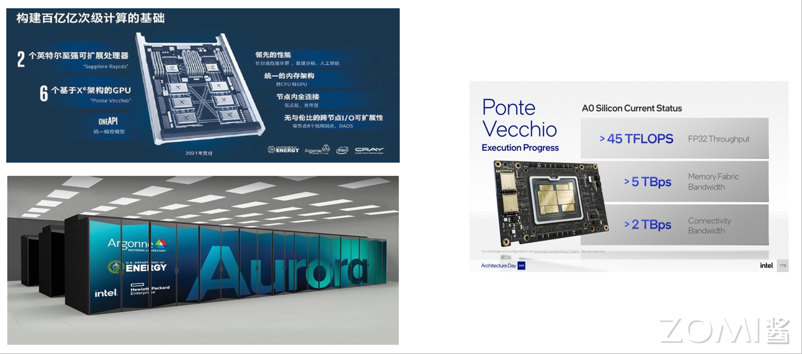

3. 异构计算极光超算算力突破2E FLOPS

Intel 倾力打造的异构计算极光超算，凭借创新的 “CPU + GPU + oneAPI” 异构计算架构，实现了算力性能的跨越式提升，其峰值算力将成功突破 2E FLOPS。这一架构通过 CPU 提供基础计算支撑、GPU 强化并行处理能力，再借助 oneAPI 实现不同硬件资源的高效协同与统一调度，打破了传统计算架构的性能瓶颈。强大的峰值算力不仅能满足海量数据处理、复杂科学计算等高端场景需求，更彰显了 Intel 在异构计算领域的技术沉淀与创新实力，为超算领域的算力突破提供了全新可能。

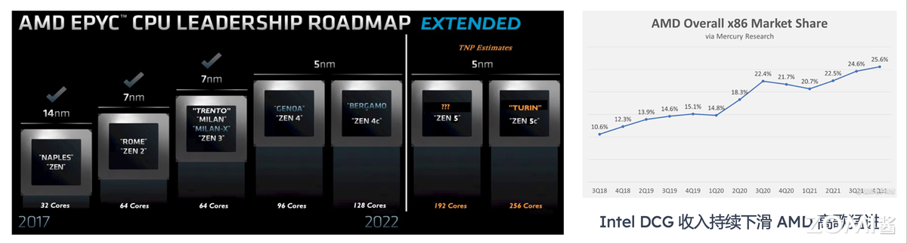

#### AMD

1. AMD霄龙服务器
AMD 霄龙服务器凭借显著的制程优势，正持续改写服务器市场格局，对 Intel 的垄断地位构成实质性威胁。其服务器产品线演进路线落地顺畅，依托 Fabless 模式带来的制程技术优势与稳定的交付进度，AMD 始终保持着对 Intel 的领先态势。市场表现同样印证了这一趋势，x86 服务器总体市场中，AMD 的份额实现了跨越式增长 —— 从 2018 年的仅 10% 稳步攀升至 25.6%，近年更是呈现加速上涨的强劲势头。随着市场捷报频传，AMD 霄龙服务器在性能、成本等维度的竞争力持续释放，正逐步瓦解 Intel 在数据中心市场的长期统治地位，推动行业竞争进入新的均衡阶段。

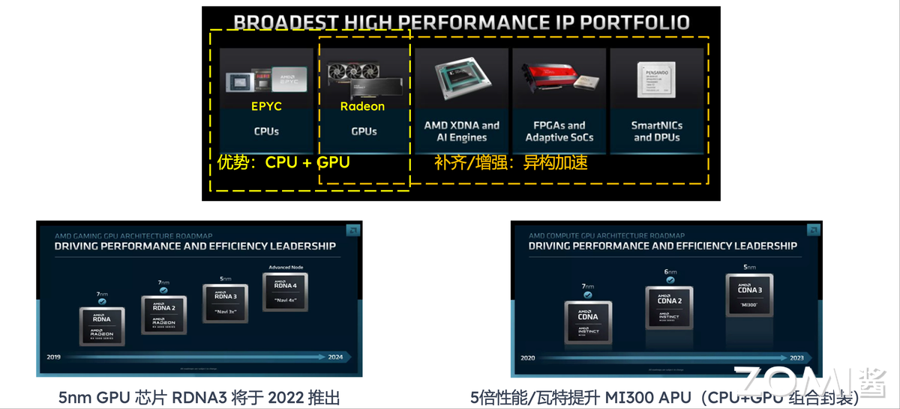

3. AMD基于霄龙CPU和镭龙GPU异构加速

AMD 正依托霄龙 CPU 与镭龙 GPU 积累的核心技术优势，全面加码异构加速领域，进一步强化在高性能计算市场的竞争力。在硬件升级层面，AMD 不仅规划于 2022 年推出采用 5nm 制程的 RDNA3 架构 GPU 芯片，实现 5 倍性能 / 瓦特的能效飞跃，更打造了 MI300 APU 这一创新产品 —— 通过将 CPU 与 GPU 进行组合封装，形成集成化的异构计算核心。这些产品布局既延续了霄龙与镭龙的性能基因，又通过异构融合突破单一硬件的能力局限，为数据中心、科学计算等高端场景提供更高效的算力支撑，也让 AMD 在与行业竞品的竞争中占据更有利的位置。

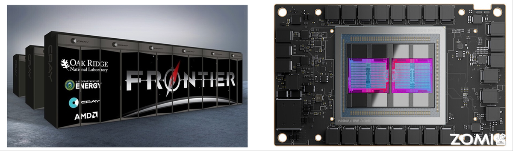

3. 融合计算架构助Frontier实现E级算力

AMD 携手美国能源部、橡树岭国家实验室及 Cray Inc. 公司深度协作，成功打造出新一代超级计算机 Frontier，凭借强悍性能在 2022 年上半年超级计算机 TOP500 排行榜中登顶榜首。这款顶尖超算的峰值处理能力达到 1.685EFLOPS，核心硬件配置极具竞争力 —— 整套系统搭载 9408 个 CPU+GPU 融合计算节点，每个节点均配备一颗 64 核 AMD “Trento” CPU，同时搭配四颗 AMD Radeon Instinct MI250X GPU，通过异构硬件的高效协同，释放出超凡算力，可满足尖端科学计算、复杂模拟仿真等高端场景的严苛需求，也彰显了 AMD 在超算领域的技术整合与创新实力。

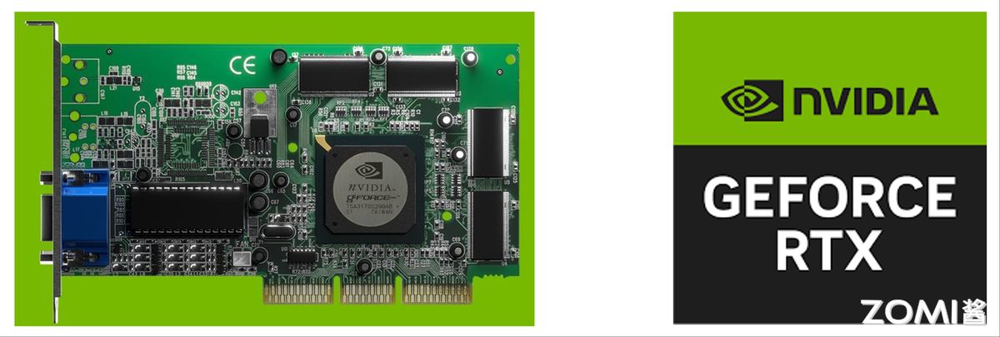

#### Nvidia
1. 数据中心战略成为最重要发力方向

NVIDIA 成立于 1993 年，以游戏独立显卡起家，1999 年推出世界第一款替代 CPU 渲染 图形处理单元（GPU） GeForce 256，站稳行业龙头地位。尽管 NVIDIA DC业务 2019 年起步，但增速极快，4 年复合增长率高达 69%，远超游戏业务 18% 复合增长。

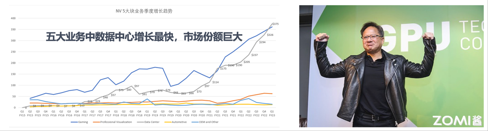

2. 游戏入手GPU计算，异构并行计算加速AI生态

Nvidia 以游戏 GPU 为起点切入计算领域，凭借异构并行计算能力加速 AI 生态构建。要打造成熟的 GPU 计算生态，核心离不开丰富的软件应用支持，更需要推动开发者从 CPU 生态向 GPU 生态迁移。但仅 1~2 倍的性能加速，对 CPU 生态开发者难以形成足够吸引力，说服现有 CPU 计算软件迁移至 GPU 平台也并非易事。为此，Nvidia 采取了两大关键策略：一是推出 INCEPTION 生态合作伙伴项目，广泛吸纳 AI 创业公司参与其中；二是设立风险投资股权基金，小额投资各类 AI 企业，其核心目标并非追求财务回报，而是通过精准扶持持续培育和壮大 GPU 生态。

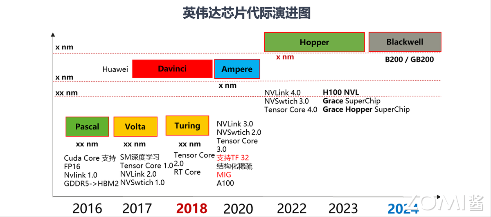

3. Nvidia在人工智能服务器和集群形态的发展

从2016年至今，Nvidia通过持续的芯片架构创新推动着AI服务器和集群形态的演进。从Pascal架构开始，Nvidia逐步引入关键技术创新推出Nvlink 1.0，Cuda Core支持FP16，显存类型从GDDR5升级替换为HBM2；2017年Volta架构首次搭载Tensor Core和流式处理器（SM），显著提升深度学习性能， 推出NVLink 2.0和NVSwitch 1.0；同年华为推出Davinci架构。2018年Turing架构加入RT Core，拓展了图形渲染能力，同时Tensor Core升级2.0。2020年的Ampere架构和2022年的Hopper架构通过NVLink 4.0、NVSwitch 3.0和Tensor Core 4.0等互连与计算技术，为大规模AI集群奠定基础。到2024年，Blackwell架构的B200/GB200与Grace SuperChip、Grace Hopper SuperChip相结合，标志着AI服务器正式进入超级芯片时代，支持更复杂、更大规模的AI训练与推理任务。这一演进路径清晰地展示了Nvidia从单卡性能提升到系统级集群解决方案的战略布局。

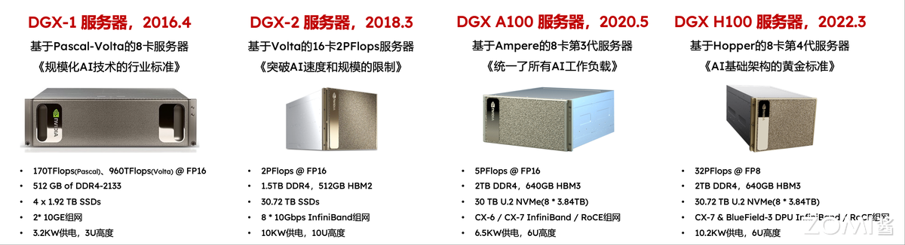

NVIDIA 的 DGX 系列服务器及其集群解决方案，清晰地展现了其在 AI 基础设施领域从单机性能标杆到超大规模集群的演进路径。自 2016 年推出首款 8 卡 Pascal 架构的 DGX-1 奠定行业标准以来，其后的 DGX-2 通过翻倍 GPU 数量突破了单机规模限制。2020 年的 DGX A100 基于 Ampere 架构，实现了对各类 AI 工作负载的统一。而基于 Hopper 架构的 DGX H100 则被确立为AI 基础架构的黄金标准。在性能上，这一演进体现为单机算力从 DGX-1 的 170 TFLOPS(@FP16)飙升至 DGX H100 的 32 PFLOPS(@FP8)，并伴随着内存、存储和高速网络（从万兆以太网到 InfiniBand）的全面升级。最终，这些高性能服务器通过 NVLink 等技术互连，构成 DGX SuperPOD 集群，实现了从 A100 到 H100，再到下一代 GB200 的规模扩展。Eos这样的超级集群，它整合了3.2万个 GPU，提供以 80EFLOPS（FP16）计量的庞大算力，专为满足最前沿 AI 训练的独特需求而打造。

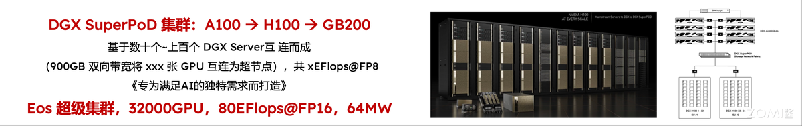

4. ALPS-AI 超算新标杆，20E 级 AI 算力集群

ALPS作为 20E 级 AI 算力集群的新标杆，由瑞士国家计算机中心（CSCS）打造，采用 ARM 架构的 Grace CPU 与 NVIDIA 新一代 Hopper GPU 组合而成，算力性能与硬件配置均处于行业领先水平。这一标杆案例背后，是 NVIDIA 技术在超级计算领域的快速普及：2024 年全球超级计算机 500 强榜单中，近 2/3 的高性能计算机（HPC）配备了 NVIDIA GPU 或 Mellanox 系统，而三年前采用英伟达技术的超级计算机占比还不足榜单的一半，其技术生态在超算领域的影响力已实现显著跃升。

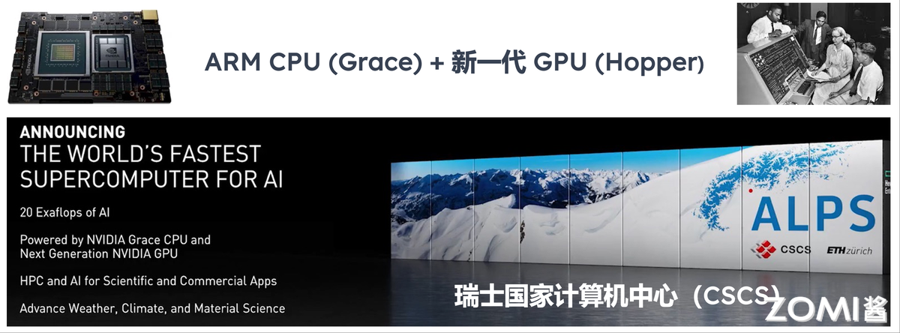

### 计算产业发展的四个阶段
1. 奠基时代（1945~1970）以电子管 / 晶体管为核心器件，呈现单体算力集中、体积与耗电量大的特征。
2. 通用架构时代（1971~1995）伴随大规模集成电路爆发，实现巨型机算力突破与小 / 微机快速普及。
3. 互联网云计算时代（1995~2020）催生 “数据中心” 形态，应用需求推动算力服务多元化发展。
4. 未来计算时代（2020~2030）朝着集约、泛在、融合方向演进，带动 K 型算力需求爆发式增长。
   
计算需求的持续升级，推动产业发展从专用计算逐步迈向通用计算，并向着集约、泛在的未来计算演进。Intel、AMD、NVIDIA 纷纷转型发力数据中心业务，通过加速构建全栈计算技术布局，让市场竞争日趋白热化。

## 本节视频

<html>
<iframe src="https://player.bilibili.com/player.html?isOutside=true&aid=114889167215790&bvid=BV14kgizdEmc&cid=31179934300&p=1&as_wide=1&high_quality=1&danmaku=0&t=30&autoplay=0" width="100%" height="500" scrolling="no" border="0" frameborder="no" framespacing="0" allowfullscreen="true"> </iframe>
</html>

## 参考与引用
[Intel产品](https://www.intel.com/content/www/us/en/products/overview.html)

[Intel收入结构报道](https://finance.sina.com.cn/roll/2024-12-03/doc-incyezvp1414633.shtml)

[极光超算](https://zh.wikipedia.org/zh-cn/%E6%9E%81%E5%85%89_%E8%B6%85%E7%BA%A7%E8%AE%A1%E7%AE%97%E6%9C%BA)

[AMD霄龙服务器](https://www.amd.com/zh-cn/products/processors/server/epyc.html)

[AMD霄龙CPU和镭龙GPU](https://www.amd.com/zh-cn/products/processors/server/epyc/ai/9005-host-cpu-gpu.html)

[Frontier](https://zh.wikipedia.org/zh-hans/%E5%89%8D%E6%B2%BF%E8%B6%85%E7%B4%9A%E9%9B%BB%E8%85%A6)

[Nvidia收入结构报道](https://cn.investing.com/analysis/article-200483837)

[Nvidia芯片架构演进](https://zhuanlan.zhihu.com/p/682360619)

[Nvidia DGX服务器演进](https://en.wikipedia.org/wiki/Nvidia_DGX)

[ALPS超级计算机](https://en.wikipedia.org/wiki/Alps_(supercomputer))

