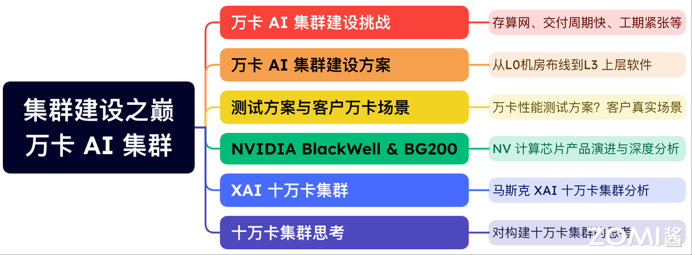

<!--Copyright © ZOMI 适用于[License](https://github.com/Infrasys-AI/AIInfra)版权许可-->

# 03.万卡 AI 集群

深入探讨超大规模 AI 计算集群的建设，核心围绕“万卡 AI 集群”，从面临的存算网络协同、快速交付与紧张工期等挑战出发，详细解读从 L0 级机房布线到 L3 级上层软件的全栈建设方案，并涵盖万卡性能测试方法与真实客户场景应用。视频还将深度分析 NVIDIA Blackwell 架 构与 BG200 芯片的技术演进，研究马斯克 XAI 十万卡集群的案例实践，最终延伸至对构建十万卡级别超大规模集群的前瞻性思考。

## 详细内容

| 大纲 | 小节 | 链接|
|:-- |:-- |:-- |
| NV 产品分析 | 01 AI 万卡集群建设挑战  | [PPT](./01Challenge.pdf), [视频](https://www.bilibili.com/video/BV1QTbxzyETx/), [文章](./01Challenge.md) |
| NV 产品分析 | 02 AI 万卡集群建设交付  | [PPT](./02Solution.pdf), [视频](https://www.bilibili.com/video/BV1JMYbzjE1b/), [文章](./02Solution.md) |
| NV 产品分析 | 03 AI 万卡集群测试步骤(上)  | [PPT](./03TestCase.pdf), [视频](https://www.bilibili.com/video/BV1jneqzPEsn/), [文章](./03TestCase.md) |
| NV 产品分析 | 03 AI 万卡集群性能测试(中)  | [PPT](./03TestCase.pdf), [视频](https://www.bilibili.com/video/BV116eqzJE8a/), [文章](./03TestCase.md) |
| NV 产品分析 | 03 AI 万卡集群实践总结(下)  | [PPT](./03TestCase.pdf), [视频](https://www.bilibili.com/video/BV1Uveqz9EGw/), [文章](./03TestCase.md) |
| NV 产品分析 | 04 NV Blackwell 详细分析  | [PPT](./04Evolution.pdf), [视频](https://www.bilibili.com/video/BV1iT6TYXE25), [文章](./04Evolution.md) |
| NV 产品分析 | 05 NV Blackwell 深度解读  | [PPT](./05Details.pdf), [视频](https://www.bilibili.com/video/BV1EczyYbEfE), [文章](./05Details.md) |
| NV 产品分析 | 06 NV GB200 网络演进  | [PPT](./06Network.pdf), [视频](https://www.bilibili.com/video/BV1Vgi2YJEk7), [文章](./06Network.md) |
| NV 产品分析 | 07 NV GB200 集群互联方案  | [PPT](./07Cluster.pdf), [视频](https://www.bilibili.com/video/BV1uaiXYbE5h), [文章](./07Cluster.md) |
| 十万卡集群 | 08 XAI 十万卡集群解读  | [PPT](./08XAI.pdf), [视频](https://www.bilibili.com/video/BV1Mui6YdE6s), [文章](./08XAI.md) |
| 十万卡集群 | 09 十万卡 AI 集群思考  | [PPT](./09CloudMatrix.pptx), [视频](https://www.bilibili.com/video/BV16MqsYNExP), [文章](./10Thought.md) |

## 内容大纲

## 备注

文字课程内容正在一节节补充更新，每晚会抽空继续更新正在 [AI Infra](https://infrasys-ai.github.io/aiinfra-docs) ，希望您多多鼓励和参与进来！！！

文字课程开源在 [AI Infra](https://infrasys-ai.github.io/aiinfra-docs)，系列视频托管[B 站](https://space.bilibili.com/517221395)和[油管](https://www.youtube.com/@ZOMI666/playlists)，PPT 开源在[github](https://github.com/Infrasys-AI/AIInfra)，欢迎引用！

