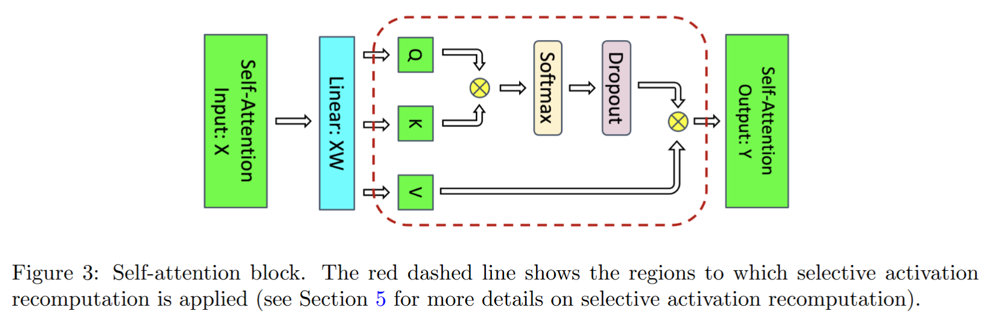
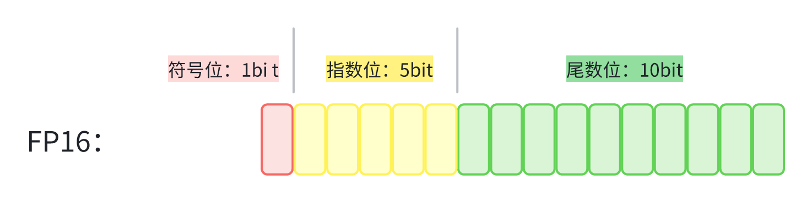

<!--Copyright © ZOMI 适用于[License](https://github.com/Infrasys-AI/AIInfra)版权许可-->

# 05.大模型训练内存与参数计算

> Author by: 刘凯旋

!!!!!!!!!
1）看 PR 修改，注意格式
2）没意义的信息，或者太通用的信息删掉了

## 大模型参数量的计算

准确计算模型的参数量是理解其复杂性和显存占用的基础。以下以一个 $L$ 层的标准 Transformer 模型为例，逐模块分解其参数。

!!!!!!!!!
把下面每一层的计算单独分开一个三级标题，单独用公式呈现，不要大模型的了列表方式

!!!!!!!!!
除了通用的 GPT 模型结构以外，把当前经典的几个模型 LLAMA4、DeepSeek3、Qwen3、Grok4 的模型结构和参数量计算拿出来看，去深入到模型结构的真正计算。

### Embedding 层参数

**Token Embedding**：矩阵 $W_t \in \mathbb{R}^{vocab\_size \times hidden\_size}$，参数量为：

$$P_{TE} = vocab\_size \times hidden\_size$$

**Position Embedding**：若为可学习矩阵 $W_p \in \mathbb{R}^{max\_seq\_len \times hidden\_size}$，参数量为： $P_{PE} = max\_seq\_len \times hidden\_size$ （若使用正弦编码，则此项参数量为 0）

- **Transformer Block（每层）** 每个 Block 主要由一个带残差连接的注意力模块和一个带残差连接的前馈网络（FFN）模块组成，每个模块前都配有 LayerNorm。
    - **LayerNorm**：对特征进行标准化：$y = \frac{x - \mathbb{E}[x]}{\sqrt{\mathbb{V}ar[x] + \epsilon}} \cdot \gamma + \beta$。包含两个可训练向量：增益 $\gamma$ 和偏置 $\beta$，形状均为 $[hidden\_size]$。每层有两个 LayerNorm（Attn 和 FFN 前各一个），因此参数量为： $P_{LN} = 2 \times 2 \times hidden\_size = 4 \cdot hidden\_size$ （通常因其占比较小，在估算总量时可忽略不计）
    - **注意力模块 (Attention Module)**：
	    - 一个最简单的 Single-Head Attention 模块前向计算过程如下： 
			    
			* 输入： $X \in \mathbb R^{batch\_ size \times seq\_len \times hidden\_size}$ 
			* Linear Proj： $W_{Q,K,V} \in \mathbb R^{hidden\_size \times 3 hidden\_size}$ $[Q,K,V] = XW_{Q,K,V} \in \mathbb R^{batch\_size \times seq\_len \times 3hidden\_size}$
			* 计算注意力分数并归一化（概率空间）： $\text{alignment} = \frac{QK^T}{\sqrt {hidden\_size}} \in \mathbb R^{batch\_size \times seq\_len \times seq\_len}$ $\text{attn\_score} =\text{ softmax}(\text{alignment})$ 
			* 输出： $\text{Output} = \text{drop\_out}(\text{attn\_score})V,\quad \in \mathbb R^{batch\_size \times seq\_len \times hidden\_size}$
			* 输出投影: $W_o\in \mathbb R^{hidden\_size \times hidden\_size}$ 
        - **Q, K, V 投影矩阵**：通常通过一个大的线性层实现，其权重矩阵 $W_{QKV} \in \mathbb{R}^{hidden\_size \times (3 \cdot hidden\_size)}$，参数量为 $3 \cdot hidden\_size^2$。
        - **输出投影矩阵**：将注意力输出投影回 $hidden\_size$ 维，$W_O \in \mathbb{R}^{hidden\_size \times hidden\_size}$，参数量为 $hidden\_size^2$。
        - **Dropout**：在注意力分数计算后和最终输出后通常会应用 Dropout 层。Dropout 是一种正则化技术，它在训练阶段以概率 $p$ 随机将神经元的输出置零，但在前向传播时并不引入任何可训练参数，因此不贡献参数量。它仅影响计算过程，而不增加模型大小。 
        综上，注意力模块参数量为： $P_{Attn} = 4 \cdot hidden\_size^2$
    - **前馈网络模块 (FFN Module)**：通常由一个升维层（激活函数，如 GELU）、一个降维层和一个 Dropout 组成。
	    - 计算流程如下：
		    - 输入：$X \in \mathbb R^{batch\_ size \times seq\_len \times hidden\_size}$
		    - 第一层：$W_1 \in \mathbb R^{hidden\_size \times h'}$
		    - 第二层： $W_2 \in \mathbb R^{h' \times hidden\_size}$,通常 $h'$ 取 $4hidden\_size$ 
		    - 输出：$GELU(XW_1)W_2$ 其中 GeLU 不贡献参数
        - **Dropout**：同样，FFN 中的 Dropout **不引入可训练参数**。 因此，FFN 参数量为： 
	$$\begin{align}
		P_{FFN} \nonumber\\
		& = (hidden\_size \times 4h + 4h) + (4h \times hidden\_size + hidden\_size) \nonumber \\
		&= 8 \cdot hidden\_size^2 + 5 \cdot hidden\_size \nonumber \\
		& \approx 8 \cdot hidden\_size^2 \nonumber \nonumber
		\end{align}$$
    - **每层总参数量**： $P_{layer} = P_{Attn} + P_{FFN} \approx 12 \cdot hidden\_size^2$
- **输出层**
    - 通常与 Token Embedding 共享权重，即使用 $W_t^T$ 进行投影，**不引入额外参数**。若不共享，则需要一个独立的线性层，参数量为 $vocab\_size \times hidden\_size$。
**模型总参数量 $\phi$ 估算公式：**

$$
\begin{align} 
\phi &\approx P_{TE} + P_{PE} + L \times P_{layer} \nonumber \\
 &= (vocab\_size \times hidden\_size) + (max\_seq\_len \times hidden\_size) \nonumber\\
 & + L \times (12 \cdot hidden\_size^2) \nonumber\end{align}
 $$

## 浮点数精度与字节占用

!!!!!!!!
现在都用 FP8/FP6 混合精度训练了，了解最新的技术，然后补充详细内容

计算机中的浮点数遵循 IEEE 754 标准，由符号位 $S$、指数位 $E$ 和尾数位 $M$ 组成，下图是 FP16 的 IEEE 754 表示。

一个浮点数的数学表示为：

$$
(-1)^{\text{符号位}} \times (1.\text{尾数}) \times 2^{(\text{指数} - \text{偏置})}
$$

其中，记指数位的 bit 数为 $k$, 偏置值：$2^{k-1}-1$。

**指数位**决定了数值的**动态范围**（能表示的最大最小值），**尾数位**决定了数值的**精度**（有效数字位数）。更多的指数位意味着能表示更大或更小的数值，更多的尾数位意味着更高的精度。
现代深度学习中常用的数值精度格式如下：

| 精度格式     | 位宽      | 字节数       | 符号位   | 指数位    | 尾数位     | 应用场景        |
| :------- | :------ | :-------- | :---- | :----- | :------ | :---------- |
| **FP32** | 32 bits | 4 bytes   | 1 bit | 8 bits | 23 bits | 传统训练，高精度推理  |
| **FP16** | 16 bits | 2 bytes   | 1 bit | 5 bits | 10 bits | 混合精度训练，快速推理 |
| **BF16** | 16 bits | 2 bytes   | 1 bit | 8 bits | 7 bits  | 现代混合精度训练    |
| **INT8** | 8 bits  | 1 byte    | 1 bit | -      | 7 bits  | 量化推理，边缘设备   |
| **INT4** | 4 bits  | 0.5 bytes | 1 bit | -      | 3 bits  | 极端量化推理      |

**混合精度训练 (Mixed Precision Training)** 是当前的主流实践。它在前向传播和反向传播过程中使用 FP16/BF16 进行计算和存储，以提升速度并节省显存，同时维护一个 FP32 格式的**主参数副本 (Master Weight)** 用于优化器更新，以此保证训练的数值稳定性。

## 训练显存分析

!!!!!!!
大模型要做性能优化，优化哪部分？深度学习了解

模型训练中，GPU 显存的消耗远不止模型参数本身。对于一个拥有 ϕ 个参数的模型，一次完整的训练迭代（Step）所产生的显存占用可以系统地分为以下几个核心部分。理解这些组成有助于进行有效的显存优化和模型部署。

### 静态显存占用分析

!!!!!!!!!
不要用大模型的列表方式，改成自己理解的形式

1. 模型参数内存 (Model Parameters)
	模型的 $\phi$ 个参数需要在 GPU 显存中存储。在混合精度训练中：
	- **FP16 格式**：每个参数占用 2 字节
	- **参数内存**：$2\phi$ 字节
2. 梯度显存 (Gradients)
	反向传播过程中，需要为每个参数计算并存储一个梯度值 $g_t = \frac{\partial \mathcal{L}}{\partial \theta}$：
	- 每个参数对应 1 个梯度值：共 $\phi$ 个梯度值
	- 梯度精度：通常使用 FP32
	- 梯度内存：$2\phi$ 字节
3. 优化器状态显存 (Optimizer States)
	Adam 优化器为每个参数维护两个指数移动平均量：
	- **一阶动量 $m_t^{(i)}$**：存储该参数梯度的指数移动平均
	    - 初始化：$m_0^{(i)} = 0$
	    - 更新公式：$m_t^{(i)} = \beta_1 m_{t-1}^{(i)} + (1-\beta_1) g_t^{(i)}$
	    - 数据类型：FP32（4 字节）
	    - 作用：提供动量，帮助优化器在梯度方向上保持惯性
	- **二阶动量 $v_t^{(i)}$**：存储该参数梯度平方的指数移动平均
	    - 初始化：$v_0^{(i)} = 0$
	    - 更新公式：$v_t^{(i)} = \beta_2 v_{t-1}^{(i)} + (1-\beta_2) (g_t^{(i)})^2$
	    - 数据类型：FP32（4 字节）
	    - 作用：自适应调整学习率，对频繁更新的参数使用较小学习率
	- 优化器内存：$8\phi$ 字节

综上，近考虑上述三个因素，显存占用。

$$
\begin{align}
Mem\_{static} \nonumber\\
& = Mem\_param + Mem\_grad + Mem\_optim \nonumber \\
& = 2\phi + 4\phi + 8\phi \nonumber \\
& = 14\phi \nonumber
 \end{align}
 $$

### 动态显存占用分析

1. 激活值（Activation）

	激活值是指在前向传播过程中产生、并在反向传播梯度计算中必须保留的中间张量，不包括模型参数和优化器状态。

	以标准 Transformer 层为例，对其需要保存的激活值进行分析如下：

   * 残差连接的结果不属于必须存储的激活值，因其梯度计算仅依赖于该分支内的中间结果。例如，对于 $y = x + f_\theta(x)$，在计算 $\partial y / \partial \theta$ 时，仅需 $f_\theta(x)$ 内部的前向缓存。

   *  Dropout 所使用的掩码矩阵（Mask Matrix）属于激活值，需在前向时保存。通常掩码矩阵以 Byte 类型存储（1 字节），而中间激活值若为 FP16/BF16 则占用 2 字节。

	下图中紫色图标标识出了需要存储的激活张量（不考虑 Embedding 层，并忽略 LayerNorm 的均值与方差所占的约 $2bs$ 字节）：
			
	总激活值显存占用估算如下： 

$$\begin{align}
		MemActive_{Attn} = 2(bsh + 3bsh + 2bss + bsh) + bs^2 + bsh = 11bsh + 5bs^2\ \text{Byte} \nonumber \\
		MemActive_{FFN} = 2(bsh + 4bsh + 4bsh + bsh + bsh) + bsh = 23 bsh \  \text{Byte} \nonumber\\
		MemActive = MemActive_{Attn} + MemActive_{FFN} = 34bsh + 5bs^2 \  \text{Byte} \nonumber
	\end{align}$$
			
		
2. 其他显存开销
	包括各种临时内存分配：
   - 通信缓冲区：分布式训练中的 all-reduce 操作
   - 内存碎片：GPU 内存分配产生的碎片
   - CUDA 上下文：CUDA 运行时的开销
根据经验，这类额外显存占用可大致估算为模型参数内存的 $1.X$ 倍，即 $2.X\phi$ 字节

## 总结与思考

!!!!!!!
一段话总结

## 参考与引用

!!!!!!!
希望你不是大模型生成的，而是自己去看论文，看知乎，看别人的解读，然后总结成自己的理解；补充参考
