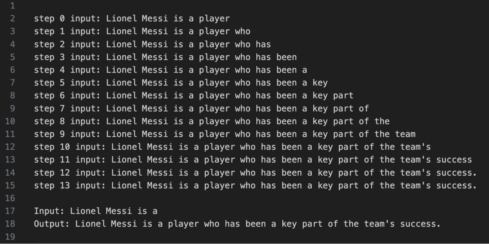
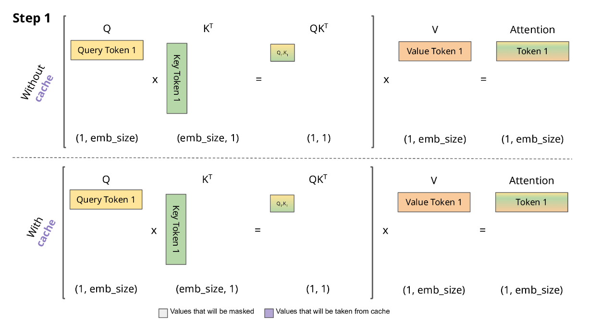
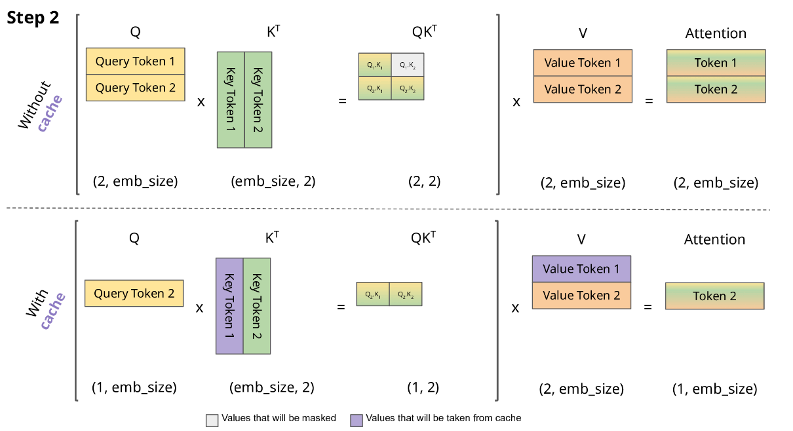
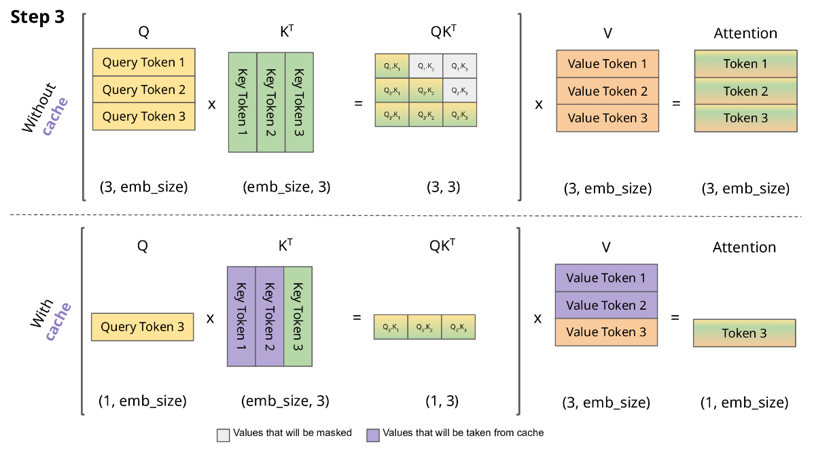

<!--Copyright © ZOMI 适用于[License](https://github.com/Infrasys-AI/AIInfra)版权许可-->

# 06.大模型推理内存与参数计算

> Author by: 周浩杰

在大模型落地应用中，推理阶段的内存占用与参数计算是决定硬件适配性、运行效率的核心问题，直接影响模型响应速度与资源利用率。本文将围绕这一关键主题展开系统讲解。

## 1. 大模型推理内存计算

在大模型运行推理任务的过程中，总显存的占用情况直接影响着模型的运行效率、响应速度以及硬件资源的适配性。不同的优化策略，会导致总显存需求产生巨大差异。

### 1.1 内存占用情况

!!!!!!!!!给我的感觉是这里可以继续深入，模型的参数到底怎么分类，到底分别占比是多少，LLM 和多模态的。

大模型推理的显存开销大头是**模型参数**。其余的开销会包括输入输出的结果、计算的中间结果、内存碎片等：

- **模型参数**（包括权重、偏置等）在推理启动时需要全部加载到内存中，且在整个推理过程中持续占用内存，其占用量与模型参数精度密切相关，因为精度越高，占用的比特位越多。  
- **计算中间结果**是动态生成的，在推理过程中，模型需要对输入数据进行多轮神经网络层的计算（如注意力层、激活函数层等），每一层计算都会生成大量中间结果（如注意力权重矩阵），当依赖该中间结果的计算完成后则释放这些中间结果的内存占用。  
- **输入输出数据**的占比相对来说很小。

### 1.2 计算例子

我们以 **1B 参数的模型** 举例，假设推理使用的数据类型是 **float16**，那么 1 个参数就占用 **2 Byte**，模型总大小为： $10^9 \times 2 / 2^{30} \approx 1.86\ \text{GB}$ 为了便于估算可以近似为 **2 GB**。

!!!!!!!可以增加当前热门的模型参数，从 7B 到当下 MOE 的 1T，模型参数量是怎么计算的。另外多模态的模型参数量是怎么计算的？多模态例如 Qwen2-VL，是否一样？前面的 embedding 会不会占用更多。

以下代码展示了 GPT-2 模型参数的显存占用。

```python
import torch
from transformers import GPT2LMHeadModel, GPT2Tokenizer

model_name = "gpt2"
device = "cuda" if torch.cuda.is_available() else "cpu"
max_new_tokens = 13

tokenizer = GPT2Tokenizer.from_pretrained(model_name)
model = GPT2LMHeadModel.from_pretrained(model_name).to(device).eval()

total_params = sum(p.numel() for p in model.parameters())
print(f"总参数量 : {total_params:,}")
print(f"数据类型 : {next(model.parameters()).dtype}")
print(f"参数大小 : {total_params * 4 / 1024**2:.2f} MB\n")

in_text = "Lionel Messi is a"
input_ids = tokenizer.encode(in_text, return_tensors="pt").to(device)

torch.cuda.empty_cache()
torch.cuda.reset_peak_memory_stats()

with torch.no_grad():
    outputs = model.generate(
        input_ids,
        max_new_tokens=max_new_tokens,
        pad_token_id=tokenizer.eos_token_id
    )

memory_used = torch.cuda.max_memory_allocated() / 1024**2  # MB
text = tokenizer.decode(outputs[0], skip_special_tokens=True)

print(f"模型参数占推理显存比例: {total_params * 4 / (memory_used * 1024**2) * 100:.2f} %")
print(f"生成文本: {text}")
print(f"显存占用峰值: {memory_used:.2f} MB")
```

输出示例：

```Text
总参数量 : 124,439,808
数据类型 : torch.float32
参数大小 : 474.70 MB

模型参数占推理显存比例: 90.71 %
生成文本: Lionel Messi is a player who has been a key part of the team's success.
显存占用峰值: 523.30 MB
```

## 2. 大模型推理过程

### 2.1 推理过程

目前大模型主流的推理方式是**自回归生成（autoregressive generation）** 来产生输出。其核心思想如下图所示：基于已经生成的所有 token 来产生下一个 token。新生成的 token 和前一次的输入 tokens（记为前缀序列）组成新的输入 tokens，通过多个 decoder 层生成下一个 token，不断重复这个过程，直到产生终止符。


### 2.2 推理实例

以下代码展示大模型自回归生成的过程。核心过程代码将当前的 token 序列 `in_tokens` 输入到 GPT-2 模型中，模型返回每个位置对应的 logits 输出，然后选择出现概率最高的那个 token 作为下一个输出 token。新生成的 token 被拼接到原始序列的末尾，形成新的输入序列。

```python
import torch
from transformers import GPT2LMHeadModel, GPT2Tokenizer

model_name = "gpt2" 

# 下载并加载预训练的模型和分词器
print("正在下载模型...")
model = GPT2LMHeadModel.from_pretrained(model_name, torchscript=True).eval()
tokenizer = GPT2Tokenizer.from_pretrained(model_name)
print("模型下载完成！")

# 输入文本
in_text = "Lionel Messi is a"
in_tokens = torch.tensor(tokenizer.encode(in_text))

# 推理
token_eos = torch.tensor([198])  # 行结束符号
out_token = None
i = 0

# 核心过程代码
with torch.no_grad():
    while out_token != token_eos:
        logits, _ = model(in_tokens)
        out_token = torch.argmax(logits[-1, :], dim=0, keepdim=True)
        in_tokens = torch.cat((in_tokens, out_token), 0)
        text = tokenizer.decode(in_tokens)
        print(f'step {i} input: {text}', flush=True)
        i += 1

out_text = tokenizer.decode(in_tokens)
print(f'Input: {in_text}')
print(f'Output: {out_text}')
```

输出示例：

!!!!!!!!输出用 text 来表示，不要用截图

 

## 3. KV Cache 显存占用

**KV Cache** 是自回归生成模型加速推理的常用技术。在 Transformer 模型进行自回归生成任务时，每次生成一个新 token，都需要基于当前输入序列重新计算整个注意力机制的 **Key 矩阵** 和 **Value 矩阵**（关于什么是 Key 和 Value 请了解本书 6.1.1 Transformer 架构）。

但实际上，推理阶段 **Wk 和 Wv 矩阵不变**，因而前缀序列（2.1 节中提到）得到的 **Key 和 Value 也是不变的**，重新计算 Key 和 Value 会导致大量不必要的推理时间，尤其在长序列生成时，计算开销会显著增加。为了解决这个问题，**KV Cache** 技术应运而生。

### 3.1 KV Cache 原理

带 KV Cache 的推理流程分 **prefilling 阶段** 和 **decoding 阶段**：

- **prefilling**：当输入第一个 prompt 时，模型会对 prompt 中的每个 token 进行处理，计算出对应的 Key 和 Value，并将这些 Key 和 Value 存储到 KV Cache 中。同时，模型会根据这些 Key 和 Value 以及 Query 生成第一个输出 token。  
- **decoding**：在生成后续输出 token 时，模型首先会对前一个输出 token 进行处理，计算出对应的 Query。然后，模型会从 KV Cache 中读取之前存储的所有 Key 和 Value，与当前的 Query 进行注意力计算，得到注意力权重。最后，模型根据注意力权重对 Value 进行加权求和等操作生成新的输出 token。同时，新生成 token 对应的 Key 和 Value 会被追加到 KV Cache 中，为下一次生成 token 做好准备。

以下图片展示了有 KV Cache 的推理过程，注意这里简化掉了 scale 和 softmax 操作。我们的目标是为了生成下一个 token，记为 $Token_i$。我们已经有的条件是以往生成的所有 $Token_0$ … $Token_{i-1}$。

在没有 KV Cache 时，我们为了计算得到 $Token_i$，需要算出 $K_i$ 和 $V_i$（形状都是 `i × embed_size`），以及 $Q_i$（形状是 `1 × embed_size`）。但是 $K_{i-1}$ 和 $V_{i-1}$（形状是 `i-1 × embed_size`）在生成 $Token_{i-1}$ 时已经计算过。如果我们将这些计算结果存储起来，无需重新通过 $W_kX$、 $W_vX$ 计算，这就是 **KV Cache**。







### 3.2 显存占用分析

我们考虑自回归模型结构的显存占用，也就是 **decoder-only 架构**（比如 GPT-2）。它的参数有：

- **batch_size**：并行处理多少个序列，记为 $b$
- **max_sequence_length**：最大输出多少个 token，记为 $s$
- **layer_numbers**：有多少个 layer，layer 指 masked multihead attention、ffn 和残差连接的复合结构，记为 $l$
- **d_model**：输出的维度，有时也用 hidden size 表示，记为 $d$
- **head numbers**：multihead 中 head 的个数，记为 $h$
- 单个 head 中 KV 维度：也就是 3.1 图中的 $emb\_size$
- 每个参数占用的字节大小为 $u$ 字节

在 3.1 节中，我们知道，输出一个 token，每个 self-attention 需要存储新增的 **K 向量** 和 **V 向量** 参数各 $embed_size$ 个，需要存储的参数量为 $2 × embed_size$，然后有 $h$ 个 head 的结果拼接在一起，所以参数量要再乘 $h$。此外，有 $l$ 个 layer，每个 layer 中都有一个 multihead attention 模块，所以参数量要再乘 $l$。最多要输出 $s$ 个 token，这种情况需要参数量乘上 $s$。如果是批处理的情况，再乘上 $b$。每个参数占 $u$ 字节，所以最终 **KV Cache 的显存占用** 为：

$
2 \times b \times s \times l \times h \times embed\_size \times u
$$

因为一般情况 $d\_model = h × embed\_size$，所以显存占用可以表示为：

$$2bsldu \text{字节}$$

详细内容请参考 5.2.1 KV Cache 原理一节也可以了解相关内容。

## 4. 总结与思考

这章我们了解了大模型推理显存占用以及快速估计的方法，知道大模型推理过程中 token 是反复迭代生成的，明白了 **KV Cache** 的意义、原理以及显存占用计算方法。

## 5. 参考与引用

- [The Illustrated GPT-2 (Visualizing Transformer Language Models)](https://jalammar.github.io/illustrated-gpt2/)
- [A Survey on Efficient Inference for Large Language Models](https://arxiv.org/pdf/2404.14294)
- [大模型推理性能优化之 KV Cache 解读](https://zhuanlan.zhihu.com/p/630832593)
- [Transformers KV Caching Explained](https://medium.com/@joaolages/kv-caching-explained-276520203249)
- [GPT-2 Detailed Model Architecture](https://medium.com/@hsinhungw/gpt-2-detailed-model-architecture-6b1aad33d16b)

## 6. 本节视频

<html>
<iframe src="//player.bilibili.com/player.html?isOutside=true&aid=279258479&bvid=BV1Rc411S7jj&cid=1357101901&p=1&as_wide=1&high_quality=1&danmaku=0&t=30&autoplay=0" width="100%" height="500" scrolling="no" border="0" frameborder="no" framespacing="0" allowfullscreen="true"> </iframe>
</html>
