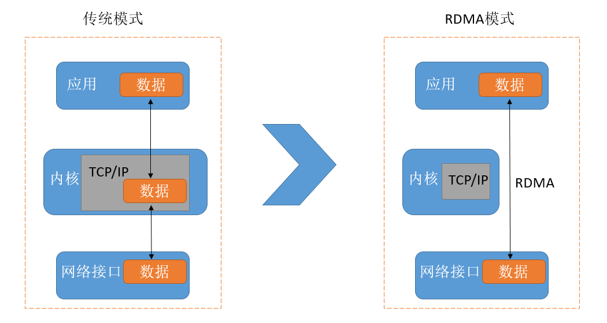
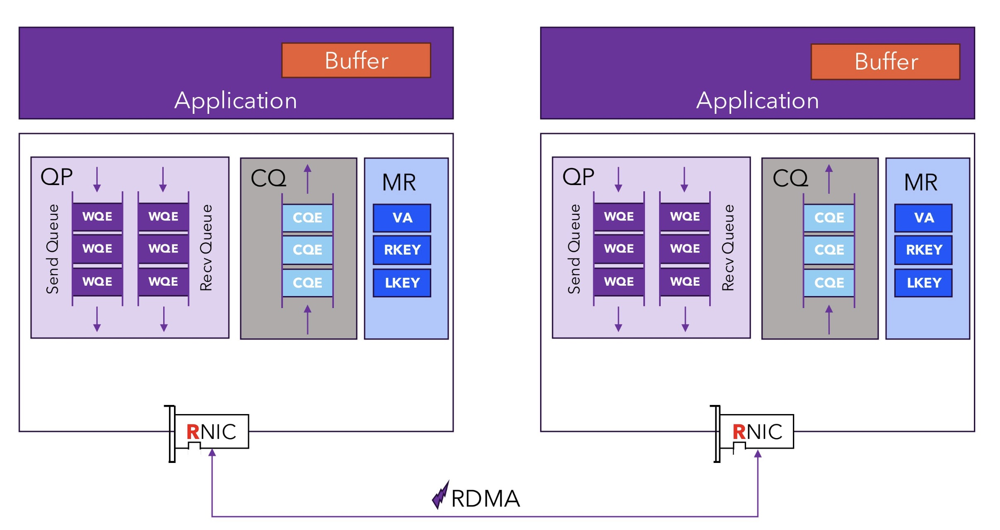
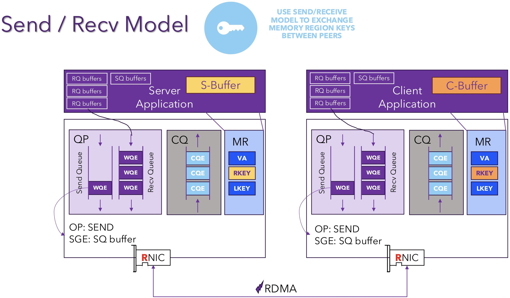
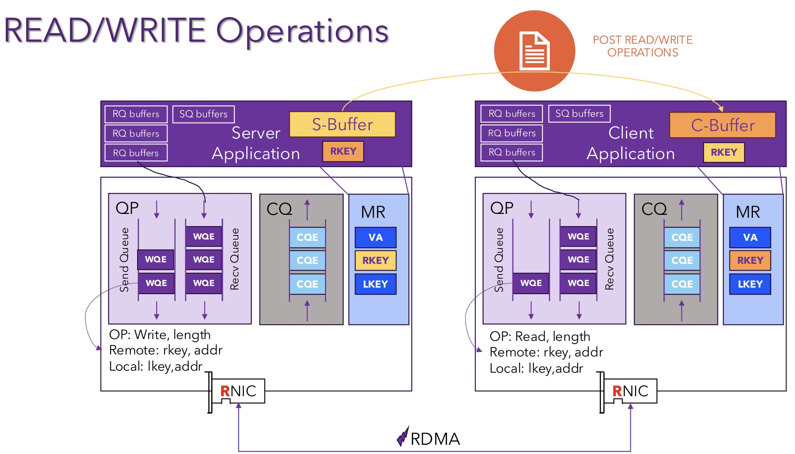
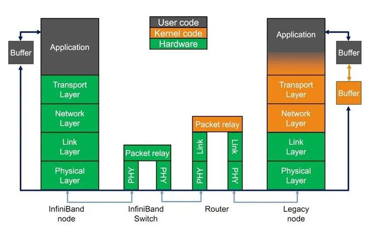
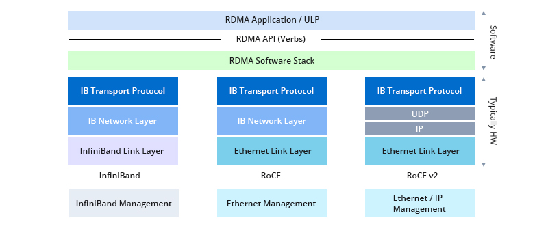

<!--Copyright © ZOMI 适用于[License](https://github.com/Infrasys-AI/AIInfra)版权许可-->

# 02.高速互联 RDMA(DONE)

> Author by: 张万豪

随着大模型训练与分布式计算规模激增，数据中心通信瓶颈日益凸显，传统 TCP/IP 协议因内核干预多、数据拷贝频繁，难以满足低延迟、高吞吐的互联需求，而 RDMA 技术成为破局关键。

作为起源于高性能计算领域的技术，RDMA 凭借 “内核旁路” 与 “零拷贝” 核心机制，让设备直接访问远端内存，将通信延迟降至微秒级、大幅释放 CPU 资源，现已成为支撑大规模 AI 训练的网络基石。本文将系统梳理 RDMA 的基本概述、架构原理与工作流程，解析 InfiniBand、RoCE、iWARP 三大协议差异，并介绍国内外主流 RDMA 硬件厂商及产品，助力读者全面理解这一 AI 基础设施核心技术。

## 1. RDMA 基本概述

RDMA（Remote Direct Memory Access，远程直接内存访问）并不是一个非常新的技术，其最早起源于 20 世纪 90 年代末的高性能计算领域，旨在通过绕过操作系统内核减少网络通信开销。随着人工智能模型特别是大型语言模型的规模和数据量迅速增长，现代计算系统正面临严重的通信瓶颈问题。传统的 TCP/IP 协议难以满足高强度通信需求，RDMA 能够将 CPU 从繁重的数据搬运工作中解放出来，专注于核心计算任务，现已成为支撑大规模 AI 训练的关键网络基础。

### 1.1 什么是 RDMA

RDMA 是一种面向高性能计算和数据中心场景的网络通信技术。顾名思义，**它允许一台计算机直接访问另一台计算机的内存，而无需像传统通信那样依赖操作系统内核来转发和管理数据**。换句话说，RDMA 打通了一条“用户空间直达用户空间”的数据通道，**避免了内核协议栈的繁琐处理和多次拷贝操作**。

正因为具备这样的特性，RDMA 在通信性能上远远超越了传统的 TCP/IP 模式。它能够在延迟、吞吐量和 CPU 占用率等关键指标上带来数量级的提升，因此被广泛应用于高性能计算集群、分布式存储系统以及云计算平台。对于大规模数据传输和高并发通信场景而言，RDMA 已成为不可或缺的核心技术。

### 1.2 RDMA 架构原理

RDMA 的高性能源于其底层架构上的根本性变革，尤其体现在**“内核旁路”（Kernel Bypass）与“零拷贝”（Zero-Copy）**这两大关键机制上。借助这两个机制，RDMA 构建出了一条几乎绕开操作系统干预、从用户空间直达网络硬件的数据通路，极大地降低了通信延迟并释放了 CPU 资源。

与传统的 TCP/IP 通信方式相比，RDMA 的数据发送路径有着本质的不同。在传统网络模型中，应用程序通过套接字 API 发起数据传输请求，操作系统会在用户空间与内核空间之间进行上下文切换，并将数据从应用缓冲区复制到内核缓冲区。随后，内核协议栈处理数据，添加 TCP/IP 头部信息，再通过网卡驱动将数据送往网络接口卡。这个过程中，数据至少会被拷贝两次，系统调用频繁触发 CPU 中断和上下文切换，整个链路严重依赖 CPU 的持续参与。

相比之下，RDMA 则显得简洁高效得多。应用程序不再通过系统调用进行通信，而是**直接调用位于用户态的 RDMA 库（通常是 Verbs API）与支持 RDMA 的网络适配器（RNIC）交互**。在数据传输发起之前，应用需将一块内存区域注册给 RNIC，使其可被网络硬件访问，并锁定在物理内存中。传输过程中，应用仅需将包含内存地址、长度等元信息的请求发送至 RNIC，数据本身并不经过 CPU。RNIC 随后通过 DMA 从用户指定的内存地址中直接读取数据并封装为 RDMA 协议数据包发出，接收端的 RNIC 同样绕开操作系统，**直接将数据写入接收方注册好的内存缓冲区**。整个通信路径从未离开用户空间，亦未涉及任何中间的数据拷贝或内核干预。

这种内核旁路机制意味着网络通信中的数据面操作完全跳过了操作系统，**大大减少了上下文切换和系统调用开销**，网络延迟从毫秒级大幅下降到微秒级。与此同时，零拷贝机制彻底消除了内核缓冲区与应用缓冲区之间的数据搬运需求，**释放了大量 CPU 和内存带宽资源**。在多个关键性能维度上，RDMA 的技术栈都对传统 TCP/IP 协议形成了压倒性的优势。它不仅大幅缩短了数据路径，降低了延迟，更在数据拷贝次数、CPU 使用率和操作系统依赖程度等方面实现了量级的性能提升。

RDMA 的高效运行依赖于精密的**软硬件协同机制**。

- **硬件层面**，RDMA 网络适配器（RNIC）本身是一种集成了强大计算能力的协处理器，能够独立完成数据传输的封装与解析、地址转换、可靠性控制等复杂任务，从而减轻主机 CPU 的负担。
- **软件层面**，RDMA 提供了一套基于 Verbs 的编程接口，支持开发者直接控制通信过程。

RDMA 架构的革新不仅体现在性能提升上，还带来了信任模型的改变。在传统网络模型中，操作系统内核是网络通信的中心控制者和安全裁判者。然而在 RDMA 架构中，数据传输路径完全绕开内核，**信任关系从内核转移至用户程序与硬件之间**，并**通过内存注册和密钥机制来控制权限**。尽管这一设计极大提高了通信效率，但也引入了新的安全风险。比如在不加密的场景中，若攻击者截获或猜测到传输过程中的 rkey，就有可能未经授权地直接访问目标主机的内存。因此，在多租户云平台等敏感场景下，RDMA 的部署必须配合专用物理网络或虚拟私有云等手段，确保网络层的强隔离，以防止潜在的恶意访问。

RDMA 技术的原理及其与 TCP/IP 架构的对比如下表所示。

| **特性**     | **传统 TCP/IP 协议栈**                | **RDMA 协议栈**                        |
| ------------ | ------------------------------------- | -------------------------------------- |
| 数据路径     | 用户空间 → 内核空间 → NIC             | 用户空间 → NIC                         |
| CPU 参与度   | 高（协议栈管理、数据拷贝）            | 极低（仅发起请求，数据处理由硬件完成） |
| 数据拷贝次数 | 多次（应用缓冲区 → 内核缓冲区 → NIC） | 零拷贝（数据从应用内存直接传输）       |
| 内核参与程度 | 深度参与每一个数据包的处理流程        | 数据平面操作完全绕过内核               |
| 通信延迟     | 毫秒级                                | 微秒级                                 |
| 常用编程接口 | Sockets API                           | Verbs API                              |

### 1.3 RDMA 工作流程

上文简单介绍了 RDMA 的架构设计，本部分则详细介绍 RDMA 的工作流程，RDMA 提供了基于消息队列的点对点通信，每个应用都可以直接获取自己的消息，无需操作系统和协议栈的介入。在介绍工作流程之前，我们需要先了解 RDMA 的一些核心概念，因缩写常用，所以在每个组件介绍时这里会给出其缩写：

- **RNIC (RDMA-enabled Network Interface Card，RNIC)**：RNIC 是**支持 RDMA 功能的智能网卡**。它不仅是物理网络接口，更是一个强大的协处理器，能够独立处理 RDMA 协议、管理内存访问，并执行数据传输任务，从而将主机 CPU 解放出来。
- **QP (Queue Pair, 队列对)**：QP 是 RDMA 通信的基本单元，是应用与 RNIC 交互的逻辑端点。应用通过向 QP 中提交工作请求（Work Request，WR）来发起数据传输，每个 QP 由两个队列组成：
  - 发送队列 (Send Queue, SQ)：存放待发送的数据操作指令。
  - 接收队列 (Receive Queue, RQ)：存放用于接收数据的缓冲区描述符。
- **CQ (Completion Queue, 完成队列)**：用于接收已完成工作通知的队列。当 RNIC 完成一项工作请求（例如，数据发送完毕或接收完成）后，它会向关联的 CQ 中放置一个完成队列项（Work Completion, WC），告知应用程序操作的结果。应用通过轮询 CQ 来获知任务的完成状态。
- **MR (Memory Region, 内存区域)**：为了让 RNIC 能够直接访问主机内存，**应用程序必须先将一块内存区域“注册”给 RNIC**。注册过程会将虚拟内存地址映射到物理地址，并锁定该内存页，防止其被交换到磁盘。注册成功后，RNIC 会返回两个密钥：
  - **LKey (Local Key)**：用于本地 RNIC 访问该内存区域。
  - **RKey (Remote Key)**：发送给对端，授权对端 RNIC 访问该内存区域。
- **PD (Protection Domain, 保护域)**：一个安全隔离机制，用于将一组 RDMA 资源（如 QP、CQ、MR）聚合在一起。只有属于同一个 PD 的资源才能相互关联和操作，从而防止不同应用或进程间的非法内存访问。

了解完上面的一些 RDMA 的基本概念，下面我们来介绍 RDMA 的工作流程，RDMA 的通信模型可以根据对端 CPU 是否参与数据传输过程，分为**单边操作**和**双边操作**两大类。而无论是哪种操作，**一个典型的 RDMA 通信流程都包含以下步骤**：

1. **资源准备**：应用程序首先分配所需资源，包括保护域（PD）、完成队列（CQ）、队列对（QP），并根据需要注册内存区域（MR）。
2. **连接建立**：通信双方通过带外方式（如 TCP/IP 套接字）交换各自的 QP 信息和已注册内存的 RKey 等元数据，完成连接的建立和状态同步。
3. **数据传输**：应用向 QP 的发送队列或接收队列提交工作请求（WR）。RNIC 硬件会从队列中取出请求并执行，例如从指定的内存地址读取数据并发送，或将收到的数据写入指定的内存地址。
4. **完成通知**：操作完成后，RNIC 将一个完成项（WC）放入 CQ。应用程序通过**轮询 CQ** 来检查操作是否成功完成，并进行后续处理。
5. **资源释放**：通信结束后，应用程序销毁 QP、CQ 等资源，并注销内存区域。

#### RDMA 双边操作：Send/Receive

**双边操作**类似于传统的消息传递模型，需要通信双方的 CPU 协同工作。比如 RDMA 中的`SEND/RECEIVE`是最经典的双边操作，

- **发送方**：调用 `SEND` 操作，将数据从其本地内存缓冲区发送出去。
- **接收方**：必须提前调用 RECEIVE 操作，准备好一块用于接收数据的内存缓冲区。

当发送方的数据到达时，接收方的 RNIC 会将其存入预先准备好的缓冲区中。这种模式下**，接收方必须预知数据何时会到达并提前做好准备**，双方需要紧密同步。它本质上是一种“推送”模型，适用于流式数据传输和消息同步场景。

#### RDMA 单边操作：Read/Write

单边操作允许一端计算机在**无需远端 CPU 任何干预**的情况下，直接对远端内存进行读写。远端的 RNIC 会自动处理这些请求，整个过程对远端应用完全透明。

- **RDMA READ**：这种操作是“拉取”模型，发起方可以按需从远端服务器获取数据，非常适合需要随机访问大块数据的场景。
  - **发起方**：提交一个 `READ` 请求，请求中包含其本地内存地址（用于存放读取的数据）以及目标远程内存的地址和 RKey。
  - **远端**：远端的 RNIC 收到请求后，会直接从其主机内存中读取指定数据，并通过网络返回给发起方。

- **RDMA WRITE**：这种操作是“推送”模型，但与 SEND 不同的是，它**不需要接收方预先准备接收缓冲区，可以直接覆盖目标内存**。
  - **发起方**：提交一个 `WRITE` 请求，请求中包含其本地要发送的数据的地址，以及目标远程内存的地址和 RKey。
  - 远端：远端的 RNIC 收到数据后，会直接将其写入指定的内存地址，无需通知其主机 CPU。

**Atomic Operations (原子操作)**：

- 单边操作还支持 Fetch-and-Add 和 Compare-and-Swap 等原子操作，允许在远端内存上执行不可分割的读改写操作，这对于实现分布式锁、计数器等同步原语至关重要。

### 1.4 RDMA 优劣势

RDMA 随着大模型时代的到来大放异彩，已经成为了数据中心网络支撑大模型训练推理的基础技术，前面我们介绍了 RDMA 的技术原理，现在我们总结一下其主要的优劣势有哪些。

优势：

- **低延迟、高吞吐**：提供微秒级延迟和超高带宽，是解决 LLM 训练中海量参数同步（如 All-Reduce）瓶颈的唯一有效手段，直接决定了训练速度。
- **CPU 占用率低**：繁重的网络协议处理和数据拷贝工作全部由 RNIC 硬件完成，将 CPU 从通信任务中解放出来，使其可以专注于核心的计算任务，显著提升了系统的整体计算效率。

劣势

- **编程复杂度高**：相较于简洁的 Socket API，RDMA 的 Verbs API 非常底层和复杂，开发者需要手动管理队列对、内存注册、完成通知等状态，开发门槛较高。
- **网络环境要求高**：RDMA（尤其是 RoCE）依赖于一个**无损网络**。它对丢包极其敏感，任何丢包都会导致性能急剧下降。这要求数据中心内部的交换机必须支持并开启特殊流控（如 PFC），以确保网络在拥塞时也不丢包。这种可控的、精细化管理的环境只有在数据中心才能实现。
- **成本高**：需要专用的 RDMA 网卡（RNIC）和高端的（InfiniBand 或支持 RoCE 的）数据中心交换机，成本远高于普通以太网设备，并且对网络运维的技术要求极高

## 2. RDMA 协议实现

RDMA 本身指的是一种技术，具体协议层面，包含三种：InfiniBand、iWARP、RoCE（RoCE v1 和 RoCE v2），这三种协议都符合 RDMA 标准，使用相同的上层接口，简要介绍如下：

- **IB（InfiniBand）**：基于 InfiniBand 架构的 RDMA 技术，由 IBTA（InfiniBand Trade Association）提出。搭建基于 IB 技术的 RDMA 网络需要专用的 IB 网卡和 IB 交换机。
- **iWARP（Internet Wide Area RDMA Protocal）**：基于 TCP/IP 协议的 RDMA 技术，由 IETF 标 准定义。iWARP 支持在标准以太网基础设施上使用 RDMA 技术，但服务器需要使用支持 iWARP 的网卡。
- **RoCE（RDMA over Converged Ethernet）**：基于以太网的 RDMA 技术，也是由 IBTA 提出。RoCE 支持在标准以太网基础设施上使用 RDMA 技术，但是需要交换机支持无损以太网传输，需要服务器使用 RoCE 网卡。

三者的主要对比如下：

| 特性           | InfiniBand (IB)                         | RoCE (RDMA over Converged Ethernet)         | iWARP (Internet Wide Area RDMA Protocol)    |
| :------------- | :-------------------------------------- | :------------------------------------------ | :------------------------------------------ |
| **底层协议**   | 原生 RDMA 架构                            | 以太网 / UDP/IP (RoCEv2)                    | TCP/IP                                      |
| **性能表现**   | **最高** (延迟最低，最稳定)             | **很高** (性能接近 IB，延迟略高)             | **较高** (受 TCP/IP 协议栈影响，延迟相对最高) |
| **网络要求**   | **专用网络** (IB 网卡、IB 交换机、IB 线缆) | **无损以太网** (需要交换机支持 PFC 等 DCB 功能) | **标准以太网** (可在普通有损网络运行)       |
| **部署复杂度** | **高** (需要构建和管理一套独立网络)     | **中等** (需要精心配置交换机以保证无损)     | **低** (即插即用，无需特殊网络配置)         |
| **路由能力**   | 不支持 IP 路由 (需要网关)                 | RoCEv2 支持 IP 路由                           | 支持 IP 路由                                  |

### 2.1 InfiniBand 技术

InfiniBand 是一种基于 InfiniBand 架构的 RDMA 技术，它提供了一种基于通道的点对点消息队列转发模型，每个应用都可通过创建的虚拟通道直接获取本应用的数据消息，无需其他操作系统及协议栈的介入。InfiniBand 架构的应用层采用了 RDMA 技术，可以提供远程节点间 RDMA 读写访问，完全卸载 CPU 工作负载；网络传输采用了高带宽的传输；链路层设置特定的重传机制保证服务质量，不需要数据缓冲。

### 2.2 iWARP 技术

iWARP 是基于以太网和 TCP/IP 协议的 RDMA 技术，可以运行在标准的以太网基础设施上。iWARP 并没有指定物理层信息，所以能够工作在任何使用 TCP/IP 协议的网络上层。iWARP 允许很多传输类型来共享相同的物理连接，如网络、I/O、文件系统、块存储和处理器之间的消息通讯。iWARP 协议栈，iWARP 由 MPA、DDP、RDMAP 三层子协议组成：

- RDMAP 层协议负责 RDMA 读、写操作和 RDMA 消息的转换，并将 RDMA 消息转发到 DDP 层。
- DDP 层协议负责将过长的 RDMA 消息分片分装成 DDP 数据包继续转发到 MPA 层。
- MPA 层在 DDP 数据段的固定标识位置增加转发后向标识、数据报文的长度以及 CRC 校验数据等字段构成 MPA 数据段交由 TCP 传输。

iWARP 技术特点，iWARP 从以下几个方面降低了主机侧网络负载：

- TCP/IP 处理流程从 CPU 卸载到 RDMA 网卡处理，降低了 CPU 负载。
- 消除内存拷贝：应用程序可以直接将数据传输到对端应用程序内存中，显著降低 CPU 负载。
- 减少应用程序上、下文切换：应用程序可以绕过操作系统，直接在用户空间对 RDMA 网卡下发命令，降低了开销，显著降低了应用程序上、下文切换造成的延迟。

由于 TCP 协议能够提供流量控制和拥塞管理，因此 iWARP 不需要以太网支持无损传输，仅通过普通以太网交换机和 iWARP 网卡即可实现，因此能够在广域网上应用，具有较好的扩展性。

### 2.3 RoCE 技术

RoCE 技术支持在以太网上承载 IB 协议，实现 RDMA over Ethernet。RoCE 与 InfiniBand 技术有相同的软件应用层及传输控制层，仅网络层及以太网链路层存在差异。

RoCE 协议分为两个版本：

- RoCE v1 协议：基于以太网承载 RDMA，只能部署于二层网络，它的报文结构是在原有的 IB 架构的报文上增加二层以太网的报文头，通过 Ethertype 0x8915 标识 RoCE 报文。
- RoCE v2 协议：基于 UDP/IP 协议承载 RDMA，可部署于三层网络，它的报文结构是在原有的 IB 架构的报文上增加 UDP 头、IP 头和二层以太网报文头，通过 UDP 目的端口号 4791 标 识 RoCE 报文。RoCE v2 支持基于源端口号 hash，采用 ECMP 实现负载分担，提高了网络的利用率。

RoCE 使得基于以太网的数据传输能够：提高数据传输吞吐量、 减少网络延时、降低 CPU 负载。RoCE 技术可通过**普通以太网交换机**实现，但**服务器需要支持 RoCE 网卡**，网络侧需要支持无损以太网络，这是由于 IB 的丢包处理机制中，任意一个报文的丢失都会造成大量的重传，严重影响数据传输性能。

## 3. RDMA 硬件厂商

RDMA 的硬件主要包括：**以太网适配器、智能网卡（SmartNICs）、数据处理器（DPU）以及交换机芯片**。这里主要介绍一些国外和国内的主流厂商，需要注意的是，不同的厂商对 RDMA 协议的支持也有所侧重。国外的主要玩家有：**英伟达、英特尔、博通、美满电子、AMD**；国内的 RDMA 硬件厂商主要有：**华为、浪潮、中兴、锐捷网络**，此外国内的腾讯、阿里、字节等大厂也在**自研 RDMA**。下面分别介绍各家的 RDMA 产品。

### 3.1 国外主要厂商

**英伟达**

英伟达的 RDMA 硬件主要分为**网络适配器、数据处理器（DPU）和交换机**三大类，协同构成了完整的端到端 RDMA 网络解决方案。

英伟达的 RDMA 网络适配器主要包括**ConnectX 系列智能网卡**和专为 AI 优化的**BlueField SuperNIC**。ConnectX 系列智能网卡 (ConnectX SmartNICs)是英伟达最核心的网络产品线，目前已发展到 ConnectX-7 等先进型号，支持**InfiniBand 协议、RoCE v1 和 v2 协议**。

**BlueField DPU**将 ConnectX 网卡的功能与 Arm 处理器核心以及可编程的加速引擎集成在一颗芯片上，能够独立于服务器主 CPU 运行网络、存储和安全等基础设施服务，实现了数据中心控制平面与数据平面的隔离，提升了安全性和效率，与 ConnectX 系列一致，全面支持 **InfiniBand** 和 **RoCE**

英伟达提供**两种主要的交换机产品线**，分别对应 InfiniBand 和以太网生态系统。**Quantum 系列 InfiniBand 交换机**是为 InfiniBand 网络设计的专用交换机，如 NVIDIA Quantum-2 平台，提供极高的端口速率（如 NDR 400Gb/s）。**Spectrum 系列以太网交换机**是专为数据中心以太网设计的高性能交换机，如 Spectrum-4。它们是 NVIDIA Spectrum-X 平台的核心组件。

| 硬件类别   | 主要产品系列                | 核心特点                                                | 主要支持的 RDMA 协议 |
| ---------- | --------------------------- | ------------------------------------------------------- | ------------------ |
| 网络适配器 | ConnectX SmartNICs          | 高性能、硬件卸载、GPUDirect RDMA                        | InfiniBand 和 RoCE |
| 数据处理器 | BlueField DPUs              | 基础设施卸载与隔离、软件定义、继承 ConnectX 所有功能      | InfiniBand 和 RoCE |
| 交换机     | Quantum InfiniBand Switches | 超低延迟、网络内计算 (In-Network Computing)、自适应路由 | InfiniBand         |
| 交换机     | Spectrum Ethernet Switches  | 为 AI 优化的以太网、高级 RoCE 优化、开放可编程              | RoCE               |

**英特尔**

英特尔的 RDMA 策略主要围绕其自有的以太网产品展开，并曾推出过专有的 HPC 网络架构。当前，其核心是通过支持以太网 RDMA 协议的智能网卡，为云和企业数据中心提供灵活、可预测的网络性能。

英特尔的 RDMA 硬件当前以**以太网 800 系列网络适配器**为代表，如 E810 系列。它们是设计用于云、通信和企业数据中心的高性能融合网络适配器。其最大的特点是协议支持的灵活性，是业内为数不多的**同时支持 iWARP 和 RoCEv2 两种主流以太网 RDMA 协议**的网卡。其关键技术\*\*ADQ（应用设备队列）\*\*允许为特定关键应用分配专属硬件队列，从而保证带宽、降低并稳定延迟。

历史上，英特尔曾推出与 InfiniBand 竞争的**Omni-Path 架构（OPA）**，这是一个专为 HPC 设计的端到端网络方案，拥有自己的专有 RDMA 协议。尽管性能优越，但英特尔后续已停止发展该产品线，将重心完全转向了标准化的以太网 RDMA 技术。

| 硬件类别 | 主要产品系列 | 核心特点 | 主要支持的 RDMA 协议 |
| :--- | :--- | :--- | :--- |
| **以太网适配器** | **英特尔® 以太网 800 系列** | ADQ 技术提供可预测性能、DDP 提供灵活性、同时支持两种协议 | **iWARP** 和 **RoCEv2** |
| **HPC 网络 (已停产)** | Omni-Path Architecture (OPA) | 端到端的 HPC 网络方案、专为大规模 MPI 优化、曾计划与 CPU 集成 | **专有的 OPA 协议** |

**博通**

博通作为全球以太网交换芯片的领导者，其 RDMA 策略完全聚焦于以太网，是 RoCE 生态系统中最核心的推动者之一。博通主要通过其高性能的网络接口卡（NIC）和市场占有率极高的交换机芯片来提供端到端的 RoCE 解决方案。

博通的 RDMA 网络适配器主要有**Thor 系列**和**NetXtreme 系列**。Thor 系列是为 AI/ML 和 HPC 设计的旗舰产品，专为高效运行 RoCE 而深度优化，集成了先进的硬件拥塞控制和网络遥测功能。

博通的交换机芯片是构建大规模 RDMA 网络的基石，全球绝大多数主流网络设备商的高性能交换机都基于其芯片。**Tomahawk 系列**是为超大规模数据中心和 AI 集群设计的旗舰产品，提供最高的交换容量和端口密度，并深度集成了支持 RoCEv2 所需的 PFC 和 ECN 等无损网络技术。**Trident 系列**则面向企业数据中心，在提供高性能的同时，侧重于功能的灵活性和可编程性。

| 硬件类别 | 主要产品系列 | 核心特点 | 主要支持的 RDMA 协议 |
| :--- | :--- | :--- | :--- |
| **网络适配器** | **Thor 系列**、NetXtreme 系列 | 专为 AI/ML 优化、先进的 RoCE 拥塞控制、硬件遥测 | **RoCEv2** |
| **交换机芯片** | **Tomahawk 系列**、Trident 系列 | 极致的带宽和端口密度、为 AI/ML 无损网络优化、深度遥测 | **RoCEv2** (通过 PFC/ECN 等技术支持) |

**美满电子 (Marvell)**

美满电子通过一系列收购（如 QLogic、Cavium、Innovium），构建了全面的数据基础设施产品组合。其 RDMA 策略的核心是提供**灵活、通用且高效的以太网 RDMA 解决方案**。

Marvell 的网络适配器以**FastLinQ 系列**为代表。其最关键的特性是**“通用 RDMA” (Universal RDMA)**，能够同时并发支持 iWARP 和 RoCEv2，为用户提供了无与伦比的部署灵活性。其 OCTEON®系列 DPU 则集成了强大的数据处理核心和 ARM 处理器，旨在卸载网络、安全和存储任务，同样支持灵活的双重 RDMA 协议。

在交换机方面，Marvell 通过**Teralynx**和**Prestera**系列交换机芯片提供高性能的网络交换矩阵。这些芯片支持构建 RoCE 网络所需的无损以太网技术，并以其低延迟和高能效比著称。

| 硬件类别 | 主要产品系列 | 核心特点 | 主要支持的 RDMA 协议 |
| :--- | :--- | :--- | :--- |
| **以太网适配器** | **FastLinQ® 系列** | **通用 RDMA** (并发支持 iWARP 和 RoCE)、强大的存储卸载 | **iWARP** 和 **RoCEv2** |
| **DPU/智能网卡**| **OCTEON® 系列** | 高性能数据路径加速、可编程、高能效比 | **iWARP** 和 **RoCEv2** |
| **交换机芯片** | Teralynx® 和 Prestera® 系列| 为 RoCE 优化的低延迟交换、高能效、高级遥测 | **RoCEv2** (通过 PFC/ECN 等技术支持) |

**AMD**

AMD 通过收购赛灵思（Xilinx）和 Pensando Systems，成功进入高性能 RDMA 硬件市场，形成了以 DPU 和 FPGA 智能网卡为核心的双重产品策略。

**AMD Pensando DPU**是其在数据中心网络领域的主力，直接对标 NVIDIA BlueField DPU。它是一个完全可编程的平台，旨在将网络、存储和安全等基础设施服务从 CPU 完全卸载，支持**RoCEv2**协议。

另一条产品线是基于 FPGA 的**AMD Alveo 系列智能网卡**，该技术源自 Xilinx 及其收购的 Solarflare。FPGA 架构使其具备极高的灵活性和可编程性，并通过内核旁路等技术为金融交易等场景提供极致的低延迟。该系列产品不仅支持标准的**RoCEv2**，部分型号还支持**iWARP**，提供了协议选择的灵活性。

| 硬件类别 | 主要产品系列 | 核心特点 | 主要支持的 RDMA 协议 |
| :--- | :--- | :--- | :--- |
| **数据处理器 (DPU)** | **AMD Pensando DPU** | 分布式服务平台、P4 语言高度可编程、强大的基础设施卸载能力 | **RoCEv2** |
| **智能网卡 (SmartNIC)**| **AMD Alveo SN1000 系列** | 基于 FPGA、极低延迟（Onload）、可组合可编程 | **RoCEv2**、部分支持 **iWARP** |

### 3.2 国内主流厂商

国内的 RDMA 硬件厂商主要有：**华为、浪潮信息、中兴**。

**华为 (Huawei)**

华为在 ICT（信息与通信技术）领域拥有深厚的技术积累，其 RDMA 硬件覆盖了从芯片、网卡到交换机的完整端到端解决方案，广泛应用于其公有云、HPC 以及企业数据中心解决方案中。

华为的 RDMA 硬件核心是其自研的**昇腾（Ascend）AI 处理器**和**鲲鹏（Kunpeng）CPU**生态，以及与之配套的**Atlas 系列硬件**。**Atlas 800 AI 训练服务器**等产品中集成了华为自研的高性能智能网卡。这些网卡基于其**昇腾 AI 处理器**中的网络引擎或专用的 DPU/SmartNIC 芯片，深度整合了 RDMA 能力。

华为的智能网卡（SmartNIC）和 DPU（如**DCN 系列**）是其实现高性能 RDMA 的关键，全面支持**RoCEv2**协议，并通过创新的算法（如针对丢包、抖动、拥塞的优化）来构建大规模、长距离、无损的以太网 RDMA 网络，华为称之为“超远距离无损网络”。在交换机方面，华为的**CloudEngine 系列数据中心交换机**提供了高带宽、低延迟的交换能力，并内置了支持 RoCEv2 的拥塞控制和智能运维技术，与华为的网卡协同工作，确保 RDMA 网络的极致性能。

| 硬件类别 | 主要产品系列/组件 | 核心特点 | 主要支持的 RDMA 协议 |
| :--- | :--- | :--- | :--- |
| **智能网卡/DPU** | 集成于**Atlas 系列**硬件中的智能网卡/DPU | 自研芯片、与昇腾 AI 和鲲鹏计算平台深度协同、超远距离无损网络算法 | **RoCEv2** |
| **交换机** | **CloudEngine 数据中心交换机** | 高带宽、低延迟、智能拥塞控制算法、与华为网卡协同优化 | **RoCEv2** (通过 PFC/ECN 等技术支持) |

**浪潮信息**

浪潮信息作为全球领先的 AI 服务器供应商，其 RDMA 能力主要体现在其 AI 服务器和 HPC 解决方案中，通过集成业界主流和自研的网络硬件，为客户提供高性能的网络互联方案。

浪潮信息不仅在其 AI 服务器中广泛采用并深度优化了 NVIDIA ConnectX 系列等主流 RDMA 网卡，同时也积极投入自研。浪潮信息的\*\*智能网卡（SmartNIC）\*\*产品已经发展多代，提供 25G 到 200G 不等的速率。这些网卡能够高效卸载 RDMA、OVS、VXLAN 等网络功能，释放 CPU 算力。

在 AI 场景下，浪潮信息的解决方案非常注重网络与计算的协同。例如，在其**AIStation 训练平台**和**元脑（MetaBrain）生态**中，浪潮信息会提供经过验证和优化的网络配置方案，确保 RDMA 网络能够充分发挥其 AI 服务器集群的算力。虽然浪潮也提供交换机产品，但其核心优势在于服务器和整体解决方案的集成与优化能力。

| 硬件类别 | 主要产品系列/组件 | 核心特点 | 主要支持的 RDMA 协议 |
| :--- | :--- | :--- | :--- |
| **智能网卡** | 浪潮信息自研智能网卡 | 硬件卸载 OVS/VXLAN/IPsec、与浪潮 AI 服务器和 HPC 方案深度集成 | **RoCEv2** |
| **AI 服务器** | **NF/NS 系列 AI 服务器** | 集成业界主流（如 NVIDIA）和自研 RDMA 网卡，提供端到端优化 | **InfiniBand** 和 **RoCEv2** (取决于集成的网卡) |

**中兴**

中兴通讯凭借其在电信设备领域的深厚根基，将其网络技术扩展到数据中心市场，并研发了包括 DPU 和交换机在内的 RDMA 硬件。

中兴的 RDMA 产品核心是其自研的**数据处理器（DPU）**。中兴的 DPU 解决方案旨在为云计算、边缘计算和 NFV（网络功能虚拟化）等场景提供高性能的基础设施卸载能力。这些 DPU 集成了高性能的 RDMA 引擎，能够处理网络、存储和安全等多种任务，有效降低主机 CPU 的负载，并提升数据处理效率。

在交换机方面，中兴的\*\*数据中心交换机（如 ZN 系列）\*\*提供了高密度的端口和强大的交换能力。它们支持标准的无损以太网技术（如 PFC、ECN），能够与支持 RoCEv2 的 DPU 或智能网卡配合，构建高效的 RDMA 网络 fabric。中兴的方案特别强调在电信云和边缘云场景下的性能和可靠性。

| 硬件类别 | 主要产品系列/组件 | 核心特点 | 主要支持的 RDMA 协议 |
| :--- | :--- | :--- | :--- |
| **数据处理器 (DPU)** | 中兴自研 DPU | 面向电信云和边缘计算优化、高性能基础设施卸载 | **RoCEv2** |
| **交换机** | **数据中心交换机 (ZN 系列等)** | 高密度端口、支持标准无损以太网技术、电信级可靠性 | **RoCEv2** (通过 PFC/ECN 等技术支持) |

此外，国内的腾讯、阿里、字节等大厂也在**自研 RDMA**相关的硬件（主要是智能网卡/DPU 和交换机），以满足其超大规模数据中心的定制化需求。

## 4. 总结与思考

RDMA 并非在大模型兴起之后才出现的新技术，它早已在高性能计算领域发展多年。然而，随着大模型训练与推理对数据中心网络延迟、带宽和 CPU 效率提出了超高要求，传统 TCP/IP 协议栈已然成为瓶颈，RDMA 因此被推到了台前，成为了支撑 AI 算力基础设施的关键支柱。RDMA 的本质是将部分网络通信的“计算”任务（协议处理、数据校验、内存管理）从主机 CPU 卸载（Offload）到专用的 RNIC 硬件上。这说明未来计算与网络的融合是一种趋势，网络不再是单纯的数据管道，而是具备了计算能力的智能基础设施。

## 5. 参考与引用

- [RDMA 技术梳理](https://www.meemx.com/p/everything-about-rdma/)
- [SNIC 研讨会 PPT](https://www.meemx.com/files/Everything-You-Wanted-to-Know-About-RDMA-But-Were-Too-Proud-to-Ask-Final-v2.pdf)
- [详谈 RDMA 技术原理和三种实现方式](https://zhuanlan.zhihu.com/p/549434847)
- [RDMA 之 iWARP & Soft-iWARP](https://zhuanlan.zhihu.com/p/449189540)
- [RDMA 产业链投资机会全面深度梳理](https://mp.weixin.qq.com/s?__biz=MzkxMDQxMjM4MQ==&mid=2247491379&idx=1&sn=d2253ec7246ccab54449150b0035018b&chksm=c04c7d268f481aeb6586dfaed434484eec60f95ce0841cce62e62a311b3dbe6a5eea335f8251#rd)
- [RDMA 概述](https://zhuanlan.zhihu.com/p/138874738)
