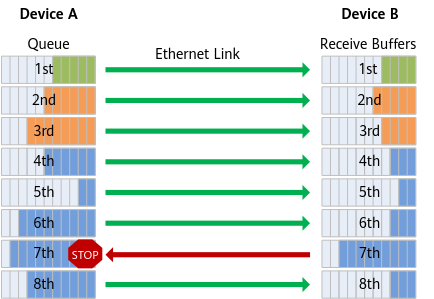
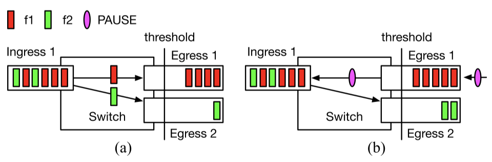
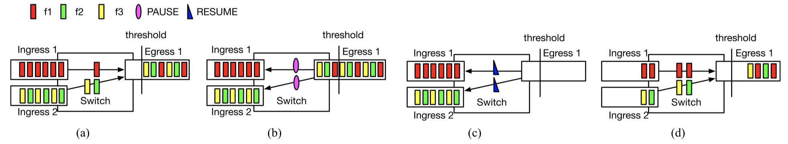

<!--Copyright © ZOMI 适用于[License](https://github.com/Infrasys-AI/AIInfra)版权许可-->

# 03.高速互联：无损网络 RoCEv2

> Author by: 焦方正

大模型参数从万亿级向十万亿级迈进，算力集群从“万卡”扩展至“十万卡”规模，传统网络带宽瓶颈与丢包问题成为制约算力效率的关键因素。无损网络通过实现​​零丢包、低时延、高吞吐​​的数据传输，确保大规模分布式训练任务效率，是释放万亿参数模型潜力的关键底座。

## 无损网络的必要性

为了实现内核卸载，达到高带宽、低延时的传输目的，RDMA 在设计之初便要求将所有网络协议栈卸载到网卡（RNIC）进行，以规避 CPU 参与传输过程。在应对丢包时的重传策略选择上，传统 TCP 的缓存并乱序重组的方案对网卡的缓存资源和处理能力要求极高。同时，RDMA 设计之初是基于 IB 网络，其采用的逐跳的，信用的控制方式很难产生丢包，因此在重传策略上，选择了简单高效的 go-back-N 的方式，即默认网络不会产生丢包，一旦接收乱序，便进行丢弃重传。

在 RoCE 网络中，通常使用 RoCEv2 来实现大规模的互联互通。RoCEv2 采用 UDP 的无连接不可靠传输协议，不像 TCP 协议这样的可靠传输机制，具有滑动窗口、确认应答的机制。而 RDMA 的重传策略又采用 go-back-N 的方式，因此在以太网络上丢包对 RDMA 的传输性能影响极大。

在不考虑链路误码这种非正常情况，数据传输过程中所有交换设备理论上都可以按照设计的线速转发传输数据包。但是一旦数据传输出现争抢，如两条链路的流量需要一个端口进行转发，数据包就会在该入端口的缓存进行排队。我们把这种现象称作 incast。每个端口的缓存 Buffer 大小有限，一旦超过这个端口的缓存能力，端口会将无法缓存下来数据包丢弃，从而产生丢包。如前文说所，RDMA 对丢包十分敏感，因此为了防止丢包产生，交换机需要预先采取相应的措施来避免这种情况发生。因此，便推出基于优先级的流量控制（Priority Flow Control，PFC）机制来实现无损网络。

## PFC 协议原理和特点

!!!!!!基于优先级的流量控制（PFC）​​再深入介绍其核心原理。

PFC 是 IEEE 802.1Qbb 标准定义的链路级流量控制协议，核心目标是为不同优先级流量提供独立的无损通道。PFC 是点对点的流量控制协议，整个过程通过 Xon 和 Xoff 参数进行控制。当接收端交换机/网卡检测到某优先级队列的缓冲区大小积累的数据包量超过 Xoff 时，便会立刻向上游发送 PFC 暂停帧​（Pause Frame）。上游设备收到后，立刻停止​该优先级流量的发送​，其他优先级流量不受影响。随着上游停止发送，下游持续转发，入口缓冲区大小逐渐下降，当达到 Xon 大小时，会向上游端口发送恢复帧(Resume Frame)。

!!!!!!!!看不懂，对应文字哪里的解释？

通过 PFC 的机制可以总结出 PFC 协议具有以下几个特点：

- 点对点控制协议，链路两端通过相关的控制帧，实现流量发送的启停。
- 流量控制过程是粗暴地、无脑地。只存在发和不发两个状态，一旦 Xon 发送不及时，容易降低带宽利用率。
- 控制时延是一跳，Xoff 参数剩余的空间必须能够存储一个带宽时延积的数据包大小才能保证 Pause 生效前，吸收链路上 flight 的数据包。
- 只按照队列进行区分，并不能区分流量，因此在多流环境下，进入同一端口的流量都会受到影响。

## PFC 协议存在的问题

!!!!!!!HOL 阻塞优化呢？

如上所说的 PFC 特点，在实际环境中，PFC 还存在一下四个主要问题：

- 队头阻塞(Head-of-Line Blocking)。PFC 的控制粒度是按照是优先级队列。一个优先级队列中通常存在​​多个不同的数据流​​。当该队列因其中一个流出现拥塞，如 ABC 三条流，其中 C 流去往的端口产生拥塞导致队列累积，当触发 PFC 机制时，上游该优先级通道都会被暂停。这意味着，​该队列中所有无关的数据流都会被阻塞​​，即使它们(AB)的目的地端口空闲且没有任何拥塞。如下图所示。

!!!!!!!!看不懂，对应文字哪里的解释？

- 不公平。当 Pause 帧产生，同时向 C 端口发送的 AB 两个端口入端口的上游同时停止，当 Resume 帧发出，AB 两个端口又同时开始发送数据。如果 A 端口只接收一个流，而 B 端口有两个流，由于同时开始这个过程,B 中的两条流同时与 A 中的一个流竞争，导致 A 的流量占据一半带宽。如下图所示。

!!!!!!!!看不懂，对应文字哪里的解释？

- PFC 风暴。由于 PFC 策略是点到点的控制，并不能直接降低源头的发送速率，所以当前方出现拥塞而发送方还在持续发送时，PFC 会逐级反压，甚至直接传导到发送方。该过程会产生大量的 Pause 帧，从而使链路发送停滞，由于队头阻塞的影响，收到影响的链路范围也越来越广，从而产生风暴。

- PFC 死锁。当 PFC 产生逐级反压时，一旦网络中存在环路（配置错误，路由收敛时的瞬时环路，设备故障等），PFC 将会形成环形暂停从而造成死锁，所有端口都无法发送数据，队列挤压，同时向上游端口发送暂停。这种相互等待一旦发生。没有外力干预几乎不可能自己恢复。

!!!!!!ECN 需要提不？有 PFC，那么 ECN 呢？

## 总结与思考

XXXXX

## 参考与引用

XXXXX
