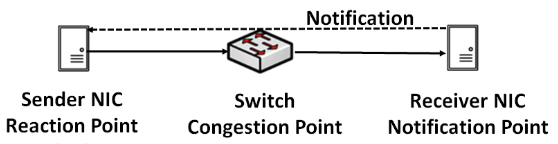
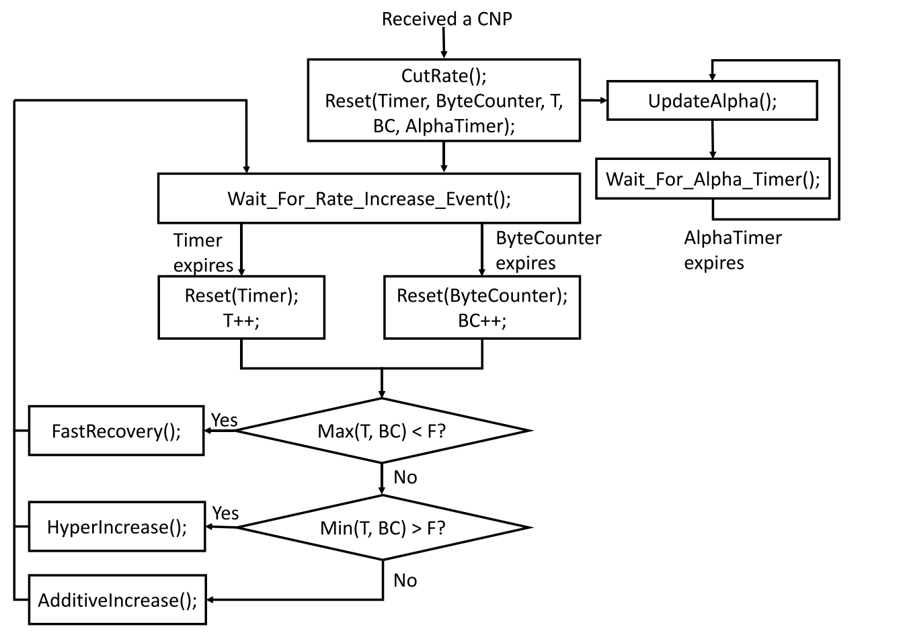
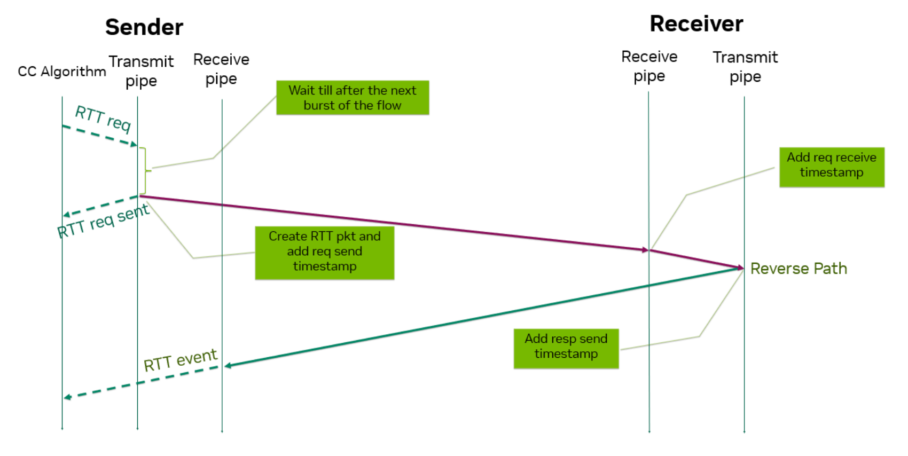
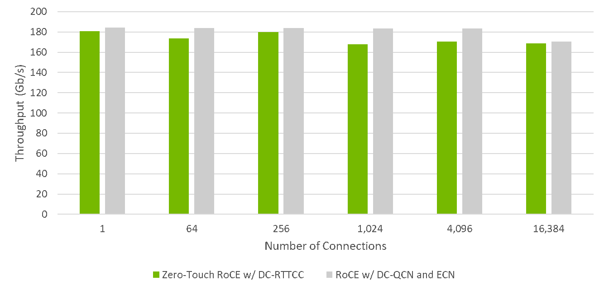

<!--Copyright © ZOMI 适用于[License](https://github.com/Infrasys-AI/AIInfra)版权许可-->

# 拥塞控制

> Author by: 焦方正

!!!!!!!!!
CC 在网络里面是非常常用的功能，建议用大量的高清图，论文里面的引用来展开。

与 PFC 的流控方式有以下几个明显区别：

- 拥塞控制算法通常根据反应拥塞程度的信号，动态调节发送速率，而 PFC 则是以暂停帧的形式，让上游直接停止发送。
- PFC 的消息是发送给上游前一跳端口，拥塞控制算法一般会由接收方将拥塞情况通知到真正的发送方，以减低发送方速率的方式控制网络中数据包的数量，这个控制链路通常比 PFC 信号要长的多。
- 从因果关系上，PFC 的核心目的保证在以太网上实现无丢包，对于流竞争产生的拥塞等问题并没有太多考虑和设计，进而才有各样的拥塞控制算法来保证拥塞问题。

## 拥塞检测

检测拥塞的方式大致可以归为三类：基于丢包检测、基于 ECN 的检测和基于 RTT 的检测。

**基于丢包检测**

当拥塞产生时，数据包在交换机上积累，由于交换机的端口缓冲 Buffer 有限，最终会产生丢包。丢包是拥塞持续得不到缓解的最终结果，以丢包作为检测信号，当发送端接受到重传信号时，进行流量大小的控制。在 TCP 协议中经典的 Tahoe 算法和 CUBIC 算法，都是基于丢包来做检测的。
但是，丢包对于 RDMA 的性能影响要比 TCP 严重的多，如果等到已经丢包再进行控制性能损失太大，因此 RDMA 不能采用这种方式。

**基于 ECN 检测**

ECN（Explicit Congestion Notification）是 IP 头部 Differentiated Services 字段的后两位，用于指示是否发生了拥塞。它的四种取值的含义如下：

| ECN 位值 (第 6、7 位) | 简称 | 含义说明 | 用途 |
| :------------------ | :--- | :--- | :--- |
| `00` | **Non-ECT** (非 ECT) | Not-ECN-Capable Transport。 表明该数据包**不支持** ECN 功能。 | 传统流量或禁用了 ECN 的流量，网络设备不会对其标记 ECN。 |
| `01` | **ECT(1)** | ECN-Capable Transport (1)。 表明该数据包**支持** ECN 功能。 | 由发送端设置，表明它具备 ECN 能力。通常与 `10` 同义使用。 |
| `10` | **ECT(0)** | ECN-Capable Transport (0)。 表明该数据包**支持** ECN 功能。 | 这是最常见的 ECN-Capable 标记。网络设备可以对这类数据包进行拥塞标记。 |
| `11` | **CE** | Congestion Experienced。 表明该数据包**经历了拥塞**。 | 由网络设备（如交换机、路由器）在检测到拥塞时设置，用以通知接收端发生了拥塞。 |

ECN 本质是一种标记，因此在交换机中通过利用 RED(Random Early Detection)功能实现--当交换机的缓存队列达到目标水线，就会开始随机地丢掉一些包，丢弃包的概率与当前队列深度正相关。而 ECN 标记就是将随机丢弃变成随机进行 ECN 标记，如果通信双方都支持 ECN（ECN 为 01 或者 10），当拥塞出现时，交换机会更新报文的 ECN 为 11（Congestion Encountered），再转发给下一跳。接收方可以根据 ECN 标志向发送方汇报拥塞情况，调节发送速率。这种随机标记带来一个极大的好处是对于不同的流显得更公平，即发送的包越多，那么被丢弃的概率也越大。

**基于 RTT 检测**

RTT（Round-Trip Time,往返时间）是指数据包从发送端发出,到收到接收端返回的确认（ACK）所经历的总时间。
RTT 能够反映端到端的网络延迟，如果发生拥塞，数据包会在接收队列中排队等待，RTT 也会相应较高。相比直线，ECN 只能够反映超过队列阈值的包数量，无法精确量化延迟。
RTT 可以选择在软件层或者硬件层做统计。一般网卡接收到数据包后，通过中断通知上层，由操作系统调度中断处理收包事件。中断和调度都将引入一些误差。因此，更精确地统计最好由硬件完成，当网卡接收到包时，网卡立即回复一个 ACK 包，发送方可以根据它的到达时间计算 RTT。
需要注意的是，ACK 回复包如果受到其他流量影响遇到拥塞，那么 RTT 计算会有偏差。可以为 ACK 回复包设置更高优先级。或者保证收发两端网卡的时钟基本上同步，然后在回复包加上时间戳信息。

## DCQCN

> 该部分参考论文：Congestion Control for Large-Scale RDMA Deployments

DCQCN（Data Center Quantized Congestion Notification）是 2015 年由 Microsoft 和 Mellanox 提出的 RoCEv2 的拥塞控制算法。其设计综合了 QCN（Quantized Congestion Notification）和 DCTCP（Data Center TCP）的相关功能。DCQCN 把 QCN 拓展到 IP 网络，以便用于 RoCEv2，主要功能实现在 RDMA 网卡中，中间交换机只需要支持 RED/ECN。DCQCN 可以划分为三个部分：

**CP 拥塞点**

CP，也就是发生拥塞的路径上某个交换机。如前文对 ECN 的介绍，当交换机端口队列上涨到一定程度时就会对数据包进行随机标记。在 DCQCN 中，对 CP 侧发生的拥塞采用三个数值进行定量控制 Kmin，Kmax和 Pmax。三者的关系如下图所示：

与 PFC 根据入端口的队列深度反压不同，ECN 的标记是根据出口队列深度进行数据包标记的。当出口队列的队列深度达到 Kmin时，便从 0 开始以概率 p 对数据包进行标记，并一直持续到 Kmax深度时，概率达到 Pmax。当队列深度超过 Kmax时，便以 100%的概率对数据包进行标记。标记的数据包最终发送到接收端，由接收端处理。

**NP 通知点**

NP，也就是数据的接收方。当收到 ECN 标记的数据包后，就会向数据的发送端发送 CNP 报文，作为拥塞控制的指示标识。由于 ECN 标记的数量通常会很多，所以 NP 并不是一收到 ECN 报文就发出 CNP 报文，在 Mellanox 的 CX 系列网卡中通过	*min_time_between_cnps*参数来控制 CNP 发送的时间间隔，默认为 4us。

**RP 反应点**

RP，也就是数据发送端。当收到 CNP 数据包后,接受端会按照调速算法调整发送速率。简单来说，这套调整算法遵循 AIMD（Additive Increase Multiplicative Decrease,加性增乘性减）策略。整个算法在 CX 网卡中的实现流程图如下所示：

在每个周期窗口，发送方网卡更新拥塞程度参数 $\alpha$(取值为 0 ~ 1)，更新算法如下：

- 如果收到拥塞通知，增加拥塞参数

$$
\alpha = (1-g)*\alpha + g
$$

- 否则，逐渐减少拥塞参数

$$
\alpha = (1-g)*\alpha
$$

然后根据拥塞程度参数调节发送速率（Rt 为目标速率，Rc 为当前速率）

**降速**

$$
R_t=R_c  
$$

$$
R_{cnew}=R_c*(1-\alpha/2)
$$

**升速**

升速分为两个阶段。

第一阶段为快速恢复阶段，如算法图所示，

$$
R_{cnew}=(R_c+R_t)/2
$$

第二阶段为主动恢复，该升速过程有两个触发条件，第一个是 T 次时间内没有收到 CNP，T 越长拥塞程度越小，第二个是接收到 BC 个数据包之后，BC 越大数据发送的越多，拥塞程度越小。同时这里设置了阈值大小 F。

当 Max(T,BC) $<$ F 时，也就是 T 和 BC 都没达到阈值 F，标志着短时间内发送了少量的数据包，开始尝试以 $R_AI$ 恢复速率:

$$
R_t=R_c + R_{AI}
$$

$$
R_{cnew}=(R_c+R_t)/2
$$

当 Min(T,BC) $>$ F 时，也就意味着长时间内发送了大量的数据包且没有 CNP 产生，意味着链路中拥塞程度很低，此时进行激进的数据恢复，用 $R_HAI$ 表示：

$$
R_t=R_c + R_{HAI}
$$

$$
R_{cnew}=(R_c+R_t)/2
$$

当只有只有 T 和 BC 只有一个大于 F 时，意味着拥塞刚刚缓解则进行普通的恢复

$$
R_{cnew}=(R_c+R_t)/2
$$

## TIMELY

## HPCC

## Swift

> 本部分参考谷歌 sigcomm20 Swift:Delay is Simple and Effective for Congestion Control in the Datacenter

## ZTRCC

基本工作原理

定时数据包（上图中的绿色网络数据包）会定期从发起方发送到目标。计时数据包会立即返回，从而可以测量往返延迟。RTTCC  测量数据包发送与发起方收到数据包之间的时间间隔。差异 （Time Received – Time Sent）  衡量表示路径拥塞的往返延迟。不拥塞的流继续传输数据包，以最好地利用可用的网络路径带宽。延迟增加的流意味着路径拥塞，为此 RTTCC  会限制流量以避免缓冲区溢出和丢包。

随着拥塞的减少或增加，网络流量可以实时调整。主动监控和应对拥塞的能力对于使 ZTR  能够主动管理拥塞至关重要。这种主动速率控制还减少了数据包的重新传输，并提高了 RoCE 性能。使用  ZTR-RTTCC，数据中心节点无需等待收到数据包丢失通知;相反，它们会在数据包丢失之前主动识别拥塞  prior to 并做出相应反应，通知发起方调整传输速率。

如前所述，ZTR 的主要优势之一是能够提供 RoCE 功能，同时在普通 TCP/IP 流量中与非 RoCE 通信同时运行。ZTR 提供 RoCE 网络功能的无缝部署。通过添加 RTTCC 主动监控拥塞，ZTR 无需交换机配置即可提供数据中心范围的拥塞控制

性能对比数据

## 参考

- [RDMA 在数据中心的可靠传输](https://zhuanlan.zhihu.com/p/257228128)