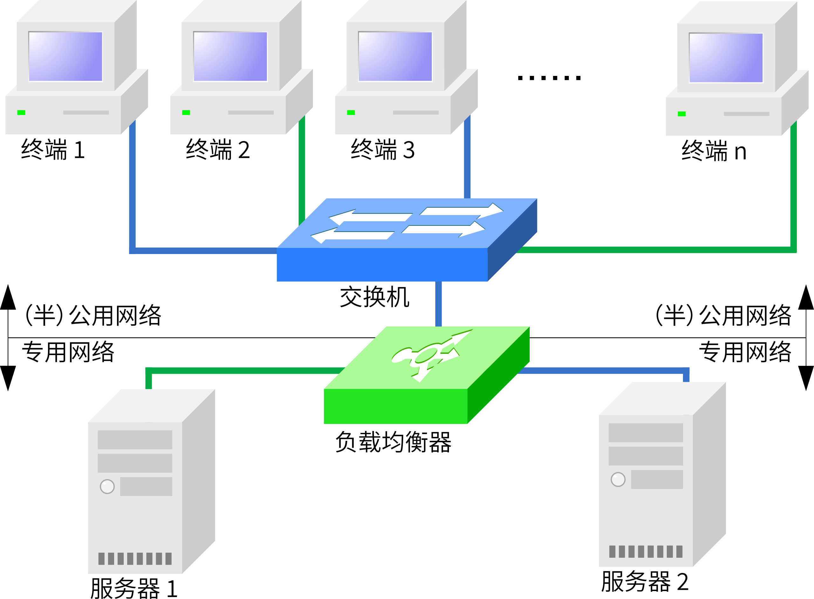
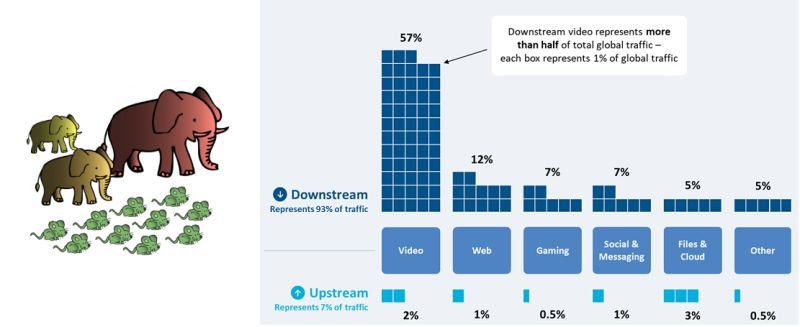
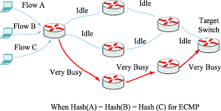
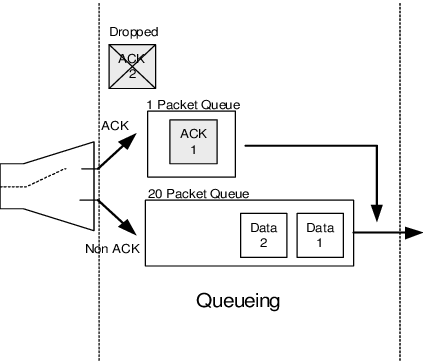
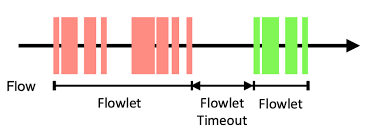
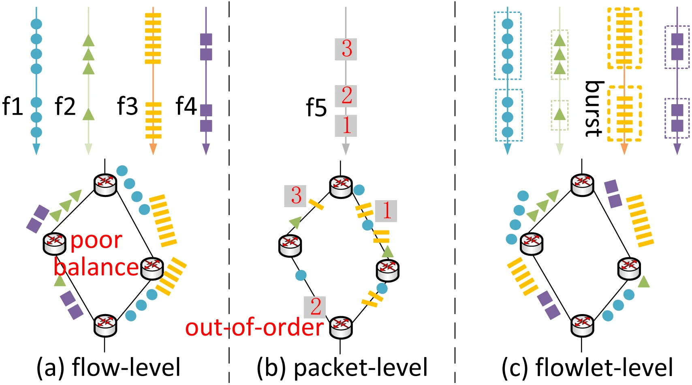

<!--Copyright © ZOMI 适用于[License](https://github.com/Infrasys-AI/AIInfra)版权许可-->

# 负载均衡

author by: 张万豪

## 负载均衡的概念

**负载均衡的概念**

负载均衡（Load Balancing）是指将网络流量、计算任务或工作负载等资源请求，智能地分配到多个后端服务器、计算资源或网络路径上，以提高资源利用率、避免单点故障，从而提升整个系统的性能与可靠性。其本质是解决资源分配的不均衡问题。

负载均衡技术可以通过专用的硬件设备（如硬件负载均衡器，如下图所示）或纯软件解决方案来实现。在网络层面，负载均衡依赖于特定的算法来决定流量路径，而其中最常用和最基础的算法之一就是 **ECMP (Equal-Cost Multi-Path，等价多路径路由)**。然而，这种传统技术在面对现代 AI 集群的独特需求时，暴露出严重的局限性。

AI 集群中的网络流量模式与传统数据中心有显著的区别。传统数据中心通常处理大量、短小、随机的“老鼠流”，例如网页浏览请求。而 AI 训练，尤其是集合通信操作（如 All-reduce、All-to-All），会产生数量较少但带宽极高、持续时间长的**“大象流”**。这些大象流具有高度的同步性和周期性，流量模式相对固定。另外，相较于传统数据中心，AI 训练中会依赖计算节点之间的频繁数据交换，网络中的拥塞、丢包、延迟抖动都会导致 GPU 等计算单元的等待，所以对低延迟、高吞吐有更高的要求。

另外，要理解负载均衡的各种算法，我们还需要理解网络中**数据包 (Packet)** 和 **流 (Flow)**的概念

- **数据包 (Packet):** 在 TCP/IP 网络中，Packet 是最基本的数据传输单元。它通常对应于**IP 分组（或称数据报）**，也就是数据在**网络层（L3）**上传输的实体。网络中的路由器和交换机（三层交换机）的主要工作就是根据 IP 头中的地址信息来转发这些独立的数据包。
- **流 (Flow):** “流”是一个更高级别的逻辑概念。对网络设备（如路由器或负载均衡器）而言，**“流”是共享某些特定属性的一系列数据包 (Packet) 的序列**。最常见的定义“流”的属性就是**“五元组”**（源IP、目的IP、源端口、目的端口、协议号）。例如，你发起的一个 TCP 连接（如一次网页请求或一次 `GPU-1`到`GPU-2`的数据块传输）所产生的所有数据包，都共享相同的五元组，因此它们同属于一个“流”。

如下图所示，在 Per-Flow 模式下，不同颜色的“流”被完整地、块状地分配到不同路径上；而在 Per-Packet 模式下，所有路径上都混杂着所有颜色的“包”

## AI集群中大象流的产生

下面让我们看看AI集群中的“大象流”是怎么产生的。AI 模型的训练遵循一个“前向传播、损失计算、反向传播、参数更新”的循环。然而，对于 GPT-4 这样的巨型模型和海量数据，仅靠单块 GPU 训练可能耗时数年。为了急剧加速这个过程，数据并行（Data Parallelism） 成为了标准策略。 

数据并行的核心思想很简单：**将完全相同的模型副本部署到多个 GPU 上，再将训练数据切分成多份，让所有 GPU 并行计算各自数据份上的梯度。** 但真正的挑战发生在参数更新之前：所有 GPU 必须“达成共识”。它们必须通过一个名为 **All-reduce 的网络通信操作**，来**同步（即汇总并平均）**各自计算出的梯度。待所有 GPU 都获得这个完全相同的“平均梯度”后，它们才会各自更新本地的模型副本，从而确保所有模型在下一次迭代开始前保持一致。

 **而“大象流”，正是在这个 All-reduce 阶段，由 NCCL 这样的通信库为追求极致效率而“有意制造”出来的。**由于梯度数据总量可达数百 GB，NCCL 会将其切分成多个大块（Chunks）。随后，它指挥所有 GPU 在同一时刻，使用 GPUDirect RDMA 技术（绕过CPU，从显存直通网卡），并发地向彼此高速传输这些数据块。 从网络的视角来看，每一个这样的大块数据传输，都是一条持续时间长、占用带宽极高的流。由于这种传输是全局并发的（例如 64 个 GPU 同时爆发），网络中便会瞬间涌入大量并行的**“大象流”**，这对网络负载均衡和拥塞控制提出了严峻的考验。

## 静态哈希负载均衡原理

ECMP (Equal-Cost Multi-Path)，即等价多路径路由，是传统数据中心网络中最基础的负载均衡技术。其核心思想是，当交换机发现有多条成本（“Cost”，如跳数或带宽）相同的路径可以到达同一个目的地时，它会试图将流量“均摊”到所有这些路径上。ECMP 的工作机制是基于“静态哈希”的，并且以“流”（Flow）为单位进行转发决策。具体流程如下：

1. **提取元组：** 当一个数据包到达交换机时，交换机硬件会从包头中提取关键字段，通常是“五元组”（源IP、目的IP、源端口、目的端口、协议号）。
2. **执行哈希：** 交换机使用一个固定的哈希算法（如 CRC）对这个五元组进行计算，得出一个哈希值。
3. **选择路径：** 交换机将这个哈希值对可用的等价路径数量进行取模（Modulo）运算（例如：`哈希值 % 路径数 = 路径索引`），从而为这个“流”选定一条唯一的物理路径。

由于同一个“流”（例如一个 TCP 连接）的所有数据包五元组都完全相同，它们计算出的哈希值也永远相同。因此，**一个流的所有数据包都会被固定地发送到同一条路径上**。这样做的好处是保证了数据包的顺序，避免了乱序。

 但是这种机制在面对 AI 训练负载时会失效。如前所述，All-reduce 会产生大量并行的“大象流”。ECMP 的静态哈希算法无法感知这些流的实际大小（带宽），它只“盲目”地根据五元组分配路径。这会导致**“哈希碰撞”**，如下图所示，即两个或多个来自不同 GPU 对的“大象流”，可能“碰巧”被哈希到了同一条物理链路上，**该链路被迅速打满并产生严重拥塞，而其他等价路径可能完全空闲**。

由于 All-reduce 是一个同步操作，整个训练任务必须等待这个“最慢的流”（即被拥塞的流）传输完毕才能进入下一步。ECMP 导致的路径不均衡，最终会严重拖慢整个训练任务的完成时间。

## Spray and Reorder

既然ECMP基于“流”的静态哈希是导致负载不均的罪魁祸首，那么一个最直接的改进思路便是：**彻底抛弃基于流的哈希，转向基于“包”的转发决策。** 这就是 `Spray and Reorder`（喷洒与重排）机制的核心思想。

“喷洒”是一种基于包 的负载均衡方式。当一个数据包（无论它属于哪个流）到达**入口叶子交换机**时，交换机不再对它的五元组进行哈希计算。相反，交换机采用一种轮询的策略，将**连续的数据包“喷洒”到所有可用的、通往下一跳Spine交换机的链路上**。

来自同一个流的数据包被均匀地切分，发送到了所有可能的中间路径上。这种机制带来的优势是显而易见的：它从根本上消除了“哈希碰撞”。无论来的是“大象流”还是“老鼠流”，数据包都会被均匀打散到所有物理链路。这确保了只要入口交换机的总入带宽不大于其到Spine交换机的总出带宽，网络就能始终以接近100%的吞吐量运行，实现了完美的负载均衡。

如下图所示，"Spray"（喷洒）机制在入口叶子交换机（Ingress Leaf 1, 2, 3）上执行，将**单个流**（如 `to a`）的**数据包**在所有可用的下一跳路径（Spine 4, 5, 6）上进行均匀的“喷洒”。如图所示，`to a`、`to b` 和 `to c`的流量都被精确地以33%的比例切分并分发。

但是，这种激进的“打散”方式，也带来了一个致命问题：**数据包乱序**。由于同一个流的数据包被发送到了多条物理路径，而每条路径的物理长度、光纤延迟、排队情况都可能不同，这必然导致它们**到达出口叶子交换机 (Egress Leaf) 的时间是错乱的**。例如，包 5 可能比 包 4 先到。对于TCP/IP协议（以及在其上运行的RDMA/RoCE）来说，严重的乱序是灾难性的。接收端会误以为包 4 已经丢失，从而触发复杂的重传和拥塞控制机制，导致性能急剧下降，甚至不如之前拥塞的ECMP。因此，`Spray and Reorder` 机制必须包含它的第二个关键步骤：**重排 (Re-order)**。

为了解决乱序问题，**出口叶子交换机 (Egress Leaf)** 必须具备特殊的硬件能力。当乱序的数据包到达Egress Leaf时，它们不会被立刻转发给目标服务器（GPU）。交换机（或目标服务器的智能网卡）会将这些包暂存在一个特制的**重排序缓冲区 ** 中，并根据它们的**序列号** 进行排序。只有当一个数据包是“按序”的（即它的前一个包已经收到并转发），交换机才会将其释放，发送给GPU。通过这种“先打散、再重组”的精密配合，`Spray and Reorder` 机制在应用层（GPU）看来，既享受到了多路径的全部带宽，又规避了乱序带来的性能惩罚。

然而，`Spray and Reorder` 机制虽然效果显著，但它并非没有代价，而是以引入**极高的硬件复杂度和新的性能瓶颈**为权衡。首先，它彻底告别了“商用现成”交换机。为了实现“重排”（Re-order），**出口叶子交换机（Egress Leaf）的ASIC芯片中必须集成一个高速、大容量的“重排序缓冲区”**。这不仅极大地推高了交换机的研发和制造成本，也往往导致用户被特定（如NVIDIA、Broadcom等）的高端芯片方案“厂商锁定”。同时，“重排”动作带来的**新型“队头阻塞”**：如果一个包（如包4）因慢路径延迟，重排缓冲区就必须“扣住”所有已提前到达的后续包（如包5、6、7），导致整个流都被这个“最慢的包”卡住，网络抖动也因此被转化为了应用延迟。实际上，**`Spray and Reorder` 是一种效果极致但也代价高昂的“蛮力”方案**。

## 动态负载均衡 (Dynamic Load Balancing)

与 ECMP 的静态哈希相反，**动态负载均衡** 是一种更智能的机制。其核心思想是 **“拥塞感知” (Congestion-Aware)**：交换机不再仅仅基于数据包的五元组来做一次性的、固定的路径决策，而是会**实时监测**网络中各条路径的负载状态，并动态地将流量引导至当前最优（即最不拥堵）的路径。一句话总结，动态负载均衡的核心就是**基于网络的实时状态，动态地、智能地**做出转发决策。

 感知的主要信息包括网络中的关键指标，比如链路利用率、队列深度、端到端延迟或者ECN信号，交换机或网络控制器（在SDN架构中）会实时收集这些“拥塞信息”，并将它们作为决策依据，**优先将流量引导到当前最空闲、队列最短的路径上**。

动态负载均衡在实现时，面临一个核心的权衡，**即以什么“粒度”来分配流量。**

在静态哈希ECMP中，按照流的粒度进行均衡。它能完美保证包的顺序，但如前所述，它无法均衡“大象流”。但是如果将每个到达的**数据包 **随机或轮询地“喷洒”到所有可用的路径上，这就是 `Spray` 机制，它能实现完美的负载均衡，但会导致严重的包乱序。

业界提出了一种划分粒度：**流片 (Flowlet)**。一个“流片”被定义为来自同一个“流”的、**在时间上连续的一组数据包**。如果一个大象流在发送数据时，中间出现了一个大于特定阈值（例如几微秒）的“空闲间隙”，那么这个间隙前的数据包和间隙后的数据包就被视为两个不同的“流片”

`Flowlet`交换机制，正是为了解决“保证包序”与“负载均衡”这一核心权衡而设计的。它既不像ECMP那样死板地绑定整个“流”，也不像`Spray`那样激进地打散每个“包”，其工作原理是，入口交换机为活跃的“流”维护一个**空闲定时器**

1. **新流片的决策：** 当一个“流”的**第一个数据包**到达时，交换机认为这是一个“新流片”。此时，它会执行其**动态负载均衡算法**（例如“选择**当前队列最短的路径**”或“选择**链路利用率最低的路径**”），为这个流片选定一条出口路径。
2. **流片内部的“路径粘性”：** 一旦这条路径被选定，交换机就会“锁定”这个流片。在该流的“空闲间隙”阈值（到达之前，所有后续属于**同一个流**的数据包，都会被**强制**发送到这条**已选定的路径**上。这保证了同一个流片内部的数据包100%按序到达。如下图中红色的部分。
3. **流片间的“动态重均衡”：** 奇妙之处发生在“间隙”出现时。如果这个流暂停发送，时间**超过了**那个微秒级的阈值，交换机内部的定时器就会超时。当下**一个**数据包（即下一个“流片”的“头包”）再次到达时，交换机将**不再**遵循上一次的路径选择。它会**重新**评估所有路径的实时拥塞状况，并**再次**执行动态负载均衡算法，为这个“新流片”选择一条（可能是全新的）当前最优路径。如下图中绿色的部分，因为前面红色的流暂停发送时间超过了Flowlet Timeout，所以绿色部分就是一个新的Flowlet，会重新选择最优路径。

这种设计的精妙之处在于它对接收端和交换机都是友好的，完美地平衡了AI集群的需求：

- **对接收端（GPU）友好：** 它保证了“流片”内部的绝对包序。这个“空闲间隙”阈值的设计，通常会大于网络中不同路径间的最大延迟差。这确保了前一个流片的数据包有足够时间“排空”其路径，从而避免了不同流片之间产生严重的、破坏RDMA性能的乱序。
- **对网络（交换机）友好：** 它实现了“大象流”的动态切分。一个持续数秒的 All-reduce 大象流，在ECMP下会永久地“霸占”一条路径；但在 Flowlet 机制下，它会被自然地（或由发送端有意地）切分成成百上千个小流片。交换机因此获得了成百上千次机会，根据实时的网络拥塞，将这些流片动态、均匀地“调度”到所有可用链路上。

因此，Flowlet 机制在效果上接近了“按包喷洒”的负载均衡度，却又巧妙地规避了其致命的“包乱序”惩罚，被认为是AI RDMA网络中一种非常高效且实用的动态负载均衡方案。

## 总结

至此，我们探讨了从经典到现代的三种主要负载均衡机制：ECMP、Spray and Reorder、以及Flowlet。它们代表了在“负载均衡度”与“包序保证”这两个维度上截然不同的设计取舍。其对流量的处理可以用下图表示：

我们用一个表格来清晰地总结它们之间的核心差异：

| **特性**     | **ECMP (静态哈希)**           | **Spray and Reorder (喷洒与重排)** | **Flowlet (流片交换)**      |
| ------------ | ----------------------------- | ---------------------------------- | --------------------------- |
| **均衡粒度** | **Per-Flow** (流)             | **Per-Packet** (包)                | **Per-Flowlet** (流片)      |
| **决策时机** | **静态** (流开始时一次性决定) | **静态** (按包轮询，无决策)        | **动态** (每个流片开始时)   |
| **核心机制** | 五元组哈希取模                | 入口喷洒，出口重排                 | 拥塞感知 + 空闲定时器       |
| **包乱序**   | **无乱序** (核心保证)         | **严重乱序** (致命缺点)            | **基本无乱序** (设计目标)   |
| **硬件依赖** | 低 (标准商用交换机)           | **极高** (需昂贵的重排缓冲区)      | 高 (需高速定时器和状态管理) |
| **核心优势** | 简单、无乱序、成本低          | **完美的负载均衡**                 | 动态均衡，且规避了乱序      |
| **核心缺点** | **哈希碰撞** (大象流杀手)     | 成本高、HOL阻塞、状态开销大        | 依赖间隙、均衡度非100%完美  |

**ECMP** 是最简单的方案，但它“盲目”的哈希在AI集群中必然失效。**Spray and Reorder** 是最“蛮力”的方案，它用极高的硬件代价换取了最完美的均衡效果。**Flowlet** 是最“精巧”的方案，它在“流”和“包”之间找到了一个平衡点，实现了“动态均衡”和“包序保证”的兼得。

## 思考

那么，面对这几种技术路线，当今的业界（尤其是超大型AI集群的建设者）究竟是如何选择的呢？业界面对的真实场景往往更为复杂，各厂家针对的具体场景不同，呈现出“**不同生态、不同取舍**”的局面。

1. NVIDIA (Infiniband 生态):

   在NVIDIA主导的高性能Infiniband (IB) 网络中，它们从不使用ECMP。IB网络从设计之初就内置了高效的“自适应路由”（Adaptive Routing）机制。交换机（如NVIDIA Quantum-2）本身就能感知下游链路的拥塞情况，并动态地为数据包（或流片）选择最佳路径。这套闭环生态是其长期保持性能领先的核心之一，其理念与Flowlet的动态思想接近，但实现更为底层和高效。

2. Google (TPU 自研生态):

   谷歌是“Spray and Reorder”机制的坚定拥护者。在其TPU专用的“Clos”网络架构（如Jupiter）中，它们控制了从服务器、网卡（NIC）到交换机的整个技术栈。这种“全栈自研”的模式，使其有能力在网络入口（交换机）进行激进的Per-Packet“喷洒”，然后在网络的出口（可能是智能网卡，也可能是Egress交换机）高效地完成“重排”。这是典型的“用极致的硬件复杂性换取极致网络性能”的思路。

3. 主流以太网生态 (Broadcom, Arista, Cisco 等):

   这是目前AI以太网市场的主流。在这个“开放”生态中，Spray and Reorder 方案由于成本过高且需要厂商锁定，接受度有限。**因此，Flowlet（流片）交换机制成为了事实上的“最优解”。**芯片巨头 **Broadcom** 在其为AI优化的Tomahawk和Jericho系列交换机芯片中，内置了高效的**动态负载均衡**功能。这种DLB在很大程度上就是`Flowlet`机制的商业实现。它允许交换机ASIC实时监测出口队列的拥塞情况，并在“流片”粒度上做出动态路径决策。**Arista, Cisco, Dell** 等厂商基于这些芯片构建的AI网络解决方案，也都把“动态流片交换”和“拥塞感知”作为其核心卖点。

总结而言，静态ECMP在AI集群中早已过时。Flowlet（流片）机制凭借其在性能与成本之间的精妙平衡，正成为AI以太网（RoCE网络）的主流动态负载均衡方案。在那些有能力全栈自研（如Google）或提供完整端到端方案（如NVIDIA的可调度以太网）的厂家中则会选择 Spray and Reorder 方案。

## 参考文献
- [硬件负载均衡](https://www.google.com/url?sa=i&url=https%3A%2F%2Fwww.linkedin.com%2Fposts%2Fziad-al-barqawi_elephant-flows-and-mice-flows-are-two-types-activity-7119362932466999298-3a3s&psig=AOvVaw2wUeNYBQGaFKRqytRcrPE9&ust=1758932673121000&source=images&cd=vfe&opi=89978449&ved=0CBgQjhxqFwoTCOjqwfuU9Y8DFQAAAAAdAAAAABAy)

- [大象流和老鼠流](https://translate.google.com/translate?u=https://zh.wikipedia.org/zh-cn/%25E8%25B4%259F%25E8%25BD%25BD%25E5%259D%2587%25E8%25A1%25A1&hl=en&sl=zh-CN&tl=en&client=search)

- [路由负载均衡](https://lwz322.github.io/2019/11/03/ECMP.html)

- Koziniec, Terry. "Enhancing TCP throughput in asymmetric networks through priority queuing and the rate-limiting of acknowledgements." *Communications, Internet, and Information Technology*. 2004.

- Guo, Zhiqiang, Xiaodong Dong, Sheng Chen, Xiaobo Zhou, and Keqiu Li. "EasyLB: Adaptive load balancing based on flowlet switching for wireless sensor networks." *Sensors* 18, no. 9 (2018): 3060.

- Diao, Xinglong, Huaxi Gu, Wenting Wei, Guoyong Jiang, and Baochun Li. "Deep Reinforcement Learning Based Dynamic Flowlet Switching for DCN." *IEEE Transactions on Cloud Computing* 12, no. 2 (2024): 580-593.

- [Evolve your AI/ML Network with Cisco Silicon One](https://www.cisco.com/c/en/us/solutions/collateral/silicon-one/evolve-ai-ml-network-silicon-one.html)

  