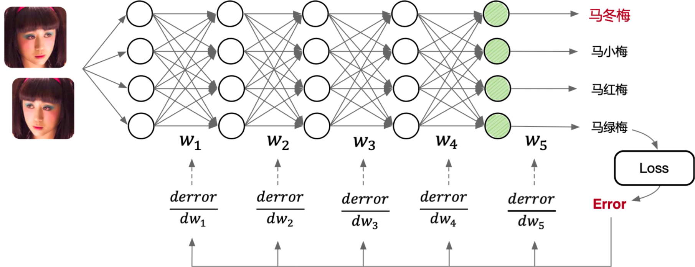
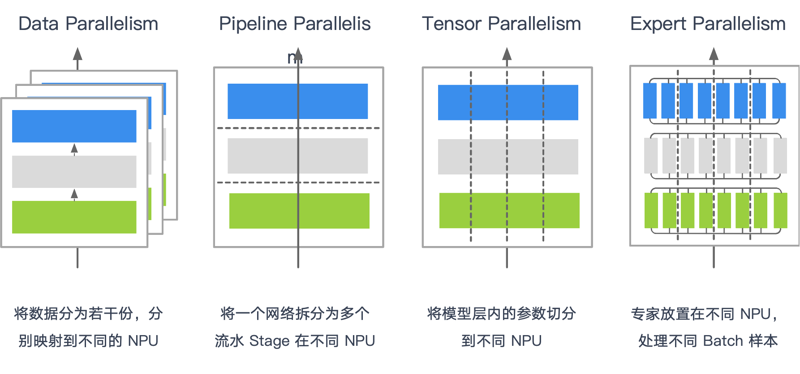
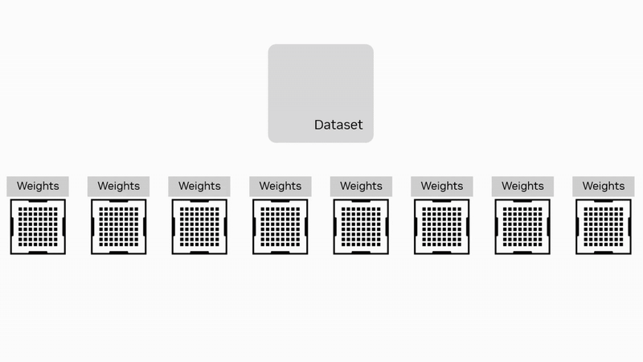
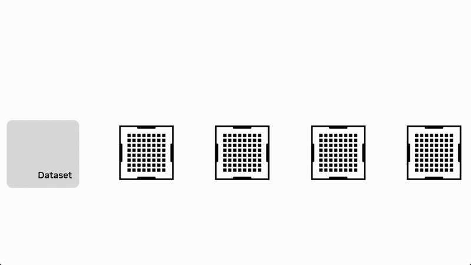
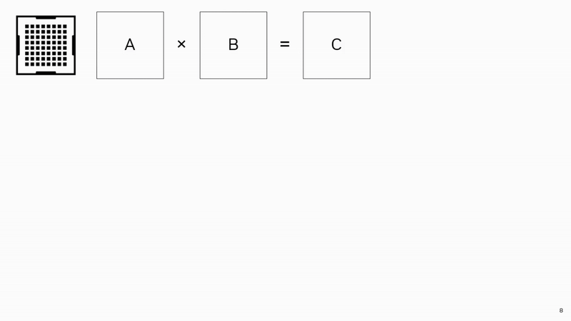
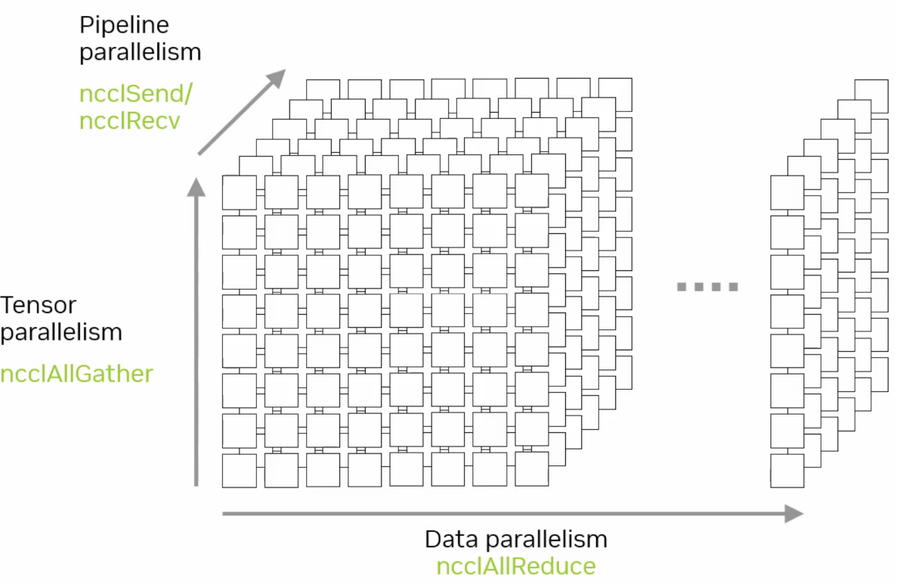
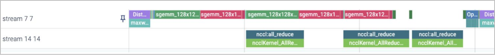
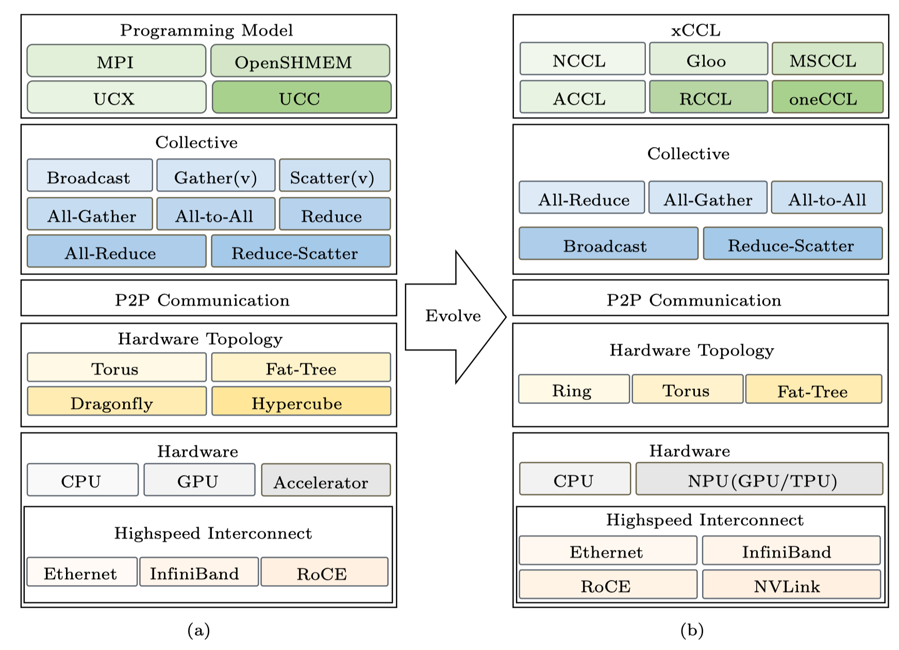

<!--Copyright © ZOMI 适用于[License](https://github.com/Infrasys-AI/AIInfra)版权许可-->

# 02.集合通信关键作用

Author by: SingularityKChen

!!!!!!! XCCL 是什么？

本章聚焦“AI 与通信的关系”与“XCCL 基本架构”。我们将围绕**并行策略、集合通信原语、通信量与拓扑、计算/通信重叠**这一主线，解释不同并行方式为何需要 AllReduce / AllGather / All2All / Send-Recv 等原语、需要传多少数据、在真实网络与实现中如何落地，以及 XCCL 在训练框架与通信库之间的承上启下角色。

## AI 与通信关系

本节简要回顾神经网络及其训练过程的基础计算，并回顾近年来 AI 训练和推理过程中涉及的分布式和并行计算模式。

### 从单卡到多卡通信

神经网络训练的过程是神经网络模型通过梯度下降算法优化参数的过程。在单卡训练中，神经网络模型的训练过程主要依赖于单个 GPU 卡的计算能力。

上图左侧展示了梯度下降算法在三维空间中寻找数据鞍点的过程。梯度下降算法通过不断调整参数，沿着损失函数的负梯度方向移动，以最小化损失函数。图中的三维曲面表示损失函数，黑色线条表示梯度下降算法的路径，最终目标是找到损失函数的最小值点，也称为鞍点。

上图右侧展示了训练过程中损失值的变化情况。横轴表示训练的轮数（epoch），纵轴表示损失值。蓝色曲线表示训练集上的损失值，橙色曲线表示验证集上的损失值。随着训练轮数的增加，损失值逐渐下降，表明模型在不断优化，性能在提升。

左侧图中梯度下降算法逐步找到损失函数的最小值点，对应右侧图中损失值随着训练轮数的增加而逐渐降低。

如上如图所示，一个典型的多层前馈神经网络包含输入层、多个隐藏层和输出层。输入层接收图像数据，这些图像数据通过网络的各个层进行处理。每个层之间通过权重矩阵（$W_1$, $W_2$, $W_3$, $W_4$, $W_5$）连接，数据在前向传播过程中经过线性变换和非线性激活函数处理，最终在输出层生成预测结果。

训练过程中，计算预测结果与真实标签之间的误差（Loss），并通过反向传播算法将误差逐层传递回网络。在反向传播过程中，计算每一层权重矩阵的误差梯度（$\frac{derror}{dw_1}$, $\frac{derror}{dw_2}$, $\frac{derror}{dw_3}$, $\frac{derror}{dw_4}$, $\frac{derror}{dw_5}$），并根据这些梯度更新权重矩阵，以最小化损失函数。

上述整个过程都在单个 GPU 卡上完成，计算资源和数据处理均依赖于该卡的性能。单卡训练适合中小规模的模型和数据集，但对于大规模模型和数据集，单卡的计算能力可能成为瓶颈，这时就需要引入多卡并行训练来提升效率。

### 分布式训练与多卡并行

在单卡训练的基础上，多卡并行训练可以显著提高训练速度和效率。多卡并行训练通过将模型和数据分布到多个 GPU 卡上，利用多个卡的计算能力同时进行训练，从而加速模型的收敛。

不同并行策略，本质区别在于**where: 哪些张量需要跨卡通信、when: 何时需要通信、what: 通信的粒度**。这直接决定使用的集合通信原语与**传输数据量**。

**分层/分级**与**就近通信**几乎是所有大规模集群的共同优化。

#### 数据并行 Data Parallelism

数据并行是最常用的并行策略之一。在这种策略中，数据集被分割成多个子集，每个子集分配给不同的计算卡。每个卡上都保存模型的完整副本，并独立计算梯度。计算完成后，通过集合通信算法 **AllReduce** 将所有卡的梯度汇总，计算出全局梯度，并更新模型参数。

如果把每个 rank 的梯度大小记作 $G$，那么在典型的环（Ring）或 Halving-Doubling 实现里，每个 rank 的总发送量都接近 $2G \cdot \frac{N-1}{N}$；差别主要在步数：Ring 需要 $2(N-1)$ 步，Halving-Doubling 需要 $2\log_2 N$ 步。

实践中，我们不会等到所有梯度一次性聚合，而是以 PyTorch 的 bucket 为单位分批发起通信：大 bucket 有利于带宽利用，代价是增大首包延迟；小 bucket 则更容易与计算重叠、但容易落入小包低效的陷阱。

拓扑上，节点内优先走 NVLink/NVSwitch 等高带宽链路，跨节点再通过 RDMA 做**分层/分级 AllReduce**。

#### 流水并行 Pipeline Parallelism

流水并行将模型按层分为多个连续阶段（Stage），每个阶段放置在不同设备上。数据以流水线方式在阶段之间流动，在前向阶段通过集合通信原语 **Send/Recv** 进行数据传输，全局梯度同步还需要用到集合通信原语 **AllReduce**。

流水并行的优势在于计算与通信的重叠，能够同时并行处理模型不同部分的数据，减小单阶段计算压力，但需合理设计 micro-batch 数与调度以减少通信等待。

#### 张量并行 Tensor Parallelism

张量并行适用于模型规模特别大的场景，它将单个模型层内的大矩阵或张量计算分割到多个设备上并行处理。计算完成后，使用 **AllGather / ReduceScatter** 汇总结果。

#### 专家并行 Expert Parallelism

专家并行适用于专家混合模型（Mixture of Experts，MoE），将多个专家分别放置在不同设备，每个设备处理特定数据子集。计算时，每个设备要把一部分 token 按 top-k 路由到选中的专家所在设备，各专家模型独立运算后，通过 **All2All** 获得计算结果。**通信量**与路由分布强相关，top-k 与 capacity factor 都会改变 All2All 的有效带宽。

由于分流粒度是 token，这类通信对“小包密集”和负载不均非常敏感，工程上常结合分层 All2All、路由聚簇与 padding 来稳定吞吐。

#### 多维并行 Multi Parallelism

多维并行组合了数据、流水、张量与专家并行等策略，并据此组合 All2All、AllGather、AllReduce 与 P2P，以适应负责的训练场景。

FSDP 前向按需 **AllGather** 权重分片，反向通过 **ReduceScatter** 回收梯度分片，从而把常驻显存与通信量一起控制在 shard 粒度；

长序列训练则围绕上下文重组，以 **AllGather 和 AllReduce** 组合，在跨卡恢复 attention 所需的信息。

> 我们发现跨卡共享数据的特征非常重要：共享数据得越大，通信量越大；共享数据离得越近，可用带宽越高。
> 算法上，Ring 与 HD 在单位数据上的总通信量接近，但步数差异使得它们在小包/高延迟和超大包/带宽饱和的两端各有优势。
> 系统上，分层 AllReduce、就近通信与合适的 bucket 粒度，几乎是所有大规模训练稳定扩展到多机多节点的共同秘诀。

## 集合通信与分布式

!!!!!!!!!!!分布式训练的内容，重点的是讲解各种并行，对集合通信的影响，特别是深入，一定要深入，例如传输多少数据量。不同的集合通信的源语具体对模型训练和推理的影响。

## XCCL 基本架构

!!!!!!!写文章是为了更加深入理解这个知识点的原理，这里 XCCL 基本架构，没有展开，到底 XCCL 有哪些模块，有哪些内容。这块要自己深入 看不同的 XCCL 库，然后抽象出来一个共性的架构，这是我强调的来源于视频的内容，但是要比视频的内容深入很多很多的原因

XCCL（XXXX Collective Communication Library）架构源自于高性能计算（HPC）的集合通信架构，经过优化和演进，以满足当前 AI 场景的特殊通信需求。本节从 HPC 和 XCCL 通信架构对比介绍，展示二者的异同。

### 计算与通信解耦

!!!!!!例如下面的内容就非常粗浅，一定要学深入，多看论文，多思考。下面是我改好的。

在大模型训练中，集群算力利用率（MFU）直接决定训练周期，而传统 “计算 - 通信串行” 模式是制约 MFU 的核心瓶颈。其根本问题在于强同步依赖：每一层网络计算出梯度后，必须等待该梯度通过 AllReduce 等集合通信完成跨节点同步，才能启动下一层计算。

以 6710 亿参数的 DeepSeek-V3 为例，其包含 61 个 Transformer 层，且第 4 至 61 层为 MoE 架构，这类架构天然存在专家数据跨节点调度需求，通信压力显著高于密集模型。若采用传统串行模式，按实测数据单层级计算耗时 10ms、跨节点通信耗时 3ms 计算，每层总耗时将达 13ms，且 MoE 架构未优化时计算：通信比可降至 1:1，大量 GPU 计算单元因等待专家数据传输陷入闲置，2048 卡集群的算力浪费问题尤为突出。

上图 Stream 77 和 14 分别是计算和通信的进程。!!!!!!请继续补充，说明原理，建议换一个图，自己做个 profiling，然后截图。

为解决这一问题，XCCL 采用**计算与通信解耦**的策略，将计算和通信两个过程独立执行，分别优化。通过性能优化策略减少通信频率，提升集群训练性能（HFU/MFU）并防止通信等待时间过长导致的“假死锁”问题。XCCL、NCCL 等集合通信库的 “计算与通信解耦” 策略，支撑千卡 / 万卡级集群高效运行，成为大模型工程化落地的关键技术基石：

- 异步 Stream 并行调度：依托 GPU Stream 实现计算与通信的物理隔离。计算 Stream 无需等待上一层通信完成，可连续推进下一层 FFN 与 MLA 模块计算；通信 Stream 则异步抓取已就绪的梯度与特征数据，通过 Ring AllReduce 协议后台传输，使总耗时从 “计算 + 通信” 逼近纯计算耗时。

- 通信粒度优化：解耦后可灵活合并通信任务，例如累积多层梯度后执行一次 AllReduce，将通信次数从 “每层 1 次” 降至 “每 N 层 1 次”，减少通信启动开销与带宽占用，进一步降低通信对流程的影响。

- 死锁防护：传统串行中单个节点通信阻塞会导致全集群等待（“假死锁”）；解耦后计算与通信独立，局部通信异常时，其他节点计算仍可推进，通信模块可重试容错，避免全集群挂起。

### HPC 到 AI 通信栈基本架构

在经典 HPC 中，MPI/OpenSHMEM/UCX 面向传统的高性能计算任务，通信模式以阶段性、批式居多；而在 AI 训练里，高频次的梯度同步、参数/激活的分片汇聚、token 级路由使通信更贴合模型结构。

因此栈内自上而下发生了迁移。编程模型从 MPI 走向 NCCL/Gloo/oneCCL/MSCCL 等面向深度学习的库。通信原语以 AllReduce / AllGather / ReduceScatter / All2All / P2P 为主，与并行方式对应。拓扑结构从超算常见的 Hypercube/Dragonfly 转向更贴合深度学习训练通信场景的 Ring/Torus/分层 Fat-Tree。硬件端引入 NVLink/NVSwitch、RoCE/IB RDMA 与 NPU/TPU 特有的片内外直连，代替部分传统 PCIe 与 RoCE 通道，显著降低节点内的同步成本，同时通过分级/就近通信降低跨节点的同步成本。

从用户视角看，XCCL 是“通信执行层”的统一入口：上承 PyTorch 与分布式控制器（Megatron-LM/MindSpeed），下接 ProcessGroup（NCCL/HCCL/Gloo…）与物理互联（RDMA、NVLink、RoCE、PCIe/CXL、SHMEM）。训练过程中，框架把张量放入 bucket，控制器在后台协调各 rank 的时序与分组，XCCL 则在独立的通信流中执行对应原语，并通过 event 与同步点把结果安全地交回计算流。这样既能充分占满节点内高带宽链路，也便于用分层/分级在跨节点时减少长尾与抖动。

### XCCL 基本架构

!!!!!!! 看代码，抽象处理 XCCL 的架构

### 接入框架与分布式加速库

!!!!!!!!! 太浅了，到底 XCCL 这些库，是如何接入 pytorch 这个框架的？代码和架构图示例，深入去学习了解。

训练框架（如 PyTorch）上层接管“何时、对哪些张量、以什么粒度发起通信”，最终仍通过 `torch.distributed` 的 `ProcessGroup` 调用底层通信库（NCCL/HCCL/Gloo）：

- 上层（如 DeepSpeed / Megatron-LM / ColossalAI / MindSpeed）  
  - 负责并行策略与张量切分，组织 bucket，决定 AllReduce/AllGather/All2All/P2P 的触发时机与先后顺序。  
  - 通过 reducer/hook 把 grad bucket 推入队列，调度后台循环线程。  
- 中间（`PyTorch torch.distributed`）
  - 将高层请求转为 `ProcessGroup::collective` 调用，在通信流 `xcclStreams` 上排队执行，并用 event 在计算流与通信流之间做依赖同步，确保先写后读/先聚合再使用。  
- 底层（NCCL/HCCL/Gloo/oneCCL/MSCCL）  
  - 依据拓扑与算法（Ring/Tree/HD/2D-Torus）完成具体的路由与搬运，并利用 GPU/NPU 的 DMA/核外执行能力与 SHARP/在网计算等优化实现高吞吐。

> 加速库的加速，大多来自粒度控制（分片/bucket）、触发时机（重叠/合并）、分层通信（节点内优先）与对底层 ProcessGroup 的正确使用，而非绕开 NCCL/HCCL 另起炉灶。

## 总结与思考

通过本章的学习，我们知道**并行方式决定原语，原语决定通信量与拓扑选择**，并说明了 XCCL 在框架调度和通信执行之间如何通过 bucket、分层与流/事件机制达成**计算-通信的高效重叠**。理解这些映射关系，是扩大模型规模、提升集群 MFU、降低网络成本的重要前提。

## 本节视频

<html>
<iframe src="https://player.bilibili.com/player.html?aid=1255396066&bvid=BV18J4m1G7UU&cid=1570235726&page=1&as_wide=1&high_quality=1&danmaku=0&autoplay=0" width="100%" height="500" scrolling="no" border="0" frameborder="no" framespacing="0" allowfullscreen="true"></iframe>
</html>

## 参考与引用

!!!!!!!!参考的论文链接，自己得去看论文
