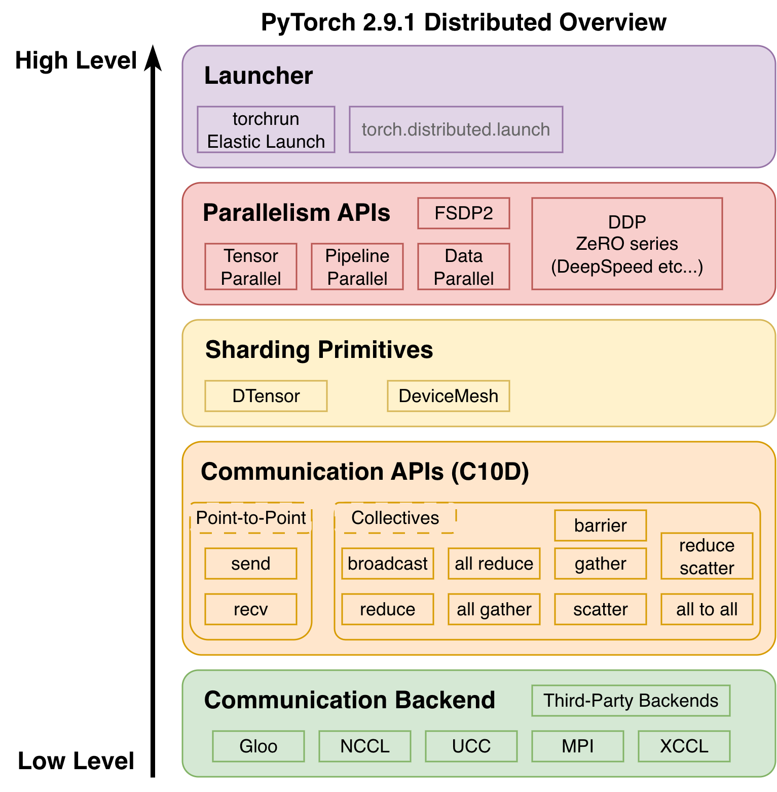

<!--Copyright © ZOMI 适用于[License](https://github.com/Infrasys-AI/AIInfra)版权许可-->

# 05.通信域与 PyTorch 实现

作者：SingularityKChen & 陈彦伯

本章的前四节介绍了集合通信的基本概念并介绍了一些常用通信原语和通信算法。在整个 AI 系统中，通信算法与通信原语位于较高抽象层级，主要面向分布式训练算法与 AI 模型设计者。在此之下，**通信域（Communicator）** 是一个重要的中间层次。它屏蔽了底层通信链路的硬件细节差异、集中维护集合通信的元信息，为上层算法实现和调用提供了诸多便利。本节首先从一个较高的视角概述通信域的原理与概念，之后以 PyTorch 为例了解其代码实现。

## 通信域

通信的本质是数据在处理单元之间的传输。我们不妨将 AI 系统类比为一个“污水处理厂”：如果输入数据是“污水”，那么服务器就是处理水的“工厂”，而计算单元（如 CPU、GPU 和 NPU 等）就是工厂中的“净化器”。多个工厂与净化器彼此之间通过水管相连，具备相应的拓扑结构，我们以此类比集合通信中的通信链路。多个工厂和净化器的同时作业就类似并行计算，只不过服务器和计算单元不像人一样懂得变通，他们需要清晰的指令，包括数据的处理方式与收发去向等。

基于上述类比，我们来看几个有关集合通信与通信域的重要概念。

- **节点（node）** 和 **rank**：集合通信中一般将一台服务器抽象为一个节点。一个节点下可能包含多个 rank，即服务器中搭载的多个计算单元。在并行计算任务中，每个节点和 rank 都会被赋予一个唯一的**全局 ID**，这是为了方便统一地指定数据的处理方式与收发去向。在每个节点中， ranks 还会被赋予一个 **local ID**，这是为了方便一些需要节点内互传的通信算法，如 Reduce、Gather 等。
- **进程（process）** 与**进程组（group）**：注意，进程与 ranks 之间并不是一一对应的关系。在复杂的 AI 训推任务中，计算单元会被动态地分配
- 上下文：由于
- **拓扑（topology）**：即节点、计算单元之间的链路信息。与上下文信息一样，通信域的拓扑信息一般由通信后端统一管理。

不了解集合通信的读者可能会提出一个很自然的问题：*为什么通信域里要维护这么多信息？* 这是因为当设备数量、网络拓扑等条件不同时，即便是同一个通信算法的具体实现也是不一样的。换句话说，通信域中所维护的信息是为了让上层封装（如下文会讲到的 `torch.distributed`）得以自动选择合适的算法实现。

**通信域（Communicator）**

1) 通信域、进程、进程组与 Rank 的关系；
2) 模型并行/数据并行/流水并行下的通信域划分；
3) PyTorch 如何通过 `torch.distributed` 调用 P2P 与集合通信原语；
4) 训练时“计算–通信”并行（overlap）的底层机制。

## 通信域、Rank、进程和进程组关系

> *Remark（关于 MPI）*：集合通讯中很多术语来自 MPI 标准，但之前的文章和 ppt 中好像并没有展开谈这个点。关于 MPI 的讨论是必要的吗？需要设计多少、多深？我觉得关于 MPI 的讨论对文章完整性有好处，但可能有些跑题。

通信域是各大集合通讯库（如 NCCL、XCCLs）中的重要概念，也是 MPI 标准与深度学习分布式系统的核心抽象。关于通信域的一些概念和定义在不同语境下有微妙的区别。为严谨起见，如无特殊说明，本文的叙述均基于 MPI 中的定义。下图简述了通信域与 MPI 的关系。


[MPI 5.0 官方文档](https://www.mpi-forum.org/docs/mpi-5.0/mpi50-report.pdf)中描述通信域的作用为 **管理一组（group）互相通信的进程（process）** 并 **维护进程间的上下文（context）信息**。其中，进程由 OS 统一管理，每个进程会被分配一个唯一的 PID。在通信域内，进程以 MIMD 的形式执行各自的代码；进程间通过通信原语进行通信。上下文是 MPI 为隔离通信、避免干扰而设计的特殊机制，一般体现为通信域的唯一标识。在大模型训推系统中，通信域的实现在框架层之下，一般由 **通信后端（backend）** 提供。例如在 [PyTorch](https://pytorch.org/docs/stable/distributed.html) 中，通信域的概念由 **进程组（process group）** 抽象表示，但其具体实现依赖 NCCL、HCCL、Gloo、MPI 等后端通信库提供的接口。

为简单起见，本文会在不引发混淆的情况下刻意地 *不* 区分通信域与其对应的进程组。例如我们定义通信域的 **size** 为其中所包含进程的数量，严格地说应是其所对应进程组的性质。初始化时，通信域中的每个进程都会被赋予一个独立的整数 **rank ID**（从 0 到 size-1 中选取）。注意，在一些集合通信库（如 NCCL）中，rank ID 一般对应到设备，而非像 MPI 一样对应到进程。按照定义，集合通信中的进程与设备的概念并不是一一对应的：一个进程可以包含多个设备，一个设备也可以被多个进程共享。概念上的细微差异实则反映出 MPI 标准与大模型训推系统在设计思路上的本质区别，读者需要在学习与实践中逐渐体会。

MPI 与大模型训推系统的另一个差异之处在于 **节点（node）** 与 **拓扑（topology）** 的定义。首先，MPI 在关于通信域的定义中并没有明确节点的概念。大模型训推系统其实借用了计算机网络与分布式计算中的观点，将通信网络分为节点与链接这两个关键组成部分。其中，计算机网络中的节点包括分发点（如路由器）与通信终点（如计算机），但在在大模型训推的语境下，节点一般指代具有一个或多个处理单元的服务器。节点间用于传输数据的介质被称为链接，包括物理链接与逻辑链接，对应的拓扑结构被称为物理拓扑与逻辑拓扑。MPI 中的拓扑概念与计算机网络中节点间的逻辑拓扑类似。具体来说，MPI 将通信域中的进程间的 **虚拟拓扑（virtual topology）** 定义为了一个包含进程本身与进程之间的通信链路的图结构。MPI 的拓扑图是非强制的：即便两个进程在拓扑图中没有显式的链接，通信仍然可以进行（MPI 会认为这条边被忽略了，而非不存在）。MPI 的虚拟拓扑旨在为上层通信原语和通信算法提供更简单、更易读的代码实现。

<!-- ### 进程、进程组与 Rank -->

<!-- - **进程（process）**：由 OS 管理，PID 唯一；同一进程可属于多个进程组。
- **进程组（group）**：参与同一通信域的一组进程；每个进程在组内有 **rank**（0…group_size-1）；
- **rank**：默认全局进程组（`WORLD`）的规模与序号；**local_rank** 是节点内 GPU/NPU 序号。 -->

## 通信域在并行计算中的应用

> Remark：这一段我看之前也没有提修改意见，而且相对独立，就先放这里没咋动。先写后面的。

下图示意将一个多层前馈网络沿层内与层间两个方向切分：蓝色与黄色区域形成层内切分的 **张量并行（tensor parallel, TP）**；A/C/E/G 之间形成 **流水并行（pipeline parallel, PP）**。


在**TP 通信域**中， Node 0 中 Rank 0 （NPU 0）和 Rank 1 （NPU 1） 各自处于不同**进程**，二者在同一个**通信域**，组成一个**进程组**。

在**PP 通信域**中，NPU 0/4/8/12 形成一个进程组。

在**数据并行（DP）/模型并行（MP）** 时，还会额外形成跨节点的通信域。对应示意如下两图。


> 由此，一个 rank（例如 NPU0 对应的进程）常常**同时隶属于多个通信域**：
> - 与 NPU1 组成 **TP 域**；
> - 与 NPU2 组成 **DP 域**；
> - 与 NPU4/8/12 组成 **PP 域**。
> 这也是后续做 overlap 时需要仔细处理流与依赖的原因之一。

## 通信域的 PyTorch 实现

PyTorch 的分布式能力集中在 `torch.distributed`（通常简写为 `dist`）模块中。官方把这一整套能力分成几层：最上面是 `torchrun` 之类的启动器（Launcher）；中间是 DDP/FSDP/TP/PP 等高层封装的并行化 API，负责并行算法的实现；再往下是本篇重点关注的通信 API（`C10D`） 和通信后端（Communication Backend）。其中通信 API `C10D` 是所有并行策略共享的“通信层”，暴露 broadcast / all_reduce / all_gather / scatter 等原语；通信后端（NCCL/Gloo/MPI/UCC/xCCL 等）则是实现在具体网络库和硬件上执行数据搬运。



PyTorch 使用**进程组（ProcessGroup）**来抽象一个通信域，里面包含了一组固定的进程及其 rank 信息，所有 P2P 与集合通信原语都要在某个进程组上执行。

### `C10D` 与进程组的抽象

`C10D`（C10 Distributed）是一个 C++ 库，它直接操作 `torch.Tensor`，不用像 gRPC/FastAPI 那样做序列化、反序列化。`C10D` 在 C++ 侧定义了一个抽象类 `ProcessGroup`：每个 `ProcessGroup` 实例绑定一组固定的成员进程，并且每个实例都有自己的 rank（当前进程在该组里的编号）和 size（该组的总进程数）。此外，它还提供统一的集合通信 API：`broadcast`、`reduce`、`all_reduce`、`all_gather`、`gather`、`scatter`、`reduce_scatter`、`all_to_all`、`send`、`recv`、`barrier` 等。这些接口返回一个 `Work` 句柄，可用于 `.wait()` 同步。

ProcessGroup 假定成员集合是固定的，如果成员变化必须销毁原实例重新创建——这恰好就是通信域的数学假设：一组固定参与者。

### 初始化默认通信域：`dist.init_process_group` / `torchrun`

PyTorch 通过 `dist.init_process_group` 函数来初始化通信域。在通信域的初始化阶段，`dist` 需要进行进程的 **发现、握手与同步** 这三个步骤。

根据进程发现（rendezvous）的方式不同，`dist` 支持多种初始化方法（`init_method`），其中最常用的是基于环境变量的初始化，也即不指定 `init_method` 的默认方法，此时默认的 `env://` 会从环境变量中自动读取 `RANK`、`WORLD_SIZE`、`MASTER_ADDR` 和 `MASTER_PORT`。其中 `MASTER_ADDR` 与 `MASTER_PORT` 用于指定主节点的地址与端口，`WORLD_SIZE` 表示进程数量。这三个环境变量在多个进程中必须相同。`RANK` 表示当前进程的 rank ID 与通信域的规模，不同进程需要设置不同的 `RANK`。此外，用户还可以基于 URL 或使用 `store` 参数传入自定义进程发现方法。在实际使用中，建议使用 `torchrun` 指令来自动拉起并配置进程及其对应参数，用户只需指定 `-n/--nnodes`、`--node_rank`、`--master_addr` 与 `--master_port` 即可。

进程的握手由通信后端（如 NCCL、Gloo 等）负责完成，PyTorch 层没有提供具体接口。进程同步则则通过 `dist.barrier` 函数（或一些特殊对象——如 `dist.Work`—— 的 `.wait()` 方法）实现。

下面的代码以基于环境变量的初始方法与 `backend='nccl'`为例，展示了如何初始化一个单机 8 卡 8 进程通信域。

``` python
import os
from datetime import timedelta

import torch
import torch.distributed as dist

def setup_dist(backend="nccl"):
    # 一般由 torchrun 设置，这里打印出来方便观察
    print("RANK =", os.environ["RANK"])
    print("WORLD_SIZE =", os.environ["WORLD_SIZE"])
    print("MASTER_ADDR =", os.environ["MASTER_ADDR"])
    print("MASTER_PORT =", os.environ["MASTER_PORT"])

    dist.init_process_group(
        backend=backend,               # "nccl" / "xccl" / "gloo" / "mpi" / "ucc"
        timeout=timedelta(minutes=30), # 可选
    )

def demo_world_domain():
    rank = dist.get_rank()
    world_size = dist.get_world_size()

    x = torch.ones(1).cuda() * (rank + 1)
    print(f"[world] before all_reduce: rank {rank} has {x.item()}")

    dist.all_reduce(x)  # 在默认通信域（全体进程）上做 all-reduce
    print(f"[world]  after all_reduce: rank {rank} has {x.item()}")

if __name__ == "__main__":
    setup_dist(backend="nccl")
    demo_world_domain()
    dist.destroy_process_group()
```

假设上述代码命名为 `init_dist.py`，则可以通过如下命令初始化通信域：

``` bash
torchrun --nproc-per-node 8 \
         --nnodes 1 \
         --node_rank 0 \
         --master_addr localhost \
         --master_port 29500 \
         init_dist.py
```

读者可以运行上述代码并观察打印出来的结果。

### 通信原语与通信域：P2P 与 Collective

有了默认通信域之后，我们就可以在其上执行P2P 通信和集合通信这两大类通信原语。

```python
# file: comm_primitives_demo.py
import os

import torch
import torch.distributed as dist


def setup_dist(backend="gloo"):
    """
    初始化默认通信域：
    - 通过 torchrun 注入的环境变量获得 rank / world_size
    - 调用 init_process_group 创建默认 ProcessGroup（通信域）
    """
    dist.init_process_group(backend=backend)

    rank = dist.get_rank()
    world_size = dist.get_world_size()
    print(f"[setup] rank = {rank}, world_size = {world_size}")


def demo_p2p():
    """
    在默认通信域上做一次 P2P ping-pong：
    rank 0 -> rank 1 send，再从 rank 1 <- rank 0 recv。
    """
    rank = dist.get_rank()
    tensor = torch.zeros(1)

    if rank == 0:
        tensor += 1
        print(f"[P2P] rank 0 before send, tensor = {tensor.item()}")
        dist.send(tensor=tensor, dst=1)          # 同步发送
        dist.recv(tensor=tensor, src=1)          # 再收回 rank 1 的数据
        print(f"[P2P] rank 0 after  recv, tensor = {tensor.item()}")
    elif rank == 1:
        dist.recv(tensor=tensor, src=0)          # 先接收 rank 0 的数据
        print(f"[P2P] rank 1 after  recv, tensor = {tensor.item()}")
        tensor += 1
        dist.send(tensor=tensor, dst=0)          # 再回传给 rank 0
        print(f"[P2P] rank 1 after  send, tensor = {tensor.item()}")
    else:
        # 这个 demo 只假设 world_size=2，其它 rank 不参与
        pass


def demo_all_reduce():
    """
    在默认通信域上做一次 all_reduce：
    - 所有 rank 各自构造一个标量 tensor
    - 调用 all_reduce 后得到的是所有 rank 数值之和
    """
    rank = dist.get_rank()
    world_size = dist.get_world_size()

    # 每个 rank 先构造一个值为 rank+1 的张量
    x = torch.ones(1) * (rank + 1)
    print(f"[AllReduce] rank {rank} before all_reduce, x = {x.item()}")

    # 不指定 group，表示在“世界通信域”上做 all_reduce
    dist.all_reduce(x)

    # 期望值：sum_{i=0}^{world_size-1} (i+1)
    print(f"[AllReduce] rank {rank} after  all_reduce, x = {x.item()}")


def main():
    setup_dist(backend="gloo")  # nccl/xccl
    demo_p2p()
    dist.barrier()              # 同步
    demo_all_reduce()
    dist.destroy_process_group()


if __name__ == "__main__":
    main()
```

在上述代码中，`setup_dist` 函数创建默认通信域，当使用 `torchrun` 运行该脚本时，`torchrun` 会为两个进程分别设置 `RANK=0/1`、`WORLD_SIZE=2` 等环境变量。`dist.init_process_group(backend="gloo")` 会基于这些信息创建一个覆盖所有 rank 的 `ProcessGroup`，即默认通信域。后续所有不带 group 参数的 `dist.xxx` 调用，都会在这个通信域上执行。

```bash
torchrun --nproc-per-node 2 comm_primitives_demo.py
```

`demo_p2p` 函数实现了默认通信域上的 P2P。该函数中使用 `rank=0` 和 `rank=1` 两个进程；`dist.send(tensor=tensor, dst=1)` 和 `dist.recv(tensor=tensor, src=0)` 都是同步操作，当函数返回时数据已经完成拷贝；虽然 send/recv 是“点对点”，但它们仍然依赖通信域里的元信息，而底层细节都被 `ProcessGroup` 封装。

`demo_all_reduce` 函数实现了同一通信域上的集合通信。每个 rank 构造的张量值为 rank + 1，两个进程的初始值分别为 1 和 2；`all_reduce` 被调用时未传如 group，即在默认通信域上调用 all_reduce；执行完后，每个 rank 都会得到同样的结果 1 + 2 = 3，说明 collective 操作的结果在同一通信域中是“广播式一致”的。

### 构造多个通信域：`new_group` 管理子进程组

真实的大模型训练往往不只存在一个通信域，而是有多个并行域并存，例如DP/TP/PP等。对应到 PyTorch，就是多个 `ProcessGroup` 并存。我们可以用 `dist.new_group(ranks=...)` 在默认通信域的基础上创建子通信域……

### 后端通信库的能力差异

- **Gloo（CPU）**：提供基础集合通信与 P2P，用于通用 CPU 环境；
- **MPI（CPU/GPU）**：语义覆盖较全；
- **NCCL（GPU）/HCCL（NPU）**：面向深度学习高带宽低延迟互联，重点覆盖 **AllReduce / AllGather / ReduceScatter / AllToAll / Broadcast / Barrier** 等训练常用原语。


## PyTorch 的“计算–通信”并行

### 计算与通信解耦与性能优化策略

在前置课程[02.集合通信关键作用](02CCOverview.md)中曾经提到 xCCL 通过采样**计算与通信解耦**的策略，将计算和通信两个过程独立执行，分别优化。通过性能优化策略减少通信频率，提升集群训练性能（HFU/MFU）并防止通信等待时间过长导致的“假死锁”问题。

性能优化策略包含**异步 Stream 并行调度**、**通信粒度优化**和**死锁防护**。

**异步 Stream 并行调度**是利用 GPU 的流（Stream），其允许将不同的流并行执行，从而实现主机（CPU）与设备（GPU）之间数据传输和计算的重叠。如计算 Stream 无需等待上一层通信完成，可连续推进下一层 FFN 与 MLA 模块计算；通信 Stream 则异步抓取已就绪的梯度与特征数据，通过 Ring AllReduce 协议后台传输，使总耗时从 “计算 + 通信” 逼近二者之中最大的耗时而非二者耗时之和。


**通信粒度优化**是指解耦后可灵活合并通信任务，例如累积多层梯度后执行一次 AllReduce，将通信次数从 “每层 1 次” 降至 “每 N 层 1 次”，减少通信启动开销与带宽占用，进一步降低通信对流程的影响。

在传统串行通信中，单个节点通信阻塞会导致全集群等待（“假死锁”）；当计算与通信解耦后，计算与通信独立，局部通信异常时，其他节点计算仍可推进，通信模块可重试容错，避免全集群挂起，从而实现**死锁防护**。

PyTorch 中计算与通信并行的分析主要依赖一些 profile 工具。下面展示了一个 profile 的截图，其中可以看到每个时间点有哪些操作正在进行。


### 流（Stream）和事件（Event）

**流（Stream）**是一系列在 GPU 上按顺序执行的异步 CUDA 操作，它允许将不同的流并行执行，从而实现数据传输和计算的重叠。同一个流中的操作有顺序限制，而不同流之间的操作则可以并行执行，这有助于提高 GPU 的利用率和整体性能。流的概念也为开发者提供了一种对 GPU 任务执行顺序的精细控制机制。 

在 PyTorch 中，`torch.cuda.Stream()` 就是 CUDA 流的封装，其可以用来创建新的流，并使用 `torch.cuda.current_stream()` 来获取当前流。`Stream()`的主要方法有`record_event(event=None)`、`synchronize()`、`wait_event(event)`、`wait_stream(stream)`等，分别用于记录事件、同步、等待事件和与另一个流同步。

**事件（Event）** 是轻量级的时序和同步原语，可在流中记录标记点用于等待或测时。PyTorch 同样提供了 CUDA 事件的封装 `torch.cuda.Event()`，以及`record()`、`synchronize()`、`wait()`等方法。

PyTorch 通信与计算并行，主要通过 Stream（并行能力）与 Event（时序控制）这两个提供的底层能力来实现。如生产流中 `record()`，并在消费流中 `wait()`/`wait_event()`，进而实现跨流的同步。

由于 PyTorch 的内存池（memory pool）是与 Stream 绑定的，，我们就能把数据搬运放在专门的 copy stream，把算子执行放在 compute stream，两边互不阻塞，达到数据搬运与算子执行重叠、提升吞吐。

如下图所示，串行执行时是 OP1→XCCL1→OP2；并行化后，OP3 结束即可**同时**下发 XCCL2，计算流继续执行 OP4。


下列代码块展示了上图的 PyTorch 伪代码：

```python
import torch
import torch.distributed as dist

# ======================
# 串行：OP1 -> XCCL1 -> OP2
# ======================

x1 = ...                      # 本批输入
out1 = OP1(x1)                # 计算 OP1（默认流）

dist.all_reduce(out1)         # XCCL1：通信（阻塞/默认流上执行）

out2 = OP2(out1)              # 计算 OP2（通信完成后再继续）

# ===========================================
# 并行：OP3 结束即可同时下发 XCCL2，计算流继续 OP4
# ===========================================

compute = torch.cuda.default_stream()     # 计算流
comm    = torch.cuda.Stream()             # 通信流（XCCL 专用）
ev_done = torch.cuda.Event()              # 用于串联：OP3 -> XCCL2

x3, x4 = ..., ...                         # x3=当前批；x4=下一批（或不依赖 XCCL2 的计算）

# --- OP3：先在计算流完成本批计算 ---
with torch.cuda.stream(compute):
    out3 = OP3(x3)                        # 计算 OP3
    compute.record_event(ev_done)         # 记录 OP3 完成时刻

# --- XCCL2：在通信流等待 OP3 完成后立即下发 ---
with torch.cuda.stream(comm):
    comm.wait_event(ev_done)              # 精确依赖：仅等待 OP3
    handle = dist.all_reduce(out3, async_op=True)  # XCCL2 异步启动（通信流）

# --- 计算流同时继续后续计算 OP4（与 XCCL2 并行）---
with torch.cuda.stream(compute):
    out4 = OP4(x4)                        # 计算 OP4（与上面的 all_reduce 并行执行）

# （需要使用 XCCL2 结果时再等待）
handle.wait()                             # 或 comm.synchronize()
```

### 计算流之间的同步

Host 下发与 Device 执行是**异步**的：先 Record event，再在目标 Stream 上 Wait；必要时 Host 侧 `synchronize()` 阻塞直到 event 完成。下图给出了典型的时序与 Query 的 ready/not-ready 状态变化。


### 计算流与通信流的同步与内存池归属

在 `ProcessGroupXCCL` 中，集合通信接口会经由 `ProcessGroupXCCL::collective()` 把实际的 XCCL 调用 FN 下发到**通信流（xcclStreams）**。如下图所示，如果 OP1 在计算流上写出的输出 Tensor，紧接着在通信流上作为 XCCL1 的输入使用，而两条流之间没有事件依赖，就会出现“OP1 写、XCCL1 读”的潜在竞争——两个异步 stream 会同时访问同一块显存。为了避免这种数据竞争，需要在计算流和通信流之间建立事件同步。PyTorch 的设备内存分配器是 stream-aware 的，会把 Tensor 的生产 stream 记录下来，再结合事件机制保证不同 stream 上的读/写顺序。

```python
import torch

compute_stream = torch.cuda.default_stream()     # 计算流
comm_stream    = torch.cuda.Stream()             # 通信流

x = torch.randn(1024, device="cuda")

# OP1 在计算流上写 tensor
with torch.cuda.stream(compute_stream):
    y = op1(x)  # 任意一个会写 y 的算子，比如 y = model(x)

# 错误示例：立刻在通信流上读 y，没有做任何事件同步
with torch.cuda.stream(comm_stream):
    xccl_allreduce(y)  # 代表在 XCCL 通信流上发起 collective
                       # 可能在 OP1 还没写完时就开始读 y
```


为解决上述异步问题，`collective()` 内部通过 **`syncStream()`**：在**计算流**上 `record` 一个 event，并在**通信流**上对该 event 执行 **`wait_event`**，确保先写后读，消除并发读写问题。

```python
import torch

compute_stream = torch.cuda.default_stream()
comm_stream = torch.cuda.Stream()
ready = torch.cuda.Event(blocking=False)

x = torch.randn(1024, device="cuda")

# 1）在计算流上执行 OP1，并在 OP1 后 record 一个 event
with torch.cuda.stream(compute_stream):
    y = op1(x)           # OP1：在 compute_stream 上写 y
    ready.record()       # 等价于 ready.record(compute_stream)

# 2）在通信流上等待这个 event，然后再发起 XCCL 通信
comm_stream.wait_event(ready)   # 或者 ready.wait(comm_stream)

with torch.cuda.stream(comm_stream):
    xccl_allreduce(y)    # XCCL1：此时可以安全地读 y，不会早于 OP1 完成
```


反向场景（通信到计算）则由 **`work.wait()`** 完成：`WorkXCCL::synchronizeStreams()` 在当前计算流上插入一个对通信结束事件 (`xcclEndEvents_`) 的 wait，在需要处进行 block，从而保证“先完成通信，再继续后续计算”。

```python
work = dist.all_reduce(y, async_op=True)
# ... 
work.wait()       # 等价于 WorkXCCL::synchronizeStreams()
z = op2(y)        # 之后才能安全使用 y
```


> 小结：**解耦计算与通信**、并通过事件把两者“正确且尽早”地拼起来，是大模型训练中提升 MFU 的关键路径；这也是各类分布式加速库（Megatron-LM/DeepSpeed/ColossalAI 等）在框架层面做策略优化与异步调度的原因。

## 总结与思考

- **通信域—进程—进程组—Rank**：一对多映射，同一进程可加入多个通信域并行工作。
- **多维并行对应多个通信域**：TP/PP/DP/MP 交错存在，单个 rank 可能在多个域中承担不同职责。
- **PyTorch 分布式分层**：DDP（前端）→ ProcessGroup（抽象）→ NCCL/HCCL/Gloo/MPI（后端）。
- **集合通信后端能力差异**：不同后端在集合通信/设备支持上各有侧重，要结合硬件与网络选择。
- **PyTorch 计算–通信 overlap**：通过 Stream/Event，用 `syncStream()` 与 `work.wait()` 正确编排跨流依赖，减少串行等待。

## 本节视频

<html>
<iframe src="https://player.bilibili.com/player.html?aid=1155715743&bvid=BV1VZ421g7jY&cid=1582802300&page=1&as_wide=1&high_quality=1&danmaku=0&autoplay=0" width="100%" height="500" scrolling="no" border="0" frameborder="no" framespacing="0" allowfullscreen="true"></iframe>
</html>

## 参考资料

本文中所涉及的概念整合自维基百科以及一些经典教材，技术细节则主要参考 PyTorch 官方文档与源码实现。读者可结合以下资料深入学习。

- [MPI 5.0 官方文档](https://www.mpi-forum.org/docs/mpi-5.0/mpi50-report.pdf)
- [PyTorch-分布式计算接口文档](https://pytorch.org/docs/stable/distributed.html)
- [维基百科-分布式计算](https://en.wikipedia.org/wiki/Distributed_computing)
- [NCCL 官方文档](https://docs.nvidia.com/deeplearning/nccl/user-guide/docs/index.html)
- https://en.wikipedia.org/wiki/NVLink#Service_software_and_programming
- https://en.wikipedia.org/wiki/Collective_operation
- [pytorch 中的 stream 和 event](https://yaopepe.com/2025/09/07/distribute/stream_event/)
