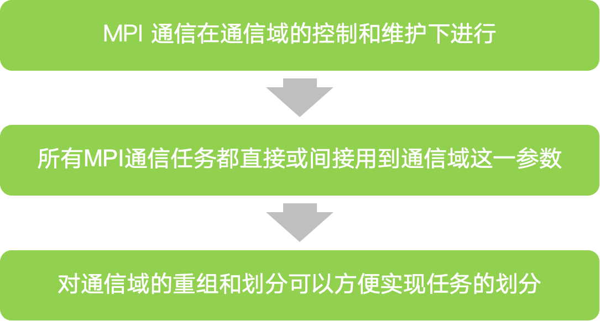
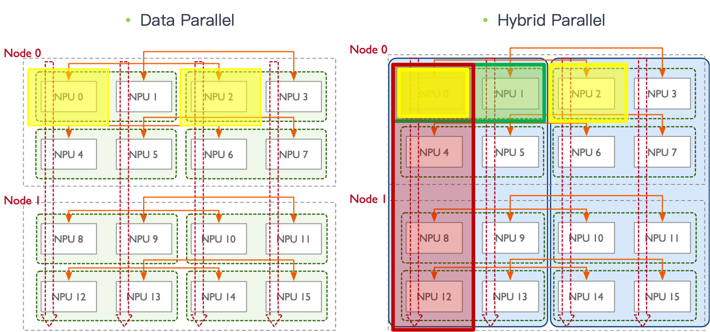
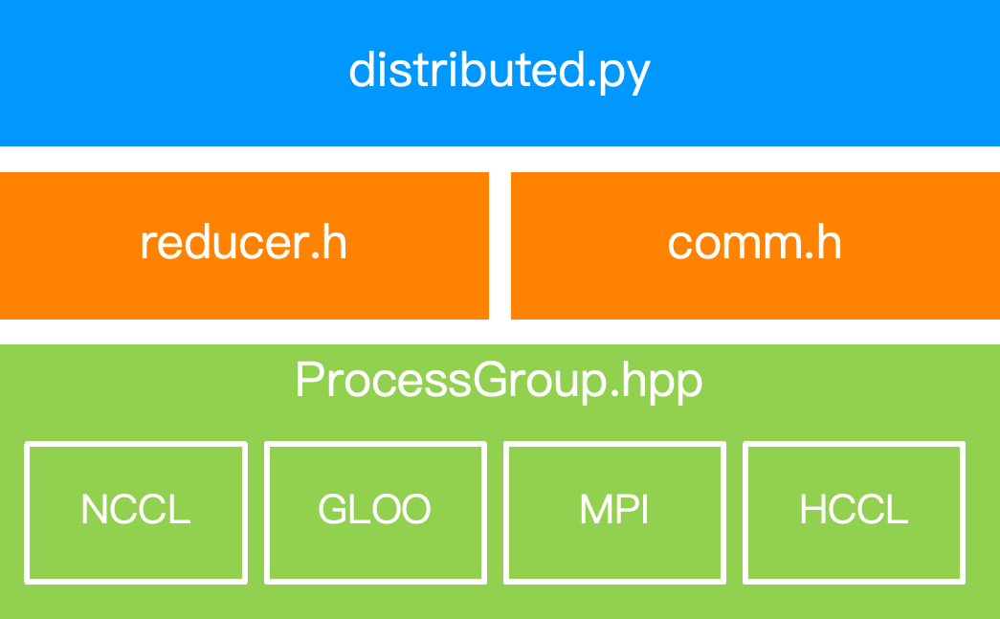
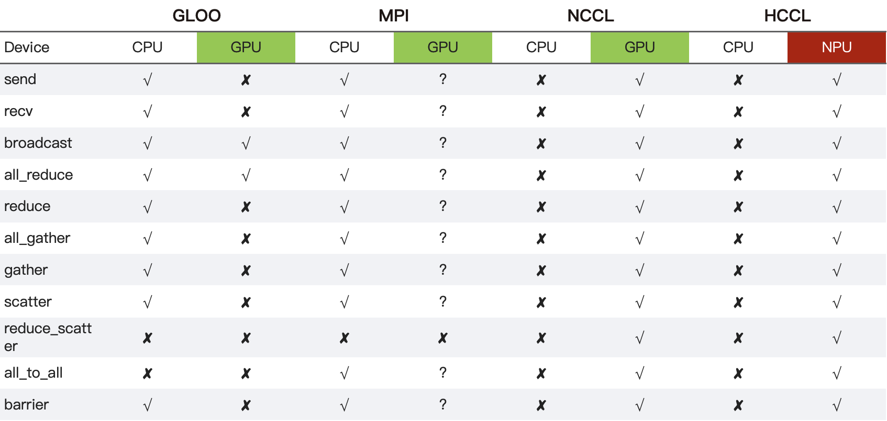
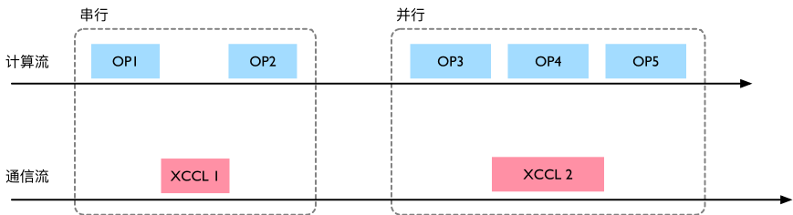
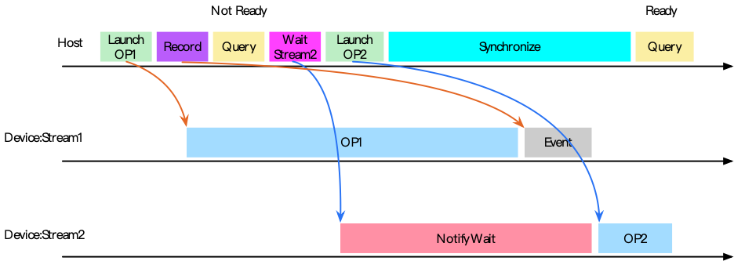
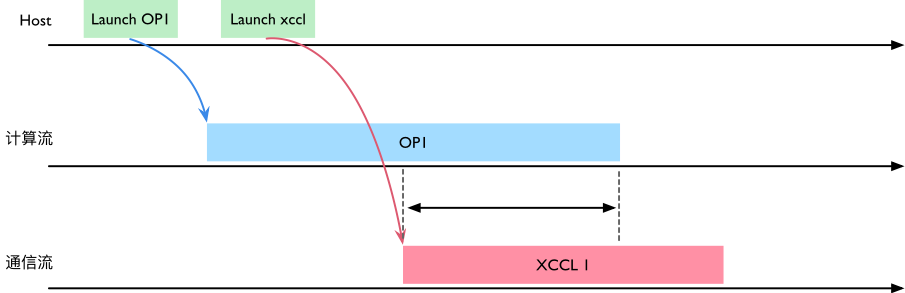
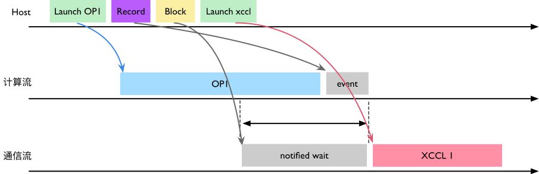
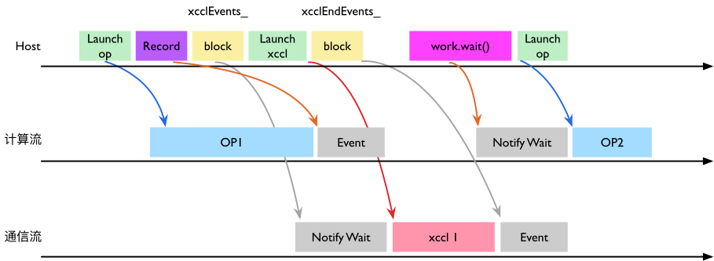

<!--Copyright © ZOMI 适用于[License](https://github.com/Infrasys-AI/AIInfra)版权许可-->

# 05.通信域与 PyTorch 实现

作者：SingularityKChen & 陈彦伯

本章的前四节介绍了集合通信的基本概念并介绍了一些常用通信原语和通信算法。在整个 AI 系统中，通信算法与通信原语位于较高抽象层级，主要面向分布式训练算法与 AI 模型设计者。在此之下，**通信域（Communicator）** 是一个重要的中间层次。它屏蔽了底层通信链路的硬件细节差异、集中维护集合通信的元信息，为上层算法实现和调用提供了诸多便利。本节首先从一个较高的视角概述通信域的原理与概念，之后以 PyTorch 为例了解其代码实现。

## 通信域

通信的本质是数据在处理单元之间的传输。我们不妨将 AI 系统类比为一个“污水处理厂”：如果输入数据是“污水”，那么服务器就是处理水的“工厂”，而计算单元（如 CPU、GPU 和 NPU 等）就是工厂中的“净化器”。多个工厂与净化器彼此之间通过水管相连，具备相应的拓扑结构，我们以此类比集合通信中的通信链路。多个工厂和净化器的同时作业就类似并行计算，只不过服务器和计算单元不像人一样懂得变通，他们需要清晰的指令，包括数据的处理方式与收发去向等。

基于上述类比，我们来看几个有关集合通信与通信域的重要概念。

- **节点（node）** 和 **rank**：集合通信中一般将一台服务器抽象为一个节点。一个节点下可能包含多个 rank，即服务器中搭载的多个计算单元。在并行计算任务中，每个节点和 rank 都会被赋予一个唯一的**全局 ID**，这是为了方便统一地指定数据的处理方式与收发去向。在每个节点中， ranks 还会被赋予一个 **local ID**，这是为了方便一些需要节点内互传的通信算法，如 Reduce、Gather 等。
- **进程（process）** 与**进程组（group）**：注意，进程与 ranks 之间并不是一一对应的关系。在复杂的 AI 训推任务中，计算单元会被动态地分配
- 上下文：由于
- **拓扑（topology）**：即节点、计算单元之间的链路信息。与上下文信息一样，通信域的拓扑信息一般由通信后端统一管理。

不了解集合通信的读者可能会提出一个很自然的问题：*为什么通信域里要维护这么多信息？* 这是因为当设备数量、网络拓扑等条件不同时，即便是同一个通信算法的具体实现也是不一样的。换句话说，通信域中所维护的信息是为了让上层封装（如下文会讲到的 `torch.distributed`）得以自动选择合适的算法实现。

**通信域（Communicator）**

1) 通信域、进程、进程组与 Rank 的关系；
2) 模型并行/数据并行/流水并行下的通信域划分；
3) PyTorch 如何通过 `torch.distributed` 调用 P2P 与集合通信原语；
4) 训练时“计算–通信”并行（overlap）的底层机制。

## 通信域、Rank、进程和进程组关系

!!!!!!!!!!!!!!!!
内容和几个技术点有点凌乱，再深入梳理下

### 通信域

通信域（Communicator）是 MPI 与深度学习分布式系统的核心抽象。**所有 MPI 通信都在通信域的控制与维护下进行**；**所有通信操作都会直接或间接接收通信域参数**；**对通信域的重组与划分能方便地完成任务划分**。

通信域包含 **上下文（context）**、**进程组（group）**和**虚拟拓扑（topology）**；其中**进程组**是一组要互相通信的进程集合，一个通信域对应一个进程组；同一进程可同时加入多个通信域，互不干扰。

### 进程、进程组与 Rank

<!-- - **进程（process）**：由 OS 管理，PID 唯一；同一进程可属于多个进程组。
- **进程组（group）**：参与同一通信域的一组进程；每个进程在组内有 **rank**（0…group_size-1）；
- **rank**：默认全局进程组（`WORLD`）的规模与序号；**local_rank** 是节点内 GPU/NPU 序号。 -->

### 并行方式与通信域

下图示意把一个模型在空间/深度两个维度切分：蓝色/黄色区域形成 **张量并行（TP）**；A/C/E/G 之间形成 **流水并行（PP）**。

在**TP 通信域**中， Node 0 中 Rank 0 （NPU 0）和 Rank 1 （NPU 1） 各自处于不同**进程**，二者在同一个**通信域**，组成一个**进程组**。

在**PP 通信域**中，NPU 0/4/8/12 形成一个进程组。

在**数据并行（DP）/模型并行（MP）** 时，还会额外形成跨节点的通信域。对应示意如下两图。

> 由此，一个 rank（例如 NPU0 对应的进程）常常**同时隶属于多个通信域**：
> - 与 NPU1 组成 **TP 域**；
> - 与 NPU2 组成 **DP 域**；
> - 与 NPU4/8/12 组成 **PP 域**。
> 这也是后续做 overlap 时需要仔细处理流与依赖的原因之一。

## PyTorch 通信调用

!!!!!!!!!!!!!!!!
这里是本篇的重点，应该自己去看看 PyTorch 的通信是怎么实现的，一定一定要自己去深入看代码，深入技术，不要在视频的表面，自己要做的比视频要更加深入

### 模块分层与调用路径

PyTorch 的分布式能力位于 `torch.distributed`
- 向上提供 **P2P** 与 **Collective** 两类 API
  - Point-2-Point Communication：提供 send 和 recv 语义，用于任务间通信；
  - Collective Communication：提供 scatter/broadcast/gather/reduce/all reduce/all gather 通信操作；
- 向下通过 **ProcessGroup** 适配 **NCCL / HCCL / Gloo / MPI** 等后端
  - 如下图所示，`distributed.py`依赖于 `reducer.h` 和 `comm.h` 相关 API 的封装，其基于 `ProcessGroup.hpp`的 NCCL/GLOO/MPI/HCCL 等后端通信库实现。
- 用户侧感知的核心是 `torch.nn.parallel.DistributedDataParallel (DDP)`；而底层通信库对接的是 `ProcessGroup` 层。

### 后端通信库的能力差异

- **Gloo（CPU）**：提供基础集合通信与 P2P，用于通用 CPU 环境；
- **MPI（CPU/GPU）**：语义覆盖较全；
- **NCCL（GPU）/HCCL（NPU）**：面向深度学习高带宽低延迟互联，重点覆盖 **AllReduce / AllGather / ReduceScatter / AllToAll / Broadcast / Barrier** 等训练常用原语。

### P2P Communication 操作

!!!!!!!!!!!!!!!!
代码不要截图，插入代码，然后解读

1) **初始化**：在每个进程中调用 `torch.distributed.init_process_group` 指定后端、`rank` 与 `world_size`，对分布式模块进行初始化。
2) **通信逻辑**：按 `rank_id` 分支业务；`dist.send()/dist.recv()` 为同步版本，`isend()/irecv()` 为异步版本。
3) **任务启动**：使用 `torch.multiprocessing` 启动多进程；`set_start_method('spawn')` 仅继承必要资源，便于跨进程安全初始化。

## PyTorch 的“计算–通信”并行

PyTorch 计算与通信并行的分析主要依赖一些 profile 工具。下面展示了一个 profile 的截图，其中可以看到每个时间点有哪些操作正在进行。

### Stream / Event 基础

- **Stream**：设备侧的异步命令队列；PyTorch 的**内存池与 Stream 绑定**，能把数据搬运与算子执行并行化，提高吞吐。
- **Event**：轻量级的时序/同步原语，可在 Stream 中记录标记点用于等待或测时。
PyTorch 通信与计算并行，主要通过 Stream（并行能力）与 Event（时序控制）这两个提供的底层能力来实现。

如下图所示，串行执行时是 OP1→XCCL1→OP2；并行化后，OP3 结束即可**同时**下发 XCCL2，计算流继续执行 OP4。

### 计算流之间的同步

Host 下发与 Device 执行是**异步**的：先 Record event，再在目标 Stream 上 Wait；必要时 Host 侧 `synchronize()` 阻塞直到 event 完成。下图给出了典型的时序与 Query 的 ready/not-ready 状态变化。

### 计算流与通信流的同步与内存池归属

!!!!!!!!!!!!!!!!
你真的懂了吗？

在 `ProcessGroupXCCL` 中，集合通信接口会经由 `ProcessGroupXCCL::collective()` 把实际的 XCCL 调用 FN 下发到 **通信流（xcclStreams）**。如下图所示，如果 OP1 的输出 Tensor 仍归属于**计算流的内存池**，会出现“OP1 写、XCCL1 读”的潜在竞争，需要在两条流之间建立事件依赖；需要用于通信的 Tensor，其内存应由对应 Stream 的内存池管理。

为解决上述异步问题，`collective()` 内部通过 **`syncStream()`**：在**计算流**上 Record event，并在**通信流**上执行 **notify/wait**，确保“先写后读”，消除并发读写问题。其时序图如下。

反向场景（通信→计算）则由 **`work.wait()`** 完成：`WorkXCCL::synchronizeStreams()` 在需要处进行 block，并依赖于通信流上 `xcclEndEvents_` 记录的事件来完成跨流同步。

> 小结：**解耦计算与通信**、并通过事件把两者“正确且尽早”地拼起来，是大模型训练中提升 MFU 的关键路径；这也是各类分布式加速库（Megatron-LM/DeepSpeed/ColossalAI 等）在框架层面做策略优化与异步调度的原因。

## 总结与思考

- **通信域—进程—进程组—Rank**：一对多映射，同一进程可加入多个通信域并行工作。
- **多维并行对应多个通信域**：TP/PP/DP/MP 交错存在，单个 rank 可能在多个域中承担不同职责。
- **PyTorch 分布式分层**：DDP（前端）→ ProcessGroup（抽象）→ NCCL/HCCL/Gloo/MPI（后端）。
- **集合通信后端能力差异**：不同后端在集合通信/设备支持上各有侧重，要结合硬件与网络选择。
- **PyTorch 计算–通信 overlap**：通过 Stream/Event，用 `syncStream()` 与 `work.wait()` 正确编排跨流依赖，减少串行等待。

## 本节视频

<html>
<iframe src="https://player.bilibili.com/player.html?aid=1155715743&bvid=BV1VZ421g7jY&cid=1582802300&page=1&as_wide=1&high_quality=1&danmaku=0&autoplay=0" width="100%" height="500" scrolling="no" border="0" frameborder="no" framespacing="0" allowfullscreen="true"></iframe>
</html>

## 参考资料

- [PyTorch Distributed Overview](https://pytorch.org/docs/stable/distributed.html)
- https://en.wikipedia.org/wiki/Mesh_networking
- https://en.wikipedia.org/wiki/NVLink#Service_software_and_programming