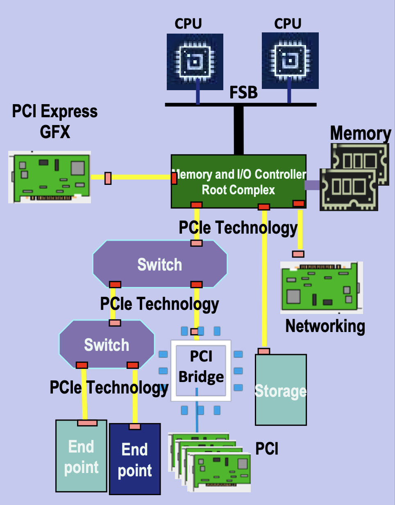
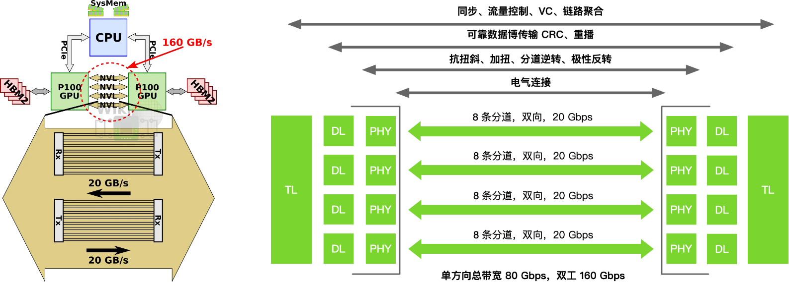
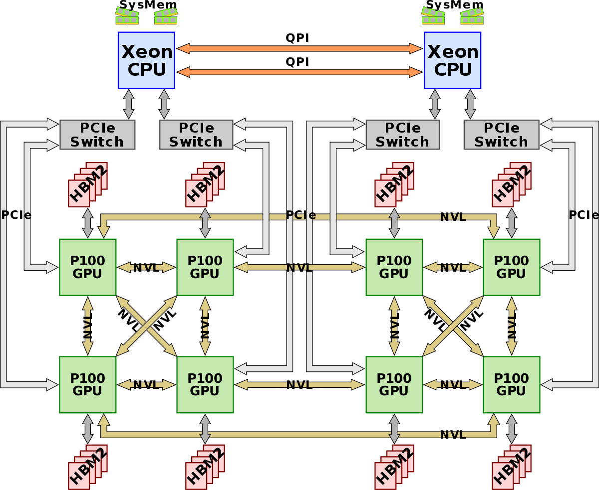
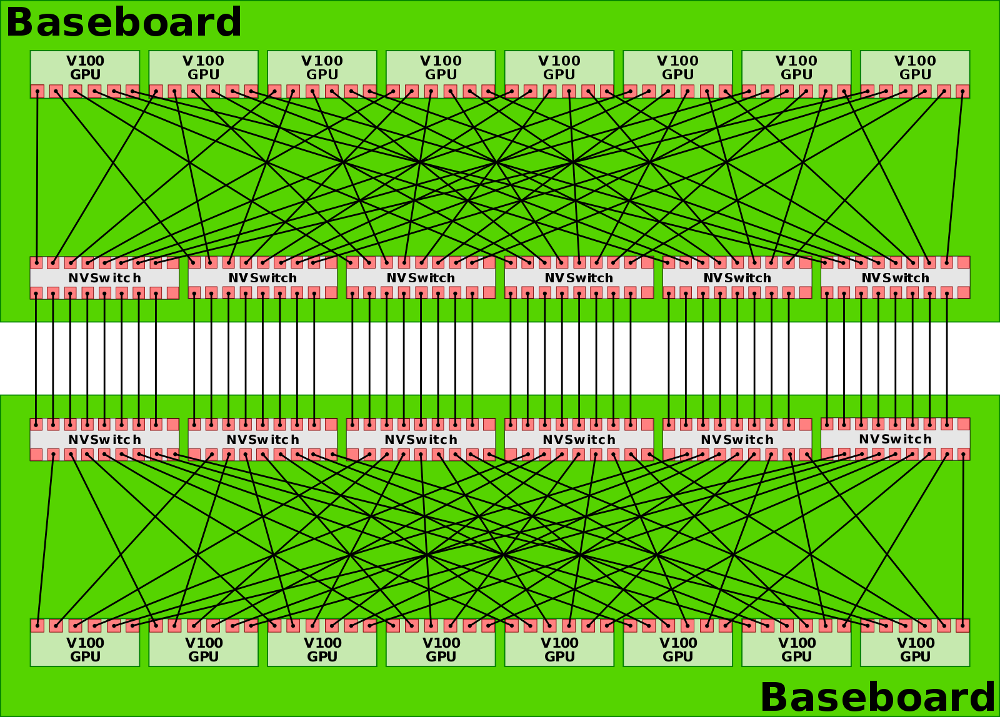
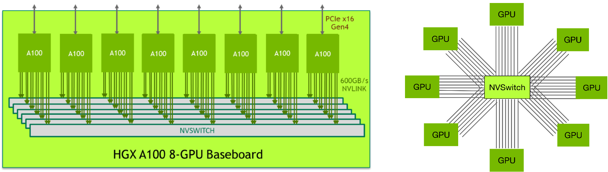
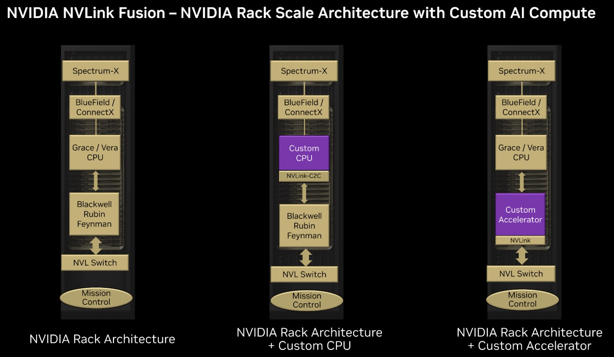

<!--Copyright © ZOMI 适用于[License](https://github.com/Infrasys-AI/AIInfra)版权许可-->

# 07.大模型集群互联技术

Author by: SingularityKChen

本章是集合通信的最后一个部分的内容，将介绍 XPU （GPU/NPU）卡间互联与 Scale-Up、节点间互联与 Scale-Out 的相关概念以及产业界 Scale-Up 和 Scale-Out 的诸多通信协议的纷争。

## Scale-Up 和 Scale-Out 的背景

大模型的参数从数十亿到数万亿级别，使得单机算力远不足以支撑训练和推理。这促使业界构建由数万卡乃至百万卡算力集群。

然而，随着算力芯片数量增加，通信开销迅速攀升，形成“通信墙”瓶颈：如果互联网络带宽和延迟跟不上，算力卡增加带来的加速比将大打折扣。

大模型训练需要数万算力芯片紧密协同，并行处理海量数据，这些算力卡间必须持续高速交换梯度、参数等数据；没有高性能互联架构，算力卡会因网络瓶颈而无法线性扩展性能。

为突破通信瓶颈，Scale-Up 与 Scale-Out 两种体系架构被结合运用： **Scale-Up（纵向扩展）** 指在单个超级节点/服务器内集成尽可能多的加速器，通过高速互联总线使其看似“一台机器”，减少节点内通信延迟； **Scale-Out（横向扩展）** 则通过集群网络将多台服务器相连，实现大规模扩容。传统上，HPC 领域更多采用 Scale-Out 的集群方式，但在大模型训练中，单节点内部署更多算力卡（Scale-Up）可以显著降低部分通信开销，从而提升整体效率。

因此，大模型训练集群往往由多算力卡超级节点（SuperPod）（如华为 CloudMatrix 384 超节点由 384 张 910C 芯片构成）通过高速网络互联组成，两种架构优势互补。

在这种背景下，各类互联技术迅猛发展，以满足大模型对低延迟、高带宽、强一致性通信的苛刻需求。

## XPU 卡间互联与 Scale-Up

### PCIe 诞生的背景

在上世纪 90 年代末，计算机 I/O 总线的发展遇到了瓶颈：传统 PCI（Peripheral Component Interconnect）总线采用并行架构，带宽在多设备共享下容易发生争用，而且随着频率提升，时钟同步和布线的复杂度急剧增加，PCI 2.0 最高 66 MHz 的频率仅能提供 533 MB/s 的带宽；与此同时，AGP（Accelerated Graphics Port）虽然为显卡带来了更高带宽，但它只服务于 GPU，无法统一所有 I/O 需求。

那时，行业亟需一种统一的高速点对点互联方式，为每个设备提供独立链路，避免带宽争用，同时利用串行化（SerDes）替代并行总线以便提升速率，并支持热插拔和可扩展的 lane 设计（x1/x4/x8/x16），从而在灵活性和扩展性上满足未来的发展需求。

当时，硬件基本上都是围绕 Intel x86 CPU 进行构建。为了能让计算机内部能够更好地传输数据，Intel 牵头设计了 PCIe 总线，在 2003 年推出 PCI Express (PCIe 1.0)，作为 PCI/AGP 的继任者。它采用高速串行点对点架构，可横向扩展 lane 数，逐渐成为统一的互联标准。

(image from [PCI-SIG®](https://pcisig.com/sites/default/files/files/30%20Years%20of%20PCI-SIG%20Innovation%20Webinar_Final%20Slides.pdf))

从 2003 年至今（2025 年），PCIe 已经发布了 7 个版本，带宽每三年增长一倍，已从 PCIe 1.0 最高双向 8 GB/s 跃升为 PCIe 7.0 512 GB/s。

(image from [PCI-SIG®](https://pcisig.com/sites/default/files/files/PCI-SIG%2025%20Anniversary%20Infographic.pdf))

按照这个趋势，PCIe 8.0/9.0/10.0 标准将会在 2028 年、2031 年和 2034 年公布，其带宽将会增加到最高 4 TB/s。

| PCI 版本     | 年份 | 传输速率 | 编码方式   | x1 单向带宽 | x16 双向总带宽 |
| ------------ | ---- | -------- | ---------- | ----------- | -------------- |
| **PCI**      | 1992 | 33 MHz   | 32b/34b    | 113 MB/s    | --             |
| **PCI 2.0**  | 1993 | 66 MHz   | 64b/66b    | 533 MB/s    | --             |
| **PCIe 1.0** | 2003 | 2.5 GT/s | 8b/10b     | 256 MB/s    | 8 GB/s         |
| **PCIe 2.0** | 2007 | 5.0 GT/s | 8b/10b     | 512 MB/s    | 16 GB/s        |
| **PCIe 3.0** | 2010 | 8.0 GT/s | 128b/130b  | 1 GB/s      | 32 GB/s        |
| **PCIe 4.0** | 2017 | 16 GT/s  | 128b/130b  | 2 GB/s      | 64 GB/s        |
| **PCIe 5.0** | 2019 | 32 GT/s  | 128b/130b  | 4 GB/s      | 128 GB/s       |
| **PCIe 6.0** | 2022 | 64 GT/s  | PAM4 + FEC | 8 GB/s      | 256 GB/s       |
| **PCIe 7.0** | 2025 | 128 GT/s | PAM4 + FEC | 16 GB/s     | 512 GB/s       |
| **PCIe 8.0** | 2028 | 256 GT/s | PAM16      | 32 GB/s     | 1 TB/s         |

### NVIDIA NVLink 诞生的背景

随着深度学习和高性能计算在 2010 年前后迅速发展，GPU 已经成为并行计算的核心加速器，但传统的 PCIe 互联逐渐暴露出带宽不足和延迟过高的问题。以 PCIe 3.0 为例，单向带宽仅约 16 GB/s（x16 通道），而当时 GPU 内部的显存带宽已超过数百 GB/s，GPU-GPU 之间的数据交换成为性能瓶颈。

为了解决这一矛盾，NVIDIA 在 2014 年首次公布了 NVLink，采用高速差分信号和多链路聚合的方式为 GPU 与 GPU、GPU 与 CPU 之间提供更高带宽、更低延迟的互联通道，其目标是突破 PCIe 的限制，把多 GPU 之间、GPU 与 CPU 之间做成更接近同一内存域的高带宽、低延迟互联，使多 GPU 系统能够像单 GPU 一样高效协同工作。

2016 年，Pascal P100 首次把 NVLink 带到量产平台，支持多条链路成组以叠加带宽，这一做法直接奠定了后续各代 NVLink 以更多链路和更快带宽扩展规模的路线图。

Volta 实现与 IBM POWER9 做到 GPU 与 CPU 直连，在当时的 Power 系统里绕开了 GPU 与 CPU 间的 PCIe 限速。

同时，首次亮相的 NVLink Switch 把多条 NVLink 聚合成非阻塞交叉互联，让 16 卡 V100 的 DGX-2 能在单机内实现全互联，这是 NVLink 从点对点走向交换网络的关键转折。

Ampere 时代引入第三代 NVLink，DGX A100 机内用 6 颗第二代 NVSwitch 把 8 卡 A100 做成全互联拓扑；这一代的变化不在更大的 GPU 域，而在更干净的机内全互联与更高端口速率的工程化落地。

NVLink 原本只用于机箱内部通信。2022 年，Hopper 实现跨机箱的域：推出 **NVLink Switch System**，把 NVLink 从机内/机箱级扩展到跨节点、跨机箱的域，可将多达 256 块 H100 组成一个 NVLink HBD（High Bandwidth Domain，超带宽域）。 英伟达将这种以超大带宽互联 16 卡以上 GPU-GPU 的 Scale Up 系统，称为超节点（SuperPod）。

与此同时，NVIDIA 也推出了**NVLink-C2C**，作为片间（die/package）一致性互联用于 Grace-Hopper 等超芯片（SuperChip）形态，把 CPU 大容量内存纳入可寻址空间，这两项共同把 NVLink 从机内总线升级为“机柜-级域内网络”的角色。

Blackwell 进入第五代 NVLink，NVL72 单柜把 72×Blackwell 组成一个超高带宽 NVLink 域、GPU 与 GPU 互通总带宽达 130 TB/s；单一 NVLink 域可扩展到 576 GPU 的上限。

2025 年，NVIDIA 面向产业推出“半定制”开放计划 NVLink Fusion，其将已量产的 NVLink 规模化 fabric 与参考设计、IP 及认证生态开放给第三方 CPU/ASIC/XPU，使其能原生接入 NVLink 的 Scale-Up 域并与 Spectrum-X 等以太 Scale-Out 方案协同，构建异构混合 AI 基础设施。

> NVLink 从“多链路点对点”的板间直连开始，经由 **NVSwitch** 完成机内全互联，再以 **NVLink Switch System** 扩展到跨机箱的 **域内网络**；期间通过 **NVLink-C2C** 把 CPU 的大容量内存纳入可寻址空间，最终 Blackwell 把 NVLink 域做成“机柜为基本单元、可拼成数百 GPU 的统一加速器”。这也是其从单机 Scale-Up 向“机柜级 Scale-Up”的关键跨越。

下表总结了 NVLink 从诞生至今的时间线、性能指标和对应的 GPU 型号：

| NVLink 代际 | 年份   | 单链路速率 | 最大链路数 | GPU 总带宽 | 对应 GPU 架构 / 型号 | NVSwitch 世代             | 关键改变 / 重新定位                                                                                 |
| ----------- | ------ | ---------- | ---------- | ---------- | -------------------- | ------------------------- | --------------------------------------------------------------------------------------------------- |
| NVLink 1    | 2016   | 20 GB/s    | 4          | 80 GB/s    | Pascal P100          | 无（仅点对点）            | 首次量产化；支持链路成组叠带宽，确立“多链路聚合”范式                                                |
| NVLink 2    | 2017   | 25 GB/s    | 6          | 300 GB/s   | Volta V100           | NVSwitch v1（实验性）     | 与 IBM POWER9 实现 CPU↔GPU 直连；NVSwitch 首秀，把 NVLink 从点对点扩展为交换网络                   |
| NVLink 3    | 2020   | 50 GB/s    | 12         | 600 GB/s   | Ampere A100          | NVSwitch v2，8 GPU 全互联 | 机内全互联工程化：6×NVSwitch 连接 8×A100，提升端口速率与拓扑整洁度                                  |
| NVLink 4    | 2022   | 100 GB/s   | 18         | 900 GB/s   | Hopper H100          | NVSwitch v3，256 GPU      | NVLink Switch System 把域扩展到跨节点/机箱，最多 256×H100；引入 NVLink-C2C 实现 CPU↔GPU 片间一致性 |
| NVLink 5    | 2024   | 200 GB/s   | 18         | 1.8 TB/s   | Blackwell B100       | NVSwitch v4，576 GPU      | 进入机柜级“单域”：NVL72 单柜 72 GPU、域内 130 TB/s，总规模可达 576 GPU                        |
| NVLink 6    | \~2026 | 400 GB/s\* | 18+        | 3.6 TB/s\* | Rubin（计划）        | NVSwitch v5（预期）       |                                                                                                     |
| NVLink 7    | \~2028 | 800 GB/s\* | 18+        | 7.2 TB/s\* | Vera（计划）         | NVSwitch v6（预期）       |                                                                                                     |

### Infinity Fabric Links：AMD 的追赶

AMD 的 Infinity Fabric（IF）是 AMD 于 2017 年随 Ryzen CPU 和 Vega GPU 推出的统一互连架构，用于取代早期的 HyperTransport 总线。与 HyperTransport 相比，Infinity Fabric 具有模块化、可扩展的设计，带来了更高带宽、更低延迟的互连，同时保持缓存一致性（即“Coherent Fabric”）。它还支持开放标准（如 CCIX）的耦合，以连接加速器和 FPGA。简而言之，Infinity Fabric 将 AMD 各个芯片组件（CPU 核心、GPU 单元、内存控制器等）融为一体，形成高度灵活的“乐高式”芯片拼接体系。

Infinity Fabric 分为**数据织构**和**控制织构**两部分，分别负责数据传输与控制信号，使得 AMD 可以在 CPU、GPU 等不同芯片间实现一致的通信协议。最初一代 Infinity Fabric 在 Zen 架构 CPU 内部连接多个 Core Complex（CCD）和 I/O Die，并在双路服务器中通过外部 GMI 链路实现 CPU-CPU 直连通信。这种外部全局内存互连（external Global Memory Interconnect，xGMI）是 Infinity Fabric 的扩展，用于连接多个物理芯片：例如，第二代及以后 AMD EPYC 服务器处理器支持多达 4 条 xGMI 链路，每条链路等效于 16 条 PCIe 通道，速率最高 32 Gb/s（PCIe 5.0 x16 带宽）。在双路 EPYC 系统中，xGMI 取代了早期 Opteron 处理器的 HyperTransport，实现更高速的 CPU 直连，可提供单向 36 GB/s 以上带宽。

AMD 也将 Infinity Fabric 技术运用到 GPU 直连通信上。2018 年发布的 Radeon Instinct MI50/MI60 数据中心 GPU 配备了 Infinity Fabric Link 接口，每块卡有两条 IF 链路，可将 4 块 GPU 组成一个直连的 GPU 组，实现 GPU 间的高速点对点通信。Infinity Fabric Link 的对等通信带宽约为每卡 200 GB/s（双向），比传统 PCIe 3.0 高出约 6 倍。此外，后续的 MI100、MI200 系列加速卡以及 MI300 APU 也延续了 Infinity Fabric 用于多芯片互连的理念。例如，MI250X GPU 采用双芯片设计，通过 Infinity Fabric 实现两颗 GPU 芯片间超过每秒数百 GB 的数据传输，提供统一的大容量 HBM 显存空间。这种架构类似于 NVIDIA NVLink Bridges 的作用，打通了 GPU 之间的内存访问通道。可以说，Infinity Fabric Link 使 AMD GPU 在节点内的互联能力大幅加强，但在节点规模上仍受限于有限的链路数量（如 MI60 时代单机支持两组各 4 卡直连）。为进一步扩展 GPU 互联规模，AMD 开始探索更大规模的互连方案。

随着大模型训练对 GPU 通信提出更高要求，AMD 意识到仅靠自有的 Infinity Fabric Link 难以匹敌 NVIDIA NVLink/NVSwitch 在大规模集群中的优势。因此，AMD 在 2023-2024 年与 Broadcom 展开合作，尝试在 Broadcom 的 PCIe 交换机（代号“Atlas”）上支持 Infinity Fabric（xGMI）协议，以实现 CPU 与 GPU 间具有内存语义的直连通信。这一设想相当于利用 PCIe 交换芯片作为桥梁，把多个 GPU 通过 xGMI 逻辑互联起来，从而突破单主机 GPU 数量限制。

2024 年 3 月，Broadcom 透露将在其下一代 PCIe Gen7 交换机（Atlas 4 系列）中支持 AMD 的加速器互连，实现**AFL（Accelerated Fabric Link）**技术，将 Infinity Fabric/xGMI 扩展到交换架构上。AFL 本质上是让 PCIe 物理链路承载 Infinity Fabric 协议，从而构建类似 NVIDIA NVSwitch 的 GPU 直连网络。这标志着 AMD 正积极开放其互连技术，寻求业界合作以建立开放标准。

### UALink: 反 NVLink 联盟的攻击

在尝试通过 PCIe 交换机扩展 Infinity Fabric 之后，AMD 和 Broadcom 意识到需要一种更精简、高效的专用互连协议，以正面挑战 NVIDIA 的封闭生态。

2024 年 5 月，AMD 与 Broadcom 联合 Cisco、谷歌、HPE、Intel、Meta、Microsoft 等共同发起 Ultra Accelerator Link (UALink) 联盟，目标是打造一个开放的加速器直连通信标准。AMD 将多年积累的 Infinity Fabric 协议贡献给联盟作为基础，联盟成员一起对 PCIe 协议栈进行了简化裁剪，去除所有不必要的冗余，以加速 GPU 间的直接通信。UALink 由此诞生——它并非简单套用 PCIe 或以太网，而是全新设计的数据层和传输层协议，结合了 PCIe 6.0 的一些低延迟特性和以太网 PHY 的成熟 SerDes 技术。正如联盟成员所言，UALink 可以看作**具有以太网 SerDes 的 PCIe 交换机**，兼具 PCIe 交换机的低延迟、低功耗、小芯片面积优势，以及以太高速物理层的带宽和距离优势。这种组合看起来会比 PCIe 上的 CXL 更好，作为在这些加速器上创建 NUMA 域的一种方式，并且将与 NVIDIA 当前和未来提供的 NVSwitch 内存结构不相上下。

UALink 联盟于 2025 年 4 月正式发布了 UALink 200G 1.0 规范。根据规范，UALink 采用经过修改的 IEEE 802.3dj 标准以太网 SerDes 作为物理层，每通道速率 212.5 GT/s，扣除编码开销后有效速率为 200 Gb/s。链路支持**内存语义的 load/store 和原子操作**，专为加速器直接共享内存而优化，其具有高带宽、大扩展规模、低延迟和安全的特性。

UALink 的每条 Lane 提供 200 Gb/s 带宽，可组成 x1、x2 或 x4 链路；4 条 lane 聚合构成一个端口（Station），单端口双向带宽最高可达 800 Gb/s（约合 1.6 Tb/s）。多端口还可进一步聚合，提升单设备带宽上限，远超现有 PCIe/CXL 通道能力。其支持在单级交换结构下连接最多 1024 个加速器节点（GPU/NPUs），统一在一个共享内存域中。UALink 的大规模特性意味着有望将统一内存互联拓展到机架乃至整柜级别。

UALink 链路层借鉴了 PCIe 6.0 的改进，引入流水线 FEC 与 CRC 结合的纠错机制，避免传统强 FEC 导致的高延迟。演示结果显示，UALink 交换芯片端口到端口跳数延迟可控制在 100 ns 以下。相比之下，PCIe 交换机端口延迟根据厂商和规模约为 70~250 ns，以太网交换机普遍在数百纳秒到毫秒级，InfiniBand 交换机约 100~120 ns。虽然联盟规范并未强制具体延迟上限，但 AMD UALink 联合负责人 Kutis Bowman 表示 100~150 ns 的交换延迟是“合适”的目标范围。

UALink 采用 680 字节 flit（流控制单元）作为链路传输的基本单位，并取消了 PCIe 中严格的全局顺序要求，仅在 256B 边界内保持顺序，从而提升流水线效率。此外，规范定义了 UALinkSec 安全机制，对链路中的请求、读写数据进行可选加密和完整性校验，防范物理层窃听或篡改。

UALink 瞄准的正是 NVIDIA 封闭的 NVLink/NVSwitch 体系，因而在架构上有不少针对性设计。比如，NVLink 4 使用 x2 双 lane 组成一个端口，而 UALink 允许 x1/x2/x4 灵活配置端口宽度，并支持像 NVSwitch 一样聚合多端口以提高吞吐。在带宽方面，UALink 单端口 800 Gb/s 已相当于 NVLink 5 双向带宽的水平，且支持更多端口聚合。更重要的是，UALink 作为开放标准，允许多家厂商实现专用的 UA Switch 芯片。这意味着类似 Astera Labs、Marvell、Microchip 等都可能推出 UALink Switch，不局限于某一家供应商，从而有望降低成本和功耗。联盟声称 UALink 交换芯片的功耗和面积仅为等效以太网 ASIC 的 1/2 到 1/3，每加速器节点可节省 150~200 瓦功耗。如果 UALink 也能让 AMD、Intel 等厂商的 GPU/NPUs 组成 NVSwitch 级别的大规模加速阵列，将大幅推动 AI 系统的互联创新，业界寄望它能打破 NVIDIA 的算力互联垄断。

UALink 1.0 规范发布后，各成员正加紧开发对应产品。相比以往标准发布后两年见硅的节奏，这次由于需求迫切，12~18 个月内就会有 UALink 商用芯片问世。不过，开放标准的推进也面临一定挑战。一方面，NVIDIA 迅速回应：2025 年 9 月，NVIDIA 宣布了 NVLink Fusion 计划，与 Intel 合作将 NVLink 高速互连开放给 x86 平台。Intel 将为 NVIDIA 定制生产带 NVLink 端口的 Xeon CPU，并允许第三方 AI 芯片通过 NVLink Fusion 与 Xeon 连接。这被视为 NVIDIA 策略性开放以固守生态的举措。另一方面，联盟内部利益分歧也浮现：Broadcom 由于担忧开放直连削弱其 PCIe 交换机业务（UALink 采用以太 SerDes、减少了服务器内 GPU 经 PCIe 交换的需求），已从 UALink 董事会退出。如果 UALink 获得广泛支持并成功商用，将为 AMD 等厂商的 GPU/加速卡构建大规模统一内存池提供可能性，促进 AI 集群架构的开放创新。

### 华为灵渠总线

华为同样在探索面向大模型训练的超大规模算力互联技术。由于传统计算架构难以满足 AI 时代需求，华为在 2021 年便提出**设计对等**架构，通过灵衢总线让 GPU、NPU 等硬件协同工作，从单机扩展到数据中心级集群。这一思路在经历数年研发后，在 2025 年华为全联接大会上，华为发布了全新的超节点互联协议灵衢 (UnifiedBus，UB)，并宣布将开放灵衢 2.0 技术规范，构建开放生态。

华为的首代灵衢总线（UB 1.0）已在 Atlas 900 超节点 集群中获得验证。Atlas 900 是华为面向 AI 训练的高密度计算集群，早在 2019 年曾以 1024 颗昇腾 910 芯片的规模创下 ResNet 训练最快纪录。进入 2025 年，华为基于灵衢 1.0 打造了新一代 Atlas 900 超节点（CloudMatrix 384），单机柜支持 384 张昇腾加速卡，并于 2025 年 3 月开始交付商业部署。灵衢总线在 Atlas 900 上实现了单柜内多板协同，为 GPU/NPU 提供统一互联。此外，灵衢 1.0 还支持 CPU 与 NPU 间的直连，突破传统 CPU-加速器架构瓶颈。

在灵衢 1.0 基础上，华为迅速改进推出灵衢 2.0，进一步完善协议、优化性能并提升可扩展规模。2025 年 9 月，华为发布了基于灵衢 2.0 的新一代超节点 Atlas 950 SuperPod（支持 8192 张昇腾卡）和 Atlas 960 SuperPod（支持 15,488 张卡）的产品，并构建了由 64 个 Atlas 950 超节点互联组成的 Atlas 950 SuperCluster 集群，整体连接 52 万多张 Ascend 950 加速卡，FP8 算力高达 524 EFLOPS。这是目前全球算力规模最大的 AI 集群之一。相比之下，NVIDIA 计划 2026 年推出的 NVL144 超节点（144 卡）在规模上远小于 Atlas 950。灵衢总线在如此庞大系统中，实现了跨机柜的统一互联和全局内存访问。

灵衢 (UB) 总线的设计核心是在长距离、高可靠与大带宽、低时延之间取得平衡。为此，华为在多方面进行了创新。

灵衢协议内建了纳秒级故障检测和保护切换机制，可在亚微秒内感知链路故障并迅速冗余切换。同时，华为重新定义了光模块和互联芯片，使其既能支持远距离多机柜互联，又满足电信级可靠性要求。这解决了以往电互联距离短、光互联可靠性不足的难题，使多柜级互联成为可能。

灵衢总线采用多端口聚合和高密度封装技术，提升单节点带宽，并通过平等架构与统一协议降低通信栈开销。Atlas 950 超节点实现了 2.1 μs 的跨节点延迟，比业界最好水平 3 μs 进一步降低 24%。在互联拓扑上，灵衢 2.0 引入了 UB-Mesh 递归直连架构：机柜内采用二维全互联（2D-FullMesh），直接连通 64 卡内所有节点；机柜间通过一层 UB Switch 交换机相连，可线性扩展至 8192 卡无阻塞全互联。这一 nD-FullMesh 拓扑优先就近直连，最大限度减少数据跨越距离和交换跳数，在保证性能的同时控制成本。若需要更大规模，UB 还支持多级交换级联，以及通过 UBoE（UB over Ethernet）与以太网交换机互联或 OCS 光路交换，实现 >8192 卡 的灵活扩展。

UBoE 模式下，灵衢协议封装在以太网上传输，使现有数据中心以太网设施也能参与 UB 组网。相比传统 RoCE 方案，UBoE 进一步降低了静态时延、提高可靠性，并减少所需交换机和光模块数量。据华为数据，构建相同规模集群，采用 RoCE 需约 4.5 万台交换机和 300 万光模块，而 UBoE 仅需 3.9 万交换机和 222 万光模块，显著节省基础设施。

华为对灵衢总线寄予厚望，认为“超节点+集群”架构将成为新型算力基础设施，实现像单机一样调度上百万加速卡。华为已宣布开放灵衢 2.0 规范，邀请产业伙伴基于该总线开发产品，共建开放生态。这意味着灵衢有可能成为中国主导的算力互连标准。在 2025 年 8 月的 Hot Chips 大会上，华为分享了 UB-Mesh 架构细节，并表示将在稍后开源该协议，实现社区共建。

灵衢与前述的 UALink 一样，体现了业界追求开放通用加速器互连的潮流：前者侧重超大规模 AI 集群的整体架构设计，后者侧重标准化的链路/交换规范，二者共同指向一个没有封闭壁垒的大算力互联未来。

### Scale-Up fabric 与其他 Scale-Up 协议

Scale-Up 的 fabric 首先要在一个受限物理域里，把几十到上千个加速器组织成统一的计算与内存池。这要求链路具备内存语义（load/store、原子操作）以支撑直接访存，而不是仅靠消息传递；并要求在端到端极低时延下提供有序或可选无序的可靠传输与无损链路（链路层重传或 PFC/CBFC），以保证同步与集合通信的确定性。

除了 NVLink 之前，目前业内还有 ETH-X、OISA、SUE、UALink、UB 等协议。

## 节点间互联与 Scale-Out

Broadcom 在 2025 年 4 月的 OCP 全球峰会上发布了 SUE，以解决标准以太网在横向扩展方面的问题。

## 本节视频

<html>
<iframe src="https://player.bilibili.com/player.html?aid=1356081426&bvid=BV1Wz421q7SV&cid=1602896751&page=1&as_wide=1&high_quality=1&danmaku=0&autoplay=0" width="100%" height="500" scrolling="no" border="0" frameborder="no" framespacing="0" allowfullscreen="true"></iframe>
</html>

## 引用

- [NVLink - NVIDIA - WikiChip](https://en.wikichip.org/wiki/nvidia/nvlink)
- [Scale-up fabrics](https://blog.apnic.net/2025/06/03/scale-up-fabrics/)
- [Integrating Semi-Custom Compute into Rack-Scale Architecture with NVIDIA NVLink Fusion](https://developer.nvidia.com/blog/integrating-custom-compute-into-rack-scale-architecture-with-nvidia-nvlink-fusion)
- [一文看懂英伟达的 NVLink 技术, 鲜枣课堂, 20250520](https://mp.weixin.qq.com/s/gkm23FxWCTR4UFZYJ3onEw?poc_token=HGKQLmijVfsZp_r8vUDpiC8N_5C0mhuAhZV9LXx2)
- [The Path Is Set For PCI-Express 7.0 In 2025](https://www.nextplatform.com/2022/06/23/the-path-is-set-for-pci-express-7-0-in-2025/)