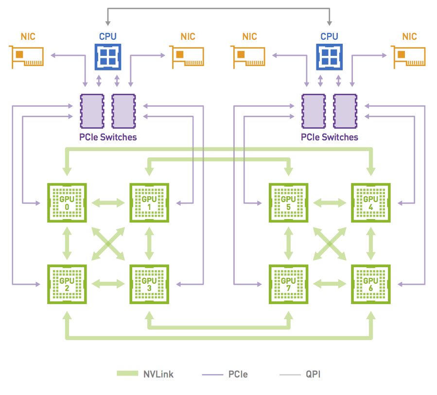

# NCCL API 解读

Author by: 刘军

当前使用英伟达 GPU 训练大模型时，PyTorch 等  AI 框架都集成了 NCCL，本节主要介绍如何使用 NCCL 的 API。本节将从六个方面来讲解 NCCL 的相关 API，具体包括 Communicator 生命周期、错误处理和终止、通信容错、集合通信、组间调用和点对点通信。

## NCCL 基本概念

NCCL 是一个通信库，为高性能应用程序提供优化的 GPU 与 GPU 通信。与 MPI 不同，它不提供包含进程启动器和管理器的并行环境。CPU、GPU/NPU 作为最基本的物理设备，再往上是 PCIe、CXL、RoCE 等链路层，然后使用 Ring 或者 Tree 进行拓扑组网，在一定拓扑的基础上有负责数据传输的通信库，集合通信库 NCCL，HCCL 会向上提供通信相关 API，相关 API 会集成在相关分布式加速库或者 AI 框架中。



NCCL 在通信方面发挥着重要的作用：

+ 1 NCCL 可以在多个 GPU 间进行通信，同时 NCCL 支持与 CUDA 流（Streams）集成，实现异步通信和并行计算；

+ 2 在分布式计算中，同步（Synchronization）是至关重要，NCCL 提供各种同步原语，比如使用 barrier 同步，以确保进程在执行集合通信时保持一致的状态；

+ 3 完成通信的性能优化（Performance Optimization），提供集体通信合并、数据传输批量处理、信道拆分、数据拆分、通信与计算并行等优化的方式；

+ 4 NCCL 支持多种集合通信操作（Collective Operations），可以在多个 GPU 或节点间进行数据同步和合并。包括广播（Broadcast）、规约（Reduction）、聚合（Aggregation）、AllReduce、AllGather 等；

+ 5 NCCL 中进程 表示参与通信的计算节点，进程可以组织成组 ，以便在组内进行集合通信；

+ 6 通信者（Communicators）指定参与通信的进程组和具体的通信操作，其定义了一组能够互相发消息的进程，进程中每个进程会被分配一个序号，称作 Rank，进程间显性地通过指定 Rank 来进行通信。

更多详细内容可以参考相关开源实现（[https://github.com/NVIDIA/nccl](https://github.com/NVIDIA/nccl)）。

## Communicator 的生命周期

创建单个 Communicator 时需要先使用 `ncclUniqueId` 为每个 CUDA 设备指定一个 unique rank，然后可以创建 communicator 对象，每个 comminutor 关联固定的 Rank。

同时在创建过程中，使用 `ncclGetUniqueId()` 创建 unique ID，通过广播的方式发送给所有相关线程和进程，Unique ID 被所有进程和线程共享，让他们进行同步。

```c
ncclResult_t ncclCommInitAll(ncclComm_t* comm, int ndev, constint* devlist) {

    //为每个 CUDA 设备指定一个 unique rank
    ncclUniqueId Id;

    //创建 uniqueId，广播给所有相关线程和进程
    ncclGetUniqueId(&Id);
    ncclGroupStart();

    for (int i = 0; i < ndev; i++) {
        cudaSetDevice(devlist[i]);
        //创建 communicator 对象，每个 comminutor 关联固定的 rank
        //uniqueId 被所有进程和线程共享，让它们进行同步
        ncclCommInitRank(comm + i, ndev, Id, i);
  }

  ncclGroupEnd();

}
```

同时也支持创建多个 Communicator，使用 ncclCommSplit 对已有 Communicator 进行划分，将其划分成多个 sub-partitions。也可以通过 `ncclCommCount` 复制一个现有的 Communicator，创建一个拥有更少的 ranks 的单个 communitor。

```c
int rank;
ncclCommUserRank(comm, &rank);
ncclCommSplit(comm, 0, rank, &newcomm, NULL);
```

也可以将 Communicator 分成两个：

```c
int rank, nranks;
ncclCommUserRank(comm, &rank);
ncclCommCount(comm, &nranks);
ncclCommSplit(comm, rank/(nranks/2), rank%(nranks/2), &newcomm, NULL);
```

函数需要原始 communicator 中所有 ranks 一起调用，即便是某些 rank 将不再是这个 communicator 一部分，也需要将 color 参数设置为 `NCCL_SPLIT_NOCOLOR` 来调用。这将创建一个仅具有前 2 个等级的通信器：

```c
int rank;
ncclCommUserRank(comm, &rank);
ncclCommSplit(comm, rank < 2 ? 0: NCCL_SPLIT_NOCOLOR, rank, &newcomm, NULL);
```

需要注意的是，在使用多个 NCCL Communicator 时需要注意同步，否则会造成死锁。NCCL kernel 会因为等待数据到来而阻塞，在此期间任何 CUDA 操作都会导致设备同步，意味着需要等待所有的 NCCL kernel 完成。NCCL kernel 在等待数据到来期间如果有任何 CUDA operation 进入了队列就会导致死锁，因为 NCCL 也会执行 CUDA 调用，而 NCCL 的 CUDA 调用会进入队列中等待前一个 CUDA 操作执行完毕。

在完成通信之后，`ncclCommFinalize` 会把一个 communicator 从 `ncclSuccess` 状态转变为 `ncclInProgress` 状态，开始完成 background 中的各种操作并与其他 ranks 之间进行同步。

`ncclCommFinalize`会将所有未完成的操作以及与该 communicator 所属的网络相关的资源会被 flushed 并被释放掉。一旦所有的 NCCL 操作都完成了，communicator 会将状态转换成 ncclSuccess，可以通过 `ncclCommGetAsyncError`来查询状态。

```c
ncclResult_t ncclCommFinalize(ncclComm_t comm)
```

一个 Communicator 被 Finalize 之后，下一步就是释放掉它所拥有的全部资源，包括它自己也会被释放。`ncclCommDestroy`函数会释放掉一个 Communicator 的本地所属资源。

调用 `ncclCommDestroy` 时候如果对应的 Communicator 的状态是 ncclSuccess，那么可以保证这个调用是非阻塞，否则这个调用可能会被阻塞。会释放掉一个 Communicator 的所有资源然后返回，对应的 Communicator 也不能再被使用。

```c
ncclResult_t ncclCommDestroy(ncclComm_t comm)
```

## Error handling 错误处理

在实际通信过程中，往往要处理很多错误告警，NCCL 也提供了相关 API，很多其它通信库也专门针对 error 进行了相关定制化场景的处理，本小节主要讲解 NCCL 如何处理相关 error。

所有的 NCCL 调用都会返回一个 NCCL 错误码（error code），如果某个 NCCL 调用返回的 error code 不是 ncclSuccess 或者 ncclInternalError，并且 NCCL_DEBUG 设置为 WARN，NCCL 会打印出 human-readable 的信息来解释内部发生了什么导致该错误的发生。如果 NCCL_DEBUG 设置为 INFO，NCCL 也会打印出导致该错误的调用栈，以便帮助用户定位和修复问题。

```c
int ncclStreamSynchronize(cudaStream_t stream, ncclComm_t comm) {
  cudaError_t cudaErr;
  ncclResult_t ncclErr, ncclAsyncErr;

  while (1) {
   cudaErr = cudaStreamQuery(stream);
   if (cudaErr == cudaSuccess)
     return 0;

   if (cudaErr != cudaErrorNotReady) {
     printf("CUDA Error : cudaStreamQuery returned %d\n", cudaErr);
     return 1;
   }

   ncclErr = ncclCommGetAsyncError(comm, &ncclAsyncErr);

   if (ncclErr != ncclSuccess) {
     printf("NCCL Error : ncclCommGetAsyncError returned %d\n", ncclErr);
     return 1;
   }

   if (ncclAsyncErr != ncclSuccess) {
     // An asynchronous error happened. Stop the operation and destroy
     // the communicator
     ncclErr = ncclCommAbort(comm);

     if (ncclErr != ncclSuccess)
       printf("NCCL Error : ncclCommDestroy returned %d\n", ncclErr);
    // Caller may abort or try to create a new communicator.
     return 2;
   }

   // We might want to let other threads (including NCCL threads) use the CPU.
   sched_yield();
  }
}
```

## Fault Tolerance 容错

NCC 提供了许多特性来让我们的应用从严重的错误中恢复到正常，比如网络连接失败、节点宕机以及进程挂掉等。当这样的错误发生的时候，应用应该能够调用 `ncclCommAbort` 方法来释放相应的 `communicator` 的资源，然后创建一个新的 communicator 继续之前的任务。为了保证 `ncclCommAbout` 能够在任何时间点被调用，所有的 NCCL 调用都可以是非阻塞（异步）的操作。

为了正确的弃用，当一个 communicator 中任何一个 rank 出错了的时候，所有其他的 rank 都需要调用 `ncclCommAbort` 来启用它们自己的 NCCL communicator。用户可以实现方法来决定什么时候以及是否弃用这些 communicator 并重新开始当前的 NCCL 操作。

```c
bool globalFlag;
bool abortFlag =false;
ncclConfig_t config = NCCL_CONFIG_INITIALIZER;

/* set communicator as nonblocking */
config.blocking =0;
CHECK(ncclCommInitRankConfig(&comm, nRanks, id, myRank, &config));

do {
  CHECK(ncclCommGetAsyncError(comm,&state));
} while(state == ncclInProgress && checkTimeout() != true);

if (checkTimeout() == true || state != ncclSuccess) abortFlag = true;

/* sync abortFlag among all healthy ranks. */
reportErrorGlobally(abortFlag, &globalFlag);

if (globalFlag) {
  /* time is out or initialization failed: every rank needs to abort and restart. */
  ncclCommAbort(comm);
  /* restart NCCL; this is a user implemented function, it might include
   * resource cleanup and ncclCommInitRankConfig() to create new communicators. */
  restartNCCL(&comm);
}

/* nonblocking communicator split. */
CHECK(ncclCommSplit(comm, color, key, &childComm, &config));

do {
  CHECK(ncclCommGetAsyncError(comm, &state));
} while(state == ncclInProgress && checkTimeout() != true);

if (checkTimeout() == true || state != ncclSuccess) abortFlag = true;

/* sync abortFlag among all healthy ranks. */
reportErrorGlobally(abortFlag, &globalFlag);

if (globalFlag) {
  ncclCommAbort(comm);
  /* if chilComm is not NCCL_COMM_NULL, user should abort child communicator
   * here as well for resource reclamation. */
  if (childComm != NCCL_COMM_NULL) 
    ncclCommAbort(childComm);

  restartNCCL(&comm);
}
/* application workload */
```

## 集合通信 Collective Operations

集体操作（Collective Operation）需要被每个 rank 都调用，从而形成一次集体的操作。如果失败的话可能会导致其他 rank 陷入无尽的等待。可以参考 NCCL 官方文档提供的相关 API，NCCL 的集合通信函数是分布式训练的核心。`AllReduce`实现全局同步，`Broadcast`用于数据分发，`Reduce`实现中心化聚合，`AllGather`汇聚所有数据，`ReduceScatter`则融合归约与块分发。

理解其语义和原位操作条件，是构建高效多 GPU 应用的基础。开发者需根据同步需求（全局同步/中心收集/数据分发）和显存布局选择合适的原语。在分布式深度学习训练中，多 GPU 间高效的数据同步至关重要。NVIDIA 的 NCCL 库为此提供了高性能的集合通信原语，接下来解析其核心函数。

### 全局归约 (ncclAllReduce)

所有参与 GPU 将各自 `sendbuff`中的数据，使用指定操作（如求和 `ncclSum`）进行**全局归约**，并将**最终相同的结果**复制到各自的 `recvbuff`中。可以实现高效的全局同步（如梯度汇总），当 `sendbuff == recvbuff` 时触发。

```c
ncclResult_t ncclAllReduce(const void* sendbuff, void* recvbuff, 
            size_t count, ncclDataType_t datatype, 
            ncclRedOp_t op, ncclComm_t comm, cudaStream_t stream)

```

### 广播 (ncclBroadcast / ncclBcast)

由指定的 `root` GPU 将其 `sendbuff`中的数据**完整复制**到所有 GPU（包括自身）的 `recvbuff`中。 用于分发初始数据（如模型权重）。

```c
ncclResult_t ncclBroadcast(const void* sendbuff, void* recvbuff,
        size_t count, ncclDataType_t datatype, int root, 
        ncclComm_t comm, cudaStream_t stream)
```

```c
ncclResult_t ncclBcast(void* buff, size_t count, ncclDataType_t datatype,
        int root, ncclComm_t comm, cudaStream_t stream)
```

### 归约 (ncclReduce)

所有 GPU 将各自 `sendbuff`中的数据，使用指定操作进行**归约**，但**仅将最终结果**存放到指定 `root` GPU 的 `recvbuff`中，其他 GPU 的 `recvbuff`被忽略。中心化收集计算结果。当 `sendbuff == recvbuff` 时触发（仅在 root 上有意义）。

```c
ncclResult_t ncclReduce(const void* sendbuff, void* recvbuff,
        size_t count, ncclDataType_t datatype, ncclRedOp_t op,
        int root, ncclComm_t comm, cudaStream_t stream)
```

### 全收集 (ncclAllGather)

每个 GPU 提供长度为 `sendcount`的数据块。所有 GPU 将这些块**按 GPU 序号拼接**成一个完整的大数据块（总长度 = `GPU 数量 * sendcount`），并将这个**完整拼接结果**存放到各自的 `recvbuff`中。 汇聚所有 GPU 的局部数据（如收集嵌入向量）。当 `sendbuff == recvbuff + rank * sendcount` 时触发（需严格满足内存偏移）。

```c
ncclResult_t ncclAllGather(const void* sendbuff, void* recvbuff,
        size_t sendcount, ncclDataType_t datatype,
        ncclComm_t comm, cudaStream_t stream)
```

### 归约散播 (ncclReduceScatter)

每个 GPU 提供一个**大输入数组** `sendbuff`（长度 = `GPU 数量 * recvcount`）。首先按元素位置对所有 GPU 的 `sendbuff`进行**归约**（例如，所有 GPU 的第 0 个 `recvcount`块归约在一起，第 1 个块归约在一起...），然后每个 GPU**只接收**归约后结果中对应于自己序号的那一块（长度为 `recvcount`），存放到 `recvbuff`中。融合归约与数据分发，常见于模型并行。当 recvbuff == sendbuff + rank * recvcount 时触发（需严格满足内存偏移）。

```c

ncclResult_t ncclReduceScatter(const void* sendbuff, void* recvbuff,
        size_t recvcount, ncclDataType_t datatype,
        ncclRedOp_t op, ncclComm_t comm, cudaStream_t stream)

```

在使用相关 API 时需要注意以下几点要求：

1.多数函数支持输入输出缓冲区重叠（`sendbuff`和 `recvbuff`指向相同或特定偏移的内存），节省显存但需严格满足条件。

2.所有操作均关联 `cudaStream_t`，确保与 CUDA 内核执行的正确同步。

3.调用者需确保缓冲区（`sendbuff`, `recvbuff`）已正确分配且在 GPU 显存上。

4.`AllGather`和 `ReduceScatter`对输入/输出缓冲区大小有明确要求（`nranks * sendcount/recvcount`），需严格遵守。

## NCCL 组操作原理解析

在并行计算中，CPU 线程阻塞会严重影响效率，NCCL 的**组操作原语** (`ncclGroupStart`/`ncclGroupEnd`) 提供了关键的非阻塞协作机制，组函数可以将多个调用合并成一个，其核心功能在于：

+**消除 CPU 阻塞**：将多个 NCCL 调用（如集合通信或通信器初始化）封装在组操作内，可避免操作间的 CPU 线程同步等待。

+**支持多线程并发**：不同线程可独立发起各自的组操作，无需互斥锁保护，显著提升多线程程序的并行效率。

### 组操作开始 (`ncclGroupStart`)

```c
ncclResult_t ncclGroupStart();
```

标记组操作的起始点。调用后，**后续所有 NCCL 函数调用**（如 `ncclAllReduce`, `ncclCommInitRank` 等）将：

-**延迟执行**：仅记录操作，不立即提交到硬件。

-**跳过 CPU 同步**：避免操作间不必要的线程阻塞。

### 组操作结束 (`ncclGroupEnd`)

```c
ncclResult_t ncclGroupEnd();
```

标记组操作的结束点，触发组内操作提交。

-**批量提交**：将组内累积的所有操作**一次性提交**到对应的 CUDA 流 (`stream`)。

-**非阻塞返回**：函数返回仅表示操作**已加入 CUDA 流队列**，**不保证完成**。

-**通信器初始化特例**：当组内包含 `ncclCommInitRank` 时，`ncclGroupEnd`**会阻塞等待**所有通信器完成初始化。

### 组操作模拟 (`ncclGroupSimulateEnd`)

```c
ncclResult_t ncclGroupSimulateEnd(ncclSimInfo_t *simInfo);
```
**模拟**执行组操作，预测通信性能特征。将模拟结果（如算法选择、预期耗时等）写入 `simInfo` 结构体。

-**无实际执行**：不进行真实的数据传输。

-**性能预分析**：用于优化策略选择或资源预估。

典型的工作流程如下，可以避免频繁的 CPU-GPU 同步，释放 CPU 线程处理其他任务。将多个独立操作合并提交，减少启动开销。不同线程可安全调用独立组操作，简化并发设计。结合 ncclCommInitRank 实现多通信器高效创建。通过 ncclGroupSimulateEnd 预判通信成本，优化算法选择。

```c
ncclGroupStart();          // 开始组操作
ncclAllReduce(..., stream1); // 操作 1：加入组 (不阻塞)
ncclBroadcast(..., stream2); // 操作 2：加入组 (不阻塞)
ncclGroupEnd();            // 提交组内所有操作到流
// 此处操作已加入流队列，但 GPU 可能仍在执行
```

需要注意的是 `ncclGroupStart` 和 `ncclGroupEnd`**必须成对调用**。同时 `ncclGroupEnd` 返回**不保证**操作完成，需通过 CUDA 事件或流查询同步。组操作仅作用于**当前线程**的 NCCL 调用，`ncclGroupSimulateEnd` 不影响真实通信状态。

NCCL 组操作原语是构建高效异步程序的关键工具。通过将操作封装在 `ncclGroupStart` 和 `ncclGroupEnd` 之间，开发者可消除冗余的 CPU 阻塞，实现多操作批量提交与多线程安全调用。配合模拟功能，还能在部署前预判通信性能，为分布式训练提供底层优化支撑。

## 点对点通信 Point-to-point

在复杂分布式计算场景中，当 GPU 间需要**非对称数据交换**（如参数服务器、图计算等），NCCL 的点对点通信（P2P）提供了灵活的数据传输能力。与集合通信不同，P2P 支持任意两个 GPU 间的定向数据流动。NCCL 的点对点通信主要有 `ncclSend`和 `ncclRecv`，然后由此组成 One-to-all、All-to-one、All-to-all、Neighbor exchange。

### 数据发送 (`ncclSend`)

将当前 GPU 中 sendbuff 内的 count 个元素发送给指定 peer GPU。在使用该函数时，目标 GPU **必须同步调用** `ncclRecv`，且 `count`和 `datatype`参数需完全一致。在数据被完全发送前，GPU 执行流会阻塞（不阻塞 CPU 线程）,sendbuff 需位于 GPU 显存，且发送期间内容不可修改。

```c
ncclResult_t ncclSend(
    const void* sendbuff,  // 发送数据地址
    size_t count,          // 数据元素数量
    ncclDataType_t datatype, // 数据类型 (如 ncclFloat)
    int peer,              // 目标 GPU 的通信序号
    ncclComm_t comm,       // 通信器对象
    cudaStream_t stream    // 关联的 CUDA 流
);
```

### 数据接收 (`ncclRecv`)

从指定 peer GPU 接收 count 个元素，存储到当前 GPU 的 recvbuff。参数必须与发送端的 ncclSend 完全匹配（相同 peer、count、datatype）。在数据完全到达前，GPU 执行流暂停。recvbuff 需预先分配足够显存，接收完成前不可访问。

```c
ncclResult_t ncclRecv(
    void *recvbuff,        // 接收数据地址
    size_t count,          // 数据元素数量
    ncclDataType_t datatype, // 数据类型
    int peer,              // 源 GPU 的通信序号
    ncclComm_t comm,       // 通信器对象
    cudaStream_t stream    // 关联的 CUDA 流
);
```

NCCL 点对点通信突破了集合通信的对称性限制，为非常规数据流提供了底层支持。通过 `ncclSend`/`ncclRecv`的精确配对和组操作封装，开发者可实现高效的定向数据传输。需要始终警惕参数匹配、死锁规避和 GPU 阻塞三大核心问题，结合拓扑感知与流并行化技术，充分发挥多 GPU 系统的通信潜力。

## 总结与思考

NCCL 是一个通信库，为高性能应用程序提供优化的 GPU 与 GPU 通信。NCCL 向开发者提供了集合通信、组操作、点对点通信等相关 API，同时支持错误处理和容错机制，使通信更加高效，同时在使用相关 API 的同时需要遵守相关 API 的规范，以此发挥 NCCL GPU 集群的通信潜力。

## 内容参考

NCCL 官方文档（[https://docs.nvidia.com/deeplearning/nccl/](https://docs.nvidia.com/deeplearning/nccl/)）

## 本节视频

<html>
<iframe src="https://player.bilibili.com/player.html?isOutside=true&aid=113080130339806&bvid=BV1BnpPesE5B&cid=25740314429&p=1" width="100%" height="500" scrolling="no" border="0" frameborder="no" framespacing="0" allowfullscreen="true"> </iframe>
</html>
