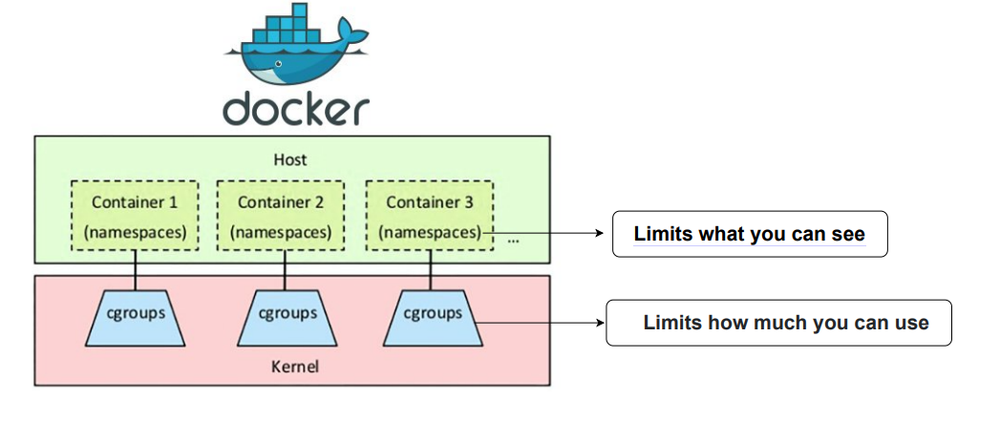

<!--Copyright © ZOMI 适用于[License](https://github.com/Infrasys-AI/AIInfra)版权许可-->

# 01. 容器隔离从进程到命名空间(DONE)

> Author by: 张柯帆，ZOMI

容器技术的隔离本质，其核心在于利用 Linux 内核的 **Namespace** 和 **Cgroups** 两大机制。其中，Namespace 是实现“视图隔离”的关键——它让进程“误以为”自己独占了系统资源（如进程树、网络栈、文件系统），而这一切的前提，是理解“进程”这个操作系统最基本的资源载体。本文将从进程原理切入，深入剖析 Namespace 的内核逻辑，最终串联起两者如何协同构建容器的隔离边界。



## 1. 容器的出现

本节会从容器技术的起源出发，对比虚拟机与容器的本质差异，为后续理解“进程+Namespace”的隔离逻辑铺垫背景。

容器技术的兴起与 PaaS（平台即服务）的发展密不可分。PaaS 的核心价值是提供应用“托管”能力，但早期形态存在明显局限：尽管虚拟化技术（如 AWS EC2）已普及，用户仍需像操作本地机器一样登录虚拟机、执行脚本部署应用——这种模式面临两大核心痛点：

- **环境一致性问题**：本地与虚拟机的网络配置、依赖版本、文件系统差异，常导致“本地能跑，线上崩掉”；
- **应用隔离问题**：同一虚拟机上的多个应用会争抢 CPU、内存，甚至一个应用崩溃会波及其他应用。

这两个痛点催生了技术需求：如何让应用“带着环境跑”？如何让应用间“互不干扰”？

早期解决方案（如 Cloud Foundry）虽尝试用“可执行文件+脚本”打包应用，但本质仍是“将本地操作迁移到云端重复执行”——例如 C++ 开发需配置编译器、依赖库、环境变量，每次部署都要重复这套流程，且脚本在不同环境的行为可能不一致。这种方案的核心缺陷是：**无法完整描述应用所需的操作系统级环境**。

Docker 的革命性突破在于“镜像”：它将应用运行所需的全部文件（包括操作系统内核之外的依赖、文件系统、环境变量）打包成一个不可变的压缩包。无论在何处解压，镜像都能提供与构建时完全一致的环境。制作和运行镜像的命令极其简洁：

```bash
# 构建镜像：将当前目录的环境打包
$ docker build .
# 运行镜像：在隔离环境中启动应用
$ docker run "我的镜像"
```

这种“一次打包，处处运行”的能力解决了环境一致性问题，而隔离问题则依赖 Linux 内核的进程+Namespace 机制——这正是本文的核心。

需要补充的是，Docker 虽解决了“打包”，却难以应对复杂应用的“编排”（如多容器部署、扩缩容）。最终 Kubernetes 凭借强大的编排能力成为云原生领域的标准，这部分将在后续文章深入。

## 2. 进程：容器隔离资源载体

要理解容器隔离，首先要搞懂“进程”——它是操作系统**资源分配和调度的基本单位**，也是 Namespace 实现隔离的“操作对象”。没有进程，就没有“隔离”的载体。

### 2.1 从程序到进程

- **程序（Program）**：是磁盘上的静态二进制文件（如 Linux 下的 ELF 格式），仅包含代码、数据和指令，不占用系统资源；
- **进程（Process）**：是程序的“动态运行实例”——当程序被执行时，操作系统会将其加载到内存，分配 CPU、内存、文件描述符等资源，并创建一个核心数据结构（`task_struct`）来管理它。

简单说：程序是“死的”文件，进程是“活的”资源集合。容器的隔离，本质就是对“进程所占用的资源”进行隔离。

### 2.2 Linux 进程核心

在 Linux 内核中，每个进程都对应一个 `task_struct` 结构体（可理解为进程的“身份证+资源清单”），它记录了进程的所有状态和资源信息。其中与“隔离”密切相关的字段如下：

```c
struct task_struct {
    unsigned int        __state;  // 进程状态（如运行、睡眠、僵死）
    void                *stack;   // 进程内核栈地址
    pid_t               pid;      // 全局进程 ID（宿主机可见）
    pid_t               tgid;     // 线程组 ID（进程组的标识）
    struct mm_struct    *mm;      // 内存描述符（管理进程虚拟内存）
    struct fs_struct    *fs;      // 文件系统信息（当前工作目录、根目录）
    struct files_struct *files;   // 打开的文件表（记录文件描述符）
    struct nsproxy      *nsproxy; // Namespace 代理（关键！指向进程所属的所有 Namespace）
    struct signal_struct *signal; // 信号处理信息
    ...
};
```

这些字段的核心作用是：将进程与它所占用的资源绑定。其中，

- `mm` 字段让进程拥有独立的虚拟内存空间；
- `fs` 字段定义了进程能访问的文件系统范围；
- `nsproxy` 字段是连接进程与 Namespace 的关键——它像一个“地址簿”，记录了进程所属的所有 Namespace（如 PID Namespace、Network Namespace），后续进程访问资源时，内核会通过 `nsproxy` 找到对应的 Namespace 视图。

### 2.3 进程的矛盾

默认情况下，所有进程共享 Linux 内核的“全局资源视图”：

- 进程 A 执行 `ps` 命令，能看到系统中所有进程（包括进程 B）；
- 进程 B 绑定 80 端口后，进程 A 就无法再绑定 80 端口；
- 所有进程看到的根目录（`/`）都是宿主机的根目录。

这种“共享”在多应用场景下会导致冲突——而容器隔离的本质，就是通过 Namespace 改造进程的 `nsproxy` 字段，让进程看到“独立的资源视图”，而非全局视图。

## 3. Namespace 命名空间

有了进程这个“资源载体”，接下来需要理解 Namespace 如何为进程“定制视图”。Namespace 是 Linux 内核提供的**轻量级虚拟化技术**，核心目标是：让一组进程拥有“独占”的资源视图，从而实现“看不见即隔离”。

### 3.1 Namespace 核心原理

Linux 内核为每种类型的资源（如 PID、网络、文件系统）设计了对应的 Namespace 类型，其实现逻辑可概括为三点：

1. **Namespace 是“资源视图的集合”**：每种 Namespace 类型（如 PID Namespace）对应一种资源视图，内核会为每个 Namespace 维护一个独立的“资源列表”（例如 PID Namespace 维护该视图下的进程 PID 映射）。
2. **进程通过 `nsproxy` 关联 Namespace**：进程的 `task_struct` 中的 `nsproxy` 指针，指向一个 `nsproxy` 结构体，该结构体包含了进程所属的所有 Namespace 指针（如 `pid_ns` 指向 PID Namespace，`net_ns` 指向 Network Namespace）。
3. **资源访问时“按视图过滤”**：当进程访问资源（如执行 `ps`、绑定端口）时，内核会先通过 `nsproxy` 找到对应的 Namespace，再从该 Namespace 的“资源列表”中查询资源——而非查询全局资源列表。

举个通俗的例子：如果把内核比作“公寓管理员”，Namespace 就是“公寓房间”，进程就是“住户”。每个住户（进程）的 `nsproxy` 就是“房间钥匙”，只能打开自己的房间（Namespace）；住户要找东西（访问资源）时，管理员（内核）只允许在其房间内查找，看不到其他房间的东西。

### 3.2 Namespace 关键调用

Linux 提供了三个核心系统调用，用于管理进程与 Namespace 的关联：

| 系统调用       | 作用                                                                 |
|----------------|----------------------------------------------------------------------|
| `clone()`      | 创建新进程时，通过指定 `CLONE_NEW*` 标志，让新进程进入新的 Namespace |
| `setns()`      | 将已存在的进程“加入”到一个已有的 Namespace（如进入容器的 Network Namespace） |
| `unshare()`    | 让当前进程“脱离”当前 Namespace，创建并加入新的 Namespace（不创建新进程） |

最常用的是 `clone()`，例如创建一个进入新 PID Namespace 的进程：

```c
#include <sched.h>
#include <stdio.h>
#include <stdlib.h>
#include <sys/wait.h>
#include <unistd.h>

int child_func(void *arg) {
    // 子进程在新的 PID Namespace 中，PID 为 1
    printf("子进程 PID（Namespace 内）: %d\n", getpid());
    system("ps aux"); // 仅能看到当前 Namespace 内的进程
    return 0;
}

int main() {
    char stack[1024 * 1024]; // 子进程栈空间（必须指定）
    // 创建子进程，指定 CLONE_NEWPID 标志，进入新的 PID Namespace
    pid_t pid = clone(child_func, stack + sizeof(stack), SIGCHLD | CLONE_NEWPID, NULL);
    if (pid == -1) {
        perror("clone failed");
        exit(1);
    }
    // 父进程看到的是子进程的“全局 PID”（非 Namespace 内的 PID）
    printf("子进程 PID（宿主机全局）: %d\n", pid);
    waitpid(pid, NULL, 0); // 等待子进程结束
    return 0;
}
```

编译运行后，会看到：

父进程打印的“全局 PID”是一个较大的数字（如 1234）；子进程打印的“Namespace 内 PID”是 1，且 `ps aux` 仅能看到自身和 `ps` 进程——这就是 PID Namespace 的隔离效果。

### 3.3 Linux Namespace 类型

截至 Linux 5.18 内核，共有 8 种 Namespace，分别对应不同的资源隔离场景。每种 Namespace 都改造了进程的某类资源视图：

| Namespace 类型 | 隔离资源                          | 核心作用举例                                  |
|----------------|-----------------------------------|-----------------------------------------------|
| PID Namespace  | 进程 ID 空间、进程树              | 容器内进程认为自己是 1 号进程，看不到宿主机进程 |
| Network Namespace | 网络设备、协议栈、端口、路由表    | 容器拥有独立的虚拟网卡，可绑定 80 端口而不冲突  |
| Mount Namespace | 文件系统挂载点、根目录            | 容器看到的根目录是镜像的挂载目录，而非宿主机 `/` |
| UTS Namespace  | 主机名、NIS 域名                  | 容器可设置独立的主机名（如 `docker run --hostname my-container`） |
| IPC Namespace  | System V IPC 对象、POSIX 消息队列 | 容器内进程无法与其他容器的进程通过 IPC 通信    |
| User Namespace | 用户 ID（UID）、组 ID（GID）空间  | 容器内的 root 用户（UID 0）在宿主机可能是普通用户 |
| Cgroup Namespace | Cgroup 文件系统视图              | 容器仅能看到分配给自己的 Cgroup 层级，无法修改其他 Cgroup |
| Time Namespace | 系统启动时间、单调时间            | 容器可独立修改时间（如模拟时区），不影响宿主机  |

### 3.4 查看进程 Namespace

Linux 提供了 `/proc/(pid)/ns` 目录，用于查看指定进程所属的所有 Namespace。该目录下的每个文件都是符号链接，格式为 `类型:[inode 编号]`——**inode 编号相同的进程，共享该类型的 Namespace**。

例如，查看容器内 `/bin/sh` 进程（PID 1）的 Namespace：

```bash
# 容器内执行（进程 PID 1）
ls -l /proc/1/ns
total 0
lrwxrwxrwx 1 root root 0 Aug  1 12:00 cgroup -> cgroup:[4026531835]
lrwxrwxrwx 1 root root 0 Aug  1 12:00 ipc -> ipc:[4026531839]
lrwxrwxrwx 1 root root 0 Aug  1 12:00 mnt -> mnt:[4026531840]
lrwxrwxrwx 1 root root 0 Aug  1 12:00 net -> net:[4026531993]
lrwxrwxrwx 1 root root 0 Aug  1 12:00 pid -> pid:[4026531836]
lrwxrwxrwx 1 root root 0 Aug  1 12:00 user -> user:[4026531837]
lrwxrwxrwx 1 root root 0 Aug  1 12:00 uts -> uts:[4026531838]
```

再查看宿主机上对应的全局进程（假设 PID 29965）：

```bash
# 宿主机执行（进程 PID 29965）
ls -l /proc/29965/ns
total 0
lrwxrwxrwx 1 root root 0 Aug  1 12:00 cgroup -> cgroup:[4026531835]  # 可能与宿主机共享（取决于配置）
lrwxrwxrwx 1 root root 0 Aug  1 12:00 ipc -> ipc:[4026531839]        # 容器独立的 IPC Namespace
lrwxrwxrwx 1 root root 0 Aug  1 12:00 mnt -> mnt:[4026531840]        # 容器独立的 Mount Namespace
...
```

可见，容器内进程的 `ipc`、`mnt`、`pid` 等 Namespace 的 inode 编号与宿主机其他进程不同——这意味着它们属于独立的 Namespace，资源视图完全隔离。

## 4. 容器隔离的核心

理解了进程的“资源载体”角色和 Namespace 的“视图隔离”能力后，我们终于能串联起容器隔离的完整逻辑：容器本质是一组被“Namespace 改造过”的进程集合，这些进程共享同一套 Namespace，从而拥有独立的资源视图。

### 4.1 Docker 创建容器

当执行 `docker run -it alpine /bin/sh` 时，Docker 后台会完成以下关键步骤，本质是“进程与 Namespace 的绑定”：

1. **创建新的 Namespace 集合**：Docker 通过 `clone()` 系统调用，指定多个 `CLONE_NEW*` 标志（如 `CLONE_NEWPID`、`CLONE_NEWNET`、`CLONE_NEWNS` 等），创建一个新的子进程（即容器内的 `/bin/sh` 进程）。此时，该子进程会自动进入 6-7 种新的 Namespace（取决于配置）。
2. **配置 Namespace 资源视图**：
   - 为 **Mount Namespace** 挂载镜像的根文件系统（如 alpine 的 `/` 目录），让容器进程看到独立的文件系统；
   - 为 **Network Namespace** 创建虚拟网卡（如 `veth` 设备），并连接到宿主机的 Docker 网桥（`docker0`），让容器拥有独立的网络栈；
   - 为 **UTS Namespace** 设置容器的主机名（如 `--hostname` 指定的值）；
   - 为 **PID Namespace** 初始化 PID 映射，让容器内的子进程（`/bin/sh`）成为该 Namespace 的 1 号进程。
3. **继承 Namespace 形成进程组**：容器内后续创建的进程（如执行 `ps`、`ls`），会自动继承父进程（`/bin/sh`）的 `nsproxy` 结构体——即共享同一套 Namespace，因此看到的资源视图与父进程完全一致。
4. **绑定 Cgroups 限制资源**：（补充背景）Docker 同时会将容器内所有进程加入到一个新的 Cgroups 组，限制其 CPU、内存等资源的使用量（解决“用多少”的问题），与 Namespace 共同实现完整隔离。

### 4.2 容器内 1 号进程

我们以容器内的 `/bin/sh` 进程为例，看进程与 Namespace 如何协同实现隔离：

- **宿主机视角**：该进程有一个全局 PID（如 29965），其 `task_struct` 中的 `pid` 字段为 29965，`nsproxy->pid_ns` 指向容器的 PID Namespace（而非全局 PID Namespace）。宿主机执行 `ps -ef | grep 29965` 能看到该进程，但执行 `ps` 时不会将其计入“全局进程树”的 1 号位置。
- **容器视角**：该进程的 `task_struct` 在其 PID Namespace 中的映射 PID 为 1，内核遍历该 Namespace 的进程列表时，会将其作为“初始化进程”（类似宿主机的 `systemd`）。因此，容器内执行 `ps` 时，会看到该进程是 1 号进程，且只能看到容器内的其他进程（如 `ps` 自身）。

这种双重身份的本质，是进程的 `task_struct` 同时关联了“全局资源标识”（如全局 PID）和“Namespace 资源标识”（如 Namespace 内 PID），内核根据访问者的 Namespace 视图，动态展示对应的标识。

### 4.3 为何比虚拟机轻

对比虚拟机的隔离逻辑，能更清晰地看到“进程+Namespace”的优势：

- **虚拟机**：通过模拟硬件（如 CPU、内存、网卡），在硬件之上运行完整的操作系统（如 Guest OS），应用进程是 Guest OS 的子进程。隔离粒度是“操作系统级”，资源开销大（需占用独立的内存、CPU），启动慢（需加载完整 OS）。
- **容器**：直接复用宿主机的 Linux 内核，仅通过 Namespace 改造进程的资源视图，隔离粒度是“进程级”。无需模拟硬件、无需运行 Guest OS，资源开销仅相当于普通进程，启动时间可缩短至毫秒级。

因此，虚拟机是“装了系统的盒子”，容器是“带了视图的进程组”。

## 5. 总结与思考

容器隔离的本质，是以进程为资源载体，以 Namespace 为视图改造工具，以 Cgroups 为资源限制手段的协同方案。理解“进程+Namespace”的逻辑，是掌握容器技术的关键——后续的 Kubernetes 编排（如 Pod 共享 Namespace、Sidecar 容器）、容器网络（如 CNI 插件操作 Network Namespace）、容器安全（如 User Namespace 降权），本质都是基于这一核心逻辑的扩展。

## 参考与引用

- https://man7.org/linux/man-pages/man7/namespaces.7.html（Linux Namespace 官方文档）
- https://www.kernel.org/doc/Documentation/cgroup-v2.txt（Linux Cgroups v2 官方文档）
- https://www.kernel.org/doc/html/latest/process/namespaces.html（Linux Namespace 内核实现细节）
- https://blog.quarkslab.com/digging-into-linux-namespaces-part-1.html（Linux Namespace 深度解析系列）
- https://dockerlabs.collabnix.com/beginners/difference-vm-containers.html（Docker 与 VM 的实践差异）
