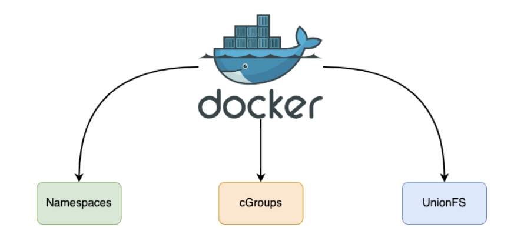
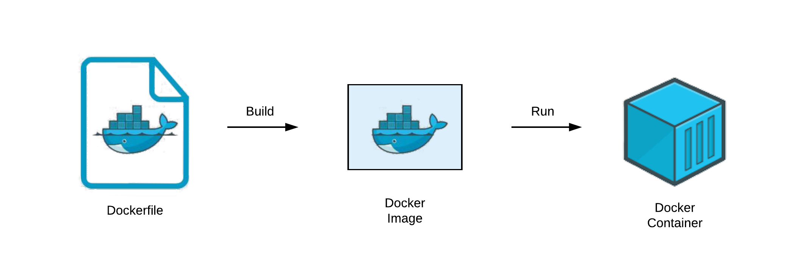
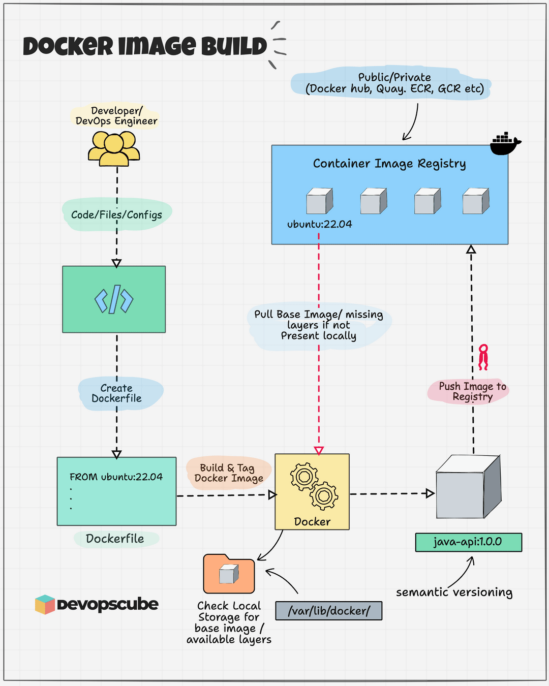

<!--Copyright © ZOMI 适用于[License](https://github.com/Infrasys-AI/AIInfra)版权许可-->

# 04. Dockerfile 到容器(DONE)

> Author by: 张柯帆

在云原生世界里，`Dockerfile` 远不止是简单的构建脚本；它是容器世界的“创世蓝图”，定义了独立、可移植、可隔离的运行环境。不过，这份蓝图本身并无魔力，它的魔力——如图所示——源于 Docker Engine 在背后对 Linux 内核三大核心技术（**Namespaces**、**Cgroups**、**UFS（Union File System，联合文件系统）**）的巧妙编排与运用。



在深入底层技术细节前，我们先理解 **Dockerfile → Docker 镜像 → Docker 容器** 的转化过程。我们可以用一个简单的比喻理清三者关系：

Dockerfile 如同建筑蓝图，以文本指令详细描述“最终成品”的组成（所需建材）与建造步骤，本身静态且人类可读；Docker 镜像（Image）是依蓝图打造的“样板间”，只读且不可变，虽无法直接“入住”，却包含运行所需的所有要素——代码、运行时、库、环境变量与配置文件；Docker 容器（Container）则是将样板间“落地部署”后可使用的房子，作为镜像的运行实例，动态且可操作。在容器内的所有改动仅作用于当前实例，不会影响作为“样板间”的镜像本身。



这张图清晰展示了它们的生命周期关系：

1. 编写 Dockerfile：开发者定义应用环境所需的一切。
2. 执行 `docker build`：Docker Engine 读取 Dockerfile 并执行其中指令，最终生成只读的 Docker 镜像。这个镜像内部是分层结构，我们后续会详细探讨。
3. 执行 `docker run`：Docker Engine 以只读镜像为基础，在其之上创建可写的容器层，再启动进程。“只读镜像层 + 可写容器层”的组合，搭配独立的进程空间、网络空间等，共同构成运行中的 Docker 容器。同一个镜像可创建无数个相互隔离的容器。

现在，带着这个宏观概念，我们以一份典型的 `Dockerfile` 为线索，深入剖析这三大技术在“镜像构建（`docker build`）”与“容器运行（`docker run`）”两个核心阶段的协同逻辑，以及它们具体产生的影响。

> 注：以下讨论基于 Linux 系统

## 1. 经典 Dockerfile

我们从一份构建简单 Python 应用的 `Dockerfile` 入手，其指令逻辑对应容器环境的核心构建步骤：

```dockerfile
# Phase 1: 基础镜像（构建环境的起点）
FROM ubuntu:22.04

# Phase 2: 环境配置与代码注入
WORKDIR /app  # 设定容器内工作目录
COPY . .      # 将本地当前目录文件复制到容器工作目录

# Phase 3: 依赖安装（构建可运行的应用环境）
RUN apt-get update && \
    apt-get install -y python3 python3-dev python3-pip && \
    pip3 install -r requirements.txt

# Phase 4: 定义运行时指令（容器启动后执行的命令）
CMD ["python3", "main.py"]
```

## 2. docker build 与 UFS

当执行 `docker build -t my-python-app .` 时，Docker Engine 开始解读这份“蓝图”，而 **Union File System（联合文件系统）**（此处以 Docker 当前默认存储驱动、现代实现的 **Overlay2** 为例）是构建过程的核心支撑。`docker build` 的本质，就是利用 UFS 的分层能力，将 `Dockerfile` 的每一条指令“固化”为不可变的镜像层（Image Layer）。

### 2.1 基础镜像指令

Docker 会先检查本地是否存在类似 `ubuntu:22.04` 基础镜像。若存在，直接将该镜像的所有只读层作为本次构建的“底层基础”；若不存在，则自动从远端镜像仓库（如 Docker Hub）拉取。在 Overlay2 机制中，这相当于确定未来容器文件系统 `lowerdir`（Overlay2 中的“底层目录”，用于存储只读层数据）堆栈的最底层部分。

这一设计实现了极致的资源复用：上百个依赖 Ubuntu 基础镜像的应用，在宿主机磁盘上可共享同一份基础系统文件，极大节省了存储空间。

### 2.2 文件系统修改类指令

对于 `WORKDIR /app`、`COPY . .`、`RUN ...` 这类会修改文件系统的指令（如创建目录、复制文件、安装软件），Docker 会执行一套标准化流程：

1. 启动临时“中间容器”（基于上一步的镜像层创建，构建完成后自动销毁）；
2. 在中间容器内执行当前指令；
3. 完整记录指令产生的文件系统变更（新增、删除、修改），生成新的独立只读层；
4. 新层“堆叠”在前一个镜像层之上，成为下一条指令构建时 `lowerdir` 堆栈的一部分。

#### Overlay2 实现细节

每一条 `RUN` 指令执行后产生的文件变更，都会被保存在 `/var/lib/docker/overlay2/` 目录下的独立子目录中。例如，`apt-get install` 安装的 Python 二进制文件、依赖库，会被记录在新的镜像层目录内。

若某条指令删除了下层镜像中的文件（如 `RUN rm /tmp/test.txt`），Overlay2 不会直接修改底层只读文件，而是在新层中创建 **whiteout 标记**（一种主/次设备号均为 0 的特殊字符设备文件），用于在最终的“联合视图”中“遮蔽”底层目标文件——即让容器“看不到”被删除的文件。

#### 核心影响

Docker 的“构建缓存”机制正是依托这些不可变分层实现的。若再次执行构建，只要 `Dockerfile` 中某一行指令及其之前的所有指令未改动，Docker 会直接复用本地已有的对应镜像层（即“命中缓存”），实现“秒级构建”。

同时，执行 `docker push`（推送镜像到仓库）或 `docker pull`（拉取镜像）时，远端仓库只会传输本地缺失的镜像层，而非整个镜像，大幅减少网络传输量，提升镜像分发效率。

至此，`docker build` 流程完成。最终得到的 `my-python-app` 镜像，并非单一“大文件”，而是包含“镜像层列表、镜像元数据（如启动命令、环境变量）”的集合。这种分层设计，也为后续容器的“轻量级实例化”奠定了基础。

## 3. docker run 关键步骤

当执行 `docker run -d --name my-app -m 512m --cpus=".5" my-python-app` 时，Docker 会启动“组合拳”——协同 UFS、Namespaces、Cgroups 三大技术，将静态镜像转化为动态运行的容器。

### 3.1 UFS 构建可写文件系统

Docker 存储驱动（此处为 Overlay2）会以 `my-python-app` 镜像的所有只读层作为 `lowerdir`，同时在其之上创建 **新的空可写目录** 作为 `upperdir`（Overlay2 中的“上层目录”，存储容器运行时的写操作数据）；此外，还会创建 `merged` 目录（Overlay2 中的“联合目录”），将 `upperdir` 与 `lowerdir` 进行“联合挂载”，形成统一的文件系统视图。

这个 `merged` 目录会作为容器的根文件系统（`/`）。容器运行中的所有写操作（如应用 `main.py` 写入日志、创建临时文件），都会通过 **写时复制（Copy-on-Write，简称 CoW）** 机制，仅发生在 `upperdir` 中——底层镜像只读层永远不变。

这一设计带来两大优势：

1. 保障镜像“纯洁性”，避免容器写操作污染基础镜像；
2. 实现容器“轻量级启动”：成百上千个基于同一镜像的容器，可共享所有只读层，每个容器仅需额外占用 `upperdir`（通常仅几 KB 到几十 MB）的存储空间。且容器销毁极为“廉价”——只需删除对应的 `upperdir` 和挂载关系，不会影响底层镜像。

### 3.2 Namespaces 实现隔离

在文件系统准备的同时，Docker 会通过 Linux 内核提供的 `clone()` 或 `unshare()` 系统调用（传入 `CLONE_NEW*` 系列标志），为即将启动的容器进程创建一套独立的 **Namespaces**，实现“进程看不到外部、外部看不到进程”的隔离效果。

1. MNT Namespace（`CLONE_NEWNS`）

这是第一个被创建的 Namespace。Docker 会将上一步准备好的 `merged` 目录，挂载为该 Namespace 内部的根目录（`/`）。

隔离效果：容器内进程看到的文件系统，仅包含镜像只读层与 `upperdir` 联合后的内容，无法访问宿主机或其他容器的文件，实现文件系统完全隔离。

2. UTS Namespace（`CLONE_NEWUTS`）

为容器分配独立的主机名（如 `--name my-app` 设定的名称）和域名。

隔离效果：容器在网络环境中拥有独立“身份标识”，避免主机名冲突，同时让容器内应用可基于自身主机名运行（如部分服务依赖主机名配置）。

3. IPC Namespace（`CLONE_NEWIPC`）

为容器创建独立的进程间通信（IPC）资源池，包括信号量、消息队列、共享内存等。

隔离效果：容器内进程无法与宿主机或其他容器的进程通过标准 IPC 方式通信，防止跨容器的信息泄露与运行干扰。

4. PID Namespace（`CLONE_NEWPID`）

这是实现进程 ID 隔离的核心，也是容器“轻量化”的关键特性之一。

隔离效果：在该 Namespace 内启动的第一个进程（即 `Dockerfile` 中 `CMD` 指令定义的 `python3 main.py`），其 PID 会被设为 1（相当于宿主机的 `init` 进程），成为容器内所有后续进程的“祖先”。容器内进程无法看到或操作宿主机的任何进程（即使是宿主机 PID 为 1 的 `systemd` 进程），甚至无法感知宿主机存在，极大提升运行安全性。

5. NET Namespace（`CLONE_NEWNET`）

为容器创建一套全新的独立网络栈，包括虚拟网卡（如 `veth` 对的一端）、IP 地址、路由表、端口空间等。

隔离效果：容器拥有独立“网络环境”，其端口（如应用监听的 80 端口）与宿主机、其他容器的端口完全独立。`docker run` 中的 `-p 8080:80` 参数，本质是在宿主机 `NET Namespace` 与容器 `NET Namespace` 之间建立端口映射规则——将宿主机 8080 端口的流量转发到容器 80 端口，实现外部对容器应用的访问。

### 3.3 Cgroups：设定资源边界

完成进程隔离后，Docker 还需通过 **Cgroups（Control Groups，控制组）** 技术，限制容器对宿主机资源的使用，避免单个容器“过度占用资源”影响其他容器或宿主机稳定性。其核心动作如下：

1. 创建控制组目录：Docker 会在 Linux 内核的 Cgroups 挂载点（通常为 `/sys/fs/cgroup/`）下，为新容器在各个资源子系统（如 `memory` 内存子系统、`cpu` CPU 子系统）中创建独立的控制组目录。例如，内存子系统的控制组目录可能为 `/sys/fs/cgroup/memory/docker/<container_id>/`。
2. 配置资源限制参数：解析 `docker run` 中的资源限制参数，并转化为对 Cgroups 文件系统的写操作：
   - `--memory 512m`（简写 `--m 512m`）：向 `memory.limit_in_bytes` 文件写入 `536870912`（即 512MB 对应的字节数），限制容器内存使用上限；
   - `--cpus=".5"`：向 `cpu.cfs_period_us` 文件写入 `100000`（即 100ms 的调度周期），同时向 `cpu.cfs_quota_us` 文件写入 `50000`（即每个周期内容器可使用的 CPU 时间上限为 50ms）。
3. 绑定容器进程：将容器主进程（即 PID Namespace 中 PID 为 1 的进程）的实际 PID，写入上述控制组目录下的 `tasks` 文件。这一步是“生效关键”——表示该进程及后续衍生的子进程，均受当前控制组规则约束。

从 `tasks` 文件写入 PID 的那一刻起，Linux 内核会严格执行资源限制：

- 容器内所有进程的内存使用总和一旦超过 512MB，内核的 OOM Killer（内存溢出杀手）会触发，自动终止容器内占用内存过高的进程，避免影响宿主机整体内存稳定性；
- 在每 100ms 的 CPU 调度周期内，容器内所有进程可使用的 CPU 时间总和不超过 50ms（即占用宿主机 50% 的单个 CPU 核心资源），实现容器间 CPU 资源的公平分配。

Cgroups 的核心价值：为容器资源使用划定“硬边界”，是云环境中“多租户部署”“高密度容器运行”的技术基石——确保容器之间、容器与宿主机之间的资源隔离，避免“一个容器故障拖垮整个系统”的风险。

## 4. 技术协同结论

回顾从 `Dockerfile` 到运行态容器的全流程，可清晰看到三大技术的分工与协作：

- **`Dockerfile`**：静态的“隔离蓝图”，定义容器的基础环境、依赖与启动逻辑；
- **Union File System**：构建阶段将“蓝图”固化为高效可复用的分层镜像，运行阶段提供轻量级可写环境，解决“容器环境是什么”的核心问题；
- **Namespaces**：运行阶段为进程构建全方位的隔离视图，使其误以为“独占整个系统”，解决“进程在哪个隔离空间运行”的问题；
- **Cgroups**：运行阶段为隔离环境设定不可逾越的资源边界，解决“容器能使用多少宿主机资源”的问题。

Docker 的伟大，并非发明了 Namespaces、Cgroups 或 UFS——这些都是 Linux 内核早已存在的能力——而是将这些孤立、复杂的底层技术，通过一套简单、一致的工具链（`Dockerfile` 语法、`docker` 命令行）封装、编排，最终为用户呈现“轻量、秒级启动、可移植”的容器体验。此外，Docker 公司还管理着镜像仓库（如 Docker Hub）进行统一管理，极大方便了社区使用。



## 5. 总结与思考

通过拆解 `Dockerfile` 到运行态容器的全流程，我们能跳出“容器是轻量级虚拟机”的误区，更深刻地理解：容器本质是 Linux 内核三大技术（Namespaces、Cgroups、UFS）协同作用的“进程隔离环境”。Docker 工具链的价值，在于将复杂的内核能力转化为“开发者友好”的接口，让“一次构建，到处运行”的理念真正落地。

## 6. 参考与引用

- [Docker 官方文档：Docker Storage Drivers](https://docs.docker.com/storage/storagedriver/)
- [Linux 内核手册：Namespaces](https://man7.org/linux/man-pages/man7/namespaces.7.html)
- [Cgroups](https://man7.org/linux/man-pages/man7/cgroups.7.html)
- [How to Build Docker Image : Comprehensive Beginners Guide](https://devopscube.com/build-docker-image/)
