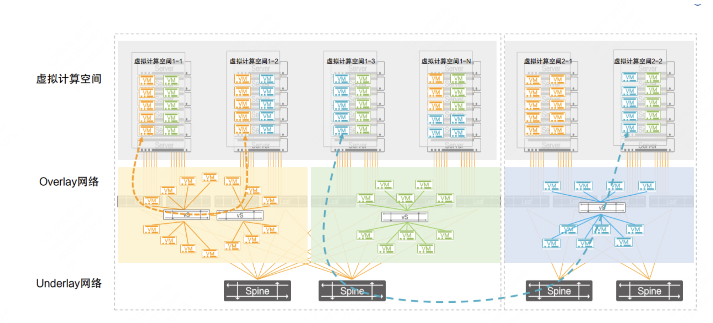
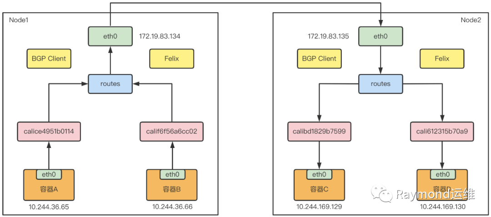
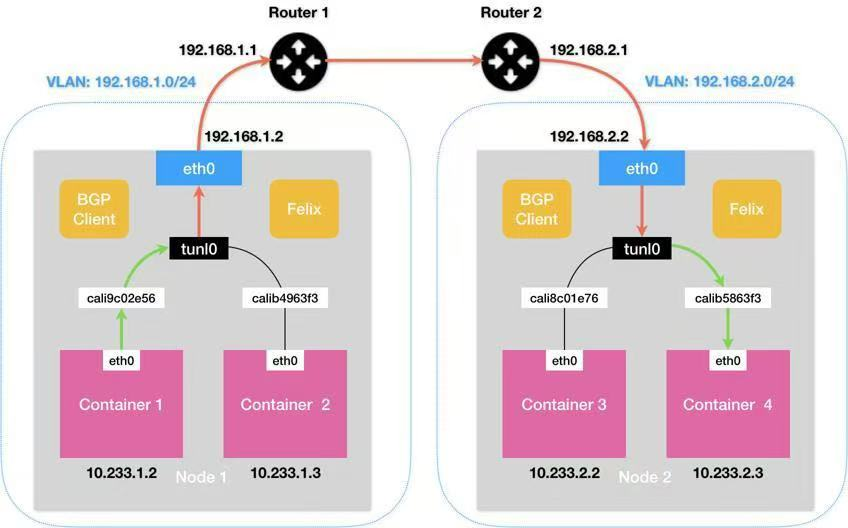
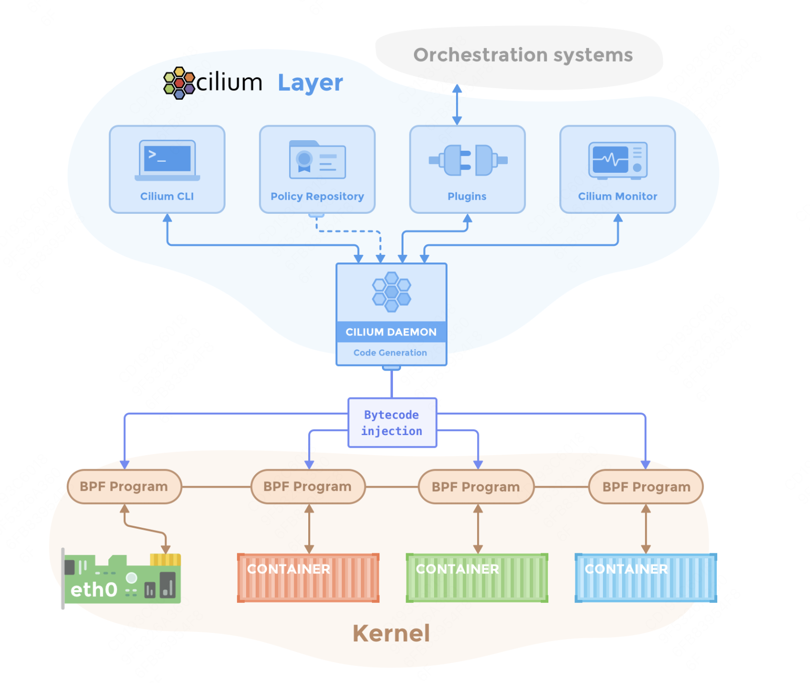
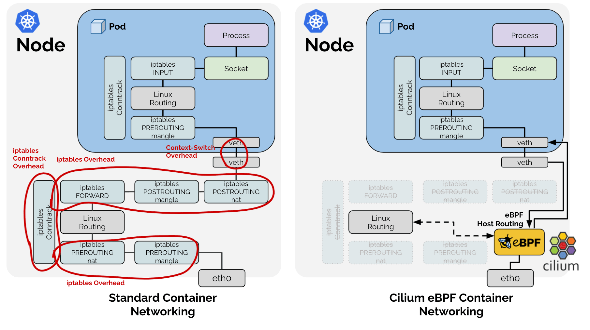

<!--Copyright © ZOMI 适用于[License](https://github.com/Infrasys-AI/AIInfra)版权许可-->

# K8S 容器持网络

> Author by: 何晨阳

要了解容器网络，首先要了解容器网络和传统物理机、虚拟机在架构设计和实现上的本质区别。

| 维度 | 容器网络 | 普通机器网络 |
|------|----------|--------------|
| 网络实体 | 容器(Pod)作为基本单元 | 物理机/虚拟机作为基本单元 |
| IP 分配 | 每个 Pod 有独立 IP(CNI 管理) | 每个物理机/虚拟机有独立 IP |
| 网络栈 | 共享主机内核网络栈 | 独立完整网络栈 |
| 通信模型 | Overlay/BGP/eBPF 等虚拟网络 | 基于物理网络设备的路由 |
| 隔离机制 | Linux 命名空间(netns)+cgroups | VLAN/VXLAN/物理隔离 |

每个容器拥有独立的的 netns，通过 veth pair 连接主机网络。而普通机器游泳单一全局网络命名空间，直接使用物理网卡。

## 容器网络中的关键网络模型

### Overlay 网络

提到 Overlay 网络，首先对比一下常见的两种网络类型，Overlay网络与Underlay网络的区别，架构设计如下图所示。

Overlay 使用 Underlay 网络进行数据包进行数据传输，Overlay通过在Underlay网络上部署虚拟化设备，实现对网络流量的控制和管理。

通过Overlay技术，可以在Underlay网络上构建多个逻辑网络，实现不同网络之间的隔离和灵活性，如虚拟专用网络、负载均衡等。

Overlay网络多用于多租户云环境，Underlay网络多用于高性能计算、传统企业网络。

### BGP 路由

使用边界网关协议交换路由，代表实现有 Calico 等。优点是高性能、无封装开销，需要网络设备支持 BGP。

### eBPF 加速

使用 Linux 内核 eBPF 技术，有如下特点：绕过 kube-proxy，高性能服务负载均衡，细粒度网络策略，比 iptables 快 5 倍+。

## 扁平网络 Flannel

Flannel 部署在每个节点上，具备以下功能：

- 子网分配：为每个节点分配独立的子网段，确保 Pod IP 不冲突。
- 路由管理：动态维护跨节点的路由信息。
- 网络封装：支持多种后端实现（VXLAN、host-gw、UDP 等）

其核心组件包括：

| 维度 |                容器网络                         | 
|-----|------------------------------------------------|
| flannelId | 主守护进程，负责子网分配、路由配置、后端驱动管理 |
| CNI 插件 | 实现 Kubernetes CNI 接口，配置容器网络命名空间 |
| 后端模块 |           具体网络实现（VXLAN/host-gw/UDP） |
| etcd/K8s API	 | 存储网络配置：集群 CIDR、节点子网映射等 |

### UDP 模式

作为最早支持的后端，核心是通过TUN设备flannel0实现。TUN设备是工作在第三层的虚拟网络设备，用于在操作系统内核和用户应用程序之间传递 IP 包。

相比两台宿主机直接通信，多出了flannelId的处理过程，由于使用TUN设备，仅在发出IP包的过程就要经过三次用户态到内核态的数据拷贝，所以性能非常差。

以flanel0为例，操作系统将一个IP包发给 flanel0，flanel0把IP包发给创建这个设备的应用程序：flanel进程（内核态->用户态）
相反，flanel进程向 flanel0发送一个IP包，IP包会出现在宿主机的网络栈中，然后根据宿主机的路由表进行下一步处理（用户态->内核态）
当IP包从容器经过docker0出现在宿主机，又根据路由表进入flanel0设备后，宿主机上的flanneld进程就会收到这个 IP包。

### VXLAN 模式（默认 性能较好）

VXLAN是Linux本身支持的一种网络虚拟化技术，可以完全在内核态实现封装和解封装工作，从而通过“隧道”机制，构建 Overlay 网络。

VXLAN 的设计思想是在现有三层网络之上，构建一层虚拟的，由 VXLAN 模块维护的二层网络，使得连接在这个 VXLAN 二层网络上的主机，都可以像在同一个局域网里那样自由通信。

为了实现这个隧道，VXLAN 会在宿主机设置一个特俗的网络设备作为隧道的两端，叫做 VTEP，原理图如下：

flanel.1 设备，就是 VXLAN 的 VTEP，即有IP地址，也有MAC地址。

与UDP模式类似，当container-1发出请求后，发往地址10.1.16.3的IP包，会先出现在 docker 网桥，再路由到本机的 flannel.1设备进行处理（进站）

为了能够将“原始IP包”封装并发送到正常的主机，VXLAN 需要找到隧道的出口：上的宿主机的 VTEP 设备，这个设备信息，由宿主机的 flanneld 进程维护

### host-gw 模式（高性能）

host-gw 工作原理就是将每个 Flannel 子网下一跳设置成该子网对应的宿主机 IP 地址，即宿主机充当这条容器通信路径的网关。

所有子网和主机的信息，都保存在 Etcd 中，flannelId 只需要关注这些数据的变化，实时更新路由表。IP 包在封装成帧的时候，使用路由表下一跳设置上的 MAC 地址，就可以经过二层网络到达目的宿主机。

下图展示了使用 host-gw 后端实现的 Flannel 网络架构。

## BCP 路由网络 Calico

Calico 提供的解决方案与 host-gw 模式非常相似，其会在每台宿主机上添加一条路由规则，其中网关的 IP 地址，就是目标容器宿主机的 IP 地址。不同于 Flannel 使用 Etcd 维护路由信息的做法，Calico 使用 BGP 协议维护集群中的路由信息。

该方案是一个纯三层的方法，使用虚拟路由代替虚拟交换，每一台虚拟路由通过 BGP 协议传播可达信息到剩余数据中心。

Calico 的 CNI 插件会为每个容器设置一个 Veth Pair 设备，将其中一端放在宿主机上。于是容器发出的 IP 包就会经过 Veth Pair 设备出现在宿主机上，然后根据路由规则的下一跳 IP 地址，转发给正确的网关。

“下一跳”路由规则，由 Calico 的 Felix 进程维护，路由规则信息由 BIRD 组件使用 BGP 协议传输得到。

Calico 默认配置使用的是 Node-to-Node Mesh 模式，每台宿主机上的 BGP Client 都需要跟其他所有节点的 BGP Client 进行通信，以交换路由信息，因此该种模式只适用于少于 100 个节点的集群中。更大规模的集群需要使用 Route Reflector 模式。该种模式 Calico 会指定专门节点，用来负责跟所有节点建立 BGP 连接，学到全局的路由规则。

使用 BGP 模式也像 host-gw 模式一样，要求宿主机是二层联通的，如果不在同一个子网，就需要使用 IPIP 模式。

### IPIP 模式

在该模式下，Felix 会在 Node1 添加一条路由规则，如下所示：

- 10.233.2.0/24 via 192.168.2.2 tunl0

Calico 使用的 tunl0 设备是一个 IP 隧道设备，IP 包进入 IP 隧道设备之后，就会被 Linux 内核的 IPIP 驱动接管。IPIP 驱动会将这个 IP 包直接封装在一个宿主机网络的 IP 包中。这样 Node 2 的 IP 包，就被伪装成一个从 Node 1 到 Node 2 的 IP 包。

因此使用IPIP模式的时候，集群网络性能会因为额外的封包解包而下降。

## 基于 eBPF 的网络 Cilium

Cilium 是一个开源的容器网络插件，基于 eBPF 实现高性能、可扩展的网络和安全工呢个。支持微服务间细粒度的流量控制，能够在 L3/L4/L7 层提供网络策略。

Cilium 的优势有哪些？

从下图可以看出，引入基于 eBPF 的 Host Routing 后，可以完全绕过 iptables 和网络协议栈，与常规的 veth 设备相比，实现了更快的网络命名空间切换。经过内核处理有如下弊端：

- 中断处理：频繁的切换中断会导致较高的性能开销，从而会产生时延。
- 内存拷贝：通过 DMA 将网络数据拷贝到内核缓冲区，再拷贝到用户控件，这个耗时占到了整个数据包处理流程的一半以上。
- 局部性失效：目前主流处理器都是多个 CPU 核心的，如果一个数据包的处理跨多个 CPU 核心，就可能造成缓存失效。

适用场景：

- 云原生微服务架构：需要严格进行流量控制、提供丰富的可观测性。
- 边缘计算：需要极低的延迟。
- 高流量集群：适用于对吞吐量、性能要求极高的生产集群。
- 多租户隔离：支持多租户网络环境的隔离需求。

### Cluster-Pool 模式

由 Cilium 自己管理 Pod IP 地址范围，可以在部署时指定 CIDR 范围。依赖 Cilium Operator 来管理 IP 地址池。有如下优势：

- 高灵活性：支持为不同节点或区域定义独立的 IP 地址池。
- 动态管理：可以动态调整 IP 地址池大小。
- 优化性能：减少对 K8S 控制器的依赖，提高网络性能和资源利用率。

主要适用于大规模集群，跨区域或多节点池的复杂网络，并且需要动态扩展 Pod IP 地址范围的集群。

### Kubernetes 模式

使用 K8S 自身的 IP 地址分配方式，从 Kubernetes 中获取分配给 Pod 的 IP 地址。兼容性比较强，适用于大多数 CNI 插件，但是不支持细粒度的 IP 地址池管理，无法为特定节点或区域分配特定的 IP 范围。

主要适用于中小型集群，网络规划比较简单，能够快速部署，与 K8S 兼容性比较强。

## 总结与思考

从k8s网络的发展可以看出，其正在从连通性组件向高性能、安全性方向演进。在技术层面上，通过 eBPF、服务网络重塑数据面。在场景与功能支持上，逐步支撑如边缘计算、AI/GPU 异构计算。

未来，k8s 网络将更深度的融入 AI 基础设施，成为智能算力的核心调度层。

## 参考与引用

- https://www.cnblogs.com/chenqionghe/p/11718365.html
- https://www.cnblogs.com/cheyunhua/p/17126430.html
- https://www.cnblogs.com/evescn/p/18256900
