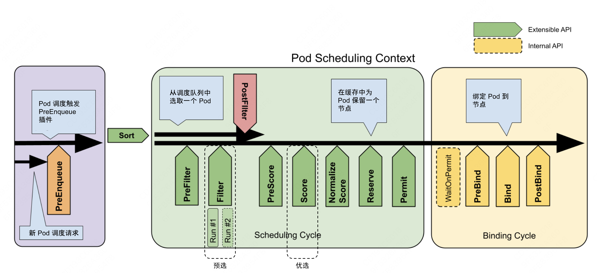
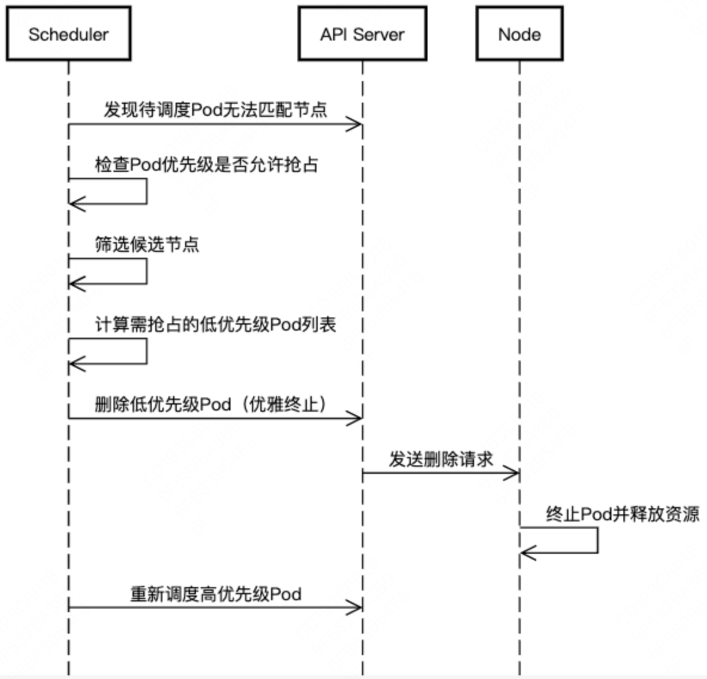

<!--Copyright © ZOMI 适用于[License](https://github.com/Infrasys-AI/AIInfra)版权许可-->

# K8S 资源管理与作业调度

> Author by: 何晨阳

Kubernetes 的作业调度与资源管理系统如同集群的"智能大脑"和"资源管家"：

- 调度器是决策中枢：通过智能算法将工作负载精准分配到最佳位置。
- 资源管理是保障系统：确保每个应用获得所需资源而不相互干扰。

## 资源管理

### 资源类型

在 K8S 中，CPU 和内存是最主要的两种资源类型，统称为计算资源。CPU 的单位是 Kubernetes CPU，内存单位是字节。不同于 API 资源，计算资源是可以被请求、分配和消耗的。

CPU 资源的限制和请求以 CPU 为单位，1CPU 等于 1 个物理 CPU 或者 1 个虚拟核，取决于运行在物理主机还是虚拟机上。当然也可以使用带小数的 CPU 请求，比如 0.1CPU，等价于 100 millicpu。

值得注意的是，CPU 资源的值是绝对数量，不是相对数量。即无论运行在单核、双核或更高配置的机器上，500mCPU 表示的是相同的算力。
memory 的请求以字节为单位，单位有 E、P、T、G、M、k。

CPU 资源被称为可压缩资源，当资源不足时，Pod 只会饥饿，不会退出。内存资源被称为不可压缩资源，当压缩资源不足时，Pod 会被 Kill 掉。

### 资源请求与限制

针对每个 Pod 都可以指定其资源限制与请求，示例如下：

> spec.containers[].resources.limits.cpu
> spec.containers[].resources.limits.memory
> spec.containers[].resources.requests.cpu
> spec.containers[].resources.requests.memory

在调度时按照 requests 的值进行计算，真正设置 Cgroups 限制的时候，kubelet 会按照 limits 的值来进行设置。Kubenetes 对 CPU 和内存的限额设计，参考了 goole 的 Borg 设计，即设置的资源边界不一定是调度系统必须严格遵守的，实际场景中，大多数作业使用到的资源其实远小于它所请求的资源限额。

Borg 在作业提交后，会主动减小它的资源限额配置，以便容纳更多的作业。当作业资源使用量增加到一定阈值时，会通过快速恢复，还原作业原始资源限额。

Kubenetes 中的 requests+limits 的思想是类似的，requests 可以设置一个相对较小的值，真正给容器设置的是一个相对较大的值。

### QoS 模型

QoS 中设计了三种类型：Guaranteed、Burstable 和 BestEffort。
当 requests=limits，这个 Pod 就属于 Guaranteed 类型，当 Pods 仅设置了 limits，没有设置 requests，这个 Pod 也属于 Guaranteed。当至少有一个 Container 设置了 requests，那么这个 Pod 属于 Burstable。如果一个 Pod 都没有设置，那么这个 Pod 被划分为 BestEffort。

为什么会设置这三种类别呢？

> 主要应用于宿主机资源紧张的时候，kubelet 对 Pod 进行资源回收。比如宿主机上不可压缩资源短缺时，就有可能触发 Eviction。

当 Eviction 发生的时候，就会根据 QoS 类别挑选一些 Pod 进行删除操作。首先就是删除 BestEffort 类别的 Pod，其实是 Burstable 类别、并且饥饿的资源使用量超出了 requests 的 Pod。最后才是 Guaranteed 类别的 Pod 资源。

## 作业调度

Kubernetes 调度系统的核心由两个独立协同的控制循环构成，共同实现高效的资源编排：

- “Informer 循环”：启动多个 Informer 来监听 API 资源（主要是 Pod 和 Node）状态的变化。一旦资源发生变化，Informer 会触发回调函数进行进一步处理。
- “Scheduling 循环”：从调度队列（PriorityQueue）中不断出队一个 Pod，并触发两个核心的调度阶段：Predicates 和 Priority。

K8S 中主要通过 Predicates和Priorities两个调度策略发生作用，K8S中默认策略可分为四种。整体架构设计图如下所示。



### GeneralPredicates

第一种策略是GeneralPredicates，是一组基础的预选策略（Predicates），用于在调度过程中过滤掉不满足基本条件的节点。这些策略确保Pod能够被调度到资源充足、配置匹配且状态健康的节点上。该策略负责基础调度策略，比如PodFitsResource 计算的是宿主机的CPU和内存资源是否足够，但是该调度器并没有适配GPU等硬件资源，统一用一种Extended Resource、K-V格式的扩展字段来描述。

该策略是调度器默认启动的预选规则集合，主要解决资源匹配、端口冲突、节点选择与节点健康等问题。主要的核心策略如下表所示：

| 策略名称                | 功能说明                                                                 |
|-------------------------|--------------------------------------------------------------------------|
| PodFitsResources        | 检查节点剩余资源（CPU、内存）是否满足 Pod 的 `requests` 需求。           |
| PodFitsHostPorts        | 检查节点上是否已有 Pod 占用了当前 Pod 声明的 `hostPort`。                |
| HostName                | 若 Pod 指定了 `spec.nodeName`，则必须匹配该节点名称。                    |
| MatchNodeSelector       | 检查节点标签是否满足 Pod 的 `nodeSelector` 或 `nodeAffinity` 规则。      |
| CheckNodeMemoryPressure | 若节点处于内存压力状态（MemoryPressure），则拒绝调度新 Pod（BestEffort QoS 的 Pod 可能例外）。 |
| CheckNodeDiskPressure   | 若节点处于磁盘压力状态（DiskPressure），则拒绝调度新 Pod。               |
| CheckNodePIDPressure    | 若节点进程 ID（PID）资源不足，则拒绝调度新 Pod。                         |


在实现上也相对简单，调度器为每个待调度的Pod遍历所有节点，依次执行预选策略。
若节点未通过任意一个GeneralPredicates策略，则被排除在候选列表外。比如申请4个 NVIDA的GPU，可以在request 中写入以下值：alpha.kubernetes.io/nvidia-gpu=4。

### Volume过滤规则

Volume过滤规则主要用于调度器（kube-scheduler）和存储控制器（如PV/PVC绑定逻辑）确保Pod能够正确绑定到满足条件的存储资源。这一组过滤规则负责Volume相关的调度策略，根据Pod请求的卷和已挂载的卷，检查Pod是否合适于某个Node(例如Pod要挂载/data到容器中，Node上/data/已经被其它Pod挂载，那么此Pod 则不适合此Node)。


Volume过滤规则的核心作用是，确保资源匹配，确保PVC与PV的容量、访问模式等一致。通过拓扑感知和节点亲和性，保证存储可访问性。同时防止资源滥用，排除异常节点，确保配额健康。

以下面的yaml配置例子进行说明，比如将PersistentVolumeClaim（PVC）与合适的PersistentVolume（PV）绑定，会执行以下过滤条件：
- **存储容量：**PVC请求的容量 ≤ PV 的容量。
- **访问模式：**PVC的访问模式（如 ReadWriteOnce）必须与PV支持的访问模式匹配。
- **StorageClass：**PVC和PV的storageClassName必须一致（若指定）。
- **标签选择器：**PVC可通过selector指定PV的标签匹配规则。

```yaml
#PVC定义（要求匹配标签为ssd的PV）
apiVersion: v1
kind: PersistentVolumeClaim
metadata:
  name: my-pvc
spec:
  storageClassName: fast-ssd
  selector:
    matchLabels:
      disk-type: ssd
  accessModes: [ReadWriteOnce]
  resources:
    requests:
      storage: 100Gi
```

### 宿主机相关的过滤规则

宿主机相关的过滤规则主要用于调度器（kube-scheduler）在调度Pod时，排除不符合条件的节点（Node），确保Pod能够运行在满足资源、策略和健康状态的节点上。该组规则主要判断Pod是否满足Node某些条件。主要规则介绍如下。

**基础资源过滤**，调度器会检查节点的可分配资源（AllocatableResources）是否满足Pod的资源请求（requests），包括节点剩余CPU≥Pod的requests.cpu，节点剩余内存≥Pod的requests.memory，临时存储（EphemeralStorage）：节点剩余临时存储≥Pod的requests.ephemeral-storage。比如若Pod请求cpu:2，但节点仅剩1个可用CPU核心，则该节点会被过滤。

**节点选择器（NodeSelector）**，通过Pod的nodeSelector字段匹配节点标签，仅允许调度到指定标签的节点。节点必须包含Pod中nodeSelector定义的所有标签及对应值。

```yaml
# Pod 定义
apiVersion: v1
kind: Pod
metadata:
  name: my-pod
spec:
  nodeSelector:
    disktype: ssd   # 仅调度到标签为disktype=ssd的节点
  containers:
  - name: nginx
    image: nginx
```

**节点亲和性**，更灵活地定义节点调度偏好，支持硬性约束（必须满足的条件，否则Pod无法调度）和软性偏好（优先满足的条件，但不强制）。配置示例如下：

```yaml
# Pod 定义（硬性约束 + 软性偏好）
apiVersion: v1
kind: Pod
metadata:
  name: my-pod
spec:
  affinity:
    nodeAffinity:
      requiredDuringSchedulingIgnoredDuringExecution:
        nodeSelectorTerms:
        - matchExpressions:
          - key: topology.kubernetes.io/zone
            operator: In
            values: [zone-a]
      preferredDuringSchedulingIgnoredDuringExecution:
      - weight: 1
        preference:
          matchExpressions:
          - key: disktype
            operator: In
            values: [ssd]
  containers:
  - name: nginx
    image: nginx
```

**污点与容忍度**,通过污点（Taint）标记节点，只有声明了对应容忍度（Toleration）的Pod才能调度到该节点。比如PodToleratesNodeTaints，检查Pod的容忍度是否能承受被打上污点的Node。只有当Pod的Toleration字段与Node的Taint字段能够匹配的时候，这个Pod才能被调度到该节点上。

第一步进行污点定义：
```bash
kubectl taint nodes node01 key=value:NoSchedule
```

第二步是容忍度定义：

```yaml
tolerations:
- key: "key"
  operator: "Equal"
  value: "value"
  effect: "NoSchedule"
```

经常用污点实现禁止调度新Pod、尽量避免调度新Pod与驱逐不满足容忍度的已运行Pod等策略。

### Pod 相关过滤规则

该组规则很大一部分和GeneralPredicates重合，其中比较特别的是PodAffinity。用于实现 Pod亲和性与反亲和性（Pod Affinity/Anti-Affinity）的核心预选（Predicate）策略之一。它通过分析Pod之间的拓扑关系，决定新Pod能否调度到某个节点。

- Pod亲和性：将新Po 调度到与指定Pod所在节点相同或相近的节点。
- Pod反亲和性：避免将新Pod调度到与指定Pod所在节点相同的节点。适用场景：高可用部署（如避免单点故障）。适用场景：需要紧密协作的服务（如数据库与缓存）。

规则配置示例如下所示：

```yaml
affinity:
  podAffinity:
    requiredDuringSchedulingIgnoredDuringExecution:  # 硬性要求
    - labelSelector:
        matchExpressions:
        - key: app
          operator: In
          values: [web]
      topologyKey: kubernetes.io/hostname  # 拓扑域（如节点、机架）
  podAntiAffinity:
    preferredDuringSchedulingIgnoredDuringExecution:  # 软性偏好
    - weight: 100
      podAffinityTerm:
        labelSelector:
          matchExpressions:
          - key: app
            operator: In
            values: [cache]
        topologyKey: topology.kubernetes.io/zone

```

### 调度器的优先级和抢占机制

该机制在K8S 1.10 版本后进行支持，使用该机制，需要在K8S中定义 PriorityClass，示例如下：

```yaml
apiVersion: scheduling.k8s.io/v1
kind: PriorityClass
metadata:
  name: high-priority  # 优先级类名称（必填）
value: 1000000         # 优先级数值（必填，越大优先级越高）
globalDefault: false   # 是否作为集群默认优先级类（可选，默认 false）
description: "用于关键业务 Pod 的高优先级"  # 描述信息（可选）
preemptionPolicy: PreemptLowerPriority  # 抢占策略（可选，默认 PreemptLowerPriority）
```

其中Priority的value 是一个 32bit 的整数，值越大优先级越高。超出 10 亿的值分配给系统Pod使用，确保系统 Pod 不会被用户抢占。

调度器中维护着一个调度队列，高优先级的 Pod 优先出队。同时，当优先级高的 Pod 调度失败时，抢占机器开始发挥作用。调度器尝试从集群中删除低优先级的 Pod，从而使高优先级 Pod 可以被调度到该节点。



抢占细节如下：

- 抢占候选选择：调度器选择优先级最低且资源释放后能满足需求的 Pod。
优先抢占与高优先级 Pod 资源需求重叠度低的 Pod（如占用 CPU 但新 Pod 需要内存）。
- 优雅终止：被抢占的 Pod 会收到 SIGTERM 信号，进入 Terminating 状态。默认 30 秒后强制终止（可通过 Pod 的 terminationGracePeriodSeconds 调整）。
- 不可抢占的 Pod：优先级 ≥ 高优先级 Pod 的 Pod。
具有 preemptionPolicy: Never 的 Pod。系统关键 Pod（如 kube-system 命名空间下的 kube-dns）。

## 总结与思考

当前k8s支持了CPU、存储及GPU/FPGA等资源模型，通过requests和limits实现了不同等级的服务质量。对于GPU相关资源的支持，主要通过各类插件来暴露GPU资源。

未来，随着AI算力的进一步发展，将会为异构计算相关的资源管理与调度提供更加丰富的功能，比如为推理任务分配固定算力，支持动态资源分配。对于 AI 任务全生命周期的管理，使用 Kubeflow、KServe 等工具链统一管理训练和推理任务。

总体来看，当前对通用算力的支持已经相当丰富，未来将结合AI、高性能计算等场景，进一步丰富k8s生态。

## 参考与引用

- https://kubernetes.io/zh-cn/docs/concepts/scheduling-eviction/
- https://www.thebyte.com.cn/container/kube-scheduler.html
