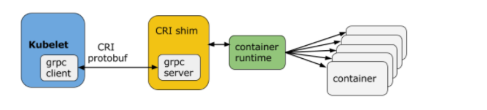
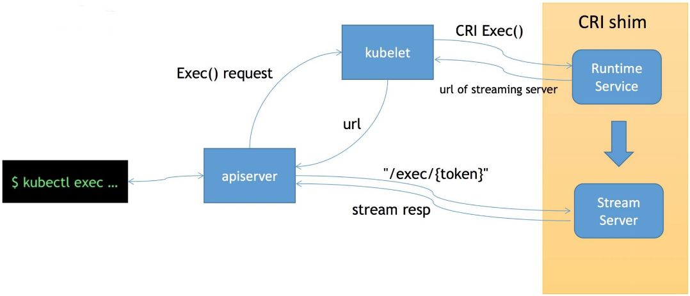

<!--Copyright © ZOMI 适用于[License](https://github.com/Infrasys-AI/AIInfra)版权许可-->

# K8S 运行时

> Author by: 何晨阳

前文中已经介绍完如何进行资源管理和调度，完成这些工作后，就需要将调度成功的 Pod 在宿主机中创建出来。这个正是 kubelet 通过 CRI 和底层容器运行时进行交互。

为什么需要抽象出 CRI 这个概念？

> 首先是统一容器生命周期管理接口，避免 Kubernetes 与特定容器运行时强绑定。支持多种容器运行时（Docker、containered、CRI-O）。其次是社区需要为不同运行时维护多套代码（如 dockershim、rktlet），阻碍生态发展。

## CRI 核心组件

在k8s中，CRI（ContainerRuntimeInterface）的核心组件包括kubelet、CRIshim和ContainerRuntime。它们共同协作，实现容器生命周期的管理。以下是三个组件简要介绍：

- kubelet：负责管理节点上的 Pod 和容器，通过 CRI 与容器运行时交互。
- CRI shim：实现 CRI 接口的适配层（如 dockershim、containerd-shim），作为 gRPC 服务端负责将 CRI 请求的内容转为具体的容器运行时 API 并响应。
- Container Runtime：实际执行容器操作的引擎（如 containerd、CRI-O）。

如下图所示，Kubelet是Kubernetes节点上的核心组件，负责管理Pod和容器的生命周期。它是CRI的调用方，通过CRI接口与容器运行时交互。Kubelet通过CRI定义的gRPC接口与容器运行时通信，无需关心底层实现细节。其核心功能包括：

- **Pod管理**：根据API Server下发的Pod配置，创建、更新或删除 Pod。
- **容器操作**：通过CRI接口调用容器运行时，执行容器的创建、启动、停止和删除。
- **资源监控**：收集节点资源使用情况（CPU、内存、存储等）并上报给 API Server。
- **健康检查**：执行容器存活探针（Liveness Probe）和就绪探针（Readiness Probe）。

**CRI shim**是容器运行时与CRI接口之间的适配层，负责将CRI请求转换为容器运行时能理解的指令。主要有以下三个主要功能：

- **协议转换**：将CRI的gRPC请求转换为容器运行时的原生API（如DockerAPI或containerdAPI）。
- **兼容性支持**：帮助非CRI原生运行时（如早期的Docker）接入k8s。
- **功能扩展**：实现CRI接口的扩展功能（如日志管理、流式执行命令）。

**Container Runtime**是实际管理容器生命周期的底层引擎，负责创建、运行和销毁容器。主要能力包括根据OCI规范创建容器进程、拉取和存储和删除容器镜像、通过Linux内核功能（cgroups、namespace）实现资源限制和隔离。

这种分层设计实现了k8s与容器运行时的解耦，使得用户可以根据需求灵活选择运行时（如安全容器Kata、轻量级运行时CRI-O），同时保持生态的统一性。



## kubelet 与 CRI 交互原理

整体架构如下图所示，当 k8s 创建一个 Pod 后，就会通过调度器选择一个具体的节点来运行。接着 kubelet 就会通过 SyncLoop 来执行具体的操作。本节主要介绍kubelet与CRI的交互原理。


### SyncLoop 是什么？

SyncLoop 是 kubelet 的工作核心，主要负责 Pod 生命周期的核心控制循环，负责保障 Pod 实际状态与期望状态一致。其核心职责包括：

- 监控 Pod 状态：持续监听 API Server 的 Pod 配置变更（如创建、更新、删除）。
- 协调 Pod 状态：根据最新配置，触发 Pod 的创建、更新或删除操作。
- 处理运行时异常：检测容器崩溃、资源不足等问题，并尝试恢复。

其主要输入的 Channel 包括：

- Pod 配置变更（来自 API Server 的 Watch 机制）。
- 定时同步触发（默认每 10 秒一次，由 sync-frequency 参数控制）。
- 容器运行时状态更新（如容器退出、镜像拉取失败）。
- 探针（Probe）结果（如 Readiness/Liveness 检查失败）。

主要逻辑在 syncPod 函数中执行，负责单个 Pod 的状态同步：

(1) 状态对比

对比实际状态和期望状态，期望状态来自 API Server 或静态 Pod 配置文件。实际状态通过容器运行时（如 containerd）查询当前容器状态。

(2) 操作执行

- 创建 Pod：创建 Pod 的沙箱环境（pause 容器）。按顺序启动 Init 容器和业务容器。挂载 Volume 并设置网络命名空间。
- 更新 Pod：对比新旧配置差异，仅更新变化的容器或资源（如镜像版本、环境变量）。
- 删除 Pod：发送 SIGTERM 信号终止容器。等待优雅终止超时后强制终止（SIGKILL）。清理 Volume 和网络资源。

(3) 状态回写

将 Pod 的当前状态（Status）和事件（Event）更新到 API Server，供控制器（如 Deployment Controller）使用。

### CRI 规范

CRI是k8s中用于解耦Kubelet与容器运行时的核心规范，旨在标准化容器生命周期的管理接口。CRI中主要定义了两类接口：

- ImageService：定义拉取、查看和删除镜像等操作。

```go
// ImageService defines the public APIs for managing images.
service ImageService {
    
    rpc ListImages(ListImagesRequest) returns (ListImagesResponse) {}
    
    rpc ImageStatus(ImageStatusRequest) returns (ImageStatusResponse) {}
   
    rpc PullImage(PullImageRequest) returns (PullImageResponse) {}
   
   
    rpc RemoveImage(RemoveImageRequest) returns (RemoveImageResponse) {}
   
    rpc ImageFsInfo(ImageFsInfoRequest) returns (ImageFsInfoResponse) {}
}
```

- RuntimeService：定义容器相关的操作。管理容器的生命周期，以及与容器交互的调用等操作。主要包括 container 和 PodSandbox 相关的管理接口，包括 exec、attach 等。

```go
// ImageService 定义镜像操作接口
service ImageService {
  // 拉取镜像
  rpc PullImage(PullImageRequest) returns (PullImageResponse) {}
  // 列出镜像
  rpc ListImages(ListImagesRequest) returns (ListImagesResponse) {}
  // 删除镜像
  rpc RemoveImage(RemoveImageRequest) returns (RemoveImageResponse) {}
  // 其他方法...
}
```


### CRI 生命周期

创建一个Pod整体流程如下图所示，通过 kubectl 来运行一个 Pod 时，会执行以下动作：

- 首先调用 RunPodSandbox 接口来创建一个 Pod 容器，Pod 容器是用来持有容器的相关资源的，比如说网络空间、PID 空间、进程空间等资源。
- 接着调用 CreatContainer 接口，在 Pod 容器的空间创建业务容器。
- 然后再调用 StartContainer 接口启动容器。
- 最后调用 StopContainer 与 RemoveContainer 接口删除容器。


### CRI streaming 接口

流式接口不仅可以节省资源，还能保证连接的可靠性，调用流程如下图所示。当执行 kubectl exec 命令时，其执行过程如下：
- 第一步：kubectl 将 exec 请求封装为一个 HTTP 请求，该请求将被 API Server 解析。
- 第二步：API Server 将请求转发至目标 Pod 所在节点的 kubelet，建立与 kubelet 的 WebSocket 连接，用于实时数据传输。
- 第三步：kubelet 接收请求后，通过 CRI 与容器运行时交互以执行命令。



### 为何要设计 CRI shim 这一模块？

最后再来探讨一个问题，为什么要设计 CRI shim 模块。早期 Kubernetes 最初直接依赖 Docker 的 API 管理容器，导致无法支持其他容器运行时（如 containerd、CRI-O）。还有一点原因就是用户的多样化需求，比如轻量级运行时等。

CRI shim 有哪些优势呢？

- 解耦核心组件：kubelet 仅需实现 CRI 客户端逻辑，无需为每个运行时编写适配代码。
- 支持多运行时：支持 Docker、containerd、CRI-O 等。
- 简化维护

## 总结与思考

当前已经支持了 containerd、CRI-O、Docker 等多种主流运行时。未来在安全方面，可以通过沙箱运行时，进一步提升多租户和敏感业务的安全性，同时结合细粒度资源管理，提升资源隔离和安全策略的灵活性。同时在插件化方面，可以进一步推动运行时功能插件化，提供扩展性更强的网络、存储等能力。


## 参考与引用
- https://www.cnblogs.com/zhangmingcheng/p/17495311.html
- https://jimmysong.io/book/kubernetes-handbook/interfaces/cri/

