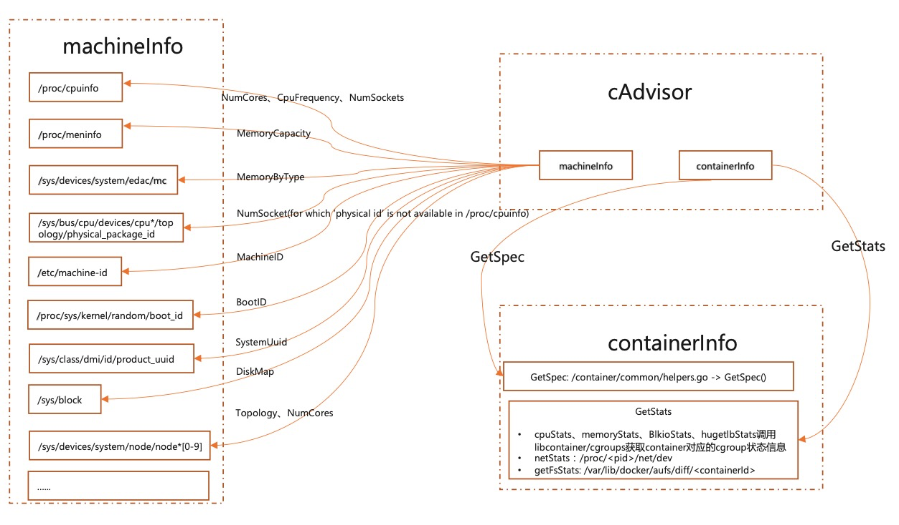
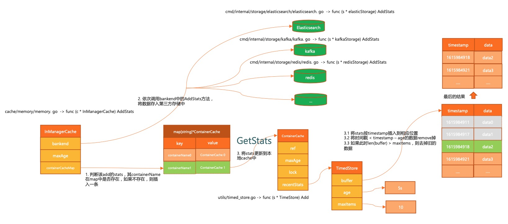
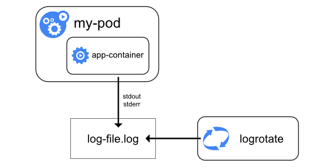

<!--Copyright © ZOMI 适用于[License](https://github.com/Infrasys-AI/AIInfra)版权许可-->

# Kubernetes 容器监控与日志

> Author by: 何晨阳

前文介绍了k8s的主体功能，本节将介绍对k8s的容器监控与日志机制，负责对系统整体运行健康状态的监测。通过监控与日志，可以帮助我们全方位的掌控系统健康状态，更加高效的排查问题。

## 容器监控体系

容器监控体系旨在实时追踪容器化应用与集群资源的状态，为故障排查、性能优化和容量规划提供数据支撑。本小节将从监控指标、数据采集与监控工具三个方向来介绍。

监控主要有以下几个作用：
- 资源利用率监控：实时跟踪 CPU、内存、磁盘、网络等资源使用情况。
- 应用健康检查：确保容器进程存活、服务可达性、响应延迟可控。
- 故障诊断与根因分析：快速定位性能瓶颈（如内存泄漏、CPU 争抢）。
- 自动化运维支持：为 HPA（自动扩缩容）、VPA（垂直扩缩容）提供数据依据。

如下图所示，一个成熟监控方案中主要包括指标采集、监控工具、告警等几个模块。


### 监控指标

监控数据主要来源于监控对象，在k8s中，监控对象可以分为应用层、Node层、容器层以及k8s对象状态。

#### 应用层（Application）

由应用层自定义上传相关监控指标，不同系统的监控指标又各不相同。一些常见的指标如下：

- **延迟**：比如SQL执行延迟，用于识别慢查询、网络瓶颈或代码性能问题。
- **流量**：单位时间内的请求量或数据吞吐量，评估负载压力，触发自动扩缩容（HPA）。
- **错误数**：失败请求数，监控服务异常。
- **饱和度**：资源利用率接近上限的程度，用于预防资源耗尽导致雪崩效应。

#### Node层指标

Node层主要关注节点资源使用、健康状态及底层服务运行情况。关注指标主要包括以下：

- CPU 使用率：node_cpu_seconds_total，用于识别CPU过载。
- 内存使用量：node_memory_MemTotal_bytes、node_memory_MemAvailable_bytes。
- 磁盘 I/O：node_disk_read_bytes_total（读取量）、node_disk_written_bytes_total（写入量）。
- 网络流量：node_network_receive_bytes_total（接收流量）和node_network_transmit_bytes_total（发送流量）。


#### 容器层指标

容器层关注的指标和 Node 层类似，除了一些基础指标外，还关注一些容器的特有指标：

- 容器CPU使用率：表示容器在单位时间内消耗的CPU资源占其请求（Request）或限制（Limit）的比例，反映计算密集型任务的资源压力。
- 容器内存使用量：容器实际占用的物理内存。
- 容器重启次数：容器因异常退出（如崩溃、探针失败）而被Kubernetes自动重启的次数，反映应用稳定性。
- 容器网络流量：包括接收（入站）和发送（出站）的数据量，用于分析应用通信模式及网络性能。

### 数据采集工具 cAdvisor

cAdvisor 由 Goole 开发的容器监控工具，是Kubernetes生态中容器资源监控的核心组件，默认集成在 kubelet中，专注于实时收集、聚合和展示容器级别的资源使用数据，为容器化提供基础监控能力。

#### 主要功能

资源监控：

- CPU：使用时间、利用率、限制。
- 内存：工作集（Working Set）、缓存（Cache）、交换（Swap）。
- 文件系统：磁盘 I/O、存储使用量。
- 网络：接口流量、错误计数。

容器层级统计：
- 支持容器、Pod、节点多级视图。
- 提供历史数据（默认存储最近 1 分钟的数据）。

事件记录：
- 容器启动、停止、OOM（内存溢出）等事件。

#### 数据采集过程

数据采集主要包括两个部分：machineInfo 和 containerInfo。

machine 相关的数据主要读取机器的系统文件数据，然后由一个周期任务，更新本地 cache。具体读的文件数据见下图。



获取容器相关的数据，主要是监控 cgroupPath 目录下的变更，拿到该目录下的增删改查事件，然后更新 cache 中的数据。

#### 数据存储

监控数据不仅能放在本地，还能存储到第三方存储介质中。支持 bigquery、es、influxdb、kafka、redis 等组件。

执行过程如下所示：

- 1. 首先通过 memory 接口，将数据存在本地。
- 2. 将新写入的监控数据根据时间戳，进行聚合处理。
- 3. 调用各介质的 AddStats 方法，将数据存入第三方存储介质。



### 监控工具 Prometheus

#### 核心设计

Prometheus是一款开源的时序数据库与监控告警系统，专为云原生环境设计，已成为Kubernetes生态中监控事实标准。原生的支持对K8S中各个组件进行监控。

架构图如下所示，主要包括以下几个核心模块：

**Prometheus Server**：作为监控系统的大脑，主要工作是根据配置定期从目标拉取指标。

- 抓取器（Retriever）：定期从配置的目标（如 Exporters、应用端点）拉取指标。
- 时序数据库（TSDB）：高效存储时间序列数据。
- HTTP Server：提供查询接口（PromQL）和 Web UI。

**Exporters**：将第三方系统（如Node Exporter、MySQL Exporter）的指标转换为Prometheus格式。

- 节点导出器（Node Exporter）：采集主机资源指标（CPU、内存、磁盘）。
- 应用导出器（如 JMX Exporter）：将应用指标转换为 Prometheus 格式。

**Pushgateway**：用于接收短期任务推送的指标，供Prometheus拉取。

- 用于短期任务或批处理作业的指标暂存（Prometheus 默认拉取模型不适用）。

**Alertmanager**：根据监控中的设置的指标阈值发送警报。同时支持对告警去重、抑制和分组。

- 处理 Prometheus 的告警通知，支持去重、分组、静默和路由到不同渠道（Email、Slack 等）。

**Client Libraries**：可以作为一个Library集成到应用中，暴露自定义指标。

比如go接入示例如下所示：
```go
httpRequests := prometheus.NewCounterVec(
  prometheus.CounterOpts{
    Name: "http_requests_total",
    Help: "Total HTTP requests",
  },
  []string{"method", "path"},
)
prometheus.MustRegister(httpRequests)
```


#### 指标类型

Prometheus中主要包括以下几类指标类型：

- Counter：计数器，单调递增的累计值，比如请求个数等。
- Gauge：仪表盘，可增可减的瞬时值，如 CPU、内存等。
- Histogram：直方图，采样观测值的分布，比如请求的响应时间，小于 10ms 有多少个，小于 50ms 有多少个等。
- Summary：类似直方图，只是表现形式不同，比如请求响应时间，70%小于 10ms，90%小于 50ms。

#### 使用示例

使用 Helm 部署（推荐）

第一步：安装 helm

```
# 安装 Helm CLI
curl https://raw.githubusercontent.com/helm/helm/main/scripts/get-helm-3 | bash
```

第二步：添加 Prometheus Helm 仓库

```
# 安装 Helm CLI
curl https://raw.githubusercontent.com/helm/helm/main/scripts/get-helm-3 | bash
```

第三步：部署 Prometheus

```
# 创建命名空间
kubectl create ns monitoring
# 安装 Prometheus Stack（包含 Prometheus + Grafana + Alertmanager）
helm install prometheus prometheus-community/kube-prometheus-stack \
  --namespace monitoring \
  --set prometheus.prometheusSpec.storageSpec.volumeClaimTemplate.spec.storageClassName="<your-storage-class>" \
  --set prometheus.prometheusSpec.storageSpec.volumeClaimTemplate.spec.resources.requests.storage="50Gi"
```

第四步：验证部署

```
kubectl get pods -n monitoring
```

第五步：访问服务

```
kubectl port-forward -n monitoring svc/prometheus-prometheus-oper-prometheus 9090
# 访问 http://localhost:9090
```

#### 告警配置示例

比如监控 api-server 服务的请求延迟，当 5 分钟平均延迟持续 10 分钟超过 0.5 秒时，触发严重告警。

```yaml
groups:
- name: example
  rules:
  - alert: HighRequestLatency
    expr: job:http_request_duration_seconds:mean5m{job="api-server"} > 0.5
    for: 10m
    labels:
      severity: critical
    annotations:
      summary: "High request latency on {{ $labels.instance }}"
```

## 容器日志

日志通常是我们排查问题的一大杀器，在云原生中，容器应用和传统应用的日志管理存在很大区别。本节将介绍k8s中的日志管理方案。

### Kubernetes 日志种类

k8s中主要存在两种类型的日志：

- 集群组件日志：1）运行在容器中的 scheduler、kube-proxy、kube-apiserver 等。2）未运行在容器中的 kubelet 和 runtime 等。
- Pod 日志

### 应用 POD 日志

Pod 的日志管理是基于 Docker 引擎，日志的存储都是基于 Docker 的日志管理策略。



如果 Docker 日志驱动为 json-file，那么在 k8s 每个节点上，kubelet 会为每个容器创建一个/var/log/containers/的软链接，并会将其链接到/var/log/pods/目录下相应 pod 目录的容器日志。被链接的日志文件也是软链接，最终链接到 Docker 容器引擎的日志存储目录：/docker 数据盘目录/containers 下相应容器的日志。


可以看出这个地方进行了两次软链接，为什么要做两次软链接呢？

主要是为了方便日志采集。/var/log/containers/目录下软链接了当前节点所有 Pod 下所有容器的所有日志文件，这样采集工具只需要采集/var/log/containers/目录就能采集到当前节点下的所有容器日志文件

### k8s 日志收集方案

k8s 官方给出三种日志收集方案：

- 使用运行在每个节点上的节点级日志代理
- 在应用 Pod 中增加记录日志的 sidecar 容器
- 应用直接将日志输出到自定义位置中，如日志平台

#### 节点级日志代理方案

每个节点运行一个日志代理，以 DaemonSet 方式运行在每个节点中，由这个 agent 将日志转发出去。日志代理工具有 fluentd、filebeat 和 logstash 等。

在 Node 上部署 logging agent 主要的优点是一个节点只需要部署一个 agent，不会对应用 Pod 产生侵入性。缺点就是要求应用输出的日志，要直接输出到容器的 stdout 和 stderr 中。


#### sidecar 容器方案

针对日志代理方案的缺点，可以通过一个 sidecar 容器把这些文件重新输出到 sidecar 的 stdout 和 stderr 上。比如应用 Pod 中有一个容器，它把日志输出到容器的/var/log/a.log 和 b.log 中，此时使用 kubectl logs 是看不到应用日志的。这种情况下就可以为这个 Pod 添加两个 sidecar 容器，分别将这两个日志文件以 stdout 和 stderr 的方式输出来。

这种方案的缺点是宿主机上会存在两份相同的日志文件：一份是自己写的，一份是 sidecar 的 stdout、stderr 对应的 json 文件，会造成磁盘的浪费。


使用 sidecar 还有另一种方式，就是不需要节点级日志代理。和应用容器在一起的 sidecar 直接运行在 Pod 中，由 sidecar 直接把日志传输到日志平台。这种方式在 Pod 数量很多的时候，资源消耗会很高。另一种缺点是由于日志没有打到 stdout 和 stderr，所以无法使用 kubectl logs 查看日志。

#### 应用直接输出

由应用直接将日志输出到日志平台，比如 Java 应用中的 appender。这种方案要求公司具有比较健壮的日志系统。

## 总结与思考

k8s 容器监控已形成以 Prometheus 为核心的多层次生态，结合 cAdvisor、Metrics Server 等实现资源、应用、节点等多维指标采集。支持自动扩缩容、可视化和分布式追踪。

未来在可观测性方面，可以结合 AI/ML，来自动识别性能异常、故障根因、异常流量、攻击行为。并基于历史指标与日志数据预测资源瓶颈、服务异常，提前扩容或修复。这些能力可以进一步提升整个系统的可观测性与智能化能力。

## 参考文档

- https://www.cnblogs.com/chenqionghe/p/11718365.html
- https://www.cnblogs.com/cheyunhua/p/17126430.html
- https://www.cnblogs.com/evescn/p/18256900
- https://www.cnblogs.com/vinsent/p/15830271.html
- https://www.cnblogs.com/zhangmingcheng/p/16452365.html
- https://www.huweihuang.com/kubernetes-notes/monitor/cadvisor-introduction.html
- https://flashcat.cloud/blog/prometheus-architecture/
