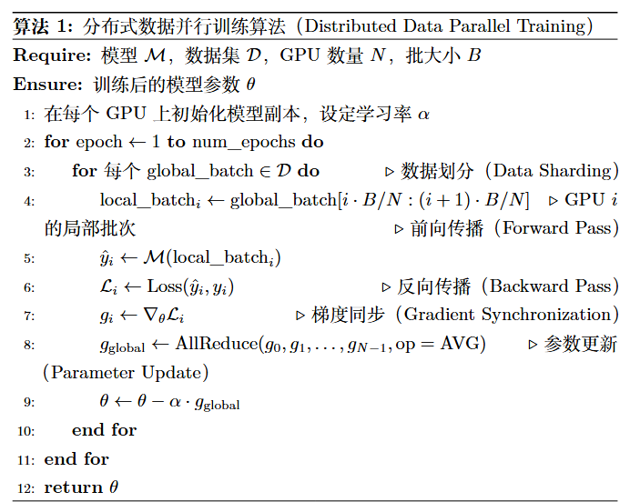
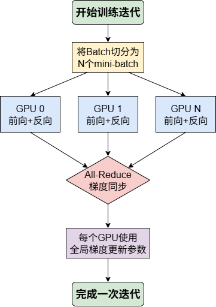
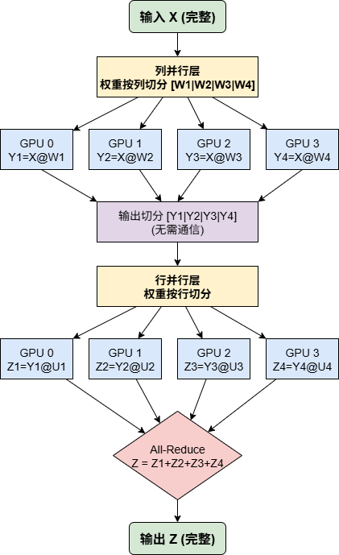
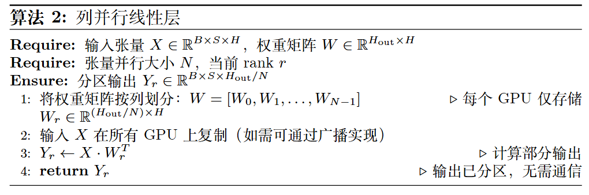
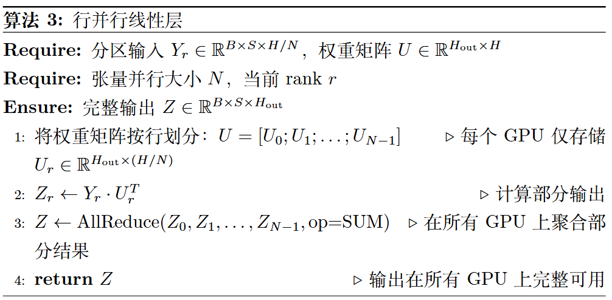
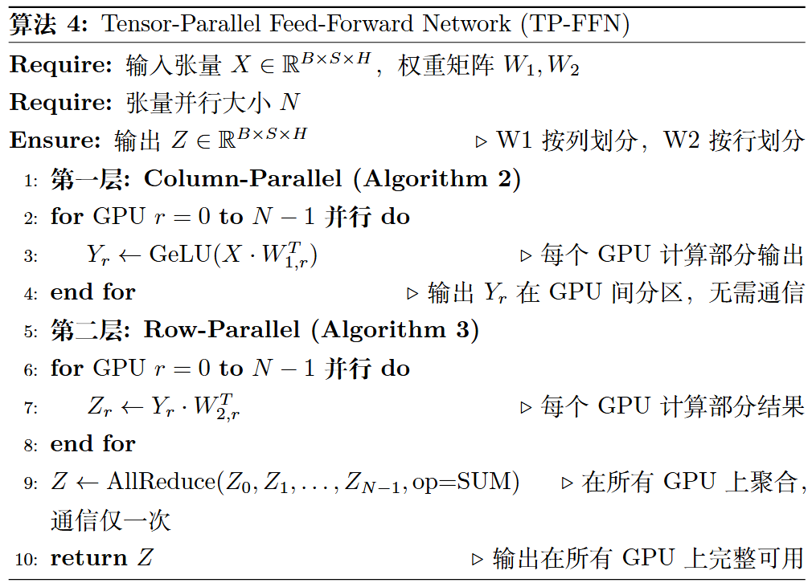
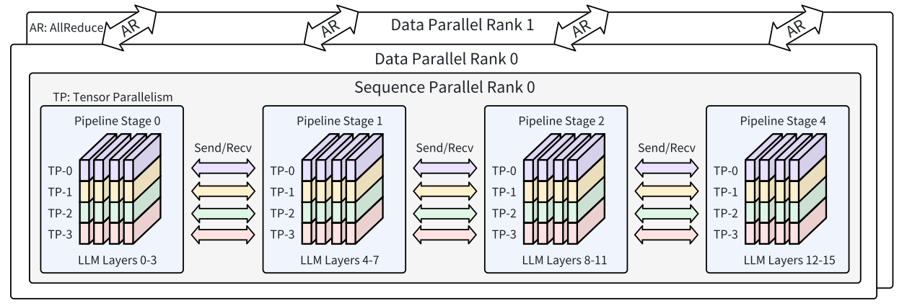

<!--Copyright © ZOMI 适用于[License](https://github.com/Infrasys-AI/AIInfra)版权许可-->

# 02.SPTD 并行与大模型(DONE)

> Author by: 于嘉阔

随着大语言模型参数量的持续增加，单机单卡的算力与显存已远远无法满足其训练需求。传统的数据并行或单一的模型并行策略，在面对数百亿乃至万亿参数的 Transformer 结构大模型时，效率和可扩展性均遇到瓶颈。为此，业界逐步形成了一套融合多种并行思路的混合框架，即 SPTD 并行——该并行策略主要用于对 Transformer 架构进行并行优化，通过多维度切分计算与存储负载，适配 Transformer 大模型的结构特性。

SPTD 并行之所以高效，是因为它涵盖的四个策略分别解决了 Transformer 大模型不同维度的挑战：序列并行（Sequence Parallelism, SP）专注于应对 Transformer 注意力机制中，序列长度增长带来的显存压力；流水线并行（Pipeline Parallelism, PP）解决了 Transformer 模型深度（层数）过大而无法单机容纳的难题；张量并行（Tensor Parallelism, TP）则攻克了 Transformer 单层宽度（如注意力头数量、前馈网络维度）过大导致的参数量瓶颈；而数据并行（Data Parallelism, DP）则从根本上扩展了数据吞吐能力，实现 Transformer 大模型训练的规模化加速。

通过混合使用这些策略，训练系统能够充分利用硬件资源，实现跨节点、跨设备的高效协同训练。在这一节中，我们将以 Transformer 结构为主的大模型为核心对象，系统阐述 SPTD 并行的基本概念、应用方式以及工程实践，帮助读者理解当前 Transformer 大模型训练的主流技术路径。

## 1. SPTD 并行概念

SPTD 并行是一种面向超大规模 Transformer 结构大模型的混合并行训练范式，通过在不同维度上分解 Transformer 的计算与存储负载（如注意力层、前馈网络层的运算，以及序列数据的处理），并映射到不同层次的硬件架构，最大化算力利用率并降低通信瓶颈。

### 1.1 数据并行 DP

数据并行是最为经典且广泛应用的并行策略，其核心思想可概括为“模型复制，数据分片”，在 Transformer 大模型训练中是提升吞吐率的基础手段。在数据并行模式下，每个参与训练的 GPU 都会保有一份完整的 Transformer 模型副本（包括所有注意力层、前馈网络层的参数）。训练开始时，一个大的数据批次（Batch）会被切分成多个子批次（mini-batch），并分发给不同的 GPU。每个 GPU 独立对自己分到的数据进行前向传播（计算 Transformer 各层的激活值与损失）、反向传播（计算各层参数的梯度），至此完成对模型参数的“修改意见”计算。

下一步是梯度同步，这一聚合步骤的有效性源于梯度计算的基本数学原理：

$$
\frac{\partial Loss(D)}{\partial w} = \frac{\partial \frac{1}{N} \sum_{i=1}^{N} Loss(x_i, y_i)}{\partial w} = \frac{1}{N} \sum_{i=1}^{N} \frac{\partial Loss(x_i, y_i)}{\partial w}
$$

如公式所示，对于整个数据批次 $D$ 的总损失 $Loss(D)$，其关于 Transformer 模型权重 $w$（如注意力层的查询/键/值矩阵、前馈网络的权重矩阵）的梯度，等价于各样本梯度的均值。这一原理允许每个 GPU 独立计算子批次梯度，再通过 All-Reduce 集体通信操作聚合所有梯度并取平均，得到全局梯度。最后，每个 GPU 用全局梯度更新本地模型副本，确保迭代前所有设备的 Transformer 参数完全一致。

早期的 DP 实现（如 PyTorch-DDP[1]）虽易于实现，但未解决 Transformer 大模型的显存瓶颈——每个 GPU 仍需承载完整的模型参数、梯度和优化器状态（如 Adam 优化器的动量项）。为攻克这一难题，DeepSpeed 的 ZeRO（Zero Redundancy Optimizer）[2]、PyTorch 的 FSDP（Fully Sharded Data Parallelism）[3]等全分片数据并行技术应运而生：它们不仅分片数据，还将 Transformer 的参数、梯度、优化器状态分片到所有 GPU。计算时，每个 GPU 通过 All-Gather 动态收集所需 Transformer 层的完整参数，计算后立即丢弃，大幅降低单卡峰值显存占用[2, 3]。这种“化整为零”的策略让训练千亿级 Transformer 大模型成为可能，尽管会引入一定通信开销。数据并行本质是“向外扩展（Scale-out）”策略，通过增加设备处理更多数据，是 Transformer 大模型训练集群的效率基石。

<em>算法 1：Transformer 大模型的分布式数据并行训练</em>

下面介绍 DDP 算法在 Transformer 训练中的应用：如算法 1 及后续图 1 所示，DDP 核心流程分为四阶段：首先，大批次数据切分（Data Sharding）后分发给各 GPU（算法 1 第 4 行）；其次，各 GPU 在本地独立执行 Transformer 的前向传播（计算注意力、前馈网络激活值）与反向传播（计算各层梯度）（算法 1 第 5-7 行）；关键的第三步是梯度同步——所有 GPU 通过 All-Reduce 聚合梯度，确保各设备获得一致的全局梯度（算法 1 第 8 行）；最后，各 GPU 用全局梯度更新本地 Transformer 参数（算法 1 第 9 行），完成迭代并保持模型一致性。这种方式的优点是实现简单，瓶颈在于单卡需承载完整 Transformer 模型，参数规模过大时易显存不足。

<em>图 1：Transformer 大模型数据并行单次迭代流程图</em>

### 1.2 张量并行 TP

当 Transformer 大模型的单层规模（如注意力头数量过多、前馈网络维度过大）超出单卡容纳能力时，数据并行便无能为力。此时，张量并行通过“层内横向切分”，将 Transformer 单层的大规模矩阵运算分解到多个 GPU 协同完成，是优化 Transformer 层内计算的核心策略。最具代表性的实现是 NVIDIA 的 Megatron-LM[4]，它通过“列并行（Column Parallelism）+行并行（Row Parallelism）”的组合，适配 Transformer 前馈网络、注意力层的矩阵运算特性（如图 2 所示）。

<em>图 2：张量并行应用于 Transformer 前馈网络的计算与通信流程图</em>

列并行与行并行针对 Transformer 线性层（如前馈网络的 $Y = XA$、注意力层的 $QK^T$）的矩阵运算设计：

- 列并行：将权重矩阵 $A$ 按列切分（$A = [A_1, A_2, ...]$），每个 GPU 计算 $Y_i = XA_i$，最终通过拼接（Concat）得到完整输出 $Y = [Y_1, Y_2, ...]$，此过程无需额外通信；
- 行并行：将权重矩阵 $A$ 按行切分（$A = [A_1; A_2; ...]$），同时将输入 $X$ 按列切分（$X = [X_1, X_2, ...]$），每个 GPU 计算 $Y_i = X_iA_i$，最终通过 All-Reduce 聚合得到完整输出 $Y = Y_1 + Y_2 + ...$。

在 Transformer 前馈网络（FFN，公式为 $Z = \text{Dropout}(\text{GeLU}(XW_1)W_2)$）中，Megatron-LM 巧妙结合两种并行方式：

1. 第一线性层（$XW_1$）采用列并行：权重 $W_1$ 按列切分，完整输入 $X$ 复制到各 GPU，并行计算 $Y_r = \text{GeLU}(X \cdot W_{1,r})$——此时 $Y_r$ 是分散存储的，恰好匹配下一层行并行的输入需求；
2. 第二线性层（$Y W_2$）采用行并行：权重 $W_2$ 按行切分，各 GPU 直接用本地 $Y_r$ 计算 $Z_r = Y_r \cdot W_{2,r}$，省去层间数据聚合（如 All-Gather）的通信开销；
3. 最终通过一次 All-Reduce 聚合 $Z_r$，得到完整的 FFN 输出 $Z$（如算法 4 所示）。

这种设计让 Transformer 前馈网络的计算仅需一次通信，极大优化了效率。同理，张量并行也可应用于 Transformer 注意力层的 $QK^T$、$KV$ 矩阵运算，通过切分查询/键/值矩阵，降低单卡计算与存储压力。

<em>图 3：张量并行应用于 Transformer 注意力层的计算与通信流程图</em>

<em>算法 3：Transformer 线性层的行并行实现</em>

<em>算法 4：Transformer 前馈网络的张量并行实现</em>

### 1.3 流水线并行 PP

与张量并行在 Transformer 层内“横向切分”不同，流水线并行是“纵向切分”策略：将 Transformer 大模型的上百层网络（如 GPT-3 的 96 层）按顺序切分成多个连续阶段，每个阶段由一个或一组 GPU 负责。训练时，数据像流水线一样流经各阶段——前一阶段完成 Transformer 某几层的计算后，将激活值传递给下一阶段，直至完成全量前向传播；反向传播则从最后一个阶段反向传递梯度至第一个阶段。

这种模式天然适配 Transformer“多层堆叠”的结构特性，非常适合跨节点、跨服务器场景——阶段间仅需传递激活值/梯度，对节点间通信带宽的要求远低于张量并行。

<em>图 4：Transformer 大模型流水线并行核心步骤示意图</em>

流水线并行的核心挑战是“流水线气泡（Pipeline Bubble）”：启动和排空阶段部分 GPU 空闲，导致资源利用率下降。为优化这一问题，现代方案（如 GPipe[5]、PipeDream[6]）引入“微批次（Micro-batch）+1F1B（One Forward, One Backward）”调度，适配 Transformer 的迭代训练特性：

1. 将大批次数据切分成多个微批次，交错执行前向/反向传播；
2. 一个微批次完成某阶段前向计算后，立即送入下一阶段，无需等待全批次；
3. 某微批次满足反向计算条件（如后续阶段完成其前向）时，立即调度反向传播。

这种调度让 GPU 紧密衔接工作，减少空闲时间。此外，需通过模型分区算法平衡各阶段的 Transformer 层计算负载，避免“木桶效应”——例如将计算密集的注意力层与前馈网络层均匀分配到各阶段。流水线并行是连接多计算节点、构建 Transformer 大模型训练集群的关键技术。

### 1.4 序列并行 SP

随着 Transformer 大模型对长文本理解能力的需求增长，输入序列长度（如从 4K 扩展到 128K）急剧增加，带来新的挑战：Transformer 自注意力机制的计算与显存复杂度为 $O(L^2)$（$L$ 为序列长度），超长序列下 KV Cache、注意力矩阵的显存开销成为瓶颈。序列并行专为解决这一问题设计，它沿着“序列长度维度”切分输入数据，而非在 Transformer 的宽度（TP）或深度（PP）上切分，每个 GPU 仅处理序列的一个片段（Chunk）。

在 Transformer 层中，非依赖序列上下文的计算（如 FFN、LayerNorm），各 GPU 可独立处理本地序列片段，无需通信；核心挑战在于自注意力层——每个 Token 需关注全序列 Token，因此需通过通信实现全局交互。当前主流方案是“环形通信（Ring-based）”，例如 Ring Self-Attention[7]：

1. 每个 GPU 持有序列片段对应的 Query（Q）、Key（K）、Value（V）张量；
2. 计算注意力时，GPU 将本地 K/V 片段传递给环上的下一个 GPU，同时接收上一个 GPU 的 K/V 片段；
3. 多轮环形传递后，每个 GPU 的 Q 片段可与全序列的 K/V 交互，计算出完整注意力结果。

这种方式将巨大的 KV Cache 分散存储到多 GPU，结合“选择性激活重计算”[8]进一步降低显存占用。更先进的 DeepSpeed-Ulysses[9]则通过 All-to-All 通信，在序列维度与注意力头维度间切换分片，适配 FlashAttention 等高效算子，让序列并行与 Transformer 注意力层的优化深度结合。序列并行是实现百万级上下文窗口 Transformer 大模型训练的核心技术。

### 1.5 多维并行

为清晰理解 SPTD 四种并行策略的差异，从多个维度进行对比：

| 策略 | 核心思想 | 切分对象 | 主要解决问题 | 通信瓶颈 |
| :--- | :--- | :--- | :--- | :--- |
| **SP**(序列并行) | 序列切分，逐块计算 | Transformer 输入数据的序列维度 | Transformer 注意力层中序列过长导致的 KV Cache、注意力矩阵显存爆炸 | 激活值（K/V）的环形传递或 All-Gather |
| **PP**(流水线并行) | 层间并行，模型分段 | Transformer 的多个连续层（深度维度） | Transformer 模型层数过多，单卡无法容纳完整模型 | 阶段间的激活值/梯度传递 |
| **TP**(张量并行) | 层内并行，张量切分 | Transformer 单层的权重矩阵（宽度维度） | Transformer 单层参数量过大（如注意力头、前馈网络维度高），单卡无法容纳 | 激活值的 All-Reduce（行并行）或拼接（列并行） |
| **DP**(数据并行) | 模型复制，数据切分 | 训练数据 Batch | Transformer 训练速度慢，需通过更大 Batch 提升吞吐率 | 梯度的 All-Reduce |

实践中，单一并行策略无法覆盖 Transformer 大模型的所有瓶颈，因此 SP、PP、TP、DP 常被组合使用：

- 传统“3D 并行”：DP（外层扩展吞吐）+ PP（中层切分深度）+ TP（内层切分宽度），适配千亿级 Transformer 模型；
- 加入 SP 后的“4D 并行”：在 3D 并行基础上，通过 SP 切分序列维度，解决超长上下文场景的显存问题，是当前万亿级 Transformer 大模型的主流范式。

<em>图 5：Transformer 大模型 4D 并行（DP+PP+TP+SP）架构示例</em>

上图的 4D 并行架构从外到内分为三层，每层对应 Transformer 大模型的一个优化维度：

1. 最外层（DP）：通过复制 Transformer 模型扩展吞吐率，不同 Data Parallel Rank 处理不同数据，迭代末通过 All-Reduce 同步梯度；
2. 中间层（PP）：将 Transformer 按深度切分为多个 Pipeline Stage，跨节点传递激活值/梯度，解决层数过多问题；
3. 最内层（TP+SP）：在单机多卡环境下，TP 切分 Transformer 单层的权重矩阵（如注意力头、前馈网络），SP 切分输入序列，共同优化层内计算与显存压力。

这种分层策略实现了“吞吐率（DP）、模型深度（PP）、模型宽度（TP）、序列长度（SP）”四个维度的全面扩展，是 Transformer 大模型训练的标准并行框架。

## 2. Transformer 结构特征

Transformer 结构大模型（如 GPT 系列、LLaMA、BERT、PaLM）是当前大语言模型的主流范式，其核心特征围绕“全参数参与计算、多层堆叠结构、注意力机制依赖”展开，这些特征也决定了 SPTD 并行的优化方向：

（1）全参数参与计算

Transformer 大模型的所有参数（注意力层的 Q/K/V 矩阵、前馈网络的权重、LayerNorm 参数等）均参与前向与反向传播，保证了模型的表达能力与优化一致性。但随着参数量从数十亿扩展到万亿级，单卡显存无法承载完整模型——这也是 TP、DP（全分片）等并行策略需解决的核心问题。

（2）显存与通信压力集中

训练时，Transformer 不仅需存储参数、梯度、优化器状态，还需保存注意力层的 KV Cache、各层激活值（用于反向传播），显存开销远高于传统模型。同时，分布式训练中，参数同步（TP 的 All-Reduce）、激活值传递（PP 的跨阶段通信）带来巨大通信负担，尤其跨节点场景下，通信延迟易成为瓶颈。

（3）结构规则化，适配并行切分

Transformer 的层结构具有高度重复性（如“注意力层+前馈网络层”的循环堆叠），单层内部的计算模式固定（矩阵乘法、LayerNorm、激活函数）。这种规则性让 SPTD 并行可精准适配：TP 切分层内矩阵运算、PP 切分多层堆叠、SP 切分序列数据、DP 切分训练数据，无需复杂的结构适配。

（4）长上下文依赖带来的序列挑战

Transformer 的注意力机制依赖“全序列交互”，序列长度直接影响模型的上下文理解能力。但随着序列长度增加，注意力计算复杂度呈平方增长，KV Cache 的显存开销也急剧上升——这一挑战专门由 SP 并行解决，通过序列切分分散存储与计算压力。

（5）高算力与能耗需求

训练千亿级 Transformer 大模型需数千块 GPU 长期运行（如 GPT-3 训练消耗约 3.64E23 FLOPs），算力与能耗成本极高。SPTD 并行通过提升硬件利用率（如 PP 减少 GPU 空闲、TP/SP 降低显存浪费），间接降低单位训练成本，是平衡性能与成本的关键。

这些特征表明：Transformer 结构大模型的训练需多维度并行优化，而 SPTD 并行通过针对性解决“参数规模、层数、序列长度、吞吐率”问题，成为支撑其可扩展训练的核心技术。

## 3. SPTD 在大模型中应用

Transformer 结构大模型因“参数量大、层数深、序列长度长”，训练过程面临显存不足、通信频繁、梯度同步开销高等问题。传统单一并行策略（如仅用 DP 或 TP）难以兼顾效率与可扩展性，而 SPTD 并行通过多维度协同优化，成为 Transformer 大模型训练的核心方案：

（1）SP 适配 Transformer 的长序列注意力计算

Transformer 的注意力层是长序列场景的主要瓶颈（$O(L^2)$ 复杂度）。SP 通过序列切分，将 KV Cache 与注意力矩阵分散到多 GPU：例如序列长度为 32K 时，用 8 张 GPU 切分后，单卡仅需处理 4K 序列片段的 KV Cache，显存占用降至 1/8。同时，环形通信或 All-to-All 通信保证了注意力“全序列交互”的正确性，结合 FlashAttention 等算子，可实现 128K 甚至更长序列的高效训练（如 GPT-4 的长上下文版本）。

（2）TP+PP 优化 Transformer 的多层与层内结构

Transformer 的“多层堆叠+单层大参数量”特性，需 TP 与 PP 协同优化：

- TP 针对单层大参数量：如 GPT-3 的注意力层有 12 个注意力头、前馈网络维度为 4096，TP 将 Q/K/V 矩阵按头切分、前馈网络权重按列/行切分，使单卡仅承载 1/4 或 1/8 的单层参数；
- PP 针对多层堆叠：将 GPT-3 的 96 层切分为 8 个 Pipeline Stage，每个 Stage 处理 12 层，跨节点传递激活值，解决“单卡无法容纳全量层数”问题。

两者结合可将 Transformer 的“层内+层间”压力分散到多设备，是千亿级模型训练的基础。

（3）全分片 DP 降低 Transformer 的显存冗余

传统 DP 中，每个 GPU 存储完整 Transformer 模型，显存冗余高。ZeRO、FSDP 等全分片 DP 技术，将 Transformer 的参数、梯度、优化器状态按层分片：例如 16 张 GPU 训练时，单卡仅存储 1/16 的参数，显存占用大幅降低。同时，计算时通过 All-Gather 动态收集所需层参数，保证前向/反向的正确性——这种方式让单卡可训练原本需 16 卡承载的模型，极大提升了显存利用率。

（4）工程实践中的效率验证

SPTD 并行在 Transformer 大模型训练中已被广泛验证：

- Megatron-LM 用“TP+PP+DP”实现了 1750 亿参数 GPT-3 的训练，在 1024 张 GPU 上达到接近线性的加速比；
- DeepSpeed 结合 ZeRO（全分片 DP）与 SP，实现了 1 万亿参数模型的训练，显存占用降低 50%以上；
- PaLM 训练中，“DP+PP+TP+SP”的 4D 并行策略，让 5400 亿参数模型在 6144 张 TPU 上高效运行，单轮训练时间缩短 30%。

## 4. 总结与思考

SPTD 并行通过“序列（SP）、张量（TP）、流水线（PP）、数据（DP）”四个维度的协同优化，精准适配了 Transformer 结构大模型的核心特征——针对全参数参与计算设计 TP/全分片 DP，针对多层堆叠设计 PP，针对长序列注意力设计 SP，最终实现了“显存占用降低、通信效率提升、硬件利用率提高”的目标。

它不仅解决了 Transformer 大模型从百亿到万亿级参数量的训练瓶颈，还为长上下文场景（如百万级 Token）提供了可行的并行方案。未来，随着 Transformer 模型规模进一步扩大，SPTD 并行与“算子优化（如 FlashAttention）、激活重计算、异构硬件（GPU/TPU/DPU）”的结合，将成为大模型训练效率提升的关键方向。

## 参考与引用

1. Li, S., Zhao, Y., Varma, R., Salpekar, O., Noordhuis, P., Li, T., ... & Smith, J. (2020). Pytorch distributed: Experiences on accelerating data parallel training. *arXiv preprint arXiv:2006.15704*.
2. Rajbhandari, S., Rasley, J., Ruwase, O., & He, Y. (2020). Zero: Memory optimizations toward training trillion parameter models. In *SC20: International Conference for High Performance Computing, Networking, Storage and Analysis* (pp. 1-16). IEEE.
3. Zhao, Y., Gu, A., Varma, R., Luo, L., Huang, C. C., Xu, M., ... & Shleifer, S. (2023). Pytorch fsdp: Experiences on scaling fully sharded data parallel. *Proceedings of the VLDB Endowment, 16(12)*, 3848-3860.
4. Shoeybi, M., Patwary, M., Puri, R., LeGresley, P., Casper, J., & Catanzaro, B. (2019). Megatron-lm: Training multi-billion parameter language models using model parallelism. *arXiv preprint arXiv:1909.08053*.
5. Huang, Y., Cheng, Y., Bapna, A., Firat, O., Chen, D., Chen, M., ... & Le, Q. V. (2019). Gpipe: Efficient training of giant neural networks using pipeline parallelism. *Advances in neural information processing systems, 32*.
6. Narayanan, D., Harlap, A., Phanishayee, A., Seshadri, V., Devanur, N. R., Ganger, G. R., ... & Zaharia, M. (2019). Pipedream: generalized pipeline parallelism for dnn training. In *Proceedings of the 27th ACM symposium on operating systems principles* (pp. 1-15).
7. Li, S., Xue, F., Baranwal, C., Li, Y., & You, Y. (2023). Sequence parallelism: Long sequence training from system perspective. In *Proceedings of the 61st Annual Meeting of the Association for Computational Linguistics (Volume 1: Long Papers)* (pp. 2391-2404).
8. Korthikanti, V. A., Casper, J., Lym, S., McAfee, L., Andersch, M., Shoeybi, M., & Catanzaro, B. (2023). Reducing activation recomputation in large transformer models. *Proceedings of Machine Learning and Systems, 5*.
9. Jacobs, S. A., Tanaka, M., Zhang, C., Zhang, M., Aminabadi, R. Y., Song, S. L., ... & He, Y. (2024). System optimizations for enabling training of extreme long sequence transformer models. In *Proceedings of the 43rd ACM Symposium on Principles of Distributed Computing* (pp. 121-130).
