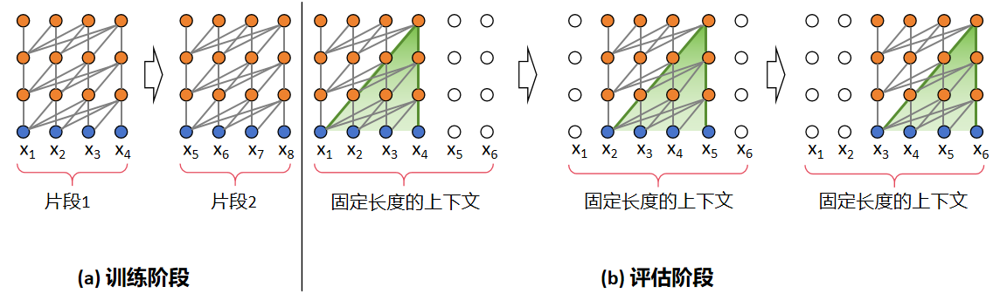
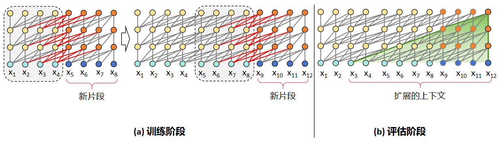
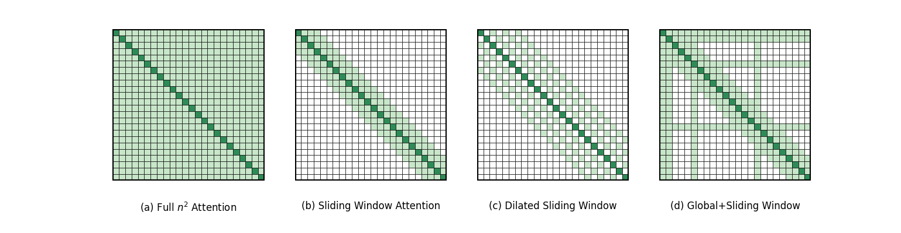
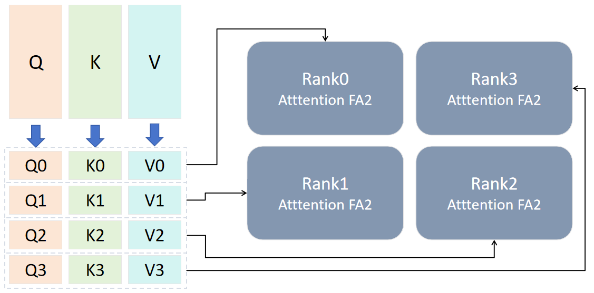
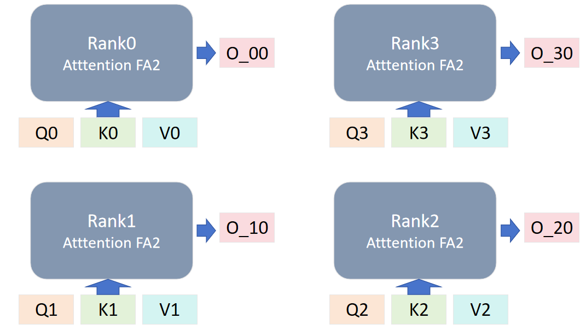
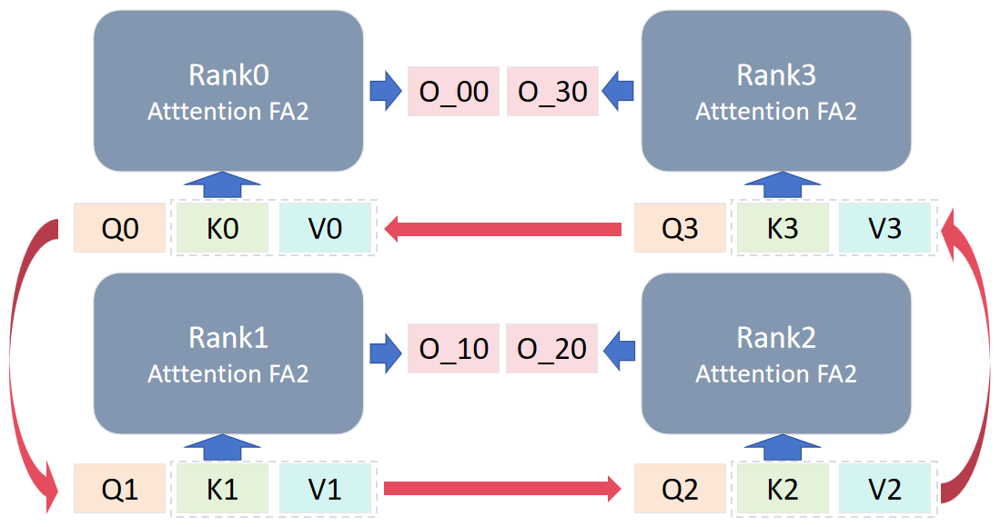
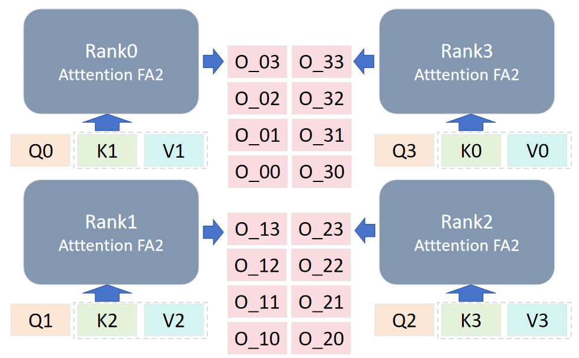
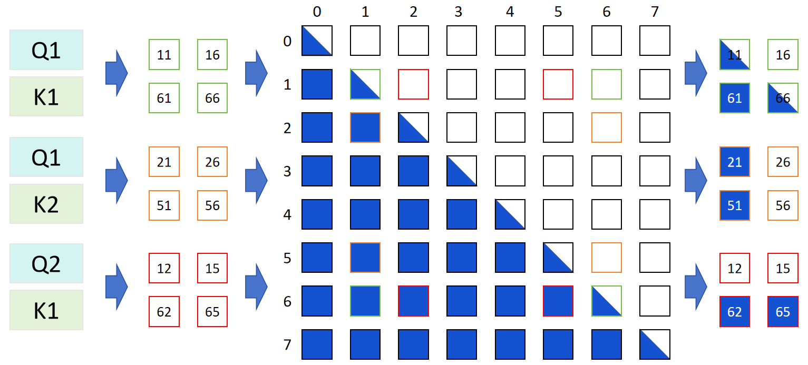
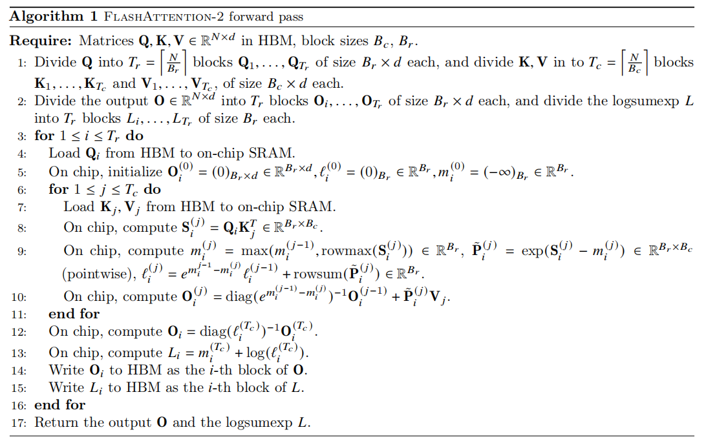
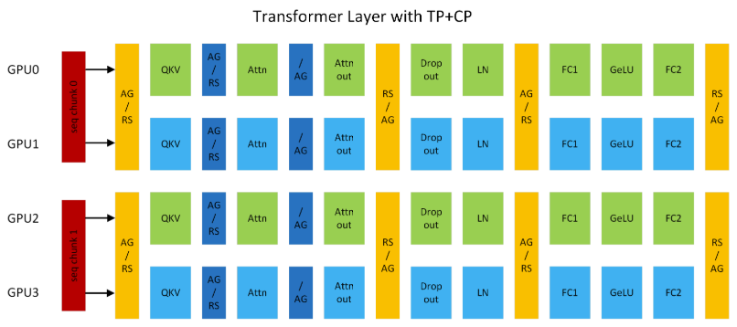

<!--Copyright © ZOMI 适用于[License](https://github.com/Infrasys-AI/AIInfra)版权许可-->

# 长序列与上下文并行 CP

> Author by: 杨涵智

随着 AI 对长文本处理需求的提升，早期的短上下文大模型因上下文截断的局限难以满足实际任务，人们对大模型的长序列处理能力的需求水涨船高。然而，传统的并行技术难以针对性解决因序列长度扩展带来的内存与效率瓶颈问题。为此，本节聚焦序列并行的进阶方案——上下文并行，系统阐述其基本原理、与传统技术的差异及核心优势，说明其如何支撑大模型的长序列处理能力高效落地。

## 长序列出现

大模型的长序列能力的爆发绝非偶然的技术迭代，而是伴随着人工智能向复杂真实场景渗透时，对长距离信息关联能力需求的必然产物。早起以 BERT、GPT-2 等 512 或 1024 token 窗口为代表的短上下文大模型虽然在简单任务中表现亮眼，但面对多轮复杂对话、文章理解等长序列场景时仍显得力不从心。上下文窗口的硬性限制，使得它们不得不对长文本进行截断，这直接导致了部分关键信息的丢失，使任务精度大幅度下降。以长文档摘要任务为例，短上下文大模型对跨段落核心观点的捕捉率甚至不能达到 50%，完全无法达到产业级应用的标准。

鉴于短上下文模型受限于上下文窗口，所以人们首先以突破固定的上下文窗口为核心方向。2019 年诞生的 Transformer-XL 就是这一阶段的代表性成果，并且成功证明了突破固定的上下文窗口对长序列建模的意义。Transformer-XL 的核心优化在于引入了以下两点：

经典 Transformer 训练和评估阶段

Transformer-XL 训练和评估阶段

1. 片段递归：Transformer-XL 和 Transformer 相同点在于在训练时会以固定长度的片段进行输入，区别在于 Transformer-XL 会缓存上一片段的状态，重复使用上个时间片的隐层状态来计算当前片段。从图中可以直观地看出，在训练阶段，Transformer 前后片段是独立的，显然这与事实不符，而 Transformer-XL 缓存了前一个片段的输出序列，在计算下一个片段的输出时会使用上一个片段的缓存信息，将前后片段的信息进行融合。在评估阶段，Transformer 会采用同训练阶段一致的划分长度，仅预测最后一个位置的 token，完成后整体向后移动一位，但是这种方式需要频繁计算新的片段，计算代价很大；相对的，由于前后片段的重复度很高，Transformer-XL 选择直接使用前一个片段的输出序列，不需要重复计算，加快了推理速度。
2. 相对位置编码：以往 Transformer 使用绝对位置编码，其计算方式如下：

$$
\left\{
\begin{aligned}
PE(pos, 2i) &= \sin\left( \frac{pos}{10000^{2i/d_{\text{model}}}} \right) \\
PE(pos, 2i+1) &= \cos\left( \frac{pos}{10000^{2i/d_{\text{model}}}} \right)
\end{aligned}
\right.
$$

其中，pos 表示 token 的下标，$d_{\text{model}}$ 表示 hidden size，i 表示的是具体的某个维度。从公式中不难看出，绝对位置编码只能在同一片段中区分位置，在不同片段中的同一位置的编码是相同的。如果按照这个方式计算，前后两段在进行信息融合时会造成位置信息的混乱。为了避免这一情况，Transformer-XL 使用相对位置编码，通过计算当前 token 与其他 token 的相对距离，为不同相对位置分配特定的编码参数。这样一来，即便在不同片段中存在位置数值相同的 token，也能根据它们之间的相对位置差异，获得准确且有区分度的位置编码。

但是随着需求场景的进一步升级，效率成为了大模型长序列特性发展的新焦点。2023 年提出的 Mamba 跳出了 Transformer 架构的框架，基于状态空间模型设计了全新的长序列处理范式，引入线性复杂度计算。Mamba 的内部状态大小恒定，计算量随序列长度呈 O(N)线性增长，对比传统 Transformer 模型的 O(N2)，Mamba 在处理百万 token 级序列时，仍能保持高效的内存占用与计算速度。

以上两种模型均进行了架构创新，而基于 Transformer 的改进方案同样不断演进，其中极具代表性的就是 2020 年提出的 Longformer，通过滑动窗口注意力和全局注意力的混合机制，在保持 Transformer 架构兼容性的同时，将计算复杂度降至 O(N×w)，其中 w 为窗口大小。Longformer 既降低了计算成本，又确保了核心信息的全局关联。图中(a)是经典的 Self-Attention 模式，每个 token 都要和序列中其他所有的 token 交互，时间复杂度达到 O(N2)。(b)、(c)、(d)则是 Longformer 提出的三种 Self-Attention 模式，分别是滑动窗口注意力机制（Sliding Window Attention）、空洞滑窗机制（Dilated Sliding Window）和融合全局信息的滑动窗口机制（Global+Sliding Window）。由图中的数据我们可以很直观的看出 Longformer 在时间复杂度上做出的巨大优化。

经典 Self-Attention 和 Longformer 提出的 Self-Attention

然而，大模型长序列能力的发展始终面临着能力与资源的矛盾：序列长度的不断增加必然导致激活值和 KV 缓存的内存占用激增。传统的张量并行（Tensor Parallelism，TP）和流水线并行（Pipeline Parallelism，PP）主要解决参数存储问题，无法针对序列维度的并行压力提供有效优化；而序列并行（Sequence Parallelism，SP）虽然尝试查分序列，却因自注意力模块对完整 QKV 的依赖而效果有限。正是这一核心矛盾，催生了上下文并行（Context Parallelism，CP）的诞生。

## CP 基本原理

前文我们介绍到，序列并行作为分布式训练中针对序列长度维度优化的核心技术，其核心思想是将输入序列按照时间步或片段拆分为多个子序列，并分配到不同设备并行处理，以此突破单设备在长序列处理中的内存与计算瓶颈。接下来，我们将介绍序列并行的一种更加激进的进阶实现形式——上下文并行。

### SP 序列并行的问题

Megatron 提出的 SP 是对 TP 的补充，上一节我们介绍过，TP 不会涉及 Dropout 和 LayerNorm ，于是 Megatron 的 SP 作为补充，对 Dropout 和 LayerNorm 等在序列维度上计算独立的模块的输入激活做序列拆分。而CP 则更加激进，与 SP 只切分部分激活不同，CP 会对网络输入及所有中间激活沿序列维度划分。要理解 CP，我们首先要看一下 SP 中自注意力模块的局限：

自注意力计算公式为：

$$Attention(Q, K, V) = \text{softmax}\left(\frac{QK^T}{\sqrt{d_k}}\right)V$$

如图所示，SP 虽然能够拆分 LayerNorm、Dropout 等模块，但由于计算的耦合性，自注意力中的 Q/K/V 计算需要完整序列作为输入，也就是说，尽管 SP 初始将 token 序列切分到不同 GPU，在执行 Q/K/V 投影前，必须通过 all-gather 通信将完整序列恢复到每张卡上。在 Self-Attention 计算时，每张卡仍基于完整序列进行计算。这正是 SP 优化长序列的瓶颈——它的 QKV 计算依赖完整序列信息，限制了 SP 对长序列的并行优化能力。

SP示意图

### CP 并行原理与流程

CP 正是要解决 SP 中的 Self-Attention 序列并行问题，CP 通过 Flash Attention2（FA2） 分块运算和分块结果修正的方式，成功地打破了这一限制。此外，CP 通过环形网络在设备间传递 KV 值来获取分块运算结果，其原理类似 Ring Attention。

+ **非自注意力模块：** 像 Linear、LayerNorm 等，因为不涉及 token 间的交互运算，能保持原有逻辑，只需要对局部序列片段独立计算。
+ **自注意力模块：** 每个 token 的查询向量 Q 都要和同序列所有 token 的键向量 K、值向量 V 计算注意力。CP 通过全聚集（All-Gather）操作跨 GPU 收集完整 KV 序列，保证注意力计算的准确性；反向传播时，在通过归约散射（Reduce-Scatter）操作把 KV 的激活梯度拆分回各设备。

要进行 CP 并行，首先要对输入的 QKV 进行切分，QKV 在 sequence 维度上都要除以 cp_size 值。以 bshd 数据为例，输入由[b,sq,np,bn]变为[b,sq/cp_size,np,bn]。为了更直观的展示 CP 的主要运算步骤，这里我们以 cp_size=4 为例进行展示。

如上文所说，我们要将输入切分，输入的 QKV 经处理后得到[Q0,Q1,Q2,Q3],[K0,K1,K2,K3],[V0,V1,V2,V3]，并将设备组划分为 rank0，rank1，rank2，rank3。每个设备组获取初始的输入组，大小为[b,sq/4,np,bn]。

图 1 输入数据处理示意图（后续需要重新起名、优化画面）

第一次计算时，每个 rank 使用初始分配的输入，通过 Flash Attention2 模块计算得到第一个输出 O_x0，这里 x 是对应 rank 的编号。除第一次外，后续的 QKV 计算中，单步计算后需要进行一次对 L 值的修正（FA 计算中的 logsumexp 值）。

图 2 第一轮计算（后续需要重新起名、优化画面）

后续计算时，对 rank 的 KV 进行轮换，每个 rank 与自己相邻的 rank 进行环形 P2P 通信，传出自己的 KV 值，拿到邻居的 KV 值用于下一轮计算。

图 3 数据传输（后续需要重新起名、优化画面）

数据轮换共进行 cp_size-1 次，以图中为例，每个 rank 得到 4 个输出，每个 rank 将自己的分块结果进行聚合相加得到结果 O_x。

图 4 计算结果（后续需要重新起名、优化画面）

最后不同 rank 的输出组合为[O_0,O_1,O_2,O_3]，其与不使用 CP 得到的结果是数学相等的，证明 CP 能够在不影响结果准确性的情况下实现长序列的处理。

为进一步降低显存占用，每个 GPU 在前向传播阶段仅存储所处理序列片段的 KV，当反向传播需要全局 KV 时再次收集 KV。同时，KV 通信仅发生在不同张量并行组的对应 GPU 之间，并且底层会将全收集和归约散射转化为环形拓扑（Ring Topology）下的点对点通信，提升传输效率。此外，CP 可以利用多查询注意力（MQA）、分组查询注意力（GQA）来进一步减少通信量，这类注意力机制仅为 KV 设置单个或少量注意力头，显著降低了跨设备传输的数据量。

### 因果掩码的计算优化

现在我们已经了解了CP的基础运行流程，但是CP的优化不止于此，CP还通过数据对称重组策略，直接丢弃 Attention 计算中无效的掩码运算，从而在不破坏因果约束的前提下，显著提升因果掩码（Causal Mask）的计算效率。

前文提到，CP 在计算 Attention 时，会将 Q、K、V 按序列维度拆分为 sq/cp_size 份，再分配到不同设备（Rank）进行并行计算。因果掩码的优化逻辑与其相似，但拆分粒度调整为 2*cp_size，核心目标是通过后续的对称重组，剔除无效掩码操作。由于 Transformer 的 Attention 层中，因果掩码仅作用于 Q 与 K 计算得到的 Score 矩阵，因此本节的优化分析将聚焦于 Score 矩阵的生成过程，并以 cp_size=4 为例展开说明。

Q/K矩阵的数据拆分和对称重组

因果掩码的优化通过拆分、重组、掩码匹配三步实现，具体流程如下：
1. 数据拆分
将 Q 和 K 分别按序列维度等分为 2*cp_size 份（当cp_size=4时，共分为 8 份），并按顺序编号为 0 至 7，形成 8 个独立的子块。
2. 对称重组
这是优化的关键环节。将拆分后的 8 份 Q（或 K）按 “两端向中间配对” 的规则进行对称组合，最终形成cp_size个新的子块。以 Q 为例，8 份原始子块会重组为 Q0、Q0、Q2、Q3，其中每个新子块包含 2 个原始子块（如 Q1包含原始编号 1 和 6 的子块，Q2包含原始编号 2 和 5 的子块）。
3. 掩码矩阵的匹配切分
为了与重组后的 Q、K 子块适配，需将原始的因果掩码矩阵切分为 (2 * cp_size)×(2 * cp_size) 的小块（即 8×8 的掩码子矩阵）。当重组后的 Qx 与 Ky 进行 Score 计算时，需根据 Qx 和 Ky 包含的原始子块编号，提取对应的掩码子块。例如，Q1（含原始编号 1、6）与 K2（含原始编号 2、5）计算时，需提取的掩码子块为 1×2、6×2、1×5、6×5，确保掩码约束精准覆盖有效计算区域，如图所示。

Q/K 掩码子块提取示意图

经过对称重组后，每个 Rank 上的 Q、K 子块均包含从原始序列两端抽取的 2 个 Token。此时，8×8 的因果掩码矩阵被切分后，每个 Rank 在 FA2 的内层循环中，仅会遇到以下三种具有明确规律的子矩阵形态，这为后续剔除无效运算提供了依据：
- a 类子矩阵：标准的下三角因果掩码，需保留完整的因果约束计算。
- b 类子矩阵：矩阵左侧区域为有效数值，右侧区域全为 0，仅需对左侧有效区域进行计算。
- c 类子矩阵：矩阵下方区域为有效数值，上方区域全为 0，仅需对下方有效区域进行计算。

三种子矩阵

基于上述三类子矩阵的形态特征，CP 通过分阶段判定，在 FA2 循环中动态裁剪输入矩阵，彻底省略掩码乘法操作。仍以cp_size=4、设备 Rank=1 为例，具体执行步骤如下：
1. 首轮循环（i=0）：特殊初始化。
先以标准因果模式加载 Q、K、V 的完整子块，随后通过形态识别发现当前子矩阵为 b 类子矩阵。此时，将 K、V 的序列后半段裁掉，仅保留前半段（seq//2），Q 维持全长，后续运算切换为无掩码模式。
2. 对角线循环（i=rank_idx，即 i=1）：完整因果约束。
当循环索引与当前 Rank 编号一致时，子矩阵形态为 a 类下三角掩码，需严格保留完整的因果约束。此时 Q、K、V 均不裁剪，使用标准因果掩码进行计算。
3. 后续循环（i>rank_idx，即 i=2、3）：上空区域跳过。
当循环索引超过 Rank 编号时，子矩阵形态为 c 类子矩阵。此时将 Q 的序列前半段裁掉，K、V 保持全长，运算再次切换为无掩码模式，直接跳过上方的无效空白区域。

通过上述动态判定与矩阵裁剪，FA2 循环中送入计算芯片的始终是有效数据段，因果掩码的无效乘法运算被彻底省略，同时通过精准的子块匹配，确保了 Transformer 的因果语义完整性不受影响。

### Flash Attention2的计算修正

上文我们提到过，在计算过程中会对 logsumexp 值进行修正，这是因为在 Megatron 的 CP架构中，Self-Attention 计算依赖 FA2 的分块运算提升效率，但分块过程会导致关键统计信息断裂，必须通过针对性修正才能保证计算精度。

FA2 的前向计算中，logsumexp 值（记为 L）的求解是保障数值稳定性的核心，其计算需依赖完整的序列信息——具体而言，每一步的 L 值都需要基于此前所有分块的最大激活值（max）进行累积。

Flash Attention2前向传播计算伪代码

如图第九行的代码所示，m(i)的计算需要m(i-1)的值，但在 CP 模式下，FA2 的内层循环会按 cp_size 对序列进行分段。由于各分块计算独立进行，前一段的 m 值无法传递到后一段，直接导致后续分块的 L 值计算失真。仍以 cp_size=4 为例，单个 Rank 会依次得到分块结果 L0、L1、L2、L3和O0、O1、O2、O3（O 为 Attention 输出），其中仅首轮的L0计算正确，后续 Lx 及对应 O 值均存在偏差。因此，在 CP 中需要对FA2的计算进行修正。

修正的核心逻辑是 L 值的累积与 O 值的归一化，分为两个阶段：分块内的 L 值的迭代累积修正和所有分块完成后的 O 值最终归一化修正。

1. L 值的迭代累积修正
L 值的修正是分块计算的实时补丁，每完成一轮分块运算，就用当前分块的 L 值修正全局累积的 L_lst，确保后续分块能继承完整的统计信息。在首轮运行时，L_lst = L0，后续每一轮计算中，都要计算当前分快 L_cur 与 L_lst 的最大最小值，然后用对数加法公式更新 L_lst，即：
    - L_max = max(L_cur, L_lst)
    - L_min = min(L_cur, L_lst)
    - L_lst = L_max + log(1 + e^(L_min - L_max))

2. O 值的最终归一化修正
当所有分块的 L 值都完成累积后，还需要对各分块的输出 O 进行归一化，对每个分快依次进行下述操作：
    - 计算指数修正项：L_exp = e^(L_cur - L_lst)
    - 修正当前分块的输出：O_correct = O_cur × L_exp
    - 累积所有修正后的输出：O_lst = O_lst + O_correct
最终的 O_lst 就是该 Rank 上全局正确的 Attention 输出。

## CP 并行实际案例

图 5 展示了 TP2CP2 配置下的 Transformer 层，以此为例，若处理长度为 8K 的序列，每个 GPU 仅负责 4K token 的计算。

图 5 TP2CP2 配置下的 Transformer 层通信示意图（后续需要重新绘制）

在通信逻辑上，GPU0 与 GPU2、GPU1 与 GPU3 分别组成 CP 组，相互交换 KV。CP 的通信仅针对自注意力模块，其他模块的通信仍属于 TP 范畴，二者独立且互补。CP 在原理上与环形注意力相似，但是仍有区别，CP 兼容最新的开源（OSS）和 cuDNN Flash Attention 内核，并移除了低三角因果掩码带来的冗余计算，实现了 GPU 间的负载均衡。

长上下文场景下，大语言模型常面临两大核心问题：一是激活值显存占用随序列长度线性增长，易触发内存溢出（OMM）；二是为规避内存溢出而采用的激活值重计算策略会引入额外约 30%的性能开销，而单纯扩大 TP 规模虽能缓解内存溢出，却可能因线性层计算过短，无法与通信延迟重叠，导致效率下降。

CP 通过序列分片计算从根本上解决上述问题，其核心优势主要体现在以下三个方面：

1. 显存占用显著降低：每个 GPU 仅处理部分序列，单设备激活值显存占用量降至原来的 1/CP（CP 为并行度，即参与 CP 的设备数），彻底规避内存溢出风险，无需依赖激活值重计算。
2. 计算与通信效率平衡：计算量与通信量均随 CP 并行度线性降低，不存在计算过短无法重叠通信延迟的问题，且环形拓扑下的点对点通信进一步减少传输开销。
3. 兼容多并行技术栈：可与张量并行（TP）、流水线并行（PP）、数据并行（DP）无缝结合，总设备数满足 GPU 总数=TP×CP×PP×DP，同时适配 MHA/MQA/GQA 等多种注意力变体及单向/双向掩码场景，灵活性极高。

!!!!!!!!实际的场景中，CP 并行会怎么使用？有没有可能能够搞个 profiling 出来，看 CP 并行的区别

## 总结与思考

CP 是 Megatron-LM 在 Ring-Attention 基础上的一次尝试，为模型面对超长序列的情景提供了一个行而有效的解决方案，但其分块时直接暴力将序列维度除以并行度，没有按照 Ring-Attention 中使用一个可控的 block size，少数情况下仍然面临内存溢出的风险。

## 参考与引用

- https://github.com/NVIDIA/Megatron-LM/blob/c3677e09aa4e2eec37048307bd795928b8f8324a/docs/source/api-guide/context_parallel.rst
- https://blog.csdn.net/u012526436/article/details/109156096
- https://zhuanlan.zhihu.com/p/405317918
- https://zhuanlan.zhihu.com/p/698447429
- Liu H, Zaharia M, Abbeel P. Ring attention with blockwise transformers for near-infinite context[J]. arXiv preprint arXiv:2310.01889, 2023.
- Korthikanti V A, Casper J, Lym S, et al. Reducing activation recomputation in large transformer models[J]. Proceedings of Machine Learning and Systems, 2023, 5: 341-353.
- Dai Z, Yang Z, Yang Y, et al. Transformer-xl: Attentive language models beyond a fixed-length context[J]. arXiv preprint arXiv:1901.02860, 2019.
- Dao T. Flashattention-2: Faster attention with better parallelism and work partitioning[J]. arXiv preprint arXiv:2307.08691, 2023.
