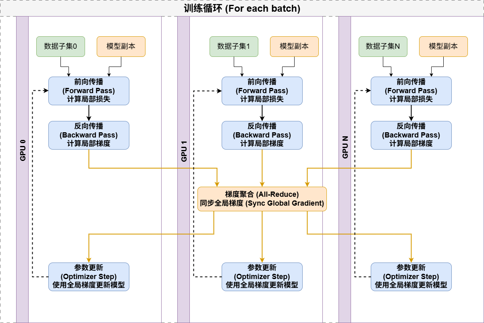
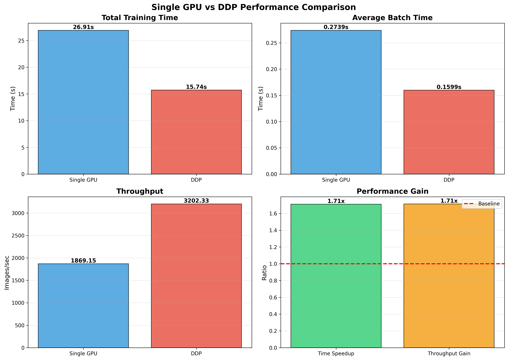
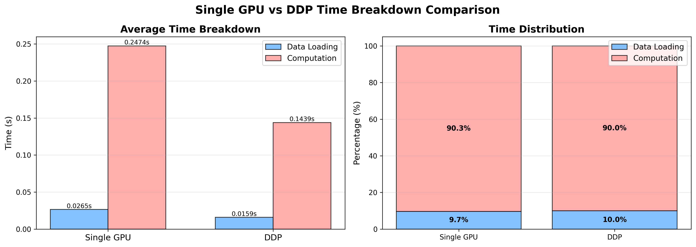

<!--Copyright © ZOMI 适用于[License](https://github.com/Infrasys-AI/AIInfra)版权许可-->

# CODE 01: 从零构建 PyTorch DDP

> Author by: 于嘉阔

本实验旨在通过一个具体的 PyTorch 案例，实现、对比并分析分布式数据并行（Distributed Data Parallel, DDP）相对于单卡训练的性能优势。通过本次实验，我们将：
1.  理解数据并行的基本原理。
2.  掌握 PyTorch DDP 的核心实现步骤。
3.  学习如何对训练过程进行详细的性能分析与可视化。
4.  量化 DDP 带来的训练加速比和吞吐量提升。

## 1. DDP 基本原理

数据并行的核心思想是将模型复制到多个设备上，每个设备处理一部分独立的数据子集，然后通过通信聚合所有设备计算出的梯度，最后用聚合后的梯度来更新所有设备上的模型参数，以确保模型的一致性。

<div align="center">
    
    <br>
    <em>图 1：DDP 基本原理</em>
</div>

基本流程如下:
1.  数据分区: 将完整数据集均匀划分为 N 个子集（N 为参与训练的 GPU 数量）。
2.  模型复制: 在每个 GPU 上都复制一份完整的模型。
3.  前向传播: 每个 GPU 使用分配给它的数据子集独立进行前向计算，得到各自的损失。
4.  反向传播与梯度聚合:每个 GPU 计算各自的梯度。DDP 后端（如 NCCL）通过 All-Reduce 操作，将所有 GPU 上的梯度进行求和（或平均），并将结果分发回每个 GPU。
5.  参数更新: 所有 GPU 使用完全相同的聚合梯度来更新各自的模型参数，从而保证了训练结束后所有模型的状态是一致的。

从数学角度看，假设我们有一个损失函数 $L(w)$，其中 $$w$ 是模型参数。在单卡训练中，我们使用梯度下降更新参数：

$$w = w - η·∇L(w)$$

其中 $η$ 是学习率，$∇L(w)$ 是损失函数关于参数的梯度。

在数据并行中，假设我们将数据分成 K 个批次，每个设备处理一个批次。每个设备 i 计算出梯度 $g_i = ∇L_i(w)$，其中 $L_i$ 是设备 $i$ 上的损失。全局梯度则为所有设备梯度的平均值：

$$g = (g_1 + g_2 + ... + g_K) / K$$

然后所有设备使用这个全局梯度更新参数：

$$w = w - η·g$$

这种方法的优势在于可以线性扩展 batch size，理论加速比接近参与训练的设备数量。但实际中由于通信开销等因素，加速比会略低。

## 2. 实验环境准备

我们需要导入 PyTorch 的核心库以及分布式训练、数据处理和可视化的相关模块。


```python
# 核心库
import os
import time
import torch
import torch.nn as nn
import torch.optim as optim
import torchvision
import torchvision.transforms as transforms
import torchvision.models as models

# DDP 相关库
import torch.distributed as dist
from torch.nn.parallel import DistributedDataParallel as DDP
from torch.utils.data.distributed import DistributedSampler

# 可视化与辅助库
import matplotlib
matplotlib.use('Agg')  # 使用 Agg 后端，避免在无 GUI 服务器上出错
import matplotlib.pyplot as plt
import numpy as np
from datetime import datetime
import pickle # 用于保存和加载实验结果

# 确保实验可复现
torch.manual_seed(42)

print(f"PyTorch Version: {torch.__version__}")
print(f"Torchvision Version: {torchvision.__version__}")
print(f"CUDA Available: {torch.cuda.is_available()}")
if torch.cuda.is_available():
    print(f"CUDA Version: {torch.version.cuda}")
    print(f"Number of GPUs: {torch.cuda.device_count()}")
```

## 3. 辅助类与数据记录

为了精确地测量和记录训练过程中的各项性能指标，我们定义了两个辅助类：AverageMeter 用于计算和存储某个指标（如批处理时间、数据加载时间）的当前值和平均值。TrainingLogger 用于在训练过程中，按步数记录损失、准确率、吞吐量和各种时间指标，方便后续进行可视化。


```python
class AverageMeter(object):
    """计算并存储平均值和当前值"""
    def __init__(self):
        self.reset()

    def reset(self):
        self.val = 0
        self.avg = 0
        self.sum = 0
        self.count = 0

    def update(self, val, n=1):
        self.val = val
        self.sum += val * n
        self.count += n
        self.avg = self.sum / self.count

class TrainingLogger(object):
    """记录训练过程中的各项指标"""
    def __init__(self):
        self.losses = []
        self.accuracies = []
        self.batch_times = []
        self.data_times = []
        self.compute_times = []
        self.steps = []
        self.throughputs = []
        
    def log(self, step, loss, accuracy, batch_time, data_time, compute_time, throughput):
        self.steps.append(step)
        self.losses.append(loss)
        self.accuracies.append(accuracy)
        self.batch_times.append(batch_time)
        self.data_times.append(data_time)
        self.compute_times.append(compute_time)
        self.throughputs.append(throughput)
```

## 4. 数据集与模型定义

为了更好地体现 DDP 在计算密集型任务上的优势，我们选择 CIFAR-10 数据集和 ResNet-18 模型，并进行了一个关键调整：将输入图像尺寸从 32x32 放大到 224x224。这显著增加了模型的计算负载，使得 GPU 计算时间成为瓶颈，从而更能凸显多卡并行计算带来的性能提升。


```python
def get_model():
    """获取 ResNet18 模型,并调整以适应 CIFAR10 (10 分类)"""
    model = models.resnet18(weights=None)
    model.fc = nn.Linear(model.fc.in_features, 10)
    return model

def get_cifar10_loaders(data_dir='./data', batch_size=128, distributed=False):
    """
    获取 CIFAR10 数据加载器。
    为了增加计算负载以突显 DDP 优势,我们将图像尺寸放大到 224x224。
    """
    transform = transforms.Compose([
        transforms.Resize(224),
        transforms.ToTensor(),
        transforms.Normalize((0.5, 0.5, 0.5), (0.5, 0.5, 0.5))
    ])
    trainset = torchvision.datasets.CIFAR10(root=data_dir, train=True, download=True, transform=transform)
    
    # DDP 模式下使用 DistributedSampler
    sampler = DistributedSampler(trainset) if distributed else None
    
    # 自动设置合适数量的 num_workers
    num_workers = min(os.cpu_count(), 8) if torch.cuda.is_available() else 0
    
    trainloader = torch.utils.data.DataLoader(trainset, batch_size=batch_size,
                                              shuffle=(sampler is None), # Sampler 和 shuffle 互斥
                                              num_workers=num_workers, 
                                              pin_memory=True, sampler=sampler)
    return trainloader, sampler
```

   
## 5. DDP 初始化与清理

DDP 训练需要在每个进程开始时初始化进程组，并在结束时销毁它。torchrun 会自动设置所需的环境变量（如 RANK,WORLD_SIZE），我们只需调用相应函数即可。setup_ddp()用于初始化进程组，指定通信后端，通常为 nccl 用于 GPU。cleanup_ddp()用于销毁进程组，释放资源。


```python
def setup_ddp():
    """初始化 DDP 进程组。torchrun 会自动设置所需的环境变量。"""
    dist.init_process_group("nccl")
    rank = int(os.environ['RANK'])
    torch.cuda.set_device(rank)

def cleanup_ddp():
    """销毁 DDP 进程组。"""
    dist.destroy_process_group()
```

## 6. 核心训练函数

这是实验的核心。我们创建一个统一的 train 函数，它可以通过 is_ddp 参数在单卡和 DDP 模式间切换。函数内部包含了详细的时间测量和日志记录逻辑。

DDP 模式下的关键差异点：
1. 进程组初始化：在函数开头调用 setup_ddp()。
2. 设备绑定：每个进程（rank）绑定到不同的 GPU 设备。
3. 分布式采样器：使用 DistributedSampler 确保每个进程加载到不重复的数据子集。
4. 模型封装：将模型用 DDP()包装起来，它会自动处理梯度的 All-Reduce 通信。
5. 分布式日志：只在主进程（rank == 0）进行日志打印和性能记录，避免多进程重复输出。


```python
# 注意：此单元格包含的函数较长，是整个训练逻辑的核心。
def train(is_ddp, epochs, batch_size, learning_rate):
    """核心训练函数,支持单卡和 DDP 模式,并提供详细的时间分析。"""
    if is_ddp:
        setup_ddp()
        rank = int(os.environ['RANK'])
        world_size = int(os.environ['WORLD_SIZE'])
        device = rank
        if rank == 0: print(f"--- [DDP Mode] 开始训练 (使用 ResNet18, 224x224 input) ---")
    else:
        rank = 0
        world_size = 1
        device = torch.device("cuda:0" if torch.cuda.is_available() else "cpu")
        print("--- [Single-GPU Mode] 开始训练 (使用 ResNet18, 224x224 input) ---")

    # 计算每个 GPU 的 batch size 和学习率
    batch_size_per_gpu = batch_size // world_size
    lr = learning_rate * world_size # 学习率随全局批量大小等比例缩放
    if rank == 0:
        print(f"Global BS: {batch_size}, BS per GPU: {batch_size_per_gpu}, Scaled LR: {lr:.4f}")

    # 获取数据加载器和模型
    trainloader, sampler = get_cifar10_loaders(batch_size=batch_size_per_gpu, distributed=is_ddp)
    model = get_model().to(device)
    
    if is_ddp:
        model = DDP(model, device_ids=[device], find_unused_parameters=True)

    criterion = nn.CrossEntropyLoss()
    optimizer = optim.SGD(model.parameters(), lr=lr, momentum=0.9)
    
    # 初始化计时器和记录器
    batch_time = AverageMeter()
    data_time = AverageMeter()
    compute_time = AverageMeter()
    logger = TrainingLogger() if rank == 0 else None
    total_start_time = time.time()
    
    steps_per_epoch = len(trainloader)
    global_step = 0

    for epoch in range(epochs):
        if is_ddp:
            sampler.set_epoch(epoch) # 确保每个 epoch 的 shuffle 不同
        
        end = time.time()
        for i, (inputs, labels) in enumerate(trainloader):
            data_time.update(time.time() - end)
            compute_start = time.time()
            
            inputs = inputs.to(device)
            labels = labels.to(device)
            
            optimizer.zero_grad()
            outputs = model(inputs)
            loss = criterion(outputs, labels)
            loss.backward()
            optimizer.step()
            
            if torch.cuda.is_available():
                torch.cuda.synchronize()
            compute_time.update(time.time() - compute_start)
            
            batch_time.update(time.time() - end)
            end = time.time()
            
            _, predicted = torch.max(outputs.data, 1)
            accuracy = (predicted == labels).sum().item() / labels.size(0) * 100
            
            if rank == 0:
                throughput = batch_size / batch_time.val
                logger.log(global_step, loss.item(), accuracy, 
                           batch_time.val, data_time.val, compute_time.val, throughput)
            
            global_step += 1
            
            if rank == 0 and (i + 1) % 50 == 0: # 减少打印频率
                print(f'Epoch: [{epoch+1}][{i+1}/{steps_per_epoch}]\t'
                      f'Loss {loss.item():.4f}\t'
                      f'Acc {accuracy:.2f}%\t'
                      f'Batch Time {batch_time.avg:.3f}s\t'
                      f'Throughput {batch_size / batch_time.avg:.2f} img/s')
    
    results = None
    if rank == 0:
        total_time = time.time() - total_start_time
        mode = "DDP" if is_ddp else "单卡"
        print(f"\n===== {mode} 训练性能总结 =====")
        print(f"总训练时间: {total_time:.2f} 秒")
        print(f"平均每步总耗时 (Batch Time): {batch_time.avg:.4f} 秒")
        print(f"  - 平均数据加载耗时: {data_time.avg:.4f} 秒")
        print(f"  - 平均计算+同步耗时: {compute_time.avg:.4f} 秒")
        print(f"平均吞吐量 (Throughput): {batch_size / batch_time.avg:.2f} 张图片/秒")
        print("="*40 + "\n")
        
        results = {
            'total_time': total_time, 'avg_batch_time': batch_time.avg,
            'avg_data_time': data_time.avg, 'avg_compute_time': compute_time.avg,
            'throughput': batch_size / batch_time.avg, 'logger': logger
        }

    if is_ddp:
        cleanup_ddp()
    
    return results
```

## 7. 主函数与实验执行

这是整个实验的入口。我们定义了实验超参数，并通过检查环境变量 WORLD_SIZE 来判断当前应以 DDP 模式还是单卡模式运行。训练结束后，结果会通过 pickle 保存到磁盘，以便后续统一进行对比分析和绘图。


```python
# 定义主函数，封装实验流程
def main():
    # --- 实验超参数 ---
    EPOCHS = 1
    GLOBAL_BATCH_SIZE = 512
    LEARNING_RATE = 0.01

    # `torchrun` 会设置 'WORLD_SIZE' 环境变量
    is_ddp = 'WORLD_SIZE' in os.environ
    
    # 调用训练函数
    results = train(is_ddp=is_ddp, epochs=EPOCHS, batch_size=GLOBAL_BATCH_SIZE, learning_rate=LEARNING_RATE)
    
    # 主进程负责保存结果
    if results is not None:
        mode = "DDP" if is_ddp else "单卡"
        os.makedirs('./results', exist_ok=True)
        # 从 logger 中移除大的数据列表，减小 pickle 文件大小
        if 'logger' in results:
            results.pop('logger', None)
        with open(f'./results/{mode}_results.pkl', 'wb') as f:
            pickle.dump(results, f)
        print(f"✅ {mode} 结果已保存至 ./results/{mode}_results.pkl")
```

## 8. 执行指令

由于 DDP 的启动依赖于 torchrun 工具来管理多个进程，直接在 Jupyter Notebook 单元格中执行 DDP 训练较为复杂。因此，最佳实践是将以上所有代码整合为一个 Python 脚本（例如 ddp_cifar10_final_accurate.py），然后通过命令行来启动实验。

执行步骤：

1. 保存脚本：将前面所有单元格的代码合并，并保存为 ddp_cifar10_final_accurate.py 文件。确保主函数调用被 `if __name__ == "__main__":` 包裹。

2. 运行单卡基准测试：
    ```bash
    python ddp_cifar10_final_accurate.py
    ```

3. 运行 DDP 训练(假设使用 2 个 GPU)：
    ```bash
    torchrun --nproc_per_node=2 ddp_cifar10_final_accurate.py
    ```

脚本会自动检测运行模式，执行训练，并将结果（单卡和 DDP）分别保存到./results/目录下。当两个结果文件都存在时，脚本会自动生成对比图表并保存到./plots/目录。

## 9. 实验结果与分析

执行完上述指令后，我们得到了单卡与 DDP (2-GPU) 模式的性能对比图和时间分解图。

### 9.1 核心性能对比分析

<div align="center">
    
    <br>
    <em>图 2：单 GPU 和 DDP 性能对比图</em>
</div>

根据上图，我们可以得出以下结论：

1.  总训练时间 (Total Training Time):单卡模式耗时 26.91 秒。DDP (2-GPU) 模式耗时 15.74 秒。DDP 显著减少了总训练时间，**加速比为 26.91 / 15.74 ≈ 1.71x**。这个值接近理论加速比 2x，表明 DDP 在此任务上效率很高，通信开销相对可控。

2.  平均批处理时间 (Average Batch Time):从 **0.2739 秒/批次** (单卡) 降低到 **0.1599 秒/批次** (DDP)。这与总时间的减少趋势一致，反映了在微观层面每个批次的处理速度都得到了提升。

3.  吞吐量 (Throughput):单卡模式的吞吐量为 **1869.15 张图片/秒**。DDP 模式的吞吐量飙升至 **3202.33 张图片/秒**。吞吐量提升了 **3202.33 / 1869.15 ≈ 1.71 倍**，这意味着在相同时间内，DDP 系统能够处理的数据量是单卡系统的 1.71 倍，极大地提升了训练效率。

4.  性能增益 (Performance Gain):右下角的图表直观地展示了 **1.71x** 的时间加速比和吞吐量增益，验证了 DDP 带来的显著性能提升。

### 9.2 训练耗时分解

<div align="center">
    
    <br>
    <em>图 3：单 GPU 和 DDP 时间分解对比图</em>
</div>

为了探究性能提升的来源，我们对训练中每个批次的时间消耗进行了分解：

1.  平均时间分解 (Average Time Breakdown):计算时间 (Computation)从单卡的 **0.2474 秒** 大幅降低到 DDP 的 **0.1439 秒**。DDP 的计算时间约等于单卡的 **0.1439 / 0.2474 ≈ 0.58** 倍，接近理论上的 0.5 倍，这说明计算任务被有效地分配到了两个 GPU 上并行执行。数据加载时间 (Data Loading)从 **0.0265 秒** 降低到 **0.0159 秒**。这是因为 DDP 模式下，每个进程（GPU）都有自己独立的 DataLoader，它们并行地从磁盘加载和预处理数据，从而也加速了数据准备阶段。

2.  时间分布 (Time Distribution):一个非常关键的发现是，无论是单卡还是 DDP 模式，计算时间都占据了总耗时的 90% 左右。这说明我们的实验设置是成功的（通过放大图片尺寸），主要的瓶颈在于 GPU 计算，而非数据 I/O。DDP 在有效分摊计算负载的同时，没有引入过大的通信开销，使得计算密集型的特性得以保持。如果 DDP 模式下数据加载时间占比大幅上升，则可能意味着数据 I/O 成为了新的瓶颈。

---

## 10. 总结与思考

本次实验成功地从零开始构建了一个基于 PyTorch DDP 的分布式训练流程，并与单卡训练进行了全面的性能对比。

结论：
1. 在计算密集型任务上，使用 DDP(2-GPU)相比单卡训练获得了约 1.71x 的加速比和吞吐量提升，显著缩短了训练时间。
2. 性能提升主要源于计算任务的并行化，同时数据加载过程也因多进程并行而受益。
3. 通过时间分解分析，我们确认了实验的主要瓶颈在于 GPU 计算，且 DDP 没有引入显著的通信瓶颈，证明了其高效性。

思考与展望：
1. 实验中我们遵循了"Scale LR"原则，即当全局批量大小增加 N 倍时，学习率也相应增加 N 倍。这是分布式训练中一个重要的实践技巧。
2. 虽然本次实验的加速比很高，但在更大规模的集群或网络带宽受限的情况下，梯度同步的通信开销会成为更重要的影响因素。
3. 掌握 DDP 是训练大型 AI 模型的基础。在实际应用中，还需要考虑负载均衡、故障恢复等更复杂的问题，但本实验介绍的原理和方法是进一步学习的重要基石。