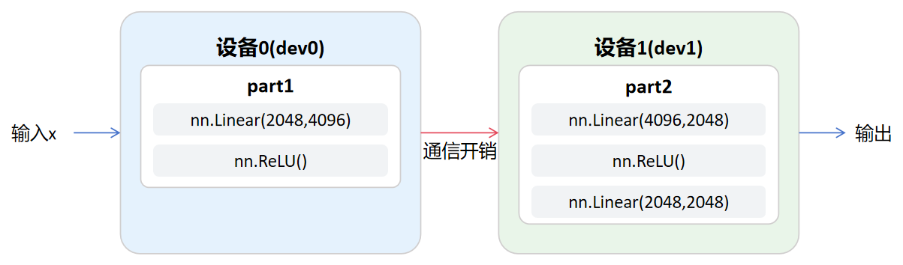
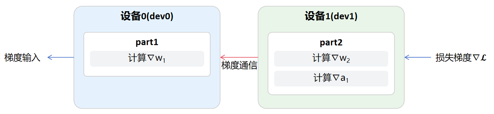

<!--Copyright © ZOMI 适用于[License](https://github.com/Infrasys-AI/AIInfra)版权许可-->

# CODE02: PyTorch模型并行(DONE)

> Author by: 杨涵智

随着 AI 模型的规模不断扩大，单个 GPU 的内存容量已经无法容纳整个模型。以 GPT-3 为例，其 1750 亿参数如果使用 FP32 精度存储，就需要 700GB 的内存空间，这远远超过了单个 GPU 的容量限制。模型并行(Model Parallelism)技术通过将模型分割到多个设备上，解决了大模型训练的内存瓶颈问题。

模型并行的核心思想是将单个模型的不同部分分布到不同的计算设备上，每个设备只负责计算模型的一个子集。这种方法与数据并行形成鲜明对比——在数据并行中，每个设备都有完整的模型副本，但处理不同的数据批次，我们可以通过这个表格直观地对比二者的区别。

|维度|模型并行|数据并行|
|---------|---------|---------|
|核心逻辑|将模型的不同层/模块分配到不同设备|每个设备保存完整模型，分配不同数据批次|
|适用场景|适用于单个设备无法容纳模型的情况|适用于单个设备能够容纳完整模型但是数据量巨大的情况|

## 1. 模型并行原理

从数学角度看，模型并行可以表示为将模型函数 $f(x)$ 分解为多个子函数的组合：

$$f(x) = fₙ(fₙ₋₁(...f₁(x)...))$$

其中每个子函数 $fᵢ$ 可以放置在不同的设备上执行。前向传播时，数据从第一个设备流向最后一个设备；反向传播时，梯度则沿着相反的方向传播。

### 1.1. 模型并行的主要分类

模型并行根据模型分割的粒度，可以分为两大类：**层间并行(Inter-layer Parallelism)** 和 **层内并行(Intra-layer Parallelism)**。

|策略名称|粒度描述|使用场景|通信内容|
|---------|---------|---------|---------|
|层间并行|将模型的**不同**层分配到不同设备|适用于模型层数过多，整个模型无法装入单个 GPU 内存的情况|传输的是**中间激活张量**|
|层内并行|将模型**单个层内部**的权重矩阵进行分割|适用于单个模型层（如 Transformer 块）的参数或激活值过大，无法被单个 GPU 容纳的情况|需要使用分布式原语（如 All-reduce 或 All-gather）进行结果同步|

而在实际应用中，通常会结合两者形成 **混合并行(Hybrid Parallelism)** 策略，以同时应对模型过大和数据批次过大的双重挑战。

### 1.2. 模型并行中的通信成本

模型并行的关键挑战在于设备间的通信效率。当模型被分割到多个设备上时，每个计算步骤完成后都需要将中间结果传输到下一个设备。这种通信开销可能成为性能瓶颈，特别是在使用 PCIe 等相对低速的连接时。

通信量可以用以下公式估算：

$$C = ∑(sᵢ × b) × 2$$

其中 $sᵢ$ 是第 $i$ 层输出的尺寸，$b$ 是批次大小，系数 2 表示前向和反向传播都需要通信。

在反向传播过程中，PyTorch 的自动微分机制 (Autograd) 负责处理跨设备的梯度计算。梯度流是 **反向的** ：损失函数所在的设备首先计算梯度，然后将 **中间梯度（如损失对某一激活值的梯度）** 传回给前一个设备，前一个设备再继续计算其自身的参数梯度。因此，设备间的通信在反向阶段也是不可或缺的。

## 2. 环境设置

本实验旨在通过构建一个统一的训练流程，对比 **模型并行 (MP)** 和 **单卡基准 (SD)** 的性能差异，并量化模型并行引入的 **跨设备通信开销** 。

在开始编写代码前，我们需要确保环境正确配置。以下代码检查可用的 GPU 设备数量，这是模型并行的基础。


```python
import torch
import torch.nn as nn
import torch.optim as optim
import time

# 检查可用 GPU 数量
device_count = torch.cuda.device_count()
print(f"可用 GPU 数量: {device_count}")

if device_count < 2:
    print("警告: 需要至少 2 个 GPU 来进行模型并行实验")
    # 在 CPU 模式下模拟（仅用于演示逻辑）
    dev0 = torch.device("cpu")
    dev1 = torch.device("cpu")
    main_device = torch.device("cpu")
else:
    dev0 = torch.device("cuda:0")
    dev1 = torch.device("cuda:1")
    main_device = torch.device("cuda:0")
    print(f"模型并行使用设备: {dev0}, {dev1}")
    print(f"单卡基准使用设备: {main_device}")
```

    可用 GPU 数量: 8
    模型并行使用设备: cuda:0, cuda:1
    单卡基准使用设备: cuda:0


为了精确测量和分解性能，我们使用定制的辅助类进行精确计时和指标记录，确保数据可靠性。


```python
# 简单的指标累计器
class MetricAccumulator:
    def __init__(self):
        self.reset()
    
    def reset(self):
        self.sum = 0.0
        self.count = 0
    
    def update(self, val):
        self.sum += val
        self.count += 1
    
    def avg(self):
        return self.sum / self.count if self.count > 0 else 0.0
```

在实际应用中，我们通常使用 NCCL 作为分布式训练的后端，它针对 NVIDIA GPU 进行了高度优化，能够提供高效的设备间通信。

## 3. 具体实现

模型并行的两种主要策略在实现复杂度上有显著差异：

**层间并行：** 将模型的不同层分配给不同设备，主要依赖于设备间的**点对点通信（`.to(device)`）**，相对容易进行基础演示。

**层内并行：** 需要复杂的**同步集体通信**（如 All-reduce）和自定义模块，实现难度较高。

下面我们实现一个简单的层间并行网络，将网络的不同部分放在不同的设备上。

这一部分的逻辑如下图所示，流程从左侧的输入数据 x 开始。数据首先被移动到 dev0。在 dev0 内部，数据流经 part1。而后数据从 dev0 跨设备传输到 dev1。这里是通信开销，是模型并行的性能瓶颈。数据到达 dev1 后，流经 part2 进行计算。最后，在 dev1 上生成最终输出，并流出到右侧。




```python
# 教学建议：读者可尝试增大HIDDEN_DIM观察效果变化  
INPUT_DIM = 2048        # 输入特征维度
HIDDEN_DIM = 4096       # 隐藏层特征维度
OUTPUT_DIM = 2048       # 输出维度
BATCH_SIZE = 64         # 批次大小
TOTAL_STEPS = 100       # 总训练步数（2 epoch × 50 steps）

class ModelParallelDemo(nn.Module):
    """模型并行：将网络层分割到两个设备上"""
    def __init__(self, dev0, dev1):
        super(ModelParallelDemo, self).__init__()
        self.dev0 = dev0
        self.dev1 = dev1
        
        # 在第一个设备上: 2048 -> 4096
        self.part1 = nn.Sequential(
            nn.Linear(INPUT_DIM, HIDDEN_DIM),
            nn.ReLU()
        ).to(dev0)
        
        # 在第二个设备上: 4096 -> 2048 -> 2048
        self.part2 = nn.Sequential(
            nn.Linear(HIDDEN_DIM, OUTPUT_DIM),
            nn.ReLU(),
            nn.Linear(OUTPUT_DIM, OUTPUT_DIM)
        ).to(dev1)
    
    def forward(self, x):
        x = x.to(self.dev0)
        x = self.part1(x)
        x = x.to(self.dev1)  # 跨设备数据传输
        x = self.part2(x)
        return x


class SingleDeviceBenchmark(nn.Module):
    """单卡基准：完整模型在单个设备上"""
    def __init__(self, device):
        super(SingleDeviceBenchmark, self).__init__()
        self.net = nn.Sequential(
            nn.Linear(INPUT_DIM, HIDDEN_DIM),
            nn.ReLU(),
            nn.Linear(HIDDEN_DIM, OUTPUT_DIM),
            nn.ReLU(),
            nn.Linear(OUTPUT_DIM, OUTPUT_DIM)
        ).to(device)
        self.device = device
    
    def forward(self, x):
        x = x.to(self.device)
        return self.net(x)
```

这个实现展示了层间并行的核心概念：**模型部分参数的设备分配**和**中间激活值的跨设备传输**。在前向传播过程中，数据需要在设备间移动，这是模型并行的主要开销来源。

## 4. 完整训练

下面我们实现一个完整的模型并行训练循环，并展示如何使用模型并行网络进行训练。


```python
def train_experiment(model, mode, output_device, dev0, dev1):
    """
    统一的训练实验函数（参数与原始代码保持一致）
    """
    criterion = nn.CrossEntropyLoss()
    optimizer = optim.SGD(model.parameters(), lr=0.01)
    
    # 计时器
    batch_time_meter = MetricAccumulator()
    
    # 预热
    if torch.cuda.is_available():
        for _ in range(5):
            dummy_input = torch.randn(BATCH_SIZE, INPUT_DIM).to(output_device)
            dummy_labels = torch.randint(0, OUTPUT_DIM, (BATCH_SIZE,)).to(output_device)
            optimizer.zero_grad()
            out = model(dummy_input)
            loss = criterion(out, dummy_labels)
            loss.backward()
            optimizer.step()
        torch.cuda.synchronize(output_device)
        if mode == 'MP':
            torch.cuda.synchronize(dev0)
    
    # 重置内存统计
    if torch.cuda.is_available():
        torch.cuda.reset_peak_memory_stats()
    
    # 主训练循环（2 epoch × 50 steps）
    total_start = time.time()
    
    for epoch in range(2):
        for step in range(50):
            step_start = time.time()
            
            # 1. 数据生成和准备（模拟真实数据加载）
            inputs = torch.randn(BATCH_SIZE, INPUT_DIM)
            labels = torch.randint(0, OUTPUT_DIM, (BATCH_SIZE,))
            inputs = inputs.to(output_device, non_blocking=True)
            labels = labels.to(output_device, non_blocking=True)
            
            if torch.cuda.is_available():
                torch.cuda.synchronize(output_device)
            
            # 2. 前向传播、反向传播、参数更新
            optimizer.zero_grad()
            outputs = model(inputs)
            loss = criterion(outputs, labels)
            loss.backward()
            optimizer.step()
            
            # 3. 同步确保计时准确
            if torch.cuda.is_available():
                torch.cuda.synchronize(output_device)
                if mode == 'MP':
                    torch.cuda.synchronize(dev0)
            
            # 4. 记录时间
            batch_time = time.time() - step_start
            batch_time_meter.update(batch_time)
    
    total_time = time.time() - total_start
    
    # 收集内存数据
    if torch.cuda.is_available():
        if mode == 'SD':
            peak_mem = torch.cuda.max_memory_allocated(main_device)
            mem_str = f"峰值内存占用 ({main_device}): {peak_mem / (1024**3):.2f} GB"
        else:
            mem0 = torch.cuda.max_memory_allocated(dev0)
            mem1 = torch.cuda.max_memory_allocated(dev1)
            mem_str = (
                f"峰值内存占用 ({dev0}): {mem0 / (1024**3):.2f} GB\n"
                f"  - 峰值内存占用 ({dev1}): {mem1 / (1024**3):.2f} GB\n"
                f"  - 总峰值内存: {(mem0 + mem1) / (1024**3):.2f} GB"
            )
    else:
        mem_str = "内存测量: CPU 模式跳过"
    
    # 打印性能总结
    avg_batch_time = batch_time_meter.avg()
    throughput = BATCH_SIZE / avg_batch_time
    
    print(f"\n===== {mode} 训练性能总结 (100步平均) =====")
    print(f"总训练时间: {total_time:.2f} 秒")
    print(f"平均每步总耗时: {avg_batch_time:.6f} 秒")
    print(f"平均吞吐量: {throughput:.2f} items/s")
    print(mem_str)
    print("="*40)
    
    return {
        'total_time': total_time,
        'avg_batch_time': avg_batch_time,
        'throughput': throughput
    }
```

下图概括展示了**反向传播的梯度流**：



dev1 首先基于损失函数 $\mathcal{L}$ 计算梯度 $\nabla \mathcal{L}$，并对其所包含的参数（如 $\mathbf{W}_2$）执行反向传播。  随后，计算得到的中间梯度 $\nabla \mathcal{L} / \nabla \mathbf{a}_1$ 通过跨设备通信传输至 dev0。  dev0 再利用该梯度继续计算其自身参数 $\mathbf{W}_1$ 的梯度，从而完成整个反向传播流程。

## 5. 性能分析


```python
def run_comparison():
    if torch.cuda.device_count() < 2:
        print("\n 需要至少2个GPU才能运行对比实验")
        print("将仅运行单卡演示...")
        sd_model = SingleDeviceBenchmark(main_device)
        train_experiment(sd_model, 'SD', main_device, dev0, dev1)
        return
    
    print("="*60)
    print("模型并行 (MP) 与单卡基准 (SD) 对比实验")
    print("="*60)
    
    # 单卡基准测试
    sd_model = SingleDeviceBenchmark(main_device)
    sd_results = train_experiment(sd_model, 'SD', main_device, dev0, dev1)
    
    # 清理环境
    del sd_model
    torch.cuda.empty_cache()
    torch.cuda.reset_peak_memory_stats()
    
    # 模型并行测试
    mp_model = ModelParallelDemo(dev0, dev1)
    mp_results = train_experiment(mp_model, 'MP', dev1, dev0, dev1)
    
    del mp_model
    
    # 对比分析
    print("="*60)
    print("性能对比分析")
    print("="*60)
    
    # 计算改进比率
    time_impr = (sd_results['avg_batch_time'] - mp_results['avg_batch_time']) / sd_results['avg_batch_time'] * 100
    throughput_impr = (mp_results['throughput'] - sd_results['throughput']) / sd_results['throughput'] * 100
    
    print(f"时间改进: {time_impr:+.1f}%")
    print(f"吞吐提升: {throughput_impr:+.1f}%")
    
    # 给出实验结论
    print(f"\n实验结论:")
    if time_impr > 5:
        print("• MP模式取得了正向性能提升")
    elif time_impr < -10:
        print("• MP模式性能下降，通信开销占主导")
    else:
        print("• MP与SD性能相当，建议增大模型规模")

    print("="*60)


run_comparison()
```

    ============================================================
    模型并行 (MP) 与单卡基准 (SD) 对比实验
    ============================================================
    
    ===== SD 训练性能总结 (100步平均) =====
    总训练时间: 0.24 秒
    平均每步总耗时: 0.002359 秒
    平均吞吐量: 27131.08 items/s
    峰值内存占用 (cuda:0): 0.18 GB
    ========================================
    
    ===== MP 训练性能总结 (100步平均) =====
    总训练时间: 0.22 秒
    平均每步总耗时: 0.002204 秒
    平均吞吐量: 29035.21 items/s
    峰值内存占用 (cuda:0): 0.08 GB
      - 峰值内存占用 (cuda:1): 0.11 GB
      - 总峰值内存: 0.19 GB
    ========================================
    ============================================================
    性能对比分析
    ============================================================
    时间改进: +6.6%
    吞吐提升: +7.0%
    
    实验结论:
    • MP模式取得了正向性能提升
    ============================================================


### 5.1 实验结果分析

模型并行的性能受到多个因素影响，其中最重要的是设备间通信的开销和计算资源的利用率。

以示例结果为例，如下表所示。

|模式|总时间（s）|吞吐量（items/s）|显存占用|是否加速|
| ------ | ------ | ------ | ------ | ------ |
| SD（单卡）|0.24|27131|0.18 GB||
| MP（两卡）|0.22|29035|0.08 GB（dev0）+0.11 GB（dev1）| ✔ |

根据表格数据，可以观察到以下几点：

1. **MP 模式的吞吐量略高于 SD（约提升7%）**，说明在模型分层后，两块设备能够同时承担不同部分的计算，从而减少单设备的等待时间。即使存在一次跨卡通信，整体仍获得了正向加速。

2. **显存占用明显分摊到两张 GPU 上**。相比 SD 将全部参数放在单卡上，MP 将模型拆分后，单卡显存压力显著减小，有助于训练更大规模的模型。这体现了模型并行最核心、最普遍认可的优势之一：**提升模型可扩展性（Model Scalability）**。

3. **从总时间和吞吐量可以看出通信开销没有抵消分布式计算带来的收益**。这与本实验模型结构相对简单、跨卡通信次数较少的条件相符，使得模型并行能够获得稳定的性能提升。

整体来看，表格中的结果验证了模型并行常见的两项优势：

**（1）降低单卡显存占用；**

**（2）在通信成本可控时提高训练效率。**

需要说明的是，本实验所使用的模型规模较小，尚不足以充分体现模型并行在大模型场景下的优势；有能力的读者可以尝试逐步增大模型宽度或深度，并在更高计算负载下观察模型并行在性能与显存占用方面的变化。

### 5.1 理论加速比限制

模型并行的性能提升受到 Amdahl 定律的限制。该定律揭示了即使增加大量设备，通信开销也会限制最终的性能提升：

$$S = 1 / (1 - α + α/n)$$

其中 $α$ 是模型中可以并行化的部分比例，$n$ 是设备数量。通信开销（即 $1 - \alpha$ 部分）无法被并行化，是性能提升的瓶颈。

在实际应用中，我们需要权衡模型分割的策略。过于细粒度的分割会增加通信开销，而过于粗粒度的分割则可能无法充分利用多个设备。

### 5.2 模型并行的两大挑战

1. **负载均衡 (Load Balancing)：** 模型分割需要确保分配给每个设备的**计算任务量和时间大致相等**。如果某一部分的模型层计算量过大，该设备将成为瓶颈，导致其他设备处于空闲状态。
2. **流水线气泡 (Pipeline Bubble)：** 在层间并行中，由于数据必须按顺序传输，当前设备需要等待前一个设备完成计算后才能开始工作。这种**等待时间**被称为“气泡”，是效率损失的主要来源。解决该问题需要引入 **微批次（Micro-batching）** 等优化技术。

## 6. 总结与展望

模型并行是训练超大神经网络的关键技术之一。通过将模型分布到多个设备上，我们能够突破单个设备的内存限制，训练之前无法实现的大型模型。

然而，模型并行也引入了新的挑战，主要是设备间通信的开销。在实际应用中，需要仔细设计模型分割策略，平衡计算和通信的开销，才能获得最佳的并行效率。
