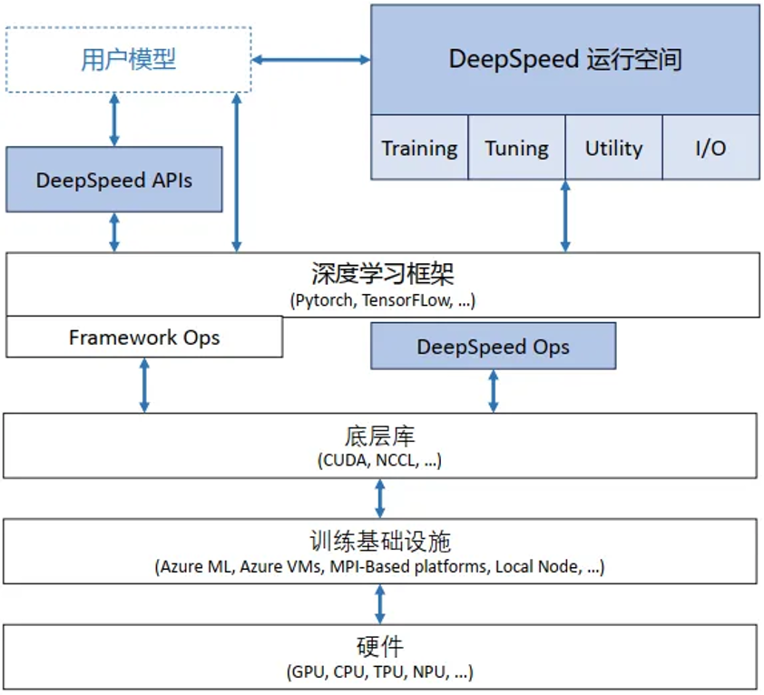
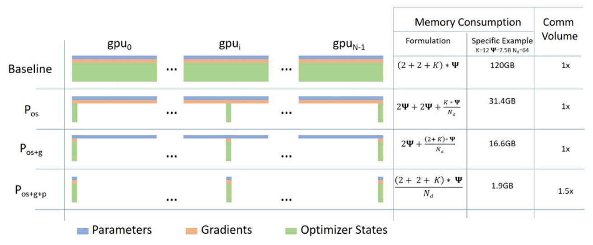

<!--Copyright © ZOMI 适用于[License](https://github.com/Infrasys-AI/AIInfra)版权许可-->

# 01.DeepSpeed 框架介绍

> Author by: Ferman Yang

随着 chatgpt 等模型引发人工智能领域的浪潮，越来越多的公司和团体想要快速、方便地训练和部署自己的类 chatgpt 模型。但是随着训练模型的大小和训练数据的规模越来越大，训练成本也随之增加，往往需要大规模的集群和数百上千的训练卡用于模型训练，并且具备相对较高的机器利用率和更好的吞吐，而传统训练的方法则面临内存限制和计算瓶颈等挑战。基于这样的现状，微软研发并开源了一个高效且易于使用的开源系统，这就是我们所熟知的 DeepSpeed 框架，目前已经成为大模型训练的主流框架。

DeepSpeed 助力于打造全球最强大的语言模型，例如[MT-530B](https://www.microsoft.com/en-us/research/blog/using-deepspeed-and-megatron-to-train-megatron-turing-nlg-530b-the-worlds-largest-and-most-powerful-generative-language-model/)和[BLOOM](https://huggingface.co/blog/bloom-megatron-deepspeed).作为一款易于使用的深度学习优化的软件套件，DeepSpeed 提供以下核心支持:

* 支持数十亿，甚至千亿参数规模的稠密或者稀疏模型的训练和推理
* 能够实现优异的系统吞吐，并且可以高效扩展到数千个 GPU
* 即使在资源受限的 GPU 系统上，也可以进行训练和推理
* 在推理上实现超低的延迟和超高的推理
* 以较低的成本实现极致的压缩，带来超高推理延迟优化和模型尺寸的大幅减小

DeepSpeed 主要包含以下四个核心的创新支持

* Training: DeepSpeed 为了使大模型训练更加高效，提供了一系列的系统性创新，同时显著提升了易用性.这些创新主要包括 Zero， 3D 并行，DeepSpeed-MoE， ZeRO-Infinity 等.更多关于 DeepSpeed 的训练创新可以通过以下链接了解详情: [DeepSpeed-Training](https://www.deepspeed.ai/training/)
* Inference: DeepSpeed 提供了张量并行，流水线并行，专家并行以及 Zero 等并行技术，并且与一系列定制的高性能推理 kernel，通信优化以及异构内存技术相结合，从而实现了更大的推理规模，更高的系统吞吐以及极低的延迟和推理成本.更多关于 DeepSpeed 的推理创新可以通过以下链接了解详情: [DeepSeep-Inference](https://www.deepspeed.ai/inference)
* Compression: 为了进一步提升推理效率，DeepSpeed 为研究人员和相关的从业人员提供了易于使用并且可以灵活组合的压缩技术，用于压缩模型，实现了更快的速度，更小的模型尺寸并且显著降低了压缩成本.比如 ZeroQuant，XTC 等先进的创新方法都被包含其中.更多关于 DeepSpeed 的压缩创新可以通过以下链接了解详情: [DeepSpeed-Compression](https://www.deepspeed.ai/compression)
* DeepSpeed4Science: DeepSpeed 团队同时还推出了一项名为 DeepSpeed4Science 的新计划，旨在通过 AI 技术的系统创兴，帮助相关领域的专家解决当前一些重大的科学谜团.更多关于 DeepSpeed4Science 的内容可以通过以下链接了解详情: [DeepSpeed4Science Tutorials](https://www.deepspeed.ai/deepspeed4science/)

在本节中，我们主要聚焦于 DeepSpeed 的 training 部分.本章后续章节对于 DeepSpeed 的解读和介绍，相关代码主要参考[DeepSpeed v0.17.5 版本](https://github.com/deepspeedai/DeepSpeed/tree/v0.17.5)

## 1. DeepSpeed 整体架构

!!!!!!!
可以按这个思路来展开：分布式训练的基本思路、DeepSpeed 如何把这些思路模块化实现、DeepSpeed 架构图（简单框图说明）

DeepSpeed 整体软件架构如图:

这种架构可以在训练框架上进行训练和推理的独立优化，并且相较于紧密耦合的其他架构，这种架构可以更快捷地集成到外部生态，快速适配外部生态的更新迭代. 此外，这种架构设计也与基础硬件和配置无关，用户可以自由选择喜欢的平台进行 DeepSpeed 的调用.

DeepSpeed 主要包含以下三部分：

* apis: DeepSpeed 提供易用的 api 接口. 训练模型和推理模型只需要简单调用几个接口即可。其中最重要的是 initialize 接口，用来初始化 DeepSpeed 引擎.配置参数一般保存在 ds_config.json 文件中，在其中配置训练参数及优化技术等。

* runtime: DeepSpeed 运行时组件，是 DeepSpeed 管理、执行和性能优化的核心组件。如部署训练任务到分布式设备、数据分区、模型分区、系统优化、微调、故障检测、checkpoints 保存和加载等。该组件使用 python 语言实现。

* ops: DeepSpeed 用 c++和 cuda 实现的底层内核，用于优化计算和通信，例如 Ultra-fast dense transformer kernels，稀疏 attention kernels 以及 1-bit Adam， 0/1 Adam 和 1-bit LAMB 等优化器.默认情况下，所有这些 ops 将使用 torch 的 JIT C++扩展加载器进行即时构建(JIT)，该加载器依赖 ninja 在运行时进行动态链接.

## 2. 核心模块与功能

下面介绍 deepspeed 的一些核心技术，并且阐述 DeepSpeed 如何实现通过这些技术实现高效且高扩展性的大规模分布式训练。

!!!!!!!!
通用的介绍网上很多了，而且大家知道的也很多，能不能打开 DeepSpeed（https://github.com/deepspeedai/DeepSpeed） 的代码模块，让大家了解一个分布式框架式如何开发的，有哪些代码模块。我觉得这个是核心。

### ZeRO(Zero Redundancy Optimizer)

零冗余优化器（Zero Redundancy Optimizer，缩写为 ZeRO）是一种用于大规模分布式深度学习的内存优化技术， 是 DeepSpeed 优化创新中的核心技术.使用 DeepSpeed ZeRO 技术能够有效训练包含数万亿参数的大型模型，与其他用于训练大型模型的模型并行方法相比，使用 DeepSpeed ZeRO 的另一个主要优势在于无需修改模型代码。ZeRO 作为 DeepSpeed 的一部分，显著提高了大规模模型训练过程中的显存效率和计算效率。

ZeRO 技术可以克服数据并行和模型并行的局限性，同时实现两者的优点。通过在数据并行的进程之间划分模型的优化器状态参数、梯度和模型参数来消除数据并行进程中的显存冗余。同时，ZeRO 在训练期间使用动态通信调度在分布式设备之间共享必要的状态，以保持数据并行的计算粒度和通信量。同时 Zero 的实现是一种增量优化的分阶段实现，也就是说低层次的优化同样应用在高层次的优化中.具体而言，Zero 优化包含以下三阶段:

* Stage 1: 在所有的 dp 进程之间切分优化器状态(比如，对于大模型训练中最常用的 Adam 优化器，包含 32-bit 的模型权重以及一阶动量，二阶动量)， 此时，所有的进程只需要处理自己那份状态分片.

* Stage 2: 用于更新模型参数的 16-bit 的参数提低也会被进一步在 dp group 之间的进程进行切分，此时，所有的进程只需要保留对应自己的参数状态分片的梯度分片.

* Stage 3: 16-bit 的模型参数会被进一步在 dp group 之间的进程切分，这样在模型进行前向操作时，就需要收集模型参数执行前向操作，而且执行前向操作之后，模型参数则会恢复切分的状态，节省显存.结合前面两个 Stage，优化器只用更新当前 dp 进程上的 16-bit 的模型参数.

可以通过以下示意图进行直观的理解:

图中的 $P_{os}$， $P_{os+g}$， $P_{os+g+p}$ 就是分别对应 Zero Stage 1， Stage 2 和 Stage 3.

此外， Zero-Stage-3 还包含"显存卸载引擎"来组成 Zero-Infinity([Zero-Infinity 论文](https://arxiv.org/abs/2104.07857))，通过把显存卸载到 CPU 和 NVME 上进一步节省显存消耗.

Zero 系列优化是 DeepSpeed 训练中最为核心的技术，我们将在下一章节进行更加详细的分析.

### 并行策略支持

DeepSpeed 自 v0.3 版本后，引入了对流水线并行的支持.流水线并行将模型的各个参数层切分成不同的阶段，实现各个流水线阶段的并行执行.在如今以经典的 Transformer-Decoder 结构为主导的大规模模型训练中，流水线并行具有极高的拓展性，并且以相对较小的通信量带来了更低的参数显存占用和更高的计算效率.DeepSpeed 的流水线训练引擎`PipelineEngine`支持混合的数据并行和流水线并行，并且可以进一步和 Megatron-LM 的模型并行相结合.下图展示了使用 DeepSpeed 进行 3D 并行训练的数据流.根据 DeepSpeed 的实验数据[deepspeed-extreme-scale-model-training-for-everyone](https://www.microsoft.com/en-us/research/blog/deepspeed-extreme-scale-model-training-for-everyone/)，在 DeepSpeed 使能下的 3D 并行可以支持 1T 参数的模型训练.

DeepSpeed 使用梯度累积的机制来使能流水线并行. 每个训练的 batch 会被分成多个 micro-batch 进行训练，microbatch 之间进行多次梯度累积来等效整个大 batch 的训练.多个 micro-batch 在执行阶段可以被多个流水线阶段并行处理，以此来使能流水线并行的并行优势，增大训练吞吐.当一个流水线阶段完成一个 micro-batch 的前向流程时，激活值就会被传递给流水线的下一个阶段，此时，当前流水线阶段就可以处理下一个 micro-batch. 与此类似，当下一个流水线阶段完成一个 micro-batch 的反向时，对应输入的激活值的梯度则会被传给上一个流水线阶段.每个 micro-batch 的反向都会进行梯度的累积.在所有 micro-batch 的前反向执行结束后，所有的数据并行组再进行参数梯度的规约，最后，optimizer 进行模型参数的更新.

上图是 DeepSpeed 使用混合的数据并行和流水线并行的训练示意图.其中，一个完整的训练 batch 有完整的 8 个 micro-batch，数据并行和流水线并行的大小都是 2. GPU0 和 GPU2 共同组成了一个流水线上的两个阶段，交替执行训练的前反向阶段(分别用 F 和 B 进行标识). 分别执行完当前流水线上的 4 个 microbatch 之后，GPU0 和 GPU2 再分别和 GPU1 以及 GPU3 进行梯度规约(用 AR 进行标识)，GPU1 和 GPU3 同理. 最后，所有的训练进程再进行参数的更新. 

可以看到，虽然 GPU2 和 GPU3 作为流水线并行的后一个阶段，相对于 GPU0 和 GPU1 更早地完成梯度规约的操作，仍然需要等待 GPU0 和 GPU1 执行完最后一个 micro-batch 的反向以及梯度规约后再同时进行模型参数更新.这是因为，通常我们需要在最后的模型参数更新中检测所有的参数更新梯度中是否有`NaN`和`Inf`等异常值，由此来判断是否跳过这一步的训练.并且在大部分的大模型训练中，也需要获取全局的`grad norm`值来进行梯度裁剪，所以这里需要有不同流水线阶段的同步.虽然近期有一些工作([zero_bubble](https://arxiv.org/pdf/2401.10241))，通过回滚的方式绕过这里的同步，并且保持 optimizer 参数更新的同步语义，但是并未被大规模应用在现有的流水线并行的实现中.

### Sparse Attention

像 Transformer 这种基于注意力机制的深度学习模型可以高效地捕捉输入序列中的 token 之间关系，所以这种注意力机制也被广泛应用于文本，图像以及语音的数据.然而，尽管注意力机制可以有效地捕捉长距离的依赖关系，在具体实践中，注意力机制的应用往往会被计算和显存的限制所约束.这主要是因为注意力系数的计算是随着输入序列的长度 $n$ 呈现二次方的增长趋势，即 $O(n^2)$ 关系.

为了解决这个问题，DeepSpeed 提供了一系列稀疏注意力内核(sparse attention kernel).这种稀疏注意力内核通过块稀疏(block-sparse)计算技术将注意力系数计算的计算量和显存需求降低了几个数量级. 这些内核不仅缓解了注意力计算的显存消耗瓶颈，而且可以高效地执行稀疏计算.此外，这些计算内核的 API 可以和任意基于 Transformer 结构的模型进行集成. 除了提供广泛的稀疏结构外，这些稀疏注意力内核还可以灵活地处理任意用户自定义的块稀疏结构.具体而言，稀疏注意力主要通过计算相邻 token 之间的局部注意力，或者通过用局部注意力计算的 token 来规约出全局注意力. 此外，稀疏注意力还支持随机的注意力，或者局部注意力，全局注意力以及随机注意力的任意组合.

以上图为例，蓝色，橙色和绿色块分别代表局部，全局以及随机注意力.因此，稀疏注意力机制可以将显存占用减少到 $O(wn)$，其中 $1<w<n$，$w$ 是一个参数，其值取决于具体的注意力结构.

DeepSpeed 实现的这一系列稀疏注意力内核基于 PyTorch，并且通过 Triton 进行开发. 由于这些内核并非基于 CUDA 进行开发，后续可以快速支持 CPU/OpenCL/Vulkan 等架构. 下图描述了 DeepSpeed 使用块稀疏计算执行注意力层的前向和反向过程.其中，$S$ 代表块稀疏矩阵，而 $D$ 代表稠密矩阵.

DeepSpeed 通过稀疏注意力机制，可以让 BERT-base 和 BERT-large 处理的序列长度提升 10 倍和 16 倍. 此外，与稠密实现相比，稀疏注意力可以减少总计算量，并且提高训练速度，在 BERT-base 上，随着序列长度增加，DeepSpeed 稀疏注意力最高可以带来 6.3 倍的性能提升.

除了以上三个核心技术外，DeepSpeed 还集成了很多训练优化，比如基于 Transformer 结构，高度定制的计算内核，适用于各种训练配置以及高度优化的 Adam 优化器以及自 v0.5 引入的对于混合专家(MoE)的支持以及优化等.在此就不一一赘述，可以翻阅[DeepSpee Trainning Features](https://www.deepspeed.ai/training/#features)进行进一步了解.

### 内存优化与训练加速

!!!!!!!!
Activation Checkpointing、Offloading 到 CPU / NVMe、混合精度训练 (FP16/BF16)

### 推理优化

!!!!!!!!
高效推理内核（Transformer kernel）

## 总结与思考

!!!!!!!!
虽然 DeepSpeed 官方已经停止维护，但是 XXXX。

## 参考与引用

* https://arxiv.org/abs/1910.02054
* https://www.deepspeed.ai/training/
* https://github.com/deepspeedai/DeepSpeed
* https://zhuanlan.zhihu.com/p/624412809