<!--Copyright © ZOMI 适用于[License](https://github.com/Infrasys-AI/AIInfra)版权许可-->

# 07. DualPipe 原理(Continue)

> Author by：杨泓东

pipeline parallelism(pp)是介于 data parallelism 以及 tensor parallelism 之外的一种模型并行方式。pp 的核心思想是通过将大模型分解成多个层，并将它们组成一个流水线的方式进行前向和反向传播，从而减少单卡的显存占用。主要相关的 pp 算法有 1f1b, interval 1f1b, zero bubble, chimera, bitpipe。

接下来将深入解析 DualPipe 的核心原理与具体实现。从 DualPipe 的设计动机开始，阐述其具体实现，并引出其与 megatron 框架的结合，进行多机多卡实验，profile 和流水线可视化。之后会重点介绍跨 batch 的 overlap 实现，分析如何重构 megatron GPT Model，实现 fwd 和 bwd 的 chunk 交错执行。随后，会进行 Dualpipe 参数气泡显存分析，并介绍 dualPipe 引入的变体

## 1. dualpipe 设计动机
1. dualpipe 的设计思路=zero bubble + 双流水线
2. 对于 DeepSeek-V3，跨节点 EP 引入的通信开销导致计算与通信的效率比约为 1:1。双流水线的稳定阶段提供了对来自两个方向的 forward 和 backward 之间实现 overlap 的机会。
3. 使用 zero_bubble 进一步减少气泡。整个 dualpipe 不仅实现了 alltoall 通讯和计算的 overlap，而且使得 dualpipe 即使在没有繁重通讯负担的更一般情况下，仍展示出效率优势。
4. 虽然 DualPipe 需要保持模型参数的两个副本，但由于 deepseekv3 在训练期间使用了较大的 EP 尺寸，这并不会显著增加内存消耗。
5. 对于 DualPipe 来说，无论 num_micro 数量如何增加，气泡或激活内存都不会增加。

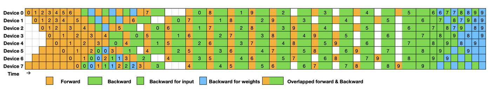
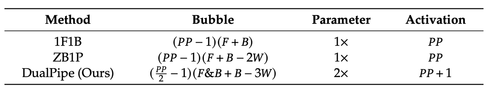

## 2. Dualpipe schedule 具体实现（micbatch 层面）
### 2.1 流水线 code 实现逻辑
world_size: 每个 pp group 的长度
上半区：pp rank < pp_world_size / 2 
下半区：pp rank >= pp_world_size / 2 
abs_rank: 设 rank 为当前 device 在当前 pp_group 的 rank(不是 global rank)。如果 rank 处于下半区:
`abs_rank = rank < world_size // 2 ? rank : world_size - 1 - rank` 
F: forward
F0: 方向 1 的 F，micro_batch_id = 0~9
F1: 方向 2 的 F，micro_batch_id = 10 ～19
B: dgrad
W: wgrad
BW: dgrad + wgrad

| stage | loop_num                            | 上半区                                                    | 下半区                                                    | 通讯                                                       | 示意图 |   |   |   |   |
|-------|-------------------------------------|--------------------------------------------------------|--------------------------------------------------------|----------------------------------------------------------|-----|---|---|---|---|
| 1     | 2 * (world_size / 2 - 1 - abs_rank) | nF0                                                    | nF1                                                    | send_forward_recv_forward                                |     |   |   |   |   |
| 2     | 2 * (1 + abs_rank)                  | nF0F1                                                  | nF1F0                                                  | send_forward_recv_backward                               |     |   |   |   |   |
| 3     | (world_size / 2 - 1 - abs_rank)     | nB1W1F1                                                | nB0F0F1                                                | send_backward_recv_forward send_forward_recv_backward |     |   |   |   |   |
| 4     | num_batch - world_size              | Overlap: nF0B1F1B0                                     | Overlap: nF1B0F0B1                                     | send_forward_recv_backward                               |     |   |   |   |   |
| 5     | 2 * abs_rank + 1                    | nBW1BW0(The second half of the chunks use zero bubble) | nBW0BW1(The second half of the chunks use zero bubble) | send_backward_recv_forward                               |     |   |   |   |   |
| 6     | (world_size / 2 - abs_rank)         | nB0W                                                   | nB1W                                                   | recv_backward send_backward                           |     |   |   |   |   |
| 7     | pop_all                             | nW                                                     | nW                                                     |                                                          |     |   |   |   |   |
|       |                                     |                                                        |                                                        |                                                          |     |   |   |   |   |
|       |                                     |                                                        |                                                        |                                                          |     |   |   |   |   |

### 2.2 与 megatron 框架的结合
#### 2.2.1 bd group 和 pp group
1. bd group 用于实现双向 model 参数和梯度同步的通讯。如 pp_group=[0,1,...,7]，则 bd_group=[[0,7], [1, 6]...]。
2. 只维护一个 pp_group，通讯时，根据 global direction flag，交换 get_pipeline_model_parallel_next_rank()和 get_pipeline_model_parallel_prev_rank()的数值实现通讯方向的逆转。计算时，根据 global direction flag 获取需要使用的 model 和 dataloader。

#### 2.2.2 Model generator
model 构造为一个长度为 2 的 list，model[0]存储的是方向 1 的 model，model[1]存储的是方向 2 的 model。
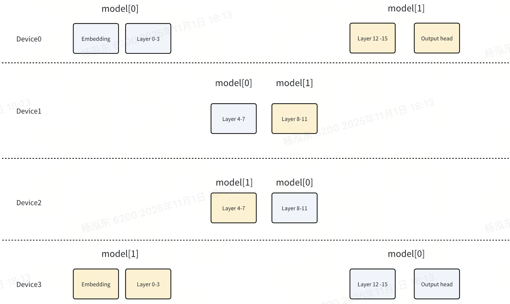

#### 2.2.3 Model 参数和梯度的同步
1. 创建完 model list，将 rank[i]上 model[0]的参数 broadcast 到 rank[pp_world_size - i]上的 model[1]，确保初始值相同。
2. 每次流水线结束，在 bd_group 内进行梯度的 all_reduce，确保每次迭代完毕后对应的 model 的梯度相同。
3. 设置另一份 model 的 share 参数为 True，避免计算 grad_norm 时计入。
4. Load checkpoint 时需要 reload optimizer 的 parameters。

#### 2.2.4 dataloader
对于 dualpipe，rank_0 和 rank_last 的 dataloader 扩展为长度为 2 的 list。dataloader[0]用于方向 1，dataloader[1]用于方向 2。dataloader 包装的数据集完全相同，通过下图的指针控制 dataloader 获取不同方向的数据。
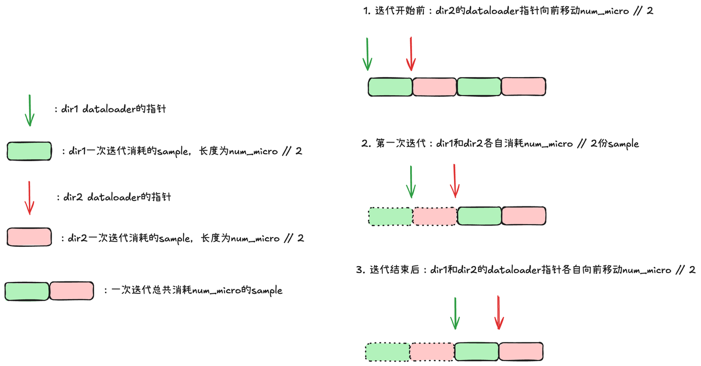

#### 2.2.5 对 pp <= num_micro < 2 * pp 情况的支持
假设 pp=8，num_micro=8，原来的 stage 的形状会变得极其不规则，采用传 fake_tensor 的方式解决
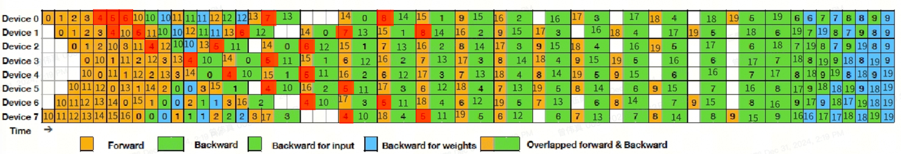

### 2.3 profile 和流水线可视化
pp=8, num_micro=20, on pp_rank=1
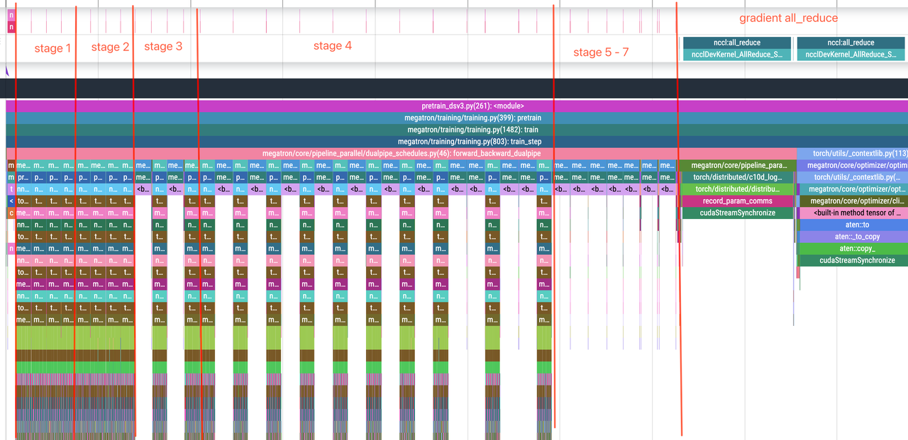
pp=16, num_micro=40

### 2.4 实验
#### 2.4.1 32c
橙色：dualpipe
蓝色：1F1B
dualpipe 比 1F1B 慢 1s 左右。小参数量下，双向 model 带来的额外的梯度 all_reduce 成为了主要性能瓶颈。
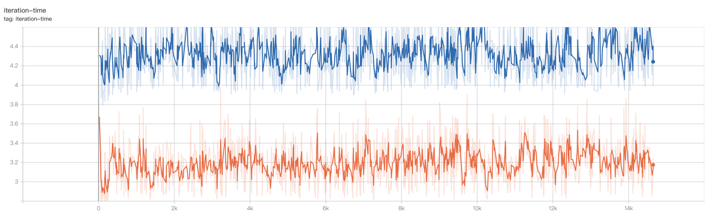
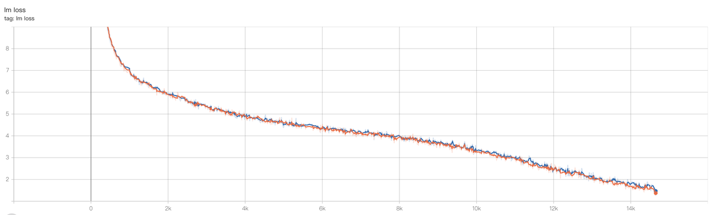

#### 2.4.2 256c
红色：1F1B
蓝色：dualpipe
参数量上去后，速度上 dualpipe 已经反超了 1F1B，减少气泡带来的收益能覆盖掉梯度 all_reduce 带来的额外开销。
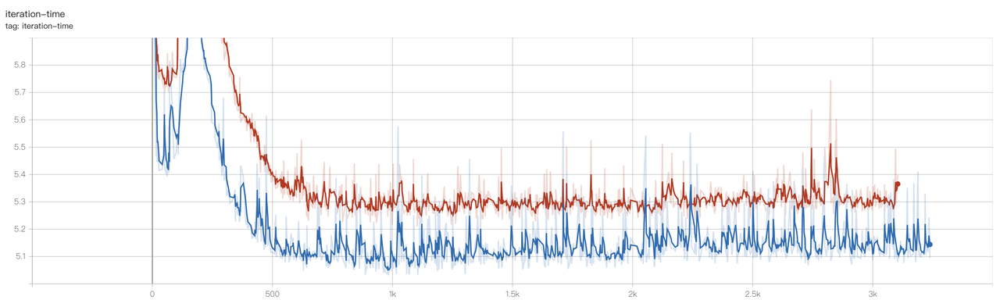
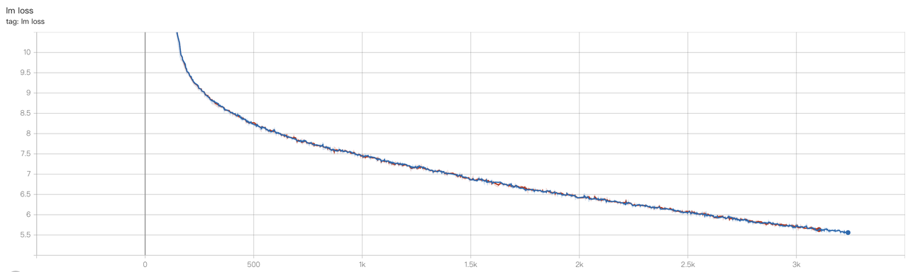

## 3. Dualpipe 参数气泡显存分析
### 3.1 Dualpipe
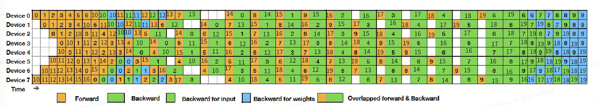

### 3.2 Bubble   

这里的气泡都是指 device 空闲时间,不是和计算时间的比例

$$ s:seq len$$

$$h:hidden-size$$
$$b:micro-batch-size$$
下面的 bubble 计算都是单个 devices
- 第一部分: 上图黄色框填充部分
$$bubble_{1}=(PP/2-1) \times F
$$
- 第二部分: 图中蓝色虚线框
设 $$B_{X}=B-W$$ 为 input 的 bwd, 即 DGRAD,$W$ 为 WGRAD。
$B_{X}$ 比 $F$ 需要的时间长，例如 device6 计算完了 fwd 1,需要等 device7 完成绿色框的 bwd for input 0

$$bubble_{2}=(PP/2-1)\times(B_{X}-F)=(PP/2-1)\times(B-W-F)

$$
- 第三部分：图中紫色框填充部分
$$bubble_{3}=(PP/2-1)\times(F\&B-B)$$
- 第四部分: 图中红色虚线框
$$bubble_{4}=(PP/2-1)\times(B_{X}-W)=(PP/2-1)\times(B-2W)

$$
$$bubble_{total}=bubble_{1}+bubble_{2}+bubble_{3}+bubble_{4}=(PP/2-1)\times(F\&B+B-3W)$$

### 3.3 Param

第一个正向流水线：                
- device 0: stage 0                     
- device 1: stage 1
- device 2: stage 2
- device 3: stage 3

第二个反向流水线
- device 3: stage 0
- device 2: stage 1
- device 1: stage 2
- device 0: stage 3
双向流水线一个 device 会保存两份 stage 的 layer 参数，所以是两倍

### 3.4 峰值显存
上表中激活的 PP 其实代表是 $$PP*M_B$$，其中 PP 代表流水线 stages,$$M_B$$ 代表 backward 阶段对于存储激活 x 所需要的显存
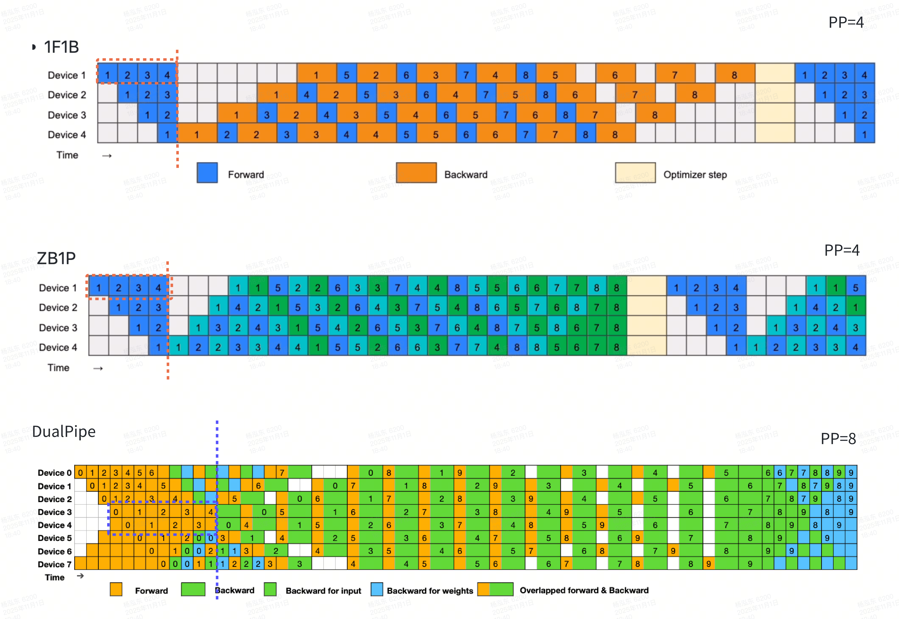