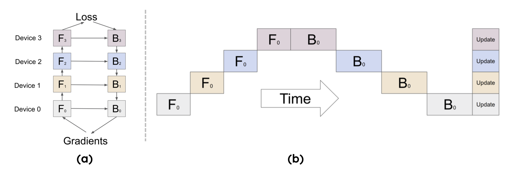
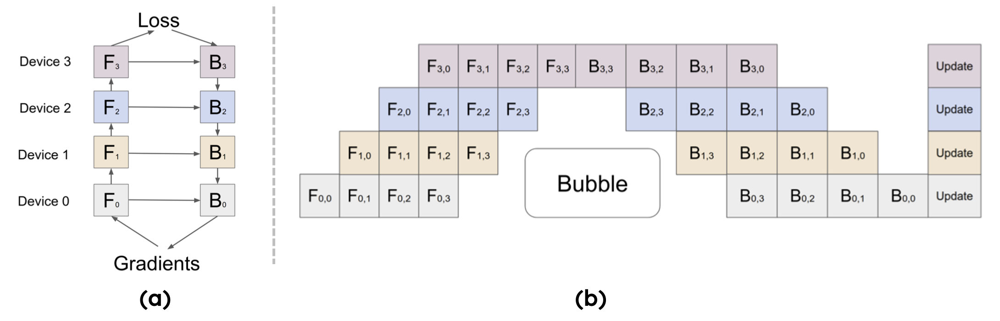

<!--Copyright © ZOMI 适用于[License](https://github.com/Infrasys-AI/AIInfra)版权许可-->

# 08. PP 流水并行原理(DONE)

> Author by：高亮  

接下来将深入解析流水线并行（Pipeline Parallelism, PP）的核心原理与优化策略。从最基础的朴素流水并行开始，阐述其前向和反向传播中数据在多个设备间传递的工作方式，并引出其核心性能瓶颈——空泡（Bubble）。之后会重点介绍空泡率的计算，分析如何通过增大 micro-batch 来降低空泡、提升设备利用率。随后，会探讨 Google 提出的 GPipe 如何通过前向与反向交错执行的调度策略来高效利用硬件。

## 1. 朴素流水并行原理

对于多层模型，当参数规模超出单卡内存上限时，一个直观的解决方案是按层切分模型，将每部分部署在独立设备上。例如，若模型含 12 层（layer），可切分为 4 份（GPipe 论文[1]中称每一份为一个 cell），每份 3 层，再将 4 份分别部署到 4 块 GPU 上。

整体结构如下图（a）所示，第 k 个 cell 的模型参数对应存储在第 k 块 GPU 上（即按上述示例，每块 GPU 仅保存 3 层参数）。其中，$F_k$ 和 $B_k$ 分别表示第 k 个 cell 的前向计算（forward）与反向计算（backward）。

对于单个 batch，计算顺序需遵循流水线逻辑：图中下标 0 代表第 0 个 batch，不同色块对应不同 rank（GPU），每一列代表一个时间段（如图（b）所示）。具体流程如下：

在前向传播过程中：rank0 接收训练数据并执行本地计算，生成 Activation 后传递给 rank1；rank1 接收 Activation 完成本地计算，再传递给 rank2；依次类推，直至 rank3 完成前向计算，生成模型最终输出。

在反向传播过程中：rank3 基于模型输出与标签计算损失，生成梯度后传递给 rank2；rank2 结合接收的梯度与本地缓存的 Activation 计算梯度，再传递给 rank1；依次回传至 rank0，最终得到所有 rank 的梯度。

在完成一次前向与反向流水线传输后，需等待 rank0 完成反向计算，再使用当前 batch 的梯度统一同步更新（synchronous）所有层的参数。至此，每个 rank 的权重参数更新完毕，一轮迭代训练结束。

## 2. Bubble 空泡率

在上一节中，我们明确了朴素流水并行（PP）的执行逻辑：模型被切分为 $p$ 个 stage，micro-batch 依次在各 rank 上完成前向计算，再按反向顺序回传梯度完成反向计算。

为量化流水线的“忙闲程度”，需引入刻画“等待/空转”开销的指标——并行空泡（Parallelism Bubble）及其占比空泡率（Bubble Ratio）。

> 直观理解：流水线并非从启动即“满负荷”运转。前期需将各 stage 依次“灌满”（warmup 阶段），尾部需将在途 micro-batch“排空”（cooldown 阶段）。这两段头尾空转时间的总和即为空泡时间（Bubble Time），其在总迭代时间中的占比即为空泡率。

### 2.1 Bubble 时间计算

空泡时间的计算公式为：

$$
t_{\text{bubble}} \;=\; (p-1)\,\bigl(t_f + t_b\bigr)
$$

其中各参数含义如下：

- $p$：流水线并行度（stage/pipe 数量）；
- $m$：micro-batch 数量；
- $t_f$：单个 micro-batch 在某一 stage 的前向计算时间；
- $t_b$：单个 micro-batch 在某一 stage 的反向计算时间。

> 空泡时间为何是 $(p-1)(t_f+t_b)$？

可将时间线拆分为多个“时隙（slot）”：前向时隙时长约为 $t_f$，反向时隙时长约为 $t_b$。流水线需经历两个空转阶段：

1. warmup 阶段：第一个 micro-batch 需经过 $(p-1)$ 个前向时隙才能抵达最后一个 stage（rank $p{-}1$），此阶段需额外 $(p{-}1)t_f$ 空转时间；

2. cooldown 阶段：最后一个 micro-batch 的梯度需经过 $(p-1)$ 个反向时隙才能回传至第一个 stage（rank 0），此阶段需额外 $(p{-}1)t_b$ 空转时间；两段空转时间合并为 $(p-1)(t_f+t_b)$，即空泡时间。

### 2.2 理想迭代时间

理想迭代时间指流水线进入稳定阶段后，无空转的纯计算时长，计算公式为：

$$
t_{\text{ideal}} \;=\; m\,\bigl(t_f + t_b\bigr)
$$

稳定阶段的核心特征是：流水线每“推进”一个时隙，就有一个 micro-batch 的前向或反向计算在各 stage 上同步进行，无设备空转。

### 2.3 空泡率（Bubble Ratio）

空泡率为“空泡时间”与“总迭代时间（空泡时间+理想迭代时间）”的比值，代入公式可简化为：

$$
\mathit{bubble\ ratio}
\;=\;
\frac{t_{\text{bubble}}}{\,t_{\text{bubble}} + t_{\text{ideal}}\,}
\;=\;
\frac{(p-1)(t_f+t_b)}{(p-1)(t_f+t_b)+m(t_f+t_b)}
\;=\;
\frac{p-1}{m+p-1}
$$

从空泡率公式可推导出以下结论与实践启示：

1. micro-batch 数量 $m$ 越大，空泡率越低：当 $m \to \infty$ 时，$\displaystyle \lim_{m\to\infty}\frac{p-1}{m+p-1}=0$，这是 GPipe/1F1B 要求 $m \gg p$ 的根本原因。  

实例：若 $p{=}4,\,m{=}8$，则空泡率 $= \tfrac{3}{8+3}\approx 27\%$；若 $m$ 提升至 32，空泡率降至 $\tfrac{3}{32+3}\approx 8.6\%$，空转显著减少。

2. 并行度 $p$ 越大，需同步增大 $m$ 以控制空泡：若盲目增加 $p$ 但不提升 $m$，会放大 warmup/cooldown 的头尾开销，导致空泡率升高。

上述推导默认“各 stage 前/反向用时均衡”且“采用同步调度”。若 stage 时长失衡或存在通信阻塞，实际空泡率会高于理论值，需通过后续交错调度（GPipe/1F1B）与通信-计算重叠优化。

空泡率是流水线并行的核心评估指标，它将“结构性空转”与“有效计算”分离，直接指导三大优化方向：增大 $m$、控制/平衡 $p$、通过调度与重叠“隐藏”头尾空转。

## 3. Google GPipe 原理解析

### 3.1 GPipe 核心思想

基于前文定义的空泡时间与理想迭代时间公式：

$$
t_{\text{bubble}}=(p-1)(t_f+t_b),\quad
t_{\text{ideal}}=m(t_f+t_b),\quad
\Rightarrow\;
\mathit{bubble\ ratio}
=\frac{p-1}{m+p-1}
$$

可计算朴素流水并行在 $m=1$（不切分 micro-batch）时的空泡率：

$$
\mathit{bubble\ ratio}=\frac{p-1}{p},\qquad
\text{利用率 }U=1-\mathit{bubble\ ratio}=\frac{1}{p}
$$

当 $p=4$ 时，设备利用率仅 25%，大部分时间处于空转。为降低空泡、提升利用率，需基于公式增大 $m$。Google 提出的 GPipe 正是通过“切分 micro-batch + 前向-反向交错调度”，在有限显存下实现 $m \gg p$，显著降低空泡率并提升吞吐，其原理如图（b）所示：

### 3.2 对比朴素 PP

GPipe 采用模型并行方案，将模型切分为连续的 stage 并部署在独立设备上，既支持超大规模模型训练，又通过流水线逻辑提升设备利用率。其核心优化逻辑如下：

1. 将 mini-batch 进一步切分为更小的 micro-batch；
2. 处理完一个 micro-batch 并将结果传递给下游设备后，立即启动下一个 micro-batch 计算，通过“计算-传递重叠”减小空泡。

结合空泡率公式，当 $m>1$ 时，GPipe 的空泡率仍为 $\frac{p-1}{m+p-1}$，利用率则为：

$$
U \;=\; 1-\frac{t_{\text{bubble}}}{t_{\text{bubble}}+t_{\text{ideal}}}
\;=\; \frac{m}{\,m+p-1\,}
$$

对比朴素流水并行（$m=1$ 时 $U=\frac{1}{p}$），在同一 $p$ 下，GPipe 相对朴素 PP 的吞吐提升倍数为：

$$
\text{提升倍数}
=\frac{\dfrac{m}{m+p-1}}{\dfrac{1}{p}}
=\frac{p\,m}{\,m+p-1\,}
$$

增大 $m$ 可摊薄结构性空泡 $(p-1)$，使空泡率从 $\frac{p-1}{p}$ 降至 $\frac{p-1}{m+p-1}$，利用率从 $\frac{1}{p}$ 提升至 $\frac{m}{m+p-1}$；当 $m\gg p$ 时，利用率 $U(m)\to 1$，接近理论上限。

## 4. 动态内存峰值分析

### 4.1 前向缓存 Activation 内存

GPipe 采用“两段式调度”（先全前向、再全反向），从单设备视角看，每个节点需完成 $m$ 组 micro-batch 的前向计算，且在反向阶段开始前无法丢弃前向生成的 Activation（反向计算依赖 Activation），因此需将中间 Activation 缓存至内存。

内存峰值出现在“前向阶段结束、反向阶段未开始”的瞬间：此时每个 stage 需同时缓存 $m$ 个 micro-batch 的 Activation，形成动态内存峰值；进入反向阶段后，随着每个 micro-batch 反向计算完成，对应 Activation 逐步释放，内存占用才开始单调下降。

动态内存峰值的成因可总结为以下四点（由 GPipe 调度特性决定）：

- 两段式时序：严格遵循“全前向（all-forward）→全反向（all-backward）”，Activation 需跨阶段留存；
- 反向依赖：反向计算必须使用对应的前向 Activation，且反向需等待全前向结束，因此 $m$ 个 micro-batch 的 Activation 需留存至反向阶段；
- 峰值时机：前向结束、反向未开始时，Activation 缓存量达到最大；
- 线性增长：激活显存与 $m$ 成正比（$\propto m$），增大 $m$ 降低空泡率的同时，会快速触达显存上限。

### 4.2 Activation 生命周期管理

深入分析 Activation 的“生成—驻留—释放”生命周期，可更清晰理解内存峰值的来源：

在 GPipe 的两段式执行中，第 $i$ 个 stage 的第 $j$ 个 micro-batch 的 Activation，前向结束时会生成“可反向的边界 Activation”（如 Transformer 的隐状态、残差分支输入、LayerNorm 输入，部分实现还包含 Q/K/V）。该 Activation 需满足两个需求：

1. 异步传递给下游 stage $i+1$，作为其前向输入；
2. 本地长期缓存，直至该 micro-batch 的反向计算在本 stage 启动。

由于 GPipe 采用“先全前向、再全反向”，反向计算按“末段→首段、最后一个 micro-batch→第一个 micro-batch”的倒序推进：stage $p{-}1$ 先处理 $j=m{-}1$ 的 micro-batch，再处理 $j=m{-}2$，以此类推；stage $i$ 需等待梯度从 $i+1$ 回传后，才启动对应 micro-batch 的反向计算。

因此，第 $(i,j)$ 个 Activation 的驻留时间包含两部分：

1. 结构性等待：等待全前向结束并轮到本 stage 反向，耗时约 $(p-1-i) \cdot t_f$；
2. 序号等待：等待后续 micro-batch 反向完成，耗时约 $(m-1-j) \cdot t_b$；

用“时隙”近似表示，驻留时间公式为：

$$
\Delta t_{i,j}\;\approx\;\bigl(p-1-i\bigr)\cdot t_f\;+\;\bigl(m-1-j\bigr)\cdot t_b
$$

其中 $t_f,t_b$ 分别为单 micro-batch 在单个 stage 的前/反向时长（基于均衡假设）。这意味着：编号越小的 micro-batch（$j$ 小）、越靠前的 stage（$i$ 小），Activation 驻留时间越长；反之则驻留时间越短。

综上，GPipe 中 Activation 的生命周期可概括为：

- 生成（前向）：stage $i$ 处理 micro-batch $j$ 的前向，生成激活张量 $F_{i,j}^{(F)}$，需缓存至该 micro-batch 的反向 $B_{i,j}$ 执行时；
- 驻留（前向→反向间）：因 GPipe 不交错前向与反向，所有 $F_{i,0\ldots m-1}^{(F)}$ 需驻留至全局前向结束；
- 释放（反向）：stage $i$ 完成 micro-batch $j$ 的反向 $B_{i,j}$ 后，立即释放 $F_{i,j}^{(F)}$。

### 4.3 内存峰值公式估算

GPipe 单卡内存峰值由“参数系内存”与“激活系内存”两部分组成，核心关系为：

$$
\text{Max Memory} \propto \text{Layer Params} + \text{Activations} \times m
$$

其中：

- $p$：流水线并行度（stage 数）；
- $m$：micro-batch 数；
- $L_i$：第 $i$ 个 stage 包含的层数；
- $A_{\text{layer}}$：单层、单 micro-batch 需缓存的 Activation 内存，与 $b$（micro-batch 内样本数）、$s$（序列长度）、$h$（隐藏维度）、精度字节数正相关，经验公式为 $A_{\text{layer}} \approx c \cdot b \cdot s \cdot h \cdot \text{bytes}$（$c$ 为系数，取决于是否保存 QKV/残差/归一化、是否使用 FlashAttention 等）；
- $P_i$：第 $i$ 个 stage 的参数+优化器+梯度内存（字节），$P_{\max}=\max_i P_i$（取各 stage 中参数系内存的最大值）。

具体估算公式如下：

1. stage 级激活峰值：单个 stage 需缓存的最大 Activation 内存，$M^{(i)}_{\text{act, peak}} \;\approx\; m \cdot L_i \cdot A_{\text{layer}}$；
2. 训练时单卡峰值：单卡最大内存占用，$M_{\text{peak}} \;\approx\; \underbrace{P_{\max}}_{\text{参数系}} \;+\; \underbrace{\max_i \big(m L_i A_{\text{layer}}\big)}_{\text{激活系}}$。

结论：GPipe 中激活系内存与 $m$ 严格线性相关，增大 $m$ 降低空泡率的同时，会同步推高内存峰值。

### 4.4 重计算降低内存峰值

梯度检查点（Gradient Checkpointing，又称“重计算”）是解决 GPipe 内存峰值的核心技术，核心思想是：不长期保存层内中间 Activation，仅保留“分段边界”的必要张量；反向计算时，重新执行前向计算以恢复层内中间值，用少量计算开销换取内存占用降低。

将第 $i$ 个 stage 的 $L_i$ 层切分为 $g_i$ 段，仅缓存段边界 Activation，层内中间值反向时重算，此时 stage 级激活峰值公式调整为：

$$
M^{(i)}_{\text{act, peak}} \;\approx\; m \cdot A_{\text{boundary}} \;+\; \alpha \cdot L_i \cdot A_{\text{layer}}
$$

其中：

- $A_{\text{boundary}}$：单 micro-batch 的段边界 Activation 内存（远小于 $L_i \cdot A_{\text{layer}}$）；
- $\alpha$：段内短期工作集系数（与 $m$ 无关，由重算粒度决定）。

对比不开启重计算的场景（$M^{(i)}_{\text{act, peak}} \approx m\, L_i\, A_{\text{layer}}$），开启重算后，激活系内存与 $m$ 的线性系数从 $L_i \cdot A_{\text{layer}}$ 降至 $A_{\text{boundary}}$，内存峰值显著降低，从而可在相同显存下增大 $m$ 以进一步降低空泡率。

重计算的本质是“用少量重算换长期驻留显存”，在 GPipe 场景下，可将与 $m$ 同步放大的“长期激活体量”压缩至仅段边界，在不牺牲训练稳定性的前提下，释放显存空间或提升吞吐。

## 5. 总结与思考

朴素流水并行通过“切分模型、串行传递数据”解决了单卡内存不足问题，但存在明显的空泡问题，设备利用率低；空泡率公式 $\frac{p-1}{m+p-1}$ 揭示了“增大 $m$、平衡 $p$”是降低空泡的核心方向。

Google 提出的 GPipe 基于“前向-反向交错调度”，通过切分 micro-batch 实现 $m \gg p$，将设备利用率提升至接近理论上限，但也带来了“Activation 缓存导致的内存峰值”挑战。

重计算通过“重算层内中间值、仅存边界 Activation”，有效降低了 GPipe 的内存峰值，实现了“内存-计算”的平衡，为超大规模模型的流水线并行训练提供了关键支撑。

## 6. 本节视频

<html>
<iframe src="https://player.bilibili.com/player.html?isOutside=true&aid=1205166982&bvid=BV18f42197Sx&cid=1565630697&p=1&as_wide=1&high_quality=1&danmaku=0&t=30&autoplay=0" width="100%" height="500" scrolling="no" border="0" frameborder="no" framespacing="0" allowfullscreen="true"> </iframe>
</html>

## 7. 参考与引用

- [1] Huang, M. Y., Cheng, Y., Chen, K., Lee, H. Y., Ngiam, J., Chen, X., ... & Dean, J. (2019). GPipe: Efficient Training of Giant Neural Networks using Pipeline Parallelism. arXiv preprint arXiv:1811.06965.
