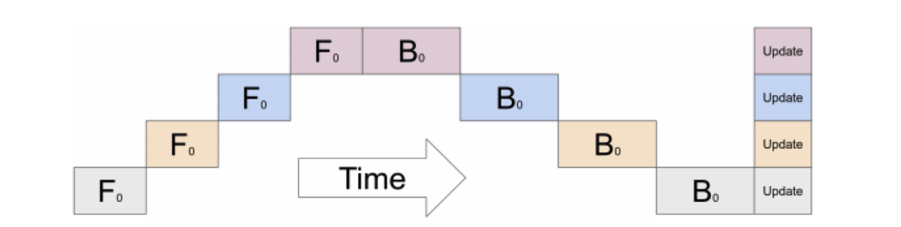
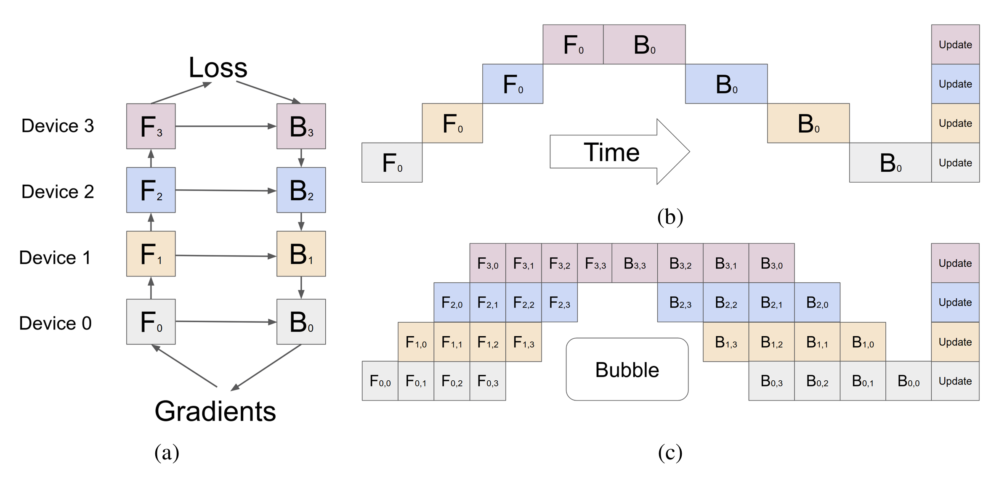
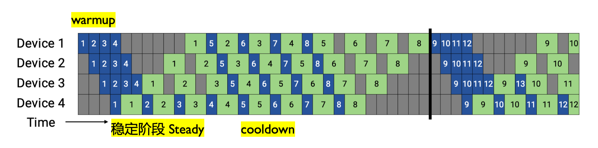
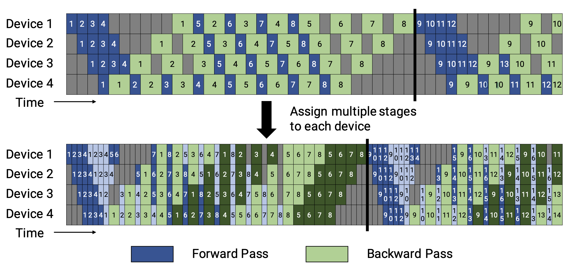

<!--Copyright © ZOMI 适用于[License](https://github.com/Infrasys-AI/AIInfra)版权许可-->

# CODE 03: Pipeline 并行实践

> Author by: 许灿岷

本实验旨在深入理解 Pipeline 并行原理。先实现 Gpipe 流水线并分析空泡率现象，后进阶实现 1F1B 和 Interleaved 1F1B 调度策略，优化空泡率现象，并实践混合并行策略。

## 1. Pipeline 并行基础

**Pipeline 并行（Pipeline Parallelism, PP）** 其核心思想是将一个庞大的神经网络模型，沿着层（Layer）的维度进行纵向切割，分割成多个连续的子模块（称为“阶段”，Stage），并将这些阶段部署到不同的计算设备（如 GPU）上。

数学上，模型可表示为函数复合：$F(x) = f_n(f_{n-1}(...f_1(x)...))$，其中每个 $f_i$（模型层/层组）对应 Pipeline 的一个“阶段”，分配到不同设备上执行。数据以“批次”（batch）的形式，像工厂流水线一样，依次流经各个阶段。

通过这种方式，每个设备只需加载和处理模型的一部分，从而突破**单卡显存的限制**。

然而，这种拆分也引入了新的挑战：
*   **通信开销：** 前向传播和反向传播过程中，相邻阶段之间需要频繁地传递中间结果（激活值和梯度），这会带来额外的通信延迟。
*   **空泡现象（Bubble）：** 由于流水线的“填充”（Fill）和“排空”（Drain）过程，部分设备在某些时刻会处于等待数据的空闲状态，造成计算资源的浪费。

**后续优化方向**：
Gpipe、1F1B、Interleaved 1F1B 等调度策略，本质都是通过调整「前向」和「反向」的执行节奏，来**压缩空泡时间、降低通信影响、更高效利用显存** —— 这些我们将在代码实践中逐一实现和对比。


```python
import torch
import torch.nn as nn
import torch.nn.functional as F
import time

# 设置随机种子以确保可重复性
torch.manual_seed(42)
if torch.cuda.is_available():
    torch.cuda.manual_seed_all(42)
```


```python
def get_available_devices(max_devices=4):
    """自动获取可用设备"""
    devices = []
    num_cuda = torch.cuda.device_count()
    if num_cuda > 0:
        devices = [torch.device(f"cuda:{i}") for i in range(min(num_cuda, max_devices))]
    else:
        devices = [torch.device("cpu")]
    print(f"可用设备列表: {[str(dev) for dev in devices]}")
    return devices


def calculate_bubble_rate(strategy_name, num_stages, num_microbatches, interleaving_degree=2):
    """根据策略类型计算正确的空泡率"""
    if num_stages == 1:
        return 0.0

    if strategy_name == "Naive":
        # Naive 策略没有流水线并行，空泡率为 0
        return 0.0
    elif strategy_name == "GPipe":
        # GPipe 的空泡率公式
        return (num_stages - 1) / (num_microbatches + num_stages - 1)
    elif strategy_name == "1F1B":
        # 1F1B 的空泡率公式
        return (num_stages - 1) / num_microbatches
    elif strategy_name == "Interleaved 1F1B":
        # Interleaved 1F1B 的空泡率公式
        return (num_stages - 1) / (num_microbatches * interleaving_degree)
    else:
        return 0.0

def create_model_parts(input_size=100, output_size=10):
    """创建更复杂的模型分段"""
    layers = [
        nn.Sequential(
            nn.Linear(100, 1024),
            nn.ReLU(),
            nn.Dropout(0.3),
            nn.Linear(1024, 1024),
            nn.ReLU(),
            nn.Dropout(0.3)
        ),
        nn.Sequential(
            nn.Linear(1024, 2048),
            nn.ReLU(),
            nn.Dropout(0.4),
            nn.Linear(2048, 2048),
            nn.ReLU(),
            nn.Dropout(0.4)
        ),
        nn.Sequential(
            nn.Linear(2048, 1024),
            nn.ReLU(),
            nn.Dropout(0.3),
            nn.Linear(1024, 1024),
            nn.ReLU(),
            nn.Dropout(0.3)
        ),
        nn.Sequential(
            nn.Linear(1024, 512),
            nn.ReLU(),
            nn.Dropout(0.2),
            nn.Linear(512, output_size)
        )
    ]
    return layers
```

## 2. Native Pipeline Parallelism（传统流水线并行）

首先，我们实现一个基础的流水线并行框架，只考虑了模型分割和流水线调度，将数据以 batch 为单位进行处理。




```python
class NaivePipelineParallel(nn.Module):
    def __init__(self, module_list, device_ids):
        super().__init__()
        assert len(module_list) == len(device_ids), "模块数量必须与设备数量相同"

        self.stages = nn.ModuleList(module_list)
        self.device_ids = device_ids
        self.num_stages = len(device_ids)

        # 将每个阶段移动到对应的设备
        for i, (stage, dev) in enumerate(zip(self.stages, self.device_ids)):
            self.stages[i] = stage.to(dev)

    def forward(self, x):
        intermediates = []
        current_output = x.to(self.device_ids[0])

        for i, (stage, dev) in enumerate(zip(self.stages, self.device_ids)):
            current_output = stage(current_output)
            if i < len(self.stages) - 1:
                # 移除 detach()，保留梯度
                current_output_act = current_output.requires_grad_(True)
                intermediates.append(current_output_act)
                current_output = current_output_act.to(self.device_ids[i+1])

        return current_output, intermediates
```

上面的代码实现了一个基础的流水线并行框架。它将模型分割为多个阶段，每个阶段放置在不同的设备上。在前向传播过程中，数据依次通过这些阶段，并在阶段间进行设备间的数据传输。

## 3. Gpipe 流水线并行

Gpipe(Gradient Pipeline) 是一种基于流水线并行的模型并行策略，它将一个大的训练批次（Batch）拆分成多个小的微批次（Micro-batch），依次流过 Pipeline 的各个阶段，每个阶段放置在不同的设备上。




```python


class GPipeParallel(nn.Module):
    def __init__(self, module_list, device_ids, num_microbatches=4):
        super().__init__()
        assert len(module_list) == len(device_ids), "模块数量必须与设备数量相同"

        self.stages = nn.ModuleList(module_list)
        self.device_ids = device_ids
        self.num_stages = len(device_ids)
        self.num_microbatches = num_microbatches

        # 将每个阶段移动到对应的设备
        for i, (stage, dev) in enumerate(zip(self.stages, self.device_ids)):
            self.stages[i] = stage.to(dev)

    def forward(self, x):
        """GPipe 策略: 先所有微批次前向，再所有微批次反向"""
        # 分割输入为微批次
        micro_batches = torch.chunk(x, self.num_microbatches, dim=0)
        activations = [[] for _ in range(self.num_stages)]

        # 前向传播: 所有微批次通过所有阶段
        for i, micro_batch in enumerate(micro_batches):
            current = micro_batch.to(self.device_ids[0])
            for stage_idx, stage in enumerate(self.stages):
                current = stage(current)
                if stage_idx < self.num_stages - 1:
                    # 保存中间激活值，保留梯度计算
                    current_act = current.detach().clone().requires_grad_(True)
                    activations[stage_idx].append(current_act)
                    current = current_act.to(self.device_ids[stage_idx + 1])
                else:
                    # 最后阶段直接保存输出
                    activations[stage_idx].append(current)

        # 拼接最终输出
        output = torch.cat(activations[-1], dim=0)
        return output, activations

    def backward(self, loss, activations):
        """GPipe 反向传播 - 修复版本"""
        # 计算最终损失梯度
        loss.backward()

        # 从最后阶段开始反向传播
        for stage_idx in range(self.num_stages - 2, -1, -1):
            # 获取当前阶段的激活值和下一阶段的梯度
            stage_activations = activations[stage_idx]
            next_gradients = []

            # 收集下一阶段的梯度
            for act in activations[stage_idx + 1]:
                if act.grad is not None:
                    # 确保梯度形状匹配
                    grad = act.grad
                    if grad.shape != stage_activations[0].shape:
                        # 如果形状不匹配，尝试调整梯度形状
                        try:
                            grad = grad.view(stage_activations[0].shape)
                        except:
                            # 如果无法调整形状，跳过这个梯度
                            continue
                    next_gradients.append(grad.to(self.device_ids[stage_idx]))

        # 反向传播通过当前阶段
        for i in range(len(stage_activations) - 1, -1, -1):
            if next_gradients and i < len(next_gradients):
                stage_activations[i].backward(next_gradients[i], retain_graph=True)
```

## 4. 空泡率分析与计算

**空泡率**是衡量流水线并行效率的重要指标，表示由于流水线填充和排空造成的计算资源浪费比例。空泡率的计算基于流水线填充和排空的时间开销。当微批次数量远大于流水线阶段数时，空泡率会降低，因为填充和排空时间相对于总计算时间的比例变小。

我们在这里以**Gpipe 流水线并行**的空泡率计算为例，计算空泡率。

在数学上，空泡率可以表示为：

$$
Bubble = (T_{fill} + T_{drain}) / (T_{total}) = (S - 1 + S - 1) / (2*(M + S - 1)) = (S - 1) / (M + S - 1)
$$

其中 $S$ 是流水线阶段数，$M$ 是微批次数量。$T_{fill}$ 表示流水线填充时间，$T_{drain}$ 表示流水线排空时间,$T_{total}$ 表示流水线总时间。


```python
def calculate_bubble_rate(strategy_name, num_stages, num_microbatches, interleaving_degree=2):
    """根据策略类型计算正确的空泡率"""
    if num_stages == 1:
        return 0.0

    if strategy_name == "Naive":
        # Naive 策略没有流水线并行，空泡率为 0
        return 0.0
    elif strategy_name == "GPipe":
        # GPipe 的空泡率公式
        return (num_stages - 1) / (num_microbatches + num_stages - 1)
    elif strategy_name == "1F1B":
        # 1F1B 的空泡率公式
        return (num_stages - 1) / num_microbatches
    elif strategy_name == "Interleaved 1F1B":
        # Interleaved 1F1B 的空泡率公式
        return (num_stages - 1) / (num_microbatches * interleaving_degree)
    else:
        return 0.0

configurations = [
    # 【对比组 1】固定 S=4，观察 M 增大如何降低空泡率（展示收益递减）
    (4, 4),   # M = S，空泡率较高，临界点
    (4, 8),   # M = 2S
    (4, 16),  # M = 4S（推荐工程起点）
    (4, 32),  # M = 8S
    (4, 64),  # M = 16S
    (4, 100),  # M = 25S，接近理想

    # 【对比组 2】固定 M=2S，观察 S 增大时空泡率如何上升（展示规模代价）
    (8, 16),  # M = 2S
    (16, 32), # M = 2S
    (32, 64), # M = 2S（如资源允许）

    # 【对比组 3】固定 M=4S，观察不同规模下的表现（推荐工程配置）
    (8, 32),  # M = 4S
    (16, 64), # M = 4S
]

print("=== 不同配置下的空泡率计算结果 ===")
for num_stages, num_microbatches in configurations:
    rate = calculate_bubble_rate("GPipe",num_stages, num_microbatches)
    print(f"阶段数: {num_stages:3d}, 微批次: {num_microbatches:3d}, 空泡率: {rate:.3f}")
```

    === 不同配置下的空泡率计算结果 ===
    阶段数:   4, 微批次:   4, 空泡率: 0.429
    阶段数:   4, 微批次:   8, 空泡率: 0.273
    阶段数:   4, 微批次:  16, 空泡率: 0.158
    阶段数:   4, 微批次:  32, 空泡率: 0.086
    阶段数:   4, 微批次:  64, 空泡率: 0.045
    阶段数:   4, 微批次: 100, 空泡率: 0.029
    阶段数:   8, 微批次:  16, 空泡率: 0.304
    阶段数:  16, 微批次:  32, 空泡率: 0.319
    阶段数:  32, 微批次:  64, 空泡率: 0.326
    阶段数:   8, 微批次:  32, 空泡率: 0.179
    阶段数:  16, 微批次:  64, 空泡率: 0.190


从上面代码的运行结果我们可以看出：
- **微批次的影响**：当 $M \gg S$ 时，空泡率趋近于 0（如 $S=4, M=100$，空泡率≈0.029），因此增加微批次是降低空泡率的核心手段。
- **阶段数的影响**：$S$ 越大，空泡率越高（相同 $M$ 下，$S=16$ 比 $S=4$ 空泡率高约 20%），因此 Pipeline 阶段数需与微批次数量匹配（建议 $M \geq 4S$）。

## 5. 1F1B 调度策略实现

1F1B(One-Forward-One-Backward) 调度是一种优化的流水线并行策略，它通过交替执行前向和反向传播来减少内存使用和空泡时间。




```python
class OneFOneBPipeline(nn.Module):
    def __init__(self, module_list, device_ids, num_microbatches=4):
        super().__init__()
        assert len(module_list) == len(device_ids), "模块数量必须与设备数量相同"

        self.stages = nn.ModuleList(module_list)
        self.device_ids = device_ids
        self.num_stages = len(device_ids)
        self.num_microbatches = num_microbatches

        # 将每个阶段移动到对应的设备
        for i, (stage, dev) in enumerate(zip(self.stages, self.device_ids)):
            self.stages[i] = stage.to(dev)

    def forward(self, x):
        """1F1B 策略: 交替执行前向和反向传播 - 重新实现"""
        # 分割输入为微批次
        micro_batches = torch.chunk(x, self.num_microbatches, dim=0)
        activations = [[] for _ in range(self.num_stages)]
        outputs = []

        # 1. 前向填充阶段 (Warm-up)
        for i in range(self.num_stages):
            # 处理前 i+1 个微批次的前 i+1 个阶段
            for j in range(i + 1):
                if j >= len(micro_batches):
                    break

                current = micro_batches[j].to(self.device_ids[0])
                for stage_idx in range(i + 1):
                    if stage_idx >= self.num_stages:
                        break

                    current = self.stages[stage_idx](current)
                    if stage_idx < self.num_stages - 1:
                        current_act = current.detach().clone().requires_grad_(True)
                        if stage_idx < len(activations):
                            activations[stage_idx].append(current_act)
                        current = current_act.to(self.device_ids[stage_idx + 1])

                if i == self.num_stages - 1:
                    outputs.append(current)

        # 2. 1F1B 阶段 (Steady state)
        for i in range(self.num_stages, self.num_microbatches):
            # 前向传播
            current = micro_batches[i].to(self.device_ids[0])
            for stage_idx in range(self.num_stages):
                current = self.stages[stage_idx](current)
                if stage_idx < self.num_stages - 1:
                    current_act = current.detach().clone().requires_grad_(True)
                    activations[stage_idx].append(current_act)
                    current = current_act.to(self.device_ids[stage_idx + 1])
            outputs.append(current)

        # 3. 反向排空阶段 (Cool-down)
        for i in range(self.num_microbatches, self.num_microbatches + self.num_stages - 1):
            # 这里只需要处理反向传播，前向已经完成
            pass

        # 确保输出批次大小正确
        if outputs:
            output = torch.cat(outputs, dim=0)
        else:
            output = torch.tensor([])

        return output, activations

    def backward(self, loss, activations):
        """1F1B 反向传播 - 修复版本"""
        # 计算最终损失梯度
        loss.backward()

        # 从最后阶段开始反向传播
        for stage_idx in range(self.num_stages - 2, -1, -1):
            stage_activations = activations[stage_idx]
            next_gradients = []

            for act in activations[stage_idx + 1]:
                if act.grad is not None:
                    # 确保梯度形状匹配
                    grad = act.grad
                    if grad.shape != stage_activations[0].shape:
                        try:
                            grad = grad.view(stage_activations[0].shape)
                        except:
                            continue
                    next_gradients.append(grad.to(self.device_ids[stage_idx]))

            for i in range(len(stage_activations) - 1, -1, -1):
                if next_gradients and i < len(next_gradients):
                    stage_activations[i].backward(next_gradients[i], retain_graph=True)
```

1F1B 调度的核心思想是在流水线中交替执行前向传播和反向传播，而不是先完成所有前向传播再进行反向传播。这种策略有两个主要优势：

1. **减少内存使用**：不需要存储所有微批次的前向传播中间结果
2. **降低空泡率**：通过更早开始反向传播，减少设备空闲时间

## 6. Interleaved 1F1B 调度策略实现

Interleaved 1F1B 调度是一种改进的 1F1B 调度策略，它通过交替执行前向和反向传播，并引入额外的填充和排空步骤来减少空泡率。




```python
class InterleavedOneFOneBPipeline(nn.Module):
    def __init__(self, module_list, device_ids, num_microbatches=4, interleaving_degree=2):
        super().__init__()
        assert len(module_list) == len(device_ids), "模块数量必须与设备数量相同"

        self.stages = nn.ModuleList(module_list)
        self.device_ids = device_ids
        self.num_stages = len(device_ids)
        self.num_microbatches = num_microbatches
        self.interleaving_degree = interleaving_degree

        # 将每个阶段移动到对应的设备
        for i, (stage, dev) in enumerate(zip(self.stages, self.device_ids)):
            self.stages[i] = stage.to(dev)

    def forward(self, x):
        """Interleaved 1F1B 策略: 改进的 1F1B，更细粒度的流水线"""
        # 分割输入为微批次
        micro_batches = torch.chunk(x, self.num_microbatches, dim=0)
        activations = [[] for _ in range(self.num_stages)]
        outputs = []

        # 简化的 Interleaved 实现 - 使用分组处理
        group_size = self.interleaving_degree

        # 处理每个微批次组
        for group_start in range(0, self.num_microbatches, group_size):
            group_end = min(group_start + group_size, self.num_microbatches)

            # 对组内每个微批次进行处理
            for i in range(group_start, group_end):
                current = micro_batches[i].to(self.device_ids[0])
                for stage_idx in range(self.num_stages):
                    current = self.stages[stage_idx](current)
                    if stage_idx < self.num_stages - 1:
                        current_act = current.detach().clone().requires_grad_(True)
                        activations[stage_idx].append(current_act)
                        current = current_act.to(self.device_ids[stage_idx + 1])
                outputs.append(current)

        output = torch.cat(outputs, dim=0)
        return output, activations

    def backward(self, loss, activations):
        """Interleaved 1F1B 反向传播 - 修复版本"""
        # 计算最终损失梯度
        loss.backward()

        # 从最后阶段开始反向传播
        for stage_idx in range(self.num_stages - 2, -1, -1):
            stage_activations = activations[stage_idx]
            next_gradients = []

            for act in activations[stage_idx + 1]:
                if act.grad is not None:
                    # 确保梯度形状匹配
                    grad = act.grad
                    if grad.shape != stage_activations[0].shape:
                        try:
                            grad = grad.view(stage_activations[0].shape)
                        except:
                            continue
                    next_gradients.append(grad.to(self.device_ids[stage_idx]))

            for i in range(len(stage_activations) - 1, -1, -1):
                if next_gradients and i < len(next_gradients):
                    stage_activations[i].backward(next_gradients[i], retain_graph=True)
```

## 7. 混合并行策略

混合并行结合了数据并行、流水线并行和张量并行，以充分利用多种并行策略的优势。


```python
import torch
import torch.nn as nn

# 辅助函数：获取可用 GPU 设备（模拟）
def get_available_devices(max_devices=4):
    devices = []
    for i in range(torch.cuda.device_count()):
        if len(devices) >= max_devices:
            break
        devices.append(torch.device(f'cuda:{i}'))
    if len(devices) == 0:
        devices = [torch.device('cpu')] * min(max_devices, 1)
    return devices

# 示例模型（复用原结构，确保兼容性）
class ExampleModel(nn.Module):
    def __init__(self, input_size, hidden_size, output_size):
        super().__init__()
        self.fc1 = nn.Linear(input_size, hidden_size)
        self.fc2 = nn.Linear(hidden_size, hidden_size)
        self.fc3 = nn.Linear(hidden_size, output_size)
        self.relu = nn.ReLU()

    def forward(self, x):
        x = self.relu(self.fc1(x))
        x = self.relu(self.fc2(x))
        x = self.fc3(x)
        return x

# 混合并行模型：Pipeline + DataParallel
class HybridParallelModel(nn.Module):
    def __init__(self, base_model, device_ids, dp_size=2, pp_size=2):
        super().__init__()
        self.dp_size = dp_size  # 数据并行路数（每个 Pipeline 阶段的复制份数）
        self.pp_size = pp_size  # Pipeline 阶段数（模型分割后的段数）
        self.device_ids = device_ids

        # 验证设备数量：总设备数 = 数据并行路数 × Pipeline 阶段数
        assert len(device_ids) == dp_size * pp_size, \
            f"设备数需等于数据并行路数×Pipeline 阶段数（当前：{len(device_ids)} != {dp_size}×{pp_size}）"

        # 1. Pipeline 分割：将基础模型拆分为 pp_size 个阶段
        self.pipeline_stages = self._split_model_for_pipeline(base_model, pp_size)

        # 2. 数据并行：为每个 Pipeline 阶段创建 dp_size 份副本（使用 nn.DataParallel）
        self.parallel_stages = nn.ModuleList()
        current_devices = device_ids  # 待分配的设备列表
        for stage in self.pipeline_stages:
            # 为当前 Pipeline 阶段分配 dp_size 个设备（数据并行）
            dp_devices = current_devices[:dp_size]
            current_devices = current_devices[dp_size:]  # 剩余设备用于下一阶段

            # 🔥 修复关键：将 stage 移动到第一个设备（DataParallel 要求）
            stage = stage.to(f'cuda:{dp_devices[0]}')

            # 包装为数据并行模块
            dp_stage = nn.DataParallel(stage, device_ids=dp_devices)
            self.parallel_stages.append(dp_stage)

    def _split_model_for_pipeline(self, model, pp_size):
        """
        辅助函数：将 ExampleModel 按 Pipeline 逻辑分割为 pp_size 个阶段
        分割规则：根据线性层拆分，确保每个阶段计算量均衡
        """
        stages = []
        if pp_size == 2:
            # 2 阶段分割：[fc1+relu, fc2+relu+fc3]
            stages.append(nn.Sequential(model.fc1, model.relu))
            stages.append(nn.Sequential(model.fc2, model.relu, model.fc3))
        elif pp_size == 3:
            # 3 阶段分割：[fc1+relu, fc2+relu, fc3]
            stages.append(nn.Sequential(model.fc1, model.relu))
            stages.append(nn.Sequential(model.fc2, model.relu))
            stages.append(nn.Sequential(model.fc3))
        else:
            # 默认不分割（pp_size=1，仅数据并行）
            stages.append(nn.Sequential(model.fc1, model.relu, model.fc2, model.relu, model.fc3))
        return stages

    def forward(self, x):
        """
        混合并行前向传播流程：
        输入 → Pipeline 阶段 1（数据并行）→ Pipeline 阶段 2（数据并行）→ 输出
        """
        if len(self.parallel_stages) == 0:
            return x

        # 确保输入在第一个 stage 的第一个设备上
        first_device = self.parallel_stages[0].device_ids[0]
        current_x = x.to(f'cuda:{first_device}')

        for stage in self.parallel_stages:
            current_x = stage(current_x)  # 每个阶段内部数据并行计算
        return current_x


# ========== 主程序：配置与测试 ==========

if __name__ == "__main__":
    # 1. 模型参数配置
    input_size, hidden_size, output_size = 100, 200, 10
    base_model = ExampleModel(input_size, hidden_size, output_size)

    # 2. 自动获取设备（模拟）
    available_devices = get_available_devices(max_devices=4)
    device_ids = [dev.index for dev in available_devices if dev.type == 'cuda']
    if len(device_ids) == 0:
        print("⚠️  未检测到 CUDA 设备，回退到 CPU 模式（不支持 DataParallel）")
        device_ids = [0]  # 模拟 CPU index，但 DataParallel 不支持纯 CPU，需特殊处理
        # 为演示，我们强制至少 2 个设备，若无 GPU 则跳过并行
        print("⚠️  跳过并行测试（无 GPU）")
        exit(0)

    # 3. 调整并行配置以匹配设备数
    dp_size = 2 if len(device_ids) >= 4 else 1
    pp_size = len(device_ids) // dp_size

    print(f"可用设备: {device_ids}")
    print(f"配置 → 数据并行路数: {dp_size}, Pipeline 阶段数: {pp_size}")

    # 4. 创建混合并行模型
    hybrid_model = HybridParallelModel(
        base_model,
        device_ids=device_ids,
        dp_size=dp_size,
        pp_size=pp_size
    )

    # 5. 测试输入与输出
    x = torch.randn(32, input_size)  # 输入：批量 32，维度 100
    output = hybrid_model(x)

    # 6. 打印测试结果
    print(f"\n=== 混合并行测试结果 ===")
    print(f"输入形状: {x.shape}, 输出形状: {output.shape}")
    print(f"并行配置: 数据并行路数={dp_size}, Pipeline 阶段数={pp_size}")
    current_devices = device_ids
    for i in range(pp_size):
        dp_devices = current_devices[:dp_size]
        current_devices = current_devices[dp_size:]
        print(f"Pipeline 阶段 {i+1} 用设备: {dp_devices}")
```

    可用设备: [0, 1, 2, 3]
    配置 → 数据并行路数: 2, Pipeline 阶段数: 2
    
    === 混合并行测试结果 ===
    输入形状: torch.Size([32, 100]), 输出形状: torch.Size([32, 10])
    并行配置: 数据并行路数=2, Pipeline 阶段数=2
    Pipeline 阶段 1 用设备: [0, 1]
    Pipeline 阶段 2 用设备: [2, 3]


## 8. 完整实验与性能分析

下面是一个完整的流水线并行实验，包括训练循环和性能分析。


```python
def get_gpu_memory_usage(device_ids):
    """获取所有 GPU 的显存使用情况"""
    memory_usage = {}
    for device in device_ids:
        if device.type == 'cuda':
            memory_allocated = torch.cuda.memory_allocated(device) / (1024 ** 3)  # 转换为 GB
            memory_cached = torch.cuda.memory_reserved(device) / (1024 ** 3)  # 转换为 GB
            memory_usage[str(device)] = {
                'allocated': memory_allocated,
                'cached': memory_cached
            }
    return memory_usage

def track_memory_usage(device_ids, memory_history):
    """跟踪显存使用情况并记录到历史"""
    current_memory = get_gpu_memory_usage(device_ids)
    memory_history.append(current_memory)
    return memory_history

def calculate_avg_memory_usage(memory_history):
    """计算平均显存使用量"""
    if not memory_history:
        return 0.0

    total_allocated = 0.0
    total_cached = 0.0
    count = 0

    for memory_snapshot in memory_history:
        for device, usage in memory_snapshot.items():
            total_allocated += usage['allocated']
            total_cached += usage['cached']
            count += 1

    if count == 0:
        return 0.0, 0.0

    return total_allocated / count, total_cached / count

# 修改实验运行函数
def run_pipeline_experiment(pipeline_class, strategy_name, num_epochs=50, batch_size=256, num_microbatches=32):
    """运行指定流水线策略的实验 - 添加显存跟踪"""
    # 1. 自动获取设备与配置
    device_ids = get_available_devices(max_devices=4)
    num_stages = len(device_ids)
    input_size, output_size = 100, 10

    # 清空显存缓存
    for device in device_ids:
        if device.type == 'cuda':
            torch.cuda.empty_cache()

    # 2. 构建 Pipeline 模型
    model_parts = create_model_parts(input_size=input_size, output_size=output_size)
    model_parts = model_parts[:num_stages]

    # 根据策略名称选择不同的初始化参数
    if strategy_name == "Naive":
        pipeline_model = pipeline_class(model_parts, device_ids)
    elif strategy_name == "GPipe":
        pipeline_model = pipeline_class(model_parts, device_ids, num_microbatches=num_microbatches)
    elif strategy_name == "1F1B":
        pipeline_model = pipeline_class(model_parts, device_ids, num_microbatches=num_microbatches)
    elif strategy_name == "Interleaved 1F1B":
        pipeline_model = pipeline_class(model_parts, device_ids, num_microbatches=num_microbatches, interleaving_degree=2)
    else:
        raise ValueError(f"未知策略: {strategy_name}")

    # 3. 优化器与训练配置
    optimizer = torch.optim.Adam(pipeline_model.parameters(), lr=0.001)
    scheduler = torch.optim.lr_scheduler.StepLR(optimizer, step_size=20, gamma=0.5)
    losses = []
    times = []
    memory_history = []  # 存储显存使用历史

    # 4. 训练循环
    print(f"\n=== 开始 {strategy_name} Pipeline 训练（共{num_epochs}轮）===")
    for epoch in range(num_epochs):
        start_time = time.time()

        # 记录训练前的显存使用
        memory_history = track_memory_usage(device_ids, memory_history)

        # 模拟训练数据
        x = torch.randn(batch_size, input_size)
        y = torch.randint(0, output_size, (batch_size,))

        # 前向传播
        outputs, activations = pipeline_model(x)

        # 处理输出批次大小不匹配的问题
        if outputs.shape[0] != batch_size:
            y_adjusted = y[:outputs.shape[0]].to(device_ids[-1])
        else:
            y_adjusted = y.to(device_ids[-1])

        loss = F.cross_entropy(outputs, y_adjusted)

        # 反向传播
        optimizer.zero_grad()
        if hasattr(pipeline_model, 'backward'):
            pipeline_model.backward(loss, activations)
        else:
            loss.backward()

        # 梯度裁剪
        torch.nn.utils.clip_grad_norm_(pipeline_model.parameters(), max_norm=1.0)

        optimizer.step()
        scheduler.step()

        epoch_time = time.time() - start_time
        losses.append(loss.item())
        times.append(epoch_time)

        # 记录训练后的显存使用
        memory_history = track_memory_usage(device_ids, memory_history)

        if (epoch + 1) % 10 == 0:
            # 计算当前平均显存使用
            avg_allocated, avg_cached = calculate_avg_memory_usage(memory_history)
            print(f"Epoch {epoch+1:3d}/{num_epochs}, 损失: {loss.item():.4f}, 时间: {epoch_time:.4f}s, "
                  f"显存: {avg_allocated:.2f}GB/{avg_cached:.2f}GB, LR: {scheduler.get_last_lr()[0]:.6f}")

    # 5. 性能分析
    bubble_rate = calculate_bubble_rate(strategy_name, num_stages, num_microbatches)
    avg_time = sum(times) / len(times)
    avg_allocated, avg_cached = calculate_avg_memory_usage(memory_history)

    print(f"\n=== {strategy_name} 实验结果 ===")
    print(f"设备配置: {[str(dev) for dev in device_ids]}")
    print(f"流水线阶段: {num_stages}, 微批次: {num_microbatches}")
    print(f"空泡率: {bubble_rate:.3f} ({bubble_rate*100:.1f}%)")
    print(f"平均每轮时间: {avg_time:.4f}s")
    print(f"平均显存使用: {avg_allocated:.2f}GB (分配) / {avg_cached:.2f}GB (缓存)")
    print(f"最终损失: {losses[-1]:.4f}")

    # 收敛判断
    if losses[-1] < 1.0 and losses[-1] < losses[0]:
        print("训练结论: 成功收敛")
    elif losses[-1] < losses[0]:
        print("训练结论: 部分收敛")
    else:
        print("训练结论: 可能未收敛")

    return losses, bubble_rate, avg_time, avg_allocated, avg_cached

# 更新结果展示函数
def print_results_table(results):
    """打印结果表格 - 添加显存使用列"""
    if not results:
        print("没有成功运行的策略")
        return

    print("\n=== 所有策略综合比较 ===")
    # 表头
    print(f"+{'-'*20}+{'-'*12}+{'-'*12}+{'-'*12}+{'-'*12}+{'-'*12}+")
    print(f"| {'策略名称':<18} | {'平均时间':<10} | {'最终损失':<10} | {'空泡率':<10} | {'显存(GB)':<10} | {'缓存(GB)':<10} |")
    print(f"+{'-'*20}+{'-'*12}+{'-'*12}+{'-'*12}+{'-'*12}+{'-'*12}+")

    # 获取 Naive 策略的结果作为基准
    naive_time = results["Naive"]["avg_time"] if "Naive" in results else 1.0
    num_devices = len(get_available_devices(max_devices=4))

    # 数据行
    for strategy, data in results.items():
        # speedup = calculate_speedup(naive_time, data["avg_time"])
        # efficiency = calculate_efficiency(speedup, num_devices)
        print(f"| {strategy:<18} | {data['avg_time']:>10.4f}s | {data['losses'][-1]:>10.4f} | "
              f"{data['bubble_rate']:>10.3f} | "
              f"{data['avg_allocated']:>10.2f} | {data['avg_cached']:>10.2f} |")

    print(f"+{'-'*20}+{'-'*12}+{'-'*12}+{'-'*12}+{'-'*12}+{'-'*12}+")

```


```python
# 策略类映射
strategy_classes = {
    "Naive": NaivePipelineParallel,
    "GPipe": GPipeParallel,
    "1F1B": OneFOneBPipeline,
    "Interleaved 1F1B": InterleavedOneFOneBPipeline
}

# 运行所有四种流水线策略
results = {}

for strategy_name, strategy_class in strategy_classes.items():
    print(f"\n{'='*60}")
    print(f"正在运行 {strategy_name} 策略...")
    print(f"{'='*60}")

    try:
        losses, bubble_rate, avg_time, avg_allocated, avg_cached = run_pipeline_experiment(
            strategy_class,
            strategy_name,
            num_epochs=50,
            batch_size=256,
            num_microbatches=32
        )
        results[strategy_name] = {
            "losses": losses,
            "bubble_rate": bubble_rate,
            "avg_time": avg_time,
            "avg_allocated": avg_allocated,
            "avg_cached": avg_cached
        }
    except Exception as e:
        print(f"策略 {strategy_name} 执行失败: {e}")
        import traceback
        traceback.print_exc()

    print(f"{'='*60}\n")

# 打印综合比较结果
print_results_table(results)
```

    
    ============================================================
    正在运行 Naive 策略...
    ============================================================
    
    === 开始 Naive Pipeline 训练（共 50 轮）===
    Epoch  10/50, 损失: 2.3016, 时间: 0.0090s, 显存: 0.04GB/0.08GB, LR: 0.001000
    Epoch  20/50, 损失: 2.3015, 时间: 0.0084s, 显存: 0.04GB/0.08GB, LR: 0.000500
    Epoch  30/50, 损失: 2.3061, 时间: 0.0083s, 显存: 0.04GB/0.08GB, LR: 0.000500
    Epoch  40/50, 损失: 2.3025, 时间: 0.0080s, 显存: 0.04GB/0.08GB, LR: 0.000250
    Epoch  50/50, 损失: 2.3019, 时间: 0.0078s, 显存: 0.04GB/0.08GB, LR: 0.000250
    
    === Naive 实验结果 ===
    设备配置: ['cuda:0', 'cuda:1', 'cuda:2', 'cuda:3']
    流水线阶段: 4, 微批次: 32
    空泡率: 0.000 (0.0%)
    平均每轮时间: 0.0088s
    平均显存使用: 0.04GB (分配) / 0.08GB (缓存)
    最终损失: 2.3019
    训练结论: 部分收敛
    ============================================================
    
    
    ============================================================
    正在运行 GPipe 策略...
    ============================================================
    
    === 开始 GPipe Pipeline 训练（共 50 轮）===
    Epoch  10/50, 损失: 2.3045, 时间: 0.0510s, 显存: 0.01GB/0.03GB, LR: 0.001000
    Epoch  20/50, 损失: 2.3078, 时间: 0.0513s, 显存: 0.01GB/0.03GB, LR: 0.000500
    Epoch  30/50, 损失: 2.3016, 时间: 0.0511s, 显存: 0.01GB/0.03GB, LR: 0.000500
    Epoch  40/50, 损失: 2.3064, 时间: 0.0512s, 显存: 0.01GB/0.03GB, LR: 0.000250
    Epoch  50/50, 损失: 2.3032, 时间: 0.0515s, 显存: 0.01GB/0.03GB, LR: 0.000250
    
    === GPipe 实验结果 ===
    设备配置: ['cuda:0', 'cuda:1', 'cuda:2', 'cuda:3']
    流水线阶段: 4, 微批次: 32
    空泡率: 0.086 (8.6%)
    平均每轮时间: 0.0514s
    平均显存使用: 0.01GB (分配) / 0.03GB (缓存)
    最终损失: 2.3032
    训练结论: 部分收敛
    ============================================================
    
    
    ============================================================
    正在运行 1F1B 策略...
    ============================================================
    
    === 开始 1F1B Pipeline 训练（共 50 轮）===
    Epoch  10/50, 损失: 2.3094, 时间: 0.0570s, 显存: 0.01GB/0.03GB, LR: 0.001000
    Epoch  20/50, 损失: 2.3015, 时间: 0.0568s, 显存: 0.01GB/0.03GB, LR: 0.000500
    Epoch  30/50, 损失: 2.3067, 时间: 0.0567s, 显存: 0.01GB/0.03GB, LR: 0.000500
    Epoch  40/50, 损失: 2.3056, 时间: 0.0572s, 显存: 0.01GB/0.03GB, LR: 0.000250
    Epoch  50/50, 损失: 2.3039, 时间: 0.0569s, 显存: 0.01GB/0.03GB, LR: 0.000250
    
    === 1F1B 实验结果 ===
    设备配置: ['cuda:0', 'cuda:1', 'cuda:2', 'cuda:3']
    流水线阶段: 4, 微批次: 32
    空泡率: 0.094 (9.4%)
    平均每轮时间: 0.0572s
    平均显存使用: 0.01GB (分配) / 0.03GB (缓存)
    最终损失: 2.3039
    训练结论: 可能未收敛
    ============================================================
    
    
    ============================================================
    正在运行 Interleaved 1F1B 策略...
    ============================================================
    
    === 开始 Interleaved 1F1B Pipeline 训练（共 50 轮）===
    Epoch  10/50, 损失: 2.3026, 时间: 0.0515s, 显存: 0.01GB/0.03GB, LR: 0.001000
    Epoch  20/50, 损失: 2.2959, 时间: 0.0517s, 显存: 0.01GB/0.03GB, LR: 0.000500
    Epoch  30/50, 损失: 2.3065, 时间: 0.0519s, 显存: 0.01GB/0.03GB, LR: 0.000500
    Epoch  40/50, 损失: 2.3047, 时间: 0.0519s, 显存: 0.01GB/0.03GB, LR: 0.000250
    Epoch  50/50, 损失: 2.3014, 时间: 0.0516s, 显存: 0.01GB/0.03GB, LR: 0.000250
    
    === Interleaved 1F1B 实验结果 ===
    设备配置: ['cuda:0', 'cuda:1', 'cuda:2', 'cuda:3']
    流水线阶段: 4, 微批次: 32
    空泡率: 0.047 (4.7%)
    平均每轮时间: 0.0521s
    平均显存使用: 0.01GB (分配) / 0.03GB (缓存)
    最终损失: 2.3014
    训练结论: 部分收敛
    ============================================================
    
    
    === 所有策略综合比较 ===
    +--------------------+------------+------------+------------+------------+------------+
    | 策略名称               | 平均时间       | 最终损失       | 空泡率        | 显存(GB)     | 缓存(GB)     |
    +--------------------+------------+------------+------------+------------+------------+
    | Naive              |     0.0088s |     2.3019 |      0.000 |       0.04 |       0.08 |
    | GPipe              |     0.0514s |     2.3032 |      0.086 |       0.01 |       0.03 |
    | 1F1B               |     0.0572s |     2.3039 |      0.094 |       0.01 |       0.03 |
    | Interleaved 1F1B   |     0.0521s |     2.3014 |      0.047 |       0.01 |       0.03 |
    +--------------------+------------+------------+------------+------------+------------+


这个完整实验展示了流水线并行的实际应用，包括模型分割、训练循环和空泡率分析。在实际应用中，还需要考虑梯度同步、设备间通信优化等复杂问题。


## 总结与思考

通过补充 Interleaved 1F1B 实现，我们完成了 Pipeline 并行三大核心调度策略的覆盖：

1. **Gpipe (Native PP)**：简单直观，空泡率高，显存占用大。

2. **1F1B**：通过前向/反向交替，降低显存占用，压缩部分空泡。

3. **Interleaved 1F1B**：引入虚拟阶段，在同一设备上交织执行多个微批次，进一步压缩空泡，尤其适合大微批次场景。

工程建议：

- 微批次数量 M 应远大于阶段数 S（推荐 M >= 4S）。
- Interleaved 1F1B 在 M >> S 时优势明显，但实现复杂度高。
- 混合并行（DP+PP+TP）是大模型训练标配，需配合梯度检查点、通信优化等技术..
