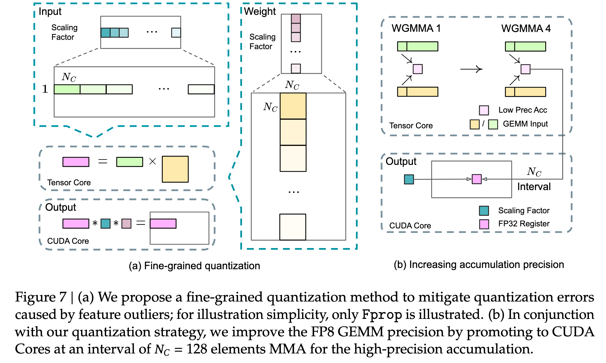
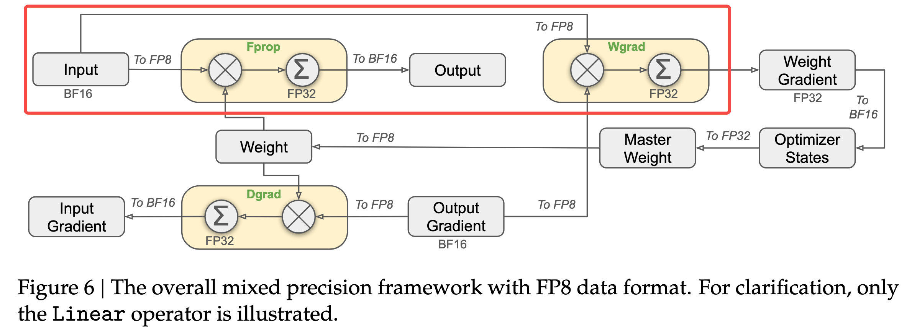
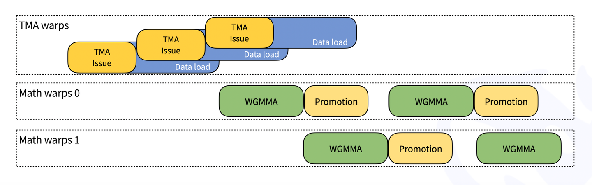

<!--Copyright © ZOMI 适用于[License](https://github.com/Infrasys-AI/AIInfra)版权许可-->

# 03.从混合精度训练到 DeepGEMM

!!!!!!
整体建议 FP8 原理拆出来，DeepGEMM 单独拆出来，DeepGEMM 太多内容了。加油，很不错，非常深度的文章，改改更完美

Author by: 管弘毅

!!!!!!!
到这里前面的文章已经介绍过很多基础概念了，所以不需要用括号备注，自己重点看看哦，不要直接用大模型生成。后面的一样，可以改改

在人工智能领域，模型规模的持续扩张与计算资源的有限性之间形成了日益尖锐的矛盾。训练和部署拥有数千亿甚至万亿参数的 LLM 需要巨大的算力投入，这不仅带来了高昂的经济成本，也对能源消耗和硬件基础设施构成了严峻挑战。在这一背景下，领先的人工智能实验室正将研究重心从单纯追求模型规模转向探索更高效的算法和系统设计。

DeepSeek 公司是这一趋势的杰出代表。其核心理念在于，通过“更智能的算法”而非依赖于庞大的 GPU 集群来实现顶尖性能。这一理念在其模型 DeepSeek-V3 的训练过程中得到了充分体现。作为一个拥有 6710 亿总参数的 MoE 模型，其完整的训练过程仅消耗了 278.8 万 H800 GPU 小时，这一数字对于同等规模的模型而言是极其高效的。这种效率的背后，是一系列精心设计的架构创新和硬件感知的算法优化，旨在从根本上重塑 AI 的经济学。

性能优化的核心不仅仅是追求 FLOPs，而是转向一个更加多维的视角，涵盖了数据在内存和计算单元之间的移动效率、内存占用，以及**算法与底层硬件架构的协同设计**。正是在这种对极致效率的追求下，以 FP8 为代表的低精度计算技术，从一个前沿的学术探索，演变为构建下一代高性能 AI 系统的关键基石。

## 混合精度训练

### 低精度深度学习的范式演进

!!!!!!!!!!
最好展开到三级目录就可以了，不用展开到 4 级

#### 保守的混合精度

在深入探讨 FP8 之前，有必要理解为其铺平道路的混合精度训练（Mixed-Precision Training）技术。默认情况下，大多数深度学习框架使用 FP32 进行所有计算。FP32 提供了宽广的动态范围和高精度，确保了训练过程的数值稳定性。然而，研究发现，模型中的许多计算，特别是矩阵乘法和卷积等计算密集型操作，并不需要如此高的精度。

混合精度训练的核心思想是在同一个训练流程中战略性地结合使用多种数值精度格式。具体而言，它将大部分计算和数据存储（如模型权重、激活值和梯度）转换为 FP16/BF16，同时保留网络中对精度敏感的关键部分（如损失计算、优化器状态和主权重副本）为 FP32 格式 。

这种策略带来了显著的优势：

- **提升计算速度**：现代 NVIDIA GPU（自 Volta 架构起）配备了 Tensor Core，其专门用于加速低精度矩阵运算的硬件单元。使用 FP16 或 BF16 可以充分利用 Tensor Cores，实现数倍于 FP32 的理论吞吐量。   

- **减少内存占用**：将数据精度从 32 位减半至 16 位，可以直接将模型的参数、梯度和激活值所占用的内存减少近一半。这使得在单个 GPU 上能够训练更大规模的模型，或使用更大的批量大小（batch size）以提升硬件利用率。   

然而，转向低精度也带来了挑战，最主要的是数值下溢（underflow）问题。FP16 的动态范围远小于 FP32，在反向传播过程中，一些数值极小的梯度可能会被截断为零，导致模型参数无法得到有效更新。为了解决这个问题，混合精度训练引入了两个关键技术：

- **损失缩放（Loss Scaling）**：在反向传播开始前，将损失值乘以一个较大的缩放因子，从而按比例放大所有梯度值，使其进入 FP16 的可表示范围内。在优化器更新权重之前，再将梯度除以相同的缩放因子，恢复其原始大小。   

- **FP32 主权重（Master Weights）**：在优化器内部维护一份 FP32 精度的权重副本。每次参数更新都作用于这份高精度的副本上，然后再将更新后的权重转换为 FP16 用于下一次前向传播。这可以避免因连续的、微小的 FP16 更新量累积而导致的精度损失。   

在 PyTorch 等主流框架中，这些复杂的操作被封装在 `torch.cuda.amp` 模块中，通过 `autocast` 上下文管理器和 `GradScaler` 类，开发者可以轻松地将混合精度训练集成到现有代码中。混合精度训练已成为训练大型模型的标准实践。   

!!!!!!!!!
传统混合精度，少了例图，例如 AMP 就是传统的混合精度，用图例去解释介绍更清楚

#### FP8 的前景与挑战

随着 FP16 和 BF16 的成功应用，大家又将进一步提升的希望寄托在了更少位宽的 FP8 上。Nvidia 在其 Hopper 和 Blackwell 架构上加入了对于 FP8 的硬件支持，使其在理论上可以获得更好的计算吞吐量。

但是从 16 位转向 8 位并没有那么简单，因为即使是将数据从 FP32 转换为 FP16 和 BF16，其动态范围也足以应付大部分的数据计算，一个单一、全局的缩放因子通常足以应对整个网络的数值下溢问题。而 FP8 的动态范围过小，以至于网络中不同层、不同张量的数值分布差异巨大，一个统一的缩放因子变得不可行。这就意味着，如果我们希望使用 FP8，就需要为每个 FP8 的张量计算一个独立的局部缩放因子，这是一种**从全局到局部的数值管理范式转变**。

这正是像 NVIDIA Transformer Engine 和 DeepSeek DeepGEMM 这样的专业库诞生的根本原因。它们的目标，就是在享受 FP8 极致效率的同时，驯服其内在的数值不稳定性，从而在性能和精度之间找到新的平衡点。

!!!!!!!!
加图例，现在 FP8 已经有很多了，可以做个调研。

### 缩放策略

一个简单的将高精度张量转化为 FP8 的操作如下：

1. **计算 `amax`**：对于给定的高精度张量，首先计算其所有元素的绝对值的最大值，即 `amax`。这个值代表了该张量的数值范围。   

2. **确定缩放因子**：根据 `amax` 和目标 FP8 格式的最大可表示值，计算出一个缩放因子。例如，一个简单的缩放因子可以是 `scale = amax / FP8_MAX_VALUE`。

3. **量化（Quantization）**：将原始高精度张量中的每个元素除以该缩放因子，然后将结果转换为 FP8 格式。

4. **反量化（Dequantization）**：在完成计算后需要将 FP8 张量转换回高精度格式。这时，只需将 FP8 张量中的每个元素乘以之前使用的缩放因子即可。

#### 即时缩放（Just-in-Time Scaling）
这种策略在操作执行时动态计算缩放因子。例如，一个算子首先以高精度格式计算并写出其输出，然后扫描整个输出张量以找到 `amax`，计算缩放因子，最后再将高精度输出缩放并转换为 FP8 格式。这种方法虽然精确，但需要对数据进行多次传递，带来了巨大的性能开销，严重削弱了使用 FP8 带来的速度优势，因此在实践中几乎是不可行的。   

#### 延迟缩放（Delayed Scaling）
这是目前最实用和最主流的策略。它避免了即时缩放的性能瓶颈，其核心思想是：当前迭代步骤中某个张量的 `amax` 值，可以由其在过去几次迭代中的 `amax` 值来近似。具体做法是，为每个需要转换为 FP8 的张量维护一个 `amax` 历史记录缓冲区。在当前迭代中，系统会根据这个历史记录（例如，取历史中的最大值）来计算缩放因子。同时，在本次计算完成后，会得到当前张量的真实 `amax`，并用它来更新历史记录缓冲区，以供下一次迭代使用。这种方法使得 FP8 计算可以全速进行，代价是需要额外存储 `amax` 历史记录 。   

#### 细粒度缩放（Fine-Grained Scaling）

尽管延迟缩放解决了性能问题，但无论是即时缩放还是延迟缩放，如果以整个张量（per-tensor）为单位进行缩放，都会面临**异常值（outlier）**敏感性问题。在深度学习模型中，权重或激活矩阵中可能存在少数数值极大的异常值。如果基于包含这些异常值的全局 `amax` 来计算缩放因子，这个因子会变得非常大，导致矩阵中绝大多数正常数值在缩放后变得极其接近于零，从而在量化到 FP8 时丢失所有精度信息。   

为了解决这一致命问题，DeepSeek 团队提出了一种更先进的细粒度缩放策略。其核心思想是将一个大矩阵划分为多个小块（blocks），并为每个小块计算独立的缩放因子。具体实现为：   

- **块级缩放（Blockwise Scaling）**：对于权重矩阵，将其划分为多个 128x128 大小的子矩阵，并为每个子矩阵独立计算和应用缩放因子。   

- **片级缩放（Tilewise/Groupwise Scaling）**：对于激活矩阵，以 1x128 大小的子向量为单位进行独立的缩放和量化。   

在实际应用中，细粒度缩放是与**延迟缩放**相结合的。也就是说，它为每个小块（block/tile）维护一个 `amax` 历史记录，并使用上一轮的 `amax` 来确定当前轮的缩放因子。此外，计算的异常值的影响被局限在它所在的那一个小块内。其他不包含异常值的小块可以使用更合适的、更小的缩放因子，从而完美地保留了这些区域的数值精度。这对于模型的整体性能至关重要。

## DeepGEMM

本部分内容介绍了 DeepSeek 开发的 DeepGEMM 矩阵乘法库，相对于 Cutlass 这种官方提供的通用实现而言，DeepGEMM 更多是为 FP8 MoE 模型这一前沿且关键的应用场景，提供了一个比通用库更高效、更易用的专业解决方案。

| 特性 | DeepGEMM | CUTLASS (CUDA Template Library) |
|------|----------|---------------------------------|
| 设计哲学 | 专为 FP8 和 MoE 场景优化的轻量级、高性能解决方案 | 通用、可组合、可扩展的 GEMM 构建模块库，覆盖广泛的 GEMM 实现空间 |
| 编译方式 | 运行时即时编译（JIT），无需预编译 | 编译时模板元编程，生成高度特化的核函数 |
| FP8 支持 | 核心特性，支持先进的细粒度缩放和双层累加 | 支持 FP8，但需要用户通过模板参数自行构建和配置复杂的实现 |
| MoE 专用优化 | 提供为 MoE 预充填和解码阶段定制的 `contiguous` 和 `masked` Grouped GEMM | 提供通用的 Grouped GEMM，但未针对 MoE 的特定工作流进行深度优化 |
| 易用性 | API 简洁明了，专注于特定用例，易于上手 | 学习曲线陡峭，需要深入理解 CUDA 和模板编程才能有效使用 |
| 目标硬件 | 专为 NVIDIA Hopper (SM90) 和 Blackwell (SM100) 架构优化 | 支持从 Pascal 到 Blackwell 的多代 NVIDIA GPU 架构 |
| 依赖与体量 | 依赖极少，核心代码库非常小巧 | 庞大的头文件库，依赖于复杂的 C++ 模板元编程技术 |

### 分组 GEMM

由于 MoE 中每个专家都有自己的权重矩阵，我们不能像普通模型那样用一个大的矩阵乘法一次性处理所有 tokens，而是需要为每个专家分别执行一次矩阵乘法，这就产生了对分组 GEMM (Grouped GEMM) 的需求。在此基础上，由于模型在预填充（Prefill）和解码（Decode）两个阶段的计算特征不同，为了对它们分别进行高效计算，DeepGEMM 提供了两种不同的分组 GEMM 内核：连续布局 (Contiguous Layout) 和掩码布局 (Masked Layout)。

```C
// deep_gemm/include/deep_gemm/scheduler.cuh
enum class GemmType {
    Normal,
    GroupedContiguous,
    GroupedMasked
};
```

#### 常规稠密 GEMM (Normal GEMM)

这是最基础、最常见的矩阵乘法形式，即计算 `C = A * B`。

- 一次性计算两个完整的、稠密的矩阵。
    
- 在处理一个普通的 FFN 层时，所有 tokens 会被送入同一个 FFN。这时，可以将这些 tokens 的数据堆叠成一个矩阵 A，然后与 FFN 层的权重矩阵 B 进行一次大规模的常规稠密 GEMM。
    
- **适用场景**：适用于非 MoE 模型的计算，或者 MoE 模型中非专家部分的计算。DeepGEMM 库也为此类通用计算提供了高效的内核。

#### 分组 GEMM (连续布局 - Contiguous Layout)

这种 GEMM 专门为处理多个独立的、但可以被组织在一起的小型计算任务而设计。

- 将多个小矩阵乘法的输入数据（A 矩阵）在内存中**拼接成一个大的、连续的张量**，然后调用一个特殊内核来一次性处理这些“分组”的计算。
    
- **Prefill 阶段**：
    
    1. **数据准备**：当模型处理用户输入的完整长文本（即 **预填充 Prefill 阶段**）时，我们可以收集所有被路由到同一专家的 tokens。例如，将 Tokens 1, 5, 8 的数据在内存中紧密地排列在一起，形成一个 `3 x hidden_dim` 的小矩阵；将 Tokens 2, 9 的数据排列成 `2 x hidden_dim` 的矩阵。
        
    2. **拼接**：然后，我们将这些为不同专家准备的小矩阵**拼接 (Concatenate)** 成一个更大的、连续的矩阵 `A`。这个大矩阵 `A` 的前 3 行是给专家 A 的，接下来 2 行是给专家 B 的，以此类推。
        
    3. **计算**：`Grouped GEMMs (contiguous layout)` 内核接收这个拼接后的大矩阵 `A` 和所有专家的权重矩阵，然后高效地完成所有分组的矩阵乘法。
        
- **适用场景**：这种方式非常适合**预填充 (Prefill) 阶段**。因为预填充阶段的计算量大，输入序列长，将计算任务打包成连续的形式可以最大化计算吞吐量。它能很好地处理动态变化的输入形状，因为每次请求中被路由到每个专家的 token 数量都可能不同。

#### 分组 GEMM (掩码布局 - Masked Layout)

这是一种更为灵活的分组 GEMM，它不要求输入数据是连续的，而是通过一个“掩码”来指定哪些数据是有效的。

- 在一个预先分配好的、形状固定的内存区域中进行计算，并使用一个额外的**掩码张量 (Mask Tensor)** 来告诉计算单元只处理那些被标记为“有效”的数据。
    
- **Decode 阶段**：
    
    1. **数据准备**：当模型逐个生成 token（即 **解码 Decode 阶段**）时，延迟是关键。在这一阶段，每个请求每次只处理一个 token。假设我们预先为每个专家分配了一个能容纳 4 个 tokens 的固定大小的内存槽位。
        
    2. **填充与掩码**：在某一个解码步骤中，Token X 被路由到专家 A，Token Y 被路由到专家 B。我们会将 Token X 的数据放入专家 A 的第一个槽位，将 Token Y 的数据放入专家 B 的第一个槽位。其他槽位都是空的。
        
    3. **计算**：我们会创建一个掩码张量，标记出专家 A 的第一个槽位和专家 B 的第一个槽位是有效的。`Grouped GEMMs (masked layout)` 内核会读取这个预分配的大张量和掩码，**跳过所有无效槽位**，只对有效数据执行矩阵乘法。
        
- **适用场景**：这种方式非常适合对延迟要求极高的**解码 (Decode) 阶段**。因为它使用了固定的内存布局，所以可以与 **CUDA Graph** 完美兼容。CUDA Graph 能显著减少内核启动的开销，这对于解码阶段这种需要反复执行大量小计算的场景至关重要。

#### GEMM 种类对比

| 特性               | 常规稠密 GEMM                     | 分组 GEMM (连续布局)                               | 分组 GEMM (掩码布局)                                 |
| ------------------ | --------------------------------- | -------------------------------------------------- | ---------------------------------------------------- |
| **核心思想**           | 计算单个大矩阵乘法               | 将多个小任务的输入拼接成一个连续的大张量进行批处理 | 在固定大小的内存上，使用掩码来计算有效部分           |
| **主要应用阶段**       | 通用计算、非 MoE 层               | 预填充 (Prefill) 阶段                              | 解码 (Decode) 阶段                                   |
| **输入数据布局**       | 单一、稠密的矩阵                 | 动态大小、在内存中连续排列的多个数据块             | 固定大小的内存块，通过掩码指定有效数据               |
| **关键优势**           | 简单直接                         | 计算吞吐量高，适合处理长序列和动态形状             | 延迟极低，与 CUDA Graph 兼容以减少启动开销           |
| **与 DeepEP 的配合**     | 不适用                           | 与 "Normal Dispatch" 模式配合                      | 与 "Low-Latency Dispatch" 模式配合                   |

### Warp Specialization 与异步流水线

DeepGEMM 获取高性能的关键在于其充分利用了 NVIDIA Hopper 架构的新特性，其核心思想是 Warp Specialization (WS，线程束专门化) 和异步计算访存流水线。

#### Warp Specialization

Warp Specialization 指的是在一个 CUDA Block 中，将线程（Warps）划分为两组，分别承担流水线的不同阶段：

1. **生产者线程**：通常是 128 个线程 (4 个 Warp)，负责加载数据，使用 Hopper 架构的 **TMA (Tensor Memory Accelerator)** 硬件单元以异步的方式将矩阵 A 和 B 从 GMEM 直接搬运到 SMEM 中。

2. **消费者线程**：通常是 128 或 256 个线程，负责执行计算，等待生产者准备好数据后调用 `wgmma` 指令执行矩阵计算。

通过这种方式，计算与数据访存可以实现重叠执行：当消费者线程束在计算当前数据分块时，生产者线程束已经在为下一个分块准备数据了。这被称为**软件流水线 (Software Pipelining)**，能够最大化利用 GPU 的计算单元，避免其因等待数据而空闲。

#### 异步流水线

流水线的设计如下：

1. **生产者启动数据加载**：在流水线的每个阶段开始时，生产者线程向 **TMA** 硬件单元发出指令，将数据从全局显存异步复制到共享内存。由于操作是异步的，生产者线程提交任务后无需等待即可继续执行。

2. **消费者执行计算**：消费者线程等待数据完全加载到共享内存的信号。数据就绪后，它们会立即使用 **wgmma (Warpgroup Matrix-Multiply-Accumulate)** PTX 指令，在 **Tensor Core** 上执行核心的矩阵乘法运算。

3. **流水线重叠执行**：当消费者线程正在处理阶段 `s` 的数据时，生产者线程已经开始获取下一阶段 `s+1` 的数据。这种计算与数据获取的并行重叠，可以有效隐藏内存访问延迟，确保 GPU 计算单元持续处于工作状态。流水线的深度由代码中的 `kNumStages` 模板参数定义。

#### 细粒度资源管理

Hopper 架构不仅引入了以 TMA 为代表的异步操作单元，还添加了以 `setmaxnreg.aligned` 为代表的细粒度资源分配指令，DeepGEMM 充分利用了这一点实现了更高的性能。

生产者线程束只需要发送指令，让 TMA 将数据搬运到 SMEM，此过程并不需要经过寄存器作为中转，所以整体需要的寄存器数量很少，而消费者线程束需要消耗大量寄存器用于计算。为了让一个 SM 可以容纳更多的线程以提升占用率，DeepGEMM 使用 `setmaxnreg.aligned` 指令进行了寄存器的细粒度管理：

```C
// deep_gemm/include/deep_gemm/fp8_gemm.cuh
constexpr int kNumTMARegisters = 40;
constexpr int kNumMathRegisters = 232;

if (threadIdx.x >= kNumMathThreads) {
  // TMA warp-group for loading data
  cutlass::arch::warpgroup_reg_dealloc<kNumTMARegisters>();
  ...
} else {
  // Math warp-groups for WGMMA
  cutlass::arch::warpgroup_reg_alloc<kNumMathRegisters>();
 ...
}
```

- **Notes**:
  - 使用变量 `kNumMathThreads` 将线程块内的所有线程分为两组
  - `warpgroup_reg_dealloc` 这个函数的实际作用是向 NVCC 编译器提供一个提示（Hint）。它告诉编译器：“对于这个 `if` 代码块内的代码，编译时确保每个线程使用的寄存器数量不超过 `kNumTMARegisters` 个”；编译器会因此生成更“节俭”的机器码，避免不必要的寄存器使用。这有助于提高 SM 上的 Occupancy（占用率），即允许更多的线程块同时驻留在同一个 SM 上，从而更好地隐藏指令延迟。
  - 相应地，`warpgroup_reg_alloc` 告诉编译器：“对于这个 `else` 代码块内的代码，可以使用最多 `kNumMathRegisters` 个寄存器”。这给了编译器极大的自由度去进行优化，比如：
    - **循环展开（Loop Unrolling）**: 将循环体内的指令复制多份，减少循环判断开销。
    - **指令调度**: 重排指令以隐藏延迟。
    - **缓存中间值**: 将频繁使用的数据保存在寄存器中，避免重复访问共享内存。

结合前文提到的 Warp Specialization，我们可以更直观地理解这种资源分配的意义：

- 由于生产者和消费者分别使用了 `WS` + `TMA` / `wgmma`，他们的线程数量都需要是 128 的倍数
- 单个 SM 内包含 65536 个寄存器。当生产者使用 128 个线程，消费者使用 256 个线程时，一共需要使用 $256 \times 232 + 128 \times 40 = 64512$ 个寄存器；此外，系统为每个线程块进行 **Bookkeeping** 和**元数据**管理需要保留 1000 个寄存器，相加之后几乎用满了所有硬件。而如果没有使用 `setmaxnreg.aligned`，则最多可以使用 128 个消费者线程，限制了计算性能。

### FP8 混合精度计算

DeepGEMM 使用 FP8 作为其数据的主要精度，Hopper 架构的硬件支持能让其在保持一定计算精度的同时大幅提升计算效率。但是单纯地大量使用 FP8 会导致在累加时出现随机误差，且正如 DeepSeek 在 [ISCA‘25 上的论文](https://arxiv.org/abs/2505.09343v1)所说，Nvidia 的 Tensor Core 中只保留了约 14 位的累加位宽，以 K=4096 的两个随机矩阵的 GEMM 运算为例，Tensor Core 中的有限累加精度可导致最大相对误差接近 2%。

为了减小累加误差导致的训练偏差，DeepGEMM 进行了以下优化：

- **细粒度量化**：将激活值以 `1x128` 作为一个 Group / 权重以 `128x128` 作为一个 Group 进行分块并缩放，每个分块对应一个 **Scaling Factor (FP32)** 作为缩放因子。
- **两级累加**：对于计算中切分出的每个 Tile，首先在 Tensor Core 中使用 `wgmma` 指令对 FP8 格式的数据（激活 & 权重）进行乘累加，并将中间结果提升到 FP32 保存；然后在 CUDA Core 中，使用对应的 `Scaling Factor` 对该 Tile 的计算结果进行反量化（缩放恢复），并将其累加到最终的 FP32 累加器上。这一过程的数据流如下图所示：



- **结果转换**：在单个矩阵计算完成后，会将 FP32 的累加结果转换回 BF16 并输出。其数据流如下：



- **效率优化**：这种设计虽然提升了精度，但也引入了 Tensor Core 和 CUDA Core 的顺序依赖关系。为了避免硬件空闲，DeepGEMM 设计了两个消费者线程束（Warp Group）进行“乒乓操作”：当 Warp Group 0 在使用 CUDA Core 进行 FP32 累加时，Warp Group 1 已经在 Tensor Core 上计算下一个 Tile。**这解释了为何 DeepGEMM 需要通过细粒度的资源管理，在一个 SM 内调度 256 个消费者线程（即 2 个 128 线程的 Warp Group），从而实现硬件资源的极致利用。**此部分对应的时序图及简化的源码框架如下：



!!!!!!!!
代码有点突兀，应该原理跟伪代码进行穿插

```C++
// deep_gemm/include/deep_gemm/fp8_gemm.cuh

// Persistently schedule over blocks
while (scheduler.get_next_block(m_block_idx, n_block_idx)) {
    // Decide the number of scales B to load
    ...
    // Load B scales with math warp-groups
    // NOTES: except the first warp, we want to overlap loading B scales with TMA stores between tasks
    ...
    // Accumulation for WGMMA or CUDA promotion
    float accum[WGMMA::kNumAccum], final_accum[WGMMA::kNumAccum] = {0};
    // Empty barrier arrival
    ...
    // Launch MMAs
    launch_k_iterations([&](int k_iter, auto type) {
        ...
        for (int s = 0; s < kNumInnerStages; ++ s) {
            // Read B scales
            float scale_b_0 = ld_shared(smem_scales_b + k_iter * kNumStages + s), scale_b_1;
            ...
            // Wait TMA arrivals
            full_barriers[s]->wait((scheduler.current_iter * kNumIterations + k_iter) & 1);
            // Read A scales
            // NOTES: all shared memory read must be prior to `warpgroup_arrive` to avoid next scheduled block polluting the results
            auto scale_a_0 = ld_shared(smem_scales_a[s] + r_0), scale_a_1 = ld_shared(smem_scales_a[s] + r_1);
            // Commit WGMMA instructions
            ...
            warpgroup_arrive();
            for (int k = 0; k < BLOCK_K / WGMMA::K; ++ k) {
                auto desc_a = make_smem_desc(smem_a[s] + math_wg_idx * WGMMA::M * BLOCK_K + k * WGMMA::K, 1);
                auto desc_b = make_smem_desc(smem_b[s] + k * WGMMA::K, 1);
                WGMMA::wgmma(desc_a, desc_b, accum, k);
            }
            warpgroup_commit_batch();
            ...
            warpgroup_wait<0>();
            // Notify barrier arrival
            empty_barrier_arrive(s);
            // Promote with scales
            float scale_0_0 = scale_a_0 * scale_b_0, scale_1_0 = scale_a_1 * scale_b_0;
            float scale_0_1, scale_1_1;
            ...
            for (int i = 0; i < WGMMA::kNumAccum / 4; ++ i) {
                bool predicate = kMustUseUniformedScaleB or i < num_former_iters;
                final_accum[i * 4 + 0] += (predicate ? scale_0_0 : scale_0_1) * accum[i * 4 + 0];
                ...
            }
        }
        ...
    });

    // Write back to shared memory using STSM
    ...
    cute::tma_store_fence();
    cutlass::arch::NamedBarrier(kNumMathThreads).sync();

    // Use TMA store to write back to global memory
    if (threadIdx.x == 0) {
        cute::SM90_TMA_STORE_2D::copy(&tensor_map_d, smem_d, n_block_idx * BLOCK_N,
                                      scheduler.get_global_idx(shape_m, BLOCK_M, m_block_idx));
        cute::tma_store_arrive();
        cute::tma_store_wait<0>();
    }
    __syncwarp();
}

```

## 总结与思考

DeepGEMM 虽然不是一个通用库，但它是学习 Hopper 及后续架构上 GEMM 开发的绝佳材料。其代码中为了极致优化效率，考虑了大量硬件细节。由于本文旨在为读者提供一个清晰的框架，未涉及完整的源码解读，推荐有兴趣的读者继续阅读参考资料和仓库源码，这对深入理解 GPU 优化有极大帮助。

## 参考资料

- [DeepGEMM](https://github.com/deepseek-ai/DeepGEMM)
- [DeepSeek-R1 and FP8 Mixed-Precision Training](https://research.colfax-intl.com/deepseek-r1-and-fp8-mixed-precision-training/)
- [CUTLASS Tutorial: Fast Matrix-Multiplication with WGMMA on NVIDIA® Hopper™ GPUs](https://research.colfax-intl.com/cutlass-tutorial-wgmma-hopper/)
- [COLFAX Tutorials](https://research.colfax-intl.com/category/papers/tutorials/)
- [Deploying DeepSeek with PD Disaggregation and Large-Scale Expert Parallelism on 96 H100 GPUs](https://lmsys.org/blog/2025-05-05-large-scale-ep/)
- [VLOG I'm Learning Fastest Matrix Multiplication Algorithm On H100 (DeepGEMM By DeepSeek)](https://www.youtube.com/watch?v=SZy1psY0fSM)
- [浅读 DeepGEMM](https://wu-kan.cn/2025/03/03/%E6%B5%85%E8%AF%BB-DeepGEMM/)
- [Understanding FP8 and Mixed Precision Training](https://medium.com/@noelakkidas/understanding-fp8-and-mixed-precision-training-0a76c7f2c3ac)
- [Deep Gemm 代码浅析](https://zhuanlan.zhihu.com/p/26916462532)
- [DeepSeek GEMM 初探](https://zhuanlan.zhihu.com/p/26836916421)
