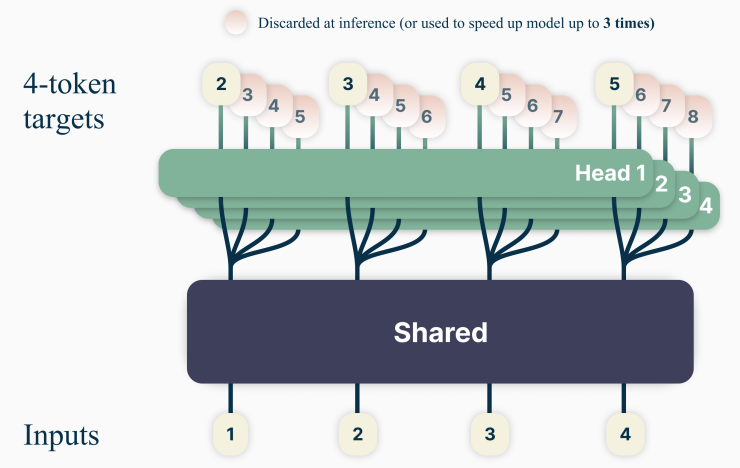
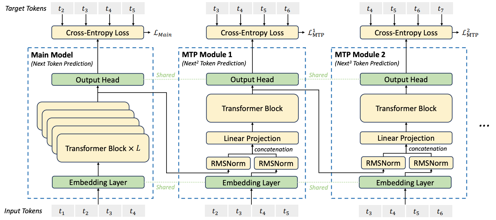
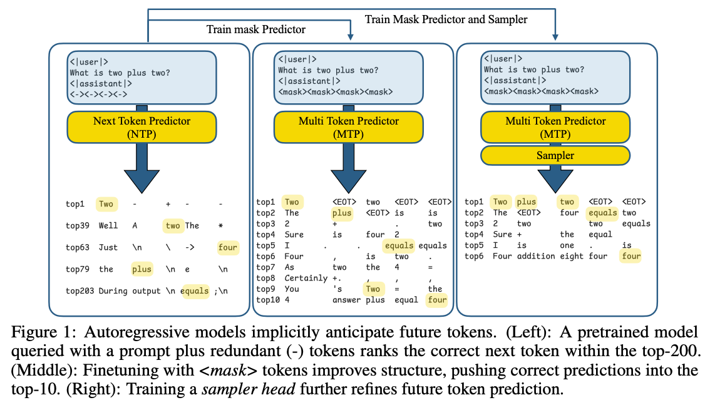
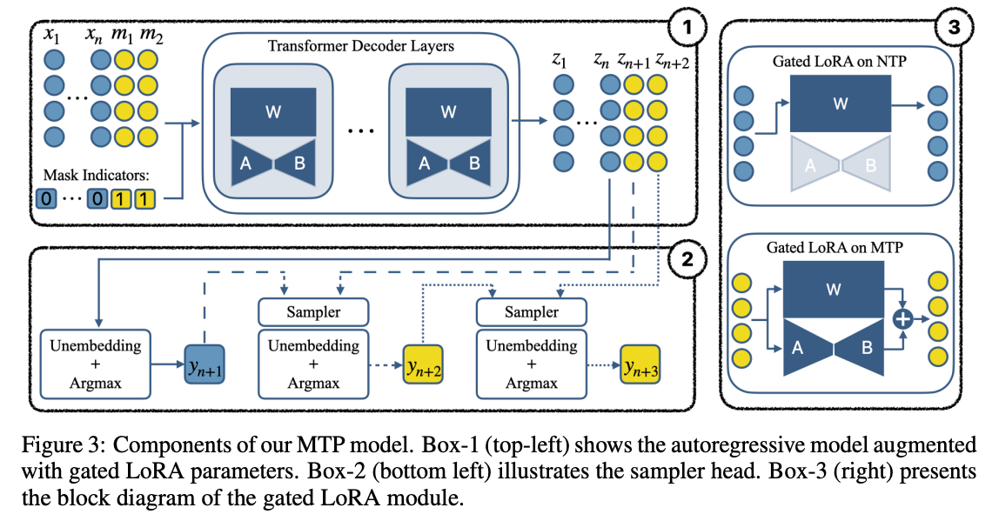
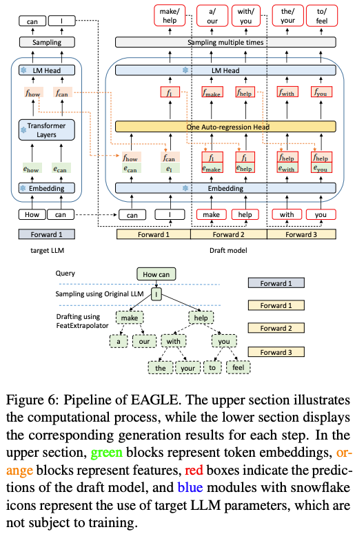
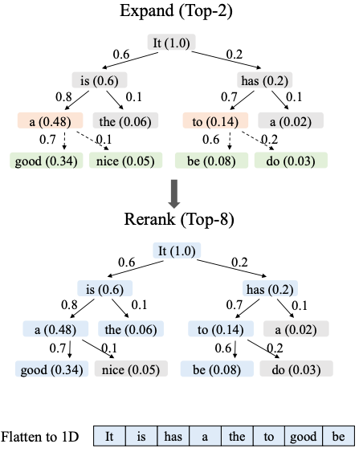
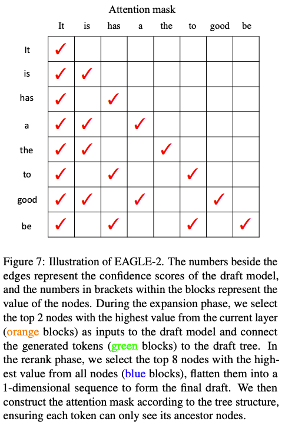
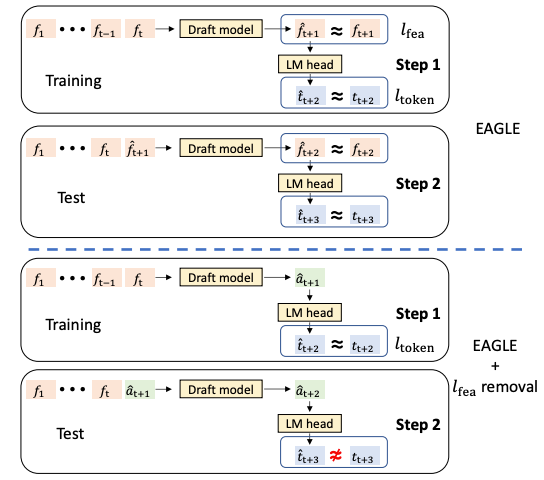
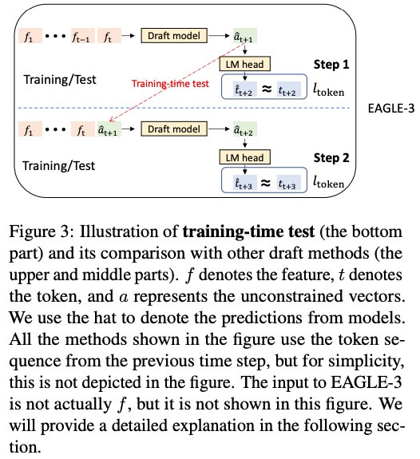
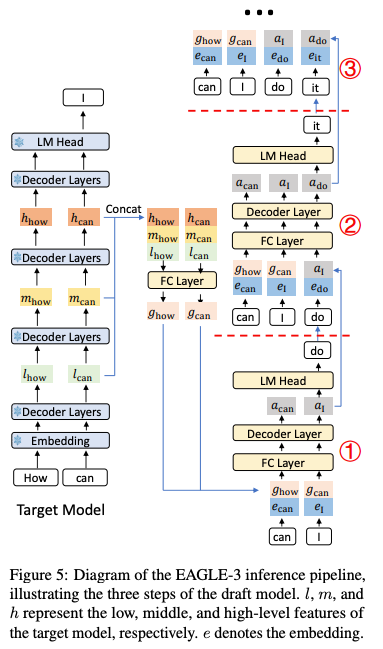

<!--Copyright © ZOMI 适用于[License](https://github.com/Infrasys-AI/AIInfra)版权许可-->

# 04.计算优化：Multi-Token 生成(DONE)

> Author by: 管弘毅

LLM 的标准范式是基于自回归的逐 Token 生成方式。这一过程的内在顺序性使其推理速度缓慢且计算成本高昂，尤其是在模型规模持续扩大、推理任务需要更长生成序列的背景下，这一问题愈发突出。推理延迟主要由内存带宽限制造成：每生成一个 Token，都需要将当前上下文序列输入模型，模型需加载并计算全部参数。这种低效率严重阻碍了实时应用部署，并显著增加了运营成本。

为突破这一瓶颈，学术界和工业界的研究重心转向超越单 Token 预测的范式，形成两条主要技术路线：

- 第一条路线聚焦**训练阶段**：通过引入 Multi-Token Prediction（MTP）增强模型对更长序列的推理与预测能力，从模型本质上提升多 Token 生成潜力；

- 第二条路线聚焦**推理阶段**：通过推测式解码（Speculative Decoding）等技术，在单次前向传播中生成多个 Token，同时保持与原始模型一致的输出质量，纯优化推理流程。

本文将系统性介绍这两类技术路线的核心原理、架构设计与最新进展，帮助读者理解多 Token 生成技术如何有效提升大模型的训练效率与推理速度。

## 1. MTP 架构与方法

在这一部分，我们将深入探讨多 Token 预测（MTP）技术——它通过修改模型训练目标增强预测能力，在训练阶段就为模型赋予生成多 Token 的基础能力。

MTP 技术主要分为三种实现方式：核心并行 MTP 架构（Native MTP）、序列式 MTP 以及掩码输入式 MTP，每种方法均有独特优势与适用场景。

### 1.1 Native MTP

MTP 的核心架构在《Better & Faster Large Language Models via Multi-token Prediction》（[arXiv:2404.19737](https://arxiv.org/abs/2404.19737)）一文中被提出，其核心思想是让模型在训练时一次性预测未来多个 Token，通过“共享主干网络+并行输出头”实现多 Token 并行预测。下图展示了该架构的核心设计：

> 图中 Shared 部分代表 Embedding 层与多层 Transformer 主干网络，Head 部分代表用于 Token 预测的单层 Transformer 输出头。

其训练与推理逻辑如下：

- **训练阶段**：架构由“共享 Transformer 主干”和“多个独立并行输出头（prediction heads）”组成。共享主干为标准 Transformer 结构，每个输出头被专门训练以预测未来一个特定 Token（例如 Head 1 预测 `t+1` 时刻 Token，Head 2 预测 `t+2` 时刻 Token，以此类推）；训练目标为所有输出头预测结果的交叉熵损失之和，确保多 Token 预测的整体准确性。

- **推理阶段**：完成多层 Transformer 主干计算后，直接调用多个输出头并行预测后续多个 Token，最大化推理并行度。

并行 MTP 架构是“速度优先”的直接实现，能最大化训练信号密度与并行计算效率，但固有缺陷在于“独立预测机制”——连续预测的 Token 之间无信息交互，可能导致生成文本缺乏连贯性。

### 1.2 序列式 MTP

并行 MTP 架构的核心局限是“ Token 间无依赖”：对 `t+2` 时刻 Token 的预测未以 `t+1` 时刻的预测结果为条件，导致生成序列易出现连贯性问题。

DeepSeek-V3 模型在《DeepSeek-V3 Technical Report》（[arXiv:2412.19437](https://arxiv.org/abs/2412.19437)）中通过“序列式 MTP 架构”解决了这一问题，其核心是为多 Token 预测添加“因果依赖链”。模型结构如下图所示：

图中核心组件定义：

- Main Model：传统多层 Transformer，负责对当前输入序列进行基础推理，输出当前序列的预测 Token（如图中 `t5`）；
- MTP Module [x]：单层 Transformer 模块，专门用于串行预测后续 Token（如 MTP Module 1 基于 `t5` 预测 `t6`，MTP Module 2 基于 `t6` 预测 `t7`），所有 MTP 模块参数单独训练。

序列式 MTP 的核心改进的两点：

1. **重建因果依赖**：每个 MTP 模块的输入均依赖上一模块的输出，形成“链式连接”，确保 `t+n` 时刻 Token 预测以 `t+n-1` 时刻 Token 为条件，解决并行架构的连贯性问题；
2. **缓解训练误差累积**：训练过程中直接使用样本的 Ground Truth（真实 Token 序列）作为 MTP 模块的输入（而非模型预测结果），并与上一层输出合并计算，减少训练阶段的误差传递，提升模型训练稳定性。

推理阶段的调整：需将训练时的 Ground Truth 替换为 Main Model 的输出（如图中 `t5'`），`t5'` 经 Embedding 层编码后与中间结果合并，再输入 MTP 模块进行串行预测。

值得注意的是，这些 MTP 模块的核心作用是“增强训练效果”——推理阶段可根据需求丢弃或保留。其带来的额外收益包括：

- **稳定训练**：提供更密集的监督信号，缓解单 Token 损失函数下“学习信号稀疏”的问题（除 Main Model 损失外，每个 MTP 模块均贡献损失）；
- **提升泛化能力**：训练时模型需在隐藏状态中编码更全局的语义信息（才能准确预测多步未来 Token），间接增强模型对长序列的理解能力；
- **缓解曝光偏差（Exposure Bias）**：自回归训练仅依赖上一步真实标签，而推理时依赖模型自身输出，易导致误差累积；MTP 让模型“提前适应多步预测场景”，提升推理鲁棒性。

总结来说：序列式 MTP 是一种“训练增强技巧”，本质是为 Backbone 添加辅助预测任务，提升主模型的表征能力与收敛效率，推理阶段可完全脱离该模块独立运行。

### 1.3 掩码输入式 MTP

掩码输入式 MTP 提供了不同的实现思路：它不修改模型核心架构，而是将“多 Token 预测”重新定义为“掩码填充任务”，通过微调已有预训练模型实现多 Token 生成能力，无需从头训练新模型。

前文介绍的两种 MTP 方案（并行、序列式）均需增加额外输出头（Head）或模块（MTP Module），而 Apple 研究者在论文《Your LLM Knows the Future: Uncovering Its Multi-Token Prediction Potential》（[arXiv:2507.11851v1](https://arxiv.org/abs/2407.11851v1) 中提出新视角：利用自回归模型已有的“未来信息捕捉能力”，通过掩码（Mask）预测与轻量采样模块，将这种潜力转化为明确的多 Token 生成能力。

其核心逻辑可通过下图示例说明：

三阶段核心逻辑：

- **左图（潜力验证）**：在 Prompt 后插入占位符 `<->`，发现模型对这些占位符的预测中，“未来正确 Token”常出现在 Top-200 候选中——证明预训练模型已具备捕捉多步未来信息的潜力，只是未被显式激活；
- **中图（掩码微调）**：将 Prompt 后的占位符替换为 Mask Token，让模型直接预测这些 Mask 对应的未来 Token；通过微调让模型在 Mask 位置的预测准确性提升（正确答案可进入 Top-10 Logits），显式激活多 Token 预测能力；
- **右图（连贯性增强）**：为避免预测 Token 是“独立猜测”，引入轻量采样模块（Two-layer MLP），让每个预测 Token 依赖之前已生成的 Token，确保多 Token 序列的语言连贯性。

该方案的关键设计是 **Gated LoRA（门控低秩适应）**：无需对预训练模型进行全量微调，仅在“Mask 对应位置”启用 LoRA 参数计算，自回归推理时关闭 LoRA——既不影响原模型的单 Token 生成精度，又能高效赋予多 Token 预测能力，实现“模块化插拔”。

下图展示了 Gated LoRA 的模块设计：

图中核心信息：

- **左上角**：包含 Mask 与 Gated LoRA 的模型推理流程，仅在 Mask 区域触发 LoRA 计算；
- **左下角**：通过 Sampler 为连续预测的 Token 建立串行依赖，确保输出连贯性；
- **右图**：Gated LoRA 在“单 Token 预测（NTP）”与“多 Token 预测（MTP）”场景下的开关状态（NTP 时关闭，MTP 时开启）。

此外，作者引入 **潜在一致性损失（Latent Consistency Loss, LCM）** 提升预测可靠性：要求模型“一次性预测未来第 3 个 Token”的结果，与“逐步预测到第 3 个 Token”的结果尽可能一致，确保多 Token 预测与传统自回归预测的逻辑对齐，减少预测偏差。

## 2. Speculative Decoding 架构与方法

Speculative Decoding（推测式解码）是纯粹的“推理阶段优化技术”——与 MTP 不同，它不修改模型本身，而是通过“草稿-验证”（Draft-then-Verify）机制在推理时加速 Token 生成，核心是“用小模型的速度换大模型的效率”。本部分将解析推测式解码的核心原理、实现方式及 EAGLE 系列框架的演进过程。

### 2.1 Draft-then-Verify 范式

Draft-then-Verify（草稿-验证）是推测式解码的核心逻辑，通过引入“草稿模型”与“目标模型”的协同，解决“推理速度”与“生成质量”的平衡问题——用小模型快速生成“草稿序列”，用大模型批量验证“草稿有效性”，避免大模型逐 Token 生成的低效。

- 核心角色定义

1. **草稿模型（Draft Model）**：规模小、推理快的轻量模型（如 7B 模型），负责根据当前上下文生成“候选 Token 序列”（即“草稿”），核心目标是“快速产出高质量候选”；
2. **目标模型（Target Model）**：原始的大模型（如 70B/175B 模型），负责对草稿模型生成的整个序列进行“单次并行前向传播验证”，核心目标是“保证输出质量与原模型一致”。

- 验证与迭代流程

推测式解码通过严谨的概率接受准则，确保最终输出与“目标模型逐 Token 自回归生成”的结果在概率分布上完全一致（无损加速），具体流程如下：

1. **草稿生成**：草稿模型基于当前上下文进行自回归采样，连续生成 k 个 Token（形成草稿序列 `[t1, t2, ..., tk]`）；
2. **批量验证**：将“原始上下文 + 草稿序列”拼接为完整输入，送入目标模型执行一次前向传播，获取目标模型对每个草稿 Token 的概率分布；
3. **Token 筛选**：对比目标模型与草稿模型对每个草稿 Token 的概率：
   - 若目标模型对某个 Token 的概率 ≥ 草稿模型，该 Token 被接受；
   - 若出现“目标模型概率 < 草稿模型”（即草稿 Token 质量不达标），则拒绝该 Token 及其后续所有草稿 Token；
4. **循环迭代**：若所有草稿 Token 被接受，目标模型直接生成下一个 Token（延续上下文）；若存在被拒绝 Token，目标模型生成“第一个被拒绝位置的正确 Token”，随后重新进入“草稿生成-验证”循环。

### 2.2 EAGLE 框架演进

EAGLE 框架是推测式解码领域的代表性工作，其从 EAGLE-1 到 EAGLE-3 的迭代，核心围绕“提升草稿质量、优化验证效率、控制误差累积”三个方向展开，深刻反映了研究社区对该技术的理解深化。本节将按版本顺序，拆解各代 EAGLE 的技术定位、核心创新及改进方向，并通过对比总结其演进逻辑。

#### 2.2.1 EAGLE-1 特征层预测

EAGLE-1 是该系列的开创性工作，首次将推测式解码的“预测对象”从“Token 层面”升级到“特征层面”，突破了传统 Token 直接预测的局限——通过让草稿模型学习目标模型的隐藏特征，利用特征空间更丰富的语义信息提升草稿序列质量。

**相关论文**：《EAGLE: Speculative Sampling Requires Rethinking Feature Uncertainty》（[arXiv:2401.15077](https://arxiv.org/abs/2401.15077)）  

其创新点有 2 个：

1. **预测目标调整**：草稿模型不再直接预测下一个 Token，而是预测“目标模型倒数第二层的隐藏特征向量”；该特征向量会输入目标模型的最后一个 LM Head（语言模型头），最终生成草稿 Token，确保草稿与目标模型的语义逻辑对齐。
2. **静态草稿树 + 并行验证**：草稿生成阶段用“预先定义的静态草稿树”（固定深度与分支数）快速生成多候选路径；验证阶段借鉴并优化 Medusa 的树状注意力机制，将整个草稿树一次性提交给目标模型批量验证，最大化硬件并行能力，避免逐 Token 验证的效率瓶颈。

架构示意图如下：

#### 2.2.2 EAGLE-2 动态草稿树优化

EAGLE-2 针对 EAGLE-1“静态草稿树适应性差”的问题进行改进——引入“动态草稿树机制”，根据上下文的“可预测性”（由草稿模型置信度判断）灵活调整草稿生成策略，进一步提升草稿利用率与验证效率。

**相关论文**：《EAGLE-2: Faster Inference of Language Models with Dynamic Draft Trees》（[arXiv:2406.16858](https://arxiv.org/abs/2406.16858)）  

其核心改进如下：

1. **动态构建草稿树**：不再用固定结构，而是根据草稿模型对候选 Token 的置信度得分，选择当前层“置信度最高的 2 个节点”扩展树枝，生成多路径树状结构（可预测性高则分支更多，低则更少）。
2. **草稿筛选**：从整个草稿树中筛选“价值最高的 8 个节点”（综合置信度与路径连贯性），排列为单一序列作为最终草稿，减少无效验证成本。
3. **高效并行验证**：通过“特殊注意力掩码”确保每个 Token 仅关注其原始路径上的“祖先 Token”，避免跨路径信息干扰，实现所有路径的并行计算。

关键流程示意图：  

  

#### 2.2.3 EAGLE-3 技术融合

EAGLE-3 是该系列的最新进展，核心突破是“摒弃前代的特征预测约束”——研究发现 EAGLE-1/2 中“草稿模型必须预测目标模型特征”的限制会束缚其表达能力，因此转而采用“直接 Token 预测”与“多层特征融合”，同时通过“训练时测试”解决误差累积问题，实现更高加速比。

**相关论文**：《EAGLE-3: Scaling up Inference Acceleration of Large Language Models via Training-Time Test》（[arXiv:2503.01840](https://arxiv.org/abs/2503.01840)

在深入理解 EAGLE-3 的创新前，先回顾 EAGLE-1 与 EAGLE-2 存在的关键局限 —— 这两代框架虽推动了推测式解码的发展，但仍有三个核心问题待解决。

第一个局限是特征预测的约束，草稿模型被强制要求预测 “目标模型头部前的特定隐藏特征”，这种固定目标限制了模型的自主学习能力，无法灵活适配不同场景下的语义表达需求；第二个问题在于误差累积，当草稿模型的预测结果作为后续步骤的输入时，哪怕是微小的初始误差，也会在多步预测中快速放大，最终导致长序列的验证通过率大幅降低；第三个局限则是信息利用的单一性，两代框架都只依赖目标模型的顶层特征进行草稿生成，而低层、中层特征包含的局部细节信息被忽略，这使得草稿序列缺乏足够的上下文支撑，影响了整体质量。

针对这些局限，EAGLE-3 提出了两大核心突破来逐一破解。

1. **基于“训练时测试”的直接 Token 预测**：1）消除特征约束：草稿模型生成“无约束向量”，直接输入目标模型的 LM Head 生成 Token，释放表达能力；2）解决误差累积：训练过程中加入“草稿模型自身先前生成的输出作为后续输入”的场景（模拟推理时的真实依赖），迫使模型学习对自身误差的鲁棒性；  

下图左半部分（问题）：训练时仅用真实特征，模型未学习“处理自身预测误差”，推理时易出现 `t̂ ≠ t`；若简单移除特征约束（如 `EAGLE + lfea removal`），草稿质量会大幅下降；右半部分（解决方案）：训练时让模型“复用自身预测结果”（如将路径 1 生成的 `â` 再次输入 LM Head 预测 Token），完全模拟推理场景，提升鲁棒性。
  
  

2. **多层特征融合**：摒弃“仅用顶层特征”的限制，将目标模型“最后一次前向传播”产生的低、中、高层特征融合为综合向量，作为草稿模型输入；优势在于低层特征提供局部细节，高层特征提供全局语义，为草稿生成提供更全面的上下文信息，提升草稿质量与连贯性。  

#### 2.2.4 EAGLE 框架对比

EAGLE 系列的演进本质是“持续优化草稿质量、验证效率与误差控制”，下表从核心特性、性能等维度对三版本进行系统对比，清晰呈现其迭代方向：

| 特性 / 技术点          | EAGLE-1                  | EAGLE-2                          | EAGLE-3                              |
| ---------------------- | ------------------------ | -------------------------------- | ------------------------------------ |
| **核心预测目标**       | 目标模型第二高层特征     | 同 EAGLE-1                       | 直接预测 Token（无特征约束）         |
| **草稿树结构**         | 静态固定结构             | 动态结构（基于置信度调整）       | 灵活结构（结合训练时测试）           |
| **特征利用方式**       | 仅顶层特征               | 同 EAGLE-1                       | 低/中/高层特征融合                   |
| **输出质量一致性**     | Lossless（与原模型一致） | Lossless（与原模型一致）         | Lossless（与原模型一致）             |
| **推理加速比**         | ≈ 2.7×–3.5×              | ≈ 3.05×–4.26×（较 EAGLE-1 提升 20%–40%） | 最高 ≈ 6.5×（较 EAGLE-2 提升约 1.4×）|
| **高 Batch 吞吐提升**  | —                        | —                                | ≈ 1.38×                              |

## 3. 多 Token 策略综合对比

下表从“核心机制、应用阶段、优势局限”等维度，对 MTP 系列与推测式解码技术进行系统对比，帮助读者根据实际场景选择合适方案：

| 技术类型         | 核心机制                     | 应用阶段   | 关键创新                     | 优势                     | 局限性                     | 代表性示例                                                                 |
| ---------------- | ---------------------------- | ---------- | ---------------------------- | ------------------------ | -------------------------- | -------------------------------------------------------------------------- |
| **并行 MTP**     | 共享主干 + 多个并行输出头    | 训练时     | 训练目标引入多未来 Token 预测 | 训练信号密集，适配推测解码 | 独立预测导致输出不连贯     | 《Better & Faster Large Language Models via Multi-token Prediction》       |
| **序列式 MTP**   | 链式 MTP 模块，维持因果依赖  | 训练时     | 解决并行 MTP 的连贯性问题     | 生成质量高、逻辑连贯      | 牺牲部分并行计算效率       | DeepSeek-V3（《DeepSeek-V3 Technical Report》）                            |
| **掩码输入式 MTP** | 多 Token 预测转化为掩码填充  | 训练/微调时 | Gated LoRA 模块化微调        | 不损害原模型，微调高效    | 依赖轻量采样器保证连贯性   | Apple Research（《Your LLM Knows the Future...》）                        |
| **标准推测式解码** | 草稿模型生成 + 目标模型验证  | 推理时     | 无损加速，保证输出分布一致   | 不修改原模型，部署灵活    | 需匹配高质量草稿模型       | Google Research（推测式解码原始方案）                                      |
| **EAGLE-3**      | 直接 Token 预测 + 多层特征融合 | 训练+推理  | 训练时测试，突破特征约束     | 加速比极高，适配大 Batch  | 草稿模型训练流程较复杂     | EAGLE-3（《Scaling up Inference Acceleration...》）                        |

## 4. 总结与思考

多 Token 生成技术是大模型推理优化的核心方向，通过 MTP 与 Speculative Decoding 两条路线，有效突破了传统自回归生成的性能瓶颈：

- **MTP 路线**：聚焦训练阶段，通过并行头、链式模块或掩码任务增强模型的多步预测能力，核心价值是“提升模型本身的多 Token 生成潜力”，同时优化训练效率与泛化能力；
- **Speculative Decoding 路线**：聚焦推理阶段，通过“草稿-验证”机制用小模型换大模型效率，核心价值是“无损加速”——在不损失生成质量的前提下，大幅降低大模型推理延迟与成本。

## 5. 参考资料

- [探秘 Transformer 系列之（33）--- DeepSeek MTP](https://www.cnblogs.com/rossiXYZ/p/18880573)
- [DeepSeek 技术解读(2)-MTP（Multi-Token Prediction）的前世今生](https://zhuanlan.zhihu.com/p/180560411)
- [大模型推理妙招—投机采样（Speculative Decoding）](https://zhuanlan.zhihu.com/p/651359908)
- [[LLM 投机推理] 超越 Medusa 的投机采样—— EAGLE 1/2 论文解读](https://zhuanlan.zhihu.com/p/716344354)
- 《Better & Faster Large Language Models via Multi-token Prediction》（[arXiv:2404.19737](https://arxiv.org/abs/2404.19737)）
- 《EAGLE-3: Scaling up Inference Acceleration of Large Language Models via Training-Time Test》（[arXiv:2503.01840](https://arxiv.org/abs/2503.01840)）
