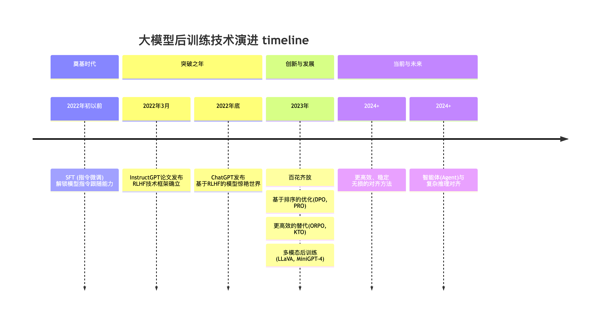

# 概述

后训练（Post-Training）已成为释放预训练大模型潜力、确保其安全可靠、并与人类意图对齐的关键环节。本文将系统性地介绍面向大语言模型（LLM）及多模态大模型的后训练技术体系。

“后训练”，也被称为“对齐训练”（Alignment Training），是指在基础预训练模型（Base Pre-trained Model）之上，利用特定目标导向的数据集进行进一步优化与微调的过程。经过预训练阶段，大模型虽已具备强大的语言生成与上下文续写能力，但其行为往往不可控，难以准确遵循人类指令或符合社会价值观与偏好。后训练正是为解决这一问题而设计——通过引入人类反馈、指令数据、安全约束等机制，引导模型输出更加**有用（helpful）、诚实（honest）和无害（harmless）**的内容，从而实现模型行为与人类期望的一致性。

# 历史演进

## SFT

SFT（Supervised Fine-Tuning）又被称为指令微调（Instruction Tuning），其核心做法是收集高质量的指令-回答对数据（例如：{"instruction": "写一首诗", "output": "春眠不觉晓..."}），并以标准的监督学习范式训练模型，使其学习“在给定指令输入时，生成符合期望的输出响应”的映射能力。

在 SFT 阶段，模型训练采用 Teacher Forcing 模式计算损失函数（Loss）：即在给定输入（Input）的前提下，模型逐 Token 预测目标输出（Target），并计算每个位置上的交叉熵损失，最终通过序列平均或加权求和得到整体损失。

当前实践中，SFT 通常作为模型能力的“冷启动”阶段（比如 DeepSeek-R1），旨在赋予模型初步的指令遵循与任务泛化能力，为后续的强化学习对齐（如 RLHF 或 DPO）阶段奠定行为基础与输出稳定性。

## RLHF
RLHF 全称是 Reinforcement Learning from Human Feedback，他的核心是将强化学习（RL）来让应用于大模型的训练中用来提升模型各方面的能力。

在 RLHF 中有四个模型：

  - Actor Model：由 SFT 之后的模型初始化而来。作为策略（policy）模型，用于接收上文，做出动作，预测下一个字符。我们的目标就是要更新这个模型。
  - Reference Model：和 Actor Model 同样初始化自 SFT Model，用于和 Actor Model 做对比，保证模型不要偏离原始 SFT Model 太多。这个模型相当于是一个参考模型，在训练的时候不需要更新参数。
  - Reward Model：奖励模型，针对每一个状态，给出奖励分数。这个模型也不需要训练。
  - Critic Model：可以由 Reward Model 初始化而来，用于近似价值函数，输入为状态 s，估计当前状态的价值 V。该模型需要训练和迭代。

在上面的四个模型中 Actor/Critic Model 在 RLHF 阶段是需要训练的，而 Reward/Reference Model 是参数冻结的。

下面是 RLHF 中的一些经典算法
PPO（Proximal Policy Optimization）：他是一种策略梯度算法，通过限制策略更新幅度提升训练稳定性，广泛用于大模型对齐阶段的奖励最大化。

DPO（Direct Preference Optimization）：他无需显式奖励模型，直接从人类偏好数据中优化策略，简化了传统 RLHF 流程，训练更高效。

GRPO（Group Relative Policy Optimization）： 由 DeepSeek 提出的基于分组相对偏好的策略优化方法，适用于多候选响应间的成对或成组偏好建模。他通过减少 Critic 模型大大降低了训练的资源和难度。

GSPO（Group Sequence Policy Optimization）：由阿里巴巴通义千问团队发布的一篇基于 GRPO 改进的算法，他们观测到直接将 GRPO 应用于 MOE 模型就出现模型效果坍塌等问题，通过使用 Sequence 级别的重要性采样成功解决了这个问题。

DAPO（DAPO: An Open-Source LLM Reinforcement Learning System at Scale）：由字节跳动发布的一篇基于 GRPO 改进的算法，他通过引入 Clip-Higher，Dynamic Sampling，Token-Level Policy Gradient Loss，Overlong Reward Shaping 等机制提升了 GRPO 算法训练的稳定性和效果。

# 多模态后训练

多模态大模型（如 LLaVA、GPT-4V）的后训练核心目标与纯语言模型（LLM）一致——实现指令遵循、安全对齐与输出可控，但其数据构造与损失函数设计更为复杂，需同时建模视觉与语言模态的交互。典型架构由视觉编码器（如 CLIP ViT）与语言模型（如 Vicuna）组成，后训练过程中通常冻结视觉编码器参数，仅微调视觉-语言连接器（Projector）及语言模型部分，以高效对齐跨模态表征。

训练数据需构建结构化的三元组形式（图像, 指令, 输出），例如：（一张猫的图片, “描述这张图片”, “这是一只可爱的橘猫…”）或（一张销售图表, “总结图中的主要趋势”, “该图表显示销售额在 Q4 增长了 20%…”）。训练过程通常分为两个阶段：第一阶段为“特征对齐预训练”，使用如 COCO 等图像-标题对数据，训练模型完成“图像→描述”生成任务，目标是让连接器学会将视觉特征映射至语言模型语义空间，使模型初步具备视觉-语言对话能力，但输出质量尚不稳定；第二阶段为“指令微调（SFT）”，使用高质量、复杂指令与详细回答构成的三元组数据，训练目标与 LLM 的 SFT 完全一致——激发模型理解并遵循复杂视觉指令的能力，显著提升实用性与泛化性。

在 SFT 基础上，多模态模型同样可引入偏好优化技术，如 RLHF 或 DPO，以进一步提升生成内容的质量、一致性与安全性。例如，通过偏好数据引导模型拒绝回答涉及敏感属性的问题（如“图片中的人的种族是什么？”），从而实现符合人类价值观的可控输出。这一阶段使模型不仅“能看能答”，更能“答得恰当、答得安全”。

Author by : panjiang

