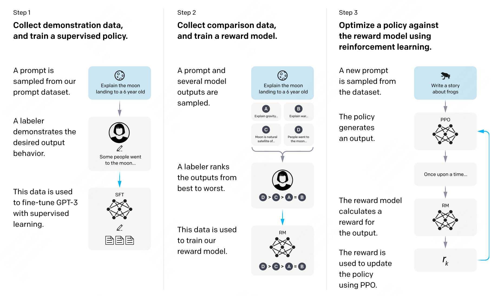

## 概述
Author by: 潘江

越来越多的工作证明将 RL 应用到 LLMs 训练是一个非常有前景的方向，比如 DeepSeek-R1，Qwen3 等。本节内容首先介绍一个通用大模型在预训练后还会进行哪些阶段，后面着重介绍将 RL 应用与大模型训练的 RLHF 框架。

### 全流程训练
在预训练阶段，模型通过自回归方式在海量无标注文本中学习“预测下一个 token”的能力，最终得到一个强大的“续写”引擎。借助 few-shot 提示，该引擎已能解决不少复杂任务，但其行为更多体现为“继续写下去”，而非“按人类意图完成指令”。

有监督微调（SFT）能够让大模型按照人们的意图进行输入。它以（输入，目标）成对数据为核心，让模型学习“看到输入→给出人类真正想要的输出”，从而显式地获得指令遵循与问答能力。经过 SFT 的模型，不再是单纯的续写器，而成为能够听懂并执行人类指令的对话系统。

强化：PPO，DPO，GRPO 等算法本质上是将强化应用于大模型的训练中，从而有效的提升了模型回答与人们的偏好对齐。


### RLHF

在典型的强化学习里，一个智能体 Agent 在状态 s 下会在多个动作里面选择一个，强化学习的目标是要在每一个状态下选择的动作是最好的，也就是说它的长期奖赏是最大的。对应于大模型里面，模型是一个 token 一个 token 输出的，所以这就是每一轮的状态，它的动作是输出的 token 是什么，这对应了强化学习中的动作。大模型中的动作空间恰好是整个词汇表的大小。

在 RLHF 中有四个模型

  - Actor Model：由 SFT 之后的模型初始化而来。作为策略（policy）模型，用于接收上文，做出动作，预测下一个字符。我们的目标就是要更新这个模型。
  - Reference Model：和 Actor Model 同样初始化自 SFT Model，用于和 Actor Model 做对比，保证模型不要偏离原始 SFT Model 太多。这个模型相当于是一个参考模型，在训练的时候不需要更新参数。
  - Reward Model：奖励模型，针对每一个状态，给出奖励分数。这个模型也不需要训练。
  - Critic Model：可以由 Reward Model 初始化而来，用于近似价值函数，输入为状态 s，估计当前状态的价值 V。该模型需要训练和迭代。


在上面的四个模型中 Actor/Critic Model 在 RLHF 阶段是需要训练的，而 Reward/Reference Model 是参数冻结的。

训练过程整体分为两步：maker experience 和 learn。
  - 首先是 make_experience，首先在训练数据中抽取一部分 query，然后 Actor Model 生成答案。然后我们依据这条答案获取我们所需要的经验：
  - actor_logits:由 Actor Model 产生，包含对答案所有词的概率分布。
  - reference_logits：由 Reference Model 产生，包含对答案所有词语的概率分布，用于和 actor logits 进行对比，防止 actor model 偏离 SFT Model 太远。
  - reward_score: 由 Reward Model 产生，为当前句子状态下，立即获取的收益分数。
  - values：由 Critic Model 产生，估计当前句子状态下到完成生成，可以获取的回报，也就是状态价值函数。




你是大模型算法专家，现在正面向大模型的学习者写一份对应的学习文档。
请你一句给你的网页，在下面的基础上进一步续写。

#### Actor-Model 演员模型

- Actor 就是我们想要训练的目标语言模型。一般用 SFT 模型来初始化。
- 训练最终目的是让 Actor 模型能产生符合人类喜好的 response。所以我们的策略是，先喂给 Actor 一条 prompt （这里假设 batch_size = 1，所以是 1 条 prompt），让它生成对应的 response。然后，我们再将“prompt + response"送入我们的“奖励-loss”计算体系中去算得最后的 loss，用于更新 actor。

#### Reference Model 参考模型
- Reference Model（以下简称 Ref 模型）一般也用 SFT 阶段得到的 SFT 模型做初始化，在训练过程中，它的参数是冻结的。Ref 模型的主要作用是防止 Actor”训歪”。
- 我们希望训练出来的 Actor 模型既能达到符合人类喜好的目的，又尽量让它和 SFT 模型不要差异太大。使用 KL 散度来保证两个模型的相似度。
  - 对 Actor 模型，我们喂给它一个 prompt，它正常输出对应的 response。那么 response 中每一个 token 肯定有它对应的 log_prob 结果呀，我们把这样的结果记为 log_probs
  - 对 Ref 模型，我们把 Actor 生成的"prompt + response"喂给它，那么它同样能给出每个 token 的 log_prob 结果，我们记其为 ref_log_probs

#### Critic Model 评论家模型

Critic Model 用于预测期望总收益 
 ，和 Actor 模型一样，它需要做参数更新。实践中，Critic Model 的设计和初始化方式也有很多种，例如和 Actor 共享部分参数、或者从 Reward Model 初始化而来。

在 RLHF 中，我们不仅要训练模型生成符合人类喜好的内容的能力（Actor），也要提升模型对人类喜好量化判断的能力（Critic）。

#### Reward Model 奖励模型

- Reward Model 用于计算生成每个 token 
 的即时收益，在 RLHF 过程中，它的参数是冻结的。


这里有一个自然的问题，Reward Model 和 Critic Model 的区别是什么？

我们现在要预测状态 S 下的状态价值函数 V(s)，有两种表示形式

结果 1：Critic 模型预测： V(s)

结果 2：Reward 模型预测：R(t) + r * V(s + 1)
 和 critic 模型预测的 

那么哪一个结果更靠近上帝视角给出的客观值呢？当然是结果 2，因为结果 1 全靠 Critic 的预测，而结果 2 中的 R(t) 是事实数据。

我们知道 Critic 模型也是参与参数更新的，我们可以用 MSE(上帝视角的客观收益-Critic 模型预测的收益)来衡量它的 loss。但是上帝视角的客观收益我们是不知道的，只能用已知事实数据去逼近它，所以我们就用 R(t) + r * V(s + 1) 来做近似。这就是 Critic 和 Reward 同时存在的意义。


#### Loss 计算

Actor loss：用于评估 Actor 是否产生了符合人类喜好的结果，将作用于 Actor 的参数更新上。

Critic loss：用于评估 Critic 是否正确预测了人类的喜好，将作用于 Critic 的参数更新上。


下面是奖励函数的计算
``` python

def compute_rewards(self, prompts, log_probs, ref_log_probs, reward_score,
                        action_mask):
        """
        reward_function：计算最终的 reward 分数
        复习一下几个相关参数的默认值：
        self.kl_ctl = 0.1
        self.clip_reward_value = 5
        
        对于 batch 中的某个 prompt 来说，它最终的 reward 分数为：
        (1) 先计算 actor 和 ref_model 的 logit 相似度： -self.kl_ctl * (log_probs - ref_log_probs)
            其实写成 self.kl_ctl * (ref_log_probs - log_probs)更好理解些
            这个值越大，说明 ref_model 对 actor 生成的结果的认可度越高（即表明 rlhf 没有训歪），
            没有训歪的情况下我们也应该给模型一些奖励，这个奖励就是 self.kl_ctl * (ref_log_probs - log_probs)
            
        （2）由于我们只取最后一个 token 对应位置的分数作为 reward_score，因此我们只需要：
            self.kl_ctl * (ref_log_probs - log_probs)的最后一位 + reward_score
         
         (3) 同时我们对 reward_score 也做了大小限制，最大不超过 self.clip_reward_value（超过统一给成 self.clip_reward_value），
             最小不低于-self.clip_reward_value（低于统一给成-self.clip_reward_value）
        
         (4) 最后返回的 rewards 大小为：（batch_size, 各条数据的长度），对 batch 中的每条数据来说：
             - response 的最后一位：self.kl_ctl * (ref_log_probs - log_probs)的最后一位 + reward_score
             - response 的其余位置：self.kl_ctl * (ref_log_probs - log_probs)
        
        """

        kl_divergence_estimate = -self.kl_ctl * (log_probs - ref_log_probs)
        rewards = kl_divergence_estimate
        # ---------------------------------------------------------------------------------------------------
        # response 开始的位置
        # （因为我们对 prompt 做过 padding 处理，因此 batch 中每个 prompt 长度一致，也就意味着每个 response 开始的位置一致）
        # （所以这里 start 是不加 s 的，只是一个 int）
        # ---------------------------------------------------------------------------------------------------
        start = prompts.shape[1] - 1
        # ---------------------------------------------------------------------------------------------------
        # response 结束的位置
        # （因为一个 batch 中，每个 response 的长度不一样，所以 response 的结束位置也不一样）
        # （所以这里 end 是加 s 的，ends 的尺寸是(batch_size,)
        # ---------------------------------------------------------------------------------------------------
        ends = start + action_mask[:, start:].sum(1) + 1
        # ---------------------------------------------------------------------------------------------------
        # 对 rewards_score 做限制
        # ---------------------------------------------------------------------------------------------------
        reward_clip = torch.clamp(reward_score, -self.clip_reward_value,
                                  self.clip_reward_value)
        batch_size = log_probs.shape[0]
        for j in range(batch_size):
            rewards[j, start:ends[j]][-1] += reward_clip[j] # 

        return rewards

``` 

引入了优势函数之后，下面是优势函数回报计算。


``` python

 def get_advantages_and_returns(self, values, rewards, start):
        """
        Adopted from https://github.com/CarperAI/trlx/blob/main/trlx/models/modeling_ppo.py#L134
        
        没有引入 GAE 前的 t 时刻的优势值：
        detal_t = r_t + gamma * V_t+1 - V_t
        其中：
            - r_t 表示 t 时刻的即时收益
            - V_t+1 表示未来时刻的预期收益
            - r_t + gamma * V_t+1 可理解成 t 时刻的实际预期收益
            - V_t 可理解成 t 时刻的预估预期收益（是模型，例如 critic model 自己估算出来的）
        
        引入 GAE 后的 t 时刻的优势值：
        A_t = delta_t + gamma * lambda * A_t+1
        粗暴理解为在 t 时刻时，不仅考虑当下优势，还考虑了未来的优势
        为了知道 A_t, 我们得知道 A_t+1，所以在本算法中采取了从后往前做动态规划求解的方法，也即：
        假设 T 是最后一个时刻，则有 A_T+1 = 0, 所以有: A_T = delta_T
        知道了 A_T, 就可以依次往前倒推，把 A_t-1, A_t-2 之类都算出来了
        
        引入 GAE 后 t 时刻的实际预期收益
        returns_t = A_t + V_t
                  = delta_t + gamma * lambda * A_t+1 + V_t
                  = r_t + gamma * V_t+1 - V_t + gamma * lambda * A_t+1 + V_t
                  = r_t + gamma * (V_t+1 + lambda * A_t+1)
        
        注意，这里不管是 advantages 还是 returns，都只算 response 的部分
        """
        
        # Adopted from https://github.com/CarperAI/trlx/blob/main/trlx/models/modeling_ppo.py#L134
        lastgaelam = 0
        advantages_reversed = []
        length = rewards.size()[-1]
        # 注意这里用了 reversed，是采取从后往前倒推计算的方式
        for t in reversed(range(start, length)):
            nextvalues = values[:, t + 1] if t < length - 1 else 0.0
            delta = rewards[:, t] + self.gamma * nextvalues - values[:, t]
            lastgaelam = delta + self.gamma * self.lam * lastgaelam
            advantages_reversed.append(lastgaelam)
        advantages = torch.stack(advantages_reversed[::-1], dim=1) # 优势
        returns = advantages + values[:, start:] # 实际收益
        # values: 预期收益
        return advantages.detach(), returns

```

actor loss 

``` python

    def actor_loss_fn(self, logprobs, old_logprobs, advantages, mask):
        """
        logprobs: 实时计算的，response 部分的 prob（只有这个是随着 actor 实时更新而改变的）
        old_logprobs：老策略中，response 部分的 prob （这个是固定的，不随 actor 实时更新而改变）
        advantages： 老策略中，response 部分每个 token 对应的优势（这个是固定的，不随 actor 实时更新而改变）
        mask：老策略中，response 部分对应的 mask 情况这个是固定的，不随 actor 实时更新而改变）
        
        之所以要引入 logprobs 计算 actor_loss，是因为我们不希望策略每次更新的幅度太大，防止模型训歪
        
        self.cliprange: 默认值是 0.2
        """
        ## policy gradient loss
        # -------------------------------------------------------------------------------------
        # 计算新旧策略间的 KL 散度
        # -------------------------------------------------------------------------------------
        log_ratio = (logprobs - old_logprobs) * mask
        ratio = torch.exp(log_ratio)
        # -------------------------------------------------------------------------------------
        # 计算原始 loss 和截断 loss
        # -------------------------------------------------------------------------------------
        pg_loss1 = -advantages * ratio
        pg_loss2 = -advantages * torch.clamp(ratio, 1.0 - self.cliprange, 1.0 + self.cliprange)
        pg_loss = torch.sum(torch.max(pg_loss1, pg_loss2) * mask) / mask.sum() # 最后是取每个非 mask 的 response token 的平均 loss 作为最终 loss
        return pg_loss

```


critic loss 计算 


``` python

def critic_loss_fn(self, values, old_values, returns, mask):
        """
        values: 实时 critic 跑出来的预估预期收益（是变动的，随着 ppo epoch 迭代而改变）
        old_values：老 critic 跑出来的预估预期收益（是固定值）
        returns：实际预期收益
        mask：response 部分的 mask
        
        self.cliprange_value = 0.2
        """
        ## value loss
        # 用旧的 value 去约束新的 value
        values_clipped = torch.clamp(
            values,
            old_values - self.cliprange_value,
            old_values + self.cliprange_value,
        )
        if self.compute_fp32_loss:
            values = values.float()
            values_clipped = values_clipped.float()
        
        # critic 模型的 loss 定义为（预估预期收益-实际预期收益）**2
        vf_loss1 = (values - returns)**2
        vf_loss2 = (values_clipped - returns)**2
        vf_loss = 0.5 * torch.sum(
            torch.max(vf_loss1, vf_loss2) * mask) / mask.sum() # 同样，最后也是把 critic loss 平均到每个 token 上
        return vf_loss

```