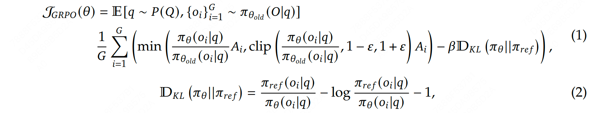
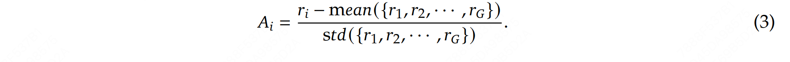
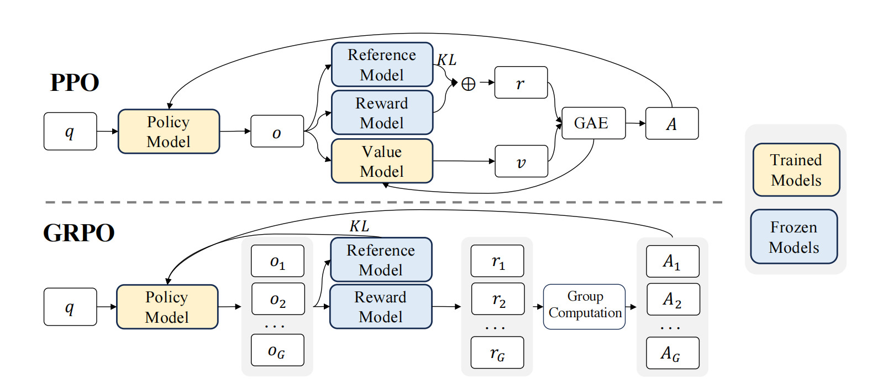

## 概述
Author by: 潘江

GRPO 是一种在线学习算法（online learning algorithm），这意味着它通过使用训练过程中由训练模型自身生成的数据来迭代改进。GRPO 的目标是最大化生成补全（completions）的优势函数（advantage），同时确保模型保持在参考策略（reference policy）附近。

它的目标函数为：

#### 收集数据
在每一个训练步骤中，我们从提示（prompts）中采样一个批次（batch），并为每个提示生成一组 G 个结果（completions）（记为 $O_i$ ）。

#### 计算优势值
对于每一个 $G$ 序列，使用奖励模型（reward model）计算其奖励（reward）。为了与奖励模型的比较性质保持一致——通常奖励模型是基于同一问题的输出之间的比较数据集进行训练的——优势的计算反映了这些相对比较。其归一化公式如下：

$$
\hat{A}_{i,t} = \frac{r_i - \text{mean}(\mathbf{r})}{\text{std}(\mathbf{r})}
$$

这种方法赋予了该方法其名称：群体相对策略优化（Group Relative Policy Optimization, GRPO）

#### 估计 KL 散度
在实际算法实现中，直接计算 KL 散度可能会面临一些挑战：

- **计算复杂度高**：KL 散度的定义涉及对两个概率分布的对数比值的期望计算。对于复杂的策略分布，直接计算 KL 散度可能需要大量的计算资源；
- **数值稳定性**：在实际计算中，直接计算 KL 散度可能会遇到数值不稳定的问题，尤其是当两个策略的概率分布非常接近时，对数比值可能会趋近于零或无穷大。近似器可以通过引入一些数值稳定性的技巧（如截断或平滑）来避免这些问题；
- **在线学习**：在强化学习中，策略通常需要在每一步或每几步更新一次。如果每次更新都需要精确计算 KL 散度，可能会导致训练过程变得非常缓慢。近似器可以快速估计 KL 散度，从而支持在线学习和实时更新。

Schulman et al. (2020) 提出的近似器可以根据当前策略和参考策略的差异动态调整估计的精度，从而在保证计算效率的同时，尽可能减少估计误差，其定义如下：

$$
\mathbb{D}_{\text{KL}}\left[\pi_\theta \|\pi_{\text{ref}}\right] = \frac{\pi_{\text{ref}}(o_{i,t} \mid q, o_{i,<t})}{\pi_\theta(o_{i,t} \mid q, o_{i,<t})} - \log \frac{\pi_{\text{ref}}(o_{i,t} \mid q, o_{i,<t})}{\pi_\theta(o_{i,t} \mid q, o_{i,<t})} - 1
$$

这个近似器的核心思想是通过对当前策略和参考策略的概率比值的简单变换来估计 KL 散度。

- 第一项：$\frac{\pi_{\text{ref}}(o_{i,t} \mid q, o_{i,<t})}{\pi_\theta(o_{i,t} \mid q, o_{i,<t})}$ 是参考策略与当前策略的概率比值
- 第二项：$\log \frac{\pi_{\text{ref}}(o_{i,t} \mid q, o_{i,<t})}{\pi_\theta(o_{i,t} \mid q, o_{i,<t})}$ 是对数概率比值
- 第三项：$-1$ 是一个常数项，用于调整近似器的偏差

这个近似器的优势在于它只需要计算当前策略和参考策略的概率比值，而不需要直接计算 KL 散度的积分或期望。因此，它可以在保证一定精度的同时，显著降低计算复杂度。

这个近似器的设计灵感来自于泰勒展开。KL 散度可以看作是两个分布之间的某种“距离”，而这个近似器通过一阶或二阶近似来估计这个距离。具体来说：

- 当 $\pi_\theta$ 和 $\pi_{\text{ref}}$ 非常接近时，$\frac{\pi_{\text{ref}}}{\pi_\theta} \approx 1$，此时 $\log \frac{\pi_{\text{ref}}}{\pi_\theta} \approx 0$，近似器的值趋近于零，符合 KL 散度的性质
- 当两者差异较大时，近似器会给出一个较大的正值，反映出两个分布之间的差异

#### 计算损失

这一步的目标是最大化优势，同时确保模型保持在参考策略附近。因此，损失定义如下：

$$
\mathcal{L}_{\text{GRPO}}(\theta) = -\frac{1}{G} \sum_{i=1}^G \frac{1}{|o_i|} \sum_{t=1}^{|o_i|} \left[ \frac{\pi_\theta(o_{i,t} \mid q, o_{i,< t})}{\left[\pi_\theta(o_{i,t} \mid q, o_{i,< t})\right]_{\text{no grad}}} \hat{A}_{i,t} - \beta \mathbb{D}_{\text{KL}}\left[\pi_\theta \| \pi_{\text{ref}}\right] \right]
$$

其中第一项表示缩放后的优势，第二项通过 KL 散度惩罚与参考策略的偏离。

在原始论文中，该公式被推广为在每次生成后通过利用裁剪替代目标（clipped surrogate objective）进行多次更新：

$$
\mathcal{L}_{\text{GRPO}}(\theta) = - \frac{1}{G} \sum_{i=1}^G \frac{1}{|o_i|} \sum_{t=1}^{|o_i|} \left[ \min \left( \frac{\pi_\theta(o_{i,t} \mid q, o_{i,< t})}{\pi_{\theta_{\text{old}}}(o_{i,t} \mid q, o_{i,< t})} \hat{A}_{i,t},\ \text{clip}\left( \frac{\pi_\theta(o_{i,t} \mid q, o_{i,< t})}{\pi_{\theta_{\text{old}}}(o_{i,t} \mid q, o_{i,< t})}, 1 - \epsilon, 1 + \epsilon \right) \hat{A}_{i,t} \right) - \beta \mathbb{D}_{\text{KL}}\left[\pi_\theta \| \pi_{\text{ref}}\right] \right]
$$

其中 $\text{clip}( 1 - \epsilon, 1 + \epsilon)$ 通过将策略比率限制在 $1 - \epsilon$ 和 $1 + \epsilon$ 之间，确保更新不会过度偏离参考策略。

