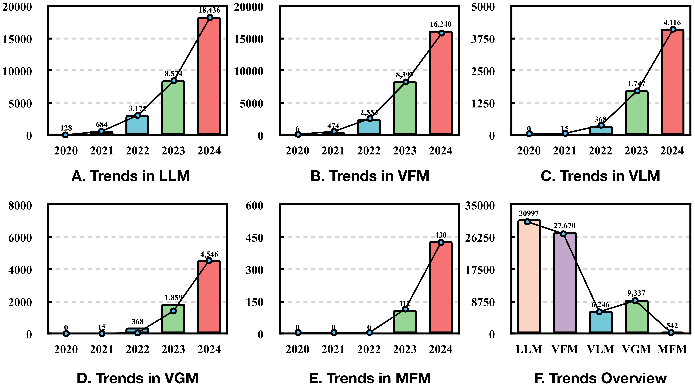
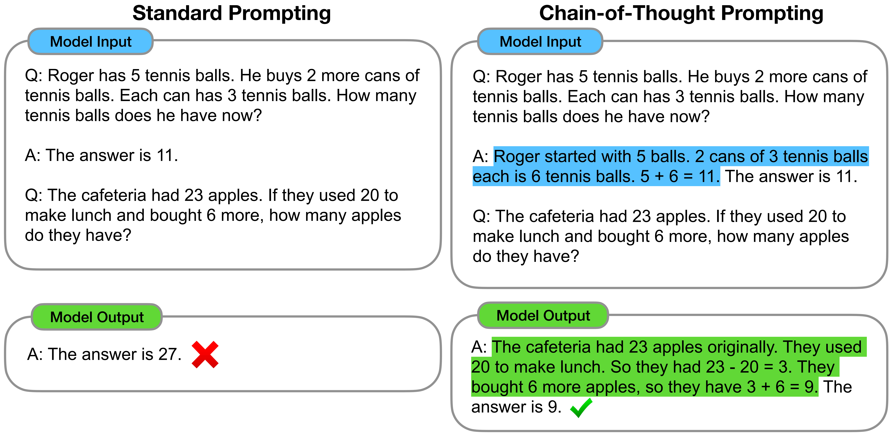
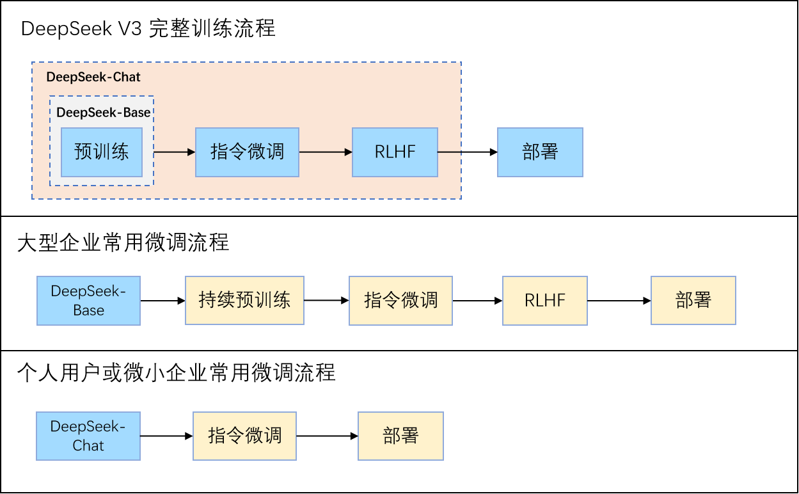

<!--Copyright © ZOMI 适用于[License](https://github.com/Infrasys-AI/AIInfra)版权许可-->

# 01.大模型微调基础

> Author by: 许起星

一个大模型从架构设计出发，到真正落地到使用是有一段很长的过程的，从预训练使大模型具备通用的能力，到传统的有监督微调使模型能够适应特定领域的需求，此外，为了使模型能够与人类进行交互，还少不了指令微调和强化学习微调，最后一个调好的模型又需要经过部署才能真正被人使用。

我们可以看到，微调在这个过程中占了不少比重，甚至可以说是发挥着极其重要的作用。广义而言，微调指的是预训练阶段之后让模型在小规模数据集上进行再次训练调整（包含指令微调、以及与人类意图对齐的强化学习），狭义而言，指的是指令微调（现在社区大部分人把指令微调等同于有监督微调，但二者在历史的概念上并不完全等同，后续我们会分析）。在本节中，我们将从整体地视角来看待把握广义上微调，主要帮读者捋顺微调是如何一步步发展的，以及当前主流微调方法有哪些，进而读者可以对微调有一个宏观上的把握。

## 1. 微调发展之路

微调的发展大致可以分为三个阶段：特征迁移时代（2013–2017）、任务微调时代（2018–2020）和快速发展时代（2021–至今）。这三个阶段不单单反映了技术方法的演进，更体现了模型与人类交互方式的转变：从借用通用特征，到适配特定任务，再到理解人类意图并遵循价值观。微调的目标从提升单一任务指标，逐步发展为塑造模型的通用能力、安全边界与推理行为。

**特征迁移时代（2013–2017）**。在深度学习早期，NLP 领域尚未形成统一的预训练范式。2013 年，Mikolov 等人提出的 Word2Vec 以及随后的 GloVe 开创了静态词向量时代。这些模型在大规模语料上预训练得到固定维度的词嵌入，作为下游任务（如文本分类、情感分析）的输入特征。此时的“微调”通常指冻结词向量，仅训练任务特定的浅层网络（如 CNN、RNN 或 MLP）。

这一阶段的核心思想是表征迁移，即预训练模型提供通用语义表示，下游任务在其基础上进行轻量适配。然而，静态词向量无法解决一词多义问题（如“苹果”指水果还是公司？），且下游模型仍需从零学习任务逻辑，知识迁移效率有限。

**任务微调时代（2018–2020）**。2018 年是 NLP 的转折点。ELMo 首次引入上下文相关的动态词表示，而 BERT 则通过双向 Transformer 架构与掩码语言建模任务，实现了深度语义理解，并正式确立了 “预训练 + 全参数微调” 的标准流程。在这一范式下，模型先在海量无标注文本上预训练，再在特定任务的标注数据上端到端微调所有参数，仅需更换任务头（如分类层）。

BERT 及其后继者（如 RoBERTa、ALBERT）迅速在 GLUE、SQuAD 等多个基准数据集上刷新纪录，微调成为提升任务性能的“黄金标准”。然而，这一阶段的微调仍是任务封闭式的：每个任务需独立微调一个模型，模型无法理解自然语言指令，还难以与人类进行真正产生交互。

**快速发展时代（2021–至今）**。随着 GPT-3 展示出强大的上下文学习能力，研究者意识到语言模型的价值不在于完成单一任务，而在于作为通用智能体与人类交互协作。在这一阶段，微调得到了快速的发展，其主要可以从两个并行的主线理解，一个是促使模型与人类意图对齐的主线，另外一个是如何更高效地微调模型主线。首先是在 2021-2022 年，FLAN 与 T0 系统性验证了指令微调的有效性，使模型真正开始走向与人类交互的道路。同期，CoT 通过思维链激发多步推理，并迅速被纳入 SFT 数据，使模型“学会思考”，让模型能够像人类一样一步一步输出自己的思考过程。2022 年，InstructGPT 引入 RLHF，通过人类偏好数据训练奖励模型，并结合 PPO 强化学习优化策略，首次实现大规模人类价值观对齐。次年，DPO 提出一种简洁高效的替代方案——无需显式奖励模型和强化学习，仅用一个监督式损失函数即可直接优化偏好对，在效果媲美 RLHF 的同时大幅降低实现复杂度，迅速成为开源社区主流。2024-2025 年对齐技术进一步精细化，读者感兴趣再自行去阅读相关文献如 ORPO（Odds Ratio Preference Optimization）、KTO（Kahneman-Tversky Optimization）等。这一条主线让模型从 BERT 时代仅能机械地执行特定任务转变成能与人类交互地真正的人工智能，极大地促进了人工智能的发展。另外一条主线则是微调效率的革命，面对百亿、千亿参数模型带来的显存与存储压力，这条主线是让大模型为不同组织特定需求的对齐落地的重要技术。早在 2019 年，Adapter 就被提出用于高效微调 BERT，首次系统性验证“冻结主干 + 插件微调”的可行性，为 PEFT 奠定思想基础，随着 GPT-3 展示千亿参数模型的潜力，研究者亟需更高效的微调方案。2021 年成为 PEFT 的“黄金元年”，三大代表性方法相继提出，分别是 Prefix Tuning、Prompt Tuning 和 LoRA。随后 2022 年提出的 UniPELF 首次在同一模型中并行集成多种 PEFT 方法，并通过门控机制自动选择最优组合。人们又发现微调调参是一个十分复杂麻烦的过程，对于每个不同任务不同数据集都要去调整合适的参数（比如 LoRA 的秩），那工作量无疑是巨大的，因此在 2024 年 NOAH 和 AUTOPEFT 探索如何自动搜索最优的微调配置。总之，在 2021 年之后，各种关于 PEFT 的论文百花齐放，如下图所示，PEFT 在各个领域（如 LLM、VFM、VLM 等）上逐年激增。

## 2. 主流微调方法

随着微调技术的发展，一系列不同的方法应运而生，以应对不同的性能需求、资源限制和任务目标。目前，主流的微调方法可以从不同维度进行分类，而理解这些分类方式，有助于我们根据具体需求选择最合适的技术路线。本章将从以下几个核心维度展开介绍：

- 按训练流程划分：从整个模型训练的整个流程中找到微调的定位，捋清不同的微调概念。
- 按微调参数规模划分：引入全参微调和高效参数微调 PEFT。
- 高效的 PEFT 设计：聚焦 PEFT，如何设计更高效的 PEFT。
- PEFT 的多种应用：除了 LLMs，还将介绍 PEFT 在 ViTs、VLAs 和 Diffusion Models 等多种模型架构中的研究应用。

最终我们整个微调章节还是主要聚焦于 PEFT 上来。

### 2.1 按训练流程划分

为了完整清晰地描述整个流程，本文将一些与微调关系不那么密切的概念（如”预训练“等）也统一放在此处讲，如下图所示，金色部分指的是使用的场景不多，蓝色部分指的是常规训练流程中都会涉及的。

首先是**预训练**。对模型进行预训练指的是在大规模无标注文本语料（如网页、书籍、代码等）上，通过自监督学习任务来优化模型参数，经过预训练之后，模型便学习到了语言的统计规律、语法结构、世界知识以及一定程度的推理能力，从而具备了生成连贯文本、理解语义和回答问题的基础能力。

其次是**持续预训练**。当我们拿到一个在通用数据上进行预训练好的模型时，如果我们当前任务的域与先前预训练的域差距非常非常大，举个极端情况的例子，即预训练阶段都是在英文文本上进行训练，尽管它对自然语言具备了一定的思考能力，但是我们想将其用在中文域上，仅通过简单地微调是难以弥补如此大的域差距的。所以我们想基于原始具备一定能力的预训练模型上，再一次进行预训练，使用的数据量相比于预训练差不多同样是一个量级的，且与预训练的训练方式无异。

接下来是**有监督微调（Supervised Fine-tuning, SFT）**。SFT 是一个比较广泛的概念，由图中我们可以看到，”传统 SFT“、”指令微调“和 ”RFT“ 都属于 SFT 的范畴，正因它的训练方式与预训练的无监督训练不同，采取的是有监督训练，因而被称为有监督微调，它的目的是使模型在特定的域上表现更好。

在 ”指令微调“ 被提出之前，已经存在 ”微调“ 这一说法了，为了避免歧义，我们称之为 ”**传统 SFT**“。说得更具体一点，在大语言模型兴起之前（如 BERT 时代），语言模型往往是不能像如今这般直接与人交互的，而只是执行特定的语言任务，比如情感分类、机器翻译等。如果是情感分类任务，那么就是输入”今天天气真不错“给模型，模型会输出”积极“，但是如果询问模型”你觉得今天天气如何呢“，模型便会不知所措，它无法像人类一样思考来回复我们。这时的 SFT 不是为了“让模型听懂自然语言指令”，而是为了适配具体任务头，此时没有指令微调的概念，因为模型不是生成式的，也不追求通用性。随着 2020 年 GPT-3 的提出，大模型时代正式到来，GPT-3 展示了上下文学习能力，但效果有限。而 2021–2022 年 Google 的 FLAN 和 Meta 的 T0 等工作提出**”指令微调“**，这才让模型真正地像人类一样与我们进行交互，而不是机械地回答问题。因为随着大模型的到来和发展，传统 SFT 几乎已经不怎么使用了，更多是直接进行指令微调，因此在目前的社区中，人们往往会将 SFT 直接等同于指令微调。尽管传统 SFT 和指令微调都属于 SFT 范畴，它们还是有着以下几点区别的：

1. 目标不同
   - 传统 SFT ：目标是在单一特定任务上达到最优性能（如判断情感是正面还是负面）。
   - 指令微调：目标是让模型泛化到未见过的指令和任务，具备通用的“听懂人话并执行”的能力。
2. 数据组织方式不同（详见下表）
   - 传统 SFT ：数据是同质的、任务固定的（例如 1 万条“文本 → 情感标签”），且通常只包含一种任务类型。
   - 指令微调：数据是异构的、多任务混合的（如同时包含摘要、翻译、问答、改写等），每条样本都用自然语言指令明确描述任务，使模型学会“任务切换”。
3. 对模型能力的影响不同
   - 传统 SFT 后：模型变成一个专用工具（如情感分类器），无法处理其他任务。
   - 指令微调后：模型变成一个通用助手，即使面对训练中未出现过的指令，也能尝试理解和响应（零样本泛化）。
4. 训练范式演进
   - 传统 SFT ：源于 BERT 时代，强调“为每个任务设计输入模板+任务头”。
   - 指令微调：源于大语言模型时代，强调“统一生成接口 + 任务描述即提示”，摒弃任务专属结构，靠语言本身传达意图。

| 类别         | 代表性数据集                         | 数据形式                     | 示例                                                         | 备注                                |
| ------------ | ------------------------------------ | ---------------------------- | ------------------------------------------------------------ | ----------------------------------- |
| **传统 SFT** | **GLUE (2018)**                      | 输入 → 输出                  | 输入: "The movie was great!" 输出: "positive"                | 用于自然语言理解 (分类/蕴含/相似度) |
|              | **SQuAD (2016)**                     | 输入(段落+问题) → 输出(答案) | 输入: Passage + "What is the capital of France?" 输出: "Paris" | 经典阅读理解任务                    |
|              | **WMT (机器翻译)**                   | 输入(英文) → 输出(中文)      | 输入: "I love this movie." 输出: "我喜欢这部电影。"          | 无任务说明，只学翻译                |
| **指令微调** | **Super-NaturalInstructions (2022)** | 指令 + 输入 → 输出           | 指令: "判断情感类别：积极/消极" 输入: "这部电影真的很好看" 输出: "积极" | 多任务指令集 (~1600 任务)            |
|              | **FLAN (2021/22)**                   | 指令 + 输入 → 输出           | 指令: "将英文翻译成中文。" 输入: "I love this movie." 输出: "我喜欢这部电影。" | Google 构建的大规模跨任务指令数据   |
|              | **Alpaca (2023)**                    | 指令 + 输入 → 输出           | 指令: "写一首关于春天的短诗。" 输入: "" 输出: "春风拂面，花开满园…" | 基于 GPT 生成的 52K 指令数据        |
|              | **OpenAssistant (2023)**             | 指令 + 输入 → 输出           | 指令: "解释量子计算机和传统计算机的区别。" 输出: "量子计算机使用量子比特…" | 专注对话式助手数据                  |
|              | **Dolly (Databricks, 2023)**         | 指令 + 输入 → 输出           | 指令: "给出一个 Python 代码计算斐波那契数列。" 输出: "def fib(n): ..." | 企业开源指令调优数据                |

在模型进行指令微调之后，它已经能与人类产生较好的交互了，但是仍存在一个安全性的问题，也就是模型可能输出一些不安全、偏见或事实错误的内容。为了缓解这种现象的发生，研究者们提出了 **RFT（Rejection Fine-Tuning）**，RFT 通常与指令微调同时发生，它的目的是让模型在面对不当、危险、越狱或超出能力范围的请求时（比如用户提问如何制造炸弹等），主动拒绝而非盲目迎合。它在训练上与指令微调并无二异，只是在数据集的内容上有所差异，如下表所示。因此，实践中常将指令微调和 RFT 同时进行，即把 RFT 样本混入指令微调数据集，如 90% 正常指令和 10% 拒绝场景，形成更全面的数据进行微调训练。

|          | 指令微调数据                                 | RFT 数据                                             |
| -------- | -------------------------------------------- | ---------------------------------------------------- |
| **输入** | 合理、合法、明确的任务请求（如“翻译成英文”） | 有害、非法、越狱、模糊或超纲请求（如“教我黑进系统”） |
| **输出** | 积极、完整、有用的回答                       | 标准化拒绝语（如“我无法协助此请求”）                 |

类似的，为了避免模型在面对复杂推理任务（如数学应用题、逻辑推理、多步问答）时跳过中间步骤直接输出最终答案，如当前 DeepSeek 的”深度思考“功能，研究者们提出了思维链（Chain-of-Though, CoT），它的做法是在指令微调数据上加入更具体的推理步骤，如下图所示。尽管 CoT 对大模型效果提升明显，但是在中小模型上却并不适用甚至有害。

指令微调让模型理解人类意图并进行回复，RFT 让模型拒绝人类不当的请求，CoT 让模型具备思考能力。但是还是存在一个问题，即模型的输出并不一定完全是对用户有用的，这输出可能是错误的、有害的或者仅仅对用户毫无帮助的，换而言之，就是模型的输出与用户存在”不对齐“的可能。因此还需要一种算法来使模型与用户对齐，让模型的输出符合用户的偏好，传统上有算法 **RLHF** ( Reinforcement Learning from Human Feedback )，现在有提出了更先进的 **DPO** ( Direct Preference Optimization )算法。打个比方来说，SFT 是 监督学习，每条样本有标准答案，让模型模仿它；RLHF / DPO 是 偏好学习，没有“标准答案”，只有“哪个更好”，目标是对齐人类偏好，而非复制某个固定输出。在此处我们仅对两种算法进行一个简单的介绍，如下图，首先是 RLHF ，它首先收集偏好数据，即通过指令微调好的模型，对同一个提示，让模型产生多个回答，然后人工去标注哪个回答更好。接着使用偏好数据训练奖励模型 RM，RM 的输入是”输入给大模型的提示+大模型的回答“，RM 的输出是一个质量分数。最后通过 RM 来为大模型新生成的回答打分，用 PPO (Proximal Policy Optimization) 等算法更新大模型，使其生成更高奖励的回答，同时增加 KL 散度约束，防止模型偏离原来的大模型太远，我们可以看出 RLHF 流程十分复杂，且 PPO 算法需要调参、RM 可能过拟合。而 DPO 无需 RM， 通过一个简单的分类式目标，直接优化模型策略去满足人类偏好，不需要显式的奖励函数或强化学习过程。

还有一个是在模型部署之后，对模型参数不进行调整的**上下文学习**（In-Context Learning, ICL）。它的核心思想是大语言模型在推理时，不需要更新参数，用户只通过在输入里提供“示范+ 待解决问题”来完成任务。举个具体的例子便能说明其做法：

> 示例 1: pinyin: wo ai ni → 我爱你  
> 示例 2: pinyin: zao shang hao → 早上好  
> 问题: pinyin: xue xi hao nan →

模型就会根据根据上下文的规律，输出”学习好难“。

最后，还想说明的一点是，从大模型预训练到部署前这一个过程来看，我们说的微调是指预训练后的阶段都称为微调，这和我们平时说的“拿官方的预训练模型过来微调一下”中的“微调”可能又不完全一样。以 DeepSeek-V3 为例，当 DeepSeek-V3 发布时，它会提供至少两种模型供我们下载，分别是 `DeepSeek-V3-Base` 和 `DeepSeek-V3-Chat（或叫 DeepSeek-V3）`，如下图所示，前者指的是预训练后、未经任何 SFT 或 RLHF 的基础模型，后者指的是经过了 SFT 和 RLHF 完整后训练的聊天模型。对于大型企业而言，他们可能拥有充足的算力并希望构建一个自由度更高的模型，那么他们则会选择从 `DeepSeek-V3-Base` 开始微调，如下图，流程中蓝色部分表示官方已经完成的流程，黄色部分则表示企业或用户需要自行完成的部分；对于个人用户而言，因为算力有限，往往会选择从`DeepSeek-V3-Chat` 开始微调，由于`DeepSeek-V3-Chat` 已经经过一轮指令微调和 RLHF 等，因此，个人用户为了提高模型在特定领域的能力，只需使用特定领域的数据集再次对模型进行指令微调即可，而平时所说的“官方的预训练模型“在此处就指的是官方”预训练+ RLHF/DPO“后的模型。

### 2.2 按微调参数规模划分

根据在微调过程中更新的参数数量，微调方法主要分为两大类：**全参数微调（Full-Parameter Fine-Tuning, FFT）**和**参数高效微调（Parameter-Efficient Fine-Tuning, PEFT）**。这两种方法在资源消耗、存储成本和最终效果之间有着不同的权衡。在模型最初训练时，比如在 DeepSeek V3 完整的训练流程中，为了达到最佳性能，指令微调和 RLHF 一般都采取 FFT；而对于个人用户而言，由于是基于一个比较成熟的模型上进行再次训练的，再加上由于硬件资源限制，因此通过一般采取 PEFT，使得模型尽可能保持原本泛化能力的同时对特定领域的知识更加精通。

**全参数微调**是最早期也是最直接的思路。它在微调阶段更新模型的所有参数，即对预训练得到的基础模型进行端到端的再训练。这种方法能够最大程度地适配下游任务或对齐目标，通常在数据充足、计算资源丰富的情况下取得最优性能。例如，OpenAI 的 InstructGPT 和 Meta 的 Llama-2-Chat 在官方训练流程中均采用了全参数微调（包括 SFT 和 RLHF 阶段），以确保模型在指令遵循、安全性和有用性上达到最高标准。

然而，FFT 的代价极高：

- 显存消耗大：微调一个 7B 参数的模型通常需要多张高端 GPU（如 4×A100 80GB）；
- 存储成本高：每微调一个任务或版本，就需要保存一套完整的模型副本（例如 13GB/7B 模型）；
- 训练不稳定：在小数据集上容易过拟合，或因学习率不当导致灾难性遗忘。

正因如此，随着大模型参数量持续增长，**参数高效微调**技术应运而生。PEFT 的核心思想是冻结预训练模型的绝大部分参数，仅引入少量可训练参数（通常 <1%），通过适配器（Adapter）、低秩矩阵（LoRA）、前缀向量（Prefix-tuning）等方式注入任务特定知识，下图右半部分展示了 PEFT 技术的发展以及大模型的发展，同时还展示了 4 类主流 PEFT 方法的思想。其中，LoRA 因其简单、高效、可合并、对推理无延迟影响等优点，成为当前最主流的 PEFT 方法。尽管如此，大模型的架构多样性同样决定了 PEFT 的不同策略，比如对于视觉模型和语言模型，可能采取不一样的 PEFT 策略，甚至对语言模型的不同架构也能采取不同的策略。

此外，后续研究者提出的 UniPELT 采取混合微调策略，把 Prefix-tuning、Adapter 和 LoRA 多种 PEFT 方法集成到模型中进行微调，并通过引入门控机制来选择激活的 PEFT 模块。 LLM-Adapters 等探索应该在模型的哪些位置插入 PEFT 会达到更好的效果，AUTOPEFT 和 NOAH 则研究如何让模型自行设置最佳的参数进行微调。

总体而言，FFT 追求性能上限，适用于资源充足的工业级训练；而 PEFT 则在几乎不损失效果的前提下大幅降低门槛，推动了大模型微调在学术界和中小团队中的普及。两者并非互斥，而是根据实际需求的不同选择。

## 3. 高效底参微调 PEFT

### PEFT 设计

### PEFT 应用

## 4. 总结与思考

纵观大模型的发展路径，微调几乎贯穿了从预训练到落地应用的每一个关键环节。从最初的特征迁移到任务微调，再到当下的指令微调与偏好对齐，微调不仅仅是性能优化的手段，更是模型理解人类意图、遵循价值观的重要桥梁。与此同时，参数高效微调的兴起也让中小团队有机会参与到大模型的定制与创新中。总体来看，微调技术已经成为大模型走向实用化的一个必不可少的环节。

## 5. 参考与引用

- [1] Wu X K, Chen M, Li W, Wang R, Lu L, Liu J, Hwang K, Hao Y, Pan Y, Meng Q, et al. LLM Fine-Tuning: Concepts, Opportunities, and Challenges[J]. Big Data and Cognitive Computing, 2025, 9(4): 87. DOI:10.3390/bdcc9040087.
- [2] Devlin J, Chang M W, Lee K, et al. Bert: Pre-training of deep bidirectional transformers for language understanding[C]//Proceedings of the 2019 conference of the North American chapter of the association for computational linguistics: human language technologies, volume 1 (long and short papers). 2019: 4171-4186.
- [3] Wei J, Wang X, Schuurmans D, et al. Chain-of-thought prompting elicits reasoning in large language models[J]. Advances in neural information processing systems, 2022, 35: 24824-24837.
- [4] Rafailov R, Sharma A, Mitchell E, et al. Direct preference optimization: Your language model is secretly a reward model[J]. Advances in neural information processing systems, 2023, 36: 53728-53741.
- [5] Zhang D, Feng T, Xue L, et al. Parameter-efficient fine-tuning for foundation models[J]. arXiv preprint arXiv:2501.13787, 2025.
- [6] Han Z, Gao C, Liu J, et al. Parameter-efficient fine-tuning for large models: A comprehensive survey[J]. arXiv preprint arXiv:2403.14608, 2024.
