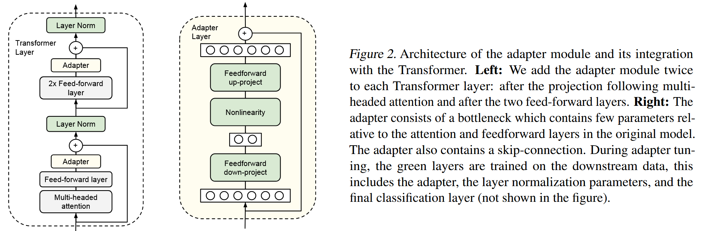
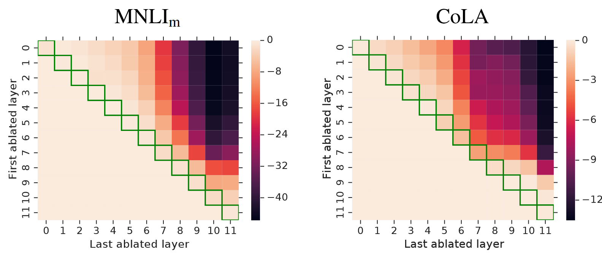
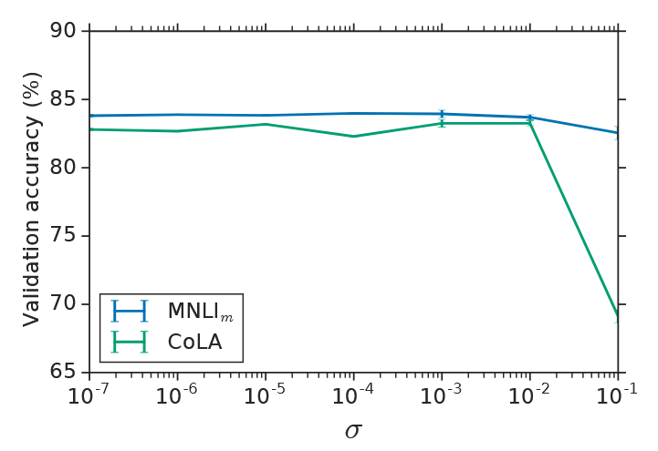

<!--Copyright © ZOMI 适用于[License](https://github.com/Infrasys-AI/AIInfra)版权许可-->

# 02.Prompt-base 微调

>  Author by: 许起星

本章节的内容可以说是**参数高效微调 PEFT**（而非全量微调）的起源，正如 01.Introduction 部分的微调发展历史脉络图所示，我们可以发现 2021 年是 PEFT 的黄金元年，众多著名的 PEFT 技术喷涌而出，例如大名鼎鼎的 LoRA、Prompt-tuning等。而在本节，我们主要关注 Prompt-base 的 PEFT 技术，并按照历史发展脉络进行展开，即 Prefix-tuning ➡ Prompt-tuning & P-tuning ➡ P-tuning v2，让读者能够从其发展缘由来把握这些方法。

有同学注意到，Adapter 并非属于 Prompt-base 方法，却也在我们本节内容内，这是因为 Adapter 算是 PEFT 的开山之作，而 Prompt-base 方法从某种意义上又可以说是改进 Adapter 而提出的一种新范式方法（为什么新，且听后文讲解），因此，从 Adapter 入手，更能方便文章展开。话不多说，进入正题。

## 1. Adapter

> Houlsby N, Giurgiu A, Jastrzebski S, et al. Parameter-efficient transfer learning for NLP[C]//International conference on machine learning. PMLR, 2019: 2790-2799.

### 背景

Adapter 最初提出的背景是迁移学习，迁移学习是一个广义概念，指“利用在源任务上学到的知识，来帮助目标任务的学习”，而大模型微调是迁移学习的一种具体实现方式。在当时，基于一个经过预训练的大模型，针对每一个下游任务，都需要对这个大模型进行全量微调，这是极其消耗资源的，既消耗计算资源（全量微调需要对大模型的所有参数都进行更新），又消耗存储资源（对于每一个下游任务，都需要保存完整的模型副本）。

为了解决上述问题，Adapter 通过不改变原有预训练大模型参数的基础上，向大模型中插入一些可学习的模块，这些可学习的模块就称为 Adapter。对于每一个下游任务，训练时把原先预训练权重进行冻结，只训练 Adapter 部分即可，这既节省了计算资源（从对所有参数更新变成只对 Adapter 参数更新），又节省了存储资源（对于 N 个下游任务，不再需要保存 N 份完整的模型副本，只需要保存 1 份预训练模型副本和 N 份 Adapter）。而 Adapter 参数量极少，仅占大模型参数量的大约 3.6% 左右，此外，还能达到与全量微调相当的效果。这些 Adapter 还是可拔插式（后续的 PEFT 方式大部分也都是可拔插式的），拿洗澡时的花洒打个比方，如果下游任务是希望细丝状出水，则接上细丝状出水的花洒头即可，如果下游任务是希望喷雾状出水，则接上喷雾状出水的花洒头即可，而整个从自来水厂到接入家中的出水系统（即预训练模型）是保持不变的。


### 模型架构

Adapter 应用于 Transformer 架构中。如下图，左边是结合 Adapter 后的 Transformer Layer 架构图，Adapter 串行接入到两个前馈层（Feed-forward layer）后面；右边是 Adapter 内部的具体实现架构图，每个 Adapter 由下采样线性层（从高维映射到低维）、非线性激活和上采样线性层（从低维映射到高维）构成，重要的是还有一个残差连接，这个**残差连接**是重点，后面要考。



模型架构十分简单，下面给出一个基于 Pytorch 的代码示例（非完整版），可以看到，每个 Adapter 仅含有 2md + d + m 个参数，其中 d 是输入数据的维度，m 是降维的维度，也就是代码中的 bottleneck_dim，其中 m << d。对于下采样线性层，有 md + m 个参数，对于上采样线性层，有 md + d 个参数，因此总共是 2md + d + m 个参数。

```python
import torch
import torch.nn as nn
# 非完整版：未实现恒等映射初始化
class Adapter(nn.Module):
    def __init__(self, hidden_dim: int, bottleneck_dim: int = 64, activation: str = "relu"):
        """
        A standard adapter module.

        Args:
            hidden_dim (int): 输入特征维度（例如 Transformer 的 hidden size）
            bottleneck_dim (int): 中间降维维度，通常是 hidden_dim 的 1/16 ~ 1/64
            activation (str): 激活函数，可选 'relu', 'gelu', 'tanh'
        """
        super().__init__()
        self.down = nn.Linear(hidden_dim, bottleneck_dim) # 下采样线性层
        self.nonlinearity = { # 非线性激活
            "relu": nn.ReLU(),
            "gelu": nn.GELU(),
            "tanh": nn.Tanh(),
        }[activation.lower()]
        self.up = nn.Linear(bottleneck_dim, hidden_dim) # 上采样线性层

    def forward(self, x):
        residual = x
        x = self.down(x)
        x = self.nonlinearity(x)
        x = self.up(x)
        return residual + x  # 残差连接
```

### 实现细节

在实现细节中，最重要的就是初始化时的**恒等映射**（即在第一次更新模型 Adapter 参数之前，让加了 Adapter 模型的输出和原始预训练模型的输出几乎保持一致），这由两方面来共同实现，一方面是**残差连接**，另外一方面是**初始化策略**。

**为什么初始化时要进行恒等映射呢？**若直接采用随机初始化，虽然预训练模型的参数已收敛到较优的语义空间，但新加入的 Adapter 会打破这种空间分布。具体而言，随机初始化的 Adapter 会在每个插入位置引入随机扰动，使原本稳定的特征表示被偏移，相当于在模型中注入噪声。这种噪声会随着网络深度层层传播、放大，导致模型输出分布发生剧烈变化，从而使预训练权重的语义结构被破坏，模型性能骤降。更重要的是，Adapter 通常只包含极少量可训练参数，若模型在初始阶段就偏离了原有的最优空间位置，仅依靠这些少量参数进行纠正几乎不可能，训练过程也会变得不稳定。因此，通过恒等映射初始化，使 Adapter 在刚插入时“几乎等价于未插入”，可保证模型整体仍处于与预训练模型一致的空间起点。这样不仅能避免破坏原有知识分布，还能在一个良好的初始化位置上进行平滑优化，从而实现对预训练模型的稳定接管。

**如何实现初始化时进行恒等映射呢？**它由残差连接和采样层参数初始化为0来共同实现，采样层初始化为0使得第一次前向传播时，经过采样层的输出是0（Adapter 结构图中垂直的那条线），残差连接使得第一次前向传播时，输出等同于原先的预训练模型输出（Adapter 结构图中右边那条线）+ 0（Adapter 结构图中垂直的那条线）。因此二者在共同作用下，第一次前向传播的输出完全等同于预训练模型的输出。下面给出了完整版实现了恒等映射初始化的代码。

```python
import torch
import torch.nn as nn
# 完整版：实现恒等映射初始化
class Adapter(nn.Module):
    def __init__(self, hidden_dim: int, bottleneck_dim: int = 64, activation: str = "relu"):
        """
        A standard adapter module.

        Args:
            hidden_dim (int): 输入特征维度（例如 Transformer 的 hidden size）
            bottleneck_dim (int): 中间降维维度，通常是 hidden_dim 的 1/16 ~ 1/64
            activation (str): 激活函数，可选 'relu', 'gelu', 'tanh'
        """
        super().__init__()
        self.down = nn.Linear(hidden_dim, bottleneck_dim)
        self.nonlinearity = {
            "relu": nn.ReLU(),
            "gelu": nn.GELU(),
            "tanh": nn.Tanh(),
        }[activation.lower()]
        self.up = nn.Linear(bottleneck_dim, hidden_dim)

        # 初始化策略：让 adapter 初始时接近恒等映射
        nn.init.xavier_uniform_(self.down.weight)
        nn.init.zeros_(self.down.bias)
        nn.init.zeros_(self.up.weight)
        nn.init.zeros_(self.up.bias)

    def forward(self, x):
        residual = x
        x = self.down(x)
        x = self.nonlinearity(x)
        x = self.up(x)
        return residual + x  # 残差连接

```

**把 LayerNorm 也给顺手训练了**。作者在论文中提到，他们把 LayerNorm 也“顺手”训练了。因为预训练模型的特征分布是针对通用语料或源域任务的，而新任务（尤其是跨领域任务）输入分布不同，若完全冻结 LayerNorm，则无法调整归一化尺度，模型容易“分布不匹配”。此外，由于 LayerNorm 涉及的参数不多，对于大模型参数总量而言几乎只占 0.1% 左右，加上 LayerNorm 训练的话，总体的性能还能再提高一些点，而最近的研究$^{[2]}$也表明了 LayerNorm 在微调中起着重要作用。

### 实验结论

论文的实验部分也验证和揭示了几个重要而有趣的结论。

**第一个是 Adapter 中的超参 m 的影响，即下采样线性层的维度。**这是一个性能和参数效率的权衡，m 越大，性能往往会更好一点（不绝对），可训练参数变得更沉重。但通常都具备稳定性，即不同 m 对最后的性能效果相差不会太大。

**第二个是位于模型不同位置的 Adapter 对模型的影响不同，越靠近输出层的 Adapter 对模型影响越大**。作者将所有 Adapter 在 MNLI 和 CoLA 任务上进行分别训练，然后把训练好的模型中不同部分的 Adapter 进行摘除，查看摘除后对模型性能的影响。如下图这个热力图所示，在这个二维热力图中，第 i,j （i≤j）个元素表示摘除了 i~j 层的 Adapter，输出层是最后一层，如最右上角的元素表示摘除了 0~11层（即所有层）的 Adapter 后的性能下降程度，颜色越深表示性能下降越多。由下图发现：

- 位于模型不同位置的 Adapter 对模型的影响不同，越靠近输出层的 Adapter 对模型影响越大。
- 单摘除某一层的 Adapter 对模型几乎无影响。
- 把浅层（如 0~2 层）的 Adapter 都摘除了，对性能影响不大。



**第三个是验证恒等映射初始化的影响**。在下图中，同样是在 MNLI 和 CoLA 任务上进行分别训练，横轴表示恒等映射初始化的程度，越往左表示越接近恒等映射初始化，越往右则反之。可以看到，如果不进行恒等映射初始化，很可能会导致模型的性能大打折扣。



**第四个是 Adapter 的多种变体**。作者还尝试了不同架构的 Adapter，比如：

- 在 Adapter 中加入BatchNorm 或 LayerNorm。
- 对于每一个 Adapter，增加其内部的上下采样层数量。
- 采用不同的激活函数，如 tanh。
- 只在注意力层加 Adapter。
- 并行地（而非本文中串行地）加 Adapter。

发现这些变体的结果和本文提出的架构结果差不多。

## 2. Prefix-tuning

Prefix
① 比Adapter更轻量化
② 复杂任务上比完全微调要差（注意adapter和Prefix、Prompt那篇论文）
③ 数据稀缺时表现更好
④ 泛化能力更强
⑤ Prefix的长度不是越长越好
⑥ 只在第一层Prefix的话效果不好
⑦ Prefix和Infix的比较
⑧ Prefix的初始化

## 3. Prompt-tuning & P-tuning

Soft-Prompt
① 注意和Prefix的区别（KV、QKV、不需要重参数化）
② 比Prefix更轻量化
③ 模型越大Prompt效果越好
④ Prompt的初始化策略
⑤ Prompt的长度
⑥ 和P-tuning的区别
⑦ 泛化能力更强
⑧ Prompt ensemble
⑨ Prompt的可解释性：a.临近语义 b.不同初始化策略 c.容量冗余问题 d.提示域问题


P-tuning
① 侧重于NLU，而Prefix侧重于NLG，所以它没和Prefix进行比较
② 离散提示是怎么微调的？与离散提示的区别？看图2
③ P-tuning可以和离散提示一起用。
④ P-tuning可以用于冻结的预训练模型和FFT的预训练模型。
⑤ 提示的位置放在哪
⑥ 提示的长度（数量有很大影响 ，但并非越多越好 。这可能是因为提示词过多会导致在少样本数据上难以学习）
⑦ 它还和Prompt tuning进行了比较
⑧ P-tuning和Prompt-tuning是同时期提出来的，且相互引用。Prompt Tuning 在其核心实验中主要关注的是 NLU (自然语言理解) 任务，但它是通过 NLG (自然语言生成) 的框架来实现的。
⑨ 在代码层面和Prompt-tuning一致的

## 4. P-tuning v2

Prompt tuning和P tuning的区别：Prompt tuning在输入的开头加，并且无需重参数化；P-tuning可以在输入开头、中间等其它地方加，并且需要重参数化（LSTM或MLP）。
①.Prompt Tuning (Lester et al.)：在输入层添加提示，直接训练提示本身。
②.P-tuning (v1)：也在输入层添加提示，但是这些提示是由一个额外的编码器 (LSTM) 生成的 。
③.P-tuning v2 (本文)：在每一层都添加提示，并且重新评估了重参数化 (MLP) 的必要性（发现它并非普遍有效）。


① Prompt tuning在小规模模型和困难任务上表现不好
② MLP在重参数化上有限制，重参数化效果不一致的问题（附录图4）
③ Prompt长度对不同任务而言很重要，简单任务可以少一点，复杂任务多一点（附录图4）
④ 多任务学习，指在对每个任务微调之前，先把所有任务的数据拿过来一起训这个共享Prompt，为这个共享Prompt提供一个好的初始化，再去微调每个子任务。
⑤ 分类头变更（不重要）
⑥ 深层比浅层提示更好

## 5. Prompt-base 适用范围

## 6. 参考与引用

[1] Houlsby N, Giurgiu A, Jastrzebski S, et al. Parameter-efficient transfer learning for NLP[C]//International conference on machine learning. PMLR, 2019: 2790-2799.

[2] ValizadehAslani T, Liang H. LayerNorm: A key component in parameter-efficient fine-tuning[J]. arXiv preprint arXiv:2403.20284, 2024.