<!--Copyright © ZOMI 适用于[License](https://github.com/Infrasys-AI/AIInfra)版权许可-->

# 04.Reparameterization 算法原理

> Author by: 李亚鹏

!!!!!!
1）一定要注意格式，看这个 PR 的改动；2）合并 LoRA 基本介绍和原理，内容太少了；3）算法解读不够深刻

先写个中心句，和之前的方法有什么联系，怎么引出 LoRA，要有一个逻辑的关系

流程图、算法要加上

之前、之后的相关工作串起来，将优、缺点写出

有知识性的技术之外的更深层次的理解

太正式了，参考知乎是怎么讲的，给个例子什么的，要讲懂，搞个图什么的，讲怎么把 LoRA 嵌进去

## 引言

在大语言模型（Large Language Model，LLM）的时代，如何高效、低成本地让一个通用的预训练模型适应特定的下游任务，成为了一个核心挑战。全参数微调（Full Fine-tuning）效果虽然出色，但其巨大的计算和存储开销令人望而却步。为此，研究者们提出了一系列参数高效微调（Parameter-Efficient Fine-Tuning，PEFT）方法，其中较为流行的是 Prompt Tuning、Adapter-Tuning 方法，然而，这两类方法却有着其固有的缺陷：

- Prompt Tuning：以 Prefix Tuning 为例，这类方法存在两大难题。首先，它们难以优化，其性能与可训练参数数量的关系不稳定，导致调优过程复杂且结果不可预测。其次，一个更根本的缺陷是，这类方法需要占用一部分输入序列长度来放置可训练的提示，这必然会减少模型处理实际任务时可用的上下文长度，从而可能限制其最终的性能表现。

- Adapter-Tuning：Adapter-Tuning 在每个 transformer 块的前馈神经网络中加入一个可微调的适配器层，引入额外的参数。尽管适配器的参数量很少，但其核心问题在于它们破坏了大模型所依赖的硬件并行计算能力。由于适配器层必须按顺序处理，这在 batchsize 通常为 1 的在线推理场景会存在明显的速度瓶颈。当模型大到需要跨多个 GPU 进行模型并行部署时，这个问题会进一步恶化，因为适配器会增加额外的 GPU 同步通信开销，从而拖慢整体的推理速度。

为了解决这些问题，许多研究者做出了很多的努力。终于，大模型**重参数化（Reparameterization）**微调算法横空出世，这其中，尤其是以 LoRA 为代表的算法，已经成为事实上的主流方案。

**重参数化**，顾名思义，就是“重新表示模型参数的更新方式”。它并不直接优化模型庞大的原始权重，而是通过引入一些辅助参数，以一种更高效、更紧凑的方式来“表示”或“近似”对原始权重的修改。微调时，我们只训练这些少量的辅助参数。推理时，这些辅助参数可以被合并回原始权重中，从而不引入任何额外的计算延迟。这种“训练时高效，推理时无损”的特性，正是重参数化算法的魅力所在。

本节将首先深入探讨最具影响力的重参数化算法—LoRA 的核心原理，追溯其思想源头，并详细解读其技术实现。随后，我们将一览其主流变体如 QLoRA、AdaLoRA 和 DoRA 等，看它们如何在前人的基础上进行创新与优化。

## LoRA 核心原理

要理解 LoRA，我们必须先直观地理解什么是“秩”和“低秩”，以及基于低秩概念，前人做的一些相关工作。

一个矩阵的**秩 (rank,r)**，在数学上被定义为矩阵行（或列）向量中线性无关向量的最大个数。秩代表该矩阵所包含的核心信息的维度，或者说构成这个矩阵所需要的最少的基向量数量，而其它向量均可由这些基本向量来表示。

对于高秩矩阵来说，其信息量大，内部的行或列向量之间线性无关的程度高，无法用更少的基向量来表示。就像一幅细节极其丰富的高清照片，每个像素都包含着独特的信息。

对于低秩矩阵来说，其信息冗余度高，核心信息可以用很少的几个基向量来表示。就像一张由简单几何图形（如线条、圆圈）构成的简笔画，虽然画面很大，但其本质只需要几个指令（画一条线、画一个圆）就能描述。

基于低秩的概念，在 LoRA 之前，Aghajanyan 等人进行了大语言模型微调的相关研究。Aghajanyan 等人首先提出了一个疑问：“为什么几亿参数的模型，用很小的数据集（几千个样本），还能用很简单的梯度下降就能很好地微调？”。

针对这个问题，Aghajanyan 等人提出了一个观点：“尽管模型参数非常多，分布在一个高维空间中，但真正起到作用的参数往往分布在一个比这个高维空间小的多的子空间中。换句话说，即模型的有效复杂度其实很低，存在一个内在维度空间，微调这个内在维度空间，与全参数空间的微调一样有效。”

为此，Aghajanyan 等人通过实验进行了验证。他们将模型参数重构为 $\theta_D=\theta_{D0}+P({\theta_d})$，其中 $\theta_{D0}$ 是冻结的原始参数，$\theta_d$ 是一个低维的子空间，$P$ 是一个投影矩阵，将 d 维的子空间投影回 D 维的完整空间。他们在实验中，设置了一系列的 d，仅微调 $\theta_d$ 的参数，以此来寻找某个 $d_{90}$，使得微调 $d_{90}$ 子空间的参数，模型性能即可达到完整微调性能的 90%。也就是说，$d_{90}$ 就是这个内在维度。

如下图所示，实验者在 MRPC 和 QQP 数据集上进行多个模型的测评，虚线为模型完整微调 90%的性能。可以明显的看到，所有模型的 $d_{90}$ 在 $10^3$ 的数量级上，这表明内在维度远远低于完整维度 $D$。

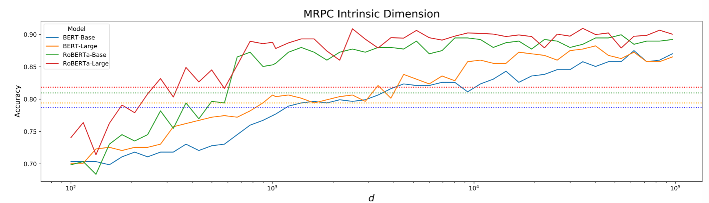

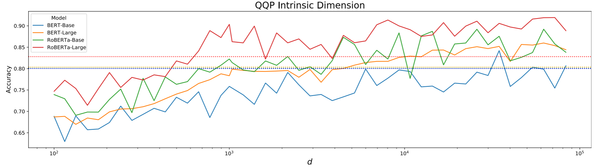

此外，该研究还证明：随着预训练步骤增加，内在维度持续下降；越大的模型，其内在维度也越小。这些研究结果无疑都在说明低秩微调的有效性与前景。

**LoRA**（Low-Rank Adaptation）正是受到上述研究启发，提出了其核心思想：内在维度（或者说内在秩）不仅存在于模型权重中（分别对应上文提到的 $\theta_d$ 和 $\theta_D$），也存在于大语言模型在适应下游任务时，其权重矩阵的变化量 $\Delta W$ 中。

LoRA 认为，预训练好的模型已经包含了足够丰富的通用知识，我们为特定任务做的微调，本质上只是对这些知识进行微小的、有方向性的调整，而这种调整并不需要改变整个权重矩阵的所有参数。这种调整的内在维度其实很低。

下面结合公式来阐述 LoRA 的技术原理。LoRA 调整的参数是 transformer 的线性层参数，主要是 Self-Attention 里的四个权重矩阵 $W_q$、$W_k$、$W_v$、$W_o$ ，以及前馈神经网络层的 $W_{up}$、$W_{down}$，下图展示了 LoRA 在 transformer 内部的微调位置。

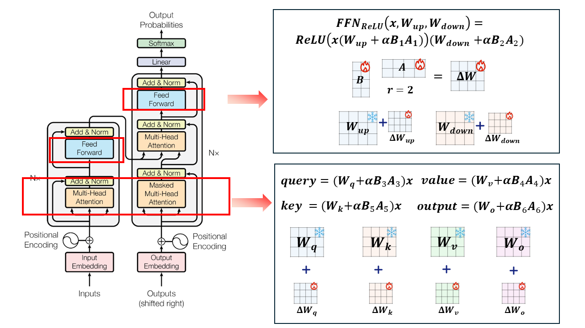

将权重矩阵记为 $W$，$d×d$ 维，输入特征为 $x$。LoRA 初始化两个矩阵 $A$ 和 $B$，作为权重矩阵的变化量，对 $A$ 使用随机高斯初始化，将 $B$ 初始化为 0。$A$ 的维度为 $r×d$ 维，*B* 的维度为 $d×r$ 维。其中 $r$ 是 rank 秩，远小于 $d$ 。

在前向传播的过程中，输出 $h$ 不再是原始权重矩阵 $W_0$，而是加上了 $BAx$，并加入参数 $α$ 缩放 $\Delta Wx$ ，如下式：

$$
h=W_0x+\alpha\Delta Wx=W_0x+\alpha BAx
$$

在参数更新时，LoRA 冻结了 $W_0$ 权重，只更新 $B$ 和 $A$。由于 $B$ 和 $A$ 的低秩特点，这会大大减少参数更新的数量。微调结束后，保留 $A$ 和 $B$ 作为 LoRA 矩阵，推理时用。为了减少推理延迟，可以将 $BA$ 矩阵与 $W_0$ 合并。以 query 值的计算为例，使用 LoRA 权重后，计算方式如下式：

$$
query=(W_q+\alpha BA)x
$$

在 LoRA 原始论文中，将全量微调（FT）、各种 Adapter-tuning 算法，以及 PreLayer 微调算法（prefix-tuning 的变体算法）和 LoRA 算法进行了实验对比。可以看到，LoRA 不仅在可训练参数量（微调参数量）上达到了最小，更是用近千分之一的微调参数量，接近甚至超越了全量微调的效果，获得了所有微调算法的最佳水平。

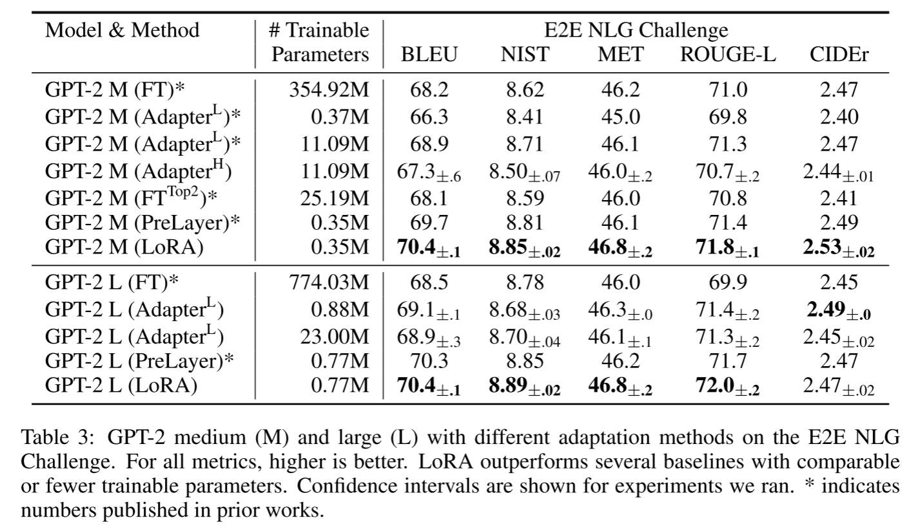

此外，LoRA 也有着非常灵活的特性。根据不同的下游任务，基模型可以随时切换微调好的不同的 $BA$ 矩阵（一个内存开销很小的操作），$BA$ 矩阵即插即用，带来了使用上的灵活性。

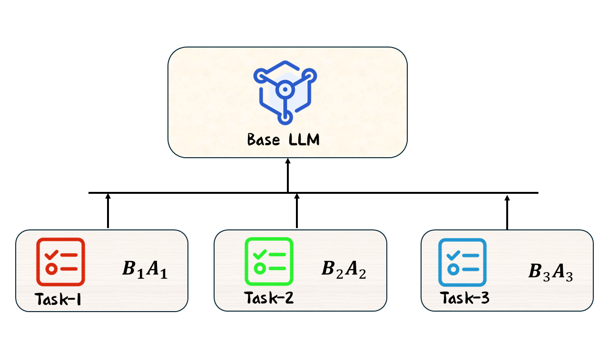

总之，LoRA 的高效性主要来源于低秩分解。通过低秩近似权重变化量，LoRA 能够捕捉到数据的主要变化方向，并在保证模型表达能力的前提下，通过调整少量参数实现对模型的微调。

另外，如何为不同任务选择合适的秩 $r$ 是一个关键问题。实践证明，$r$ 的取值一般为 4 到 64 不等。一般来说简单任务需要的秩不大，而高难度任务需要较高的秩。LoRA 原文对秩 $r$ 的范围也做了一定的实验探究，实验结果是令人惊讶的，即使 $r=1$，微调后模型的能力依旧有着很强的竞争力，这说明了 $\Delta W$ 可能有着非常小的内在秩，这也再次证明了低秩分解的有效性。

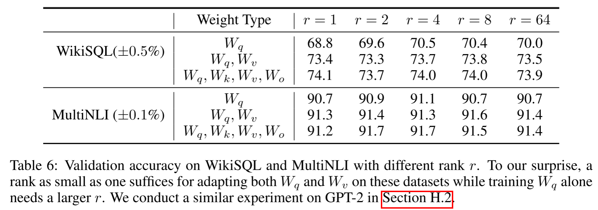

最后，与 Adapter-Tuning 算法相比，LoRA 不需要在模型中引入新的适配器，而是直接对现有的线性层进行调整，这使得 LoRA 的参数效率更高，$BA$ 矩阵与 $W_0$ 合并时，更是不存在推理延迟的问题。与 Prompt-Tuning 算法相比，LoRA 的低秩矩阵分解能够在更深层次上调整模型的表示能力，而不仅仅是影响输入层或局部区域，其微调效果在实践中基本达到了最佳水平。

## 主流 LoRA 算法解读

### QLoRA 算法原理

QLoRA（Quantized Low-Rank Adaptation）在 LoRA 的基础上引入了量化技术，通过量化模型权重，旨在进一步降低大语言模型微调的计算和内存需求。

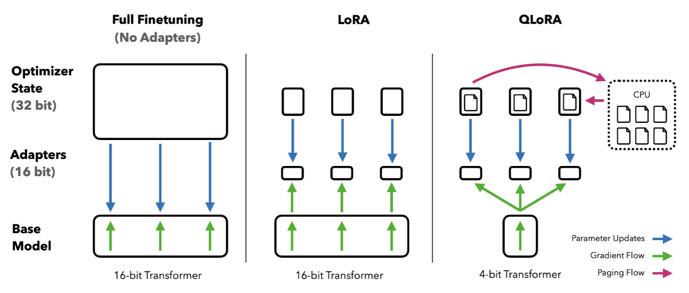

QLoRA 主要引入了三个关键技术：4 位 NormalFloat（NF4）量化、双重量化、分页优化器，以此来实现其目标，下面依次进行解读。

**4 位 NormalFloat（NF4）量化**是 QLoRA 的一个核心技术，旨在通过高效压缩大语言模型的权重来减少内存占用，同时尽量保持模型的性能。为了理解这种量化方式，我们首先需要了解量化的基本原理以及传统量化方法的局限性，然后再深入探讨 NF4 量化的创新之处。

下面是一些常用的浮动精度类型。

| 浮动精度类型 | 位数 | 符号位 | 指数位 | 尾数位 | 用途                 |
| ------------ | ---- | ------ | ------ | ------ | -------------------- |
| FP32         | 32   | 1      | 8      | 23     | 高精度训练，所有计算 |
| FP16         | 16   | 1      | 5      | 10     | 推理，训练           |
| BF16         | 16   | 1      | 8      | 7      | 推理、训练           |
| FP8          | 8    | 1      | 1      | 3      | 推理，低精度任务     |

量化是将浮动精度的权重（例如 FP32 或 FP16）转换为低精度表示（例如 8 位或 4 位整数）的过程。它的主要目标是减少存储和计算成本，尤其是对于大参数量的神经网络模型而言，量化是减小内存占用和加速推理的重要手段。如下式，展示了传统量化方法如何将 FP32 的权重值量化为 8 位整数（Int8）类型。
$$
\mathbf{X}^{\mathrm{Int}8}=\mathrm{round}\left(\frac{127}{\mathrm{absmax}(\mathbf{X}^{\mathrm{FP3}2})}\mathbf{X}^{\mathrm{FP3}2}\right)=\mathrm{round}(c^{\mathrm{FP3}2}\cdot\mathbf{X}^{\mathrm{FP3}2})
$$
按照该公式，当输入 $\mathbf{X}^{\mathrm{FP32}}=[2,3,4,1000]$，则 $\mathrm{absmax}(\mathbf{X}^{\mathrm{FP3}2})=\max(|2|,|3|,|4|,|1000|)=1000$，那么 $c^{\mathrm{FP32}}=\frac{127}{1000}=0.127$，量化结果 $\mathbf{X}^{\mathrm{Int}8}=[0,0,1,127]$。其中 round 为四舍五入操作。

可以发现，这种方法的问题是，如果数据中有特别大的数（一个离群值），它会占据大部分的“量化空间”，导致其他较小的数值无法好好利用这些空间。在示例中，离群值（1000）在量化过程中占用了最大量化范围，而其他较小的值（2, 3, 4）则被压缩成了较小的整数，造成了精度的损失。

从更深层次进行分析，在我们的例子中，离群值 1000 将整个量化范围从 [-4, 4] 极大地拉伸到了 [-1000, 1000]。为了用 127 个刻度划分这个巨大的范围（将 [-1000, 1000]划分为 128 块，实现到[0,127]的映射），量化的步长（或说精度）被强制设定为一个很大的值（即 1000 / 127 ≈ 7.87）。

因为这个粗糙的步长被**均匀**地应用在所有数值上，它无法分辨出 2, 3, 4 之间微小的差异，因为这些差异远小于 7.87 这个步长，这导致 2、3、4 被划分到一个区间块内，从而均映射为 0。最终，大部分数值密集区域的细节被这个为了迁就离群值而设定的、粗糙且统一的“标尺”所抹平，导致了严重的信息损失。

对于标准的 4 位量化，这种问题则更为严重，因为压缩比更高，量化误差也更大。因此，如何在保证量化后低内存占用的同时，减少性能损失，成为了一个关键问题。

针对上述问题，QLoRA 使用了**NF4 技术**。**NF4**的核心思想是**分位数量化**。它不再使用均匀分布的量化刻度，而是根据数据的真实分布来确定量化刻度的位置。

NF4 观察到，预训练 LLM 的权重往往**近似**服从一个**标准正态分布 **N(0, 1)。基于这个观察，NF4 的目标是构建一个 4-bit 的数据类型，使得它能最好地表示标准正态分布。具体来说，一个 4-bit 数据类型有 $2^4=16$ 个可能的值，NF4 的目标就是依据等概率（而非等步长）的原则，选定 x 轴上的 15 个刻度，将整个正态分布划分为等概率的 16 块，每块的期望值（中位数或边界均值）就成为我们的一个量化点。非均匀但高精度的将原始数据范围映射到 NF4 上。

这样一来，在数据密集的区域（靠近 0 的地方），量化点会非常密集；在数据稀疏的区域（远离 0 的尾部），量化点会变得稀疏。这恰好匹配了权重的分布特性，从而实现了信息论上的最优表示。

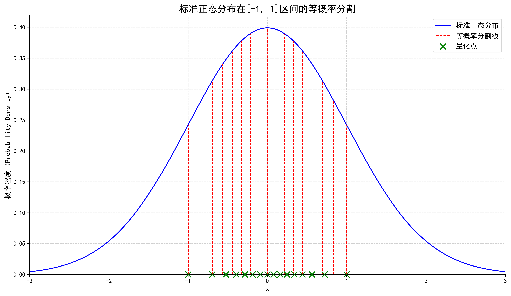

为了统一量化标准，针对**标准正态分布**，NF4 设定了一个“码本”，仅在[-1,1]区间上进行等概率分割与数值映射。NF4 将这 16 个量化点规定如下，限定在[-1,1]数据密集区间。因此，参数块在量化前需要进行先归一化操作，将原始参数缩放到[-1,1]区间。

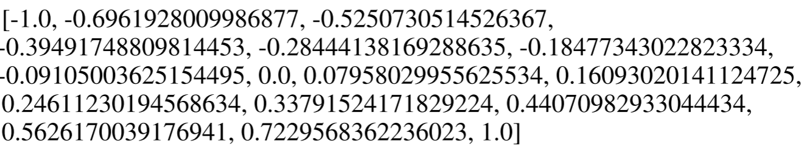

现在我们来看 QLoRA 具体是如何将一个模型的权重量化到 NF4 的。以 BF16 到 4-bit 的量化为例，这个过程是**逐块**进行的。NF4 技术会将权重张量其分成若干个小块，通常一个块的大小是 64 个参数。对每一个块，执行以下操作：

首先进行归一化。QLoRA 沿用**绝对值最大量化**的方法来做归一化。在当前块中，找到所有权重绝对值的最大值，记为 $c$。这个 $c$ 通常用一个更高精度的格式（FP32）存储起来。将块内的所有权重 $W$ 都除以这个绝对值最大值 $c$，即 $W_{norm}=W/c$。这样，归一化后的权重 $W_{norm}$ 的范围就被缩放到了 [-1, 1] 区间内。

值得注意的是，每个块都有自己的缩放因子 $c$，这使得量化能够自适应地处理模型中不同层、不同部分权重的数值范围差异。

此外，还有一个关键问题尚待阐明：既然原始权重参数并非严格的标准正态分布（仅近似分布），为什么不进行真正的标准化（即除以标准差 $\sigma$），而是采用绝对值最大量化？答案在于**计算效率与效果之间的权衡**。虽然理论上最精确的方法是计算每个块的标准差 $\sigma$ 并进行标准化，但这对于数百万个权重块来说，计算开销是巨大的。

而绝对值最大量化提供了一个极为高效的近似方案。对于近似正态的分布，其绝对值最大值 $c$ 与其标准差 $\sigma$ 是强相关的。因此，将权重除以 $c$，在效果上高度近似于将其除以一个常数倍的 $\sigma$。这个操作虽然不能将方差精确地变为 1，但它以极低的计算成本，成功地将所有不同尺度的权重分布“对齐”到了我们预设的统一码本的工作条件（**标准正态分布**）及范围（**[-1,1]**）内。

接着，对于块内每一个归一化后的权重 $W_{norm}$，寻找其最近的量化点。在预先设定好的 16 个 NF4 值中，存储那个最接近的 NF4 值的索引（一个 0 到 15 之间的整数，正好用 4-bit 表示）。

最终，一个有着 64 个 16-bit 权重参数（64 × 16 bit = 1024 bit）的块，被转换成 64 个 4-bit 索引 (64 × 4 bit = 256 bit，1 个 32-bit 的缩放因子 $c$，总计：256 + 32 = 288 bit，从而完成了量化。

在模型进行前向传播计算时，需要将 4-bit 的权重恢复成近似的原始值。这个**反量化**过程非常简单：首先根据存储的 4-bit 索引（0-15）从 NF4 码本中查找出对应的高精度浮点值（例如，索引为 2，查找到-0.5251），然后将该值乘以对应的缩放因子 $c$，即 $W_{approx}=NF4_{value}×c$ 。

然而，虽然每个块只有一个缩放因子 $c$，但一个巨大的模型（如 65B 参数）会有数百万个这样的块，那么这些缩放因子本身也会占用大量内存，可以达到几百 MB。

QLoRA 为了进一步压缩内存占用，使用**双重量化**技术，对这些缩放因子 $c$ 再进行一次量化。具体来说，将第一级的缩放因子 $c_1$（FP32）再进行分块（每块 256 个 $c_1$），然后对这些块进行第二级量化，得到第二级的缩放因子 $c_2$（FP32）和量化后的 $c_1$（FP8）。这进一步将每个参数的平均比特数从约 4.5 bit（4+32/64）降低到约 4.127 bit（4+8/64+32/(64×256)），节省了更多内存。

另外，在微调过程中，Adam 等优化器会为每个可训练参数维护状态，如动量和方差，这会消耗大量 GPU 显存。QLoRA 利用 NVIDIA 统一内存的特性，采用**分页优化器**的技术，将不在当前计算中使用的优化器状态“分页”到 CPU 内存中，在需要时再调回 GPU。这大大降低了训练过程中的显存峰值，防止了显存溢出。

最后，将上述量化技术与 LoRA 结合。在前向传播时，为了在计算时恢复模型的精度，并与高精度的 LoRA 适配器权重进行数学运算，需要进行双重反量化（doubleDequant）操作。
$$
\mathbf{H}^{\mathrm{BF}16}=\mathbf{X}^{\mathrm{BF}16}\text{doubleDequant}(c_1^{\mathrm{FP}32},c_2^{\mathrm{FP8}},\mathbf{W}^{\mathrm{NF}4})+\mathbf{X}^{\mathrm{BF}16}\mathbf{B}^{\mathrm{BF}16}\mathbf{A}^{\mathrm{BF}16},
$$

$$
\text{doubleDequant}(c_1^{\mathrm{FP32}},c_2^{\mathrm{FP8}},\mathbf{W}^{\mathrm{NF4}})=\mathrm{dequant}(\mathrm{dequant}(c_1^{\mathrm{FP32}},c_2^{\mathrm{FP8}}),\mathbf{W}^{\mathrm{NF4}})=\mathbf{W}^{\mathrm{BF16}}
$$

QLoRA 的效果是非常惊人的，它成功的在单个 48GB GPU 上微调了 65B 参数的模型，同时几乎保留了完整的 16 位微调任务性能。

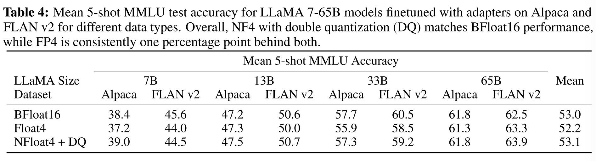

### AdaLoRA 算法原理

在 LoRA 取得巨大成功后，研究者们发现其存在一个固有的局限性：**“一刀切”的资源分配**。标准的 LoRA 为模型中所有被适配的权重矩阵（如 $W_q$，$W_k$，$W_v$ 等）分配了完全相同的秩 $r$。

这种均匀分配策略忽略了一个关键事实：在针对特定下游任务进行微调时，不同层、不同模块内的权重矩阵其重要性并非均等。某些矩阵可能需要更丰富的表达能力（更高的秩）来捕捉任务关键信息，而另一些矩阵可能只需微小的调整（更低的秩）即可，甚至保持不变。

如下图，论文研究者比较了使用相同数量的可训练参数微调特定权重矩阵或层时 LoRA 的性能。图 1a 显示，微调前馈网络（FFN）比自关注模块实现了更好的性能。此外，从图 1b 可以看出，顶层的权重矩阵比底层的权重矩阵更重要。

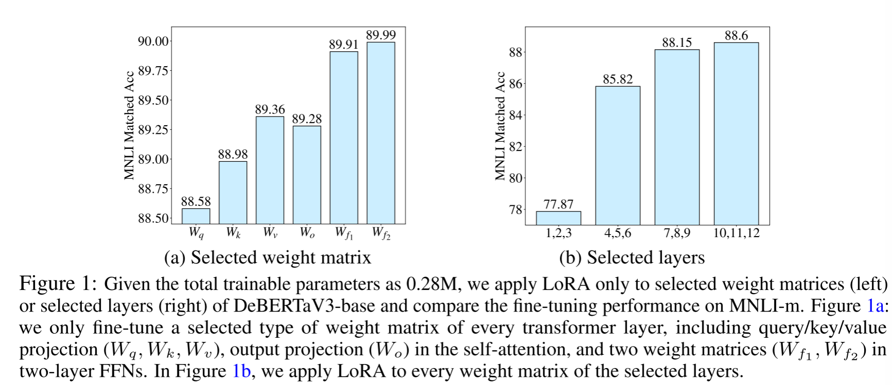

显然，将宝贵的参数预算平均分配，就像给一个偏科的学生在所有科目上安排完全相同的复习时间一样，效率不高。这不仅可能在关键模块上“投入不足”，导致性能瓶颈，也可能在次要模块上“投入过剩”，造成参数浪费和过拟合风险。

针对这一问题，**AdaLoRA（Adaptive Budget Allocation for LoRA）**应运而生。其核心思想一针见血：将有限的参数预算（budget）进行智能的、自适应的分配，把更多的可训练参数动态地、不均匀地赋予那些在微调过程中被证明“更重要”的权重矩阵。通过这种精细化的资源调控，AdaLoRA 旨在用更少的总参数量，达到甚至超越标准 LoRA 的性能。

AdaLoRA 的实现主要依赖三大核心技术：基于 SVD 的参数化、重要性评分机制及剪枝策略，以及动态的全局预算调度器。

AdaLoRA 整体算法流程如下，接下来我们进行细致的展开。

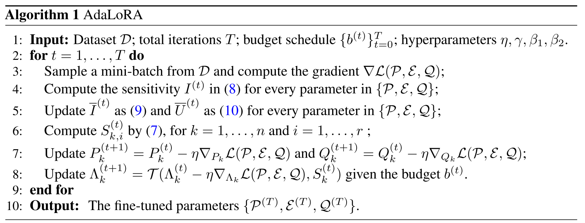

基于奇异值分解（Singular Value Decomposition ，SVD）的参数化 ：与 LoRA 不同， AdaLoRA 采用了另一种受 SVD 启发的参数化形式。它将增量 $\Delta W$ 分解为左右正交矩阵 $P$ 和 $Q$，以及奇异值对角矩阵 $\Lambda$ 。

LoRA 将权重增量 $\Delta W$ 分解为两个低秩矩阵的乘积：$\Delta W = BA$。这种分解虽然高效，但对于动态调整秩、进行参数剪枝却不够理想。如果要将秩从 $r$ 降到 $r-1$，就需要从 $B$ 中移除一列，并从 $A$ 中移除对应的一行，这是一种“结构性”的移除，被剪掉的参数信息完全丢失。

AdaLoRA 借鉴了**奇异值分解（SVD）** 的思想，采用了另一种参数化形式。它将权重增量 $\Delta W$ 分解为三个矩阵的乘积：
$$
W=W^{(0)}+\Delta W=W^{(0)}+P\Lambda Q
$$

其中，$P$ 和 $Q$ 是**正交矩阵**，代表了权重更新的“方向”；$\Lambda$ 是一个**对角矩阵**，其对角线上的元素是奇异值，代表了各个方向上的“重要性”或“量级”。在训练中，我们只更新 $P, \Lambda, Q$。

这种 SVD 参数化带来了两大核心优势：

1. **精确的秩控制**：增量矩阵 $\Delta W$ 的秩直接由对角矩阵 $\Lambda$ 中非零奇异值的数量决定。我们只需将不重要的奇异值置为零，就能精确、平滑地降低矩阵的有效秩，操作非常简单。
2. **非破坏性剪枝**：在 LoRA 中，被剪掉的参数完全丢失。而在 AdaLoRA 中，剪枝操作只作用于奇异值（将其置为零），但对应的奇异向量（$P$ 和 $Q$ 中的行/列）依然保留并参与后续训练。这意味着，如果一个被剪掉的分量在后续训练中被证明是重要的，模型仍然有机会通过梯度更新重新“激活”它（使其奇异值变为非零）。这种机制使得训练过程更加稳定，避免了因误剪关键参数而导致的性能永久性损伤。

有了 SVD 这一精细的控制工具，接下来的关键问题就是：如何衡量每个 SVD 分量的**重要性**，以决定哪些 SVD 分量保留，哪些 SVD 分量被剪枝？

AdaLoRA 的设计非常巧妙。它将剪枝的基本单元定义为由一对奇异向量和一个奇异值构成的“三元组” $\{P_{k,i}, \Lambda_{k,i}, Q_{k,i}\} $（其中 $k$ 代表第 $k$ 个权重矩阵，$i$ 代表第 $i$ 个奇异值分量）。一个三元组的重要性 $S_{k,i}$ 被定义为：

$$
S_{k,i}=s(\lambda_{k,i})+\frac{1}{d_1}\sum_{j=1}^{d_1}s(P_{k,ji})+\frac{1}{d_2}\sum_{j=1}^{d_2}s(Q_{k,ij})
$$

这个公式意味着，一个分量的重要性不仅取决于其奇异值 $\lambda_{k,i}$ 的大小，还综合考虑了其对应的左右奇异向量中所有参数的平均重要性。

那么，单个参数 $w$ 的重要性 $s(w)$ 又该如何计算呢？简单地使用梯度大小或权重大小都存在局限性。AdaLoRA 采用了一种更鲁棒的、考虑不确定性的敏感度分数。

- **敏感度 $I(w)$**：首先，定义参数的敏感度为“权重与梯度的乘积的绝对值”，即 $I(w_{ij}) = |w_{ij} \cdot \nabla_{w_{ij}}\mathcal{L}|$。（$w_{ij}$ 表示权重矩阵第 $i$ 行第 $j$ 列的参数）这个值直观地近似了如果将该参数 $w_{ij}$ 置为零，模型损失 $\mathcal{L}$ 会发生多大的变化。敏感度越高，参数越重要。
- **平滑与不确定性**：由于单步的梯度充满噪声，直接使用 $I(w)$ 会很不稳定。因此，AdaLoRA 引入了**指数移动平均（EMA）** 来平滑敏感度 $\overline{I}^{(t)}$，得到一个更稳定的长期重要性评估。同时，它还计算了敏感度的**不确定性项** $\overline{U}^{(t)}$，用于衡量近期敏感度的波动程度。波动越大，说明模型对该参数的学习还“没稳定下来”，该参数可能仍有潜力。
- **最终分数 $s(w)$**：最终，单个参数的重要性被定义为平滑后的敏感度与不确定性的乘积：$s^{(t)}(w_{ij})=\overline{I}^{(t)}(w_{ij})\cdot\overline{U}^{(t)}(w_{ij})$。这个设计使得那些**持续重要（$\overline{I}$ 大）且学习尚不稳定（$\overline{U}$ 大）** 的参数获得最高的分数，从而在剪枝中被优先保留。

在训练过程中，AdaLoRA 会周期性地根据当前预算 $b^{(t)}$  ，计算**三元组重要性分数**，保留分数最高的 $b^{(t)}$ 个三元组参数（保持它们的奇异值不变） ，并将其余三元组的奇异值设为零，仅对非零奇异值的三元组应用梯度更新。

如果从一开始就用很低的预算进行训练，很多有潜力的参数分量可能在“热身”之前就被错误地剪掉。反之，如果剪枝过程过于突兀，则可能导致训练过程剧烈震荡。为此，AdaLoRA 设计了一个全局预算调度器，优雅地管理整个训练过程中的参数预算。该调度策略分为三个阶段：

1. **热身阶段（Warm-up）**：训练开始时，设置一个比最终目标预算 $b^{(T)}$ **更高**的初始预算 $b^{(0)}$（例如 1.5 倍）。这允许模型在初期探索更广阔的参数空间，让更多的奇异值分量参与训练，从而使后续的重要性评分更加准确可靠。
2. **预算削减阶段（Budget Pruning）**：热身结束后，预算 $b^{(t)}$ 并不会骤降，而是采用一个**三次函数** 在一定步数内从初始预算 $b^{(0)}$ 平滑地降低到最终的目标预算 $b^{(T)}$。这种平滑过渡有效避免了训练的突然震荡。
3. **微调阶段（Fine-tuning）**：当预算达到目标 $b^{(T)}$ 后，预算分配方案基本固定下来，模型将保持此预算不变，继续进行标准的微调训练，直至收敛。

在自然语言生成任务上，AdaLoRA 使用与 LoRA 相同的可训练参数量，实现了在多个 benchmark 上对 LoRA 性能的超越，在实验中证明了理论的有效性。

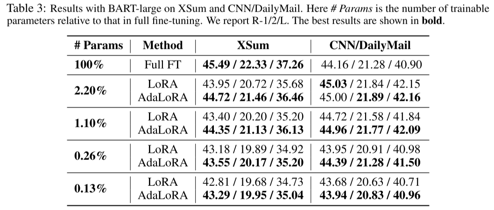

### DoRA 算法原理

虽然 LoRA 及其变体（如 AdaLoRA）在参数高效微调领域取得了巨大成功，但实践中，它们与全参数微调（Full Fine-tuning, FT）之间仍存在一定的差距。**DoRA**(Weight-Decomposed Low-Rank Adaptation) 的提出，正是为了深入探究并弥补这一差距。它没有将性能差距简单归因于参数量不足，而是从一个全新的视角出发，揭示了 LoRA 与 FT 在学习机制上的根本差异。

DoRA 的作者们首先提出了一个创新的分析方法：**权重分解（Weight Decomposition）**。他们将任意一个权重矩阵 $W$ 分解为两个核心部分：

1. **量级 (Magnitude)**：用一个向量 $m$ 表示，代表权重矩阵中每一列的“强度”或“大小”。计算方式为 $m=||W||_{c}$（对矩阵 $W$ 的每一列求其 L2 范数）
2. **方向 (Direction)**：用一个矩阵 $V$ 表示，代表权重矩阵中每一列的“指向”。计算方式为 $V=W/||W||_c$。

通过这种分解，任何权重的更新都可以被看作是其量级和方向的改变。基于此，研究者们对比了在微调过程中，FT 和 LoRA 两种方法的**量级变化量 (ΔM)** 与**方向变化量 (ΔD)** 之间的关系。

他们的发现是惊人的，并直指 LoRA 的内在局限性：

- **LoRA 的学习模式**：如下图（中）所示，LoRA 的ΔM 与ΔD 呈现出**强烈的正相关**。这意味着，当 LoRA 试图大幅改变权重的方向时，其量级也必须随之大幅增加；反之亦然。量级和方向的更新被紧紧地“捆绑”在了一起。
- **FT 的学习模式**：相比之下，FT（图左）则表现出**负相关**。这意味着 FT 可以非常灵活地进行调整：它可以只做微小的方向变动，但进行显著的量级调整；也可以大幅改变方向，而量级基本保持不变。

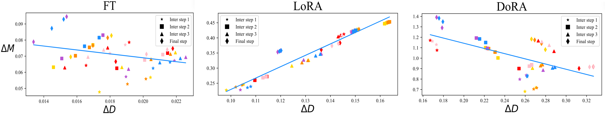

这种**解耦**的能力，正是 FT 学习能力更强的关键所在。预训练模型本身已包含丰富的知识，下游任务的微调往往只需要对这些知识进行精细的“重新组合”和“强度调整”，而非颠覆性的改变。FT 的解耦能力恰好满足了这一需求，而 LoRA 的“捆绑式”更新则限制了其微调的灵活性和精度。

理解了问题的根源后，DoRA 的解决方案由此提出：在微调中显式地解耦量级和方向的更新，并让 LoRA 专注于其更擅长的部分—方向微调。

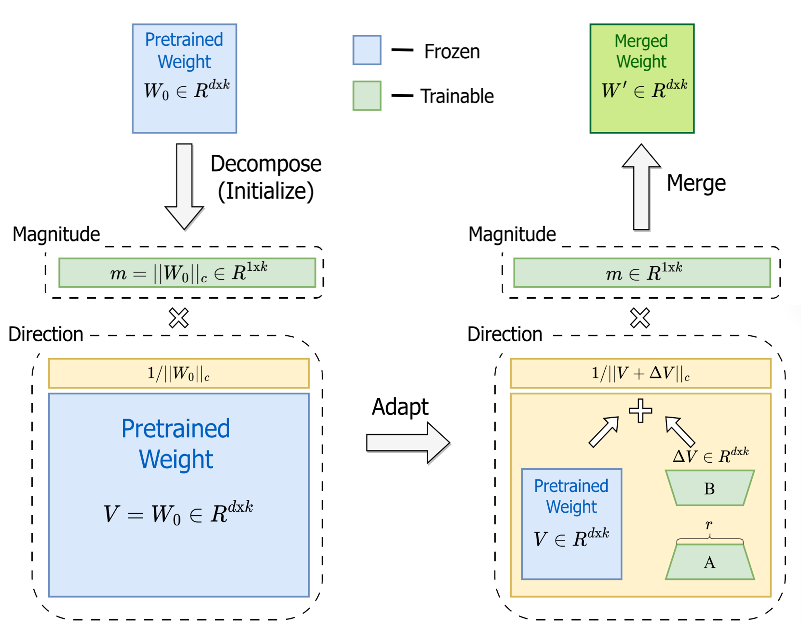

DoRA 具体实现如下：

1. **初始化**：对于一个预训练权重矩阵 $W_0$，首先将其分解为初始的量级 $m=||W_0||_c$ 和方向 $V=W/||W||_c$。 

2. **参数化更新**：在微调时，DoRA 引入两组独立的可训练参数：

   **量级向量 m**：一个与权重矩阵列数相同大小的可训练向量，直接用于学习量级的变化。

   **方向更新 ΔV**：沿用 LoRA 的方式，使用两个低秩矩阵 $B$ 和 $A$ 来表示方向上的增量，即 $\Delta V=BA$。

3. **前向传播**：最终微调后的权重 $W^{'}$ 的计算公式为：

$$
W^{\prime}=\underline{m}\frac{V+\Delta V}{||V+\Delta V||_c}=\underline{m}\frac{W_0+\underline{BA}}{||W_0+\underline{BA}||_c}
$$

其中，下划线部分 $m$、$B$、$A$ 是可训练参数。

通过这种设计，DoRA 成功地将量级更新（由 $m$ 负责）和方向更新（由 $BA$ 负责）彻底分开，将复杂的权重更新任务分解为两个更简单的子任务（调整量级和调整方向），使得训练过程更加稳定和高效，并且释放了模型的微调潜力，在众多任务上都取得了超越标准 LoRA 的性能，显著缩小了与全参数微调的差距。

### LoRA++ 算法原理

### MoE_LoRA 算法原理

## LoRA 微调应用场景

## 多模态应用

现有多模态模型，依赖一个独立的、预训练的视觉模型（如 ViT）来提取图像特征。

推理时，ViT 和连接器是额外且独立的模块，这增加了计算成本和内存占用。

工作流程是串行的，LLM 必须等待 ViT 完全处理完图像才能开始工作。

**VoRA**（Vision as LoRA） 提出了一种颠覆性的解决方案：不再依赖外部视觉专家，而是让 LLM 自己“学会”看图。

在 LLM 的每一层线性层中，都加入专门用于处理视觉信息的低秩适配器（LoRA）。

在训练时，冻结 LLM 的原始参数，只训练这些新加入的 LoRA 层和轻量级的图像嵌入层,从而将“视觉”能力，直接集成到 LLM 内部。

将语言能力（在冻结的 LLM 中）和新学习的视觉能力（在 LoRA 层中）解耦，从而避免了直接训练整个模型时可能出现的训练不稳定或“灾难性遗忘”问题。

## 总结与思考

!!!!!!!!!!补充

## 参考与引用

- Aghajanyan, et al. Intrinsic dimensionality explains the effectiveness of language model fine-tuning，https://arxiv.org/abs/2012.13255
- LoRA：Low-Rank Adaptation of Large Language Models，https://arxiv.org/abs/2106.09685 
- QLoRA: Efficient finetuning of quantized llms，https://arxiv.org/abs/2305.14314
- AdaLoRA：Adaptive Budget Allocation For Parameter-Efficient Fine-Tuning， https://arxiv.org/abs/2303.10512
- DoRA：Weight-Decomposed Low-Rank Adaptation， https://arxiv.org/abs/2402.09353
- **Mixture of LoRA Experts（ICLR,2024）**
- **LoraHub: Efficient Cross-Task Generalization via Dynamic LoRA Composition（COLM，2024）**
- **“Moelora: An moe-based parameter efficient fine-tuning method for multi-task medical applications**
- **Pushing Mixture of Experts to the Limit: Extremely Parameter Efficient MoE for Instruction Tuning（ICLR，2024）**
- VoRA：Vision as LoRA， https://arxiv.org/abs/2503.20680

LLaVA-MoLE: Sparse Mixture of LoRA Experts for Mitigating Data Conflicts in Instruction Finetuning MLLMs（非顶）

MoELoRA: Contrastive Learning Guided Mixture of Experts on Parameter-Efficient Fine-Tuning for Large Language Models(非顶)

