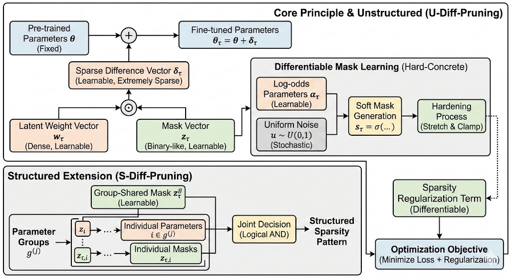
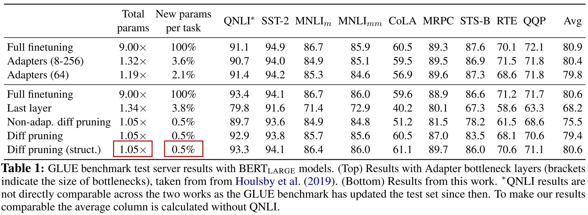

<!--Copyright © ZOMI 适用于[License](https://github.com/Infrasys-AI/AIInfra)版权许可-->

# 06.Selective 微调算法

> Author by: 李亚鹏

## 引言

在大语言模型（Large Language Model，LLM）参数高效微调（Parameter-Efficient Fine-Tuning，PEFT）的版图中，以Adapter 和 LoRA为代表的方法无疑占据了中心位置。它们通过向预训练模型中**添加**少量可训练参数（如适配器模块或低秩矩阵），在冻结绝大部分原始权重的同时，实现了对下游任务的高效适配。这种“加法式”微调范式在效果和效率之间取得了出色的平衡，已成为行业标准。

然而，这些主流方法共享一个共同的、往往被忽视的假设：微调的重点在于**新增的参数**，而模型庞大的原始权重库主要扮演一个被动的、提供基础知识的角色。这引出了一个根本性的问题：在数以十亿计的预训练参数中，难道就没有一部分参数，在经过微调后，能比新添加的模块更高效地适应新任务吗？换句话说，我们是否必须通过“加法”来解决问题？

为了回答这个问题，一个新的微调范式——**选择性微调（Selective Fine-Tuning）**——应运而生。它彻底颠覆了“加法”思路，转而提出一种“减法”或“聚焦”的哲学。其核心思想是：**预训练模型本身就是一个巨大的、可塑的参数宝库，我们无需额外添加参数，只需智能地识别出其中对新任务最关键、最敏感的一小部分（通常少于1%）原始权重，并集中所有计算资源仅对它们进行更新。**

这种范式将优化的核心从“在哪里添加新参数”转移到了“更新哪些已有参数”。它不仅有望实现更高的参数效率（因为不需要存储额外的模块），更重要的是，它可能更深刻地触及模型知识的内在结构，通过微调模型内部最相关的神经回路来适应新任务。

本节将深入探讨选择性微调领域的几大开创性算法。我们将首先解析 Diff-Pruning 家族，看它们如何通过学习稀疏的“差分向量”来实现参数的选择。随后，我们将探讨 SARA 这一巧妙利用“无效参数”进行微调的独特方法。最后，我们将详细解读集大成者——SPT，看它是如何基于参数“敏感度”动态分配结构化与非结构化微调预算，从而将选择性微调的效果推向新的高度。

## Diff-Pruning算法原理

Diff-Pruning 是选择性微调领域的奠基性工作之一。它没有采用 LoRA 等方法中“添加”新参数的范式，而是提出了一种“修正”的思想。其顶层设计思想是：将对特定任务 $\tau$ 的适配，看作是在原始预训练参数 $\theta$ 的基础上，学习一个极其稀疏的**差分向量** (Diff Vector) $\delta_\tau$。微调后的参数即为：
$$
\theta_\tau = \theta + \delta_\tau
$$
这个公式是整个算法的基础。它将庞大的、共享的通用知识库（由 $\theta$ 代表）与为新任务所需的精简、专用知识（由 $\delta_\tau$ 代表）清晰地分离开来。成功的关键在于对 $\delta_\tau$ 施加极端的稀疏性约束，使其绝大多数元素都为零，只有极少数非零元素代表了被选中进行更新的参数。

这一设计，使得它同时实现了成本与效果上的双重优化：一个稀疏的差分向量不仅极大地压缩了存储开销，更重要的是，它将有限的更新资源聚焦于对新任务最关键的少数参数上，从而以最小的扰动换取了最有效的性能适配。

因此，Diff-Pruning 面临的核心技术挑战便转化为：**如何才能以可微的方式，学习到一个最优的、稀疏的差分向量？** 为了解决这个问题，该系列工作演进出了两种主要的实现路径：非结构化剪枝（U-Diff-Pruning）和结构化剪枝（S-Diff-Pruning）。

（原始论文没有框架图，先让AI生成了一个草图）

### U-Diff-Pruning: 学习非结构化稀疏掩码

**U-Diff-Pruning** (Unstructured Diff-Pruning) 的核心目标是学习一个按元素独立的稀疏差分向量，以实现对预训练模型参数的选择性更新。该方法直面了在优化中直接使用 L0 范数（$\|\delta_\tau\|_0$）作为稀疏性惩罚项所带来的不可微性挑战。为了克服这一障碍，U-Diff-Pruning 设计了一套基于重参数化和连续松弛的框架，从而将一个离散的组合优化问题转化为一个可以通过标准梯度下降方法求解的连续优化问题。

算法的第一步是对差分向量 $\delta_\tau$ 进行分解，将其重参数化为一个潜在权重向量 $\mathbf{w}_\tau$ 和一个掩码向量 $\mathbf{z}_\tau$ 的逐元素乘积：
$$
\boldsymbol{\delta}_\tau = \mathbf{z}_\tau \odot \mathbf{w}_\tau
$$
这一分解至关重要，因为它成功地将参数的**更新值**（由 $\mathbf{w}_\tau$ 决定）与**是否更新**的决策（由 $\mathbf{z}_\tau$ 决定）分离开来。在此定义下，$\mathbf{w}_\tau$ 是一个稠密且可学习的向量，它为模型中的每一个参数都提供了一个潜在的更新量级和方向。而 $\mathbf{z}_\tau$ 则扮演着门控的角色，理想情况下它是一个二元向量，其元素为 0 或 1，用于精确地选择哪些潜在更新应被采纳。因此，学习稀疏差分向量的挑战被完全转移到了如何以可微的方式学习这个二元掩码 $\mathbf{z}_\tau$ 上。

为解决掩码 $\mathbf{z}_\tau$ 的不可微性，算法引入了 **Hard-Concrete 分布**，这是一种对伯努利分布的连续松弛。该技术利用了重参数化技巧，使得从一个概率分布中采样的过程变得可导。具体实现上，不再直接学习离散的掩码，而是为每个掩码元素引入一个可学习的、连续的对数几率参数 $\alpha_{\tau,i}$。这个 $\alpha_{\tau,i}$ 隐式地编码了对应参数被选中的概率。为了引入必要的随机性以进行有效探索，算法从一个固定的、无参数的均匀分布 $U(0,1)$ 中采样一个随机噪声变量 $\mathbf{u}$。随后，通过一个确定性函数将可学习的 $\boldsymbol{\alpha}_\tau$ 和随机噪声 $\mathbf{u}$ 结合，生成一个在 $(0, 1)$ 开区间内连续变化的**软**掩码 $\mathbf{s}_\tau$：
$$
\mathbf{s}_\tau = \sigma(\log\mathbf{u} - \log(1-\mathbf{u}) + \boldsymbol{\alpha}_\tau)
$$
这里的$\log\mathbf{u} - \log(1-\mathbf{u})$是将均匀分布变量转换为逻辑分布变量的标准方法。经过 Sigmoid 函数 $\sigma$ 的作用，$\mathbf{s}_\tau$ 构成了对伯努利变量的连续、可微的近似。然而，由于 $\mathbf{s}_\tau$ 的值域无法触及 0 或 1 的边界，它本身无法产生精确的零值，因而无法实现真正的参数剪枝。

为了克服**软**掩码的这一局限性，算法对其进行**硬化**处理。此过程包含一个拉伸-裁剪（stretch-and-clamp）操作。首先，通过一个线性变换将 $\mathbf{s}_\tau$ 的值域从 $(0, 1)$ 拉伸到一个更宽的、严格包含 $[0, 1]$ 的区间 $(l, r)$（其中 $l<0, r>1$）。这一步的目的是将原先集中在 0 和 1 附近的概率密度推向区间的外部。随后，通过一个裁剪函数将结果限制在 $[0, 1]$ 闭区间内（区间外部的值均被限制为0或1）：
$$
\bar{\mathbf{s}}_\tau = \mathbf{s}_\tau \times (r-l) + l \quad \quad \mathbf{z}_\tau = \min(\mathbf{1}, \max(\mathbf{0}, \mathbf{\bar{s}}_\tau))
$$
这个硬化步骤是整个设计的关键：它使得当 $\mathbf{s}_\tau$ 的值趋近于 0 或 1 时，最终的掩码 $\mathbf{z}_\tau$ 能够取到**精确的 0 或 1**，从而实现了真正的稀疏性。同时，由于在 $(0, 1)$ 区间内梯度为常数，而在区间外梯度为零，整个函数仍然是几乎处处可导的，保留了梯度传播的能力。

通过上述一系列重参数化和松弛操作，原优化目标中不可导的 L0 正则项被其在 Hard-Concrete 分布下的可微闭式期望所替代。这使得整个目标函数完全可微，并能够进行端到端的优化：
$$
\min_{\boldsymbol{\alpha}_\tau,\mathbf{w}_\tau}\mathbb{E}_{\mathbf{u}\sim U[\mathbf{0},\mathbf{1}]}\left[L(\mathcal{D}_\tau,f_\tau,\boldsymbol{\theta}+\mathbf{z}_\tau\odot\mathbf{w}_\tau)\right]+\lambda\sum_{i=1}^d\sigma\left(\boldsymbol{\alpha}_{\tau,i}-\log\frac{-l}{r}\right)
$$
该目标函数由两部分组成：第一项是任务损失的期望；第二项是可微的稀疏性正则项，它直接惩罚每个掩码元素被激活的概率。通过最小化这个联合目标，模型能够协同学习潜在的更新值 $\mathbf{w}_\tau$ 和控制稀疏掩码生成的概率参数 $\boldsymbol{\alpha}_\tau$，最终在适应新任务的同时，自适应地学习出一个最小化的、高效的参数更新子集。

### S-Diff-Pruning: 引入结构化稀疏性

U-Diff-Pruning 独立地决定每个参数的去留，这会产生一种“椒盐式”的稀疏模式，即被剪枝的参数零散地分布在整个模型中。然而，现代神经网络的参数天然具有**结构性**（例如，一个完整的权重矩阵、一个注意力头、或一个偏置向量）。非结构化的稀疏模式虽然灵活，但往往难以利用现代硬件（如GPU）进行有效加速，并且可能破坏模型内部的局部计算结构。

**S-Diff-Pruning** (Structural Diff-Pruning) 正是为解决这一问题而提出的结构化拓展。其核心思想是，参数的剪枝决策不应在孤立的单个参数层面做出，而应在预定义的**参数组**层面进行，实现“共进退”。这鼓励模型将整个参数块（如某个注意力头的查询权重矩阵）完整保留或完整剪枝，从而得到更加规整、对硬件更友好的稀疏模式。

为了实现这一目标，S-Diff-Pruning 在 U-Diff-Pruning 的基础上，引入了一个额外的、**组级别**的共享掩码。具体来说，其技术实现如下：
1.  **参数分组**：首先，将模型的所有参数根据其内在结构划分为 $G$ 个组。例如，一个 Transformer 层中的 $W_q$ 矩阵可以是一个组，其对应的偏置向量是另一个组。
2.  **两级掩码机制**：除了为每个参数 $i$ 保留一个独立的掩码 $z_{\tau,i}$（及其对应的学习参数 $\alpha_{\tau,i}$）之外，再为每个参数组 $g(j)$ 引入一个**组共享掩码** $z_\tau^g$（及其学习参数 $\alpha_\tau^g$）。
3.  **联合决策**：一个参数最终被激活（即其差分值非零），当且仅当它**自身**的掩码和其**所属组**的共享掩码**都**为“开启”状态。这相当于一个层级的逻辑与门，只有当整个组的“开关”和参数自身的“开关”都打开时，更新才会发生。

这种两级门控机制通过修改稀疏性正则项来实现。新的 L0 范数期望值被定义为组内所有参数联合激活概率的总和，这直接鼓励了组级别的稀疏性：
$$
\mathbb{E}\left[\left\|\boldsymbol{\delta}_\tau\right\|_0\right]=\sum_{j=1}^G\sum_{i\in g(j)}\mathbb{E}\left[\mathbb{1}\{\mathbf{z}_{\tau,i}\cdot\mathbf{z}_\tau^g>0\}\right]
$$
通过优化这个新的目标函数，模型在学习过程中会倾向于将整个参数组的共享掩码 $z_\tau^g$ 置为 0 或 1，从而实现了结构化的剪枝效果。实验证明，这种结构化的方法不仅在某些任务上性能更优，而且其产生的稀疏模型更具实际应用价值。

Diff-Pruning的实验结果清晰地证明了结构化Diff Pruning (Diff pruning (struct.)) 在实现卓越参数效率的同时，维持了与基准相当的性能。

在参数效率方面，该方法展现了显著优势。它仅需为每个任务引入相当于预训练模型0.5%的参数，使得多任务部署的总参数量仅为1.05倍。这一效率远超需要存储完整模型副本的完全微调（9.00倍）以及作为参数高效基线的Adapters方法（1.19倍以上），凸显了其在存储受限场景下的实用价值。

更关键的是，这种极致的效率并未以性能损失为代价。其80.6的GLUE平均分与完全微调基准持平，同时优于表中的Adapters配置。这有力地证明，通过学习一个高度稀疏的差分向量来修改模型，足以捕获任务所需的特定知识，从而在避免大规模参数更新的前提下，达到与调整全量参数相当的适配效果。

此外，结构化剪枝（80.6）相较于非结构化剪枝（79.4）取得了更优异的成绩，这验证了将模型内在结构（如权重矩阵）作为先验知识引入剪枝过程的有效性，它能够引导模型学习到更高效的参数更新子集。

### SARA

**SARA**，Sparse Low-Rank Adaptation：受到剪枝的启发，在评估参数重要性后，不将影响低的参数剪掉，而是用利用这些暂时不重要的参数进行下游任务的训练。换句话说，就是优化稀疏权重矩阵（不重要参数矩阵）来学习特定任务的知识。

!!!!!!!!
markdown 格式，打不开

模型的大多数参数值都在 0 的附近。设定一个阈值，权重绝对值低于这个阈值的参数被置为 0。实验证明，5e-4 到 1e-3 的阈值下，置 0 操作对模型原始能力的影响微乎其微，也就是说，绝对值低于阈值的参数是无效（不重要）参数。

实验证明，由于训练过程的随机性而导致的初始无效参数，大部分随着训练时间的推移变得有效，可以利用这些暂时无效的参数来微调预训练的模型。

对潜在有效参数（初始无效参数）进行微调：

$$
\begin{aligned}\nabla P_M&=\nabla P\odot M+\mathbf{0}\odot(1-M)\\P_{new}&=P-\lambda\cdot\nabla P_M\end{aligned}
$$

其中 $M$ 是掩码矩阵，$P_M$ 为潜在有效参数矩阵。梯度、更新只涉及 $P_M$。

SARA 微调方法很好的利用了初始无效参数，将这部分看似“无效”的参数重新利用起来，使其在下游任务微调中发挥作用。

## SPT

Adapter、LoRA 等方法通常在所有下游任务中都对模型相同的位置（例如，所有 Transformer 块的 self-attention 部分）插入可训练参数，而忽略了不同任务可能需要调整模型不同部分这一事实。

**SPT**，Sensitivity-Aware Visual Parameter-Efficient Fine-Tuning：不应对所有任务都调整相同的参数，而应该根据具体任务，自适应地选择在哪里以及如何分配有限的可训练参数预算。

SPT 的核心思想是：首先识别出对于特定下游任务最重要的（即最“敏感”的）参数，然后根据一个固定的参数预算，智能地分配微调资源。

理想情况下，一个参数 $w$ 的敏感度 $s$ 可以定义为：只微调这一个参数能给任务损失(loss)带来多大的降低。但为模型中所有参数进行这种完整的计算，成本是巨大的。

为此，SPT 使用一阶泰勒展开来近似 loss 的变化，即参数 $w_n$ 的敏感度 $s_n=g_n△w_n$，其中 $g_n$ 为梯度。

进一步的，将参数更新 $△w_n$ 近似为单步梯度下降的结果，即 $△w_n=ε g_n$，其中ε为学习率。

由此，$s_n=g_n^2$ 。由于对于所有参数来说学习率一致，因此在比较中忽略学习率。

 因此，一个参数的敏感度可以直接用它在任务数据上的梯度的平方来衡量。梯度越大，说明该参数对当前任务的损失影响越大，调整它可能带来的收益也越大，因此它就越“敏感”。

实际操作中，选取部分训练样本，进行参数梯度的计算，从而近似得到所有参数的敏感度。

对于可训练参数预算的分配，SPT 综合考虑了非结构化与结构化微调策略。

具体来说，首先依据敏感度得分 $S$，选出 $Top-τ$ 的高敏感参数。

结构化策略：以矩阵为微调单位，若矩阵 W 中的高敏感参数数量大于阈值 $σ_{opt}$，则对整个矩阵进行微调，具体方法为使用 LoRA 或 Adapter，引入小的、新的可训练模块。（如 $W_{up}$ 和 $W_{down}$）

非结构化策略：若矩阵 W 中的高敏感参数数量小于阈值 $σ_opt$，只更新掩码 $M$ 标记的高敏感参数，其中 $g_W$ 为 $W$ 的梯度。

$$
\boldsymbol{W}^{\prime}=\left\{\begin{array}{ll}\boldsymbol{W}+\boldsymbol{W}_\mathrm{down}\boldsymbol{W}_\mathrm{up}&\quad\mathrm{if}\quad\sum_{j=0}^{d_\mathrm{in}\times d_\mathrm{out}}\boldsymbol{M}^j\geq\sigma_\mathrm{opt}\\\boldsymbol{W}-\epsilon\boldsymbol{g}_W\odot\boldsymbol{M}&\quad\mathrm{otherwise}\end{array}\right.
$$

SPT 自适应地结合了结构化和非结构化调优粒度，对应实现了更强的表示能力和更高的灵活性，并将训练参数控制在了预算内。

## 总结与思考

!!!!!!!!!!

## 参考与引用

- Diff-Pruning：Parameter-Efficient Transfer Learning with Diff Pruning， https://arxiv.org/abs/2012.07463
- SPT：Sensitivity-aware visual parameter-efficient fine-tuning，https://arxiv.org/abs/2303.08566
- SARA：Sparse Low-rank Adaptation of Pre-trained Language Models， https://arxiv.org/abs/2311.11696