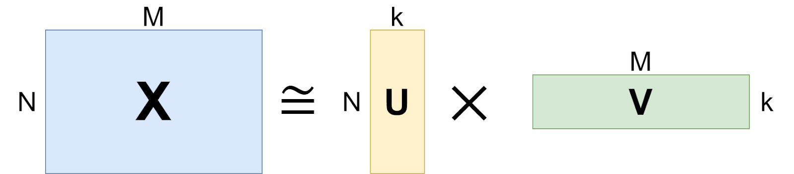
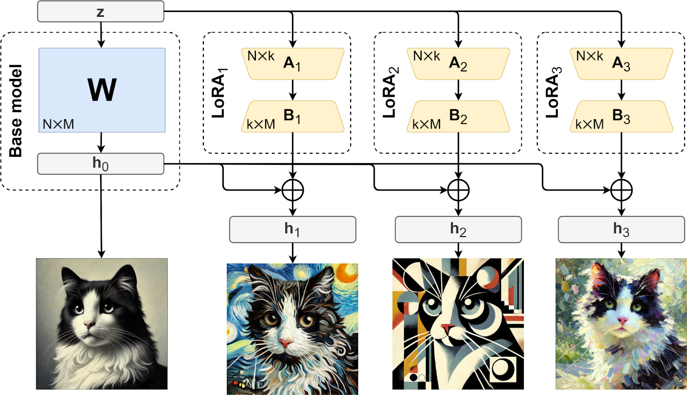
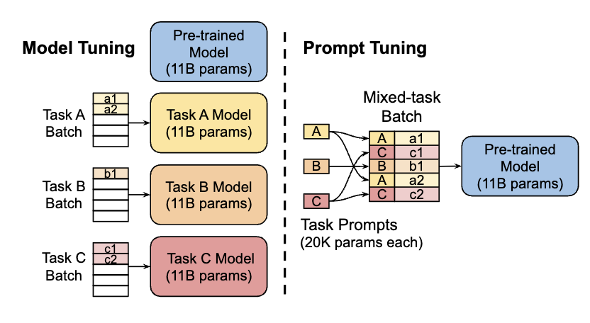

<!--Copyright © ZOMI 适用于[License](https://github.com/Infrasys-AI/AIInfra)版权许可-->

# CODE 01:Qwen3-4B 模型微调(DONE)

> Author by: 康煜

大型语言模型（LLM）的微调技术是将预训练模型适配到特定任务的关键环节。面对不同的数据特性和资源约束，选择合适的微调方法至关重要。

本文将使用**Qwen3-4B**模型作为基础模型，对比全参数微调、LoRA（Low-Rank Adaptation）、Prompt Tuning 和指令微调四种主流技术，分析它们在**效果、效率和数据需求**方面的差异，并探索**数据集类型**（通用/领域/小样本）与微调技术的适配关系。


## 1. 实验设置

> cuda=12.4
</br>
> python=3.12

首先安装必要的库：

 1. 安装 transformer 等基本库，此处的 torch 版本请参考 cuda 版本


```python
#!pip install transformers datasets
#!pip install torch==2.6.0 torchvision==0.21.0 torchaudio==2.6.0 (请在 torch 官网上自寻寻找符合要求的版本)
#!pip install --upgrade ipywidgets (jupyter)
```

 2.  对于[unsloth](https://github.com/unslothai/unsloth)的安装请参考如下


```python
try: import torch
except: raise ImportError('Install torch via `pip install torch`')
from packaging.version import Version as V
import re
v = V(re.match(r"[0-9\.]{3,}", torch.__version__).group(0))
cuda = str(torch.version.cuda)
is_ampere = torch.cuda.get_device_capability()[0] >= 8
USE_ABI = torch._C._GLIBCXX_USE_CXX11_ABI
if cuda not in ("11.8", "12.1", "12.4", "12.6", "12.8"): raise RuntimeError(f"CUDA = {cuda} not supported!")
if   v <= V('2.1.0'): raise RuntimeError(f"Torch = {v} too old!")
elif v <= V('2.1.1'): x = 'cu{}{}-torch211'
elif v <= V('2.1.2'): x = 'cu{}{}-torch212'
elif v  < V('2.3.0'): x = 'cu{}{}-torch220'
elif v  < V('2.4.0'): x = 'cu{}{}-torch230'
elif v  < V('2.5.0'): x = 'cu{}{}-torch240'
elif v  < V('2.5.1'): x = 'cu{}{}-torch250'
elif v <= V('2.5.1'): x = 'cu{}{}-torch251'
elif v  < V('2.7.0'): x = 'cu{}{}-torch260'
elif v  < V('2.7.9'): x = 'cu{}{}-torch270'
elif v  < V('2.8.0'): x = 'cu{}{}-torch271'
elif v  < V('2.8.9'): x = 'cu{}{}-torch280'
else: raise RuntimeError(f"Torch = {v} too new!")
if v > V('2.6.9') and cuda not in ("11.8", "12.6", "12.8"): raise RuntimeError(f"CUDA = {cuda} not supported!")
x = x.format(cuda.replace(".", ""), "-ampere" if is_ampere else "")
print(f'pip install --upgrade pip && pip install "unsloth[{x}] @ git+https://github.com/unslothai/unsloth.git"')
```

    pip install --upgrade pip && pip install "unsloth[cu124-ampere-torch260] @ git+https://github.com/unslothai/unsloth.git"


```python
#!pip install --upgrade pip && pip install "unsloth[cu124-ampere-torch260] @ git+https://github.com/unslothai/unsloth.git"
#!pip install --upgrade --force-reinstall --no-cache-dir --no-deps unsloth unsloth_zoo
```

**请先下载 unsloth 后再下载 xformers**

3. 对于[xformer](https://facebookresearch.github.io/xformers/)的安装，请如下对比 cuda 版本和 xformer 版本

</br>


| **xformers**                                   | **pytorch**         | **CUDA**              |
|:-----------------------------------------------|:-------------------:|:----------------------|
| v0.0.32post2                                  | torch==2.8.0        | cu118,cu126,cu128     |
| v0.0.31post1                                  | torch==2.7.0        | cu118,cu126,cu128     |
| v0.0.30                                       | torch==2.7.0        | cu118,cu126,cu128     |
| v0.0.29.post3                                 | torch==2.6.0        | cu118,cu124,cu126     |
| 0.0.29.post1,0.0.29,0.0.28.post3              | torch==2.5.1        | cu118,cu121,cu124     |
| 0.0.28.post2                                  | torch==2.5.0        | cu118,cu121,cu124     |
| 0.0.28.post1                                  | torch==2.4.1        | cu118,cu121,cu124     |

</br> 下载方式如下：


```python
#!pip install --no-deps "xformers<0.0.30" trl peft accelerate bitsandbytes
#!pip install --no-deps trl peft accelerate bitsandbytes

# 如果 cuda 版本较新也可以使用下面的 xforme 下载，其他的库直接 pip 安装即可
#!pip install --no-build-isolation --pre -v -U git+https://github.com/facebookresearch/xformers.git@fde5a2fb46e3f83d73e2974a4d12caf526a4203e
```


```python
import subprocess
import os
#修改环境变量
os.environ['HF_ENDPOINT'] = 'https://hf-mirror.com'
```


```python
from unsloth import FastLanguageModel
from transformers import AutoTokenizer, TrainingArguments, Trainer
from peft import LoraConfig, get_peft_model, PromptTuningConfig, TaskType
from datasets import load_dataset
import torch
import warnings
warnings.filterwarnings("ignore")

# 设置设备
device = torch.device("cuda" if torch.cuda.is_available() else "cpu")
print(f"使用设备: {device}")

# 加载 Qwen3-4B 模型和 tokenizer
model_name = "Qwen/Qwen3-4B-Instruct-2507"  # 使用 Qwen3-4B 指令微调版本
max_seq_length = 1024  # 最大序列长度
load_in_4bit = False   # 使用 4bit 量化减少显存占用，全量调参时该参数请改为 False

# 使用 Unsloth 优化加载模型
model, tokenizer = FastLanguageModel.from_pretrained(
    model_name=model_name,
    max_seq_length=max_seq_length,
    load_in_4bit=load_in_4bit,
    trust_remote_code=True  # Qwen 模型需要此参数
)

# 添加 pad_token 以便于批处理
if tokenizer.pad_token is None:
    tokenizer.pad_token = tokenizer.eos_token

print("模型和分词器加载完成")
print(f"模型参数量: {model.num_parameters()}")
```

    使用设备: cuda
    Unsloth: WARNING `trust_remote_code` is True.
    Are you certain you want to do remote code execution?
    ==((====))==  Unsloth 2025.9.4: Fast Qwen3 patching. Transformers: 4.56.1.
       \\   /|    NVIDIA L20. Num GPUs = 1. Max memory: 47.503 GB. Platform: Linux.
    O^O/ \_/ \    Torch: 2.6.0+cu124. CUDA: 8.9. CUDA Toolkit: 12.4. Triton: 3.2.0
    \        /    Bfloat16 = TRUE. FA [Xformers = 0.0.29.post3. FA2 = False]
     "-____-"     Free license: http://github.com/unslothai/unsloth
    Unsloth: Fast downloading is enabled - ignore downloading bars which are red colored!


    Loading checkpoint shards:   0%|          | 0/3 [00:00<?, ?it/s]


    模型和分词器加载完成
    模型参数量: 4022468096


## 3. 数据集构建

不同微调技术对数据集格式有不同要求。以下是**指令微调**所需的数据集格式示例：


```python
# 指令微调数据集格式示例
instruction_dataset = [
    {
        "instruction": "判断情感倾向",
        "input": "这部电影的视觉效果很棒，但剧情有些乏味",
        "output": "混合情感：正面评价视觉效果，负面评价剧情",
        "system": "你是一个专业的情感分析助手",
        "history": []
    },
    {
        "instruction": "生成产品描述",
        "input": "智能手机，品牌：Apple，型号：iPhone 15，特点：A17 芯片、4800 万像素相机",
        "output": "Apple iPhone 15 搭载强大的 A17 芯片和 4800 万像素高清相机，提供卓越性能和拍摄体验。",
        "system": "你是一个产品描述生成器",
        "history": []
    },
    {
        "instruction": "翻译成英文",
        "input": "今天天气很好，我们一起去公园吧",
        "output": "The weather is nice today, let's go to the park together.",
        "system": "你是一个翻译助手",
        "history": []
    }
]

# 将示例数据集保存为 JSON 文件
import json
with open("instruction_dataset.json", "w", encoding="utf-8") as f:
    json.dump(instruction_dataset, f, ensure_ascii=False, indent=2)

print("指令微调数据集示例已保存")
```

    指令微调数据集示例已保存


对于**通用文本生成**任务，数据集格式可以更简单：


```python
# 通用文本数据集格式示例
general_dataset = [
    {
        "text": "大型语言模型是人工智能领域的重要突破，它们通过在大量文本数据上进行预训练，学习语言的统计规律和语义表示。"
    },
    {
        "text": "迁移学习使模型能够将在一个任务上学到的知识应用到其他相关任务上，大大减少了数据需求和训练时间。"
    }
]

with open("general_dataset.json", "w", encoding="utf-8") as f:
    json.dump(general_dataset, f, ensure_ascii=False, indent=2)

print("通用文本数据集示例已保存")
```

    通用文本数据集示例已保存


## 4. 数据预处理

我们需要根据不同的微调方法对数据进行相应处理：


```python

from transformers import AutoTokenizer, TrainingArguments, Trainer
from datasets import load_dataset
import torch
max_seq_length = 1024
def preprocess_instruction_data(examples):
    """处理指令微调数据，labels 严格 mask 掉 prompt，只对 assistant 部分算 loss"""
    input_ids_list = []
    attention_mask_list = []
    labels_list = []
    for i in range(len(examples["instruction_zh"])):
        instruction = str(examples["instruction_zh"][i])
        input_text = (
            str(examples["input_zh"][i])
            if "input_zh" in examples and examples["input_zh"][i]
            else ""
        )
        output_text = str(examples["output_zh"][i])
        system_text = (
            str(examples["system"][i])
            if "system" in examples and examples["system"][i]
            else ""
        )

        # 构建完整对话
        if system_text:
            text = f"<|im_start|>system\n{system_text}<|im_end|>\n"
        else:
            text = ""
        if input_text:
            user_content = f"{instruction}\n{input_text}"
        else:
            user_content = instruction
        text += f"<|im_start|>user\n{user_content}<|im_end|>\n"
        text += f"<|im_start|>assistant\n{output_text}<|im_end|>"

        # 找到 assistant 的起始分界点
        assistant_start = text.rfind("<|im_start|>assistant")
        prompt = text[:assistant_start]
        response = text[assistant_start:]

        # 分别 tokenize，不加 special tokens
        prompt_enc = tokenizer(prompt, add_special_tokens=False)
        response_enc = tokenizer(response, add_special_tokens=False)

        input_ids = prompt_enc['input_ids'] + response_enc['input_ids']
        attention_mask = prompt_enc['attention_mask'] + response_enc['attention_mask']
        labels = [-100] * len(prompt_enc['input_ids']) + response_enc['input_ids']

        # 截断到 max_seq_length
        input_ids = input_ids[:max_seq_length]
        attention_mask = attention_mask[:max_seq_length]
        labels = labels[:max_seq_length]

        # padding
        pad_len = max_seq_length - len(input_ids)
        input_ids += [tokenizer.pad_token_id] * pad_len
        attention_mask += [0] * pad_len
        labels += [-100] * pad_len

        input_ids_list.append(input_ids)
        attention_mask_list.append(attention_mask)
        labels_list.append(labels)

    return {
        "input_ids": input_ids_list,
        "attention_mask": attention_mask_list,
        "labels": labels_list,
    }


def preprocess_general_data(examples):
    """处理通用文本数据"""
    return tokenizer(
        examples["text"],
        truncation=True,
        padding=True,
        max_length=max_seq_length,
        return_tensors=None
    )


```


```python
# 加载数据集，由于数据集较大，因此只采用 10000 条数据
# ---指令数据集---
instruction_dataset = load_dataset("silk-road/alpaca-data-gpt4-chinese", split = "train[:10000]")
```


```python
# ---通用文本数据集---
general_dataset = load_dataset("Blaze7451/Wiki-zh-20250601", split = "train[:10000]")
```


```python
instruction_dataset[0]
```


    {'instruction_zh': '给出三个保持健康的小贴士。',
     'input_zh': '',
     'output_zh': '1. 饮食要均衡且富有营养：确保你的餐食包含各种水果、蔬菜、瘦肉、全谷物和健康脂肪。这有助于为身体提供必要的营养，使其发挥最佳功能，并有助于预防慢性疾病。2. 经常参加体育锻炼：锻炼对于保持强壮的骨骼、肌肉和心血管健康至关重要。每周至少要进行 150 分钟的中等有氧运动或 75 分钟的剧烈运动。3. 获得足够的睡眠：获得足够的高质量睡眠对身体和心理健康至关重要。它有助于调节情绪，提高认知功能，并支持健康的生长和免疫功能。每晚睡眠目标为 7-9 小时。',
     'instruction': 'Give three tips for staying healthy.',
     'input': '',
     'output': '1. Eat a balanced and nutritious diet: Make sure your meals are inclusive of a variety of fruits and vegetables, lean protein, whole grains, and healthy fats. This helps to provide your body with the essential nutrients to function at its best and can help prevent chronic diseases.\n\n2. Engage in regular physical activity: Exercise is crucial for maintaining strong bones, muscles, and cardiovascular health. Aim for at least 150 minutes of moderate aerobic exercise or 75 minutes of vigorous exercise each week.\n\n3. Get enough sleep: Getting enough quality sleep is crucial for physical and mental well-being. It helps to regulate mood, improve cognitive function, and supports healthy growth and immune function. Aim for 7-9 hours of sleep each night.'}


```python
general_dataset[0]
```


    {'title': '数学',
     'text': '欧几里得，西元前三世纪的古希腊数学家，而现在被认为是几何之父，此画为拉斐尔的作品《雅典学院》\n 数学是研究数量、结构以及空间等概念及其变化的一门学科，属于形式科学的一种。数学利用抽象化和逻辑推理，从计数、计算、量度、对物体形状及运动的观察发展而成。数学家们拓展这些概念，以公式化新的猜想，以及从选定的公理及定义出发，严谨地推导出一些定理。\n 纯粹数学的知识与运用是生活中不可或缺的一环。对数学基本概念的完善，早在古埃及、美索不达米亚及古印度历史上的古代数学文本便可观见，而在古希腊那里有更为严谨的处理。从那时开始，数学的发展便持续不断地小幅进展，至 16 世纪的文艺复兴时期，因为新的科学发现和数学革新两者的交互，致使数学的加速发展，直至今日。数学并成为许多国家及地区的教育中的一部分。\n 数学在许多领域都有应用，包括科学、工程、医学、经济学和金融学等。数学对这些领域的应用通常被称为应用数学，有时亦会激起新的数学发现，并导致全新学科的发展，例如物理学的实质性发展中建立的某些理论激发数学家对于某些问题的不同角度的思考。数学家也研究纯粹数学，就是数学本身的实质性内容，而不以任何实际应用为目标。许多研究虽然以纯粹数学开始，但其过程中也发现许多可用之处。\n\n**词源**\n 西方语言中“数学”（μαθηματικά）一词源自于古希腊语的μάθημα（máthēma），其有“学习”、“学问”、“科学”，还有个较狭义且技术性的意思－「数学研究」，即使在其语源内。其形容词μαθηματικός（mathēmatikós），意思为「和学习有关的」或「用功的」，亦会被用来指「数学的」。其在英语中表面上的复数形式，及在法语中的表面复数形式 les mathématiques，可溯至拉丁文的中性复数 mathematica，由西塞罗译自希腊文复数τα μαθηματικά（ta mathēmatiká），此一希腊语被亚里士多德拿来指「万物皆数」的概念。\n 汉字表示的「数学」一词大约产生于中国宋元时期。多指象数之学，但有时也含有今天上的数学意义，例如，秦九韶的《数学九章》（《永乐大典》记，即《数书九章》也被宋代周密所着的《癸辛杂识》记为《数学大略》）、《数学通轨》（明代柯尚迁着）、《数学钥》（清代杜知耕着）、《数学拾遗》（清代丁取忠撰）。直到 1939 年，经过中国数学名词审查委员会研究“算学”与“数学”两词的使用状况后，确认以“数学”表示今天意义上的数学含义。\n\n**历史**\n 奇普，印加帝国时所使用的计数工具\n 玛雅数字，黑点代表一，黑直线代表五\n 数学有着久远的历史。它被认为起源于人类早期的生产活动：中国古代的六艺之一就有「数」，数学一词在西方有希腊语词源μαθηματικός（mathematikós），意思是“学问的基础”，源于μάθημα（máthema，“科学，知识，学问”）。\n 史前的人类就已尝试用自然的法则来衡量物质的多少、时间的长短等抽象的数量关系，比如时间单位有日、季节和年等。算术（加减乘除）也自然而然地产生了。古代的石碑及泥版亦证实了当时已有几何的知识。\n 更进一步则需要写作或其他可记录数字的系统，如符木或于印加帝国内用来储存数据的奇普。历史上曾有过许多不同的记数系统。\n 在最初有历史记录的时候，数学内的主要原理是为了做税务和贸易等相关计算，为了解数字间的关系，为了测量土地，以及为了预测天文事件而形成的。这些可以简单地被概括为数学对数量、结构、空间及时间方面的研究。\n 到了 16 世纪，算术、初等代数以及三角学等初等数学已大体完备。17 世纪变量概念的产生使人们开始研究变化中的量与量的互相关系和图形间的互相变换，微积分的概念也在此时形成。随着数学转向形式化，为研究数学基础而产生的集合论和数理逻辑等也开始发展。数学的重心从求解实际问题转变到对一般形式上的思考。\n 从古至今，数学便一直不断地延展，且与科学有丰富的相互作用，两者的发展都受惠于彼此。在历史上有着许多数学发现，并且直至今日都不断地有新的发现。据米哈伊尔·B·塞甫留克（Mikhail B. Sevryuk）于美国数学会通报 2006 年 1 月的期刊中所说，「存放于数学评论资料库中论文和书籍的数量自 1940 年（数学评论的创刊年份）现已超过了一百九十万份，而且每年还增加超过七万五千份。此一学海的绝大部份为新的数学定理及其证明。」\n\n**形成、纯数学与应用数学及美学**\n 牛顿（1643-1727），微积分的发明者之一\n 每当有涉及数量、结构、空间及变化等方面的问题时，通常就需要用到数学去解决问题，而这往往也拓展了数学的研究范畴。一开始，数学的运用可见于贸易、土地测量及之后的天文学。今日，所有的科学都存在着值得数学家研究的问题，且数学本身亦给出了许多的问题。牛顿和莱布尼兹是微积分的发明者，费曼发明了费曼路径积分，这是推理及物理洞察二者的产物，而今日的弦理论亦引申出新的数学。一些数学只和生成它的领域有关，且用来解答此领域的更多问题。但一般被一领域生成的数学在其他许多领域内也十分有用，且可以成为一般的数学概念。即使是「最纯的」数学通常亦有实际的用途，此一非比寻常的事实，被 1963 年诺贝尔物理奖得主维格纳称为「数学在自然科学中不可想像的有效性」。\n 如同大多数的研究领域，科学知识的爆发导致了数学的专业化。主要的分歧为纯数学和应用数学。在应用数学内，又被分成两大领域，并且变成了它们自身的学科——统计学和电脑科学。\n 许多数学家谈论数学的优美，其内在的美学及美。「简单」和「一般化」即为美的一种。另外亦包括巧妙的证明，如欧几里得对存在无限多质数的证明；又或者是加快计算的数值方法，如快速傅立叶变换。高德菲·哈罗德·哈代在《一个数学家的自白》一书中表明他相信单单是美学上的意义，就已经足够成为数学研究的正当理由。\n\n**符号、语言与精确性**\n 在现代的符号中，简单的表示式可能描绘出复杂的概念。此一图像即产生自 x=cos ( y arccos sin〡x〡 + x arcsin cos〡y〡)\n 我们现今所使用的大部分数学符号在 16 世纪后才被发明出来的。在此之前，数学以文字的形式书写出来，这种形式会限制了数学的发展。现今的符号使得数学对于专家而言更容易掌握，但初学者却常对此望而却步。它被极度的压缩：少量的符号包含着大量的讯息。如同音乐符号一般，现今的数学符号有明确的语法，并且有效地对讯息作编码，这是其他书写方式难以做到的。符号化和形式化使得数学迅速发展，并帮助各个科学领域建立基础支撑理论。\n 数学语言亦对初学者而言感到困难。如“或”和“只”这些字有着比日常用语更精确的意思。亦困恼着初学者的，如“开放”和“域”等字在数学里有着特别的意思。数学术语亦包括如“同胚”及“可积性”等专有名词。但使用这些特别符号和专有术语是有其原因的：数学需要比日常用语更多的精确性。数学家将此对语言及逻辑精确性的要求称为「严谨」。但在现实应用中，舍弃一些严谨性往往会得到更好的结果。\n 严谨是数学证明中很重要且基本的一部份。数学家希望他们的定理以系统化的推理依着公理被推论下去。这是为了避免依着不可靠的直观而推出错误的「定理」，而这情形在历史上曾出现过许多的例子。NoteTag|关于在正式的证明中出错的一些简单例子，参见无效证明。在四色定理的历史中，亦有个曾被其他数学家所接受的错误证明。在数学中被期许的严谨程度因着时间而不同：希腊人期许着仔细的论证，但在牛顿的时代，所使用的方法则较不严谨。牛顿为了解决问题所做的定义，到了十九世纪才重新以小心的分析及正式的证明来处理。今日，数学家们则持续地在争论电脑协助证明的严谨度。当大量的计算难以被验证时，其证明亦很难说是足够地严谨。\n 公理在传统的思想中是「不证自明的真理」，但这种想法是有问题的。在形式上，公理只是一串符号，其只对可以由公理系统导出的公式之内容有意义。希尔伯特计划即是想将所有的数学放在坚固的公理基础上，但依据哥德尔不完备定理，每一相容且能蕴涵皮亚诺公理的公理系统必含有一不可决定的公式；因而所有数学的最终公理化是不可能的。尽管如此，数学常常被想像成只是某种公理化的集合论，在此意义下，所有数学叙述或证明都可以写成集合论的公式。\n\n**数学作为科学**\n 卡尔·弗里德里希·高斯\n 卡尔·弗里德里希·高斯称数学为「科学的皇后」。在拉丁原文 Regina Scientiarum，以及其德语 Königin der Wissenschaften 中，对应于「科学」的单字的意思皆为知识（领域）。而实际上，science 一词在英语内本来就是这个意思，且无疑问地数学在此意义下确实是一门「科学」。将科学限定在自然科学则是在此之后的事。若认为科学是只指物理的世界时，则数学，或至少是纯数学，不会是一门科学。爱因斯坦曾如此描述：「数学定律越和现实有关，它们越不确定；若它们越是确定的话，它们和现实越不会有关。」许多哲学家相信数学在经验上不具可否证性，且因此不是卡尔·波普尔所定义的科学。但在 1930 年代时，在数理逻辑上的重大进展显示数学不能归并至逻辑内，且波普尔推断「大部份的数学定律，如物理及生物学一样，是假设演绎的：纯数学因此变得更接近其假设为猜测的自然科学，比它现在看起来更接近。」然而，其他的思想家，如较著名的拉卡托斯，便提供了一个关于数学本身的可否证性版本。\n 另一观点则为某些科学领域（如理论物理）是其公理为尝试着符合现实的数学。而事实上，理论物理学家齐曼（John Ziman）即认为科学是一种公众知识，因此亦包含着数学。在任何的情况下，数学和物理科学的许多领域都有着很多相同的地方，尤其是从假设所得的逻辑推论之探索。直觉和实验在数学和科学的猜想建构上皆扮演着重要的角色。实验数学在数学中的重要性正持续地在增加，且计算和模拟在科学及数学中所扮演的角色也越来越加重，减轻了数学不使用科学方法的缺点。在史蒂芬·沃尔夫勒姆 2002 年的著作《一种新科学》中他提出，计算数学应被视为其自身的一科学领域来探索。\n 数学家对此的态度并不一致。一些研究应用数学的数学家觉得他们是科学家，而那些研究纯数学的数学家则时常觉得他们是在一门较接近逻辑的领域内工作，且因此基本上是个哲学家。许多数学家认为称他们的工作是一种科学，是低估了其美学方面的重要性，以及其做为七大博雅教育之一的历史；另外亦有人认为若忽略其与科学之间的关联，是假装没看到数学和其在科学与工程之间的交互影响，进而促进了数学在许多科学上的发展此一事实。这两种观点之间的差异在哲学上产生了数学是「被创造」（如艺术）或是「被发现」（如科学）的争议。大学院系划分中常见「科学和数学系」，这指出了这两个领域被看作有紧密联系而非一样。实际上，数学家通常会在大体上与科学家合作，但在细节上却会分开。此争议亦是数学哲学众多议题的其中一个。\n\n**数学的各领域**\n 早期的数学完全着重在演算实际运算的需要上，有如反映在中国算盘上的一般\n 如上所述，数学主要的学科最先产生于商业上计算的需要、了解数字间的关系、测量土地及预测天文事件。这四种需要大致地与数量、结构、空间及变化（即算术、代数、几何及分析）等数学上广泛的子领域相关连着。除了上述主要的关注之外，亦有用来探索由数学核心至其他领域上之间的连结的子领域：至逻辑、至集合论（基础）、至不同科学的经验上的数学（应用数学）、及较近代的至不确定性的严格研究。\n\n**基础与哲学**\n 为了阐明数学基础，数学逻辑和集合论等领域被发展了出来。\n 数学逻辑专注于将数学置在一坚固的公理架构上，并研究此一架构的结果。就数学逻辑本身而言，其为哥德尔第二不完备定理所属的领域，而这或许是逻辑学中最广为流传的成果：总是存在不能被证明的真命题。\n 现代逻辑被分成递归论、模型论和证明论，且和理论电脑科学有着密切的关连性，千禧年大奖难题中的 P/NP 问题就是理论电脑科学中的著名问题。\n\n**纯粹数学**\n\n**数量**\n 数量的研究起于数，一开始为熟悉的自然数及整数与被描述在算术内的自然数及整数的算术运算。整数更深的性质于数论中有详细的研究，此一理论包括了如费马最后定理等著名的结果。数论还包括两个被广为探讨的未解问题：孪生质数猜想及哥德巴赫猜想。\n 当数系更进一步发展时，整数被视为有理数的子集，而有理数则包含于实数中，连续的量即是以实数来表示的。实数则可以被进一步广义化成复数。数的进一步广义化可以持续至包含四元数及八元数。从自然数亦可以推广到超限数，它形式化了计数至无限的这一概念。另一个研究的领域为大小，这个导致了基数和之后对无限的另外一种概念：阿列夫数，它允许无限集合之间的大小可以做有意义的比较。\n\n**结构**\n 许多如数及函数的集合等数学物件都有着内含的结构。这些物件的结构性质被探讨于群、环、-{zh-cn:域;zh-tw:体}-等抽象系统中，该些物件事实上也就是这样的系统。此为代数的领域。在此有一个很重要的概念，即广义化至向量空间的向量，它于线性代数中被研究。向量的研究结合了数学的三个基本领域：数量、结构及空间。向量分析则将其扩展至第四个基本的领域内，即变化。\n 创立于二十世纪三十年代的法国的布尔巴基学派认为：纯粹数学，是研究抽象结构的理论。\n 结构，就是以初始概念和公理出发的演绎系统。\n 布尔巴基学派认为，有三种基本的抽象结构：代数结构（群，环，域……），序结构（偏序，全序……），拓扑结构（邻域，极限，连通性，维数……）。\n\n**空间**\n 空间的研究源自于几何－尤其是欧几里得几何。三角学则结合了空间及数，且包含有著名的勾股定理。现今对空间的研究更推广到了更高维的几何、非欧几里得几何（其在广义相对论中扮演着核心的角色）及拓扑学。数和空间在解析几何、微分几何和代数几何中都有着很重要的角色。在微分几何中有着纤维丛及流形上的微积分等概念。在代数几何中有着如多项式方程的解集等几何物件的描述，结合了数和空间的概念；亦有着拓扑群的研究，结合了结构与空间。李群被用来研究空间、结构及变化。在其许多分支中，拓扑学可能是二十世纪数学中有着最大进展的领域，并包含有存在已久的庞加莱猜想，以及有争议的四色定理。庞加莱猜想已在 2006 年确认由俄罗斯数学家格里戈里·佩雷尔曼证明，而四色定理已在 1976 年由凯尼斯·阿佩尔和沃夫冈·哈肯用电脑证明，而从来没有由人力来验证过。\n\n**变化**\n 了解及描述变化在自然科学里是一普遍的议题，而微积分更为研究变化的有利工具。函数诞生于此，作为描述一变化的量的核心概念。对于实数及实变函数的严格研究为实分析，而复分析则为复数的等价领域。黎曼猜想——数学最基本的未决问题之一——便是以复分析来描述的。泛函分析注重在函数的（一般为无限维）空间上。泛函分析的众多应用之一为量子力学。许多的问题很自然地会导出一个量与其变化率之间的关系，而这在微分方程中被研究。在自然界中的许多现象可以被动力系统所描述；混沌理论则是对系统的既不可预测而又是决定的行为作明确的描述。\n\n**离散数学**\n 离散数学是指对理论电脑科学最有用处的数学领域之总称，这包含有可计算理论、计算复杂性理论及资讯理论。可计算理论检验电脑的不同理论模型之极限，这包含现知最有力的模型——图灵机。复杂性理论研究可以由电脑做为较易处理的程度；有些问题即使理论是可以以电脑解出来，但却因为会花费太多的时间或空间而使得其解答仍然不为实际上可行的，尽管电脑硬体的快速进步。最后，资讯理论专注在可以储存在特定媒介内的资料总量，且因此有压缩及熵等概念。\n 作为一相对较新的领域，离散数学有许多基本的未解问题。其中最有名的为 P/NP 问题——千禧年大奖难题之一。一般相信此问题的解答是否定的。\n\n**应用数学**\n 应用数学思考将抽象的数学工具运用在解答科学、工商业及其他领域上之现实问题。应用数学中的一重要领域为统计学，它利用机率论为其工具并允许对含有机会成分的现象进行描述、分析与预测。大部份的实验、调查及观察研究需要统计对其资料的分析。（许多的统计学家并不认为他们是数学家，而比较觉得是合作团体的一份子。）数值分析研究有什么计算方法，可以有效地解决那些人力所限而算不出的数学问题；它亦包含了对计算中舍入误差或其他来源的误差之研究。\nFile:Gravitation space source.png |数学物理\nFile:BernoullisLawDerivationDiagram.svg |数学流体力学\nFile:Composite trapezoidal rule illustration small.svg |数值分析\nFile:Maximum boxed.png |最佳化\nFile:Two red dice 01.svg |概率论\nFile:Oldfaithful3.png |统计学\nFile:Market Data Index NYA on 20050726 202628 UTC.png |计量金融\nFile:Arbitrary-gametree-solved.svg |-{zh-tw:赛局理论;zh-cn:博弈论}-\nFile:Front pareto.svg |数理经济学\nFile:Signal transduction pathways (zh-cn).svg |生物数学\nFile:Linear programming example graph (zh).png |作业研究\nFile:Simple feedback control loop2.svg|控制论\n\n**数学奖项**\n 菲尔兹奖牌正面\n 数学奖通常和其他科学的奖项分开。数学上最有名的奖为菲尔兹奖，创立于 1936 年，每四年颁奖一次。它通常被认为是数学领域的诺贝尔奖。另一个国际上主要的奖项为阿贝尔奖，创立于 2003 年。两者都颁奖于特定的工作主题，包括数学新领域的创新或已成熟领域中未解决问题的解答。著名的 23 个问题，称为希尔伯特的 23 个问题，于 1900 年由德国数学家大卫·希尔伯特所提出。这一连串的问题在数学家之间有着极高的名望，且至少有九个问题已经被解答了出来。另一新的七个重要问题，称为千禧年大奖难题，发表于 2000 年。对其每一个问题的解答都有着一百万美元的奖金，而当中只有一个问题（黎曼猜想）和希尔伯特的问题重复。\n*菲尔兹奖，由国际数学联盟的国际数学家大会颁发的奖项。每四年颁奖一次，颁给有卓越贡献的年轻数学家，每次最多四人得奖。得奖者须在该年元旦前未满四十岁，是年轻数学家可以获得的最大奖项。它是据加拿大数学家约翰·查尔斯·菲尔兹的要求设立的。菲尔兹奖被视为数学界的诺贝尔奖。\n*沃尔夫奖，由沃尔夫基金会颁发，该基金会于 1976 年在以色列创立，1978 年开始颁奖。创始人里卡多·沃尔夫是外交家、实业家和慈善家。而沃尔夫数学奖是沃尔夫奖的一个奖项，它和菲尔兹奖被共同誉为数学家的最高荣誉。\n*阿贝尔奖，由挪威王室向杰出数学家颁发的一种奖项，每年颁发一次。2001 年，为了纪念 2002 年挪威著名数学家尼尔斯·亨利克·阿贝尔二百周年诞辰，挪威政府宣布将开始颁发此种奖金。奖金的数额大致同诺贝尔奖相近。设立此奖的一个原因也是因为诺贝尔奖没有数学奖项。2001 年挪威政府拨款 2 亿挪威克朗作为启动资金。扩大数学的影响，吸引年轻人从事数学研究是设立阿贝尔奖的主要目的。\n\n**参见**\n 数学哲学- 数学游戏- 数学家列表- 教育- 算经十书- 数学竞赛- 数学题\n\n**注释**\n\n**参考**\n\n**参考书目**\n Benson, Donald C., The Moment of Proof: Mathematical Epiphanies, Oxford University Press, USA; New Ed edition (December 14, 2000). ISBN 978-0-19-513919-8.- Boyer, Carl B., A History of Mathematics, Wiley; 2 edition (March 6, 1991). ISBN 978-0-471-54397-8.—A concise history of mathematics from the Concept of Number to contemporary Mathematics.- Courant, R. and H. Robbins, What Is Mathematics? : An Elementary Approach to Ideas and Methods, Oxford University Press, USA; 2 edition (July 18, 1996). ISBN 978-0-19-510519-3.- Davis, Philip J. and Hersh, Reuben, The Mathematical Experience. Mariner Books; Reprint edition (January 14, 1999). ISBN 978-0-395-92968-1.—A gentle introduction to the world of mathematics.- Gullberg, Jan, Mathematics—From the Birth of Numbers. W. W. Norton & Company; 1st edition (October 1997). ISBN 978-0-393-04002-9.—An encyclopedic overview of mathematics presented in clear, simple language.- Hazewinkel, Michiel (ed.), Encyclopedia of Mathematics. Kluwer Academic Publishers 2000.—A translated and expanded version of a Soviet mathematics encyclopedia, in ten (expensive) volumes, the most complete and authoritative work available. Also in paperback and on CD-ROM, and online .- Kline, Morris, Mathematical Thought from Ancient to Modern Times, Oxford University Press, USA; Paperback edition (March 1, 1990). ISBN 978-0-19-506135-2.- dead-url=no - Pappas, Theoni, The Joy Of Mathematics, Wide World Publishing; Revised edition (June 1989). ISBN 978-0-933174-65-8.- id=ISBN 978-0-385-48254-7- dead-url=yes \n\n**外部链接**\n Rusin, Dave:  The Mathematical Atlas（英文版）现代数学漫游。- Weisstein, Eric:  World of Mathematics date=20220211030906 ，一个在线的数学百科全书。-  数学 date=20190116050302 ，另一个在线的数学百科全书。-  MathForge date=20020603210431 ，一个包含数学、物理、计算机科学和教育等范畴的新闻网志。-  EpisteMath｜数学知识 date=20040406190055 。- 香港科技大学： 数学网，一个以数学史为主的网站。-  怎样研习纯数学（或统计学） date=20090823064312 ：本科与基础研究课程参考书目。-  数学文化 date=20120613183815 ：主要发表高质量的带有普及性的文章;主要面向大学生，大学老师和研究生，以及中学老师和学生。-  数学学习资源：互联网上数学学习资源和教学视频。- " 英汉对照数学用语" ( date=20150426193733 ; 英汉对照数学用语). New York State Education Department, Albany. Bureau of Bilingual Education. 1988. --  See profile at( date=20160304055754 ) ERIC'}


```python
# 应用预处理
tokenized_dataset = general_dataset.map(
    preprocess_general_data,
    batched=True,
    remove_columns=general_dataset.column_names
)

# 分割训练集和验证集
split_dataset = tokenized_dataset.train_test_split(test_size=0.2)
train_dataset = split_dataset["train"]
eval_dataset = split_dataset["test"]

print(f"训练集大小: {len(train_dataset)}")
print(f"验证集大小: {len(eval_dataset)}")
```

    训练集大小: 8000
    验证集大小: 2000


```python
# 应用预处理
instruction_tokenized_dataset = instruction_dataset.map(
    preprocess_instruction_data,
    batched=True,
    remove_columns=instruction_dataset.column_names
)

# 分割训练集和验证集
instruction_split_dataset = instruction_tokenized_dataset.train_test_split(test_size=0.2)
instruction_train_dataset = instruction_split_dataset["train"]
instruction_eval_dataset = instruction_split_dataset["test"]

print(f"训练集大小: {len(train_dataset)}")
print(f"验证集大小: {len(eval_dataset)}")
```

    训练集大小: 8000
    验证集大小: 2000


## 3. 全参数微调

全参数微调通过**反向传播算法更新模型的所有可训练参数**。其数学本质可以表示为：

θ_min = argmin_θ (1/N) * Σ_{i=1}^N L(f_θ(x_i), y_i)

其中 f_θ表示参数化模型，L 为损失函数，N 为样本数量。

这种方法的主要优势是能够充分利用所有模型参数进行任务适配，但缺点是**计算成本高**，对于大模型来说需要大量的显存和计算资源。


```python
# 设置训练参数
from transformers import TrainingArguments, Trainer
import pandas as pd
import time
import math
if torch.cuda.is_available():
    torch.cuda.reset_peak_memory_stats()
    torch.cuda.synchronize()


training_args = TrainingArguments(
    output_dir="./results",
    num_train_epochs=2,
    per_device_train_batch_size=2,  # 较小的批大小以适应显存
    per_device_eval_batch_size=2,
    eval_strategy="epoch",
    logging_dir="./results/logs",
    logging_steps=10,
    learning_rate=5e-6,  # 全参数微调使用较小的学习率
    weight_decay=0.01,
    save_steps=1000,
    report_to="none",
    save_total_limit=1, #为了节约内存，每次只保留一个 checkpoint 模型
    bf16=True  # 使用混合精度训练节省显存，这里如果用了 unsloth，默认 bp16，如果此处选择用 fp16，则会报错
)

# 创建 Trainer 实例
trainer = Trainer(
    model=model,
    args=training_args,
    train_dataset=train_dataset,
    eval_dataset=eval_dataset,
    processing_class=tokenizer
)

# 开始训练
train_start = time.time()
trainer.train()
train_end = time.time()

output_dir = "./finetune_results/full_fintune"
trainer.save_model(output_dir)
tokenizer.save_pretrained(output_dir)

print("全参数微调完成")
train_duration = train_end - train_start

# 提取评估记录
import math
train_logs = trainer.state.log_history
eval_results = {}

for log in train_logs:
    if 'eval_loss' in log:
        eval_results.update({k: v for k, v in log.items() if k.startswith('eval_')})
        
# 计算困惑度
if "eval_loss" in eval_results and eval_results["eval_loss"] is not None:
    perplexity = math.exp(eval_results["eval_loss"])
else:
    perplexity = None


total_params = sum(p.numel() for p in model.parameters()) / 1_000_000
trainable_params = sum(p.numel() for p in model.parameters() if p.requires_grad) / 1_000_000

trainable_ratio = (trainable_params / total_params) * 100
peak_memory_mb = torch.cuda.max_memory_allocated() / 1024**2 if torch.cuda.is_available() else None


record = {
    "fine_tune_method": "full_finetune",
    "train_time_sec": round(train_duration, 2),
    "eval_time_sec": round(eval_results["eval_runtime"], 2),
    "total_params": total_params,
    "trainable_params": trainable_params,
    "trainable_ratio": trainable_ratio,
    "peak_gpu_mem": round(peak_memory_mb, 2) if peak_memory_mb else None,
    "eval_loss": eval_results["eval_loss"],
    "eval_runtime": eval_results["eval_runtime"],
    "eval_samples_per_second": eval_results["eval_samples_per_second"],
    "perplexity": perplexity,
    "epoch": 2
}

csv_path = "./training_results.csv"
df = pd.DataFrame([record])
df.to_csv(csv_path, index=False, mode="a", header=not pd.io.common.file_exists(csv_path))
df
```

    The tokenizer has new PAD/BOS/EOS tokens that differ from the model config and generation config. The model config and generation config were aligned accordingly, being updated with the tokenizer's values. Updated tokens: {'bos_token_id': None}.
    ==((====))==  Unsloth - 2x faster free finetuning | Num GPUs used = 1
       \\   /|    Num examples = 8,000 | Num Epochs = 2 | Total steps = 16,000
    O^O/ \_/ \    Batch size per device = 1 | Gradient accumulation steps = 1
    \        /    Data Parallel GPUs = 1 | Total batch size (1 x 1 x 1) = 1
     "-____-"     Trainable parameters = 3,633,511,936 of 4,022,468,096 (90.33% trained)


    <div>

      <progress value='16000' max='16000' style='width:300px; height:20px; vertical-align: middle;'></progress>
      [16000/16000 2:44:40, Epoch 2/2]
    </div>
    <table border="1" class="dataframe">
  <thead>
 <tr style="text-align: left;">
      <th>Epoch</th>
      <th>Training Loss</th>
      <th>Validation Loss</th>
    </tr>
  </thead>
  <tbody>
    <tr>
      <td>1</td>
      <td>1.183300</td>
      <td>1.429914</td>
    </tr>
    <tr>
      <td>2</td>
      <td>1.160100</td>
      <td>1.429399</td>
    </tr>
  </tbody>
</table><p>


    全参数微调完成


<div>

  <progress value='2000' max='2000' style='width:300px; height:20px; vertical-align: middle;'></progress>
  [2000/2000 03:39]
</div>


全参数微调的主要优点是能够**充分利用模型的全部能力**，通常在数据充足的情况下能达到最佳性能。然而，它的计算成本非常高——对于 Qwen3-4B 这样的模型，需要大量的 GPU 显存和计算时间。

此外，全参数微调还容易导致**灾难性遗忘**，即模型在适应新任务时丢失了预训练中获得的一般知识。

## 4. LoRA 微调

LoRA 是一种**参数高效微调**（PEFT）技术，其核心思想是通过**低秩分解**来限制可训练参数的数量。具体而言，LoRA 将权重更新矩阵ΔW 分解为两个低秩矩阵的乘积：

W + ΔW = W + BA

其中 W 是预训练权重矩阵，A ∈ R^{r×d}和 B ∈ R^{d×r}是低秩矩阵，r 是秩（r << d）。

这种分解的数学基础是**奇异值分解**（SVD）定理，该定理表明任何矩阵都可以被分解为奇异值和奇异向量的乘积，而低秩近似则保留了矩阵中最重要的信息。如下所示：一个大型 N⨉M 矩阵 X 可以用两个矩形矩阵的乘积来近似，




在训练过程中，LoRA 对 A 使用随机高斯初始化，对 B 使用零初始化，这意味着在训练开始时，ΔW 为零。然后，您只需使用新数据集对模型进行微调，并使用 W +ΔW 作为新的权重矩阵。

通过专注于**低秩更新**，LoRA 与传统微调方法相比，大幅降低了计算和内存开销。而且通过使用 LoRA，可以针对其他的数据集，在同一个基础权重矩阵 W 上进行多种不同的微调。通常只需存储基础矩阵一次，并将新的变体存储为不同的 A_i 和 B_i 的集合就可以完成该任务，如下所示：



由于 LoRA 可以大幅减少开销，对硬件的需求也随之减少，因此许多研究基于 LoRA 衍生出许多的变体，比如 AdaLoRA，DLoRA 等，此处我们只用最原始的 LoRA 来进行我们的实验。


```python
import gc
# 清理 GPU 内存
torch.cuda.empty_cache()
gc.collect()
```


```python
from math import e
import time
import torch
import pandas as pd
import warnings
warnings.filterwarnings("ignore")
from unsloth import FastLanguageModel, FastModel
from peft import LoraConfig, get_peft_model, PeftModel
from trl import SFTTrainer, SFTConfig
from transformers import TrainingArguments, Trainer
from datasets import load_dataset

model_name = "unsloth/Qwen3-4B-Instruct-2507"
max_seq_length = 1024
load_in_4bit = True 

model, tokenizer = FastModel.from_pretrained(
    model_name=model_name,
    max_seq_length=max_seq_length,
    load_in_4bit=load_in_4bit,
    load_in_8bit = False, 
    full_finetuning = False, 
    trust_remote_code=True
)

if tokenizer.pad_token is None:
    tokenizer.pad_token = tokenizer.eos_token

model = FastLanguageModel.get_peft_model(
    model,
    r = 16,
    target_modules = ["q_proj", "k_proj", "v_proj", "o_proj",
                      "gate_proj", "up_proj", "down_proj",],
    lora_alpha = 16,
    lora_dropout = 0, 
    bias = "none",    
    max_seq_length = max_seq_length,
    use_rslora = False, 
    loftq_config = None,
)


training_args = TrainingArguments(
    output_dir="./results/lora_results",
    num_train_epochs=2,
    per_device_train_batch_size=4,
    per_device_eval_batch_size=4,
    eval_strategy="epoch",
    learning_rate=2e-4, #由于是高效参数微调，所以学习率可以适当调大
    weight_decay=0.01,
    report_to="none",
    save_strategy = "steps",
    save_steps = 1000,  # 每 1000 步保存一次
    remove_unused_columns=False,
)


lora_trainer = SFTTrainer(
    model = model,
    train_dataset = train_dataset,
    tokenizer = tokenizer,
    eval_dataset = eval_dataset,
    args = training_args
)

train_start = time.time()
lora_trainer.train()

train_end = time.time()
train_duration = train_end - train_start
```

    Unsloth: WARNING `trust_remote_code` is True.
    Are you certain you want to do remote code execution?
    ==((====))==  Unsloth 2025.9.4: Fast Qwen3 patching. Transformers: 4.56.1.
       \\   /|    NVIDIA L20. Num GPUs = 1. Max memory: 47.503 GB. Platform: Linux.
    O^O/ \_/ \    Torch: 2.6.0+cu124. CUDA: 8.9. CUDA Toolkit: 12.4. Triton: 3.2.0
    \        /    Bfloat16 = TRUE. FA [Xformers = 0.0.29.post3. FA2 = False]
     "-____-"     Free license: http://github.com/unslothai/unsloth
    Unsloth: Fast downloading is enabled - ignore downloading bars which are red colored!
    Unsloth: Qwen3 does not support SDPA - switching to fast eager.
    Unsloth: Making `model.base_model.model.model` require gradients


    The tokenizer has new PAD/BOS/EOS tokens that differ from the model config and generation config. The model config and generation config were aligned accordingly, being updated with the tokenizer's values. Updated tokens: {'bos_token_id': None}.


    <div>

      <progress value='4000' max='4000' style='width:300px; height:20px; vertical-align: middle;'></progress>
      [4000/4000 1:59:46, Epoch 2/2]
    </div>
    <table border="1" class="dataframe">
  <thead>
 <tr style="text-align: left;">
      <th>Epoch</th>
      <th>Training Loss</th>
      <th>Validation Loss</th>
    </tr>
  </thead>
  <tbody>
    <tr>
      <td>1</td>
      <td>1.486600</td>
      <td>1.476965</td>
    </tr>
    <tr>
      <td>2</td>
      <td>1.243900</td>
      <td>1.486912</td>
    </tr>
  </tbody>
</table><p>


    Unsloth: Will smartly offload gradients to save VRAM!


```python
lora_adapter_dir = "./finetune_results/lora_adapter"
lora_trainer.save_model(lora_adapter_dir)
tokenizer.save_pretrained(lora_adapter_dir)
print(f"LoRA Adapter 已保存到 {lora_adapter_dir}")

base_model_full, _ = FastLanguageModel.from_pretrained(
    model_name=model_name,
    max_seq_length=max_seq_length,
    load_in_4bit=False,  
    trust_remote_code=True
)

merged_model = PeftModel.from_pretrained(base_model_full, lora_adapter_dir)
merged_model = merged_model.merge_and_unload()

merged_dir = "./finetune_results/lora_merged"
merged_model.save_pretrained(merged_dir)
tokenizer.save_pretrained(merged_dir)
print(f"合并后的完整模型已保存到 {merged_dir}")

```

    LoRA Adapter 已保存到 /root/autodl-tmp/finetune_results/lora_adapter
    Unsloth: WARNING `trust_remote_code` is True.
    Are you certain you want to do remote code execution?
    ==((====))==  Unsloth 2025.9.4: Fast Qwen3 patching. Transformers: 4.56.1.
       \\   /|    NVIDIA L20. Num GPUs = 1. Max memory: 47.503 GB. Platform: Linux.
    O^O/ \_/ \    Torch: 2.6.0+cu124. CUDA: 8.9. CUDA Toolkit: 12.4. Triton: 3.2.0
    \        /    Bfloat16 = TRUE. FA [Xformers = 0.0.29.post3. FA2 = False]
     "-____-"     Free license: http://github.com/unslothai/unsloth
    Unsloth: Fast downloading is enabled - ignore downloading bars which are red colored!


    Loading checkpoint shards:   0%|          | 0/2 [00:00<?, ?it/s]


    合并后的完整模型已保存到 /root/autodl-tmp/finetune_results/lora_merged


```python
# 提取评估记录
import math
train_logs = lora_trainer.state.log_history
eval_results = {}

for log in train_logs:
    if 'eval_loss' in log:
        eval_results.update({k: v for k, v in log.items() if k.startswith('eval_')})
        
# 计算困惑度
if "eval_loss" in eval_results and eval_results["eval_loss"] is not None:
    perplexity = math.exp(eval_results["eval_loss"])
else:
    perplexity = None


total_params = sum(p.numel() for p in merged_model.parameters()) / 1_000_000
trainable_params = sum(p.numel() for p in model.parameters() if p.requires_grad) / 1_000_000

trainable_ratio = (trainable_params / total_params) * 100
peak_memory_mb = torch.cuda.max_memory_allocated() / 1024**2 if torch.cuda.is_available() else None


record = {
    "fine_tune_method": "LoRA",
    "train_time_sec": round(train_duration, 2),
    "eval_time_sec": round(eval_results["eval_runtime"], 2),
    "total_params": total_params,
    "trainable_params": trainable_params,
    "trainable_ratio": trainable_ratio,
    "peak_gpu_mem": round(peak_memory_mb, 2) if peak_memory_mb else None,
    "eval_loss": eval_results["eval_loss"],
    "eval_runtime": eval_results["eval_runtime"],
    "eval_samples_per_second": eval_results["eval_samples_per_second"],
    "perplexity": perplexity,
    "epoch": 2
}

csv_path = "./training_results.csv"
df = pd.DataFrame([record])
df.to_csv(csv_path, index=False, mode="a", header=not pd.io.common.file_exists(csv_path))
df
```


<div>
<style scoped>
    .dataframe tbody tr th:only-of-type {
        vertical-align: middle;
    }

    .dataframe tbody tr th {
        vertical-align: top;
    }

    .dataframe thead th {
        text-align: right;
    }
</style>
<table border="1" class="dataframe">
  <thead>
    <tr style="text-align: right;">
      <th></th>
      <th>fine_tune_method</th>
      <th>train_time_sec</th>
      <th>eval_time_sec</th>
      <th>total_params</th>
      <th>trainable_params</th>
      <th>trainable_ratio</th>
      <th>peak_gpu_mem</th>
      <th>eval_loss</th>
      <th>eval_runtime</th>
      <th>eval_samples_per_second</th>
      <th>perplexity</th>
      <th>epoch</th>
    </tr>
  </thead>
  <tbody>
    <tr>
      <th>0</th>
      <td>LoRA</td>
      <td>7188.79</td>
      <td>273.1</td>
      <td>4022.468096</td>
      <td>33.030144</td>
      <td>0.821141</td>
      <td>14996.35</td>
      <td>1.486912</td>
      <td>273.1045</td>
      <td>7.323</td>
      <td>4.176187</td>
      <td>2</td>
    </tr>
  </tbody>
</table>
</div>


LoRA 的主要优势在于：
1.  **参数效率**：只需要训练极少量参数（通常小于原模型参数的 1%）
2.  **内存友好**：大幅降低显存需求，使得在消费级 GPU 上微调大模型成为可能
3.  **模块化**：可以为不同任务训练多个适配器，然后灵活切换

实验表明，LoRA 能够保持原始模型大部分性能，同时显著减少训练时间和计算资源需求。

## 5. Prompt 微调

Prompt Tuning 是一种**轻量级微调方法**，它在输入层插入**可训练的虚拟令牌**（virtual tokens），而保持预训练模型的参数不变。这些虚拟令牌作为连续提示，引导模型更好地执行特定任务。

形式上，Prompt Tuning 将原始输入 x 转换为模板化提示 x'，通过构造映射函数 P: X → X'来实现。 其原理图如下所示：





```python
import gc
# 清理 GPU 内存
torch.cuda.empty_cache()
gc.collect()
```


    4


```python
from math import e
import time
import torch
import pandas as pd
import warnings
warnings.filterwarnings("ignore")
from unsloth import FastLanguageModel, FastModel
from peft import LoraConfig, get_peft_model, PeftModel, PromptTuningConfig, TaskType
from trl import SFTTrainer, SFTConfig
from transformers import TrainingArguments, Trainer
from datasets import load_dataset

model_name = "unsloth/Qwen3-4B-Instruct-2507"
max_seq_length = 1024
load_in_4bit = True 

model, tokenizer = FastModel.from_pretrained(
    model_name=model_name,
    max_seq_length=max_seq_length,
    load_in_4bit=load_in_4bit,
    load_in_8bit = False, 
    full_finetuning = False, 
    trust_remote_code=True
)

if tokenizer.pad_token is None:
    tokenizer.pad_token = tokenizer.eos_token
# 配置 Prompt Tuning 参数  
prompt_config = PromptTuningConfig(
    task_type=TaskType.CAUSAL_LM,
    num_virtual_tokens=20,  # 虚拟令牌数量
    tokenizer_name_or_path=model_name
)

# 创建 Prompt Tuning 模型
model = get_peft_model(model, prompt_config)
model.print_trainable_parameters()

training_args = TrainingArguments(
    output_dir="./results/prompt_tuning_results",
    num_train_epochs=2,
    per_device_train_batch_size=4,
    per_device_eval_batch_size=4,
    eval_strategy="epoch",
    learning_rate=2e-4,
    weight_decay=0.01,
    report_to="none",
    save_total_limit=1,
    remove_unused_columns=False,
)

prompt_trainer = SFTTrainer(
    model = model,
    train_dataset = train_dataset,
    tokenizer = tokenizer,
    eval_dataset = eval_dataset,
    args = training_args
)

train_start = time.time()
prompt_trainer.train()

train_end = time.time()
train_duration = train_end - train_start

```

    Unsloth: WARNING `trust_remote_code` is True.
    Are you certain you want to do remote code execution?
    ==((====))==  Unsloth 2025.9.4: Fast Qwen3 patching. Transformers: 4.56.1.
       \\   /|    NVIDIA L20. Num GPUs = 1. Max memory: 47.503 GB. Platform: Linux.
    O^O/ \_/ \    Torch: 2.6.0+cu124. CUDA: 8.9. CUDA Toolkit: 12.4. Triton: 3.2.0
    \        /    Bfloat16 = TRUE. FA [Xformers = 0.0.29.post3. FA2 = False]
     "-____-"     Free license: http://github.com/unslothai/unsloth
    Unsloth: Fast downloading is enabled - ignore downloading bars which are red colored!
    Unsloth: Qwen3 does not support SDPA - switching to fast eager.
    trainable params: 51,200 || all params: 4,022,519,296 || trainable%: 0.0013


    The tokenizer has new PAD/BOS/EOS tokens that differ from the model config and generation config. The model config and generation config were aligned accordingly, being updated with the tokenizer's values. Updated tokens: {'bos_token_id': None}.


    <div>

      <progress value='4000' max='4000' style='width:300px; height:20px; vertical-align: middle;'></progress>
      [4000/4000 1:41:30, Epoch 2/2]
    </div>
    <table border="1" class="dataframe">
  <thead>
 <tr style="text-align: left;">
      <th>Epoch</th>
      <th>Training Loss</th>
      <th>Validation Loss</th>
    </tr>
  </thead>
  <tbody>
    <tr>
      <td>1</td>
      <td>1.695800</td>
      <td>1.631551</td>
    </tr>
    <tr>
      <td>2</td>
      <td>1.689900</td>
      <td>1.612549</td>
    </tr>
  </tbody>
</table><p>


    Unsloth: Will smartly offload gradients to save VRAM!


```python
from peft import AutoPeftModelForCausalLM
from transformers import AutoTokenizer
import torch
from pathlib import Path
from peft import PeftModel
import math

prompt_adapter_dir = "./finetune_results/prompt_adapter"
prompt_trainer.save_model(prompt_adapter_dir)
tokenizer.save_pretrained(prompt_adapter_dir)
print(f"prompt tuning adapter 已保存到 {prompt_adapter_dir}")


base_model_full, tokenizer = FastLanguageModel.from_pretrained(
    model_name=model_name,
    max_seq_length=max_seq_length,
    load_in_4bit=False,
    trust_remote_code=True
)


peft_model = PeftModel.from_pretrained(base_model_full, prompt_adapter_dir)

if hasattr(peft_model, 'merge_and_unload'):
    merged_model = peft_model.merge_and_unload()
else:
    merged_model = peft_model

# Path(merged_dir).mkdir(parents=True, exist_ok=True)
merged_model.save_pretrained(merged_dir)
tokenizer.save_pretrained(merged_dir)

merged_dir = "./finetune_results/prompt_merged"
merged_model.save_pretrained(merged_dir)
tokenizer.save_pretrained(merged_dir)
print(f"prompt tuning 训练合并后的完整模型已保存到 {merged_dir}")


```

    prompt tuning adapter 已保存到 /root/autodl-tmp/finetune_results/prompt_adapter
    Unsloth: WARNING `trust_remote_code` is True.
    Are you certain you want to do remote code execution?
    ==((====))==  Unsloth 2025.9.4: Fast Qwen3 patching. Transformers: 4.56.1.
       \\   /|    NVIDIA L20. Num GPUs = 1. Max memory: 47.503 GB. Platform: Linux.
    O^O/ \_/ \    Torch: 2.6.0+cu124. CUDA: 8.9. CUDA Toolkit: 12.4. Triton: 3.2.0
    \        /    Bfloat16 = TRUE. FA [Xformers = 0.0.29.post3. FA2 = False]
     "-____-"     Free license: http://github.com/unslothai/unsloth
    Unsloth: Fast downloading is enabled - ignore downloading bars which are red colored!


    Loading checkpoint shards:   0%|          | 0/2 [00:00<?, ?it/s]


    prompt tuning 训练合并后的完整模型已保存到 /root/autodl-tmp/finetune_results/prompt_merged


```python
# 提取评估记录

train_logs = prompt_trainer.state.log_history
eval_results = {}

for log in train_logs:
    if 'eval_loss' in log:
        eval_results.update({k: v for k, v in log.items() if k.startswith('eval_')})
        
# 计算困惑度
if "eval_loss" in eval_results and eval_results["eval_loss"] is not None:
    perplexity = math.exp(eval_results["eval_loss"])
else:
    perplexity = None


total_params = sum(p.numel() for p in merged_model.parameters()) / 1_000_000
trainable_params = sum(p.numel() for p in model.parameters() if p.requires_grad) / 1_000_000

trainable_ratio = (trainable_params / total_params) * 100
peak_memory_mb = torch.cuda.max_memory_allocated() / 1024**2 if torch.cuda.is_available() else None


record = {
    "fine_tune_method": "Prompt Tuning",
    "train_time_sec": round(train_duration, 2),
    "eval_time_sec": round(eval_results["eval_runtime"], 2),
    "total_params": total_params,
    "trainable_params": trainable_params,
    "trainable_ratio": trainable_ratio,
    "peak_gpu_mem": round(peak_memory_mb, 2) if peak_memory_mb else None,
    "eval_loss": eval_results["eval_loss"],
    "eval_runtime": eval_results["eval_runtime"],
    "eval_samples_per_second": eval_results["eval_samples_per_second"],
    "perplexity": perplexity,
    "epoch": None
}

csv_path = "./training_results.csv"
df = pd.DataFrame([record])
df.to_csv(csv_path, index=False, mode="a", header=not pd.io.common.file_exists(csv_path))
df
```


<div>
<style scoped>
    .dataframe tbody tr th:only-of-type {
        vertical-align: middle;
    }

    .dataframe tbody tr th {
        vertical-align: top;
    }

    .dataframe thead th {
        text-align: right;
    }
</style>
<table border="1" class="dataframe">
  <thead>
    <tr style="text-align: right;">
      <th></th>
      <th>fine_tune_method</th>
      <th>train_time_sec</th>
      <th>eval_time_sec</th>
      <th>total_params</th>
      <th>trainable_params</th>
      <th>trainable_ratio</th>
      <th>peak_gpu_mem</th>
      <th>eval_loss</th>
      <th>eval_runtime</th>
      <th>eval_samples_per_second</th>
      <th>perplexity</th>
      <th>epoch</th>
    </tr>
  </thead>
  <tbody>
    <tr>
      <th>0</th>
      <td>Prompt Tuning</td>
      <td>6092.99</td>
      <td>261.0</td>
      <td>4022.519296</td>
      <td>0.0512</td>
      <td>0.001273</td>
      <td>33340.61</td>
      <td>1.612549</td>
      <td>260.9954</td>
      <td>7.663</td>
      <td>5.01558</td>
      <td>None</td>
    </tr>
  </tbody>
</table>
</div>


Prompt Tuning 的优势在于：
1.  **极高的参数效率**：只需要训练极少量的参数（仅虚拟令牌对应的参数）
2.  **避免灾难性遗忘**：由于原始模型参数被冻结，预训练知识得到保留
3.  **多任务学习**：可以为不同任务学习不同的提示，然后共享同一基础模型

Prompt Tuning 特别适合**少样本学习**场景，但在复杂任务上可能性能不如其他方法。

## 6. 指令微调

指令微调是**监督微调**（SFT）的一种形式，它使用**标注的输入-输出对**进行有监督训练，损失函数通常采用交叉熵（语言建模目标）。与全参数微调不同，指令微调通常专注于使模型遵循指令和完成特定任务格式。

指令微调的核心思想是通过高质量的指令-回答对来训练模型，使其能够更好地理解和遵循人类指令。具体过程如下所示：


```python
from math import e
import time
import torch
import pandas as pd
import warnings
warnings.filterwarnings("ignore")
from unsloth import FastLanguageModel, FastModel
from peft import LoraConfig, get_peft_model, PeftModel, TaskType
from trl import SFTTrainer, SFTConfig
from transformers import TrainingArguments, Trainer
from datasets import load_dataset


model_name = "unsloth/Qwen3-4B-Instruct-2507"
load_in_4bit = True 
max_seq_length = 1024


model, tokenizer = FastModel.from_pretrained(
    model_name=model_name,
    max_seq_length=max_seq_length,
    load_in_4bit=load_in_4bit,
    load_in_8bit = False, 
    full_finetuning = False, 
    trust_remote_code=True
)

if tokenizer.pad_token is None:
    tokenizer.pad_token = tokenizer.eos_token


# 配置参数用于指令微调
model = FastLanguageModel.get_peft_model(
    model,
    r=16,
    target_modules=["q_proj", "k_proj", "v_proj", "o_proj", "gate_proj", "up_proj", "down_proj"],
    lora_alpha=16,
    lora_dropout=0.05,
    bias="none",
    task_type=TaskType.CAUSAL_LM
)

training_args = TrainingArguments(
    output_dir="./results/instruction_tuning_results",
    num_train_epochs=2,
    per_device_train_batch_size=4,
    per_device_eval_batch_size=4,
    eval_strategy="epoch",
    learning_rate=2e-4,
    weight_decay=0.01,
    report_to="none",
    save_strategy = "steps",
    save_steps = 1000,  # 每 1000 步保存一次
    remove_unused_columns=False,
)

instruct_trainer = SFTTrainer(
    model = model,
    train_dataset = instruction_train_dataset,
    tokenizer = tokenizer,
    eval_dataset = instruction_eval_dataset,
    args = training_args
)

train_start = time.time()
instruct_trainer.train()

train_end = time.time()
train_duration = train_end - train_start
```

    Unsloth: WARNING `trust_remote_code` is True.
    Are you certain you want to do remote code execution?
    ==((====))==  Unsloth 2025.9.4: Fast Qwen3 patching. Transformers: 4.56.1.
       \\   /|    NVIDIA L20. Num GPUs = 1. Max memory: 47.503 GB. Platform: Linux.
    O^O/ \_/ \    Torch: 2.6.0+cu124. CUDA: 8.9. CUDA Toolkit: 12.4. Triton: 3.2.0
    \        /    Bfloat16 = TRUE. FA [Xformers = 0.0.29.post3. FA2 = False]
     "-____-"     Free license: http://github.com/unslothai/unsloth
    Unsloth: Fast downloading is enabled - ignore downloading bars which are red colored!
    Unsloth: Qwen3 does not support SDPA - switching to fast eager.
    Unsloth: Making `model.base_model.model.model` require gradients


    The tokenizer has new PAD/BOS/EOS tokens that differ from the model config and generation config. The model config and generation config were aligned accordingly, being updated with the tokenizer's values. Updated tokens: {'bos_token_id': None}.


    <div>

      <progress value='4000' max='4000' style='width:300px; height:20px; vertical-align: middle;'></progress>
      [4000/4000 2:03:43, Epoch 2/2]
    </div>
    <table border="1" class="dataframe">
  <thead>
 <tr style="text-align: left;">
      <th>Epoch</th>
      <th>Training Loss</th>
      <th>Validation Loss</th>
    </tr>
  </thead>
  <tbody>
    <tr>
      <td>1</td>
      <td>1.483800</td>
      <td>1.473591</td>
    </tr>
    <tr>
      <td>2</td>
      <td>1.238400</td>
      <td>1.482070</td>
    </tr>
  </tbody>
</table><p>


    Unsloth: Will smartly offload gradients to save VRAM!


```python
instruct_adapter_dir = "./finetune_results/instruction_adapter"
instruct_trainer.save_model(instruct_adapter_dir)
tokenizer.save_pretrained(instruct_adapter_dir)
print(f"Instruction Tuning adapter 已保存到 {instruct_adapter_dir}")

base_model_full, _ = FastLanguageModel.from_pretrained(
    model_name=model_name,
    max_seq_length=max_seq_length,
    load_in_4bit=False,  
    trust_remote_code=True
)

merged_model = PeftModel.from_pretrained(base_model_full, instruct_adapter_dir)
merged_model = merged_model.merge_and_unload()

merged_dir = "./finetune_results/instruction_merged"
merged_model.save_pretrained(merged_dir)
tokenizer.save_pretrained(merged_dir)
print(f"合并后的完整模型已保存到 {merged_dir}")

```

    Instruction Tuning adapter 已保存到 /root/autodl-tmp/finetune_results/instruction_adapter
    Unsloth: WARNING `trust_remote_code` is True.
    Are you certain you want to do remote code execution?
    ==((====))==  Unsloth 2025.9.4: Fast Qwen3 patching. Transformers: 4.56.1.
       \\   /|    NVIDIA L20. Num GPUs = 1. Max memory: 47.503 GB. Platform: Linux.
    O^O/ \_/ \    Torch: 2.6.0+cu124. CUDA: 8.9. CUDA Toolkit: 12.4. Triton: 3.2.0
    \        /    Bfloat16 = TRUE. FA [Xformers = 0.0.29.post3. FA2 = False]
     "-____-"     Free license: http://github.com/unslothai/unsloth
    Unsloth: Fast downloading is enabled - ignore downloading bars which are red colored!


    Loading checkpoint shards:   0%|          | 0/2 [00:00<?, ?it/s]


    合并后的完整模型已保存到 /root/autodl-tmp/finetune_results/instruction_merged


```python
# 提取评估记录
import math
train_logs = instruct_trainer.state.log_history
eval_results = {}

for log in train_logs:
    if 'eval_loss' in log:
        eval_results.update({k: v for k, v in log.items() if k.startswith('eval_')})
        
# 计算困惑度
if "eval_loss" in eval_results and eval_results["eval_loss"] is not None:
    perplexity = math.exp(eval_results["eval_loss"])
else:
    perplexity = None


total_params = sum(p.numel() for p in merged_model.parameters()) / 1_000_000
trainable_params = sum(p.numel() for p in model.parameters() if p.requires_grad) / 1_000_000

trainable_ratio = (trainable_params / total_params) * 100
peak_memory_mb = torch.cuda.max_memory_allocated() / 1024**2 if torch.cuda.is_available() else None


record = {
    "fine_tune_method": "Instruction Tuning",
    "train_time_sec": round(train_duration, 2),
    "eval_time_sec": round(eval_results["eval_runtime"], 2),
    "total_params": total_params,
    "trainable_params": trainable_params,
    "trainable_ratio": trainable_ratio,
    "peak_gpu_mem": round(peak_memory_mb, 2) if peak_memory_mb else None,
    "eval_loss": eval_results["eval_loss"],
    "eval_runtime": eval_results["eval_runtime"],
    "eval_samples_per_second": eval_results["eval_samples_per_second"],
    "perplexity": perplexity,
    "epoch": 2
}

csv_path = "./training_results.csv"
df = pd.DataFrame([record])
df.to_csv(csv_path, index=False, mode="a", header=not pd.io.common.file_exists(csv_path))
df
```


<div>
<style scoped>
    .dataframe tbody tr th:only-of-type {
        vertical-align: middle;
    }

    .dataframe tbody tr th {
        vertical-align: top;
    }

    .dataframe thead th {
        text-align: right;
    }
</style>
<table border="1" class="dataframe">
  <thead>
    <tr style="text-align: right;">
      <th></th>
      <th>fine_tune_method</th>
      <th>train_time_sec</th>
      <th>eval_time_sec</th>
      <th>total_params</th>
      <th>trainable_params</th>
      <th>trainable_ratio</th>
      <th>peak_gpu_mem</th>
      <th>eval_loss</th>
      <th>eval_runtime</th>
      <th>eval_samples_per_second</th>
      <th>perplexity</th>
      <th>epoch</th>
    </tr>
  </thead>
  <tbody>
    <tr>
      <th>0</th>
      <td>Instruction Tuning</td>
      <td>7426.25</td>
      <td>300.06</td>
      <td>4022.468096</td>
      <td>33.030144</td>
      <td>0.821141</td>
      <td>18894.36</td>
      <td>1.48207</td>
      <td>300.0572</td>
      <td>6.665</td>
      <td>4.402047</td>
      <td>2</td>
    </tr>
  </tbody>
</table>
</div>


指令微调的优势包括：

1.  **任务特异性**：能够使模型更好地适应特定任务格式和指令
2.  **数据效率**：通常比全参数微调需要更少的数据
3.  **可组合性**：可以与 LoRA 等参数高效方法结合使用

然而，指令微调**依赖高质量标注数据**，如果指令-回答对质量不高，可能会限制模型性能。

## 7. 实验结果与分析

为了评估不同微调方法的性能，我们需要在测试集上计算模型的困惑度（perplexity）或任务特定指标，前面在运行的时候我们已经记录了相关的数据：


```python
import pandas as pd

experiment_results = pd.read_csv("./training_results.csv")
experiment_results
```


<div>
<style scoped>
    .dataframe tbody tr th:only-of-type {
        vertical-align: middle;
    }

    .dataframe tbody tr th {
        vertical-align: top;
    }

    .dataframe thead th {
        text-align: right;
    }
</style>
<table border="1" class="dataframe">
  <thead>
    <tr style="text-align: right;">
      <th></th>
      <th>fine_tune_method</th>
      <th>train_time_sec</th>
      <th>eval_time_sec</th>
      <th>total_params</th>
      <th>trainable_params</th>
      <th>trainable_ratio</th>
      <th>peak_gpu_mem</th>
      <th>eval_loss</th>
      <th>eval_runtime</th>
      <th>eval_samples_per_second</th>
      <th>perplexity</th>
      <th>epoch</th>
    </tr>
  </thead>
  <tbody>
    <tr>
      <th>0</th>
      <td>Full Finetune</td>
      <td>9882.32</td>
      <td>219.86</td>
      <td>4022.468096</td>
      <td>3633.511936</td>
      <td>90.330410</td>
      <td>35635.54</td>
      <td>1.429399</td>
      <td>219.8613</td>
      <td>9.097</td>
      <td>4.176187</td>
      <td>2.0</td>
    </tr>
    <tr>
      <th>1</th>
      <td>LoRA</td>
      <td>7188.79</td>
      <td>273.10</td>
      <td>4022.468096</td>
      <td>33.030144</td>
      <td>0.821141</td>
      <td>14996.35</td>
      <td>1.486912</td>
      <td>273.1045</td>
      <td>7.323</td>
      <td>4.176187</td>
      <td>2.0</td>
    </tr>
    <tr>
      <th>2</th>
      <td>Prompt Tuning</td>
      <td>6092.99</td>
      <td>261.00</td>
      <td>4022.519296</td>
      <td>0.051200</td>
      <td>0.001273</td>
      <td>33340.61</td>
      <td>1.612549</td>
      <td>260.9954</td>
      <td>7.663</td>
      <td>5.015580</td>
      <td>2.0</td>
    </tr>
    <tr>
      <th>3</th>
      <td>Instruction Tuning</td>
      <td>7426.25</td>
      <td>300.06</td>
      <td>4022.468096</td>
      <td>33.030144</td>
      <td>0.821141</td>
      <td>18894.36</td>
      <td>1.482070</td>
      <td>300.0572</td>
      <td>6.665</td>
      <td>4.402047</td>
      <td>2.0</td>
    </tr>
  </tbody>
</table>
</div>


#### **结果分析**
根据表格的结果，我们可以得出以下结论：
</br>
- Full Finetune：全部参数可训练，资源消耗最高（显存和 GPU 需求最大，trainable_ratio 高达 90%），训练时间最长，但在精度（perplexity 最低 4.18）上表现最佳。
</br>
- LoRA & Instruction Tuning：两者可训练参数和比例相等（只训练约 0.8%参数），显存消耗和训练时间较低，精度与 Full Finetune 非常接近（perplexity 分别为 4.18 和 4.40），但资源效率更高。
</br>
- Prompt Tuning：可训练参数极少（仅 0.001%），训练和评估速度最快，资源消耗最低，但精度相对欠佳（perplexity 为 5.02, 明显高于其他三种）。


因此，结合理论和实验的结果，我们可以总结出数据集特性与微调技术的适配关系：

| **微调方法** | **数据需求** | **计算效率** | **适合场景** | **实现难度** |
|------------|------------|------------|------------|------------|
| **全参数微调** | 大量高质量数据 | 低 | 数据充足且与预训练数据相似度高 | 中等 |
| **LoRA** | 中等规模数据 | 高 | 计算资源有限，需要快速适配 | 低 |
| **Prompt Tuning** | 少样本学习 | 极高 | 数据稀缺，需要快速部署 | 低 |
| **指令微调** | 高质量指令-回答对 | 中等 | 任务特定格式和指令遵循 | 中等 |

具体来说：

1.  **数据量少，数据相似度高**：适合 Prompt Tuning 或 LoRA，只需要修改最后几层或添加少量参数。

2.  **数据量少，数据相似度低**：适合 LoRA 或 Adapter 方法，可以冻结预训练模型的初始层，只训练较高层。

3.  **数据量大，数据相似度低**：考虑全参数微调或领域自适应预训练（DAPT），但由于数据差异大，可能需要更多训练时间。

4.  **数据量大，数据相似度高**：全参数微调通常能获得最佳性能，这是最理想的情况。

## 8. 总结与思考

在实际应用中，选择微调技术时需要综合考虑数据特性（数量、质量、与预训练数据的相似度）、计算资源约束、任务要求和部署环境等因素。对于大多数实际应用场景，**LoRA**提供了最佳的权衡，而**Prompt Tuning**则在极端资源约束或数据稀缺环境下更具优势。

## 参考文献

1. Hu, E. J., et al. (2021). LoRA: Low-Rank Adaptation of Large Language Models. arXiv:2106.09685.
2. Liu, X., et al. (2019). Multi-Task Deep Neural Networks for Natural Language Understanding. arXiv:1901.11504.
3. Shin, T., et al. (2020). AutoPrompt: Eliciting Knowledge from Language Models with Automatically Generated Prompts. arXiv:2010.15980.
4. https://synthesis.ai/2024/08/13/fine-tuning-llms-rlhf-lora-and-instruction-tuning/
5. Lester, B., Al-Rfou, R., & Constant, N. (2021). The power of scale for parameter-efficient prompt tuning. arXiv preprint arXiv:2104.08691.
6. Wei, J., Bosma, M., Zhao, V. Y., Guu, K., Yu, A. W., Lester, B., ... & Le, Q. V. (2021). Finetuned language models are zero-shot learners. arXiv preprint arXiv:2109.01652.


