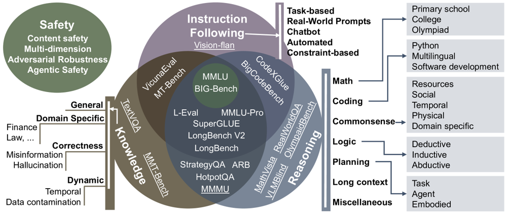

<!--Copyright © ZOMI 适用于[License](https://github.com/Infrasys-AI/AIInfra)版权许可-->

# 大模型验证评估的发展历程与趋势综述

> Author by: 冯思哲

!!!!!!
不要大模型，注意格式

## 引言与背景

人类对「智能」的探索由来已久。在人类领域，衡量智能的方法包括 IQ 测试、认知游戏、教育和职业成就等。然而，在信息时代，机器智能的崛起引发了新的关注：我们该如何评估以 LLM 为代表的机器智能水平？  

大型语言模型展现出前所未有的语言理解与生成能力，但其性能边界与潜在风险也带来了巨大不确定性。为了确保 LLM 的发展可控、安全且有益，建立全面评估体系势在必行。  

在早期自然语言处理（NLP）阶段，评估语言模型多依赖基础任务，如句法解析、词义消歧等。1990 年代的信息抽取 MUC 评测大会成为重要里程碑，推动了信息抽取的发展。此后，SNLI（自然语言推断）、SQuAD（机器阅读理解）等任务的提出，为性能评估和有监督训练提供了大规模数据。然而，这些评测大多面向单一任务，指标主要是准确率与 F1 分数。

## 通用评估基准的兴起

2018 年前后，随着 BERT 等大规模预训练模型的出现，社区开始探索多任务综合评估基准。  

GLUE 基准是其中的代表。它涵盖句子关系、语义相似、自然语言推断等九个任务，并通过平均分构建排行榜来比较模型表现。GLUE 发布不到一年，多数子任务的模型成绩便已超越人类平均水平。为保持挑战性，研究者随后提出了 SuperGLUE，引入了更复杂的语义消歧、多选问答和多轮对话任务，重新拉开模型与人类之间的差距。  

类似的尝试也出现在中文领域，如 CLUE 基准，特别加入了成语理解等与中文相关的特殊任务。与此同时，Facebook 推出的 Dynabench 平台则开创了动态评测模式。它通过人类与模型的对抗机制不断生成新测试样本，使得评测过程不再依赖固定的静态数据集，而是能够随模型能力演化不断更新。  

这一时期还涌现了许多面向特定领域的基准，例如对话系统的 Persona-Chat，或用于长文本理解的 LongBench。综合来看，多任务评测与动态更新逐渐成为预训练模型时代的重要趋势。

---

## 大型语言模型时代的评估转变
随着 GPT-3 等百亿级参数模型的诞生，语言模型展现出惊人的零样本与小样本学习能力。这种能力让传统的“任务导向”评测范式逐渐失效，研究重心转向更强调“能力导向”的框架。  

新的基准开始涵盖更广阔的能力范围。MMLU 集合了 57 门学科的多项选择题，用于考察知识与推理的结合能力；BIG-bench 则包含 200 多个任务，覆盖创造性推理与复杂技能边界；其中特别挑选出的 23 个高难度任务（BBH）则要求模型具备多步推理能力。研究显示，如果没有推理引导，LLM 在这些挑战上的表现远低于人类，但通过链式思考提示，部分模型能够显著提升，甚至超越人类平均水平。  

同时，LLM 的规模扩展带来了“涌现能力”现象：一些任务只有在模型规模达到一定阈值后才会突然表现出质的提升。这类非线性变化使得评估必须不断更新，才能捕捉到模型的新能力。  

在 ChatGPT 等对话式大模型流行之后，评估的关注点进一步扩展到对齐性和安全性。人们不仅关心模型“能否完成任务”，更在意其“是否合乎人类价值观和社会规范”。TruthfulQA 通过刁钻提问检测模型是否生成谬误知识，偏见与毒性测试则揭示了其潜在的社会风险；安全性评估则涉及鲁棒性、对抗攻击防御、滥用风险以及潜在的异常行为。至此，评估已经从单一的性能考察演变为能力、对齐与安全并重的多维体系。

---

## 背景与演进
从 GLUE 到 MMLU，从静态基准到动态评测，评估范式的演进见证了语言模型能力的迅猛提升。随着参数规模的爆炸性增长和应用场景的不断拓展，科学全面的评估不仅是量化性能的工具，更是指引模型迭代与应用方向的重要手段。  

然而，传统范式正面临瓶颈。一方面，顶尖模型在标准基准上已接近饱和，甚至超过人类水平，但在真实应用中仍可能出现失误。这种“评估失灵”揭示了高分与可靠性之间的断裂。另一方面，随着预训练语料的不断扩张，测试数据泄漏愈发常见，使得评估结果可能被“注水”。此外，静态测试难以模拟动态环境，而过于单一的评价指标也不足以刻画 LLM 复杂的能力画像。  

这些问题推动了评估方法在近年的加速演进。

---

## 新兴评估框架与方法
为了突破瓶颈，整体性评估理念逐渐形成共识。研究者强调，应将传统的性能指标与对抗性测试、解释性分析和领域专项挑战结合起来，从而对模型进行更全面的体检。  

例如，斯坦福大学提出的 HELM 框架从有用性、诚实性、无害性和可信度等多维度进行评估，力图建立更平衡的标准。Hugging Face 则推出 Evalverse，集成了多种方法，方便研究者一站式测试知识问答、推理能力与安全性。与此同时，能力导向的分类体系正在逐步取代任务导向的做法，将知识、推理、指令遵循和安全等核心能力划分为明确的评测维度。  

自动化评估同样正在兴起。研究者尝试利用动态数据自动生成新测试集，或通过“LLM 判官”为模型打分。这不仅提升了效率，也增加了覆盖面，但同时也带来新的偏差风险，需要通过校准来控制。  一个代表性的例子是 **OpenCompass**。由上海人工智能实验室牵头开发的 OpenCompass，整合了上百个数据集，覆盖自然语言理解、知识推理、生成能力和安全对齐等方面。它不仅提供统一的评测接口和可复现流程，还鼓励研究者接入新的任务与模型，从而形成开放共享的评估生态。与 GLUE 或 MMLU 等固定基准不同，OpenCompass 更强调灵活性和生态化，既能满足前沿研究的对比需求，也能服务产业界对可靠评测的要求。  

值得注意的是，评估对象也在拓展。随着 LLM 被用于复杂的代理（Agent）场景，评估不再局限于离线任务，而是需要在动态环境中检验模型的决策、记忆和工具使用能力。这种评估更像是在测试一辆汽车如何在各种路况下表现，而不仅仅是检验发动机的马力。

## 评估维度分类示意图

*图：面向 LLM 的能力驱动评估基准分类示意图，涵盖知识、推理、指令遵循与安全等维度。不同能力之间存在交互影响，体现了评估体系的多维属性。*
---

## 挑战与未来趋势
尽管评估方法不断革新，未来仍面临诸多难题。首先，如何避免“透题”始终是核心挑战。随着模型能力提升，固定的数据集很快就会被“学透”，导致结果失去参考价值。持续更新的动态评测框架因此显得尤为重要。  

其次，评估的全面性仍需加强。一个健全的体系不应只关注准确率，还必须兼顾安全、公平与鲁棒性。例如，提示绕过攻击已经成为衡量顶尖模型稳健性的标配指标，但如何系统地设计敌对环境并量化模型表现，仍在探索之中。  

最后，人类价值观的融入是更长期的任务。除了判断模型是否“能行”，人们还希望它“行得正”。Helpful–Harmless–Honest 等基准便是这一理念的体现，它通过比较不同回答与人类偏好的契合度，来检验模型是否真正对齐人类价值。未来，评估很可能会进一步结合人类反馈机制，让测试不仅停留在结果正确与否的层面，而是扩展到对社会责任和伦理规范的考量。  

可以预见，大语言模型的评估将不断演进，从静态走向动态，从单维走向多维，从人工走向自动化，最终成为保障技术健康发展的重要支柱。

---

## 总结与思考

大语言模型评估的历史，既是技术进步的缩影，也是价值取向的折射。从单一的准确率，到全面的能力、对齐与安全框架，评估方法的演变让我们得以更清晰地理解模型的边界与潜力。未来，科学、动态、可信的评估体系不仅是检验模型的工具，更将是引领人工智能发展方向的指南针。

## 参考与引用

!!!!!!!!!
补充参考的文章，一定要自己去看，而不是大模型生成。要自己去学习理解，总结成自己的思路。