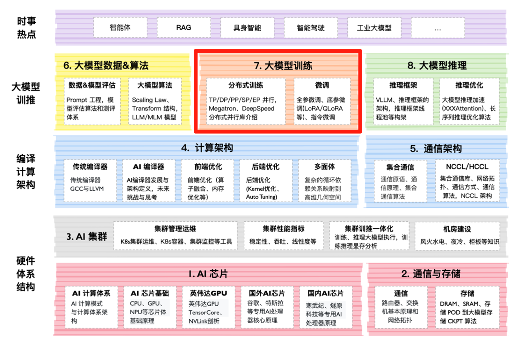

<!--Copyright © ZOMI 适用于[License](https://github.com/Infrasys-AI/AIInfra/)版权许可-->

# 大模型训练概述

大模型训练的核心特点在于大规模分布式训练和高效 AI 框架的协同。分布式训练通过数据并行、模型并行等技术，将计算任务分散到多个 GPU 或节点，显著提升训练速度与规模。AI 框架（如 PyTorch）提供分布式支持、混合精度计算和梯度优化，确保高效资源利用与稳定收敛。两者结合，使训练千亿级参数的模型成为可能，同时降低硬件成本与能耗。

## 课程位置

## 课程简介

- [**《1. 分布式并行基础》**](./01ParallelBegin/)：大模型分布式并行通过数据并行、模型并行和流水线并行等策略，将计算任务分布到多个设备上，以解决单设备内存和算力不足的问题。数据并行复制模型，分发数据；模型并行分割参数；流水线并行分阶段处理。混合并行结合多种方法优化效率，同时需解决通信开销和负载均衡等挑战，提升训练速度与扩展性。

| 大纲 | 小节 | 链接| 状态 |
|:-- |:-- |:-- |:--: |
| 分布式并行 | 01 分布式并行框架介绍  | [PPT](./01ParallelBegin/01Introduction.pdf), [视频](https://www.bilibili.com/video/BV1op421C7wp) | |
| 分布式并行 | 02 DeepSpeed 介绍  | [PPT](./01ParallelBegin/02DeepSpeed.pdf), [视频](https://www.bilibili.com/video/BV1tH4y1J7bm) | |
| 并行 实践 :computer: | CODE 01: CODE 01: 从零构建 PyTorch DDP | [Markdown](./01ParallelBegin/Code01DDP.md), [Jupyter](./01ParallelBegin/Code01DDP.ipynb), [文章](https://infrasys-ai.github.io/aiinfra-docs/04Train01ParallelBegin/Code01DDP.html) | :white_check_mark: |
| 并行 实践 :computer: | CODE 02: CODE 01: PyTorch 实现模型并行 | [Markdown](./01ParallelBegin/Code02MP.md), [Jupyter](./01ParallelBegin/Code02MP.ipynb), [文章](https://infrasys-ai.github.io/aiinfra-docs/04Train01ParallelBegin/Code02MP.html) | :white_check_mark: |

- [**《2. 分布式并行进阶》**](./02ParallelAdv/)：大模型分布式并行通过数据并行、模型并行和流水线并行等策略，将计算任务分布到多个设备上，以解决单设备内存和算力不足的问题。数据并行复制模型，分发数据；模型并行分割参数；流水线并行分阶段处理。混合并行结合多种方法优化效率，同时需解决通信开销和负载均衡等挑战，提升训练速度与扩展性。

| 大纲 | 小节 | 链接 | 状态 |
|:-- |:-- |:-- |:--:|
| 分布式并行 | 01 优化器并行 ZeRO1/2/3 原理  | [PPT](./02ParallelAdv/01DSZero.pdf), [视频](https://www.bilibili.com/video/BV1fb421t7KN) | |
| 分布式并行 | 02 Megatron-LM 代码概览  | [PPT](./02ParallelAdv/02Megatron.pdf), [视频](https://www.bilibili.com/video/BV12J4m1K78y) | |
| 分布式并行 | 03 大模型并行与 GPU 集群配置  | [PPT](./02ParallelAdv/03MGConfig.pdf), [视频](https://www.bilibili.com/video/BV1NH4y1g7w4) | |
| 分布式并行 | 04 Megatron-LM TP 原理  | [PPT](./02ParallelAdv/04MGTPPrinc.pdf), [视频](https://www.bilibili.com/video/BV1yw4m1S71Y) | |
| 分布式并行 | 05 Megatron-LM TP 代码解析  | [PPT](./02ParallelAdv/05MGTPCode.pdf), [视频](https://www.bilibili.com/video/BV1cy411Y7B9) | |
| 分布式并行 | 06 Megatron-LM SP 代码解析  | [PPT](./02ParallelAdv/06MGSPPrinc.pdf), [视频](https://www.bilibili.com/video/BV1EM4m1r7tm) | |
| 分布式并行 | 07 Megatron-LM PP 基本原理  | [PPT](./02ParallelAdv/07MGPPPrinc.pdf), [视频](https://www.bilibili.com/video/BV18f42197Sx) | |
| 分布式并行 | 08 流水并行 1F1B/1F1B Interleaved 原理  | [PPT](./02ParallelAdv/08MGPPCode.pdf), [视频](https://www.bilibili.com/video/BV1aD421g7yZ) | |
| 分布式并行 | 09 Megatron-LM 流水并行 PP 代码解析  | [PPT](./02ParallelAdv/08MGPPCode.pdf), [视频](https://www.bilibili.com/video/BV1hs421g7vN) | |
|:sparkling_heart:|:star2:|:sparkling_heart:| |
| 并行 实践 :computer: | CODE 01: ZeRO 显存优化实践 | [Markdown](./02ParallelAdv/Code01ZeRO.md), [Jupyter](./02ParallelAdv/Code01ZeRO.ipynb), [文章](https://infrasys-ai.github.io/aiinfra-docs/04Train02ParallelAdv/Code01ZeRO.html) | :white_check_mark: |
| 并行 实践 :computer: | CODE 02: Megatron 张量并行复现 | [Markdown](./02ParallelAdv/Code02Megatron.md), [Jupyter](./02ParallelAdv/Code02Megatron.ipynb), [文章](https://infrasys-ai.github.io/aiinfra-docs/04Train02ParallelAdv/Code02Megatron.html) | :white_check_mark: |
| 并行 实践 :computer: | CODE 03: Pipeline 并行实践 | [Markdown](./02ParallelAdv/Code03Pipeline.md), [Jupyter](./02ParallelAdv/Code03Pipeline.ipynb), [文章](https://infrasys-ai.github.io/aiinfra-docs/04Train02ParallelAdv/Code03Pipeline.html) | :white_check_mark: |
| 并行 实践 :computer: | CODE 04: 专家并行大规模训练 | [Markdown](./02ParallelAdv/Code04Expert.md), [Jupyter](./02ParallelAdv/Code04Expert.ipynb), [文章](https://infrasys-ai.github.io/aiinfra-docs/04Train02ParallelAdv/Code04Expert.html) | :white_check_mark: |

- [**《大模型训练加速》**](./03TrainAcceler/)：系统讲解大模型训练加速的核心算法与技术，涵盖计算优化（Flash Attention 的演进、DS GEMM 稀疏计算与 MTP 并行）、序列优化（Ulysses 多流调度与 Ring Attention 长序列处理）、内存优化（MLA 注意力机制与梯度检查点）、混合精度训练（FP8 表示与稳定性）以及通算融合（DeepSpeed-Domini 与 FLUX 的通信计算重叠）等关键方向，旨在通过原理剖析与实现细节全面了解如何提升大模型训练效率。

| 大纲 | 小节 | 链接 | 状态 |
|:--- |:---- |:-------------------- |:---:|
| 大模型训练加速 |   | [PPT](), [文章](), [视频]() | |
|:sparkling_heart:|:star2:|:sparkling_heart:| |
| 并行 实践 :computer: | CODE 01: Flash Attention 实现 | [Markdown](./03TrainAcceler/Code01FlashAtten.md), [Jupyter](./03TrainAcceler/Code01FlashAtten.ipynb), [文章](https://infrasys-ai.github.io/aiinfra-docs/04Train03TrainAcceler/Code01FlashAtten.html) | :white_check_mark: |
| 并行 实践 :computer: | CODE 02: 梯度检查点内存优化 | [Markdown](./03TrainAcceler/Code02GradCheck.md), [Jupyter](./03TrainAcceler/Code02GradCheck.ipynb), [文章](https://infrasys-ai.github.io/aiinfra-docs/04Train03TrainAcceler/Code02GradCheck.html) | :white_check_mark: |
| 并行 实践 :computer: | CODE 03: FP8 混合精度训练  | [Markdown](./03TrainAcceler/Code03FP8.md), [Jupyter](./03TrainAcceler/Code03FP8.ipynb), [文章](https://infrasys-ai.github.io/aiinfra-docs/04Train03TrainAcceler/Code03FP8.html) | :white_check_mark: |
| 并行 实践 :computer: | CODE 04: Ring Attention 实践 | [Markdown](./03TrainAcceler/Code04RingAttn.md), [Jupyter](./03TrainAcceler/Code04RingAttn.ipynb), [文章](https://infrasys-ai.github.io/aiinfra-docs/04Train03TrainAcceler/Code04RingAttn.html) | :white_check_mark: |

- [**《后训练与强化学习》**](./04PostTrainRL/)：大模型后训练与 RL 正从“辅助对齐手段”跃升为“塑造模型行为的核心引擎”。传统 SFT 已难以满足复杂人类偏好，以 RLHF 为代表的后训练技术，通过奖励建模与策略优化，使模型输出更安全、有用、符合价值观。DPO、KTO、IPO 等无需显式奖励模型的算法迅速崛起，大幅降低训练复杂度，提升稳定性与可复现性。同时，后训练正走向多目标协同：兼顾事实性、创造性、安全性与风格控制，并与在线学习、持续对齐、模型自我进化结合。RL 不再局限于 PPO，CPO、Reinforce++、GRPO 等新算法在样本效率与训练鲁棒性上持续突破。后训练，已成为大模型从“聪明”走向“可控、可信、可协作”的关键跃迁。

| 大纲 | 小节 | 链接 | 状态 |
|:--- |:---- |:-------------------- |:---:|
|  |  | [PPT](), [文章](), [视频]() |  |
|:sparkling_heart:|:star2:|:sparkling_heart:| |
| RL 实践 :computer: | CODE 01: 经典 InstructGPT 复现 | [Markdown](./04PostTrainRL/Code01InstructGPT.md), [Jupyter](./04PostTrainRL/Code01InstructGPT.ipynb), [文章](https://infrasys-ai.github.io/aiinfra-docs/04Train04PostTrainRL/Code01InstructGPT.html) | :white_check_mark: |
| RL 实践 :computer: | CODE 02: DPO 与 PPO 在 LLM 对比 | [Markdown](./04PostTrainRL/Code02DPOPPO.md), [Jupyter](./04PostTrainRL/Code02DPOPPO.ipynb), [文章](https://infrasys-ai.github.io/aiinfra-docs/04Train04PostTrainRL/Code02DPOPPO.html) | :white_check_mark: |
| RL 实践 :computer: | CODE 03: LLM + GRPO 实践  | [Markdown](./04PostTrainRL/Code03GRPO.md), [Jupyter](./04PostTrainRL/Code03GRPO.ipynb), [文章](https://infrasys-ai.github.io/aiinfra-docs/04Train04PostTrainRL/Code03GRPO.html) | :white_check_mark: |

- [**《大模型微调 SFT》**](./05FineTune/)：大模型微调正从“全参训练”的粗放模式，快速演进为“高效、可控、任务自适应”的精细化工程体系。2024 年以来，以 LoRA 为代表的参数高效微调（PEFT）已成工业标配，而 QLoRA、DoRA、PiSSA 等新方法进一步突破显存与表达力瓶颈，使 70B 级模型可在消费级 GPU 上微调。数据层面，合成指令（如 Evol-Instruct、Self-Rewarding）与课程学习策略大幅提升样本质量与训练稳定性。训练策略上，多阶段渐进微调、损失函数定制、梯度裁剪优化等技巧显著提升收敛效率与泛化能力。更重要的是，微调不再孤立，它正与 RLHF、DPO、模型编辑等对齐技术深度融合，构建“训练-对齐-评估”闭环。微调，成为释放大模型垂直领域的核心钥匙。

| 大纲 | 小节 | 链接 | 状态 |
|:--- |:---- |:-------------------- |:---:|
|  |  | [PPT](), [文章](), [视频]() |  |
|:sparkling_heart:|:star2:|:sparkling_heart:| |
| SFT 实践 :computer: | CODE 01: Qwen3-4B 模型微调 | [Markdown](./Code01Qwen3SFT.md), [Jupyter](./Code01Qwen3SFT.ipynb), [文章](https://infrasys-ai.github.io/aiinfra-docs/04Train05FineTune/Code01Qwen3SFT.html) | :white_check_mark: |
| SFT 实践 :computer: | CODE 02: LoRA 微调 SD | [Markdown](./Code02SDLoRA.md), [Jupyter](./Code02SDLoRA.ipynb), [文章](https://infrasys-ai.github.io/aiinfra-docs/04Train05FineTune/Code02SDLoRA.html) | :white_check_mark: |

- [**《大模型验证评估》**](./06VerifValid/)：大模型评估正从“单一指标打分”迈向“多维动态对齐”的新阶段。随着模型能力跃升，传统自动指标（如 BLEU、ROUGE）已难以反映真实语义与人类偏好，业界正转向以 GPT-4、Claude 等强模型作为裁判的自动化评估（如 AlpacaEval、MT-Bench），并结合多维度人工评测（有用性、安全性、事实性、风格一致性）。同时，评估范式从静态测试集走向动态对抗（如 HELM、Big-Bench Hard）、领域专项（医疗、法律、代码）和长上下文压力测试。近年来，评估更强调“对齐人类意图”与“价值观校准”，引入偏好一致性、幻觉检测、可解释性追踪等新维度。大模型评估，已不仅是性能度量，更是模型可信、可控、可落地的核心保障体系。

| 大纲 | 小节 | 链接 | 状态 |
|:--- |:---- |:-------------------- |:---:|
|  |  | [PPT](), [文章](), [视频]() |  |
|:sparkling_heart:|:star2:|:sparkling_heart:| |
| EVA 实践 :computer: | CODE 01: OpenCompass 评估实践 | [Markdown](./Code01OpenCompass.md), [Jupyter](./Code01OpenCompass.ipynb), [文章](https://infrasys-ai.github.io/aiinfra-docs/04Train06VerifValid/Code01OpenCompass.html) | :white_check_mark: |

> 希望这个系列能够给朋友们带来一些帮助，也希望 ZOMI 能够继续坚持完成所有内容哈！欢迎您也参与到这个开源课程的贡献！

## 课程知识

## 备注

文字课程开源在 [AI Infra](https://infrasys-ai.github.io/aiinfra-docs)，系列视频托管[B 站](https://space.bilibili.com/517221395)和[油管](https://www.youtube.com/@ZOMI666/playlists)，PPT 开源在[github](https://github.com/Infrasys-AI/AIInfra/)，欢迎引用！

> 欢迎大家使用的过程中发现 bug 或者勘误直接提交 PR 到开源社区哦！
>
> 请大家尊重开源和 ZOMI 和贡献者的努力，引用 PPT 的内容请规范转载标明出处哦！
