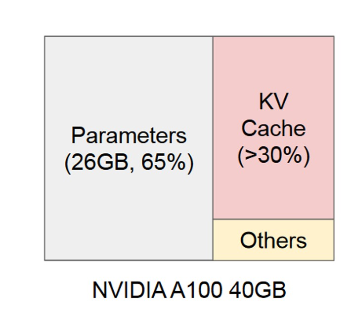
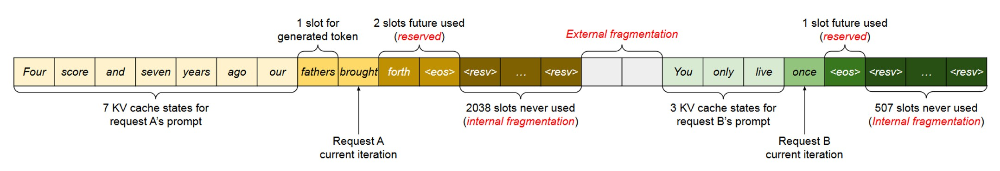
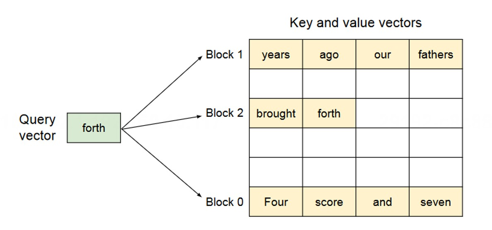
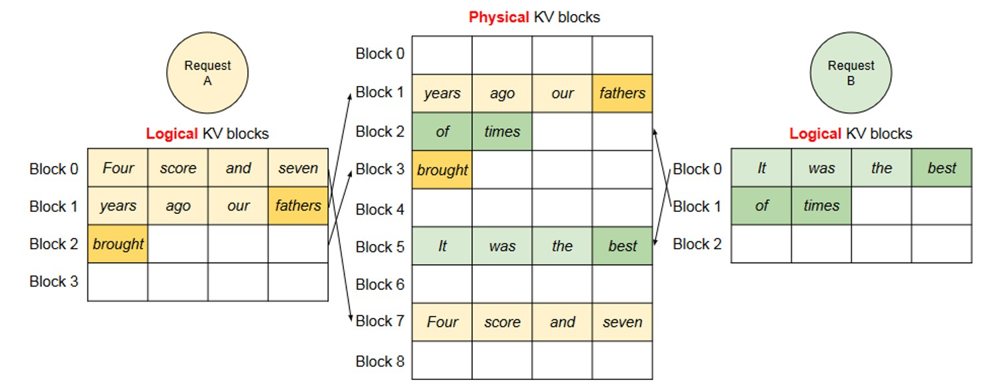
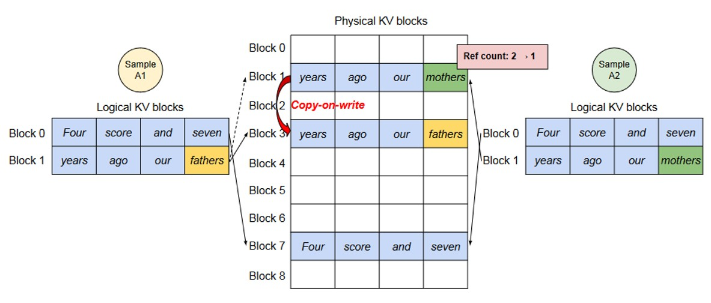
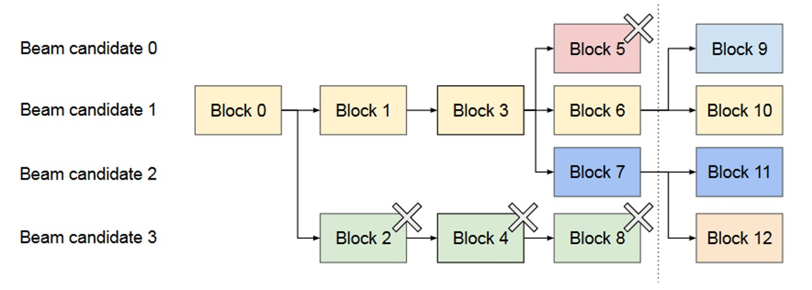
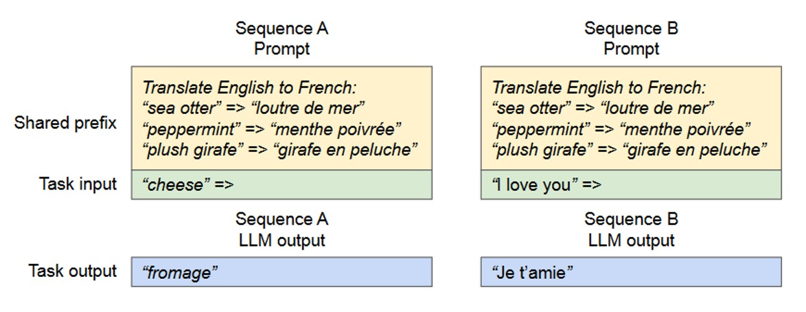
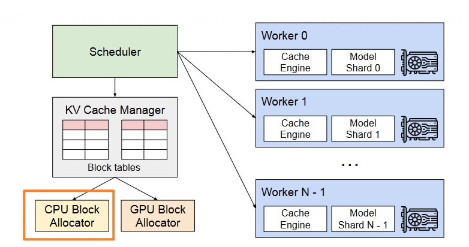
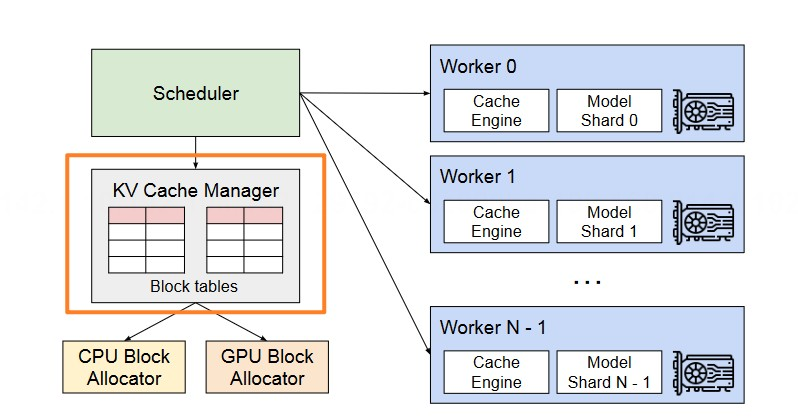

<!--Copyright © ZOMI 适用于[License](https://github.com/Infrasys-AI/AIInfra)版权许可-->

# Paged Attention 原理

> Author by: 张艺蓉


## 大模型推理的内存管理挑战

### 内存管理挑战

大模型推理中，处理推理请求的数量受到 GPU 内存容量的限制，也就是说，推理服务系统的吞吐量是 memory-bound，克服这个内存限制需要解决以下内存管理方面的挑战：

1. KV Cache 内存大。KV Cache 的大小随着请求数量的增加而迅速增长，如图所示，KV Cache 所占内存接近大模型参数的一半。
2. 复杂的解码策略。大模型推理有多种解码策略，每种算法对内存管理的影响各不相同。
3. 输入与输出序列长度未知。在大模型推理中，输入 prompt 与最终输出长度是不确定的。



### 常规内存管理方式与问题

大部分框架将同一个请求的 KV Cache 连续存储，按照`（batch_size, max_seq_len）`这样的的固定尺寸预先分配内存，这样的内存分配方式**会造成三类内存浪费**：

1. 为未来 Token 预留的空间。
   
2. 由于为潜在的最大序列长度过度预留而导致的内部碎片。
   
3. 由内存分配器导致的外部碎片。



## Paged Attention 原理

为了解决传统静态分配内存时造成的内存浪费问题，vLLM 项目创新性地提出了 PagedAttention 算法，动态地为请求分配 KV cache 显存，该算法的核心思想借鉴了操作系统中经典的虚拟内存和分页技术。具体来说，PagedAttention 将 KV Cache 的“块（Block）”类比为操作系统的“物理页（Physical Page）”，将“块表（Block Table）”类比为“页表（Page Table）”，而序列中的 Token 位置对应的“逻辑块索引”则好比是“虚拟地址”。

通过这种方式，PagedAttention 巧妙地将“逻辑上连续、物理上分散”的内存管理思想应用到了 GPU 显存上，带来了两大核心优势：消除外部碎片和实现细粒度的内存共享，从而显著提升了显存的利用率和系统的吞吐量。

### 操作系统虚拟内存概念

Paged Attention 的思想来源于操作系统中的虚拟内存与分页技术。因此我们先来简要回顾这一部分内容。

操作系统的虚拟内存机制为每个程序提供了一个巨大且连续的私有地址空间，这被称为“虚拟地址空间”。然而，在物理内存中，这些数据实际上被存储在**任意位置、不连续的物理页面（Physical Page）**中。


系统通过一个名为**页表（Page Table）**的核心数据结构来建立这两者之间的映射关系。页表就像一本地址翻译词典，记录了每个虚拟页面对应哪个物理页面。

这个机制带来了两大好处：

1. 消除外部碎片：由于数据可以被存储在任意可用的物理页面中，操作系统不再需要寻找一大块连续的物理内存。只要物理内存的总空闲量足够，程序就能运行，从而极大地提高了内存利用率。
2. 灵活的内存管理：数据可以在物理内存和硬盘之间轻松地“换入”（Page-in）和“换出”（Page-out），实现了远超物理内存容量的内存空间，并且可以实现高效的写时复制（Copy-on-Write）等高级功能。

这种“逻辑上连续，物理上分散”的核心思想，为我们解决其他领域的资源管理难题提供启发。

### Paged Attention 算法

在回顾了操作系统中的虚拟内存技术之后，我们再来看 paged attention 算法，它将操作系统中 “逻辑连续，物理分散” 的经典思想，迁移到了 GPU 显存管理这一场景，以此解决 KV Cache 带来的内存浪费问题。



PagedAttention 算法的核心内容如下：

- 它不再为每个序列预留一块庞大而连续的内存。相反，它将每个序列的 KV Cache 都划分为许多个固定大小的 “块”（Block）。每一个块都可以存储固定数量 Token 的 Key 和 Value 向量（例如，16 个 Token）。这些块在物理显存中可以存储在任意不连续的位置。
- 为了管理这种映射关系，PagedAttention 为每个序列引入了一个名为 “块表”（Block Table） 的数据结构。这个块表的作用，就如同操作系统中的“页表”，它维护着从序列的“逻辑块”到显存中“物理块”的映射。

接下来，让我们通过实际的推理示例，来直观地感受 PagedAttention 的完整工作流程。

#### 处理单个推理请求

如图所示，推理的请求 prompt 为“Four score and seven years ago our”。


首先是 Prefill 阶段【对应图中步骤 1】：

1. 划分逻辑块：针对拿到的 prompt 按照 block 大小划分逻辑块
   
2. 映射物理块：用一张块表（Block Table）记录逻辑块和物理块的映射关系（其中`Physical block number`表示映射关系，`# filled`表示物理块上被填满的槽位编号）

接下来是 Decode 阶段【对应图中步骤 2/3】：

1. 计算 attention，生成第一个 token fathers

2. 更新逻辑块，物理块和块表
   
3. 分配新的逻辑块和物理块：当 fathers 填入后，逻辑块 1 已经装满，需要开辟新的逻辑块 2，更新对应的物理块和块表

#### 同时处理多个推理请求

处理多个推理请求时与单个请求类似。如图所示，两个序列的逻辑块分别映射到不同的物理块，两个序列的相邻逻辑块在物理 GPU 内存中不需要连续，一旦一个请求完成，其 KV 块可以被释放以存储其他请求的 KV 缓存。




## 不同解码策略下的应用

在前面我们了解了 PagedAttention 原理的基本流程，但是在实际的大模型场景中，有很多更加复杂的解码策略，接下来我们将介绍 PagedAttention 在不同解码策略下的表现。

### 解码策略——Parallel Sampling

Parallel Sampling：LLM 对于一个 prompt 产生多个采样输出，用户可以从各种候选中选择自己喜欢的输出。



如图所示就是一个 parallel sampling 的例子。我们可以看到两个输出可以共享一个提示。我们自然可以想到可以让这些输出序列都共享输入的 prompt，来降低显存开销。PagedAttention 凭借其灵活的内存管理，通过**写时复制（Copy-on-Write, CoW）**实现了这一优化。

CoW 机制在 Parallel Sampling 中的应用可以分为两个阶段：
1. 最大化共享（Prompt 处理阶段）
在处理共同的 prompt 时，vLLM 并不会为两个输出序列分配不同的物理内存块。如图所示，它会让两个序列的逻辑块表都指向同一组物理块（图中的物理块 1 和物理块 7）。为了追踪一个物理块被多少个逻辑块所共享，系统会为每个物理块维护一个引用计数（reference count）。此时，物理块 1 的引用计数为 2。

1. 按需复制（Token 生成阶段）
在 Token 生成阶段，由于两个序列新产生的 token 不同，因此需要单独存储 KV 缓存。CoW 机制也正是在这个阶段发挥作用。
当 A1 需要将最后一个逻辑块（逻辑块 1 ）写入新 Token 的数据时，vLLM 识别到对应的的物理块 1 是共享的物理块（引用计数 > 1），vLLM 不会直接在原块上修改，而是会触发“写时复制”：系统会分配一个全新的物理块（图中的物理块 3），将原物理块（block 1）的内容完整复制过来，然后更新序列 A1 的块表，使其逻辑块 1 指向这个新的物理块 3，并将原物理块 1 的引用次数减 1。随后 A2 写入物理块 1 的时候，由于物理块 1 的引用计数已降为 1，故 A2 直接将新生成的 KV 缓存写入物理块 1 。

通过这种方式，只有在真正需要写入不同内容时，才会产生实际的内存复制和分配开销。通过在多个样本间共享物理块，大幅降低内存的使用，特别是在 prompt 非常长的情况。

### 解码策略——Beam Searching

Beam Search：在每个 decode 阶段，产生 top k 个 token（这里 k 也被称为束宽）。然后再把这 top k 个序列喂给模型，假设词表的大小为|V|，那么在下一时刻，就要在 k*|V|个候选者中再选出 top k，以此类推。束搜索在 LLM 中被广泛使用，因为它减轻了完全遍历的计算复杂度。



图中所展示的就是 k=4 的情况下的束搜索示例。我们可以看到，与并行解码不同的是，束搜索不仅可以共享初始提示块，还可以在解码过程中跨不同候选块共享其他块，而且共享模式随着解码过程的进行不断发生变化。

### 解码策略——Shared prefix

Shared prefix：在许多 llm 应用场景（例如翻译），用户会先提供任务的描述，然后再输入实际的任务，最终的 promt 是将任务描述与实际任务拼接起来。对于这种类型的应用，许多用户提示可以共享同一个任务描述的前缀。



如图所示是一个常见的翻译任务，不同用户的前缀都是描述翻译任务并给出示例，再之后的实际任务输入中每个用户的输入不同，再这种情况下，vllm 可以提前存储前缀的 KV 缓存（类似于操作系统中跨进程的共享库）。这样只需要实时计算用户的具体任务输入部分。

## 调度与抢占

上述章节讲述了如何使用 paged attention 是如何优化 kv cache 显存分配的，现在我们从 vllm 这个推理系统的角度，探究 vllm 时如何对推理请求进行调度的。

当有一堆请求来到 vllm 服务器上，vllm 首先需要有一个原则来安排以何种顺序执行这些请求，在 vllm 中，采用的是如下调度策略：

1. **先到的请求先服务（FCFS）**。保证了公平性并防止了饥饿。如有抢占的需要，后来的请求先被抢占。
2. **如有抢占的需要，后来的请求先被抢占**。LLM 的 prompt 可能在长度上有很大的变化，而最终的输出长度是未知的。

当我们采用动态分配显存的方式时，由于没有为每个 prompt 预留充足的显存空间，可能出现在某一个时刻，显存已经被打满，而此时所有的 prompt 都还没有做完推理的情况，为了推理服务能够继续运行下去，vllm 需要暂停这堆请求中最后到达的那些请求的推理，同时将它们相关的 KV cache 从 gpu 上驱逐。以便为更早到达的请求留出足够的 gpu 空间，让它们完成推理任务。vllm 采用的是 all-or-nothing 策略，即释放被抢占请求的所有块。

对于这些被抢占的任务，vLLM 需要在 gpu 充足时，重新恢复这些被驱逐的块。对此 vllm 设计了两种策略恢复被驱逐的块。

**Swapping（交换）**:这是大多数虚拟内存实现所使用的经典技术，它将被删除的页复制到磁盘上的交换空间中。对于这个任务，vllm**将被驱逐的块拷贝到 CPU 内存中**。如下图所示，除了 GPU 块分配器外，vLLM 还包括一个 CPU 块分配器，用于管理交换到 CPU RAM 中的物理块。等到 gpu 显存充足时，再将这些块从 CPU 中加载到 GPU 中。



**Recomputation（重计算）**：当任务被抢占时，我们也可以不做交换，直接在 GPU 中释放相应的 block，等到 GPU 显存充足时再重新开始推理。

**两种方式的比较**

vLLM 同时支持重计算和交换作为其恢复机制，那么实际运行时应该选择哪种策略？其关键的决定因素就是块大小。

交换的开销：这种策略的性能与块大小密切相关。当块设置得较小时，一次抢占任务就可能意味着会产生大量微小的 CPU-GPU 数据传输。这种零碎的传输方式无法充分利用 PCIe 的带宽，导致换入换出的开销变得非常高昂。

重计算的开销：相比之下，重计算的开销与块大小基本无关。因为它只是放弃了 KV Cache 并从头开始重新计算，不涉及数据拷贝，其开销在不同的块大小下都保持相对稳定。
基于以上特性，vLLM 的选择策略如下：

1. 当块较小时：重计算的效率显著高于交换，是更优的选择。
2. 当块较大时：交换的优势开始体现。因为此时单次数据传输量足够大，能有效利用带宽，其开销会低于重计算整个长序列的成本。


## 分布式场景内存管理

随着模型规模的急剧增长，单张 GPU 已无法容纳整个 LLM 的参数。因此，必须采用**模型并行（Model Parallelism）**技术，将模型切分到多张 GPU 上协同工作。这就需要一个能够处理分布式内存的内存管理器。

vllm 因此设计了一个调度器，其核心思想可以概括为：“中心化内存管理，分布式计算执行”。具体设计如下：



- 如图所示，vllm 中有一个中央 KV Cache 管理器，负责计算和管理每张卡上 KV Cache 逻辑块到物理块的映射表。
- 所有 GPU Worker 共享映射关系：调度器会将为请求分配好的块表广播给所有参与计算的 GPU。每张 gpu 接收到相关信息后，负责管理自己 gpu 上的 KV 块。

## Attention 算子适配

PagedAttention 通过分页机制巧妙地管理内存，但也引入了一个严峻的挑战：逻辑上连续的 KV Cache，在物理上却分散存储。传统 Attention 算子是为处理大块连续内存而设计的，如果直接让它去读写这些分散的物理块，会导致大量的随机、零碎的内存访问，GPU 将无法发挥其强大的并行计算能力，性能会严重下降。

为了解决这个问题，vLLM 重新设计了 Attention 算子，使其直接适配这种非连续的内存布局。

这其中最核心的改动，就是让 Attention Kernel 能够像 CPU 访问虚拟内存一样，按块地读取和计算。
### PagedAttention Kernel 核心思想
Attention 计算可以简化为大的矩阵乘法 $output = softmax(Q @ K.T) @ V$。但在 PagedAttention 中，由于 K 和 V 是由许多不连续的块组成的，这个大矩阵乘法被拆解了。

PagedAttention Kernel 的核心思想是，将这个单一的大型操作分解为一个在小数据块上进行的迭代过程。对于批次中的每一个查询向量 q，算子会：
1. 获取块表（Block Table）: 首先，根据该查询向量 q 对应的序列，查找其块表。块表记录了存储该序列的 K 和 V 缓存的所有物理块的索引。

2. 迭代计算: 接着，算子会遍历块表中的每一个物理块。在每次迭代中，它从全局的 KV Cache 中加载一个 K 块和一个 V 块。然后，将查询向量 q 与这个 K 块计算注意力分数

3. 在线 Softmax 与加权求和: 为了避免存储完整的注意力分数矩阵，算子采用在线（Online）Softmax 的思想。在处理每个块时，它会实时更新用于 Softmax 归一化的统计量（最大分数值和指数和），并根据当前块的注意力概率，对 V 块进行加权求和，将结果累加到一个中间输出向量中。

因为 PagedAttention 算子迭代了多个版本，本文的重点在于核心的 PagedAttention 算子的思想，因此忽略了算子的实现细节，用下面的伪代码
简要描述 PagedAttention Kernel 的流程：
```python
# PagedAttention Kernel 伪代码描述
# 输入：
# Q: [num_queries, head_dim]，查询向量
# KV_Cache: 存储所有 K, V 块的物理内存
# Block_Tables: [num_queries, max_blocks_per_seq]，每个序列的物理块索引表

function PagedAttention(Q, KV_Cache, Block_Tables):
    # 初始化输出张量
    Output = zeros_like(Q)

    # 对每个查询向量并行计算
    for each query q_i in Q:
        # 获取当前查询对应的物理块索引
        block_table_for_q_i = Block_Tables[i]

        # 初始化在线 Softmax 所需的统计量
        # m_i: 当前最大注意力分数
        # l_i: 当前 Softmax 归一化分母的累加值
        # o_i: 当前累加的输出向量
        m_i = -infinity
        l_i = 0.0
        o_i = zeros(head_dim)

        # 遍历序列的所有物理块
        for each block_idx in block_table_for_q_i:
            # 从物理内存中加载 K, V 块
            K_block = KV_Cache.get_K(block_idx)
            V_block = KV_Cache.get_V(block_idx)

            # 计算块内注意力分数
            S_ij = q_i @ K_block.T

            # 在线更新 Softmax 统计量
            # 1)寻找新的全局最大分数
            m_ij = max(S_ij)
            m_new = max(m_i, m_ij)

            # 2)根据新的最大分数，重新缩放之前的累加值
            P_ij = exp(S_ij - m_new)
            l_i = l_i * exp(m_i - m_new)
            o_i = o_i * exp(m_i - m_new)

            # 3)累加当前块的统计量
            l_new = l_i + sum(P_ij)
            o_i = o_i + P_ij @ V_block

            # 4)更新统计量
            m_i = m_new
            l_i = l_new

        # 最终归一化得到输出
        Output[i] = o_i / l_i

    return Output

```


### 其他配套优化

除了这个核心的 Attention Kernel，vLLM 还实现了一系列融合（Fused）操作来减少开销：

1. 融合的 KV Cache 写入：在每个生成步骤后，新计算出的 Key 和 Value 需要被写入指定的物理块。vLLM 将数据重塑、切分和写入等多个步骤融合为一个单一的 GPU Kernel，避免了多次启动开销。
2. 批处理的写时复制（CoW）：当需要复制序列时（如 Beam Search），可能要同时拷贝多个分散的物理块。vLLM 实现了一个批处理拷贝 Kernel，能将多个独立的拷贝请求打包成一次 GPU 任务，极大提升了效率。

## 小结与思考

大模型推理服务面临的核心挑战在于 GPU 显存管理。常规的内存管理方式通常采用静态预分配，为请求预留一块连续的、固定尺寸的内存空间，但这种方式因其固有的内部与外部碎片问题，会造成严重的内存浪费，直接限制了推理系统的吞吐量。为解决这一问题，vLLM 框架中提出的 PagedAttention 算法，借鉴了操作系统中经典的虚拟内存与分页技术。该算法将 KV Cache 划分为固定大小的“块（Block）”，并为每个序列维护一个“块表（Block Table）”，以此来管理逻辑块到物理块的映射关系。这种“逻辑上连续，物理上分散”的管理方式，从根本上消除了外部内存碎片，并为并行采样、前缀共享等复杂解码策略提供了细粒度的内存共享基础。基于 PagedAttention 算法及配套的定制化算子，vLLM 框架显著提升了显存的利用率和系统的吞吐量，在多种应用场景下表现出色。

## 引用与参考

- https://zhuanlan.zhihu.com/p/691038809
- https://arxiv.org/pdf/2309.06180
- https://zhuanlan.zhihu.com/p/673284781
