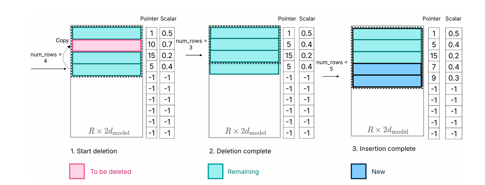

# LLM IN FLASH

Author by: 于佼良

大模型在资源受限的场景下如何高效运行，是端侧场景始终关注的一个重要课题。这篇来自苹果的论文，主要就在讨论当端侧 dram 大小不足以支撑大模型执行时，如何高效的借用 flash 来完成推理。下面展开一下这篇论文的相关内容。

### 一、flash 与大模型推理
#### 1、现状
以手机为例，在大模型的推理场景中，主要会涉及到三个“存储空间”，分别为 flash，dram 以及 npu 自带的片上缓存，如下图所示。

在模型没有被拉起执行的时候，模型与权重文件都会存放在flash上；如果模型被拉起执行，那么模型与权重就会被加载到dram上，这时一个7b的模型，如果参数量化为fp16，那么把它全部加载进dram就需要占用超过14G的内存，这对于手机来说是难以承受的，毕竟大部分手机的内存只有12G或者16G，当然现在端侧有更极端的压缩方式，来降低模型的大小，但是dram总是显得非常昂贵，所以越少占用，总是越好。

### 二、从flash加载模型
回到本文的主要课题，dram不能满足模型推理所需的时候，需要借助flash来存放权重数据， 那同时关于数据搬运的开销，从flash到dram的时延远远大于从dram到npu。如何降低从flash加载模型的时延是本文的重点。主要手段如下：

#### 1、减少数据传输
首先第一个优化方案是减少数据的传输。因为有一些模型的ffn会体现出稀疏性，例如早先的opt 6.7B和falcon 7B在ffn都体现出了激活的稀疏性。
那对于这种体现出稀疏性的权重，仅仅需要把其中的部分从flash加载到dram即可。
为了识别到稀疏激活中被置零的元素，本文构造了一种预测器，只需要当前层的注意力模块的输出作为输入，可以预测出非零元素进行加载，以此减少对于激活数据量的加载。

#### 2、滑动窗口
这里的滑动窗口原文理解起来比较困惑。首先提到了一个“激活的神经元”这样的概念，所谓的神经元就是一个线性计算的单元，那么在一个matmul计算中， 我们可以认为这样认为：
$$ y_i = W_i *x $$

这样的一个权重行就是一个神经元，那么所谓“激活的神经元”，是指它们在FFN的最后输出中为正，即它们的输出对最终的结果有意义。

ok，搞明白这个概念，接下来是这个窗口如何滑动。假设固定一个窗口k，那么当前dram中存放的就是这k个token在计算时对应的“激活的神经元”的权重，接下来第k+1个token出现的时候，需要把它对应的“激活的神经元”的权重加载进dram，并把第一个token对应的部分滑出去。注意，这里还会有一个情况是，连续的token之间，会有重复的“激活的神经元”，所以每次加载的权重数量并不多，且是增量加载的方式进行。示意图如下：

#### 3、DRAM的内存管理优化
尽管在dram内部的数据传输比flash->dram要高效很多，但是仍然有比较昂贵的开销，尤其是数据量比较大的时候，数据的拷贝和重排。为了优化这部分的开销，本文采用的方案是：
    * 先预分配一个特定尺寸的内存
    * 通过预测手段快速识别到不再被需要的神经元数据，标记为待删除
    * 用最后“一行”的数据覆盖待删除的“一行”数据
    * 把要append的新数据，放到当前内存块的结尾

总体来说，通过预分配，覆盖待删除数据，追加新数据的方式，保证dram中的权重数据，在删除和新增的时候，保证较低的时间复杂度和良好的内存连续性，保证对dram读写的高效。
