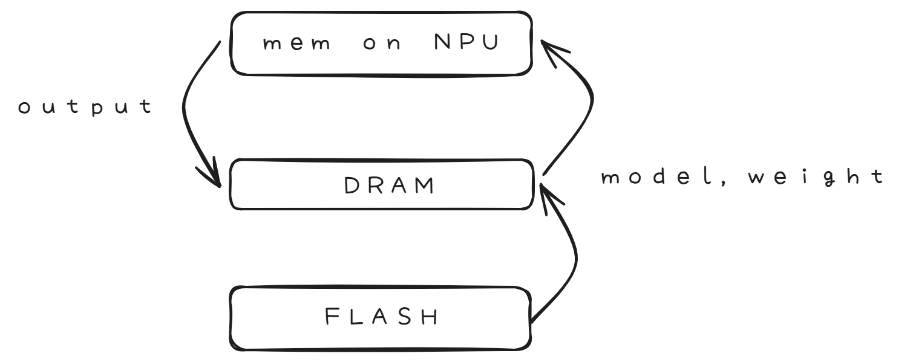

# LLM IN FLASH

Author by: 于佼良

大模型在资源受限的场景下如何高效运行，是端侧场景始终关注的一个重要课题。这篇来自苹果的论文，主要就在讨论当端侧dram大小不足以支撑大模型执行时，如何高效的借用flash来完成推理。下面展开一下这篇论文的相关内容。

### 一、flash与大模型推理
#### 1、现状
以手机为例，在大模型的推理场景中，主要会涉及到三个“存储空间”，分别为flash，dram以及npu自带的片上缓存，如下图所示。

在模型没有被拉起执行的时候，模型与权重文件都会存放在flash上；如果模型被拉起执行，那么模型与权重就会被加载到dram上，这时一个7b的模型，如果参数量化为fp16，那么把它全部加载进dram就需要占用超过14G的内存，这对于手机来说是难以承受的，毕竟大部分手机的内存只有12G或者16G，当然现在端侧有更极端的压缩方式，来降低模型的大小，但是dram总是显得非常昂贵，所以越少占用，总是越好。