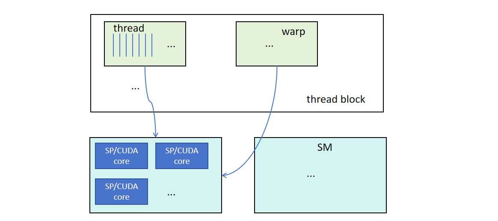
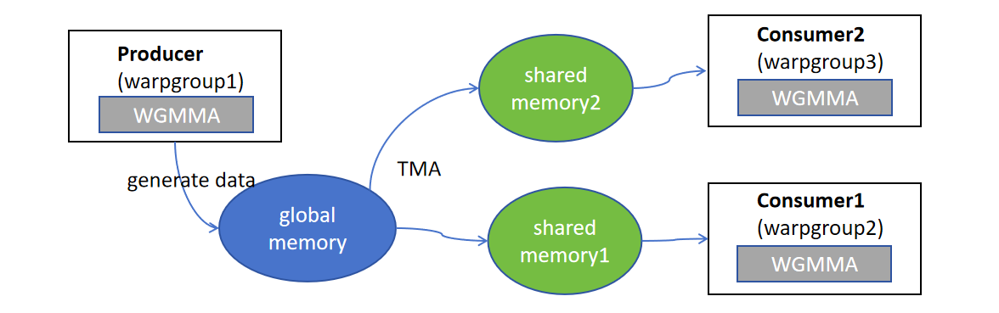
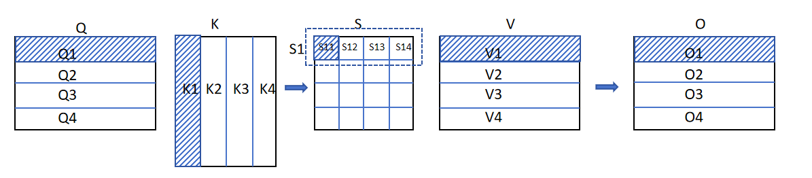
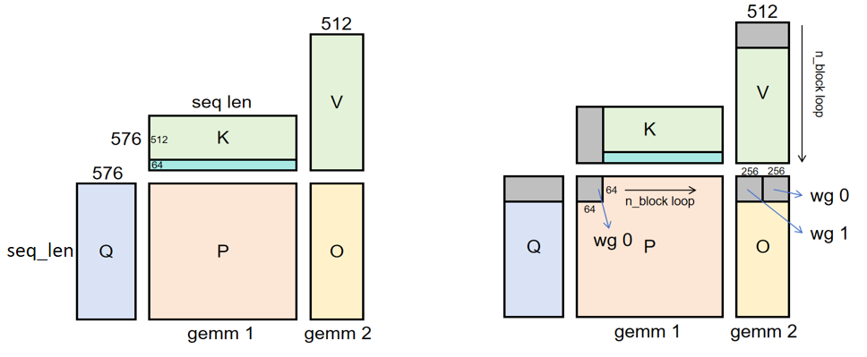
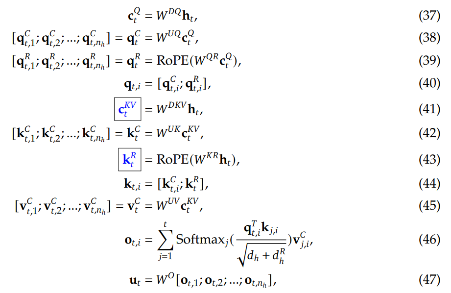

# FP8 flashMLA 原理解读

DeepSeekV2 技术报告中提出了一种新的 attention 计算方法，叫做 multi-head latent attention，简称 MLA，可以减少 KV Cache 缓存和计算量，MLA 对应的 FlashAttention 就叫做 FlashMLA。本文重点讲解 FlashMLA 的工作原理，不了解 MLA 的同学可以先参考[这个链接](https://zhuanlan.zhihu.com/p/1945942669441343674)进行学习。

## 1. flashAttention 原理回顾

FlashAttention 是 Tri Dao 等人于 2022 年提出的一种高性能 attention 计算方法，现在是 transformer 模型必不可少的组成部分。截至到目前，FlashAttention 包含 V1、V2、V3 三个版本，FlashMLA 采用的计算流程就是 V3 版本，V3 版本实际上是基于 Hopper 架构的编程模式而设计的。现在网上有很多写的比较清晰的博客：[V1 版本](https://blog.csdn.net/qq_41913559/article/details/146318915?spm=1001.2014.3001.5506)、[V2 版本](https://blog.csdn.net/weixin_42924914/article/details/142496358?spm=1001.2014.3001.5506)、[V3 版本](https://blog.csdn.net/xuebinding/article/details/151676334?spm=1001.2014.3001.5506)，想详细了解的同学可以参考学习。

### 1.1 Hopper GPU 架构编程模式简介



上图是 GPU 的软硬件基本单元。在硬件方面，最基础的计算单元是 CUDA core，也叫 SP（Streaming Processor），SP 包含计算单元（ALU、FPU 等）和寄存器。多个 SP 组成一个 SM（Streaming MultiProcessor），一张 GPU 卡有多个 SM。

在软件方面，最基本的执行单位是 thread。多个 thread 组成一个 warp，每个 warp 中的 thread 可以同时执行相同的指令，从而实现 SIMT（单指令多线程）并行。warp 是 SM 的最小调度单位（the smallest scheduling unit on an SM），一个 SM 可以同时处理多个 warp。

多个 warp 又组成 1 个 thread block。同一个 block 中的 thread 可以同步，也可以通过 shared memory 进行通信。thread block 是编程人员进行线程组织和协作的基本逻辑单位。

基于上面的结构，Hopper 之前的 Ampere 的编程模型采用以 warp（32 线程）为核心的编程模型，程序员需要手动管理数据在全局内存与共享内存之间的移动，通过频繁的线程块内同步来协调计算与数据访问，并依赖 warp 级的 Tensor Core 指令（WMMA）进行矩阵计算，这种模式要求开发者精细地控制资源分配和数据流以实现计算与内存操作的局部重叠。而 Hopper 架构引入了**Producer-consumer 编程模式**，示意图如下：



首先，每个 producer、consumer 都是一个 warpgroup，4 个 warp 组成一个 warpgroup。与之对应的，软件层面提供了**WGMMA** (Warpgroup-level Matrix Multiply)，WGMMA 相比于 WMMA 能处理更大 shape 的矩阵计算。Hopper 架构在硬件层面增加了**TMA (Tensor Memory Accelerator)**，每个 SM 配备一个 TMA 单元。TMA 具备将数据从全局内存高效地传输到多个 SM 的共享内存的能力，这种操作被称为“多播”。producer 一般负责调用 TMA 将矩阵分片从全局内存传输到共享内存，然后 consummer 调用 WGMMA 进行计算。当然，有时候 producer 也会调用 WGMMA 进行计算。Producer-consumer 编程模式可以让 producer 和 consumer 进行异步并行计算，提升执行性能。我们将在第 2 部分解释如何把这些功能应用在 flashMLA 的计算流程中。

### 1.2 flashAttention 矩阵计算切分策略

基础的 attention 计算过程如下：

① 把 Q 矩阵和 K 矩阵从 HBM 加载到 SRAM（共享内存和寄存器）；

② 计算出 ${S=QK^T}$，把 S 写回 HBM；

③ 把 S 加载到 SRAM，计算 P=softmax(S)；，把 P 写回 HBM；

④ 把 P 和 V 加载到 SRAM，计算 O=PV，把 O 写回 HBM；

⑤ 返回 O。

上面过程中，涉及多次 HBM 和 SRAM 之间的数据传输，当 Q、K、V 的 shape 很大时，数据传输耗时会非常大。

flashAttention 的思想就是把各个输入切片后，在 SRAM 里面完成切片数据的 S、P 以及 O 的计算，直接把切片数据对应的 O 返回给 HBM，这样每组切片数据的计算只涉及 1 次 HBM 和 SRAM 之间的来回传输。flashAttentionV3 的切分计算逻辑如下（以切分成 4 份为例）：



```python
for i in [1, 2, 3, 4]:
    Q = Q_i
    O_i = torch.zeros(Q)
    for j in [1, 2, 3, 4]:
        S_ij = Q*K_j
        O_i += S_ij*V_j
```

在上面的伪代码中，Q 的循环处于外部，K 和 V 的循环处于内部，所以我们把这种切分计算策略叫做“Q 外循环，K、V 内循环”。而且 O 的每块分片的计算可以并行处理，例如我们可以把 Q1 和 K、V 都发送给 warpgroup1 处理，得到 O1；把 Q2 和 K、V 都发送给 warpgroup2 处理，得到 O2，等等。

细心的同学可能发现了，我们没有把 P=softmax(S)画上去，主要原因是在上面伪代码的 j 循环中，我们每次算出 $S_i$ 的一部分后，就要立马和 $V_j$ 相乘。而计算 softmax 是要按整行的值来计算的，也就是`softmax(S1)=F.softmax(x, dim=-1)`。为了解决这个问题，研究人员提出了 softmax 在线计算方法。

### 1.3 online softmax 计算方法

online softmax 允许把整行的数据分段，每次只计算一小段数据的 softmax，并且在计算新的小段数据的 softmax 值时，对之前计算的小段数据的 softmax 值乘上一个标量进行更新，使得算完最后一小段数据的 softmax 值后，各小段数据的 softmax 值和整行计算方式对应的 softmax 值相等。

举个简单的例子进行说明。

假设现在只有 1 段数据：$X_1={[x_1,x_2, ..., x_n]}$，那么它的 softmax 操作应该如下进行：

首先计算最大值：$X_{1}^{max}=max(X_1)$，并且把当前最大值记作 $max_1$；

然后进行指数归一化：$exp(X_{1})=torch.exp(X_{1}- max_1)$，这一步通常是为了防止下一步求和的时候溢出；

再进行 softmax，我们把归一化之后的序列之和记作 $l_1$，也就是 $l_1=sum(exp(X_{1}))$，那么 $softmax(X_{1})=exp(X_{1})/l_1$；

现在又来了一段数据，$X_2={[x_{n+1},x_{n+2}, ..., x_{2n}]}$，我们现在想求 $X_1$ 和 $X_2$ 一起组成的序列的 softmax 值，但此时没有 $X_1$，那么我们可以怎么做呢？可以如下进行：

1，首先同样计算 $X_2$ 的最大值：$X_{2}^{max}=max(X_2)$；

然后和 $X_1$ 的最大值进行比较，获取合并序列的最大值：$max_2=max(max_1,X_2^{max})$；

2，然后进行指数归一化：$exp(X_{2})=torch.exp(X_{2}- max_2)$；

$X_1$ 的指数归一化理论上也可以写成 $exp(X_{1})_{new}=torch.exp(X_{1}- max_2)$，但在实际的计算过程中，此时我们已经没有 $X_1$ 的数据了，所以我们要基于之前的计算结果进行更新：$exp(X_1)_{new}=exp(X_1)*torch.exp(max_1-max_2)$;

3，计算 softmax：首先更新当前总序列的和，$l_2=l_1*torch.exp(max_1-max_2)+sum(exp(X_2))$，$softmax(X_{2})=exp(X_{2})/l_2$；

同样的，$X_1$ 的 softmax 也要更新：$softmax(X_{1})_{new}=exp(X_{1})_{new}/l_2$;

我们可以比较一下 $softmax(X_{1})_{new}$ 和 $softmax(X_{1})$:$softmax(X_{1})_{new}/softmax(X_1)=torch.exp(max_1-max_2)*l_1/l_2$。

可以发现，我们计算完 $X_1$ 后，只需要保存好序列的最大值 $max_1$ 和序列之和 $l_1$；然后在计算第二段数据的时候，把 $max_1$ 和 $l_1$ 更新成 $max_2$ 和 $l_2$，就可以根据这些参数调整之前计算的 $softmax(X_1)$ 的值，得到 $X_1$ 部分在合并序列中的 softmax 值。

以此类推，如果后面还有新片段数据加入，我们同样只需要维护 $max$ 和 $l$，就可以调整之前计算好的 softmax 值，保证结果的正确性。

[aiInfra 项目](https://github.com/Infrasys-AI/AIInfra.git)的`04Train\03TrainAcceler\Code01FlashAtten.md`文件给出了 flashAttentionV3 的切分策略和 online softmax 的仿真代码，推荐大家学习一下。

## 2. flashMLA 工作原理

好的，由于 flashMLA 采用的也是 flashAttentionV3 的切分算法，接下来我们看一下 flashMLA 的计算流程。

我们借用[这篇文章](https://zhuanlan.zhihu.com/p/26080342823)的一张图来说明：



上图左边是 MLA 的原始计算任务，右边表示切分计算图，和 1.2 章节大体是一致的。

我们先看左边，gemm1 是 QK 乘法，gemm2 是 PV 乘法。回忆一下 MLA 的计算公式：



q、k、v 分别是 $q_{t}=[q_{t}^C;q_{t,}^R],k_{t}=[k_{t}^C;k_{t}^R],v_t^C=W^{UV}c_t^{KV}$，由于 k 的前面部分 $k_{t}^C=W^{UK}c_t^{KV}$，而且在计算的过程中，$W^{UV}$ 和 $W^{UK}$ 可以被吸收（不清楚“吸收”含义的同学可以学习[这个链接](https://zhuanlan.zhihu.com/p/1945942669441343674)）。所以实际上在计算的时候，只需要让 $k_{t}^C=c_t^{KV},v_{t}^C=c_t^{KV}$ 即可，这也是为什么左图 k 和 v 是用同一个颜色表示，K 青色的部分代表的是 $k_t^R$。

再看右边，表示 flashMLA 的切分计算过程，其切分计算流程和上面介绍的 flashAttentionV3 是一样的。Q 处于外循环，K 和 V 处于内循环。而且这里有一个不同就是在计算 $P_{i,j}*V_i$ 的时候，拆成了 2 部分计算，得到 $O_i$ 的 2 个小灰块。接下来我们看一下在 Hopper 架构中，这些计算过程是怎样异步配合的：回忆 1.1 章节，我们提到了 producer-consumer 模式，应用到这里来，在计算图中 O 的灰块切片过程中，wg0(全称是 warpgroup 0)就是 consumer，wg1 就是 producer。wg1 的任务一方面是加载 Q 片段、K/V 片段，一方面是计算 gemm2 的一部分；wg0 的任务一方面是计算 gemm1 和 softmax，一方面是计算 gemm2 的一部分。下面描述 producer 和 consumer 的执行活动：

① 任务启动，wg1 把 Q 分块（灰色部分）和 K/V 分块（灰色部分）加载到共享内存中；

② wg0 使用 Q 分块和 K 分块计算 gemm1，接着计算 softmax，并把结果保存在共享内存中。注意，Q 分块加载后，会一直保留在共享内存中，直到 n_block_loop 次循环结束。

③ wg0 和 wg1 使用 softmax 的结果计算 gemm2；

④ wg1 把 K/V 的第 2 个分块加载到共享内存中；

⑤ wg0 使用 Q 分块和 K 分块计算 gemm1，接着计算 softmax，并把结果保存在共享内存中；

⑥ wg0 和 wg1 使用 softmax 的结果计算 gemm2；

以此类推，直到 n_block_loop 次循环结束。

需要注意的是。wg0 和 wg1 是异步执行的，除了有数据依赖的步骤需要插入同步标志（比如 wg1 必须加载 q、k、v 之后，wg0 才能计算基于这几个分片计算 gemm1，以及只有 wg0 计算完 softmax，wg1 才能计算 gemm2），其他步骤是可以异步执行的，比如 wg1 加载完 K/V 的第一个分块后，不需要等 wg0 算完 gemm1，就可以立马加载第 2 个分块；比如 wg0 计算完第一组分块的 softmax 之后，就可以立马计算第二组分块的。这个过程实际上可以看出 n_block_loop 维度的 pipeline 流水并行。

## 3. FP8 flashMLA 实现

flashMLA 中的 GEMM 是算力的主要消耗点，使用 fp8 代替 fp16/bf16 计算不仅可以降低计算量，还能降低显存，提升每次计算的 batch_size/seq_length。目前，deepseek 公布的资料中，flashMLA 只支持 bf16/fp16 的 WGMMA 计算，而摩尔线程([开源代码仓 MUTLASS](https://github.com/MooreThreads/mutlass/tree/68f1bf1806f5435246518bbeecd3aa810704e3ae))实现了 fp8 数据类型的计算，包括`mp31_fp8_gemm`和`fp8_scaling_gemm`。接下来我们参考它的进行介绍。

mutlass 采用的 fp8 是 e4m3_t 格式，如果用 $x=(-1)^S*1.m*(2^e-bias)$ 表示的话，S 就是 1 位二进制，e 是 4 位二进制，m 是 3 位二进制，偏移量一般是 7。能表示的最大值是 $(1+2^{-1}+2^{-2})*2^{15-7}=448$。FP8 E4M3 不遵循 IEEE754 标准，其在指数全为 1 时仍然可以表示有效数字，当且仅当指数与底数部分全为 1 时，其表示无穷大（NaN）。

`mp31_fp8_gemm`的输入是 fp8 格式的 A 矩阵和 B 矩阵，在分块计算过程中，会进行 fp8 矩阵乘法，并把结果以 fp32 的格式进行累加。

`fp8_scaling_gemm`比`mp31_fp8_gemm`多几个步骤，引入了 按块缩放（block-wise scaling） 技术，用于在 FP8 下维持数值稳定性。计算流程如下：输入 A、B 进行缩放，再量化成 fp8，再进行 Gemm 计算（fp32 累加），最后缩放会原来的尺度。


