<!--Copyright © ZOMI 适用于[License](https://github.com/Infrasys-AI/AIInfra)版权许可-->

# Continuous Batching 原理

Author by: 陈宇航，程治玮

## Batching 技术的演进

在大规模语言模型（LLM）推理系统中，批处理（Batching）技术是提升系统性能的核心支柱。它通过将多个推理请求聚合处理，显著提高 GPU 利用率、增加吞吐量（Throughput）、降低平均延迟（Latency）和整体成本。批处理是计算机系统中的基础技术，从 SSD 的写入合并到 TCP 的 Nagle 算法，其身影无处不在，**核心思想在于通过将负载请求选择性地分组执行，更高效地利用资源**。

Batching 技术并不是推理引擎独有的，在训练的过程中就需要对训练样本进行 batching 操作，从而提升 GPU 的利用率，最终提高训练吞吐，加速大模型的训练过程，Batching 技术可以看作是在硬件层面为了提升 GPU 利用率而必须要使用的技术。

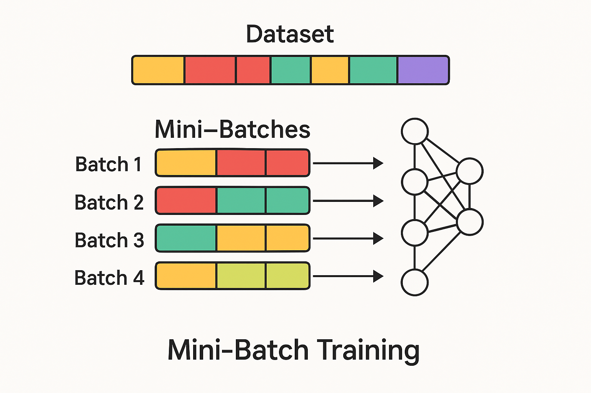

训练过程中的 Batching 方法，其实就是早期推理引擎中使用的静态批处理方法。**为什么在训练的过程中，对训练样本一批一批处理，一批一批训练的方法使用的如此自然呢？从开头我们提到的提升资源利用率出发，进一步我们需要考虑特定任务情况下的实际负载情况**。

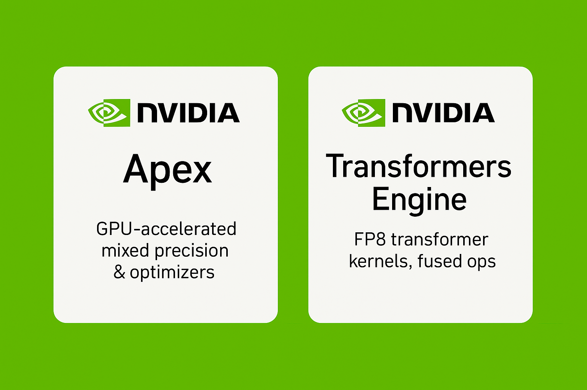

如果我们把训练和推理都看作是输入 token 和输出 token 的广义计算过程。那么这种在固定数据集上训练模型的任务，可以看作是请求速率可控的任务。训练是对一整个 Batch 的数据同时进行计算，得到 Batch 中每一条数据中的每一个 token 位置的预测。这样的计算过程是对整个批次的输入数据进行"批量推断"，同时得出"批量预测"的过程。**这样对计算硬件天生友好的负载特性，让工程师们专注于优化硬件的计算部分。通常来说模型训练的系统优化可以通过量化、定制 CUDA 内核等内部优化手段来进行改进**。

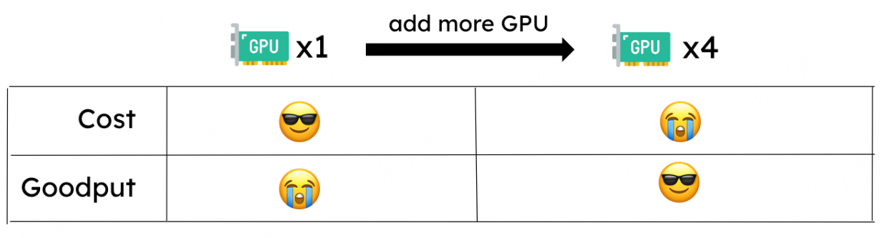

由于大模型服务占用大量 GPU 内存且计算成本高昂，在实际应用中，服务部署往往占据了主要的计算开销。在推理服务中，同样追求通过工程优化来降低成本。**延续我们之前的思路就不难发现，在实际的推理系统中，我们要优化的负载情况就复杂的多了。** 

其复杂性来源于三重异质性，而且这些在训练里通常被固定配置与离线调度所消解。

  1. 阶段异质性：Transformer 的自回归把计算拆成 Prefill 与 Decode 两段，前者像训练前向一样可在输入长度维度高并行；后者则逐 token 生成、单请求上难以并行。
  2. 序列异质性：不同请求的 prompt 长度与目标输出 token 数高度不确定，批内长短不一，容易产生拖尾与无效计算，还会放大 KV-Cache 占用；而在训练中通常通过固定 max_len、padding/packing、静态截断来抹平这一差异。
  3. 流量时变性：请求到达率与并发密度随时间强烈波动，很难长期维持稳定的批形状与规模；训练数据流则更稳定、可控。

**因此针对复杂的推理场景下的优化，我们不再可以将整个计算过程看作是一个“黑盒过程”。系统级别的调度设计可以直接带来极大的性能的提升。**就让我们来从推理的 Batching 技术开始，走进架构调度加速的领域吧！

### 推理过程负载特性带来的问题：Prefill 和 Decode

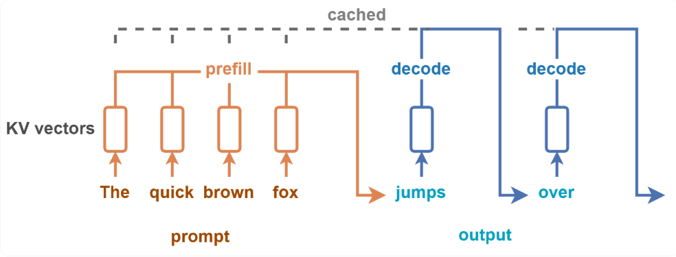

推理的过程中，由于 Transformer 架构下模型自回归输出的本质，整个计算过程会分成 Prefill 和 Decode 两个阶段。从计算的角度来看：首先会有一个初始的 token 序列作为 prompt 进行计算，LLM 会生成一系列补全 token，只有在生成停止 token 或达到最大序列长度时才会停止。**针对 prompt 的计算在 Prefill 阶段，所有输入标记的计算可以并行执行，而一系列的 token 则在 Decode 阶段产生，单个请求层面无法实现并行化**。

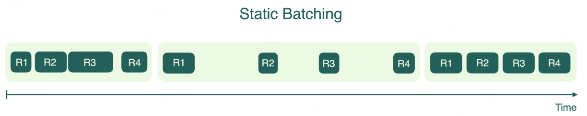

正因为 Decode 的串行瓶颈难以消除，早期许多推理引擎直接采用了静态批处理（static batching）：将到达请求凑成固定批形状（固定 batch size 与上限序列长度），统一对齐或填充后成批执行，以在 Prefill 阶段“吃满”算力，并在 Decode 阶段依靠批内并发来维持总体吞吐。

### 推理过程负载特性带来的问题：输出和输出长度的差异

从计算的角度来看，静态 Batching 也并不高效。在一个批次的请求中，当所有请求都完成了计算密集型的 Prefill 阶段后，会集体进入访存密集型的 Decode 阶段。这意味着 GPU 的计算单元会从接近满载的繁忙状态，突然转为大部分时间都在等待从显存中读取 KV Cache 的空闲状态。这导致了 GPU 计算利用率的"断崖式"下跌，在整个服务过程中形成了巨大的性能"气泡（Bubble），严重影响了系统的总吞吐量。

此外静态 Batching 为了对多个请求统一计算，往往在 Prefill 和 Decode 过程进行了 padding 操作。尤其是 Decode 阶段的逐 token 小算子上，padding 使无效算力占比显著增大。

### 静态 Batching 困境

静态 Batch 的策略是：请求被分批存放，仅当批次填满时才执行处理。上面的示意图中，一个 Batch 对四个请求进行推理；由于每个请求的 decode 生成 token 长度不同，批次中的首个完成推理的请求被迫等待最后一个请求，只有当一个 Batch 中的所有请求都完成推理后才会对下一个 Batch 的请求进行推理。这样的 Batch 策略显著增加单个请求的延迟。

因此，仅依赖静态批处理很难在真实线上工作负载下获得稳定且高效的资源利用率，需要能够跨请求、跨阶段持续重组的动态调度与批处理策略，即动态批处理。

## 动态 Batching 策略

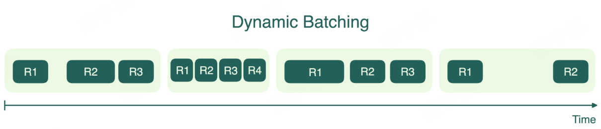

动态 Batching 缓解了了静态 Batching 最严重的延迟问题。这种方法仍会将到达的请求收集成批，但不强制要求固定的批次大小，而是设置一个时间窗口，处理该时间段内到达的所有请求。如果批次提前达到数量上限，就会立即启动处理。

动态批处理有助于平衡吞吐量和延迟。它能确保先到的请求不会被后续请求无限期延迟。然而，由于某些批次在启动时可能未完全填满，这种方法并不总能实现 GPU 的最高效率。另一个缺点是，与静态批处理类似，批次中最长的请求仍决定着整个批次的完成时间；短请求不得不进行不必要的等待。从下图中可以看到，当流量较少时，动态批处理能显著缩短等待时间。

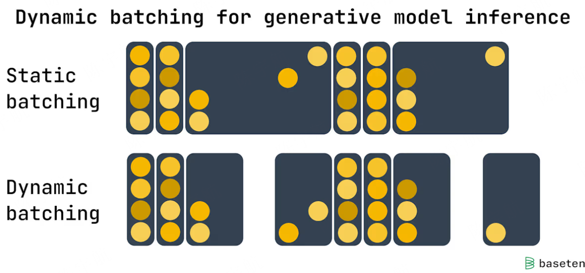

  如果模型服务器配置为每批次处理 16 个请求，时间窗口为 100 毫秒。当服务器收到第一个请求时，它将：

  - 在 100 毫秒内再接收 15 个请求并立即运行完整批次，或者
  - 接收少于 15 个请求并在 100 毫秒后运行部分批次。

动态批处理非常适合 Stable Diffusion  等模型的实时流量场景，其中每个推理请求耗时大致相同。具体部署的最佳设置取决于流量模式和延迟要求，但动态批处理能在多种选项间提供灵活性

### 调度器设计

此前的分析将推理引擎作为一个黑盒模型进行了整体性考量。但是，当我们深入到 Batching 策略的细节，特别是权衡系统吞吐量与请求延迟时，这种宏观视角便显现出其局限性。为了精准地建模和优化请求处理流程，我们必须将系统的功能解耦，**将其显式地抽象为两大模块：负责请求接收、排序和批次构建决策的调度器，以及负责执行底层模型计算的推理引擎**。

例如前文提到的 Static Batching：每次从请求队列中取出固定的一组请求组成一个 batch，发送给执行推理的引擎。直到这组请求完全推理结束后，调度器才会开始处理下一轮 batch。从下面的伪代码中可以看到，**调度器的设计是算法的一部分，而动态 Batching 正是在调度器的设计上进一步改进得到的算法。**

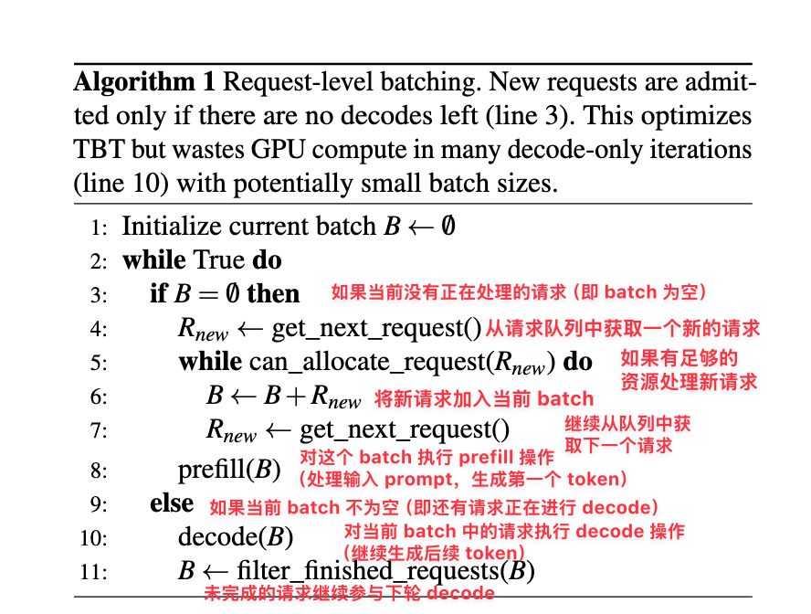

### 高效请求队列

在 GPU 上进行批量计算比单独处理每个请求更加高效和资源节约。使用后端请求队列才能使调度器能够选择多个请求并将它们放在同一个批次中进行处理。可以这样理解，一旦请求加入到推理引擎中，就无法再改变其顺序。

因此需要在用户请求和推理引擎之间创建一个中间过程，在这个中间过程中，我们对所有的请求是可以控制的。因此，**用户不会直接将请求发送到推理引擎后端，而是发送到一个 API 服务器（LLM-Server），在 API 服务器层面可以对队列部分进行设计来实现一些优先级划分，更优的 Batching 策略等**。

### 吞吐量 VS 有效吞吐量

动态 Batching 策略虽然缓解了延迟问题，但是并没有解决前面提到的推理过程中 Prefill 和 Decode 不同阶段计算特性差异带来的问题。

最大化推理的吞吐确实可以用来衡量整个推理系统的服务成本。针对推理系统，只考虑吞吐是远远不够的。在大模型推理的各个下游应用中。根据用户体验的延迟要求，对用户的 request 需要满足一系列性能服务水平目标（SLO），最常用的 SLO 指标有：首 Token 生成时间 TTFT 和单个输出标记时间 TPOT。

吐量衡量的是所有用户和请求完成的请求数或标记数，因此忽略了这些延迟要求。可以将用户单个请求的端到端延迟看作是 Prefill 和 decode 过程的总延迟。

**因此推理系统中的 Batching 策略应该在满足这些不同的 SLO 延迟指标的情况下，尽可能提升系统的推理吞吐。**具体到优化不同的 SLO 延迟指标，则不得不将 Prefill 和 Decode 阶段分开进行考虑。

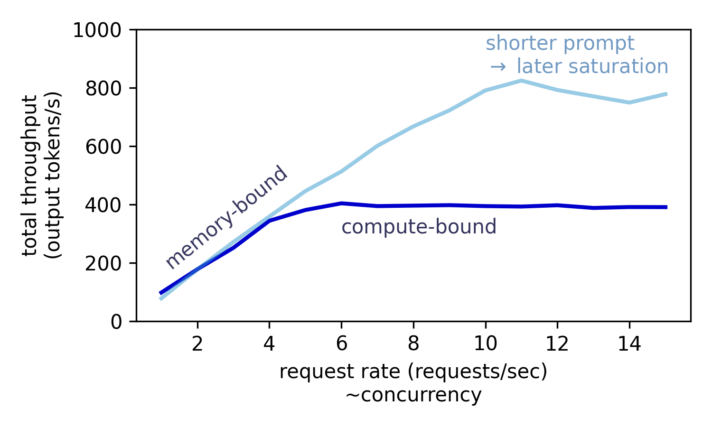

如图所示，当并发请求数为变量时，系统吞吐量在低并发区几乎呈线性增长。这是因为在访存受限的 Decode 阶段，增大 Batching 规模能有效提升 GPU 利用率。然而，一旦 GPU 利用率饱和，系统进入计算受限状态，即使再增加并发数，整体吞吐量也将趋于平稳，达到性能上限。**因此仅仅在调度器层面的设计是存在局限性的，我们需要进一步直面复杂的推理系统，对框架进一步拆解，从而在更深层次的设计空间中进一步探索优化的可能性**

## Selective Batching

Selective Batching 是 OSDI ’22 上发表的论文：Orca 中提出的调度/执行机制的一部分。**前面的调度方案都是在调度器层面进行设计的，而 Selective Batching 首次通过计算图对的拆解，提出了 “iteration-level scheduling（迭代级调度）”，并为了解决它与批处理的兼容问题，提出了 selective batching**：仅对选定算子做批（Attention 单独逐请求执行；非 Attention 算子将不同请求的 token 扁平化后做“按 token 批处理” 。**弄清 Selective Batching 是理解后面 Continuous Batching 的关键，让我们重新回顾这篇论文中的启发点**

### 从 Request 到 Iteration 调度

意识到传统 Batching 方法效率低下的问题。Orca 首次引入了 iteration-level scheduling，也就是常说的 Continous Batching 方法。**针对推理中每个 Request 的 Decode 长度不同的特性，这种调度策略中不再等待 batch 中所有序列生成完成，而是每轮迭代动态决定 batch 大小**。这样一来，batch 中的某个序列一旦完成生成，就可以立即被替换为新的请求，从而相比 Static Batching 显著提升了 GPU 的利用率。下图展示了 ORCA 采用迭代级调度（iteration-level scheduling）时的系统架构与整体工作流程：

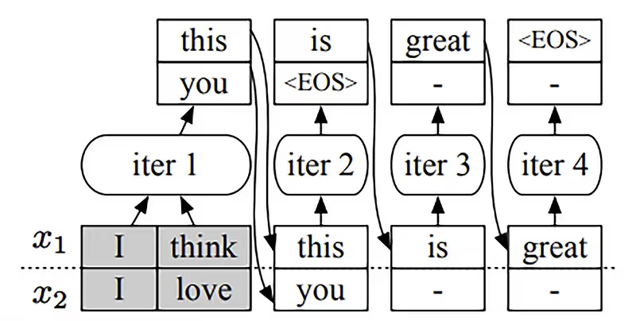

  1. 调度器首先决定下一步要运行哪些请求。
  2. 然后调用引擎对四个选中的请求（x₁, x₂, x₃, x₄）进行推理。对于首次被调度的请求，调度器会提供其输入 token 给引擎处理。本例中，x₃ 和 x₄
  尚未进行过任何迭代，因此调度器为 x₃ 提供了 (x₃₁, x₃₂)，为 x₄ 提供了 (x₃₁, x₄₂, x₄₃)。
  3. 接着，引擎对这四个请求执行了一轮模型推理。
  4. 并返回每个请求生成的一个输出 token（x₁₅, x₂₃, x₃₃, x₄₄）。

  一旦某个请求完成推理，请求池会移除该请求，并通知终端返回响应。

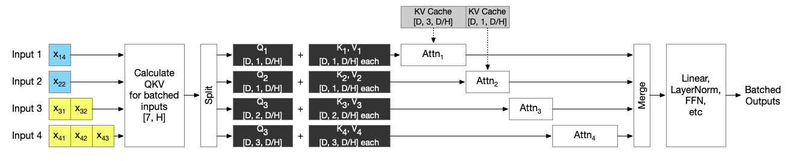

在示意图中，Orca 选择性批处理所有非注意力操作，而注意力操作则在分割输入后顺序执行。蓝色输入处于解码阶段，黄色输入处于预填充阶段。由于注意力操作相互独立，它们可以同时入队；GPU 调度器将决定注意力操作的执行顺序。上面是对 Orca 论文图的重新阐释

从本质上来看除了 Attention 操作，其余的 Linear 和 Norm 部分都是 token level 的计算，因此很自然可以将 Batch 和 Seq_len 维度进行合并为一个维度进行计算。

而 Self-Attention 的本质是“序列级”的。它的核心就是在序列内部的 Token 之间建立关系。要计算一个 Token 的输出，必须将它与同一序列中所有其他 Token 的 Key 进行点积运算，然后通过 Softmax 进行归一化。这意味着，序列中的任何一个 Token 的计算都依赖于整个序列。**因此每个请求的 mask、KV cache 和 token 位置可能不同，导致其张量形状不一致，无法直接合并处理。**

## Continous Batching

Orca 提出的 iteration-level scheduling 带来了调度队列设计新的可能，在同一个 Batch 中混合 Prefill 和 Decode 进一步提升了性能。

  混合批处理的核心优势在于：用一种任务填补另一种任务的资源空闲时间，在调度阶段人为混合了这两种计算阶段的流水线！

  具体表现为：

  - Prefill 阶段可以搭载在 Decode 阶段未被充分利用的算力上，提升整体算力利用率。
  - Decode 阶段可以和 Prefill 阶段共享一次权重读取，减少内存带宽压力，提高带宽利用率。

  这样，GPU 的计算单元和内存带宽都能被更充分利用，整体吞吐和 QPS 明显提升。

  下图展示了 Prefill 和 Decode 阶段中各个操作的算术强度（Arithmetic Intensity）。如下图所示，在 Prefill 阶段，即使 Batch Size 为 1，所有操作的算术强度依然很高。而在
  Decode 阶段，这些操作的算术强度下降了两个数量级以上，只有在 Batch Size 达到 256 这种极大值时，Decode 阶段才开始变得计算密集。

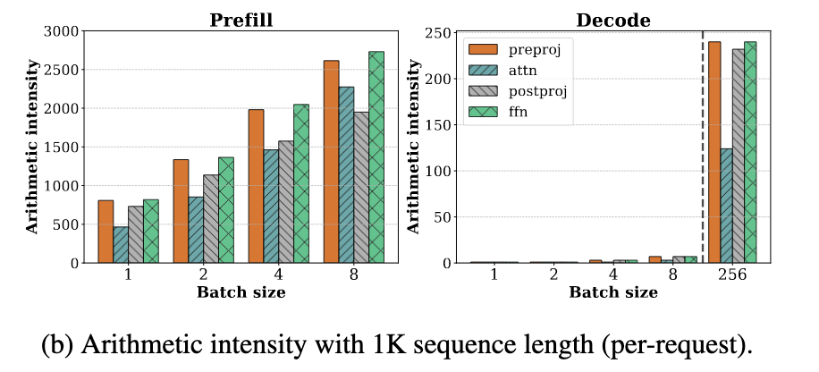

然而，将 batch size 扩展到如此之高在实际中几乎无法实现，因为每条请求的 KV cache 占用非常大。 例如，在 LLaMA-13B 模型上，使用 A6000 GPU，在序列长度为 1K 的情况下，最多只能容纳 18 条请求的 batch。因此，在当前可行的 batch size 范围内，decode 阶段仍然是内存瓶颈

### Seletive Batching 之上的极致优化

在上面的 Continuous Batching 示意图中，Orca 的实现并未将预填充阶段拆分为多个迭代，甚至完全没有对注意力机制进行批处理。**Orca 方案的的最大缺陷在于：它会按照最大 token 数量为 KV 缓存预分配内存空间。这样就无法进一步提升推理时的 Batch 大小，也就无法进一步提升推理时的吞吐**

伴随着 Paged Attention 这种新的内存管理技术 和 Flash Attention 的出现，Orca 当年的两个核心痛点得到了解决：

 - KV Cache 的空间与碎片问题：Orca 预留"最大生成长度"的 KV 空间，极易浪费；PagedAttention 把 KV 切块分页、按需分配，几乎消除碎片，让 Batch
  能做得更大、更"滚动"#ref1。
  - Attention 的算子层可批/融合问题：新的 Fused/IO-aware Attention 内核把原来"很难批、还很慢"的 Attention 做快做稳，合并成单 Kernel 执行（如 vLLM 的
  paged_attention_kernel），从而无需再把 Attention 单独拆开顺序跑；FlashAttention 也从 IO 角度显著降低了注意力的读写开销。

### Prefill first 调度策略

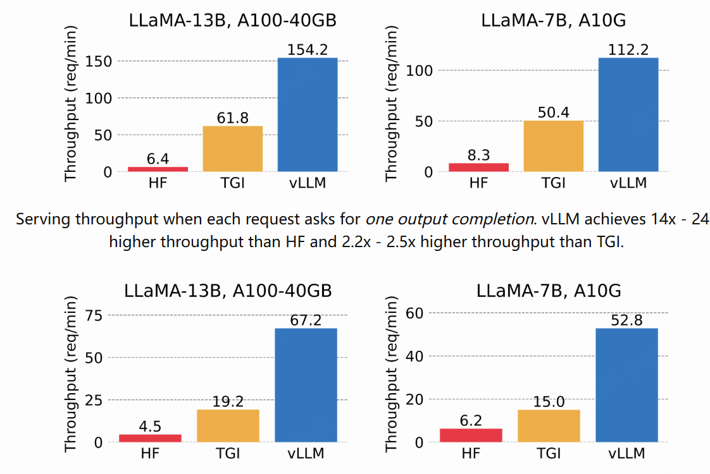

从上图中可以看到，得益于连续批处理技术,和 paged attention 的使用带来推理 Batch 的提升，现在可以在满足严苛延迟目标的同时，大幅提升 LLM 部署的吞吐量。在使用 Continuous Batching 的情况下，推理引擎的性能得到了最大的提升。

有了 Continous Batching 技术，我们还可以考虑如何在框架中，针对 Prefill 和 Decode 不同阶段分配算力。

通过上面的分析，由于 KV Cache 的限制，我们无法通过简单地增加批次大小来让 Decode 阶段摆脱内存瓶颈。这意味着，如果一个系统只处理 Decode 任务，必然会浪费掉 GPU 宝贵的计算资源。为了不浪费这些资源，我们必须找到一种方法来填补这些“计算空窗期”。计算密集的 Prefill 任务是完美的“填充物”。

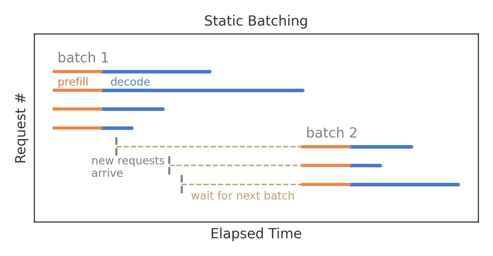

**我们再回头审视一下 Static Batching 策略对单个 Request 延迟的影响。其实针对单个 Request，由于 Static Batching 是连续解码的，可以看作是优化了每个输出标记的时间的，但是 GPU 资源的利用率很低，导致推理系统的吞吐低。因此在有大量用户请求的情况下，API 服务器的请求队列更有可能会造成请求堆积。一旦请求堆积了，那么单个 Request 的整体延迟就会明显上升。**

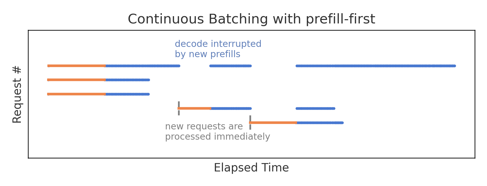

Prefill-first 的调度策略中新请求会立即得到处理，使得首 Token 的生成时间被最小化。但在每次 Prefill 的过程中，并发请求只能执行一次解码步骤，尽管其执行时间本应短得多。因此，采用这种策略时，预填充实际上会中断其他解码过程, 从而在推理过程中，token 间的延迟会较高。下图以 VLLM 推理引擎 V0 版本中的 Prefill first 调度策略为例

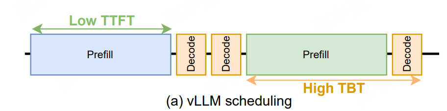

## 未完

## 推理引擎中的实现

## 引用与参考
- https://huggingface.co/blog/tngtech/llm-performance-prefill-decode-concurrent-requests
- https://hao-ai-lab.github.io/blogs/distserve/
- https://zhuanlan.zhihu.com/p/676109470
- https://github.com/cr7258/ai-infra-learning/tree/main/lesson/05-chunked-prefills
- https://huggingface.co/blog/tngtech/llm-performance-request-queueing
- https://www.databricks.com/blog/llm-inference-performance-engineering-best-practices

### 参考论文
- https://www.usenix.org/conference/osdi22/presentation/yu
- https://arxiv.org/abs/2403.02310
- 

